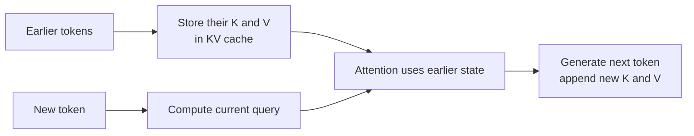
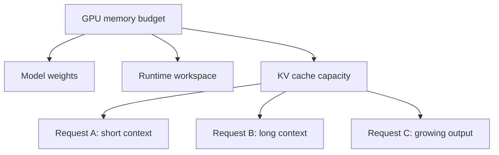
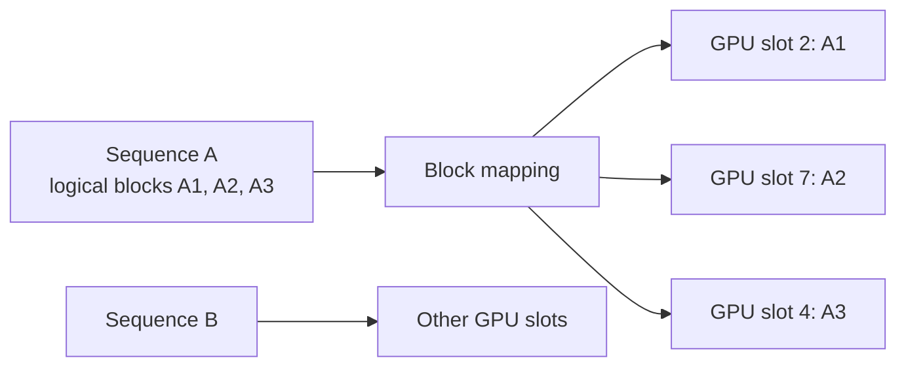
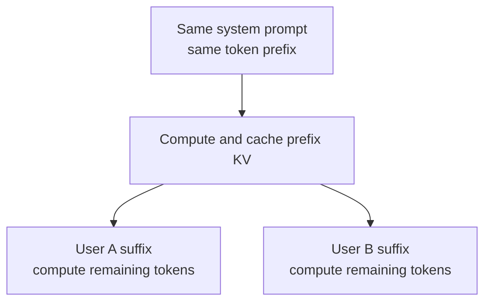
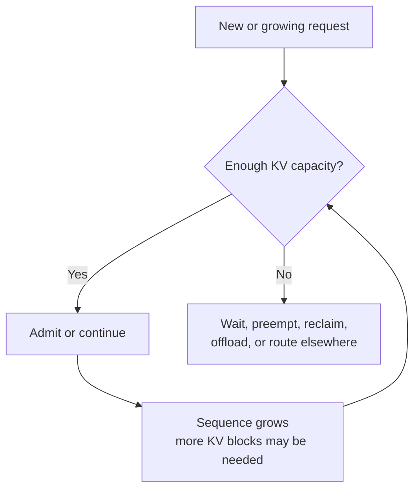
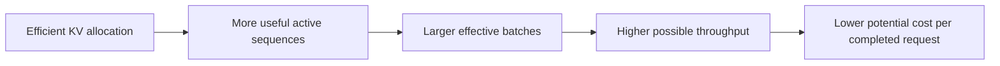

In [the previous article](../llm-serving-10000-requests/), the scheduler shared a model worker among many requests. But that raised another question: when hundreds of answers are being generated, where does the model keep the information needed to continue each one?

Consider a model writing: "Hanoi is the capital of..." To choose the next token, it needs information from the tokens already processed. Recomputing the entire prefix from scratch every time would be wasteful.

**KV cache** is one of the main ways an autoregressive Transformer avoids that repeated work. It is also one reason serving capacity depends on GPU memory, not just raw compute.

## 1. Attention needs information from previous tokens

Within Transformer attention, the model forms representations commonly called **queries (Q), keys (K), and values (V)**. For a new token, its query attends to keys from earlier tokens and combines their values. The keys and values for those earlier tokens have already been computed, so the serving engine can keep them for later generation steps.

The cache holds state across the model's relevant layers, not a little list of words. Its exact size depends on model architecture, context length, precision, and serving configuration. [NVIDIA's TensorRT-LLM documentation](https://nvidia.github.io/TensorRT-LLM/latest/features/kvcache.html) describes the cache as stored key-value pairs that avoid redundant generation work.

The model still attends to earlier context; caching avoids recomputing the earlier K and V projections at every step. It does not remove the cost of attention or make arbitrarily long context free.

## 2. KV cache is not an Agent's long-term memory

The word "cache" can be misleading if you have read about [Agent memory](../why-ai-forgets-memory/). These are different layers:

| Agent memory | KV cache |
| --- | --- |
| Application-level information to retrieve later | Temporary model computation state |
| May persist across conversations | Usually tied to active or reusable inference state |
| Example: a user's saved preference | Example: K and V tensors for an exact token prefix |

When a request ends, its active state can be released. An engine may deliberately retain some blocks for prefix reuse, but that is still an inference optimization, not a conversation history database or a vector store.

## 3. GPU memory has several competing uses

A serving GPU needs memory for model weights, runtime buffers, and KV state for active sequences. One user may have a 2,000-token context while another has 80,000 tokens. The longer sequence generally needs more KV state, though the exact amount varies by model design.

This is why concurrency is both a compute and a **memory-capacity** problem. More active requests need more state; longer contexts usually increase both prefill work and state size.

A model advertising a very large context window tells you what it can accept under supported conditions. It does not promise that a server can run thousands of maximum-length requests efficiently at once. Trimming, summarization, and retrieval still matter because they reduce irrelevant input *and* serving load.

## 4. Reserving each request's worst-case size wastes memory

Output length is uncertain. Request A may stop after 30 tokens, while B produces 3,000. If the engine reserves a huge contiguous region for every request in advance, much of the GPU memory can sit unused. Fragmentation can make the problem worse.

Paged allocation takes a different approach: divide KV state into blocks and assign more blocks as a sequence grows. The logical order of a request's blocks need not match their physical placement.

This is the intuition behind **PagedAttention**, introduced by the [vLLM research paper](https://arxiv.org/abs/2309.06180). It draws on the idea of virtual-memory paging to manage KV blocks more efficiently. The analogy is useful, but GPU KV management is not literally an operating system's page table.

Better allocation can allow more active sequences to fit and therefore more useful batching. It does not create memory out of nowhere, and actual gains depend on the workload.

## 5. Reusing a shared prefix avoids repeated prefill work

Suppose every customer-support request starts with the same long system instructions and company policy, then adds a different user question. Without reuse, the engine may process that common prefix again for each request.

**Prefix caching** lets a later request reuse previously computed KV blocks for an *identical token prefix*:

[vLLM's automatic prefix caching guide](https://docs.vllm.ai/en/latest/design/prefix_caching/) describes block reuse for matching prefixes. [NVIDIA also documents KV reuse](https://nvidia.github.io/TensorRT-LLM/latest/features/kvcache.html) across requests. The cache must still contain compatible blocks when the later request arrives; reuse is not guaranteed.

This is not semantic caching of final answers. Two prompts with similar *meanings* do not necessarily have the same token prefix. Prefix reuse mainly saves repeated prompt computation. It does not make generating each new output token automatically twice as fast.

Shared infrastructure must also consider privacy. vLLM documents optional cache salting to isolate prefix reuse across trust groups. A system should not let one tenant infer another tenant's private cached context through reuse behavior.

## 6. What happens when KV capacity runs out?

Suppose the worker is already running many sequences and a new request arrives. It cannot simply append unlimited KV state to a full memory pool. Depending on the engine and configuration, it may wait, preempt an active request, reclaim reusable blocks, offload state, or let another replica handle the work.

Not every engine supports every option, and each has a cost. Waiting raises latency. Offloading moves data and can be slower. Preemption may require work to be redone. Adding replicas costs more hardware.

This is why the scheduler and KV-cache manager cannot be designed independently. [vLLM's scheduler configuration](https://docs.vllm.ai/en/stable/configuration/engine_args/) explicitly discusses checking KV capacity before admitting a long request to avoid over-admission and repeated preemption.

## 7. KV management changes concurrency and cost

Two servers running the same model on comparable GPUs can support different numbers of simultaneous requests because of their batching, kernels, model precision, and memory management. KV allocation is one part of that system.

Every arrow is conditional. If the workload is not memory-limited, or if larger batches hurt latency targets, memory efficiency alone will not improve the product. Measure concurrency, TTFT, inter-token latency, throughput, and GPU memory together.

The useful mental model is:

> **KV cache saves repeated computation, but it occupies a limited memory budget while requests are active.**

That makes it both a performance optimization and a resource-management problem. From the application, the flow looks like "user, model, answer". Inside the serving engine, the scheduler, token state, KV blocks, and GPU memory decide how many users can share that model effectively.

