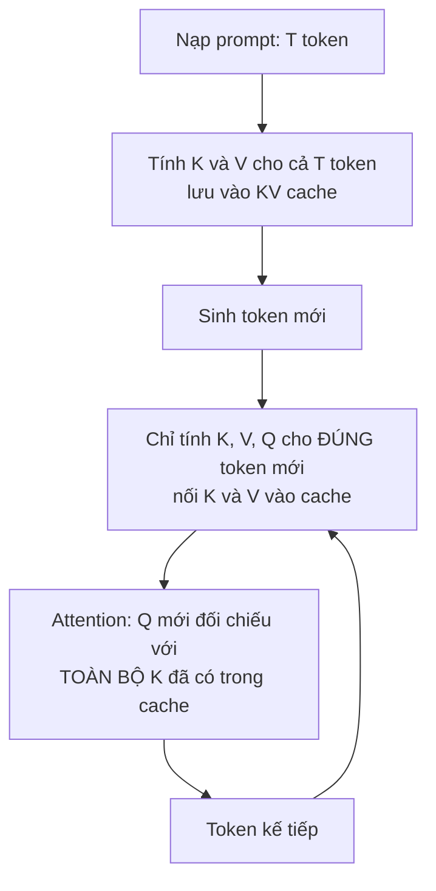

> **Mục tiêu bài học:** Sau bài này, bạn sẽ tính được **trước khi chạy** một lần gọi mô hình cần bao nhiêu bộ nhớ đệm cho mỗi token, kiểm được công thức ấy bằng số đo, hiểu vì sao kỹ thuật dùng chung khóa-giá trị cắt con số đó đi nhiều lần, và thấy một khoản bộ nhớ **lớn gấp mười lần KV cache** mà gần như không ai nhắc tới.

Bài 01 kết thúc ở một nghịch lý. Pha sinh token phải chạy qua **toàn bộ** mô hình cho mỗi token, nhưng thời gian sinh mỗi token lại **gần như không đổi** khi prompt dài lên 64 lần. Nếu mỗi token mới đều phải nhìn lại toàn bộ ngữ cảnh, sao chi phí không tăng theo ngữ cảnh?

Một nửa câu trả lời là KV cache: nó giúp mỗi token mới **không phải tính lại** toàn bộ ngữ cảnh. Nửa kia là một phép so sánh độ lớn ở cuối mục 1: mỗi token mới **vẫn phải đọc** toàn bộ KV cache của ngữ cảnh, nên chi phí ấy vẫn tăng theo độ dài - chỉ là ở dải bài 01 đo, nó còn quá nhỏ để hiện ra. Còn cái giá của KV cache - bộ nhớ - là một trong những thứ quyết định bạn phục vụ được bao nhiêu người cùng lúc.

## 1. Vì sao không phải tính lại

Chương Generative AI · Bài 03 đã dựng attention: mỗi token sinh ra ba vector - **truy vấn** (*query*), **khóa** (*key*), **giá trị** (*value*). Token đang xét dùng truy vấn của nó đối chiếu với khóa của mọi token trước để quyết định lấy bao nhiêu từ giá trị của từng token ấy.

Điểm mấu chốt: **khóa và giá trị của một token không bao giờ đổi.** Token thứ 5 đã được tính khóa và giá trị từ lúc nó xuất hiện; tới lượt sinh token thứ 600, khóa và giá trị của token thứ 5 vẫn y nguyên. Chỉ có **truy vấn** là mới, vì nó thuộc về token đang sinh.

Vậy thì lưu lại.



Không có cache thì mỗi bước sinh phải tính lại khóa và giá trị cho **tất cả** token đã có. Có cache thì mỗi bước chỉ tính cho **một** token, rồi nối thêm vào.

Nhưng đừng đọc thành "có cache thì mỗi token tốn như nhau bất kể ngữ cảnh". Attention của token mới vẫn phải **đọc toàn bộ** khóa và giá trị đã lưu - đó chính là việc nhìn lại ngữ cảnh. Với attention đầy đủ, chi phí mỗi token vẫn tăng xấp xỉ **tuyến tính** theo độ dài:

```
không cache:  mỗi token mới → tính lại cả tiền tố qua mọi lớp      → tăng rất nhanh
có cache:     mỗi token mới → chỉ tính cho chính nó
                              + đọc lại K, V của mọi token trước   → rẻ hơn nhiều,
                                                                      nhưng vẫn tăng theo ngữ cảnh
```

Vậy vì sao TPOT ở bài 01 phẳng? Làm phép so sánh độ lớn. Ở ngữ cảnh 4.096 token, KV cache của bản 1.5B là 4.096 × 28 KiB ≈ **117 MB** phải đọc thêm mỗi bước - so với **3.087 MB** trọng số mà mỗi bước đằng nào cũng đọc. Chỉ thêm khoảng **3,8%** số byte. Nếu pha sinh thuần nghẽn băng thông, TPOT sẽ tăng cỡ ấy - từ khoảng 17,3 lên 17,9 ms. Mà các dòng TPOT ở bài 01 dao động ±0,3 ms giữa các điểm đo, cùng cỡ với mức tăng dự đoán. **Phần tăng có thật, nhưng ở dải này nó quá nhỏ so với nhiễu đo để hiện ra.** Nó thành đáng kể khi KV của **mọi** yêu cầu cộng lại: ở batch 32 và ngữ cảnh 4.096, KV phải đọc mỗi bước là khoảng 3,76 GB - đã hơn cả trọng số.

Cache phải nằm đâu đó, và chỗ ấy là VRAM.

## 2. Tính trước, bằng công thức

Trước khi đo, hãy tính. Một token cần lưu một vector khóa và một vector giá trị, **ở mỗi lớp**:

$$\text{byte mỗi token} = 2 \times L \times N_{kv} \times d_h \times b$$

trong đó $L$ là số lớp, $N_{kv}$ là số đầu khóa-giá trị, $d_h$ là số chiều mỗi đầu, $b$ là số byte mỗi con số. Số 2 ở đầu là vì có **hai** thứ phải lưu: khóa và giá trị.

Chú ý công thức **không có** số tham số và **không có** kích thước batch hay độ dài. Nó là chi phí cho *một* token của *một* chuỗi. Tổng bộ nhớ cache thì nhân thêm với độ dài và số chuỗi đang chạy song song:

$$\text{tổng} = \text{byte mỗi token} \times T \times B$$

Thay số ba mô hình trong họ Qwen2.5, ở 16-bit ($b=2$):

| Mô hình | $L$ | Đầu truy vấn | $N_{kv}$ | $d_h$ | **KiB mỗi token** | Nếu không dùng chung | Tỉ lệ |
|---|---|---|---|---|---|---|---|
| Qwen2.5-0.5B | 24 | 14 | 2 | 64 | **12,0** | 84,0 | 7× |
| Qwen2.5-1.5B | 28 | 12 | 2 | 128 | **28,0** | 168,0 | **6×** |
| Qwen2.5-7B | 28 | 28 | 4 | 128 | **56,0** | 392,0 | 7× |

**Cột áp chót là chỗ đáng nhìn.** Chương Generative AI · Bài 03 đã đo trên bản 0.5B: 14 đầu truy vấn nhưng chỉ 2 đầu khóa-giá trị. Kỹ thuật ấy tên là **dùng chung khóa-giá trị theo nhóm** (*grouped-query attention*, GQA): nhiều đầu truy vấn chia nhau một bộ khóa và giá trị. Truy vấn vẫn riêng cho từng đầu, nên khả năng biểu diễn giữ được phần lớn; nhưng **cache chỉ phải lưu theo số đầu khóa-giá trị**, không theo số đầu truy vấn.

Với bản 7B, đó là khác biệt giữa **56 KiB** và **392 KiB** cho mỗi token. Ở một cuộc hội thoại 2.048 token, tức khác biệt giữa **112 MiB** và **784 MiB** - cho **một** người dùng.

> ⚠️ **Tỉ lệ ấy không phải hằng số.** Rất dễ nhìn hai dòng 0.5B và 7B rồi kết luận "Qwen luôn dùng tỉ lệ 7×". Dòng giữa bác bỏ điều đó: bản 1.5B có **12 đầu truy vấn và 2 đầu khóa-giá trị**, tức **6×**. Tỉ lệ GQA là một **lựa chọn thiết kế của từng mô hình**, không phải đặc trưng của họ mô hình hay của kỹ thuật. Muốn biết mô hình bạn đang dùng thì đọc `num_attention_heads` và `num_key_value_heads` trong tệp cấu hình của chính nó - mất năm giây và tránh được một giả định sai.

## 3. Công thức ấy có đúng không?

Công thức là công thức. Giờ mở cache ra đếm.

Nạp một prompt rồi lấy đúng các tensor mà mô hình giữ lại, trên Qwen2.5-1.5B, bfloat16, RTX 3060:

| Độ dài prompt | Số tensor giữ lại | Tổng byte | **Byte mỗi token** | Dạng một tensor |
|---|---|---|---|---|
| 512 | 56 | 14.680.064 | **28.672** | `(1, 2, 512, 128)` |
| 2.048 | 56 | 58.720.256 | **28.672** | `(1, 2, 2048, 128)` |

Công thức cho 1.5B là $2 \times 28 \times 2 \times 128 \times 2 = 28.672$ byte. Số đo: **28.672**. Khớp tuyệt đối.

Cả ba con số trong dạng tensor đều đọc thẳng ra ý nghĩa: **2** là số đầu khóa-giá trị, **128** là $d_h$, và chiều thứ ba là độ dài. 56 tensor là $28$ lớp $\times\ 2$ (một cho khóa, một cho giá trị).

Một phép kiểm chặt hơn: thay vì đếm tensor, đo **độ dốc** của bộ nhớ theo độ dài ngữ cảnh.

| Ngữ cảnh (token) | KV cache đo được (MB) |
|---|---|
| 512 | 14,7 |
| 1.024 | 29,4 |
| 2.048 | 58,7 |
| 4.096 | 117,4 |
| 8.192 | 234,9 |

Độ dốc giữa hai đầu: $(234.881.024 - 14.680.064) \div (8.192 - 512) = \mathbf{28.672}$ byte mỗi token. Sai lệch so với công thức: **0,000%**.

KV cache **tuyến tính theo độ dài ngữ cảnh**, và hệ số chính là công thức. Không có gì bí ẩn ở đây - đó là điều tốt, vì nó có nghĩa bạn **lập kế hoạch bộ nhớ được** trước khi triển khai.

> ⚠️ **Ba nguồn số, đừng trộn.** Bài này dùng hai nguồn: **công thức** và **phép đo bằng PyTorch**. Còn một nguồn thứ ba là con số mà bộ máy phục vụ tự báo cáo - nhưng bộ máy như vLLM **dành trước** một vùng VRAM theo tỉ lệ cấu hình (mặc định `gpu_memory_utilization = 0.9`) rồi chia vùng ấy thành các khối, nên con số nó báo là *sức chứa đã cấp phát*, không phải *lượng đang dùng*, và càng không so sánh trực tiếp được với hai nguồn trên. Bài 06 sẽ đọc nguồn thứ ba ấy và nói rõ nó đo cái gì.

## 4. Nhưng bộ nhớ thật không chỉ có KV

Đây là chỗ phép đo cho một kết quả mà tôi không đi tìm.

Ở bảng trên tôi đọc kích thước các tensor cache. Nhưng nếu đo **tổng lượng bộ nhớ được cấp phát thêm** trong cùng lượt chạy ấy, con số lớn hơn hẳn:

| Ngữ cảnh | KV cache | Cấp phát thêm | Chênh |
|---|---|---|---|
| 2.048 | 58,7 MB | 691,1 MB | 11,8× |
| 8.192 | 234,9 MB | 2.724,2 MB | 11,6× |

Gấp gần **mười hai lần**. Thủ phạm không khó tìm khi ta chịu nhìn:

| Ngữ cảnh | Dạng tensor logits | Byte |
|---|---|---|
| 2.048 | `(1, 2048, 151936)` | 622.329.856 |
| 8.192 | `(1, 8192, 151936)` | 2.489.319.424 |

Ở ngữ cảnh 8.192, **logits + KV = 2.724.200.448 byte**, còn mức cấp phát đo được là **2.724.200.448 byte**. Khớp từng byte. Logits chiếm **91,4%**.

Lý do rất tầm thường khi đã thấy. Từ vựng của mô hình này có **151.936** token. Một lượt chạy xuôi trả về **phân bố trên toàn bộ từ vựng cho mọi vị trí**, nên logits tốn:

$$151.936 \times 2 \text{ byte} = 296{,}8 \text{ KiB mỗi token}$$

so với **28 KiB mỗi token** của KV cache. Tức **gấp 10,6 lần**.

Và đây là chỗ nó thành bài học hệ thống chứ không phải chuyện vặt. Khi **sinh** token, bạn chỉ cần logits của **vị trí cuối cùng** - 296,8 KiB, một lần, không nhân với độ dài. Nhưng một lượt chạy xuôi ngây thơ lại dựng logits cho **tất cả** vị trí. Bộ máy phục vụ chuyên dụng cắt bỏ đúng chỗ này, và đó là một trong những lý do nó tiết kiệm bộ nhớ hơn vòng lặp tự viết.

Nên bức tranh bộ nhớ khi suy luận **không** phải "trọng số cộng KV cache". Ít nhất phải là:

```
   trọng số
 + KV cache
 + hoạt hóa và vùng làm việc tạm thời   ← logits nằm ở đây, và nó có thể lớn nhất
 + chi phí của runtime và bộ cấp phát   ← gồm cả phần đã giữ chỗ nhưng chưa dùng, và phân mảnh
 ─────────────────────────────────────
 = bộ nhớ GPU thực sự tiêu thụ
```

Bài 03 sẽ mổ từng khoản. Điều cần nhớ ngay: **hoạt hóa tạm thời không phải khoản nhỏ**, và ước lượng bộ nhớ chỉ gồm trọng số với KV cache sẽ hụt.

## 5. Bỏ cache đi thì mất gì

Câu hỏi tự nhiên: cache đáng giá bao nhiêu? Tắt nó đi rồi đo.

Prompt 128 token, sinh $N$ token, cùng mô hình, cùng card:

| $N$ | Có cache (s) | Không cache (s) | Tỉ lệ thời gian | **Tỉ lệ công việc** |
|---|---|---|---|---|
| 64 | 1,362 | 2,234 | 1,64× | **53×** |
| 128 | 2,736 | 4,807 | 1,76× | **96×** |
| 256 | 5,221 | 12,102 | 2,32× | **171×** |
| 512 | - | - | - | **307×** |

Cột cuối là số **vị trí token phải xử lý**, tính bằng số học chứ không đo: có cache thì tốn $P + (N-1)$ lượt xử lý một token; không cache thì bước thứ $i$ phải xử lý lại cả $P+i$ token, tổng là $\sum_{i=0}^{N-1}(P+i)$.

Nhìn hai cột cuối cạnh nhau là thấy điều lạ. Ở $N=256$, bỏ cache bắt máy làm **171 lần** khối lượng tính toán, mà thời gian chỉ dài thêm **2,32 lần**.

Vì sao? Không đơn giản là "card đang rỗi 99% nên ăn thêm miễn phí". Khi bỏ cache, mỗi bước phải xử lý lại **cả** $P+i$ token cùng lúc - tức mỗi bước trở thành một lượt **giống pha nạp prompt**, với mật độ tính toán cỡ $P+i$ FLOP/byte thay vì 1. Bài 01 đã đo: pha nạp vài trăm token chạy ở 65-74% trần tính toán, còn pha sinh ở batch 1 chỉ 0,65%. Nên khối lượng dôi ra được làm ở **hiệu suất cao hơn hẳn**: nhiều gấp 171 lần về phép tính, nhưng mỗi phép tính rẻ hơn nhiều.

Nên phát biểu cho đúng: **ở quy mô nhỏ này, KV cache không phải là thứ làm mô hình nhanh lên nhiều lần.** Giá trị thật của nó nằm ở hai chỗ khác.

**Một: chi phí không có cache tăng theo bình phương.** Cột "tỉ lệ công việc" đi 53 → 96 → 171 → 307 khi $N$ nhân đôi mỗi lần. Ở ngữ cảnh vài nghìn token thay vì vài trăm, mỗi bước tính lại đã chạm trần tính toán, và lúc ấy tỉ lệ thời gian mới bám theo tỉ lệ công việc. Toy setting này **chưa** chạm tới chỗ đó.

**Hai: cache đổi tính toán lấy bộ nhớ.** Và bộ nhớ mới là thứ khan hiếm - mục 6.

> ⚠️ **Cột thời gian ở bảng này đo lúc máy chủ đang có tải trung bình khoảng 35 trên 20 nhân**, do người khác dùng chung máy. Tôi đọc bảng theo **tỉ lệ giữa hai cột** - cả hai chịu cùng điều kiện - chứ không đọc theo số giây tuyệt đối. Hai cột "tỉ lệ công việc" thì không bị ảnh hưởng vì chúng là số học.

## 6. KV cache giới hạn số người phục vụ cùng lúc

Đây là lý do bài này tồn tại trong một chương về hệ thống.

Card RTX 3060 có **12,49 GB**. Qwen2.5-1.5B ở bf16 chiếm **3,087 GB** trọng số. Còn lại khoảng **9,4 GB**, trừ đi chi phí runtime.

Ở **28 KiB mỗi token**, chỗ trống ấy chứa được khoảng:

$$\frac{9{,}4 \times 10^9}{28.672} \approx 328.000 \text{ token}$$

Nếu mỗi cuộc hội thoại dài trung bình 2.048 token, bạn phục vụ được khoảng **160 người cùng lúc** - *nếu* KV cache là thứ duy nhất chiếm chỗ, điều mà mục 4 vừa cho thấy là không đúng.

Giờ làm lại phép tính ấy với bản **7B**, mô hình mà chương này thật sự nhắm tới. Trọng số 16-bit của nó khoảng **15,2 GB** - **lớn hơn cả card**. Chưa cần nói tới KV cache, chưa cần một người dùng nào, mô hình đã không nạp nổi.

Đó là bài 03.

Và nếu bản 7B ấy **không** dùng chung khóa-giá trị, mỗi token tốn 392 KiB thay vì 56 KiB. Một cuộc hội thoại 2.048 token sẽ ngốn **784 MiB** cache cho một người. GQA không phải mẹo vi chỉnh - nó là thứ biến "phục vụ vài người" thành "phục vụ vài trăm người" trên cùng một card.

Nhưng KV không phải giới hạn duy nhất. Bài 11 sẽ đo một máy chủ chạm trần **256 yêu cầu chạy cùng lúc** của bộ lập lịch khi KV mới dùng **28%**, và một lần khác bộ máy sập vì một tensor tạm cỡ logits khi KV mới dùng **15,9%**. Tính KV cho biết một trần; chạm trần nào trước thì phải đo.

> 🔧 **Thử ngay:** bạn phải chọn mô hình cho một trợ lý nội bộ chạy trên card 24 GB, ngữ cảnh 8.000 token, cần phục vụ 50 người cùng lúc. Mô hình A có 24 lớp, 32 đầu truy vấn, 8 đầu khóa-giá trị, $d_h = 128$. Bạn kiểm gì?
> Tính trước khi tải. KV mỗi token của A là $2 \times 24 \times 8 \times 128 \times 2 = 98.304$ byte, tức **96 KiB**. Nhân với 8.000 token là **750 MiB mỗi người**; nhân 50 người là **37,5 GB** - vượt card, dù chưa tính trọng số. Kết luận không phải "đổi mô hình" mà là ba lựa chọn có thật: **giảm ngữ cảnh** (4.000 token thì còn 18,7 GB, vẫn chật), **giảm số người cùng lúc**, hoặc **nén KV cache** - lượng tử hóa chính cache xuống 8-bit chia đôi con số ấy. Điều quan trọng là phép tính này mất hai phút và làm được **trước** khi tải 40 GB trọng số về.

## Tóm tắt bài học

- Khóa và giá trị của một token **không đổi theo thời gian**, nên lưu lại được. Đó là KV cache: mỗi token mới không phải tính lại ngữ cảnh - nhưng **vẫn phải đọc lại** toàn bộ KV của ngữ cảnh, nên chi phí mỗi token vẫn tăng theo độ dài. TPOT ở bài 01 phẳng vì ở ngữ cảnh 4.096, phần đọc thêm ấy chỉ khoảng **3,8%** so với đọc trọng số - cùng cỡ nhiễu đo.
- Công thức tính trước được, không cần chạy: $2 \times L \times N_{kv} \times d_h \times b$ byte cho **mỗi token của mỗi chuỗi**. Nó không phụ thuộc số tham số.
- Đo trên Qwen2.5-1.5B: công thức cho **28.672 byte/token**, đếm tensor cho **28.672**, độ dốc bộ nhớ theo ngữ cảnh cho **28.672**. Sai lệch **0,000%** - KV cache tuyến tính theo độ dài, nên lập kế hoạch bộ nhớ được.
- **Dùng chung khóa-giá trị** cắt cache theo tỉ lệ đầu truy vấn trên đầu khóa-giá trị: bản 7B tốn **56 KiB/token** thay vì **392 KiB/token**. Nhưng tỉ lệ ấy **không phải hằng số** - 0.5B và 7B là 7×, còn 1.5B chỉ **6×**. Phải đọc cấu hình của chính mô hình mình dùng.
- Một khoản bộ nhớ **lớn hơn KV cache 10,6 lần** mà ít được nhắc: **logits**. Ở từ vựng 151.936 token, logits tốn **296,8 KiB/token** so với 28 KiB của KV. Đo ở ngữ cảnh 8.192: logits + KV khớp **từng byte** với mức cấp phát, và logits chiếm **91,4%**.
- Nên bức tranh bộ nhớ tối thiểu phải là **trọng số + KV cache + hoạt hóa tạm thời + chi phí runtime và bộ cấp phát**, chứ không phải hai khoản đầu.
- Bỏ cache ở $N=256$ bắt máy làm **171 lần** khối lượng tính toán nhưng chỉ chậm đi **2,32 lần**, vì mỗi bước tính lại là một lượt giống pha nạp prompt, chạy ở hiệu suất cao hơn hẳn pha sinh. Giá trị thật của cache **ở quy mô này** không phải tốc độ, mà là **chặn đà tăng theo bình phương** và **đổi tính toán lấy bộ nhớ**.
- Bộ nhớ mới là thứ khan hiếm, và KV cache là **một trong các** giới hạn số người dùng chung được một card - cùng với trần số chỗ của bộ lập lịch, hoạt hóa tạm thời và bộ nhớ của runtime, như bài 11 sẽ đo. Với bản 7B thì câu hỏi ấy còn chưa đặt ra được - trọng số **15,2 GB** đã lớn hơn card **12,49 GB**.

## Câu hỏi tự kiểm tra

1. Vì sao khóa và giá trị lưu lại được mà truy vấn thì không?
2. Một mô hình có 32 lớp, 32 đầu truy vấn, 8 đầu khóa-giá trị, $d_h = 128$, chạy ở 16-bit. Tính KV cache cho một token, rồi cho một chuỗi 4.000 token, rồi cho 16 chuỗi như vậy chạy song song.
3. Công thức KV cache không chứa số tham số của mô hình. Giải thích vì sao, và nêu một hệ quả thực tế của điều đó.
4. Bản 0.5B và 7B đều có tỉ lệ GQA là 7×, còn 1.5B là 6×. Điều đó nói gì về cách bạn nên tra thông số một mô hình lạ?
5. Ở ngữ cảnh 8.192 token, logits chiếm 91,4% lượng bộ nhớ cấp phát thêm của một lượt chạy xuôi. Vì sao khi **sinh** token thì con số ấy không còn đúng, và bộ máy phục vụ khai thác điều đó thế nào?
6. Bỏ cache làm máy tính nhiều gấp 171 lần nhưng chỉ chậm 2,32 lần. Dùng số đo ở bài 01 để giải thích, và dự đoán điều gì xảy ra với tỉ lệ ấy khi ngữ cảnh lên vài chục nghìn token.
7. Vì sao con số KV cache mà một bộ máy phục vụ tự báo cáo không so trực tiếp được với con số bạn đo bằng PyTorch?
8. Bạn có card 24 GB và một mô hình 7B ở 16-bit dùng GQA 56 KiB/token. Ngữ cảnh 16.000 token thì phục vụ được tối đa bao nhiêu người cùng lúc, và bạn cần kiểm thêm gì trước khi tin con số đó?

## Đọc thêm

**Nguồn nền tảng của bài:**

| Nguồn | Đọc phần nào |
|---|---|
| **Chương Generative AI · Bài 03** | Truy vấn, khóa, giá trị - và phép đo 14 đầu truy vấn / 2 đầu khóa-giá trị |
| **Bài 01 của chương này** | Vì sao pha sinh token chỉ dùng 0,65% khả năng tính toán, nền cho mục 5 |

**Đi sâu hơn:**

- [Shazeer - Fast Transformer Decoding: One Write-Head is All You Need (2019)](https://arxiv.org/abs/1911.02150) - ý tưởng gốc của việc dùng chung khóa-giá trị, và phân tích đúng vấn đề băng thông ở bài 01.
- [Ainslie et al. - GQA: Training Generalized Multi-Query Transformer Models (EMNLP 2023)](https://arxiv.org/abs/2305.13245) - dạng theo nhóm đang được dùng trong họ Qwen2.5.
- [Kwon et al. - Efficient Memory Management for LLM Serving with PagedAttention (SOSP 2023)](https://arxiv.org/abs/2309.06180) - vì sao cấp phát KV cache thành một khối liền lãng phí, và cách chia thành khối nhỏ; bài 06 sẽ đo điều này.

**Mã nguồn của bài:** [`code/b02_kvcache.py`](../../code/ai-systems/b02_kvcache.py) - công thức, đếm tensor, độ dốc bộ nhớ, và cái giá của việc bỏ cache; [`code/b02b.py`](../../code/ai-systems/b02b.py) - kiểm giả thuyết logits và tính tỉ lệ công việc.

> **Bài tiếp theo:** [12 GB: chưa chạy đã hết chỗ](../12-gb-out-of-memory-before-it-runs-vi/) - bài này kết thúc ở chỗ bản 7B có trọng số 15,2 GB còn card chỉ 12,49 GB. Bài sau nạp nó lên thật để xem lỗi trông như thế nào, rồi mổ từng khoản bộ nhớ GPU - và cho thấy vì sao phép cộng "trọng số cộng KV cache" luôn ra thiếu.
