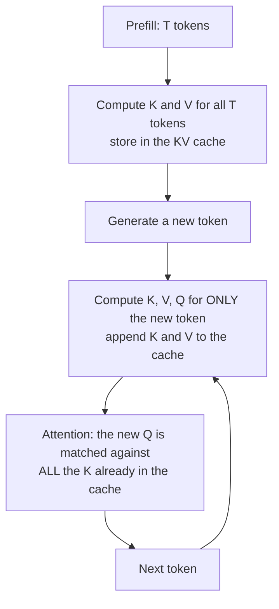

> **Learning objectives:** After this lesson, you will be able to compute **before running** how much cache memory a model call needs per token, check that formula against measurements, understand why sharing keys and values cuts that number many times over, and see a memory cost **ten times larger than the KV cache** that almost nobody mentions.

Lesson 01 ended on a paradox. Decode has to run through the **entire** model for every token, yet the time per token stays **almost constant** as the prompt grows 64 times longer. If every new token has to look back at the whole context, why does the cost not grow with the context?

Half of the answer is the KV cache: it spares each new token from **recomputing** the whole context. The other half is an order-of-magnitude comparison at the end of section 1: each new token **still has to read** the entire KV cache of the context, so that cost still grows with length - it is just too small to show up in the range lesson 01 measured. As for the price of the KV cache - memory - it is one of the things that decide how many people you can serve at once.

## 1. Why nothing needs recomputing

Generative AI chapter · Lesson 03 built attention: each token produces three vectors - a **query**, a **key**, and a **value**. The current token matches its query against the keys of every earlier token to decide how much to take from each of those tokens' values.

The crux: **a token's key and value never change.** Token 5 had its key and value computed when it appeared; by the time token 600 is generated, token 5's key and value are exactly the same. Only the **query** is new, because it belongs to the token being generated.

So store them.



Without a cache, each decode step has to recompute keys and values for **all** existing tokens. With a cache, each step computes them for **one** token, then appends.

But do not read this as "with a cache every token costs the same regardless of context". The new token's attention still has to **read all** the stored keys and values - that is exactly the act of looking back at the context. With full attention, the cost per token still grows roughly **linearly** with length:

```
no cache:     each new token → recompute the whole prefix through all layers  → grows very fast
with cache:   each new token → compute only for itself
                              + reread K, V of every earlier token            → much cheaper,
                                                                                 but still grows with context
```

So why is TPOT flat in lesson 01? Do an order-of-magnitude comparison. At a 4,096-token context, the KV cache of the 1.5B model is 4,096 × 28 KiB ≈ **117 MB** of extra reading per step - compared with the **3,087 MB** of weights that every step reads anyway. That is only about **3.8%** more bytes. If decode were purely bandwidth-bound, TPOT would rise by about that much - from roughly 17.3 to 17.9 ms. But the TPOT rows in lesson 01 fluctuate by ±0.3 ms between measurement points, the same size as the predicted increase. **The increase is real, but in this range it is too small relative to measurement noise to show up.** It becomes significant when the KV of **all** requests adds up: at batch 32 and a 4,096 context, the KV read per step is about 3.76 GB - already more than the weights.

The cache has to live somewhere, and that place is VRAM.

## 2. Computing ahead, with a formula

Before measuring, compute. A token needs to store one key vector and one value vector, **at every layer**:

$$\text{bytes per token} = 2 \times L \times N_{kv} \times d_h \times b$$

where $L$ is the number of layers, $N_{kv}$ is the number of key-value heads, $d_h$ is the dimension of each head, and $b$ is the number of bytes per number. The leading 2 is there because there are **two** things to store: keys and values.

Note that the formula contains **no** parameter count and **no** batch size or length. It is the cost for *one* token of *one* sequence. Total cache memory is then multiplied by the length and the number of sequences running in parallel:

$$\text{total} = \text{bytes per token} \times T \times B$$

Plugging in three models from the Qwen2.5 family, at 16-bit ($b=2$):

| Model | $L$ | Query heads | $N_{kv}$ | $d_h$ | **KiB per token** | Without sharing | Ratio |
|---|---|---|---|---|---|---|---|
| Qwen2.5-0.5B | 24 | 14 | 2 | 64 | **12.0** | 84.0 | 7× |
| Qwen2.5-1.5B | 28 | 12 | 2 | 128 | **28.0** | 168.0 | **6×** |
| Qwen2.5-7B | 28 | 28 | 4 | 128 | **56.0** | 392.0 | 7× |

**The second-to-last column is the one worth looking at.** Generative AI chapter · Lesson 03 measured the 0.5B model: 14 query heads but only 2 key-value heads. That technique is called **grouped-query attention** (GQA): several query heads share one set of keys and values. Queries remain separate for each head, so most of the representational power is kept; but **the cache only has to store per key-value head**, not per query head.

For the 7B model, that is the difference between **56 KiB** and **392 KiB** per token. For a 2,048-token conversation, that is the difference between **112 MiB** and **784 MiB** - for **one** user.

> ⚠️ **That ratio is not a constant.** It is very easy to look at the 0.5B and 7B rows and conclude "Qwen always uses a 7× ratio". The middle row refutes that: the 1.5B model has **12 query heads and 2 key-value heads**, which is **6×**. The GQA ratio is a **design choice of each model**, not a property of the model family or of the technique. To know the model you are using, read `num_attention_heads` and `num_key_value_heads` in its own config file - it takes five seconds and avoids a wrong assumption.

## 3. Is that formula right?

A formula is a formula. Now open the cache and count.

Prefill a prompt and then take exactly the tensors the model keeps, on Qwen2.5-1.5B, bfloat16, RTX 3060:

| Prompt length | Tensors kept | Total bytes | **Bytes per token** | Shape of one tensor |
|---|---|---|---|---|
| 512 | 56 | 14,680,064 | **28,672** | `(1, 2, 512, 128)` |
| 2,048 | 56 | 58,720,256 | **28,672** | `(1, 2, 2048, 128)` |

The formula for 1.5B gives $2 \times 28 \times 2 \times 128 \times 2 = 28{,}672$ bytes. Measured: **28,672**. An exact match.

All three numbers in the tensor shape read directly as meaning: **2** is the number of key-value heads, **128** is $d_h$, and the third dimension is the length. The 56 tensors are $28$ layers $\times\ 2$ (one for keys, one for values).

A stricter check: instead of counting tensors, measure the **slope** of memory with respect to context length.

| Context (tokens) | Measured KV cache (MB) |
|---|---|
| 512 | 14.7 |
| 1,024 | 29.4 |
| 2,048 | 58.7 |
| 4,096 | 117.4 |
| 8,192 | 234.9 |

The slope between the two ends: $(234{,}881{,}024 - 14{,}680{,}064) \div (8{,}192 - 512) = \mathbf{28{,}672}$ bytes per token. Deviation from the formula: **0.000%**.

The KV cache is **linear in context length**, and the coefficient is exactly the formula. There is nothing mysterious here - which is good, because it means you **can plan memory** before deploying.

> ⚠️ **Three sources of numbers, do not mix them.** This lesson uses two sources: **the formula** and **measurement with PyTorch**. There is a third source, the number a serving engine reports about itself - but an engine like vLLM **reserves** a region of VRAM according to a configured fraction (by default `gpu_memory_utilization = 0.9`) and then divides that region into blocks, so the number it reports is *allocated capacity*, not *amount in use*, and even less is it directly comparable with the two sources above. Lesson 06 will read that third source and say clearly what it measures.

## 4. But real memory is not just KV

This is where the measurement gave a result I was not looking for.

In the table above I read the sizes of the cache tensors. But if you measure **the total additional memory allocated** in that same run, the number is far larger:

| Context | KV cache | Additional allocation | Ratio |
|---|---|---|---|
| 2,048 | 58.7 MB | 691.1 MB | 11.8× |
| 8,192 | 234.9 MB | 2,724.2 MB | 11.6× |

Nearly **twelve times** larger. The culprit is not hard to find once we bother to look:

| Context | Logits tensor shape | Bytes |
|---|---|---|
| 2,048 | `(1, 2048, 151936)` | 622,329,856 |
| 8,192 | `(1, 8192, 151936)` | 2,489,319,424 |

At an 8,192 context, **logits + KV = 2,724,200,448 bytes**, and the measured allocation is **2,724,200,448 bytes**. A byte-for-byte match. Logits account for **91.4%**.

The reason is mundane once you see it. This model's vocabulary has **151,936** tokens. A forward pass returns **a distribution over the entire vocabulary for every position**, so logits cost:

$$151{,}936 \times 2 \text{ bytes} = 296.8 \text{ KiB per token}$$

compared with **28 KiB per token** for the KV cache. That is **10.6 times** larger.

And this is where it becomes a systems lesson rather than a trivia item. When **decoding**, you only need the logits for **the last position** - 296.8 KiB, once, not multiplied by length. But a naive forward pass builds logits for **all** positions. Dedicated serving engines cut exactly this, and it is one of the reasons they use less memory than a hand-written loop.

So the memory picture during inference is **not** "weights plus KV cache". At the very least it must be:

```
   weights
 + KV cache
 + activations and temporary workspace   ← logits live here, and they can be the largest
 + runtime and allocator overhead        ← includes reserved-but-unused memory, and fragmentation
 ─────────────────────────────────────
 = GPU memory actually consumed
```

Lesson 03 will dissect each item. What to remember right now: **temporary activations are not a small item**, and a memory estimate that only includes weights and the KV cache will come up short.

## 5. What you lose without the cache

A natural question: how much is the cache worth? Turn it off and measure.

A 128-token prompt, generating $N$ tokens, same model, same GPU:

| $N$ | With cache (s) | Without cache (s) | Time ratio | **Work ratio** |
|---|---|---|---|---|
| 64 | 1.362 | 2.234 | 1.64× | **53×** |
| 128 | 2.736 | 4.807 | 1.76× | **96×** |
| 256 | 5.221 | 12.102 | 2.32× | **171×** |
| 512 | - | - | - | **307×** |

The last column is the number of **token positions to process**, computed arithmetically rather than measured: with a cache it takes $P + (N-1)$ single-token passes; without a cache step $i$ has to reprocess all $P+i$ tokens, for a total of $\sum_{i=0}^{N-1}(P+i)$.

Put the last two columns side by side and something odd appears. At $N=256$, dropping the cache forces the machine to do **171 times** the computation, yet the time is only **2.32 times** longer.

Why? It is not simply "the GPU is 99% idle so the extra work is free". Without a cache, each step has to reprocess **all** $P+i$ tokens at once - so each step becomes a pass **like prefill**, with an arithmetic intensity of about $P+i$ FLOP/byte instead of 1. Lesson 01 measured it: prefilling a few hundred tokens runs at 65-74% of the compute ceiling, while decode at batch 1 is only 0.65%. So the extra workload is done at **much higher efficiency**: 171 times more operations, but each operation is much cheaper.

So the correct statement is: **at this small scale, the KV cache is not what makes the model many times faster.** Its real value lies in two other places.

**One: the cost without a cache grows quadratically.** The "work ratio" column goes 53 → 96 → 171 → 307 as $N$ doubles each time. At contexts of a few thousand tokens instead of a few hundred, each recompute step already hits the compute ceiling, and only then does the time ratio track the work ratio. This toy setting has **not** reached that point.

**Two: the cache trades compute for memory.** And memory is the scarce resource - section 6.

> ⚠️ **The time columns in this table were measured while the server had a load average of about 35 on 20 cores**, from other people sharing the machine. I read the table as **the ratio between the two columns** - both under the same conditions - not as absolute seconds. The "work ratio" column is unaffected because it is arithmetic.

## 6. The KV cache limits how many people you can serve at once

This is why this lesson exists in a chapter about systems.

The RTX 3060 has **12.49 GB**. Qwen2.5-1.5B in bf16 takes **3.087 GB** of weights. That leaves about **9.4 GB**, minus runtime overhead.

At **28 KiB per token**, that free space holds about:

$$\frac{9.4 \times 10^9}{28{,}672} \approx 328{,}000 \text{ tokens}$$

If each conversation averages 2,048 tokens, you can serve about **160 people at once** - *if* the KV cache is the only thing taking up space, which section 4 just showed is not true.

Now redo that calculation with the **7B** model, the model this chapter is really aiming at. Its 16-bit weights are about **15.2 GB** - **larger than the GPU itself**. Before we even get to the KV cache, before a single user, the model cannot be loaded.

That is lesson 03.

And if that 7B model did **not** share keys and values, each token would cost 392 KiB instead of 56 KiB. A 2,048-token conversation would eat **784 MiB** of cache for one person. GQA is not a fine-tuning trick - it is what turns "serving a few people" into "serving a few hundred people" on the same GPU.

But KV is not the only limit. Lesson 11 will measure a server hitting the scheduler's ceiling of **256 concurrently running requests** while KV was only **28%** used, and another time the engine crashing on a logits-sized temporary tensor while KV was only **15.9%** used. Computing KV tells you one ceiling; which ceiling you hit first has to be measured.

> 🔧 **Try it now:** you have to pick a model for an internal assistant running on a 24 GB GPU, with an 8,000-token context, serving 50 people at once. Model A has 24 layers, 32 query heads, 8 key-value heads, $d_h = 128$. What do you check?
> Compute before downloading. A's KV per token is $2 \times 24 \times 8 \times 128 \times 2 = 98{,}304$ bytes, which is **96 KiB**. Times 8,000 tokens is **750 MiB per person**; times 50 people is **37.5 GB** - more than the GPU, even before counting weights. The conclusion is not "switch models" but three real options: **reduce the context** (4,000 tokens leaves 18.7 GB, still tight), **reduce concurrent users**, or **compress the KV cache** - quantizing the cache itself to 8-bit halves that number. The important thing is that this calculation takes two minutes and can be done **before** downloading 40 GB of weights.

## Lesson summary

- A token's key and value **do not change over time**, so they can be stored. That is the KV cache: each new token does not have to recompute the context - but it **still has to reread** the whole KV of the context, so the cost per token still grows with length. TPOT in lesson 01 is flat because at a 4,096 context that extra reading is only about **3.8%** compared with reading the weights - the same size as measurement noise.
- The formula can be computed ahead, without running: $2 \times L \times N_{kv} \times d_h \times b$ bytes for **each token of each sequence**. It does not depend on the parameter count.
- Measured on Qwen2.5-1.5B: the formula gives **28,672 bytes/token**, counting tensors gives **28,672**, the slope of memory against context gives **28,672**. Deviation **0.000%** - the KV cache is linear in length, so memory can be planned.
- **Sharing keys and values** cuts the cache by the ratio of query heads to key-value heads: the 7B model costs **56 KiB/token** instead of **392 KiB/token**. But that ratio is **not a constant** - 0.5B and 7B are 7×, while 1.5B is only **6×**. You have to read the config of the model you actually use.
- A memory cost **10.6 times larger than the KV cache** that is rarely mentioned: **logits**. With a 151,936-token vocabulary, logits cost **296.8 KiB/token** versus 28 KiB for KV. Measured at an 8,192 context: logits + KV match the allocation **byte for byte**, and logits account for **91.4%**.
- So the minimum memory picture must be **weights + KV cache + temporary activations + runtime and allocator overhead**, not just the first two items.
- Dropping the cache at $N=256$ forces the machine to do **171 times** the computation but only makes it **2.32 times** slower, because each recompute step is a prefill-like pass, running at much higher efficiency than decode. The real value of the cache **at this scale** is not speed, but **stopping quadratic growth** and **trading compute for memory**.
- Memory is the scarce resource, and the KV cache is **one of the** limits on how many users can share a GPU - along with the scheduler's slot ceiling, temporary activations and runtime memory, as lesson 11 will measure. For the 7B model that question cannot even be asked yet - its **15.2 GB** of weights are already larger than the **12.49 GB** GPU.

## Self-check questions

1. Why can keys and values be stored but queries cannot?
2. A model has 32 layers, 32 query heads, 8 key-value heads, $d_h = 128$, running at 16-bit. Compute the KV cache for one token, then for one 4,000-token sequence, then for 16 such sequences running in parallel.
3. The KV cache formula does not contain the model's parameter count. Explain why, and give one practical consequence of that.
4. The 0.5B and 7B models both have a GQA ratio of 7×, while 1.5B is 6×. What does that say about how you should look up the specs of an unfamiliar model?
5. At an 8,192-token context, logits account for 91.4% of the additional memory allocated in a forward pass. Why does that number no longer hold when **decoding**, and how do serving engines exploit this?
6. Dropping the cache makes the machine compute 171 times more but only 2.32 times slower. Use the measurements from lesson 01 to explain, and predict what happens to that ratio when the context reaches tens of thousands of tokens.
7. Why can the KV cache number a serving engine reports about itself not be compared directly with the number you measure with PyTorch?
8. You have a 24 GB GPU and a 7B model at 16-bit using GQA at 56 KiB/token. With a 16,000-token context, how many people can you serve at most at once, and what else do you need to check before trusting that number?

## Further reading

**Foundational sources for this lesson:**

| Source | What to read |
|---|---|
| **Generative AI chapter · Lesson 03** | Queries, keys, values - and the measurement of 14 query heads / 2 key-value heads |
| **Lesson 01 of this chapter** | Why decode uses only 0.65% of compute capacity, the groundwork for section 5 |

**Going further:**

- [Shazeer - Fast Transformer Decoding: One Write-Head is All You Need (2019)](https://arxiv.org/abs/1911.02150) - the original idea of sharing keys and values, and an analysis of exactly the bandwidth problem in lesson 01.
- [Ainslie et al. - GQA: Training Generalized Multi-Query Transformer Models (EMNLP 2023)](https://arxiv.org/abs/2305.13245) - the grouped form used in the Qwen2.5 family.
- [Kwon et al. - Efficient Memory Management for LLM Serving with PagedAttention (SOSP 2023)](https://arxiv.org/abs/2309.06180) - why allocating the KV cache as one contiguous block is wasteful, and how to split it into small blocks; lesson 06 will measure this.

**Source code for this lesson:** [`code/b02_kvcache.py`](../../code/ai-systems/b02_kvcache.py) - the formula, tensor counting, memory slope, and the cost of dropping the cache; [`code/b02b.py`](../../code/ai-systems/b02b.py) - tests the logits hypothesis and computes the work ratio.

> **Next lesson:** [12 GB: Out of Memory Before It Even Runs](../12-gb-out-of-memory-before-it-runs/) - this lesson ends with the 7B model having 15.2 GB of weights and the GPU only 12.49 GB. The next lesson actually loads it to see what the error looks like, then dissects each item of GPU memory - and shows why the sum "weights plus KV cache" always comes up short.
