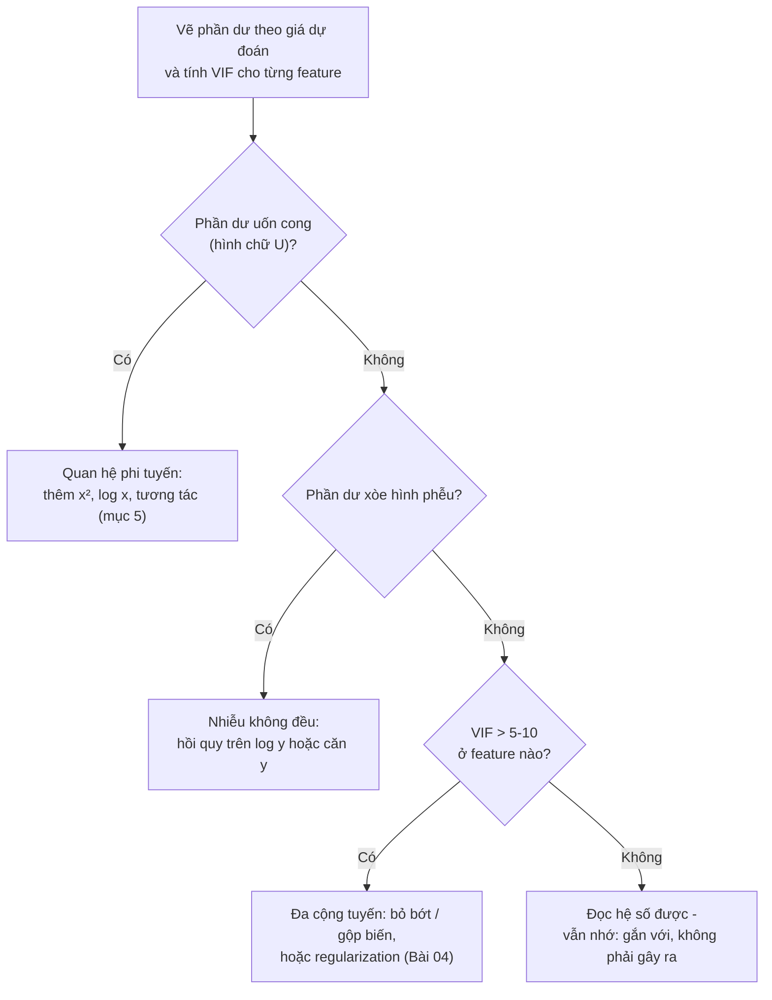

> **Mục tiêu bài học:** Sau bài này, bạn sẽ đọc được hệ số hồi quy đúng cách ("giữ các biến khác cố định"), hiểu vì sao bình phương tối thiểu chính là MSE, dùng R² để biết đường thẳng khớp đến đâu, nhận ra ba dấu hiệu giả định "thẳng" đang sai (phi tuyến, nhiễu không đều, đa cộng tuyến) và biết mở rộng mô hình bằng biến giả, tương tác và số hạng bậc hai.

## 1. Thợ ống nước nhận thêm việc: từ một biến sang nhiều biến

Foundations · Bài 01 mở đầu bằng người thợ ống nước: làm 3 giờ tính 350 nghìn, 2 giờ tính 250 nghìn, và bạn nhẩm ra `tiền = 50 + 100 × giờ`. Đó là **hồi quy tuyến tính đơn (simple linear regression)**: một feature, một đường thẳng, hai núm vặn.

Giờ hóa đơn có thêm cột "số thiết bị thay", và thợ chỉ thêm một đơn giá: `tiền = 50 + 100 × giờ + 200 × thiết_bị`. Mỗi feature có một **hệ số (coefficient)** - "đơn giá" của nó - và cả mô hình có chung một **hệ số chặn (intercept)**:

$$\hat{y} = \beta_0 + \beta_1 x_1 + \beta_2 x_2 + \dots + \beta_p x_p$$

Đó là **hồi quy tuyến tính bội (multiple linear regression)**. Với 2 feature, "đường thẳng" thành một mặt phẳng (sách *An Introduction to Statistical Learning*, Hình 3.4); với 8 feature như California Housing, nó là "siêu phẳng" bạn không vẽ được nhưng máy tính được. Mô hình của Bài 01 chính là phương trình này với p = 8.

Máy tìm 9 hệ số bằng **bình phương tối thiểu (least squares)**: chọn bộ hệ số làm tổng bình phương phần dư $e_i = y_i - \hat{y}_i$ (residual sum of squares - RSS) nhỏ nhất - chia cho số điểm là ra MSE của Foundations · Bài 10, hai tên gọi một việc. Địa hình loss ở đây là lòng chảo lồi nên nghiệm giải thẳng ra được bằng một công thức: `LinearRegression` của scikit-learn chỉ gọi hàm `scipy.linalg.lstsq`, không phải dò dẫm xuống núi trong sương mù. Phương pháp này ra đời trong ngành thiên văn năm 1801, khi Gauss (24 tuổi) dùng nó tìm lại tiểu hành tinh Ceres đã mất dấu.

<details>
<summary><b>Đào sâu: Ceres, Gauss và phân phối chuẩn</b></summary>

Đầu năm 1801, Ceres được phát hiện, theo dõi khoảng 40 ngày rồi mất dấu trong ánh sáng Mặt Trời. Gauss dùng bình phương tối thiểu ước lượng quỹ đạo từ các quan sát có sai số; cuối năm đó các nhà thiên văn tìm lại Ceres đúng vùng trời ông dự báo (Actuaries Institute). Legendre công bố phương pháp năm 1805, Gauss năm 1809 kèm tuyên bố đã dùng từ 1795 - một tranh chấp tác quyền nổi tiếng. Sách *Dive into Deep Learning* chỉ ra một mối liên hệ sâu xa hơn: Gauss cũng là người tìm ra phân phối chuẩn, và bình phương tối thiểu chính là ước lượng hợp lý cực đại (maximum likelihood) khi nhiễu tuân theo phân phối chuẩn.

</details>

> 🔧 **Thử ngay:** Hai hóa đơn: 2 giờ → 250 nghìn, 3 giờ → 350 nghìn. Tính RSS của `tiền = 50 + 100 × giờ` và của `tiền = 100 + 80 × giờ`.
>
> *Đáp số:* mô hình 1 đoán đúng cả hai → RSS = 0. Mô hình 2 đoán 260 và 340 → phần dư −10 và +10 → RSS = 100 + 100 = **200**. Bình phương tối thiểu chọn mô hình 1.

## 2. Đọc hệ số: "giữ các biến khác cố định"

Quay lại California Housing với đúng cách chia của Bài 01, trước hết với một biến - thu nhập:

```python
import pandas as pd
from sklearn.datasets import fetch_california_housing
from sklearn.model_selection import train_test_split
from sklearn.pipeline import Pipeline
from sklearn.preprocessing import StandardScaler
from sklearn.linear_model import LinearRegression

X, y = fetch_california_housing(as_frame=True, return_X_y=True)
X_train, X_test, y_train, y_test = train_test_split(X, y, test_size=0.2, random_state=42)

simple_model = LinearRegression().fit(X_train[["MedInc"]], y_train)
print(f"giá ≈ {simple_model.intercept_:.3f} + {simple_model.coef_[0]:.3f} × MedInc")   # → giá ≈ 0.445 + 0.419 × MedInc
print("R² test:", round(simple_model.score(X_test[["MedInc"]], y_test), 3))   # → 0.459
```

Đọc: mỗi đơn vị MedInc (khoảng 10.000 USD thu nhập trung vị) *gắn với* giá nhà cao hơn ≈ 0,419, tức ≈ 41.900 USD. Giờ đủ 8 biến (đơn vị gốc, chưa scale):

| Feature | Hệ số | Feature | Hệ số |
|---|---|---|---|
| MedInc | +0,449 | AveOccup | −0,0035 |
| HouseAge | +0,0097 | Latitude | −0,420 |
| AveRooms | −0,123 | Longitude | −0,434 |
| AveBedrms | +0,783 | *(hệ số chặn)* | −37,02 |

Hệ số trong hồi quy bội có một mệnh đề bắt buộc khi đọc: **"giữ các biến khác cố định"**. MedInc = 0,449: giữa hai nhóm dân cư giống hệt nhau về 7 cột còn lại, nhóm có MedInc cao hơn 1 đơn vị có giá dự đoán cao hơn 0,449. Thử với một dòng test: mô hình đoán 0,719; tăng MedInc thêm 1 mà giữ nguyên 7 cột kia, dự đoán thành 1,168 - đúng bằng 0,719 + 0,449. HouseAge = +0,0097: cùng thu nhập, vị trí, cỡ nhà, nhà *cũ hơn* 10 năm lại gắn với giá *cao hơn* khoảng 9.700 USD.

Hai điều phải nhớ:

**Gắn với không phải là gây ra (association ≠ causation).** Nhà cũ không làm giá tăng; nhà cũ thường ở khu đã phát triển lâu, gần trung tâm - thứ mô hình không có cột để ghi nhận. Sách *An Introduction to Statistical Learning* có ví dụ khó quên: hồi quy số vụ cá mập tấn công lên doanh số kem cho hệ số dương rõ rệt, nhưng cấm bán kem không cứu được ai - trời nóng kéo cả hai lên, và thêm biến nhiệt độ vào là hệ số của kem biến mất.

**Hệ số đổi khi bạn đổi những biến "giữ cố định".** AveRooms hồi quy một mình cho hệ số **+0,077**; đứng chung 8 biến thành **−0,123**. AveBedrms ngược lại: một mình −0,137, đứng chung +0,783. Không có gì hỏng: hai cột tương quan 0,84, nên "giữ AveBedrms cố định mà tăng AveRooms" là thêm phòng *không phải* phòng ngủ - một câu hỏi khác hẳn. Sách *An Introduction to Statistical Learning* có đúng hiện tượng này với quảng cáo báo giấy: có ý nghĩa khi đứng một mình, về gần 0 khi đứng cạnh radio - báo giấy chỉ "hưởng ké" công của radio vì hai ngân sách hay đi cùng nhau. Mục 4 sẽ gọi tên hiện tượng này.

## 3. Hệ số nào nặng ký hơn? Chuyện scale - và R²

Bảng trên không cho phép so hệ số với nhau: Population −0,000002 *mỗi người*, AveBedrms +0,783 *mỗi phòng ngủ* - khác đơn vị, như so 100 nghìn/giờ với 200 nghìn/thiết bị. `StandardScaler` (Foundations · Bài 12) giải quyết việc đó: sau khi scale, các cột cùng đơn vị "một độ lệch chuẩn", và hệ số cùng trả lời một câu hỏi - *feature này lệch một độ lệch chuẩn thì giá đổi bao nhiêu?*

```python
model = Pipeline([("scale", StandardScaler()), ("lr", LinearRegression())]).fit(X_train, y_train)

# Hệ số trên feature ĐÃ scale: so được với nhau vì các cột cùng đơn vị "1 độ lệch chuẩn"
coefficients = pd.Series(model["lr"].coef_, index=X.columns).sort_values(key=abs, ascending=False)
print(coefficients.round(3))
print("Hệ số chặn:", round(model["lr"].intercept_, 3))
print("R² train:", round(model.score(X_train, y_train), 3), "| R² test:", round(model.score(X_test, y_test), 3))
```

```
Latitude     -0.897
Longitude    -0.870
MedInc        0.854
AveBedrms     0.339
AveRooms     -0.294
HouseAge      0.123
AveOccup     -0.041
Population   -0.002
Hệ số chặn: 2.072
R² train: 0.613 | R² test: 0.576
```

Ba đòn bẩy lớn: **vĩ độ, kinh độ, thu nhập** - mỗi thứ lệch một độ lệch chuẩn thì giá đổi gần 0,9 (≈ 90.000 USD). Lên phía bắc hay vào sâu đất liền (kinh độ tăng) thì rẻ đi - đúng cảm nhận "Fresno rẻ hơn San Francisco" cuối Bài 01. Hệ số chặn 2,072 đúng bằng giá trung bình tập train: feature đã về trung bình 0 thì "nhóm dân cư trung bình" có giá trung bình - một phép tự kiểm tra hữu ích.

Còn **R²** (Foundations · Bài 15) - phần biến động của giá được giải thích so với đoán trung bình: một biến MedInc cho 0,459 trên test; tám biến cho 0,576 trên test, 0,613 trên train. Với hồi quy đơn, R² trên dữ liệu fit bằng bình phương tương quan: $r = 0{,}691$ giữa MedInc và giá cho $R^2 = 0{,}477$. Sách *An Introduction to Statistical Learning* nhấn mạnh: **thêm biến thì R² trên train chỉ có tăng, không bao giờ giảm**, dù biến đó vô dụng - thêm báo giấy đẩy R² của `Advertising` từ 0,89719 lên 0,8972. Nên so mô hình bằng R² trên test hoặc validation (Foundations · Bài 04, 14).

> ⚠️ **Lưu ý nhỏ:** "nặng ký" theo hệ số đã scale là *dự đoán đổi nhiều khi feature lệch một độ lệch chuẩn trong dữ liệu này* - không phải "nguyên nhân quan trọng", và phụ thuộc phân bố tập train. Hệ số của các biến tương quan mạnh với nhau còn kém ổn định - xem mục 4.

## 4. Khi đường thẳng nói dối: ba dấu hiệu cần soi

Sách *An Introduction to Statistical Learning* (mục 3.3.3) liệt kê sáu vấn đề khi khớp đường thẳng; ba vấn đề hay gặp nhất là **phi tuyến**, **nhiễu không đều**, **đa cộng tuyến**. Công cụ chẩn đoán hai vấn đề đầu là **đồ thị phần dư (residual plot)** - phần dư $y - \hat{y}$ theo giá dự đoán: nếu đường thẳng "nói thật", phần dư trông như nhiễu ngẫu nhiên quanh 0, không hoa văn.

**Phi tuyến (non-linearity).** Phần dư uốn hình chữ U là dấu hiệu quan hệ thật là đường cong. Trong sách, hồi quy `mpg` lên `horsepower` (dữ liệu `Auto`) cho phần dư chữ U rõ rệt; thêm `horsepower²`, hoa văn biến mất và R² tăng từ 0,606 lên 0,688. Trên California Housing, trung bình phần dư theo mức giá dự đoán là +0,25 (đoán dưới 1), −0,13 (1-2), +0,32 (3-4), −0,14 (trên 4) - không quanh 0. Lý do nằm ở scatter thu nhập - giá của Bài 01:

```
Giá trung bình (×100.000 USD) theo nhóm thu nhập MedInc - 20.640 dòng

5,0 |                                          ● 4,82   ← trần 5,0
    |                                  ● 4,43
4,0 |                                              Đường thẳng phải chọn:
    |                          ● 3,45              khớp đoạn dốc bên trái
3,0 |                                              hay đoạn phẳng bên phải?
    |                  ● 2,45
2,0 |          ● 1,68
    |  ● 1,12
1,0 |
    +------+-------+-------+-------+-------+-------+--> MedInc
       0-2    2-4     4-6     6-8    8-10   10-15
```

Quan hệ gần thẳng rồi bẻ ngang khi chạm trần 5,0; một đường thẳng không thể vừa dốc vừa phẳng nên lệch có hệ thống ở hai đầu - và ở đầu thấp chạy quá đà xuống dưới 0: 15 dự đoán giá âm của Bài 01 là hệ quả trực tiếp.

**Nhiễu không đều (heteroscedasticity).** Hồi quy tuyến tính giả định nhiễu lớn như nhau ở mọi mức giá; phần dư xòe hình **phễu** là dấu hiệu giả định đó sai - trên California Housing, độ lệch chuẩn phần dư tăng đều từ 0,48 (đoán dưới 1) lên 0,97 (đoán trên 4). Cách chữa kinh điển: hồi quy trên $\log y$ hoặc $\sqrt{y}$ để "nén" giá trị lớn.

**Đa cộng tuyến (multicollinearity).** Khi hai feature gần như nói cùng một điều, mô hình không tách được công từng cái: hệ số lật dấu, lắc mạnh khi dữ liệu đổi chút ít, sai số chuẩn phình to - chính là chuyện AveRooms - AveBedrms ở mục 2. Cặp thứ hai bất ngờ hơn: Latitude và Longitude tương quan **−0,92**, vì bờ biển California chạy chéo từ tây bắc xuống đông nam.

Thước đo là **VIF (variance inflation factor - hệ số phóng đại phương sai)**: hồi quy từng feature lên các feature còn lại lấy $R^2_j$, rồi $\text{VIF}_j = 1/(1 - R^2_j)$. VIF = 1 là không cộng tuyến; quy ước hay dùng: vượt 5 hoặc 10 là đáng lo. Tập train California Housing: Latitude 9,21; Longitude 8,88; AveRooms 7,92; AveBedrms 6,61; bốn cột còn lại 1,01-2,54. Trong sách, `limit` (hạn mức) và `rating` (điểm tín dụng) của dữ liệu `Credit` đạt VIF khoảng 160 - cộng tuyến hạng nặng.



<details>
<summary><b>Đào sâu: tính VIF bằng vài dòng scikit-learn</b></summary>

```python
# VIF của mỗi cột = 1 / (1 − R²) khi hồi quy cột đó lên 7 cột còn lại (tính trên train)
vif = {}
for column in X.columns:
    other_features = X_train.drop(columns=column)
    r2 = LinearRegression().fit(other_features, X_train[column]).score(other_features, X_train[column])
    vif[column] = 1 / (1 - r2)
print(pd.Series(vif).round(2).sort_values(ascending=False))
# → Latitude 9.21, Longitude 8.88, AveRooms 7.92, AveBedrms 6.61, MedInc 2.54, HouseAge 1.24, Population 1.13, AveOccup 1.01
```

Sách nêu hai cách xử lý: bỏ một trong hai biến (bỏ `rating` khỏi `Credit` đưa các VIF về gần 1 mà R² chỉ giảm từ 0,754 xuống 0,75), hoặc gộp chúng thành một biến mới. Bài 04 thêm cách thứ ba: regularization.

</details>

> 🔧 **Thử ngay:** Hồi quy AveRooms lên 7 cột còn lại trên tập train được $R^2 = 0{,}874$. Tính VIF của AveRooms.
>
> *Đáp số:* $1/(1 - 0{,}874) = 1/0{,}126 \approx$ **7,9** - khớp 7,92 trong bảng: phương sai của hệ số AveRooms bị "phóng đại" gần 8 lần.

> ⚠️ **Lưu ý nhỏ:** cộng tuyến làm hệ số khó *diễn giải* nhưng ít ảnh hưởng đến *dự đoán*. Và không phải cứ chữa là tốt hơn: hồi quy trên $\log y$ cho California Housing rồi mũ hóa ngược lại thì RMSE test lại *tệ hơn* (≈ 1,53 so với 0,746), vì hàm mũ thổi phồng những cú đoán trượt ở các dòng lạ như dòng 1979 của Bài 01. Bài học: chữa xong phải **đo lại trên validation** rồi mới quyết định giữ hay bỏ phép chữa - vì "có nên chữa không" cũng là một lựa chọn. Chỉ khi mọi lựa chọn đã chốt mới mở tập test cho con số báo cáo cuối cùng. (Con số test ở đây chỉ để minh hoạ hậu quả cho bạn thấy.)

## 5. Mở rộng đường thẳng: biến giả, tương tác, bậc hai

Trở lại thợ ống nước: cuối tuần đắt hơn, nhưng "cuối tuần" là chữ. Foundations · Bài 12 đã dạy **biến giả (dummy variable)** 0/1: `tiền = 50 + 100 × giờ + 80 × cuối_tuần`. Hệ số của biến giả là **chênh lệch so với mức mốc (baseline)** - cuối tuần đắt hơn ngày thường 80 nghìn ở bất kỳ số giờ nào: hai đường thẳng song song. Một cột chữ có k mức cần k − 1 biến giả; mức duy nhất không có biến giả chính là mốc (sách *An Introduction to Statistical Learning*, mục 3.3.1).

Nếu cuối tuần *đơn giá giờ* cũng cao hơn, hai đường hết song song: thêm **số hạng tương tác (interaction term)** - tích hai feature - `tiền = 50 + 100 × giờ + 80 × cuối_tuần + 30 × (giờ × cuối_tuần)`. Ngày thường mỗi giờ 100 nghìn, cuối tuần 130 nghìn: hệ số của feature này *phụ thuộc* feature kia, điều mô hình cộng tính không diễn tả được. Trên `Advertising`, thêm tương tác TV × radio đẩy R² từ 89,7% lên 96,8% - chi cho cả hai kênh hiệu quả hơn dồn vào một kênh.

Cuối cùng, **số hạng bậc hai**: thêm cột `MedInc²` cho phép đường cong mà mô hình *vẫn là hồi quy tuyến tính* - tuyến tính theo *hệ số*; sách *Mathematics for Machine Learning* (chương 9) gọi đây là hồi quy tuyến tính trên feature đã biến đổi $\phi(x)$. `PolynomialFeatures` sinh các bình phương và tích chéo một lượt:

```python
from sklearn.preprocessing import PolynomialFeatures
from sklearn.metrics import root_mean_squared_error

quadratic_model = Pipeline([("scale", StandardScaler()),
                 ("poly", PolynomialFeatures(degree=2, include_bias=False)),  # thêm x_i² và x_i·x_j cho từng cặp
                 ("lr", LinearRegression())]).fit(X_train, y_train)
print("Số feature:", quadratic_model["poly"].n_output_features_)   # → 44: 8 gốc + 8 bình phương + 28 tích chéo
print("R² test:", round(quadratic_model.score(X_test, y_test), 3),
      "| RMSE test:", round(root_mean_squared_error(y_test, quadratic_model.predict(X_test)), 3))
# → R² test: 0.646 | RMSE test: 0.681   (mô hình thẳng: 0.576 | 0.746)
```

Từ 9 lên 45 núm vặn, R² test tăng 0,576 → 0,646, RMSE giảm 0,746 → 0,681 - cùng thuật toán, chỉ đổi feature. Nhưng sách cũng vẽ đường bậc 5 trên `Auto`: uốn éo vô cớ, không hơn bậc 2. Feature bậc cao làm capacity phình lên (Foundations · Bài 13), mà capacity càng cao càng dễ học tủ (Bài 14). Bài 04 cho bạn cái phanh: regularization.

> 🔧 **Thử ngay:** Với mô hình `tiền = 50 + 100 × giờ + 80 × cuối_tuần + 30 × (giờ × cuối_tuần)`, hóa đơn 3 giờ ngày thường và 3 giờ cuối tuần là bao nhiêu?
>
> *Đáp số:* ngày thường 50 + 300 = **350 nghìn**; cuối tuần 50 + 300 + 80 + 90 = **520 nghìn** (mô hình song song không có tương tác chỉ cho 430 nghìn).

## 6. Đường thẳng ngoài đời: được giữ lại vì đọc được

Hồi quy tuyến tính sống lâu ở những nơi câu trả lời cần *chất vấn được*, không chỉ một con số. Mô hình **giá hưởng thụ (hedonic pricing)** - coi giá nhà là tổng "giá ngầm" của từng thuộc tính, ước lượng bằng hồi quy tuyến tính - chính là AVM của Bài 01. Một nghiên cứu năm 2021 trên nhà ở Boulder cho thấy random forest và mạng nơ-ron đoán chính xác hơn, nhưng hồi quy vẫn được dùng song song vì hệ số đọc được (Yazdani, 2021). Kinh tế lao động dùng cùng logic ở phương trình Mincer (1974): $\log(\text{lương}) = \beta_0 + \rho \cdot \text{số năm học} + \dots$ - $\rho$ đọc gần đúng là "mỗi năm học thêm gắn với lương cao hơn ρ%", trung bình toàn cầu khoảng 9,5% (IZA World of Labor, Patrinos 2024).

Bài 03 giữ tinh thần "đọc được" đó cho bài toán phân loại.

## Tóm tắt bài học

- Hồi quy tuyến tính bội là thợ ống nước với nhiều đơn giá: $\hat{y} = \beta_0 + \beta_1 x_1 + \dots + \beta_p x_p$. Hệ số tìm bằng bình phương tối thiểu - chính là tối thiểu hóa MSE (Foundations · Bài 10); scikit-learn giải thẳng bằng công thức chứ không phải dò dần.
- Đọc hệ số luôn kèm "giữ các biến khác cố định", và **"gắn với" không có nghĩa là "gây ra"** (cá mập và kem). Hệ số của một biến đổi khi thay đổi các biến đứng cùng (AveRooms: +0,077 một mình, −0,123 trong 8 biến).
- Muốn so hệ số giữa các feature phải scale trước: trên California Housing, vĩ độ, kinh độ và thu nhập là ba đòn bẩy lớn (|hệ số| ≈ 0,85-0,90 mỗi độ lệch chuẩn).
- **R²** là phần biến động được giải thích; thêm biến thì R² trên train chỉ có tăng chứ không giảm, nên so mô hình bằng R² trên test/validation. Với hồi quy đơn, R² = $r^2$.
- Ba dấu hiệu đường thẳng nói dối: phần dư hình chữ U (phi tuyến → thêm $x^2$, tương tác), phần dư hình phễu (nhiễu không đều → log y), VIF > 5-10 (đa cộng tuyến → bỏ/gộp biến hoặc regularization).
- Biến giả đưa cột chữ vào mô hình (hệ số = chênh lệch so với mốc); tương tác làm hệ số của biến này phụ thuộc vào biến kia; số hạng bậc hai cho phép đường cong mà mô hình vẫn tuyến tính theo hệ số. `PolynomialFeatures(2)` nâng R² test từ 0,576 lên 0,646 - nhưng bậc càng cao càng dễ học tủ.

## Câu hỏi tự kiểm tra

1. Một mô hình định giá nhà cho hệ số HouseAge = +0,0097. Đồng nghiệp kết luận: "nhà càng để lâu càng tăng giá, đừng bán vội." Chỉ ra hai lỗi trong cách đọc này.
2. Vì sao hệ số của AveBedrms là −0,137 khi hồi quy một mình nhưng +0,783 khi đứng cùng 7 biến khác? Hiện tượng này liên quan gì đến ví dụ quảng cáo báo giấy?
3. Hai hệ số chưa scale là 0,449 cho MedInc và 0,783 cho AveBedrms. Có thể kết luận AveBedrms "quan trọng gần gấp đôi" MedInc không? Cần làm gì trước khi so?
4. **Tính tay:** một feature có $R^2 = 0{,}95$ khi hồi quy lên các feature còn lại. VIF bằng bao nhiêu, và theo quy ước 5-10 thì có đáng lo không?
5. Bạn thêm 36 feature bậc hai và tích chéo, R² trên train tăng từ 0,613 lên 0,685. Con số này có đủ để kết luận mô hình mới tốt hơn không? Cần con số nào khác? (Foundations · Bài 04, 14)
6. Viết mô hình hồi quy cho giá thuê phòng theo diện tích (m²) và một cột "có điều hòa" (có/không), sao cho điều hòa vừa cộng thêm một khoản cố định vừa làm mỗi m² đắt hơn. Mô hình có bao nhiêu hệ số, và mỗi hệ số đọc thế nào?

## Đọc thêm

**Nguồn nền tảng của bài:**

| Nguồn | Đọc phần nào |
|---|---|
| **An Introduction to Statistical Learning (ISLP)** | Chương 3: mục 3.1 (hồi quy đơn, bình phương tối thiểu, R²), 3.2 (hồi quy bội, "giữ các biến khác cố định", cá mập và kem), 3.3.1 (biến định tính), 3.3.2 (tương tác, bậc hai), 3.3.3 (phi tuyến, nhiễu không đều, cộng tuyến và VIF) - tr.69-109 |
| **Dive into Deep Learning (d2l.ai)** | Chương *Linear Regression* - mục *The Normal Distribution and Squared Loss*: vì sao bình phương tối thiểu là ước lượng hợp lý cực đại với nhiễu Gauss |
| **Mathematics for Machine Learning (MML)** | Chương 9 (tr.289-296) - hồi quy tuyến tính là "tuyến tính theo tham số", feature biến đổi $\phi(x)$ và hồi quy đa thức |
| **Chương Foundations** | Bài 01 (thợ ống nước), Bài 03 (feature/label), Bài 10 (MSE), Bài 12 (scaling, one-hot) |

**Nguồn online bổ sung (miễn phí):**

- [LinearRegression - scikit-learn](https://scikit-learn.org/stable/modules/generated/sklearn.linear_model.LinearRegression.html) - thuộc tính `coef_`, `intercept_`, phương thức `score` trả về R².
- [PolynomialFeatures - scikit-learn](https://scikit-learn.org/stable/modules/generated/sklearn.preprocessing.PolynomialFeatures.html) - sinh bình phương và tích chéo, tham số `interaction_only`.
- [Gauss, Least Squares, and the Missing Planet - Actuaries Institute](https://www.actuaries.asn.au/research-analysis/gauss-least-squares-and-the-missing-planet) - câu chuyện Ceres 1801 và bình phương tối thiểu.
- [Estimating the return to schooling using the Mincer equation - IZA World of Labor](https://wol.iza.org/articles/estimating-the-return-to-schooling-using-the-mincer-equation/long) - hồi quy tuyến tính trong kinh tế lao động và con số 9,5%/năm học.
- [Machine Learning, Deep Learning, and Hedonic Methods for Real Estate Price Prediction - Yazdani (2021, arXiv)](https://arxiv.org/abs/2110.07151) - so sánh hồi quy hedonic với random forest và mạng nơ-ron trên dữ liệu nhà ở Boulder.

> **Bài tiếp theo:** [Hồi quy logistic: phân loại bằng xác suất](../logistic-regression-classification-with-probabilities-vi/) - khi nhãn không còn là con số mà là có/không - vì sao không kẻ thẳng một đường qua các điểm 0 và 1, và đường cong sigmoid thay thế nó ra sao.
