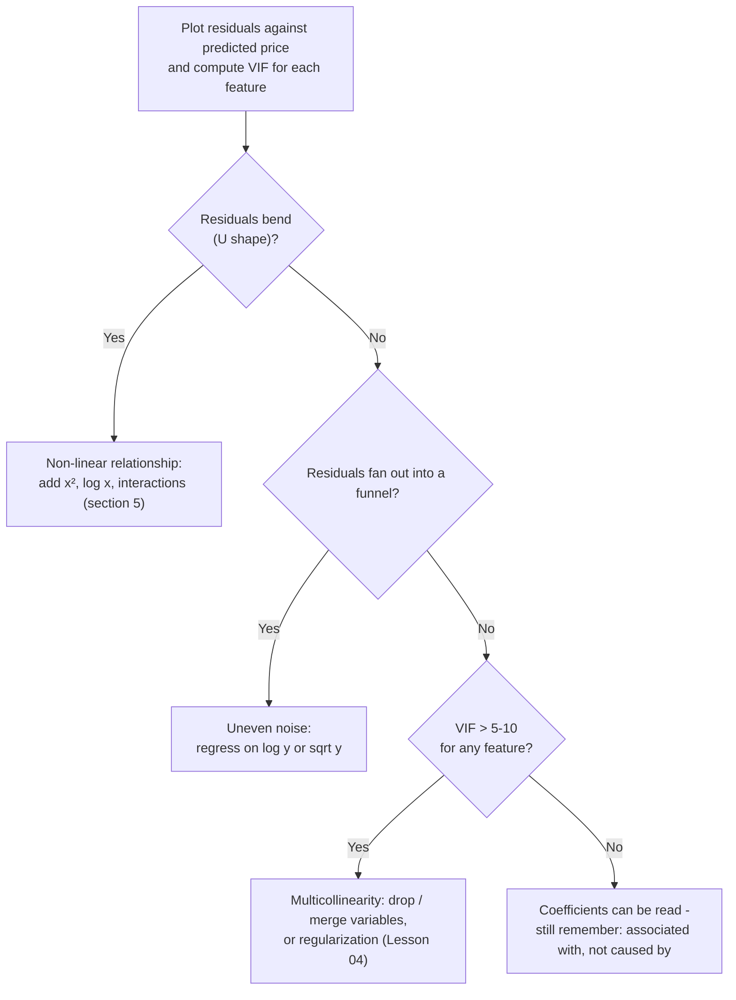

> **Learning objectives:** After this lesson, you will be able to read regression coefficients the right way ("holding the other variables fixed"), understand why least squares is exactly MSE, use R² to see how well the line fits, recognize the three signs that the "straight" assumption is failing (non-linearity, uneven noise, multicollinearity), and know how to extend the model with dummy variables, interactions and quadratic terms.

## 1. The plumber takes on more work: from one variable to many

Foundations · Lesson 01 opened with the plumber: 3 hours costs 350 thousand, 2 hours costs 250 thousand, and you worked out in your head that `fee = 50 + 100 × hours`. That is **simple linear regression**: one feature, one straight line, two knobs.

Now the invoice gains a column "number of parts replaced", and the plumber simply adds one more unit price: `fee = 50 + 100 × hours + 200 × parts`. Each feature has a **coefficient** - its "unit price" - and the whole model shares a single **intercept**:

$$\hat{y} = \beta_0 + \beta_1 x_1 + \beta_2 x_2 + \dots + \beta_p x_p$$

That is **multiple linear regression**. With 2 features, the "straight line" becomes a plane (*An Introduction to Statistical Learning*, Figure 3.4); with 8 features as in California Housing, it is a "hyperplane" you cannot draw but the computer can. The model in Lesson 01 is exactly this equation with p = 8.

The machine finds the 9 coefficients by **least squares**: it picks the set of coefficients that makes the sum of squared residuals $e_i = y_i - \hat{y}_i$ (the residual sum of squares - RSS) as small as possible - divide by the number of points and you get the MSE of Foundations · Lesson 10; two names for one thing. The loss landscape here is a convex bowl, so the solution can be computed directly with one formula: scikit-learn's `LinearRegression` just calls `scipy.linalg.lstsq`, rather than feeling its way down a mountain in the fog. The method was born in astronomy in 1801, when Gauss (aged 24) used it to recover the lost asteroid Ceres.

<details>
<summary><b>Going deeper: Ceres, Gauss and the normal distribution</b></summary>

In early 1801, Ceres was discovered, tracked for about 40 days, and then lost in the glare of the Sun. Gauss used least squares to estimate its orbit from the error-ridden observations; at the end of that year astronomers found Ceres again in exactly the region of sky he had predicted (Actuaries Institute). Legendre published the method in 1805, Gauss in 1809 with the claim that he had been using it since 1795 - a famous priority dispute. *Dive into Deep Learning* points out a deeper connection: Gauss also discovered the normal distribution, and least squares is exactly the maximum likelihood estimate when the noise follows a normal distribution.

</details>

> 🔧 **Try it now:** Two invoices: 2 hours → 250 thousand, 3 hours → 350 thousand. Compute the RSS of `fee = 50 + 100 × hours` and of `fee = 100 + 80 × hours`.
>
> *Answer:* model 1 gets both exactly right → RSS = 0. Model 2 predicts 260 and 340 → residuals −10 and +10 → RSS = 100 + 100 = **200**. Least squares picks model 1.

## 2. Reading coefficients: "holding the other variables fixed"

Back to California Housing with exactly the split from Lesson 01, first with one variable - income:

```python
import pandas as pd
from sklearn.datasets import fetch_california_housing
from sklearn.model_selection import train_test_split
from sklearn.pipeline import Pipeline
from sklearn.preprocessing import StandardScaler
from sklearn.linear_model import LinearRegression

X, y = fetch_california_housing(as_frame=True, return_X_y=True)
X_train, X_test, y_train, y_test = train_test_split(X, y, test_size=0.2, random_state=42)

simple_model = LinearRegression().fit(X_train[["MedInc"]], y_train)
print(f"price ≈ {simple_model.intercept_:.3f} + {simple_model.coef_[0]:.3f} × MedInc")   # → price ≈ 0.445 + 0.419 × MedInc
print("R² test:", round(simple_model.score(X_test[["MedInc"]], y_test), 3))   # → 0.459
```

Reading: each unit of MedInc (about 10,000 USD of median income) *is associated with* a house price higher by ≈ 0.419, i.e. ≈ 41,900 USD. Now all 8 variables (original units, not yet scaled):

| Feature | Coefficient | Feature | Coefficient |
|---|---|---|---|
| MedInc | +0.449 | AveOccup | −0.0035 |
| HouseAge | +0.0097 | Latitude | −0.420 |
| AveRooms | −0.123 | Longitude | −0.434 |
| AveBedrms | +0.783 | *(intercept)* | −37.02 |

A coefficient in multiple regression comes with a mandatory clause when you read it: **"holding the other variables fixed"**. MedInc = 0.449: between two neighborhoods identical in the other 7 columns, the one with MedInc higher by 1 unit has a predicted price higher by 0.449. Try it on one test row: the model predicts 0.719; raise MedInc by 1 while keeping the other 7 columns unchanged, and the prediction becomes 1.168 - exactly 0.719 + 0.449. HouseAge = +0.0097: at the same income, location and house size, a house *10 years older* is associated with a price about 9,700 USD *higher*.

Two things to remember:

**Associated with is not the same as causes (association ≠ causation).** Old houses do not push prices up; old houses tend to sit in long-established neighborhoods near the center - something the model has no column to record. *An Introduction to Statistical Learning* has an unforgettable example: regressing the number of shark attacks on ice-cream sales gives a clearly positive coefficient, but banning ice cream would not save anyone - hot weather drives both up, and once you add a temperature variable the ice-cream coefficient disappears.

**Coefficients change when you change which variables are "held fixed".** AveRooms regressed on its own gives a coefficient of **+0.077**; alongside the other 8 variables it becomes **−0.123**. AveBedrms goes the other way: −0.137 alone, +0.783 in the group. Nothing is broken: the two columns have a correlation of 0.84, so "holding AveBedrms fixed while increasing AveRooms" means adding rooms that are *not* bedrooms - an entirely different question. *An Introduction to Statistical Learning* has precisely this phenomenon with newspaper advertising: significant on its own, close to 0 when it stands next to radio - newspaper was merely "borrowing" the credit for radio's work because the two budgets tend to move together. Section 4 will put a name to this phenomenon.

## 3. Which coefficient carries more weight? The scale question - and R²

The table above does not let you compare coefficients with one another: Population −0.000002 *per person*, AveBedrms +0.783 *per bedroom* - different units, like comparing 100 thousand per hour with 200 thousand per part. `StandardScaler` (Foundations · Lesson 12) solves that: after scaling, the columns share the unit "one standard deviation", and the coefficients all answer the same question - *if this feature shifts by one standard deviation, how much does the price change?*

```python
model = Pipeline([("scale", StandardScaler()), ("lr", LinearRegression())]).fit(X_train, y_train)

# Coefficients on SCALED features: comparable because every column shares the unit "1 standard deviation"
coefficients = pd.Series(model["lr"].coef_, index=X.columns).sort_values(key=abs, ascending=False)
print(coefficients.round(3))
print("Intercept:", round(model["lr"].intercept_, 3))
print("R² train:", round(model.score(X_train, y_train), 3), "| R² test:", round(model.score(X_test, y_test), 3))
```

```
Latitude     -0.897
Longitude    -0.870
MedInc        0.854
AveBedrms     0.339
AveRooms     -0.294
HouseAge      0.123
AveOccup     -0.041
Population   -0.002
Intercept: 2.072
R² train: 0.613 | R² test: 0.576
```

Three big levers: **latitude, longitude, income** - a one-standard-deviation shift in each changes the price by nearly 0.9 (≈ 90,000 USD). Heading north or further inland (longitude increasing) makes things cheaper - matching the "Fresno is cheaper than San Francisco" intuition at the end of Lesson 01. The intercept 2.072 is exactly the mean price of the training set: once the features are centered at mean 0, the "average neighborhood" has the average price - a useful self-check.

Then **R²** (Foundations · Lesson 15) - the share of the variation in price explained, compared with predicting the mean: one variable, MedInc, gives 0.459 on test; eight variables give 0.576 on test, 0.613 on train. For simple regression, R² on the fitted data equals the squared correlation: $r = 0.691$ between MedInc and price gives $R^2 = 0.477$. *An Introduction to Statistical Learning* stresses: **adding variables can only raise R² on train, never lower it**, even if the variable is useless - adding newspaper pushes the R² of `Advertising` from 0.89719 to 0.8972. So compare models by R² on test or validation (Foundations · Lessons 04, 14).

> ⚠️ **A small note:** "carries weight" according to scaled coefficients means *the prediction changes a lot when the feature shifts by one standard deviation in this data* - not "an important cause", and it depends on the distribution of the training set. Coefficients of features that are strongly correlated with each other are also less stable - see section 4.

## 4. When the line lies: three signs to look for

*An Introduction to Statistical Learning* (section 3.3.3) lists six problems when fitting a straight line; the three most common are **non-linearity**, **uneven noise**, and **multicollinearity**. The diagnostic tool for the first two is the **residual plot** - residuals $y - \hat{y}$ against predicted values: if the line is "telling the truth", the residuals look like random noise around 0, with no pattern.

**Non-linearity.** Residuals bending into a U shape are a sign that the true relationship is a curve. In the book, regressing `mpg` on `horsepower` (the `Auto` data) gives clearly U-shaped residuals; add `horsepower²` and the pattern disappears while R² rises from 0.606 to 0.688. On California Housing, the mean residual by predicted price band is +0.25 (predicted below 1), −0.13 (1-2), +0.32 (3-4), −0.14 (above 4) - not around 0. The reason lies in the income-price scatter from Lesson 01:

```
Mean price (×100,000 USD) by MedInc income band - 20,640 rows

5.0 |                                          ● 4.82   ← cap at 5.0
    |                                  ● 4.43
4.0 |                                              The line has to choose:
    |                          ● 3.45              fit the steep part on the left
3.0 |                                              or the flat part on the right?
    |                  ● 2.45
2.0 |          ● 1.68
    |  ● 1.12
1.0 |
    +------+-------+-------+-------+-------+-------+--> MedInc
       0-2    2-4     4-6     6-8    8-10   10-15
```

The relationship is nearly straight, then bends flat when it hits the 5.0 cap; a single line cannot be both steep and flat, so it is systematically off at both ends - and at the low end it overshoots below 0: the 15 negative price predictions in Lesson 01 are a direct consequence.

**Uneven noise (heteroscedasticity).** Linear regression assumes the noise is equally large at every price level; residuals fanning out into a **funnel** are a sign that assumption is wrong - on California Housing, the standard deviation of the residuals rises steadily from 0.48 (predicted below 1) to 0.97 (predicted above 4). The classic fix: regress on $\log y$ or $\sqrt{y}$ to "compress" large values.

**Multicollinearity.** When two features say almost the same thing, the model cannot separate the contribution of each: coefficients flip sign, swing wildly when the data changes slightly, standard errors balloon - exactly the AveRooms - AveBedrms story from section 2. The second pair is more surprising: Latitude and Longitude have a correlation of **−0.92**, because the California coastline runs diagonally from north-west to south-east.

The yardstick is the **VIF (variance inflation factor)**: regress each feature on the remaining features to get $R^2_j$, then $\text{VIF}_j = 1/(1 - R^2_j)$. VIF = 1 means no collinearity; a common rule of thumb: above 5 or 10 is cause for concern. California Housing training set: Latitude 9.21; Longitude 8.88; AveRooms 7.92; AveBedrms 6.61; the other four columns 1.01-2.54. In the book, `limit` (credit limit) and `rating` (credit rating) in the `Credit` data reach a VIF of about 160 - heavyweight collinearity.



<details>
<summary><b>Going deeper: computing VIF in a few lines of scikit-learn</b></summary>

```python
# VIF of each column = 1 / (1 − R²) when regressing that column on the other 7 columns (computed on train)
vif = {}
for column in X.columns:
    other_features = X_train.drop(columns=column)
    r2 = LinearRegression().fit(other_features, X_train[column]).score(other_features, X_train[column])
    vif[column] = 1 / (1 - r2)
print(pd.Series(vif).round(2).sort_values(ascending=False))
# → Latitude 9.21, Longitude 8.88, AveRooms 7.92, AveBedrms 6.61, MedInc 2.54, HouseAge 1.24, Population 1.13, AveOccup 1.01
```

The book gives two remedies: drop one of the two variables (dropping `rating` from `Credit` brings the VIFs back close to 1 while R² only falls from 0.754 to 0.75), or merge them into a single new variable. Lesson 04 adds a third: regularization.

</details>

> 🔧 **Try it now:** Regressing AveRooms on the other 7 columns on the training set gives $R^2 = 0.874$. Compute the VIF of AveRooms.
>
> *Answer:* $1/(1 - 0.874) = 1/0.126 \approx$ **7.9** - matching the 7.92 in the table: the variance of the AveRooms coefficient is "inflated" almost 8 times.

> ⚠️ **A small note:** collinearity makes coefficients hard to *interpret* but has little effect on *prediction*. And a fix is not always an improvement: regressing on $\log y$ for California Housing and then exponentiating back gives a test RMSE that is *worse* (≈ 1.53 versus 0.746), because the exponential inflates the misses on odd rows like row 1979 from Lesson 01. The lesson: after a fix, **measure again on validation** before deciding whether to keep or drop it - because "whether to fix at all" is also a choice. Only once every choice is settled do you open the test set for the final reported number. (The test number here is only there to show you the consequence.)

## 5. Extending the line: dummy variables, interactions, quadratics

Back to the plumber: weekends cost more, but "weekend" is text. Foundations · Lesson 12 taught the 0/1 **dummy variable**: `fee = 50 + 100 × hours + 80 × weekend`. The coefficient of a dummy variable is **the difference from the baseline level** - a weekend is 80 thousand dearer than a weekday at any number of hours: two parallel lines. A text column with k levels needs k − 1 dummy variables; the one level without a dummy is the baseline (*An Introduction to Statistical Learning*, section 3.3.1).

If on weekends the *hourly rate* is higher too, the two lines stop being parallel: add an **interaction term** - the product of two features - `fee = 50 + 100 × hours + 80 × weekend + 30 × (hours × weekend)`. On weekdays each hour is 100 thousand, on weekends 130 thousand: the coefficient of one feature *depends on* the other, something an additive model cannot express. On `Advertising`, adding the TV × radio interaction pushes R² from 89.7% to 96.8% - spending on both channels is more effective than pouring everything into one.

Finally, the **quadratic term**: adding a `MedInc²` column allows a curve while the model *is still linear regression* - linear in the *coefficients*; *Mathematics for Machine Learning* (chapter 9) calls this linear regression on transformed features $\phi(x)$. `PolynomialFeatures` generates the squares and cross products in one go:

```python
from sklearn.preprocessing import PolynomialFeatures
from sklearn.metrics import root_mean_squared_error

quadratic_model = Pipeline([("scale", StandardScaler()),
                 ("poly", PolynomialFeatures(degree=2, include_bias=False)),  # adds x_i² and x_i·x_j for every pair
                 ("lr", LinearRegression())]).fit(X_train, y_train)
print("Number of features:", quadratic_model["poly"].n_output_features_)   # → 44: 8 original + 8 squares + 28 cross products
print("R² test:", round(quadratic_model.score(X_test, y_test), 3),
      "| RMSE test:", round(root_mean_squared_error(y_test, quadratic_model.predict(X_test)), 3))
# → R² test: 0.646 | RMSE test: 0.681   (straight-line model: 0.576 | 0.746)
```

From 9 to 45 knobs, test R² rises 0.576 → 0.646 and RMSE falls 0.746 → 0.681 - same algorithm, only the features changed. But the book also draws a degree-5 curve on `Auto`: it wiggles for no reason and is no better than degree 2. High-degree features inflate capacity (Foundations · Lesson 13), and the higher the capacity, the easier it is to overfit (Lesson 14). Lesson 04 gives you the brake: regularization.

> 🔧 **Try it now:** With the model `fee = 50 + 100 × hours + 80 × weekend + 30 × (hours × weekend)`, what are the invoices for 3 hours on a weekday and 3 hours on a weekend?
>
> *Answer:* weekday 50 + 300 = **350 thousand**; weekend 50 + 300 + 80 + 90 = **520 thousand** (the parallel model without the interaction gives only 430 thousand).

## 6. The line in the real world: kept because it can be read

Linear regression lives on in places where the answer needs to be *open to questioning*, not just a number. The **hedonic pricing** model - treating a house price as the sum of the "implicit prices" of its attributes, estimated by linear regression - is exactly the AVM of Lesson 01. A 2021 study of housing in Boulder showed that random forests and neural networks predict more accurately, yet regression is still used alongside them because its coefficients can be read (Yazdani, 2021). Labor economics uses the same logic in the Mincer equation (1974): $\log(\text{wage}) = \beta_0 + \rho \cdot \text{years of schooling} + \dots$ - $\rho$ reads approximately as "each additional year of schooling is associated with a wage higher by ρ%", with a global average of about 9.5% (IZA World of Labor, Patrinos 2024).

Lesson 03 keeps that "readable" spirit for the classification problem.

## Lesson summary

- Multiple linear regression is the plumber with many unit prices: $\hat{y} = \beta_0 + \beta_1 x_1 + \dots + \beta_p x_p$. The coefficients are found by least squares - which is exactly minimizing MSE (Foundations · Lesson 10); scikit-learn solves it directly with a formula rather than searching step by step.
- Always read a coefficient with "holding the other variables fixed", and **"associated with" does not mean "causes"** (sharks and ice cream). A variable's coefficient changes when the variables standing next to it change (AveRooms: +0.077 alone, −0.123 among 8 variables).
- To compare coefficients across features you must scale first: on California Housing, latitude, longitude and income are the three big levers (|coefficient| ≈ 0.85-0.90 per standard deviation).
- **R²** is the share of variation explained; adding variables can only raise R² on train, never lower it, so compare models by R² on test/validation. For simple regression, R² = $r^2$.
- Three signs the line is lying: U-shaped residuals (non-linearity → add $x^2$, interactions), funnel-shaped residuals (uneven noise → log y), VIF > 5-10 (multicollinearity → drop/merge variables or regularization).
- Dummy variables bring text columns into the model (coefficient = difference from the baseline); interactions make the coefficient of one variable depend on another; quadratic terms allow a curve while the model stays linear in the coefficients. `PolynomialFeatures(2)` lifts test R² from 0.576 to 0.646 - but the higher the degree, the easier it is to overfit.

## Self-check questions

1. A house-pricing model gives the coefficient HouseAge = +0.0097. A colleague concludes: "the longer you keep a house, the more its price rises, so don't rush to sell." Point out two errors in this reading.
2. Why is the coefficient of AveBedrms −0.137 when regressed alone but +0.783 when it stands alongside the other 7 variables? How does this phenomenon relate to the newspaper advertising example?
3. Two unscaled coefficients are 0.449 for MedInc and 0.783 for AveBedrms. Can you conclude that AveBedrms is "almost twice as important" as MedInc? What must be done before comparing?
4. **By hand:** a feature has $R^2 = 0.95$ when regressed on the remaining features. What is its VIF, and by the 5-10 rule of thumb, is it cause for concern?
5. You add 36 quadratic and cross-product features, and R² on train rises from 0.613 to 0.685. Is this number enough to conclude the new model is better? What other number do you need? (Foundations · Lessons 04, 14)
6. Write a regression model for room rent as a function of floor area (m²) and a column "has air conditioning" (yes/no), such that air conditioning both adds a fixed amount and makes each m² dearer. How many coefficients does the model have, and how is each one read?

## Further reading

**Core sources for this lesson:**

| Source | Which part to read |
|---|---|
| **An Introduction to Statistical Learning (ISLP)** | Chapter 3: section 3.1 (simple regression, least squares, R²), 3.2 (multiple regression, "holding the other variables fixed", sharks and ice cream), 3.3.1 (qualitative variables), 3.3.2 (interactions, quadratics), 3.3.3 (non-linearity, uneven noise, collinearity and VIF) - pp. 69-109 |
| **Dive into Deep Learning (d2l.ai)** | Chapter *Linear Regression* - section *The Normal Distribution and Squared Loss*: why least squares is the maximum likelihood estimate with Gaussian noise |
| **Mathematics for Machine Learning (MML)** | Chapter 9 (pp. 289-296) - linear regression is "linear in the parameters", transformed features $\phi(x)$ and polynomial regression |
| **The Foundations chapter** | Lesson 01 (the plumber), Lesson 03 (feature/label), Lesson 10 (MSE), Lesson 12 (scaling, one-hot) |

**Additional online sources (free):**

- [LinearRegression - scikit-learn](https://scikit-learn.org/stable/modules/generated/sklearn.linear_model.LinearRegression.html) - the `coef_` and `intercept_` attributes, and the `score` method returning R².
- [PolynomialFeatures - scikit-learn](https://scikit-learn.org/stable/modules/generated/sklearn.preprocessing.PolynomialFeatures.html) - generates squares and cross products, the `interaction_only` parameter.
- [Gauss, Least Squares, and the Missing Planet - Actuaries Institute](https://www.actuaries.asn.au/research-analysis/gauss-least-squares-and-the-missing-planet) - the story of Ceres in 1801 and least squares.
- [Estimating the return to schooling using the Mincer equation - IZA World of Labor](https://wol.iza.org/articles/estimating-the-return-to-schooling-using-the-mincer-equation/long) - linear regression in labor economics and the 9.5% per year of schooling figure.
- [Machine Learning, Deep Learning, and Hedonic Methods for Real Estate Price Prediction - Yazdani (2021, arXiv)](https://arxiv.org/abs/2110.07151) - comparing hedonic regression with random forests and neural networks on Boulder housing data.

> **Next lesson:** [Logistic Regression: Classification with Probabilities](../logistic-regression-classification-with-probabilities/) - when the label is no longer a number but yes/no - why you should not draw a straight line through the 0 and 1 points, and how the sigmoid curve replaces it.
