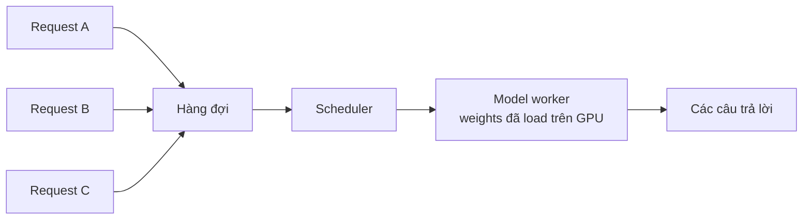
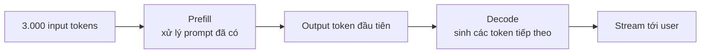
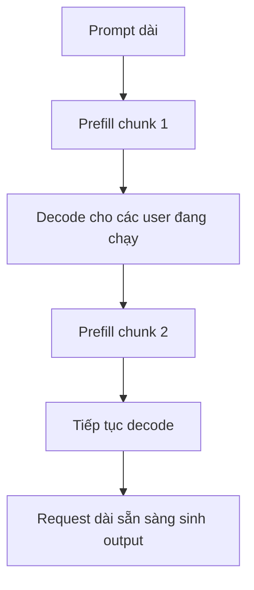
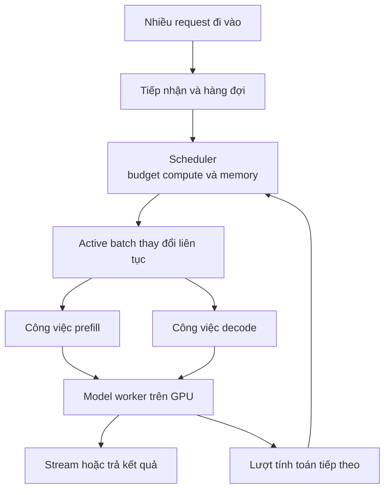

Một chatbot phục vụ một người có vẻ đơn giản: request đi vào, model tạo văn bản, câu trả lời đi ra. Giờ thay một người bằng 10.000 người gửi prompt cùng lúc. Chữ "model" ở giữa lập tức che đi một hàng đợi, một scheduler, lượng GPU có hạn và nhiều quyết định về request nào được chạy tiếp.

Đây là tầng nằm dưới [LLM Gateway](../what-is-llm-gateway-vi/). Gateway có thể kiểm soát quyền truy cập model endpoint. Serving engine phải biến những request được chấp nhận thành computation thật.

## 1. Một model đã được load có thể phục vụ nhiều request

Cách hình dung ngây thơ là mỗi user có một bản sao model và một GPU riêng. Với model lớn, cách đó sẽ lãng phí tài nguyên khổng lồ. Trong một hệ thống serving điển hình, model weights được load trên một hoặc nhiều worker, rồi nhiều request cùng dùng những worker đó theo thời gian.

Câu hỏi không chỉ là "Model trả lời một request như thế nào?" mà là "Làm sao chia compute và memory có hạn cho những request đến ở các thời điểm khác nhau, có prompt dài ngắn khác nhau và cần output dài ngắn khác nhau?"

Sơ đồ đã được đơn giản hóa. Platform production có thể có nhiều replica, router phía trước và nhiều loại queue. Không có nghĩa 10.000 request đều nằm trong active batch của một worker.

## 2. Queue và scheduler quyết định ai được chạy

Khi request đến nhanh hơn tốc độ worker hoàn thành, một số phải đợi. **Queue** giữ công việc đang chờ; **scheduler** chọn request nào được vào hoặc tiếp tục ở bước tính toán tiếp theo, trong giới hạn compute và memory.

Scheduling policy có thể ưu tiên theo thứ tự đến hoặc theo mức ưu tiên. [Tài liệu vLLM](https://docs.vllm.ai/en/stable/configuration/engine_args/) mô tả first-come-first-served và priority là hai lựa chọn được hỗ trợ. Không có policy tốt nhất cho mọi trường hợp: priority có thể bảo vệ người dùng tương tác khỏi batch job lớn, nhưng công việc ít ưu tiên hơn cũng cần cơ hội hoàn thành hợp lý.

"Queue" không có nghĩa là kho chứa vô hạn. Khi quá tải, platform có thể cần giới hạn nhận request, timeout hoặc từ chối sớm. Cứ để hàng đợi dài ra chỉ biến vấn đề thiếu capacity thành vấn đề latency.

## 3. Batching cho GPU làm nhiều việc cùng lúc

GPU phù hợp với tính toán song song. Thay vì cho request A chạy hết rồi mới tới B và C, serving engine có thể xử lý nhiều sequence trong cùng một batch.

Việc đó có thể tăng **throughput**, tức lượng công việc hoàn thành trong một đơn vị thời gian. Nhưng các request LLM hiếm khi dài như nhau. Một người chỉ cần câu trả lời một dòng, người khác lại muốn một báo cáo dài.

Với batch cố định, sequence xong sớm có thể rời đi, nhưng chỗ trống của nó chưa chắc được lấp ngay cho tới khi cả batch kết thúc. GPU khi đó xử lý một batch ngày càng thưa trong lúc user mới vẫn đợi.

## 4. Continuous batching liên tục đưa việc mới vào

**Continuous batching** xem xét lại active batch trong quá trình generation. Khi một request hoàn thành, request đang đợi có thể vào thay vì phải chờ toàn bộ batch ban đầu kết thúc.

| Bước sinh token | Các sequence đang chạy | Điều gì thay đổi |
| --- | --- | --- |
| 1 | A, B, C | Ba request đang chạy |
| 2 | A, B, C | A hoàn thành |
| 3 | D, B, C | D vào chỗ còn trống |
| 4 | D, E, C | B hoàn thành và E đi vào |

Bảng này giúp hình dung ý tưởng, không có nghĩa request mới luôn được thêm vào sau đúng một token. Engine còn phải xét memory, batch size và nhiều giới hạn scheduling. [Bài giải thích continuous batching của Hugging Face](https://huggingface.co/blog/continuous_batching) cho thấy việc thay các sequence đã xong giúp duy trì lượng computation hữu ích.

Continuous batching là tối ưu ở tầng serving. Bản thân nó không làm model hiểu biết hơn hay reasoning tốt hơn.

## 5. Prefill và decode là hai kiểu công việc khác nhau

Xét một request có 3.000 input tokens và cần một câu trả lời dài 300 tokens.

**Prefill** xử lý prompt đã biết và chuẩn bị state cần cho generation. **Decode** sau đó tạo output token từng bước. Các token trong prompt đã có sẵn nên có thể xử lý với mức song song cao hơn; còn việc sinh câu trả lời có tính tuần tự vì token tiếp theo phụ thuộc vào những gì đã sinh.

Hai phase này tạo áp lực khác nhau lên hệ thống. Prompt rất dài tốn nhiều compute ở prefill, trong khi nhiều câu trả lời đang chạy cần được decode đều đặn để chữ tiếp tục xuất hiện. Vì vậy scheduler phải cân bằng việc mới với việc đang dang dở.

## 6. Chunked prefill giúp prompt dài không chiếm trọn một lượt

Giả sử 20 user đang nhận câu trả lời dạng stream. Một request mới đến với tài liệu rất dài. Nếu toàn bộ prefill của nó được xử lý như một khối không ngắt, những user đang chạy có thể phải chờ lâu hơn cho token tiếp theo.

**Chunked prefill** chia việc xử lý prompt dài thành những phần nhỏ được lên lịch, để chúng chia sẻ lượt tính toán với decode:

Đây là timeline khái niệm; engine có thể xếp prefill và decode trong cùng một iteration, chứ không nhất thiết xen kẽ đúng như hình. [Hướng dẫn tối ưu vLLM](https://docs.vllm.ai/en/stable/configuration/optimization/) giải thích rằng chunked prefill cho phép ghép các phần prefill dài với decode request, và có token budget để điều chỉnh trade-off. Budget nhỏ có thể ưu tiên nhịp ra token ổn định; budget lớn hơn có thể cải thiện time to first token cho request mới. Không có một cấu hình tối ưu cho mọi workload.

## 7. "Nhanh" có nhiều nghĩa

Một chatbot có thể bắt đầu trả lời rất nhanh nhưng sau đó chữ chạy chậm. Chatbot khác đợi lâu hơn trước token đầu tiên nhưng lại hoàn thành rất nhanh. Một con số latency sẽ che mất khác biệt này.

| Metric | Đo điều gì? | User cảm nhận ra sao? |
| --- | --- | --- |
| Time to first token (TTFT) | Từ lúc gửi request đến output token đầu tiên | Giao diện phải đợi bao lâu mới có phản hồi |
| Inter-token latency (ITL) | Khoảng chờ giữa các token | Chữ hiện ra có đều không |
| End-to-end latency | Từ request đến khi câu trả lời hoàn thành | Toàn bộ việc mất bao lâu |
| Throughput | Lượng việc xử lý trong một đơn vị thời gian | Platform phục vụ được bao nhiêu người |

Các metric này phụ thuộc workload. Hãy đo cả độ dài prompt, độ dài output, concurrency và những phân vị latency, thay vì chỉ xem trung bình của một bài test ngắn. Batch lớn hơn có thể tăng throughput nhưng làm latency xấu đi nếu request phải đợi quá lâu mới được nhận vào chạy.

GPU utilization cao mà TTFT tệ thì chưa chắc là trải nghiệm tốt. Mục tiêu là cân bằng hợp lý giữa **latency, throughput và cost**.

## 8. Vậy 10.000 request đi đâu?

Vòng lặp trên sơ đồ thể hiện scheduler liên tục quyết định cách sử dụng những lượt tính toán tiếp theo; request đã hoàn thành sẽ rời hệ thống, không chạy vòng nữa. Thêm replica có thể tăng capacity, nhưng mỗi replica vẫn có compute và memory hữu hạn.

Ý chính là: serving không phải 10.000 model riêng. Đó là quá trình liên tục chia tài nguyên cho nhiều request. Giới hạn tiếp theo nằm trong GPU memory. Mỗi sequence đang chạy cần state để model tiếp tục sinh token mà không phải tính lại toàn bộ lịch sử. [Bài tiếp theo về KV cache](../kv-cache-gpu-memory-llm-serving-vi/) giải thích state đó là gì và vì sao cách quản lý nó ảnh hưởng lớn tới concurrency.

## Nguồn tham khảo

- [Continuous batching from first principles - Hugging Face](https://huggingface.co/blog/continuous_batching)
- [Optimization and tuning - vLLM](https://docs.vllm.ai/en/stable/configuration/optimization/)
- [Engine arguments and scheduler limits - vLLM](https://docs.vllm.ai/en/stable/configuration/engine_args/)
