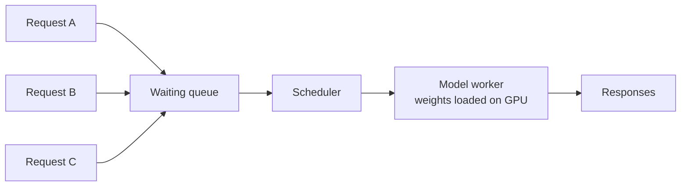
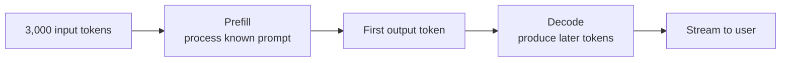
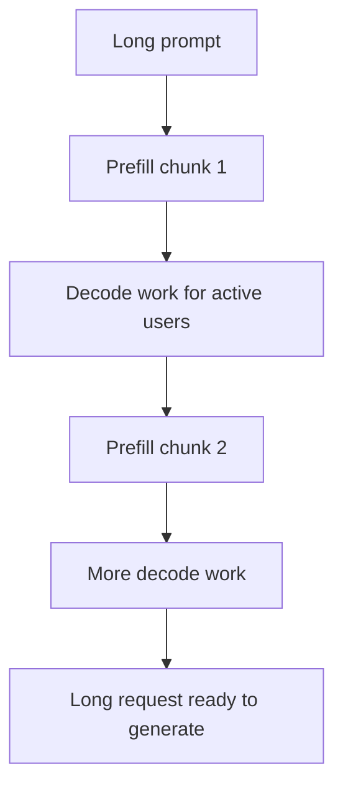
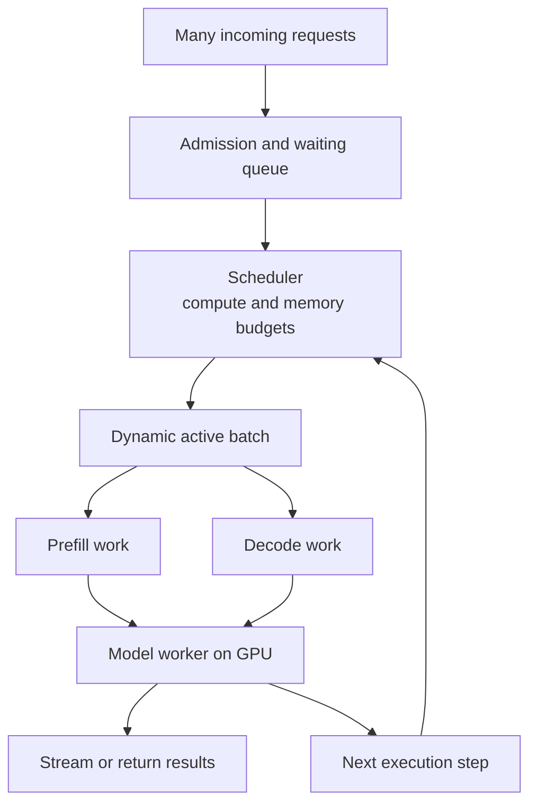

A chatbot serving one person looks simple: a request goes in, a model produces text, and an answer comes back. Replace that person with 10,000 people sending prompts at once. The "model" box now hides a queue, a scheduler, limited GPU capacity, and many decisions about who gets to run next.

This is the layer below the [LLM Gateway](../what-is-llm-gateway/). The gateway can govern access to model endpoints. A serving engine must turn admitted requests into actual computation.

## 1. One loaded model can serve many requests

A naive picture gives every user a private model copy and GPU. That would waste enormous resources for a large model. In a typical serving setup, model weights are loaded on one or more workers, and many requests share those workers over time.

The question is not just "How does the model answer one request?" It is "How do we share finite compute and memory among requests with different arrival times, prompt lengths, and output lengths?"

The diagram is simplified. A production platform may have several replicas, front-end routers, and separate network queues. There is no promise that all 10,000 requests can sit in one worker's active batch.

## 2. The queue and scheduler decide who can run

When requests arrive faster than workers can finish them, some wait. The **queue** holds pending work; the **scheduler** chooses which requests enter or continue in the next execution step, subject to available compute and memory.

A scheduling policy can prefer arrival order or assign priority. [vLLM documents](https://docs.vllm.ai/en/stable/configuration/engine_args/) first-come-first-served and priority as supported policies. Neither is universally best: priority can protect interactive users from large background jobs, but low-priority work still needs a reasonable chance to finish.

"Queue" does not mean unlimited storage. Under overload, a platform may need admission limits, timeouts, or rejection. Letting waiting requests grow forever merely turns a capacity problem into a latency problem.

## 3. Batching lets the GPU do useful work together

A GPU is good at parallel computation. Instead of sending request A through the model, then B, then C in complete isolation, a serving engine can process multiple sequences in a batch.

That can improve **throughput**, or the amount of work completed per unit of time. But LLM requests rarely have the same length. A user asking for a one-sentence answer may finish quickly while another asks for a long report.

With a fixed batch, finished sequences can leave, but their places may remain unused until the batch is done. The engine then has an underfilled batch even though more users are waiting.

## 4. Continuous batching keeps replacing finished work

**Continuous batching** revisits the active batch during generation. As requests finish, waiting requests can join rather than waiting for every member of the original batch to end.

| Generation step | Active sequences | What changes |
| --- | --- | --- |
| 1 | A, B, C | Three requests are running |
| 2 | A, B, C | A finishes |
| 3 | D, B, C | D enters the available place |
| 4 | D, E, C | B finishes and E enters |

This table is a mental model, not a guarantee that a new request enters after exactly one token. Engines have additional limits for memory, batch size, and scheduling. [Hugging Face's explanation of continuous batching](https://huggingface.co/blog/continuous_batching) shows how replacing finished sequences helps keep generation work productive.

Continuous batching is a serving optimization. It does not make the model more knowledgeable or improve its reasoning by itself.

## 5. Prefill and decode are different kinds of work

Consider a request with 3,000 input tokens and a desired 300-token answer.

**Prefill** processes the already-known prompt and prepares the state needed for generation. **Decode** then generates output tokens step by step. The prompt tokens can be processed with much more parallel work; generation remains sequential in the sense that the next output token depends on what has been produced so far.

These phases stress the system differently. A very long prompt can occupy substantial compute during prefill, while many ongoing responses need regular decode steps so their text keeps flowing. That is why a scheduler must balance new work against work already in progress.

## 6. Chunked prefill prevents one long prompt from dominating a step

Imagine 20 users already receiving streamed answers. A new request arrives with a very long document. Processing its entire prefill as one uninterrupted unit may delay the next output token for those active users.

**Chunked prefill** splits the long prompt work into smaller scheduled pieces, allowing it to share execution with decode work:

This is a conceptual timeline; an engine may batch prefill and decode work in the same iteration rather than alternate exactly as drawn. [vLLM's tuning guide](https://docs.vllm.ai/en/stable/configuration/optimization/) explains that chunked prefill can batch long-prefill pieces with decode requests and exposes a token budget to tune the trade-off. A smaller budget may favor steadier output-token timing; a larger one may improve time to first token for new requests. There is no one setting for every workload.

## 7. "Fast" can mean several things

A chatbot can start answering quickly but stream slowly. Another can take longer to show its first token and then finish rapidly. One latency number hides that difference.

| Metric | What it measures | Why users notice |
| --- | --- | --- |
| Time to first token (TTFT) | Request arrival to first output token | How long the interface appears to wait |
| Inter-token latency (ITL) | Delay between generated tokens | How smooth the answer feels |
| End-to-end latency | Request arrival to completed answer | How long the whole task takes |
| Throughput | Work completed per unit of time | How many users the platform can serve |

These metrics depend on workload shape. Measure prompt and output lengths, concurrency, and percentiles, not just an average from one short test. Larger batches may raise throughput but can hurt latency if requests wait too long to be admitted.

A server with high GPU utilization but poor TTFT is not automatically a good user experience. The target is a sensible balance of **latency, throughput, and cost**.

## 8. So where do 10,000 requests go?

The loop in the diagram means the scheduler repeatedly decides how to use the next execution steps; a completed request exits rather than going around again. More replicas can add capacity, but each replica still has finite compute and memory.

That is the central idea: serving is not 10,000 private models. It is continuous resource allocation across many requests. The next constraint sits in GPU memory. Every active sequence needs state that lets the model continue generating without recomputing its entire history. [The next article on KV cache](../kv-cache-gpu-memory-llm-serving/) explains what that state is and why managing it affects concurrency so strongly.
