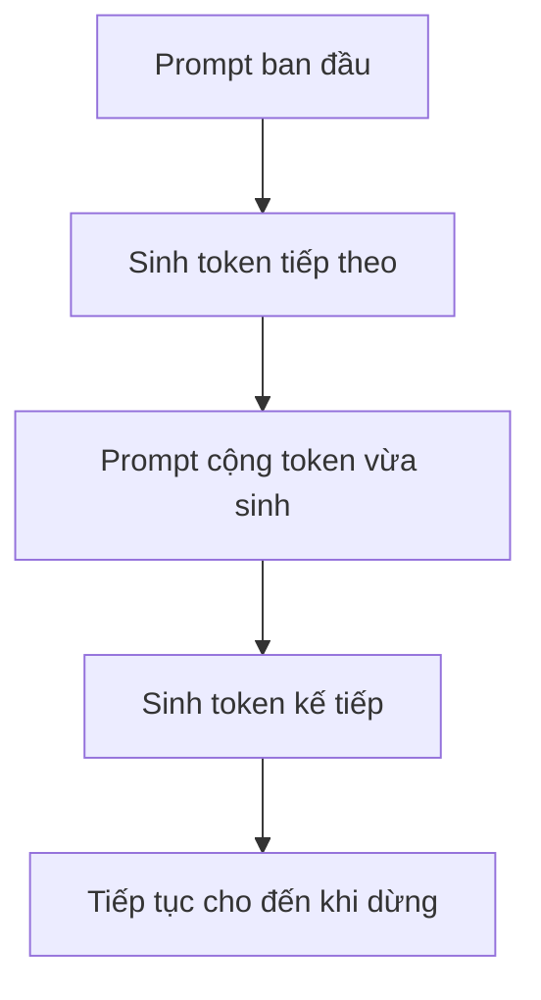

Chúng ta thường nói về "LLM" như một thứ duy nhất, nhưng **huấn luyện** và **phục vụ model để trả lời** là hai bài toán tính toán khác nhau.

## Pretraining học dự đoán token tiếp theo

Một model ngôn ngữ tự hồi quy nhận một chuỗi và học cách dự đoán token tiếp theo ở từng vị trí.

```text
"the sky is" -> dự đoán "blue"
```

Khi học trên lượng dữ liệu rất lớn, mục tiêu tưởng đơn giản này buộc model học được nhiều cấu trúc thống kê hữu ích của ngôn ngữ, code và những lĩnh vực có trong dữ liệu.

Model không được huấn luyện bằng một cơ sở dữ liệu các sự thật được ghi rõ từng mục. Kiến thức phân tán trong các tham số đã học và được gợi ra bởi context.

## Instruction tuning thay đổi cách model tương tác

Model sau pretraining có thể khá giỏi nhưng khó dùng trong hội thoại. Instruction tuning dùng các ví dụ gồm prompt và phản hồi mong muốn để model học cách tương tác hữu ích hơn.

Những kỹ thuật alignment bổ sung có thể định hình mức độ hữu ích, an toàn và cách model đáp ứng sở thích.

Các giai đoạn này thường **điều chỉnh năng lực đã học**, chứ không tạo ra toàn bộ kiến thức từ đầu.

## Inference sinh từng token một

Khi ứng dụng chạy, quá trình sinh tự hồi quy phụ thuộc tuần tự vào token trước:



Sự phụ thuộc tuần tự này khiến latency của inference khác hẳn bài toán throughput khi huấn luyện.

## KV cache tránh tính attention lặp lại

Trong quá trình sinh, các phép chiếu key/value của token trước có thể được lưu trong **KV cache** để model không phải tính lại từ đầu cho mỗi token mới.

Cách này tăng tốc nhưng tốn bộ nhớ theo độ dài context và số chuỗi đang xử lý.

Đánh đổi đó là phần trung tâm của các hệ thống LLM serving.

## Sampling biến xác suất thành văn bản

Model tạo ra phân phối xác suất cho token tiếp theo. Cách **decoding** quyết định sẽ chọn token nào từ phân phối đó.

Các cách điều khiển thường gặp:

- greedy decoding;
- temperature;
- top-k;
- nucleus hoặc top-p sampling.

Chúng không thay đổi kiến thức đã học trong model. Chúng thay đổi cách biến phân phối xác suất thành một chuỗi cụ thể.

## Context là bộ nhớ làm việc tạm thời

Trong inference, model chỉ có thể dựa vào các token được đưa vào context window hiện tại. Chỉ dẫn trong prompt, tài liệu truy xuất, kết quả tool và lịch sử hội thoại cùng tranh chỗ trong không gian hữu hạn ấy.

Đó là lý do kiến trúc ứng dụng LLM cũng là bài toán quản lý context.

## Ràng buộc khi huấn luyện khác ràng buộc của sản phẩm

Huấn luyện quan tâm đến tối ưu hóa quy mô lớn, chất lượng dữ liệu, tính toán phân tán và checkpoint.

Inference quan tâm đến latency, throughput, bộ nhớ, batching, độ dài context, chi phí và độ tin cậy.

Kỹ thuật ứng dụng còn thêm một lớp nữa: retrieval, tools, phân quyền, state, evaluation và hành vi của sản phẩm.

Tách các lớp này ra giúp cuộc thảo luận kiến trúc không mặc định rằng mọi vấn đề đều phải được giải quyết bởi model nền.
