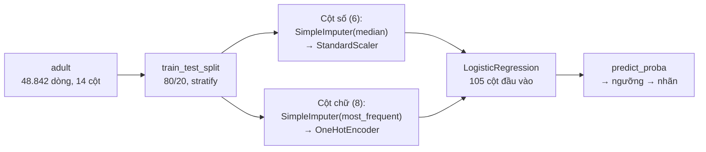

> **Mục tiêu bài học:** Sau bài này, bạn sẽ hiểu vì sao không dùng đường thẳng cho nhãn 0/1, cách sigmoid biến "điểm số" thành xác suất, cách đọc hệ số qua odds, vì sao log loss chính là cross-entropy của Foundations, và chạy được hồi quy logistic (logistic regression) trong một `Pipeline` trên bộ dữ liệu `adult`.

## 1. Ngân hàng duyệt vay: câu trả lời cần là một xác suất

Một hồ sơ vay trên bàn: số dư thẻ 1.500 đô, thu nhập 40.000 đô/năm, đang là sinh viên. Không ai trả lời được "người này *chắc chắn* vỡ nợ không"; câu hỏi thực tế là *"xác suất vỡ nợ bao nhiêu?"* Lọc thư rác, dự đoán khách rời bỏ dịch vụ, tầm soát bệnh - cùng một khuôn: nhãn chỉ có hai giá trị, nhưng thứ ta cần là **xác suất** của nhãn ấy.

Thử "chế" hồi quy tuyến tính của Bài 02: mã hóa nhãn 0/1, fit đường thẳng theo số dư thẻ. Sách *An Introduction to Statistical Learning* làm đúng thí nghiệm này trên bộ `Default` (10.000 khách hàng thẻ) - hình 4.2, mô tả bằng lời: các chấm dữ liệu chỉ nằm trên hai vạch ngang $y = 0$ và $y = 1$; đường thẳng cắt chéo qua giữa, ở đoạn số dư thấp nó **chui xuống dưới 0** - "xác suất" âm - và kéo sang phải sẽ vượt quá 1. Với ba nhãn, mã hóa 1, 2, 3 còn bịa thêm thứ tự giả (Foundations · Bài 12). Ta cần mô hình sinh ra *đúng* một số trong khoảng (0, 1): **hồi quy logistic (logistic regression)** - có chữ "hồi quy" vì nó ước lượng một đại lượng liên tục, nhưng việc của nó là phân loại.

Chi tiết từ thực tế: hồi quy logistic vẫn quen mặt trong chấm điểm tín dụng vì ngân hàng phải *giải thích được* lý do từ chối. Bài *Interpretable Selective Learning in Credit Risk* (Chen, Ye & Ye, arXiv 2022) nhận xét các phương pháp phi tuyến "thường bị cơ quan quản lý tài chính coi là thiếu khả năng diễn giải, nên chưa được áp dụng rộng trong đánh giá rủi ro tín dụng"; ở Việt Nam, Tạp chí Thị trường Tài chính Tiền tệ (Đặng Thị Thu Hằng, 2019) giới thiệu mô hình logistic ước lượng xác suất vỡ nợ trên mẫu 200 doanh nghiệp niêm yết. Mục 3 cho thấy vì sao nó "giải thích được".

## 2. Sigmoid: ép đường thẳng vào khoảng (0, 1)

Giữ nguyên cỗ máy núm vặn tuyến tính của Bài 02 - thợ ống nước tính tiền $z = b_0 + b_1 x_1 + \dots + b_k x_k$ - nhưng coi $z$ là một **điểm số** chạy từ $-\infty$ đến $+\infty$, rồi đưa qua hàm **sigmoid** (hàm logistic):

$$p = \sigma(z) = \frac{1}{1 + e^{-z}}$$

```
 p
1,0 ┤                                    ● ● ● ● ●
0,9 ┤                                ●
0,8 ┤                             ●
0,7 ┤                           ●
0,5 ┤ · · · · · · · · · · · · ●  ← z = 0 → p = 0,5: ranh giới quyết định
0,3 ┤                       ●
0,2 ┤                     ●
0,1 ┤                  ●
0,0 ┤ ● ● ● ● ● ● ●
    └───┬────┬────┬────┬────┬────┬────┬────┬──► z
       -4   -3   -2   -1    0    1    2    3    4
```

Sigmoid nhận bất kỳ số thực nào và trả về một số trong (0, 1); đường cong chữ S chỉ tiệm cận 0 và 1 - hết chuyện xác suất âm. Trên bộ `Default`, sách fit được $z = -10{,}6513 + 0{,}0055 \times \text{balance}$ (bảng 4.1): số dư 1.000 đô → $p \approx 0{,}0058$; 2.000 đô → $p \approx 0{,}586$.

**Ranh giới quyết định (decision boundary)** là nơi $p = 0{,}5$, tức $z = 0$: một feature → một điểm ($\text{balance} = 10{,}6513/0{,}0055 \approx 1.937$ đô); hai feature → một đường thẳng; nhiều hơn → một "mặt phẳng" nhiều chiều. Hồi quy logistic là mô hình **ranh giới tuyến tính** - ranh giới cong để dành cho k-NN, cây và SVM ở các bài sau.

> 🔧 **Thử ngay:** với công thức trên, khách có số dư 1.500 đô có xác suất vỡ nợ bao nhiêu?
> $z = -10{,}6513 + 0{,}0055 \times 1.500 = -2{,}4013$; $p = 1/(1 + e^{2{,}4013}) = 1/(1 + 11{,}04) \approx$ **0,083**. Tự kiểm: 1.500 nằm bên trái ranh giới 1.937 đô nên $p$ phải dưới 0,5 - đúng.

## 3. Đọc hệ số bằng odds: "tăng một đơn vị thì odds nhân bao nhiêu"

*"Hệ số của cột 'số năm đi học' là 0,7 - nghĩa là gì?"* Ở Bài 02, đó là "thêm một năm học, thu nhập dự đoán tăng 0,7 đơn vị". Ở đây không thể nói "xác suất tăng 0,7": hệ số tác động lên một đại lượng khác - **odds**.

**Odds** của một sự kiện là $p/(1-p)$: $p = 0{,}2$ → odds $0{,}25$ (1 người vỡ nợ trên 4 người không); $p = 0{,}5$ → 1; $p = 0{,}9$ → 9 - giới cá cược đua ngựa quen dùng odds hơn xác suất từ lâu, sách *An Introduction to Statistical Learning* nhắc vậy. Biến đổi công thức sigmoid một chút:

$$\log\frac{p}{1-p} = b_0 + b_1 x_1 + \dots + b_k x_k$$

Vế trái là **log-odds** (logit): hồi quy logistic chính là *hồi quy tuyến tính trên log-odds*. Từ đó:

> Tăng $x_j$ thêm **một đơn vị** (giữ các cột khác cố định) → log-odds tăng thêm $b_j$ → **odds nhân với $e^{b_j}$**.

Hệ số 0,7 → odds nhân $e^{0{,}7} \approx 2{,}01$: thêm một năm học, odds thu nhập cao gấp đôi. Hệ số âm thì odds co lại; hệ số 0 → nhân 1.

| Hệ số $b_j$ | $e^{b_j}$ | Đọc |
|---|---|---|
| 0,7 | ≈ 2,01 | odds tăng gấp đôi |
| 0 | 1 | không đổi |
| −0,5 | ≈ 0,61 | odds giảm 39% |
| 2 | ≈ 7,39 | odds tăng hơn 7 lần |

> 🔧 **Thử ngay:** một mô hình cho hệ số $-1{,}2$ với cột "chưa từng kết hôn". Odds nhân bao nhiêu?
> $e^{-1{,}2} \approx$ **0,30** - giữ các cột khác cố định, odds thu nhập cao của người chưa kết hôn chỉ bằng khoảng 30% người còn lại. Bạn sẽ gặp gần đúng con số này ở mục 5.

<details>
<summary><b>Chi tiết bất ngờ: hệ số đổi dấu khi thêm cột - nghịch lý sinh viên</b></summary>

Trên bộ `Default`, sách fit hai mô hình. Chỉ dùng cột "là sinh viên": hệ số **+0,40** - sinh viên vỡ nợ nhiều hơn. Thêm số dư thẻ và thu nhập: hệ số thành **−0,65** - *với cùng số dư thẻ*, sinh viên vỡ nợ **ít hơn**. Lý do: sinh viên có xu hướng nợ thẻ nhiều hơn, mà nợ nhiều thì dễ vỡ nợ. Sách gọi đây là **confounding (nhiễu do biến ẩn)**: hệ số chỉ có nghĩa *trong bối cảnh các cột cùng mô hình*, và liên hệ trong dữ liệu không phải nhân quả.

</details>

> ⚠️ **Lưu ý nhỏ:** cùng một mức tăng log-odds cho mức tăng *xác suất* rất khác nhau tùy điểm xuất phát: cộng 0,7 vào log-odds đưa $p$ từ 0,5 lên 0,67, nhưng chỉ đưa 0,01 lên 0,02 - muốn báo cáo bằng xác suất, hãy tính $p$ cho từng hồ sơ. Với cột số đã qua `StandardScaler` (mục 5), "một đơn vị" là *một độ lệch chuẩn*, không phải một năm hay một giờ.

## 4. Máy học hệ số bằng cách nào: log loss chính là cross-entropy

Hồi quy tuyến tính chọn hệ số bằng cách giảm MSE. Với xác suất, tiêu chí tự nhiên hơn là **maximum likelihood (hợp lý cực đại)**: chọn hệ số sao cho xác suất mô hình gán cho *những gì đã thực sự xảy ra* là lớn nhất. Lấy log rồi đổi dấu để có hàm "càng thấp càng tốt":

$$\text{log loss} = -\frac{1}{n}\sum_{i} \log\big(\text{xác suất gán cho nhãn đúng của hồ sơ } i\big)$$

Đây chính là **cross-entropy** của Foundations · Bài 10 - cùng một hàm, ba cái tên (log loss, binary cross-entropy, negative log-likelihood). Ba hồ sơ được gán 0,9; 0,7; 0,2 cho nhãn đúng → loss $= (0{,}105 + 0{,}357 + 1{,}609)/3 \approx 0{,}69$; hồ sơ "tự tin sai" gánh gần ba phần tư tổng phạt. Hàm này trơn, nên máy tìm hệ số theo cách người xuống núi trong sương mù của Foundations · Bài 11: scikit-learn mặc định dùng `lbfgs`, tối đa 100 vòng lặp - trên `adult` ở mục 5 nó hội tụ sau 78 vòng. Log loss cũng đáng xem cạnh accuracy vì nó chấm cả *độ tự tin*: mô hình mục 5 đạt ≈ 0,32 trên test, còn "mô hình" gán cho mọi người cùng xác suất 24% đạt ≈ 0,55.

> ⚠️ **Lưu ý nhỏ:** `LogisticRegression` của scikit-learn **mặc định có regularization L2** (`C = 1.0`; `C` càng nhỏ phạt càng mạnh) - tài liệu chính chủ ghi rõ "regularization is applied by default". Với `adult` (39.073 dòng train, 105 cột sau one-hot), đổi `C` từ 0,01 lên 100 chỉ xê dịch accuracy trong khoảng 0,8516-0,8525; với dữ liệu ít dòng nhiều cột thì khác hẳn - chuyện của Bài 04.

## 5. Chạy thật: dự đoán thu nhập trên 50K từ hồ sơ điều tra dân số

Bộ `adult` (UCI; Barry Becker và Ronny Kohavi trích từ điều tra dân số Mỹ năm 1994) sẽ theo bạn suốt chương: 48.842 người, 14 cột - 6 cột số (tuổi, số năm học, giờ làm/tuần, lãi/lỗ vốn, `fnlwgt`), 8 cột chữ (nghề, học vấn, hôn nhân, giới tính, quốc gia...); nhiệm vụ: đoán thu nhập có trên 50.000 đô/năm không. Cột chữ cần one-hot, và có giá trị thiếu - bản OpenML `version=2` ghi `NaN` ở `workclass` (2.799 dòng), `occupation` (2.809), `native-country` (857) - đúng việc của Foundations · Bài 12. Chỉ **23,9%** thu nhập trên 50K - lệch lớp, accuracy một mình sẽ nói dối (Foundations · Bài 15).



```python
from sklearn.datasets import fetch_openml
from sklearn.model_selection import train_test_split
from sklearn.compose import ColumnTransformer
from sklearn.pipeline import Pipeline
from sklearn.impute import SimpleImputer
from sklearn.preprocessing import OneHotEncoder, StandardScaler
from sklearn.linear_model import LogisticRegression
from sklearn.dummy import DummyClassifier
from sklearn.metrics import classification_report, roc_auc_score

adult = fetch_openml("adult", version=2, as_frame=True)
X, y = adult.data, (adult.target == ">50K").astype(int)      # nhãn 1 = thu nhập > 50K
X_train, X_test, y_train, y_test = train_test_split(
    X, y, test_size=0.2, random_state=42, stratify=y)        # stratify: giữ tỷ lệ 24% ở cả hai tập

numeric_columns  = X.select_dtypes(include="number").columns              # 6 cột số
categorical_columns = X.columns.difference(numeric_columns)                               # 8 cột chữ
preprocessor = ColumnTransformer([
    ("so",  Pipeline([("dien", SimpleImputer(strategy="median")),
                      ("scale", StandardScaler())]), numeric_columns),
    ("chu", Pipeline([("dien", SimpleImputer(strategy="most_frequent")),
                      ("onehot", OneHotEncoder(handle_unknown="ignore"))]), categorical_columns),
])
model = Pipeline([("tien_xu_ly", preprocessor),
                  ("logistic", LogisticRegression(max_iter=1000))])
model.fit(X_train, y_train)                                  # các bước fit CHỈ nhìn tập train

print(classification_report(y_test, model.predict(X_test), digits=3))
print("AUC:", round(roc_auc_score(y_test, model.predict_proba(X_test)[:, 1]), 3))
baseline = DummyClassifier(strategy="most_frequent").fit(X_train, y_train)
print(classification_report(y_test, baseline.predict(X_test), digits=3, zero_division=0))
```

Kết quả trên 9.769 dòng test (2.338 người thu nhập trên 50K), ngưỡng mặc định 0,5:

| Mô hình | Accuracy | Precision | Recall | F1 | AUC |
|---|---|---|---|---|---|
| `DummyClassifier` - luôn đoán "≤ 50K" | ≈ 0,761 | 0 | 0 | 0 | 0,5 |
| Hồi quy logistic | ≈ 0,852 | ≈ 0,741 | ≈ 0,589 | ≈ 0,656 | ≈ 0,904 |

Baseline "hùa theo số đông" có 76% accuracy mà không bắt được một ai thu nhập cao; mô hình thật lên 85%, và khi chỉ mặt ai là "trên 50K" thì đúng 74%, bắt được 59% số người thực sự trên 50K. Ma trận nhầm lẫn (hàng = thực tế, cột = máy đoán, quy ước scikit-learn): TN = 6.951, FP = 480, FN = 962, TP = 1.376.

Mở hệ số ra đọc bằng odds của mục 3 (`model[-1].coef_[0]` ghép với `model[0].get_feature_names_out()`):

- `Married-civ-spouse` **+1,66**, `Never-married` **−1,24**: chênh 2,90 → odds gấp $e^{2{,}90} \approx 18$ lần khi giữ các cột khác cố định (dữ liệu thô: 44,6% so với 4,5% có thu nhập cao).
- `education-num` (đã scale) **+0,74** → mỗi độ lệch chuẩn (≈ 2,6 năm học) odds nhân ≈ 2,1; `capital-gain` **+2,27**, lớn nhất trong nhóm cột số.
- `sex_Male` −0,22, `sex_Female` −0,92: chênh 0,70 → odds nam gấp ≈ 2,0 lần nữ (tỷ lệ thô: 30,4% so với 10,9%). Đây là **liên hệ trong dữ liệu điều tra năm 1994**, không phải nhân quả - chuyện công bằng của mô hình để dành cho Bài 12.

> 🔧 **Thử ngay:** từ bốn ô TN = 6.951, FP = 480, FN = 962, TP = 1.376, tính lại accuracy, precision và recall bằng tay rồi so với bảng.
> Accuracy $= (6.951 + 1.376)/9.769 \approx$ **0,852**; precision $= 1.376/(1.376 + 480) \approx$ **0,741**; recall $= 1.376/(1.376 + 962) \approx$ **0,589**. Khớp.

## 6. Ngưỡng 0,5 không phải luật: chọn theo chi phí

Phòng marketing muốn gửi ưu đãi cho người *có khả năng* thu nhập cao: bỏ sót một khách tiềm năng (FN) tiếc hơn gửi nhầm một tờ rơi (FP); một quỹ tín dụng dùng mô hình để *miễn thẩm định* thì ngược lại. Cùng một mô hình, hai ngưỡng - bài học nấm death cap của Foundations · Bài 15: **quyết định = xác suất × hậu quả**, và ngưỡng là nơi hậu quả bước vào.

Với `LogisticRegression` nhị phân, `predict()` tương ứng ngưỡng xác suất 0,5. Muốn ngưỡng khác, lấy xác suất từ `predict_proba` rồi tự so sánh:

```python
p = model.predict_proba(X_test)[:, 1]      # xác suất thu nhập > 50K của từng người
predictions = (p >= 0.3).astype(int)           # hạ ngưỡng xuống 0,3: "mạnh tay" báo dương hơn
```

| Ngưỡng | Precision | Recall | F1 | Báo động giả (FP) | Bỏ lọt (FN) |
|---|---|---|---|---|---|
| 0,3 | ≈ 0,612 | ≈ 0,791 | ≈ 0,690 | 1.173 | 489 |
| 0,5 | ≈ 0,741 | ≈ 0,589 | ≈ 0,656 | 480 | 962 |
| 0,7 | ≈ 0,855 | ≈ 0,382 | ≈ 0,528 | 151 | 1.445 |

Hạ ngưỡng từ 0,5 xuống 0,3: bắt thêm 473 người thu nhập cao, đổi lại báo động giả gấp 2,4 lần. Không ngưỡng nào "đúng" - bảng chỉ trải các lựa chọn ra, còn quyết định thuộc về người nắm rõ chi phí; F1 cao nhất trong bảng lại rơi vào 0,3.

> ⚠️ **Lưu ý nhỏ:** chọn ngưỡng cũng là một quyết định "học" từ dữ liệu - chọn trên validation hoặc cross-validation, không nhìn tập test rồi chốt (An và Bình, Foundations · Bài 04). scikit-learn từ bản 1.5 có `TunedThresholdClassifierCV` để dò ngưỡng theo một metric hoặc hàm chi phí.

## 7. Nhiều hơn hai lớp: softmax

Ba chẩn đoán cấp cứu, bốn ngăn email, mười loài vật trong ảnh: cho **mỗi lớp một điểm số tuyến tính** $z_k$ riêng, rồi thay sigmoid bằng **softmax**:

$$p_k = \frac{e^{z_k}}{\sum_j e^{z_j}}$$

Lũy thừa $e$ làm mọi điểm số thành số dương; chia cho tổng làm chúng cộng đúng bằng 1: $(2;\ 1;\ 0{,}1) \to (0{,}659;\ 0{,}242;\ 0{,}099)$. Hai lớp thì softmax rút về sigmoid: $(3;\ 0) \to (0{,}953;\ 0{,}047)$, đúng bằng $\sigma(3)$. Cross-entropy vẫn là hàm mất mát. Sách *Dive into Deep Learning* lần ngược gốc gác phép tính này về vật lý thống kê (Gibbs 1902, kế thừa phân bố Boltzmann). Softmax cũng là tầng đầu ra của phần lớn mạng nơ-ron phân loại - hẹn ở chương Deep Learning. `LogisticRegression` tự chuyển sang softmax khi nhãn có hơn hai lớp: trên `load_iris` (3 loài hoa), `coef_` có 3 hàng, và mỗi dòng kết quả `predict_proba` trả về cộng lại đúng bằng 1.

## Tóm tắt bài học

- Đường thẳng không hợp nhãn 0/1: "xác suất" âm hoặc trên 1, thứ tự giả khi nhiều hơn hai lớp. Hồi quy logistic giữ phần tuyến tính $z$ nhưng ép qua **sigmoid** $1/(1+e^{-z})$; **ranh giới quyết định** là nơi $z = 0$ - ranh giới tuyến tính.
- Hệ số tác động lên **log-odds**: tăng $x_j$ một đơn vị → odds nhân $e^{b_j}$ (0,7 → ≈ 2,01). Hệ số chỉ có nghĩa trong bối cảnh các cột cùng mô hình (nghịch lý sinh viên); liên hệ không phải nhân quả.
- Máy học hệ số bằng **maximum likelihood**; hàm mất mát là **log loss = cross-entropy** (Foundations · Bài 10). `LogisticRegression` của scikit-learn mặc định có phạt L2.
- Trên `adult` (23,9% thu nhập > 50K): baseline accuracy 0,761 nhưng recall 0; hồi quy logistic ≈ 0,852 / precision 0,741 / recall 0,589 / AUC 0,904 - gói trong `Pipeline` + `ColumnTransformer`, fit chỉ nhìn tập train.
- **Ngưỡng là quyết định theo chi phí**: 0,3 bắt được 79% người thu nhập cao nhưng báo nhầm gấp 2,4 lần so với 0,5; chọn ngưỡng trên validation.
- Nhiều lớp → **softmax**: mỗi lớp một điểm số, lũy thừa rồi chuẩn hóa về tổng 1; hai lớp thì softmax trùng sigmoid.

## Câu hỏi tự kiểm tra

1. Đồng nghiệp fit hồi quy tuyến tính lên nhãn 0/1 và nói "cứ dự đoán trên 0,5 thì gán nhãn 1, có sao đâu". Nêu hai vấn đề của cách làm này.
2. **Tính tay:** mô hình có $z = -3 + 0{,}8 \times \text{(số năm kinh nghiệm)}$. Tính xác suất cho người có 2 năm và 5 năm kinh nghiệm. Ranh giới quyết định nằm ở bao nhiêu năm?
3. Hệ số của cột "có tài sản thế chấp" là 1,1. Diễn giải bằng odds. Vì sao *không* được nói "xác suất tăng thêm 1,1" hay "tăng 110%"?
4. Vì sao hồi quy logistic dùng log loss thay vì MSE? Liên hệ với ý "tự tin mà sai bị phạt nặng" ở Foundations · Bài 10.
5. Trên `adult`, mô hình đạt accuracy 0,852 còn baseline 0,761. Một người nói "chỉ hơn 9 điểm, chẳng đáng gì". Dùng precision và recall để phản biện.
6. Bạn xây bộ lọc tin nhắn lừa đảo cho ứng dụng ngân hàng: chặn nhầm tin thật rất phiền, nhưng để lọt tin lừa đảo có thể mất tiền. Bạn dịch ngưỡng về phía nào so với 0,5, và kiểm chứng lựa chọn đó trên tập dữ liệu nào?

## Đọc thêm

**Nguồn nền tảng của bài:**

| Nguồn | Đọc phần nào |
|---|---|
| **An Introduction to Statistical Learning (ISLP)** | Chương 4, mục 4.2 - *Why Not Linear Regression?* (hình 4.2); mục 4.3 - mô hình logistic, odds và log-odds, maximum likelihood, bảng 4.1-4.3 (nghịch lý sinh viên); mục 4.3.5 - multinomial và softmax |
| **An Introduction to Statistical Learning (ISLP)** | Chương 4, mục 4.4.2 - ma trận nhầm lẫn và việc hạ ngưỡng trên dữ liệu `Default` (bảng 4.4-4.5) |
| **Dive into Deep Learning (d2l.ai)** | Chương 4.1 - *Softmax Regression*: softmax, cross-entropy và gốc gác từ lý thuyết thông tin |

**Nguồn online bổ sung (miễn phí):**

- [LogisticRegression - scikit-learn API](https://scikit-learn.org/stable/modules/generated/sklearn.linear_model.LogisticRegression.html) - tham số `C`, `penalty`, `solver`, `max_iter`; ghi chú "regularization is applied by default".
- [Logistic regression - scikit-learn User Guide](https://scikit-learn.org/stable/modules/linear_model.html#logistic-regression) - công thức hàm mất mát nhị phân và multinomial.
- [Logistic Regression - Machine Learning Crash Course (Google)](https://developers.google.com/machine-learning/crash-course/logistic-regression) - sigmoid, log-odds, log loss và regularization.
- [Bài 10: Logistic Regression - Machine Learning cơ bản](https://machinelearningcoban.com/2017/01/27/logisticregression/) - bài tiếng Việt của Vũ Hữu Tiệp, dẫn cross-entropy từ maximum likelihood, có code.
- [Interpretable Selective Learning in Credit Risk (arXiv 2022)](https://arxiv.org/abs/2209.10127) - nguồn của nhận định về hồi quy logistic trong đánh giá rủi ro tín dụng.
- [Ứng dụng mô hình logistic trong quản trị rủi ro tín dụng - Tạp chí Thị trường Tài chính Tiền tệ](https://thitruongtaichinhtiente.vn/ung-dung-mo-hinh-logistic-trong-quan-tri-rui-ro-tin-dung-23580.html) - ví dụ ước lượng xác suất vỡ nợ trên dữ liệu doanh nghiệp niêm yết Việt Nam.

> **Bài tiếp theo:** [Regularization: Ridge, Lasso và nghệ thuật kìm mô hình](../regularization-ridge-lasso-elasticnet-vi/) - bạn vừa thấy `LogisticRegression` âm thầm "phạt" hệ số lớn theo mặc định - phạt để làm gì, phạt kiểu nào, và mức phạt chọn ra sao khi mô hình có quá nhiều núm vặn so với dữ liệu.
