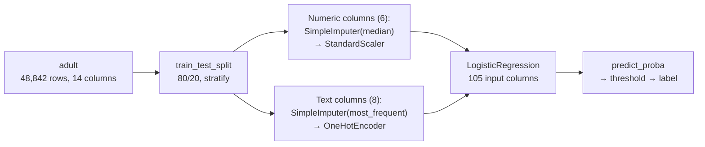

> **Learning objectives:** After this lesson, you will understand why a straight line is wrong for 0/1 labels, how the sigmoid turns a "score" into a probability, how to read coefficients through odds, why log loss is exactly the cross-entropy from Foundations, and you will be able to run logistic regression inside a `Pipeline` on the `adult` dataset.

## 1. A bank approving a loan: the answer has to be a probability

A loan application on the desk: card balance 1,500 USD, income 40,000 USD/year, currently a student. Nobody can answer "will this person *certainly* default?"; the practical question is *"what is the probability of default?"* Spam filtering, predicting customer churn, screening for a disease - same mold: the label has only two values, but what we need is the **probability** of that label.

Let's try "hacking" the linear regression of Lesson 02: encode the label as 0/1, fit a straight line against card balance. *An Introduction to Statistical Learning* runs exactly this experiment on the `Default` dataset (10,000 card customers) - figure 4.2, described in words: the data points sit only on the two horizontal lines $y = 0$ and $y = 1$; the straight line cuts diagonally through the middle, and in the low-balance region it **dips below 0** - a negative "probability" - while stretching it to the right takes it above 1. With three labels, encoding them 1, 2, 3 even invents a fake ordering (Foundations · Lesson 12). We need a model that produces *exactly* one number in the interval (0, 1): **logistic regression** - it carries the word "regression" because it estimates a continuous quantity, but its job is classification.

A detail from practice: logistic regression is still a familiar face in credit scoring because the bank has to be able to *explain* why it refused. The paper *Interpretable Selective Learning in Credit Risk* (Chen, Ye & Ye, arXiv 2022) remarks that nonlinear methods "are often deemed by financial regulators as lacking interpretability, and so have not been widely adopted in credit risk assessment"; in Vietnam, Tạp chí Thị trường Tài chính Tiền tệ (the Financial and Monetary Markets Review; Đặng Thị Thu Hằng, 2019) presents a logistic model estimating default probability on a sample of 200 listed companies. Section 3 shows why it is "explainable".

## 2. The sigmoid: squeezing the straight line into (0, 1)

Keep the linear knob machine of Lesson 02 - the plumber's bill $z = b_0 + b_1 x_1 + \dots + b_k x_k$ - but treat $z$ as a **score** running from $-\infty$ to $+\infty$, then pass it through the **sigmoid** (logistic function):

$$p = \sigma(z) = \frac{1}{1 + e^{-z}}$$

```
 p
1.0 ┤                                    ● ● ● ● ●
0.9 ┤                                ●
0.8 ┤                             ●
0.7 ┤                           ●
0.5 ┤ · · · · · · · · · · · · ●  ← z = 0 → p = 0.5: decision boundary
0.3 ┤                       ●
0.2 ┤                     ●
0.1 ┤                  ●
0.0 ┤ ● ● ● ● ● ● ●
    └───┬────┬────┬────┬────┬────┬────┬────┬──► z
       -4   -3   -2   -1    0    1    2    3    4
```

The sigmoid takes any real number and returns a number in (0, 1); the S-shaped curve only approaches 0 and 1 asymptotically - no more negative probabilities. On the `Default` dataset, the book fits $z = -10.6513 + 0.0055 \times \text{balance}$ (table 4.1): a balance of 1,000 USD → $p \approx 0.0058$; 2,000 USD → $p \approx 0.586$.

The **decision boundary** is where $p = 0.5$, i.e. $z = 0$: one feature → a single point ($\text{balance} = 10.6513/0.0055 \approx 1{,}937$ USD); two features → a straight line; more → a multi-dimensional "plane". Logistic regression is a **linear-boundary** model - curved boundaries are reserved for k-NN, trees and SVMs in later lessons.

> 🔧 **Try it now:** using the formula above, what is the default probability for a customer with a balance of 1,500 USD?
> $z = -10.6513 + 0.0055 \times 1{,}500 = -2.4013$; $p = 1/(1 + e^{2.4013}) = 1/(1 + 11.04) \approx$ **0.083**. Self-check: 1,500 lies to the left of the 1,937 USD boundary, so $p$ must be below 0.5 - correct.

## 3. Reading coefficients through odds: "one more unit multiplies the odds by how much"

*"The coefficient of the 'years of schooling' column is 0.7 - what does that mean?"* In Lesson 02 it meant "one more year of schooling, predicted income rises by 0.7 units". Here you cannot say "the probability rises by 0.7": the coefficient acts on a different quantity - the **odds**.

The **odds** of an event are $p/(1-p)$: $p = 0.2$ → odds $0.25$ (1 person defaults for every 4 who do not); $p = 0.5$ → 1; $p = 0.9$ → 9 - horse-racing bettors have long preferred odds to probabilities, as *An Introduction to Statistical Learning* points out. Rearrange the sigmoid formula a little:

$$\log\frac{p}{1-p} = b_0 + b_1 x_1 + \dots + b_k x_k$$

The left-hand side is the **log-odds** (logit): logistic regression is precisely *linear regression on the log-odds*. From that:

> Increase $x_j$ by **one unit** (holding the other columns fixed) → the log-odds increase by $b_j$ → **the odds are multiplied by $e^{b_j}$**.

A coefficient of 0.7 → odds multiplied by $e^{0.7} \approx 2.01$: one more year of schooling, and the odds of high income double. A negative coefficient shrinks the odds; a coefficient of 0 → multiply by 1.

| Coefficient $b_j$ | $e^{b_j}$ | Reading |
|---|---|---|
| 0.7 | ≈ 2.01 | odds double |
| 0 | 1 | unchanged |
| −0.5 | ≈ 0.61 | odds fall by 39% |
| 2 | ≈ 7.39 | odds rise more than 7-fold |

> 🔧 **Try it now:** a model gives a coefficient of $-1.2$ for the "never married" column. By how much are the odds multiplied?
> $e^{-1.2} \approx$ **0.30** - holding the other columns fixed, the odds of high income for someone never married are only about 30% of everyone else's. You will meet almost exactly this number in section 5.

<details>
<summary><b>A surprising detail: a coefficient flips sign when a column is added - the student paradox</b></summary>

On the `Default` dataset, the book fits two models. Using only the "is a student" column: coefficient **+0.40** - students default more. Add card balance and income: the coefficient becomes **−0.65** - *at the same card balance*, students default **less**. The reason: students tend to carry more card debt, and more debt means more defaults. The book calls this **confounding**: a coefficient only has meaning *in the context of the other columns in the same model*, and an association in the data is not causation.

</details>

> ⚠️ **A small note:** the same increase in log-odds gives very different increases in *probability* depending on the starting point: adding 0.7 to the log-odds takes $p$ from 0.5 to 0.67, but only takes 0.01 to 0.02 - if you want to report in probabilities, compute $p$ for each application. For numeric columns passed through `StandardScaler` (section 5), "one unit" is *one standard deviation*, not one year or one hour.

## 4. How the machine learns the coefficients: log loss is exactly cross-entropy

Linear regression picks coefficients by reducing MSE. With probabilities, the more natural criterion is **maximum likelihood**: choose the coefficients so that the probability the model assigns to *what actually happened* is as large as possible. Take the log and flip the sign to get a "lower is better" function:

$$\text{log loss} = -\frac{1}{n}\sum_{i} \log\big(\text{probability assigned to the true label of record } i\big)$$

This is exactly the **cross-entropy** of Foundations · Lesson 10 - one function, three names (log loss, binary cross-entropy, negative log-likelihood). Three records assigned 0.9, 0.7 and 0.2 to their true labels → loss $= (0.105 + 0.357 + 1.609)/3 \approx 0.69$; the "confidently wrong" record carries nearly three quarters of the total penalty. The function is smooth, so the machine finds the coefficients the way the hiker descends the mountain in fog in Foundations · Lesson 11: scikit-learn uses `lbfgs` by default, at most 100 iterations - on `adult` in section 5 it converges after 78 iterations. Log loss is also worth looking at alongside accuracy because it scores *confidence* too: the model of section 5 reaches ≈ 0.32 on the test set, while a "model" that assigns everyone the same 24% probability gets ≈ 0.55.

> ⚠️ **A small note:** scikit-learn's `LogisticRegression` **applies L2 regularization by default** (`C = 1.0`; the smaller `C`, the stronger the penalty) - the official documentation states plainly that "regularization is applied by default". On `adult` (39,073 training rows, 105 columns after one-hot), changing `C` from 0.01 to 100 only moves accuracy within the range 0.8516-0.8525; with few rows and many columns it is a different story - the subject of Lesson 04.

## 5. Running it for real: predicting income above 50K from census records

The `adult` dataset (UCI; extracted by Barry Becker and Ronny Kohavi from the 1994 US census) will follow you throughout the chapter: 48,842 people, 14 columns - 6 numeric columns (age, years of schooling, hours per week, capital gain/loss, `fnlwgt`), 8 text columns (occupation, education, marital status, sex, country...); the task: predict whether income exceeds 50,000 USD/year. The text columns need one-hot encoding, and there are missing values - the OpenML `version=2` release has `NaN` in `workclass` (2,799 rows), `occupation` (2,809) and `native-country` (857) - exactly the job of Foundations · Lesson 12. Only **23.9%** earn above 50K - class imbalance, so accuracy on its own will lie (Foundations · Lesson 15).



```python
from sklearn.datasets import fetch_openml
from sklearn.model_selection import train_test_split
from sklearn.compose import ColumnTransformer
from sklearn.pipeline import Pipeline
from sklearn.impute import SimpleImputer
from sklearn.preprocessing import OneHotEncoder, StandardScaler
from sklearn.linear_model import LogisticRegression
from sklearn.dummy import DummyClassifier
from sklearn.metrics import classification_report, roc_auc_score

adult = fetch_openml("adult", version=2, as_frame=True)
X, y = adult.data, (adult.target == ">50K").astype(int)      # label 1 = income > 50K
X_train, X_test, y_train, y_test = train_test_split(
    X, y, test_size=0.2, random_state=42, stratify=y)        # stratify: keep the 24% ratio in both sets

numeric_columns  = X.select_dtypes(include="number").columns              # 6 numeric columns
categorical_columns = X.columns.difference(numeric_columns)                               # 8 text columns
preprocessor = ColumnTransformer([
    ("so",  Pipeline([("dien", SimpleImputer(strategy="median")),
                      ("scale", StandardScaler())]), numeric_columns),
    ("chu", Pipeline([("dien", SimpleImputer(strategy="most_frequent")),
                      ("onehot", OneHotEncoder(handle_unknown="ignore"))]), categorical_columns),
])
model = Pipeline([("tien_xu_ly", preprocessor),
                  ("logistic", LogisticRegression(max_iter=1000))])
model.fit(X_train, y_train)                                  # the fit steps look ONLY at the training set

print(classification_report(y_test, model.predict(X_test), digits=3))
print("AUC:", round(roc_auc_score(y_test, model.predict_proba(X_test)[:, 1]), 3))
baseline = DummyClassifier(strategy="most_frequent").fit(X_train, y_train)
print(classification_report(y_test, baseline.predict(X_test), digits=3, zero_division=0))
```

Results on the 9,769 test rows (2,338 people earning above 50K), default threshold 0.5:

| Model | Accuracy | Precision | Recall | F1 | AUC |
|---|---|---|---|---|---|
| `DummyClassifier` - always predicts "≤ 50K" | ≈ 0.761 | 0 | 0 | 0 | 0.5 |
| Logistic regression | ≈ 0.852 | ≈ 0.741 | ≈ 0.589 | ≈ 0.656 | ≈ 0.904 |

The "follow the majority" baseline gets 76% accuracy without catching a single high earner; the real model rises to 85%, and when it points at someone as "above 50K" it is right 74% of the time, catching 59% of those who really are above 50K. The confusion matrix (rows = actual, columns = predicted, scikit-learn convention): TN = 6,951, FP = 480, FN = 962, TP = 1,376.

Open up the coefficients and read them with the odds of section 3 (`model[-1].coef_[0]` paired with `model[0].get_feature_names_out()`):

- `Married-civ-spouse` **+1.66**, `Never-married` **−1.24**: a gap of 2.90 → odds $e^{2.90} \approx 18$ times higher, holding the other columns fixed (raw data: 44.6% versus 4.5% high earners).
- `education-num` (scaled) **+0.74** → each standard deviation (≈ 2.6 years of schooling) multiplies the odds by ≈ 2.1; `capital-gain` **+2.27**, the largest among the numeric columns.
- `sex_Male` −0.22, `sex_Female` −0.92: a gap of 0.70 → men's odds ≈ 2.0 times women's (raw rates: 30.4% versus 10.9%). This is **an association in 1994 census data**, not causation - model fairness is saved for Lesson 12.

> 🔧 **Try it now:** from the four cells TN = 6,951, FP = 480, FN = 962, TP = 1,376, recompute accuracy, precision and recall by hand and compare with the table.
> Accuracy $= (6{,}951 + 1{,}376)/9{,}769 \approx$ **0.852**; precision $= 1{,}376/(1{,}376 + 480) \approx$ **0.741**; recall $= 1{,}376/(1{,}376 + 962) \approx$ **0.589**. They match.

## 6. The 0.5 threshold is not a law: choose by cost

The marketing department wants to send offers to people *likely* to be high earners: missing a potential customer (FN) hurts more than mailing one flyer by mistake (FP); a credit fund using the model to *waive an appraisal* is the opposite. One model, two thresholds - the death cap mushroom lesson of Foundations · Lesson 15: **decision = probability × consequence**, and the threshold is where the consequence steps in.

For binary `LogisticRegression`, `predict()` corresponds to a probability threshold of 0.5. For a different threshold, take the probabilities from `predict_proba` and compare them yourself:

```python
p = model.predict_proba(X_test)[:, 1]      # each person's probability of income > 50K
predictions = (p >= 0.3).astype(int)           # lower the threshold to 0.3: more "aggressive" in flagging positives
```

| Threshold | Precision | Recall | F1 | False alarms (FP) | Misses (FN) |
|---|---|---|---|---|---|
| 0.3 | ≈ 0.612 | ≈ 0.791 | ≈ 0.690 | 1,173 | 489 |
| 0.5 | ≈ 0.741 | ≈ 0.589 | ≈ 0.656 | 480 | 962 |
| 0.7 | ≈ 0.855 | ≈ 0.382 | ≈ 0.528 | 151 | 1,445 |

Lowering the threshold from 0.5 to 0.3: 473 more high earners caught, in exchange for 2.4 times as many false alarms. No threshold is "right" - the table only lays out the options, and the decision belongs to whoever knows the costs; the highest F1 in the table actually lands at 0.3.

> ⚠️ **A small note:** choosing a threshold is also a decision "learned" from data - choose it on a validation set or by cross-validation, not by peeking at the test set and locking it in (An and Binh, Foundations · Lesson 04). From version 1.5, scikit-learn has `TunedThresholdClassifierCV` to search for a threshold according to a metric or a cost function.

## 7. More than two classes: softmax

Three emergency-room diagnoses, four email folders, ten animal species in photos: give **each class its own linear score** $z_k$, then replace the sigmoid with **softmax**:

$$p_k = \frac{e^{z_k}}{\sum_j e^{z_j}}$$

Exponentiating with $e$ makes every score positive; dividing by the sum makes them add up to exactly 1: $(2;\ 1;\ 0.1) \to (0.659;\ 0.242;\ 0.099)$. With two classes, softmax reduces to the sigmoid: $(3;\ 0) \to (0.953;\ 0.047)$, exactly $\sigma(3)$. Cross-entropy is still the loss function. *Dive into Deep Learning* traces the origins of this computation back to statistical physics (Gibbs 1902, building on the Boltzmann distribution). Softmax is also the output layer of most classification neural networks - see you in the Deep Learning chapter. `LogisticRegression` switches to softmax on its own when the label has more than two classes: on `load_iris` (3 flower species), `coef_` has 3 rows, and each row returned by `predict_proba` sums to exactly 1.

## Lesson summary

- A straight line does not suit 0/1 labels: negative or above-1 "probabilities", fake ordering with more than two classes. Logistic regression keeps the linear part $z$ but squeezes it through the **sigmoid** $1/(1+e^{-z})$; the **decision boundary** is where $z = 0$ - a linear boundary.
- Coefficients act on the **log-odds**: increase $x_j$ by one unit → odds multiplied by $e^{b_j}$ (0.7 → ≈ 2.01). A coefficient only has meaning in the context of the other columns in the same model (the student paradox); association is not causation.
- The machine learns coefficients by **maximum likelihood**; the loss function is **log loss = cross-entropy** (Foundations · Lesson 10). scikit-learn's `LogisticRegression` applies an L2 penalty by default.
- On `adult` (23.9% earning > 50K): baseline accuracy 0.761 but recall 0; logistic regression ≈ 0.852 / precision 0.741 / recall 0.589 / AUC 0.904 - wrapped in `Pipeline` + `ColumnTransformer`, with fit looking only at the training set.
- **The threshold is a cost-based decision**: 0.3 catches 79% of high earners but raises 2.4 times as many false alarms as 0.5; choose the threshold on a validation set.
- Multiple classes → **softmax**: one score per class, exponentiate then normalize to sum to 1; with two classes softmax coincides with the sigmoid.

## Self-check questions

1. A colleague fits linear regression to 0/1 labels and says "just assign label 1 whenever the prediction is above 0.5, what's the harm". State two problems with this approach.
2. **By hand:** a model has $z = -3 + 0.8 \times \text{(years of experience)}$. Compute the probability for someone with 2 years and with 5 years of experience. At how many years does the decision boundary sit?
3. The coefficient of the "has collateral" column is 1.1. Interpret it through odds. Why can you *not* say "the probability rises by 1.1" or "rises by 110%"?
4. Why does logistic regression use log loss rather than MSE? Relate it to the idea "confident and wrong gets punished hard" from Foundations · Lesson 10.
5. On `adult`, the model reaches accuracy 0.852 while the baseline gets 0.761. Someone says "only 9 points better, hardly worth anything". Use precision and recall to argue back.
6. You are building a scam-message filter for a banking app: wrongly blocking a genuine message is very annoying, but letting a scam message through can cost money. Which way do you shift the threshold relative to 0.5, and on which dataset do you validate that choice?

## Further reading

**Foundational sources for this lesson:**

| Source | Which part to read |
|---|---|
| **An Introduction to Statistical Learning (ISLP)** | Chapter 4, section 4.2 - *Why Not Linear Regression?* (figure 4.2); section 4.3 - the logistic model, odds and log-odds, maximum likelihood, tables 4.1-4.3 (the student paradox); section 4.3.5 - multinomial and softmax |
| **An Introduction to Statistical Learning (ISLP)** | Chapter 4, section 4.4.2 - the confusion matrix and lowering the threshold on the `Default` data (tables 4.4-4.5) |
| **Dive into Deep Learning (d2l.ai)** | Chapter 4.1 - *Softmax Regression*: softmax, cross-entropy and their roots in information theory |

**Additional online sources (free):**

- [LogisticRegression - scikit-learn API](https://scikit-learn.org/stable/modules/generated/sklearn.linear_model.LogisticRegression.html) - the `C`, `penalty`, `solver`, `max_iter` parameters; the note "regularization is applied by default".
- [Logistic regression - scikit-learn User Guide](https://scikit-learn.org/stable/modules/linear_model.html#logistic-regression) - formulas for the binary and multinomial loss functions.
- [Logistic Regression - Machine Learning Crash Course (Google)](https://developers.google.com/machine-learning/crash-course/logistic-regression) - sigmoid, log-odds, log loss and regularization.
- [Bài 10: Logistic Regression - Machine Learning cơ bản](https://machinelearningcoban.com/2017/01/27/logisticregression/) - a Vietnamese-language post by Vũ Hữu Tiệp deriving cross-entropy from maximum likelihood, with code.
- [Interpretable Selective Learning in Credit Risk (arXiv 2022)](https://arxiv.org/abs/2209.10127) - source of the remark about logistic regression in credit risk assessment.
- [Ứng dụng mô hình logistic trong quản trị rủi ro tín dụng - Tạp chí Thị trường Tài chính Tiền tệ](https://thitruongtaichinhtiente.vn/ung-dung-mo-hinh-logistic-trong-quan-tri-rui-ro-tin-dung-23580.html) - (Applying the logistic model in credit risk management, Financial and Monetary Markets Review) an example of estimating default probability on data from Vietnamese listed companies.

> **Next lesson:** [Regularization: Ridge, Lasso and the Art of Restraining a Model](../regularization-ridge-lasso-elasticnet/) - you have just seen `LogisticRegression` quietly "penalize" large coefficients by default - what the penalty is for, what kinds there are, and how to pick its strength when the model has far too many knobs for the data.
