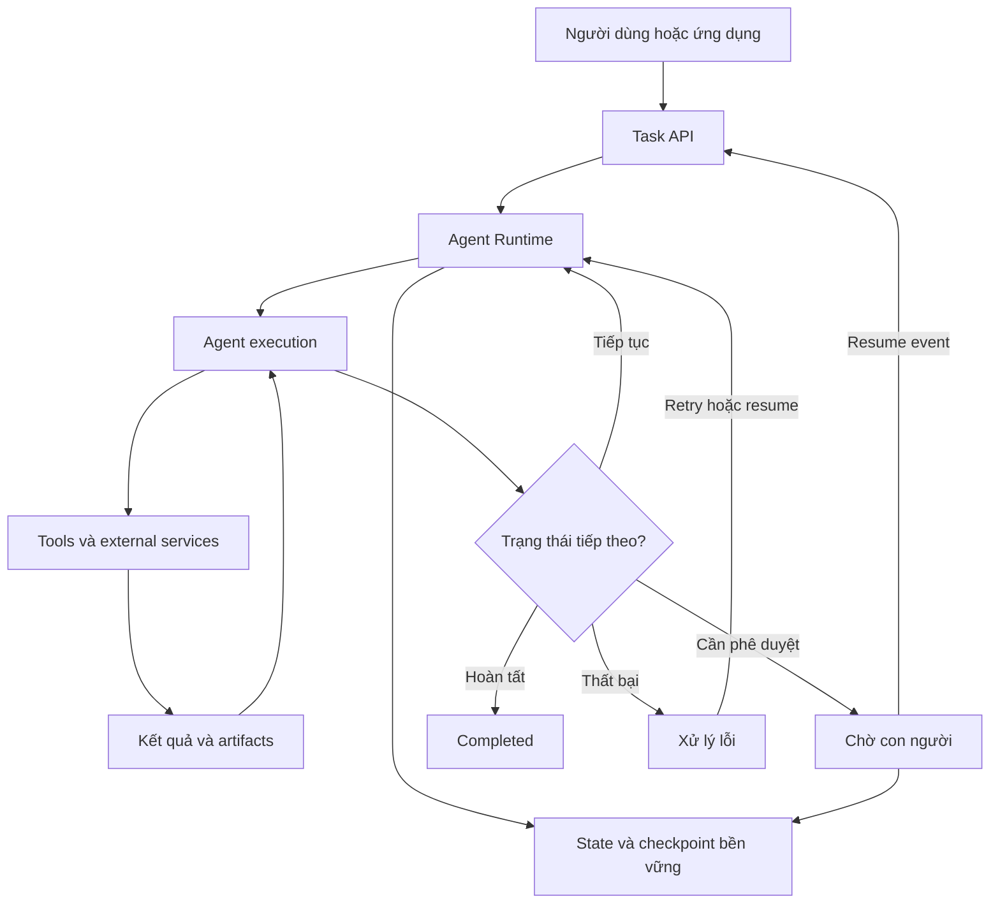
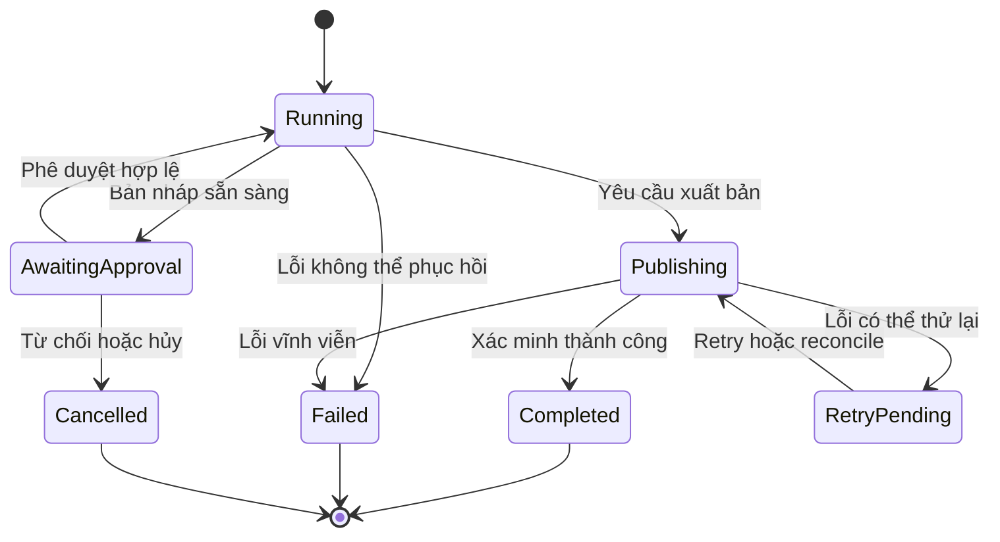

Một AI Agent có thể cần hàng chục bước để hoàn thành nhiệm vụ. Nhưng nếu service lỗi ở bước cuối, chúng ta có phải làm lại từ đầu? Nếu hành động đã thành công mà Agent không nhận được kết quả, điều gì ngăn nó thực hiện lần thứ hai?

## 1. Khi Agent làm được nửa việc rồi dừng lại

Giả sử người quản lý yêu cầu AI Assistant của chuỗi cửa hàng:

> "Hãy phân tích tình hình kinh doanh tháng 8, tạo báo cáo tổng hợp và gửi cho nhóm quản lý sau khi tôi phê duyệt."

Hệ thống phải lấy số liệu, phân tích biến động, tìm tài liệu, tạo bản nháp, chờ phê duyệt, rồi mới xuất bản và thông báo. Bốn bước đầu đã xong; người quản lý đóng trình duyệt và hôm sau mới quay lại. Trong lúc đó, service chạy Agent được deploy lại.

Nếu mọi thứ chỉ nằm trong bộ nhớ process, Agent có thể quên bản nháp, các bước đã hoàn thành và điều kiện đang chờ. Bắt đầu lại vừa tốn công vừa nguy hiểm nếu một bước có tác động thực tế.

Khó hơn nữa: người quản lý phê duyệt, API gửi báo cáo thành công, nhưng worker crash trước khi lưu kết quả. Sau khi khởi động lại, Agent thấy bước gửi chưa hoàn thành và gọi API lần nữa. Cả nhóm nhận hai bản giống nhau.

Đây là hai vấn đề cốt lõi của **long-running execution**: giữ được tiến trình qua nhiều phiên/process và phục hồi mà không tạo hành động trùng hoặc không hợp lệ. Một model reasoning tốt là chưa đủ; cần runtime quản lý state và side effects.

## 2. "Long-running" không chỉ có nghĩa là chạy lâu

Một background job tính toán 30 phút có thể chỉ cần queue, timeout và retry. Ngược lại, Agent xử lý hai phút rồi đợi phê duyệt đến ngày mai đã phải duy trì tiến trình qua nhiều phiên.

Nhiệm vụ có thể vượt qua context window, chờ người dùng, đợi tool bất đồng bộ, gặp worker restart, phải retry, bị hủy hoặc được nhiều Agent cùng xử lý. Điểm chung là **công việc phải tiếp tục đúng qua các giai đoạn thực thi**, không phải số phút nó chạy.

Bài [Context Engineering](../context-engineering-vi/) và [Agent Memory](../building-agent-memory-in-production-vi/) bàn về thông tin Agent được nhìn thấy và tái sử dụng. Ở đây cần phân biệt: **Memory giúp Agent dùng lại thông tin; execution state cho ứng dụng biết nhiệm vụ đã đến đâu và bước nào được phép chạy tiếp.**

"Người dùng thích biểu đồ đường" có thể là preference lâu dài. "Báo cáo tháng 8 phiên bản 2 đang chờ ai phê duyệt" là execution state của một nhiệm vụ cụ thể.

## 3. Cần lưu gì để Agent tiếp tục?

| Thành phần | Vai trò |
| :-- | :-- |
| Execution state | Trạng thái tiến trình và bước hiện tại |
| Task data | Input, dữ kiện đã xác minh và quyết định trung gian |
| Artifacts | Bản nháp, file và kết quả lớn |
| Action records | Theo dõi hành động đã yêu cầu hoặc đã thực hiện |

Một state khi chờ phê duyệt có thể như sau:

```json
{
  "execution_id": "RUN_001",
  "task_type": "monthly_report",
  "status": "awaiting_approval",
  "current_step": "review_report",
  "report_version": 2,
  "artifact_id": "REPORT_001_V2",
  "data_snapshot": "retail_snapshot_v1",
  "pending_action": {
    "type": "publish_report",
    "requires_approval": true
  }
}
```

Đây là schema minh họa. Nó cho hệ thống biết báo cáo đã có và không cần phân tích lại. Nội dung file lớn nên nằm trong object storage hoặc database, còn state chỉ giữ `artifact_id` và phiên bản. Kết quả SQL và tài liệu cũng có thể được lưu thành artifact có thể truy xuất, thay vì nhét toàn bộ conversation và raw tool output vào checkpoint.

## 4. Kiến trúc Durable Agent Runtime

LLM có thể chọn bước tiếp theo, nhưng application hoặc runtime phải giữ tiến trình và kiểm soát hành động quan trọng:



*Hình 1. Một kiến trúc minh họa cho Agent có persistent state, điểm chờ và khả năng phục hồi.*

Runtime không nhất thiết là service riêng. Ứng dụng nhỏ có thể dùng module quản lý state và background worker; hệ thống phức tạp có thể dùng framework checkpointing hoặc durable execution engine. Mục tiêu chung: **nhiệm vụ có danh tính và trạng thái độc lập với process đang chạy nó**.

Lưu state là điều kiện cần, nhưng chưa đủ. Cần chọn điểm lưu và xác định cách khôi phục.

## 5. Checkpointing: Không bắt đầu lại từ đầu

Với luồng **Lấy dữ liệu -> Phân tích -> Tạo báo cáo -> Yêu cầu phê duyệt**, chỉ lưu sau bước cuối sẽ buộc hệ thống làm lại nhiều việc nếu lỗi xảy ra. Checkpoint lưu trạng thái tại ranh giới phù hợp: bước đã hoàn thành, bằng chứng, artifact, bước tiếp theo và điều kiện cần giữ.

[LangGraph checkpointer](https://docs.langchain.com/oss/python/langgraph/persistence) lưu graph state theo thread để hỗ trợ tiếp tục sau interrupt hoặc lỗi. Tuy nhiên, **checkpoint không có nghĩa là resume chính xác tại dòng code đang chạy dở**. Theo [tài liệu interrupts của LangGraph](https://docs.langchain.com/oss/python/langgraph/interrupts), khi một node chứa `interrupt()` được resume, node đó chạy lại từ đầu; code trước điểm interrupt cũng có thể chạy lại.

Đừng đặt thao tác gửi email ngay trước điểm chờ trong cùng một node rồi mặc định nó chỉ chạy một lần. Luồng an toàn hơn là **Tạo nháp -> Lưu nháp -> Chờ phê duyệt -> Xuất bản bản đã duyệt**. Mỗi bước có input, output và điều kiện hoàn thành rõ ràng.

Checkpoint cũng không phải long-term memory. "Báo cáo V2 đang chờ phê duyệt" thuộc execution; "thích biểu đồ đường" có thể là preference dùng lại qua nhiều task.

## 6. Human-in-the-Loop: Tạm dừng không phải kết thúc

Sau khi tạo bản nháp, chuyển task sang `awaiting_approval`, lưu state và giải phóng worker. Không cần giữ LLM hoặc worker hoạt động qua đêm. Khi người quản lý nhấn phê duyệt, ứng dụng gửi resume event:

```json
{
  "execution_id": "RUN_001",
  "decision": "approve",
  "report_version": 2,
  "approved_by": "USER_001"
}
```

LangGraph có `interrupt()` và `Command(resume=...)`; persistent checkpointer cùng `thread_id` giúp tìm đúng tiến trình. Nhưng resume event không chỉ là lời nhắn cho LLM. Application phải kiểm tra người gửi có quyền không, task có thật đang chờ không, quyết định đã xử lý chưa và phiên bản báo cáo có khớp không.

**Phê duyệt phải gắn với hành động hoặc artifact cụ thể.** Duyệt V2 không có nghĩa V3 với nội dung khác tự động được duyệt. Có thể lưu `artifact_id`, version hoặc content hash trong approval record.

## 7. Retry và Idempotency: Chỗ nguy hiểm nhất khi phục hồi

Hãy quay lại trường hợp API xuất bản đã thành công nhưng worker crash trước khi lưu kết quả. Từ phía runtime, outcome là **chưa rõ**, không phải chắc chắn thất bại. Retry mù quáng có thể xuất bản hai lần.

Một cách chống trùng là gắn hành động với **idempotency key ổn định**:

```python
def publish_report(run_id, report_version, artifact_id):
    action_key = f"{run_id}:publish:v{report_version}"

    return report_service.publish(
        artifact_id=artifact_id,
        idempotency_key=action_key,
    )
```

Đây là pseudocode. Nếu service nhận request **thực sự triển khai idempotency**, gọi lại cùng key sẽ trả kết quả cũ thay vì tạo lần xuất bản mới. Tạo UUID mới cho mỗi lần retry sẽ làm mất tác dụng. Chỉ truyền tham số tên `idempotency_key` cũng không tạo bảo đảm nếu phía service không xử lý nó.

Với API ngoài không hỗ trợ idempotency, có thể cần *reconciliation*: kiểm tra trạng thái nghiệp vụ trước khi quyết định gọi lại. Một bảng action records hữu ích nhưng nếu ghi bảng và gọi API không nằm trong cùng transaction, nó không tự giải quyết mọi crash window. [Temporal mô tả Activities theo mô hình at-least-once](https://docs.temporal.io/develop/python/best-practices/error-handling): worker có thể hoàn thành side effect rồi crash trước khi báo thành công, khiến Activity được retry.

| Loại lỗi | Ví dụ | Xử lý |
| :-- | :-- | :-- |
| Tạm thời | Mất kết nối ngắn | Retry có backoff |
| Rate limit | API trả 429 | Chờ theo giới hạn provider |
| Input sai | Thiếu tham số | Dừng, sửa input |
| Thiếu quyền | Không được xuất bản | Không retry mù quáng |
| Outcome chưa rõ | Timeout sau khi gửi | Reconcile hoặc idempotent retry |
| Nghiệp vụ từ chối | Báo cáo bị bác | Chuyển trạng thái hoặc chỉnh sửa |

Retry cần giới hạn số lần, thời gian và loại lỗi. **Durable execution giúp công việc tiếp tục; idempotency giúp việc tiếp tục không nhân đôi tác động.**

## 8. Nhiệm vụ cần vòng đời rõ ràng

Khi có pause, resume, retry và cancellation, application cần state machine thay vì để LLM suy đoán từ conversation history:



*Hình 2. State machine minh họa vòng đời báo cáo; transition cụ thể phụ thuộc nghiệp vụ.*

Task `Completed` không được phê duyệt lần nữa; `AwaitingApproval` không được xuất bản trước quyết định hợp lệ; `Cancelled` không được tự chạy tiếp sau restart. Frontend cũng có thể hiển thị "Đang phân tích", "Chờ phê duyệt" hay "Đang gửi" thay vì loading vô hạn.

Agent có thể đề xuất bước tiếp theo, nhưng **application phải kiểm tra transition nghiệp vụ bắt buộc**. Một câu "được rồi" trong chat không mặc nhiên là approval event hợp lệ.

## 9. Nhiệm vụ dài còn gặp giới hạn Context

Checkpoint và idempotency bảo vệ tiến trình thực thi, nhưng model không tự giữ toàn bộ bối cảnh qua nhiều context windows. Nếu một phiên mới chỉ nhận "hãy tiếp tục", Agent có thể làm lại phần đã xong hoặc kết luận sớm.

Trong [Effective Harnesses for Long-Running Agents](https://www.anthropic.com/engineering/effective-harnesses-for-long-running-agents), Anthropic thử dùng feature list, progress notes, Git history và thông tin thiết lập để phiên mới hiểu tiến độ. Ý tưởng có thể áp dụng cho báo cáo kinh doanh: lưu mục tiêu, bước đã xong, facts đã xác minh, source references, vấn đề còn mở và hành động tiếp theo.

Context Builder dùng các artifacts đó để tái tạo phần bối cảnh cần thiết. Đừng chỉ dựa vào summary tự nhiên vì nó có thể bỏ ngoại lệ hoặc biến giả thuyết thành kết luận. Dữ kiện quan trọng nên có cấu trúc hoặc tham chiếu nguồn gốc.

Hai lớp bổ trợ nhau: **durable execution state** cho runtime biết đang ở bước nào; **task context và progress artifacts** cho model hiểu đủ để làm tiếp. Có một lớp mà thiếu lớp kia vẫn có thể dẫn đến quyết định sai hoặc side effect trùng.

## 10. Dùng Job Queue, LangGraph hay Temporal?

| Lựa chọn | Thường phù hợp khi | Lưu ý |
| :-- | :-- | :-- |
| Job queue + database | Ít bước, luồng rõ, retry đơn giản | Tự quản lý state và điểm chờ |
| LangGraph | Agent cần state, checkpoint, branching, human approval | Node có thể chạy lại; cần persistent checkpointer và side effects an toàn |
| Temporal | Orchestration dài qua services, worker failures, timers và retries | Hoạt động bên ngoài vẫn cần idempotency |

Một background job có thể đủ nếu yêu cầu chỉ là vượt thời gian của HTTP request. [LangGraph](https://docs.langchain.com/oss/python/langgraph/persistence) phù hợp khi cần tổ chức reasoning và tool use thành graph có state; in-memory checkpointer không đủ cho phục hồi sau process restart. [Temporal](https://docs.temporal.io/evaluate/understanding-temporal) quản lý Workflow, Activity và Event History để worker mới khôi phục tiến trình, nhưng không tự làm reasoning của LLM tốt hơn.

Có thể kết hợp Agent Runtime với durable execution layer, nhưng phải xác định tầng nào sở hữu state và retry. Nếu cả hai cùng tự retry một side effect, rủi ro trùng tăng lên. Câu hỏi trước khi chọn framework là: **loại thất bại nào hiện chưa được hệ thống xử lý tốt?**

## 11. Kiểm thử khả năng phục hồi

Một luồng chạy tốt trong điều kiện bình thường chưa chứng minh nó phục hồi đúng. Hãy cố tình đưa lỗi vào các ranh giới nhạy cảm:

| Tình huống | Kết quả mong đợi |
| :-- | :-- |
| Worker restart sau phân tích | Giữ kết quả đã lưu, không mất dữ kiện |
| Restart khi chờ phê duyệt | Approval request vẫn tồn tại |
| Phê duyệt hai lần | Chỉ một quyết định hợp lệ được xử lý |
| API timeout sau khi xuất bản thành công | Không tạo báo cáo trùng |
| Báo cáo đổi sau phê duyệt | Không dùng approval cũ cho bản mới |
| Người dùng hủy | Không thực hiện hành động bị cấm tiếp theo |
| Lỗi API có thể thử lại | Retry trong giới hạn |
| Input tool sai | Không retry vô hạn |
| Restart sau context compaction | Giữ tiến độ và điều kiện quan trọng |

Có thể dùng *failure injection*: kill worker ngay sau khi API ngoài hoàn tất nhưng trước khi state được cập nhật, rồi xem hệ thống có tạo duplicate không. Hoặc dừng ở approval, restart toàn bộ service, gửi resume event và kiểm tra execution/artifact có khớp.

Ngoài task success, theo dõi **recovery success rate**, **duplicate side-effect rate**, **resume latency**, **stuck execution count**, **approval integrity** và **cancellation compliance**. Đây là metric engineering cần định nghĩa theo ứng dụng, không phải bộ benchmark chuẩn. Thời gian nằm ở từng trạng thái cũng quan trọng: task có thể chưa fail nhưng kẹt nhiều giờ ở `running`.

## 12. Nguyên tắc khi đưa vào production

1. State quan trọng phải nằm trong storage bền vững, không chỉ trong process memory.
2. Checkpoint không bảo đảm exactly-once; bước bên ngoài cần idempotency hoặc reconciliation.
3. Đừng giữ worker chạy chỉ để đợi người dùng; lưu trạng thái chờ và nhận resume event.
4. Phê duyệt, hủy và điều kiện hoàn thành phải được application kiểm chứng.
5. Artifact lớn nên được lưu riêng và tham chiếu bằng ID, phiên bản.
6. Retry theo loại lỗi, không bật retry tự động cho mọi side effect.
7. Kiểm soát concurrent execution bằng versioning, leases hoặc cơ chế đồng bộ phù hợp.
8. Kiểm thử bằng lỗi có kiểm soát, không chỉ vẽ nhánh `retry` trên sơ đồ.

Một yêu cầu hủy cũng không tự đảo ngược hành động đã hoàn thành. Nếu giao dịch đã thực hiện, có thể cần *compensating action* hoặc quy trình xử lý riêng thay vì mặc định rollback luôn khả thi.

## 13. Kết luận

Khi Agent làm việc qua nhiều request hoặc tác động tới dữ liệu thật, nó phải biết tiếp tục công việc đáng tin cậy. Checkpoint lưu tiến độ, persistent state tách nhiệm vụ khỏi process, human-in-the-loop tạo điểm chờ, retry xử lý lỗi tạm thời, còn idempotency bảo vệ trước hành động trùng. Progress artifacts giúp model hiểu bối cảnh qua nhiều context windows.

Không phải Agent nào cũng cần durable execution engine phức tạp. Nhưng khi đã có phê duyệt, nhiều services hoặc hành động không thể tùy tiện lặp lại, khả năng phục hồi phải được thiết kế từ đầu.

**Long-Running Agent đáng tin không phải Agent không bao giờ lỗi. Đó là hệ thống biết mình đã làm đến đâu và tiếp tục mà không làm sai những gì đã hoàn thành.**

## Tài liệu tham khảo

1. [Anthropic - Effective Harnesses for Long-Running Agents](https://www.anthropic.com/engineering/effective-harnesses-for-long-running-agents) - bàn giao tiến độ qua nhiều context windows.
2. [Anthropic - Harness Design for Long-Running Application Development](https://www.anthropic.com/engineering/harness-design-long-running-apps) - thiết kế harness cho công việc kéo dài.
3. [LangGraph - Persistence](https://docs.langchain.com/oss/python/langgraph/persistence) - checkpoints và state theo thread.
4. [LangGraph - Interrupts](https://docs.langchain.com/oss/python/langgraph/interrupts) và [Functional API](https://docs.langchain.com/oss/python/langgraph/functional-api) - tạm dừng và tiếp tục.
5. [Temporal - Understanding Temporal](https://docs.temporal.io/evaluate/understanding-temporal) - Workflow, Activities và Event History.
6. [Temporal - Error Handling and Idempotent Activities](https://docs.temporal.io/develop/python/best-practices/error-handling) - retry và chống side effect trùng.
7. [Temporal - AI Cookbook](https://docs.temporal.io/ai/cookbook) - ví dụ durable agents và human-in-the-loop.
