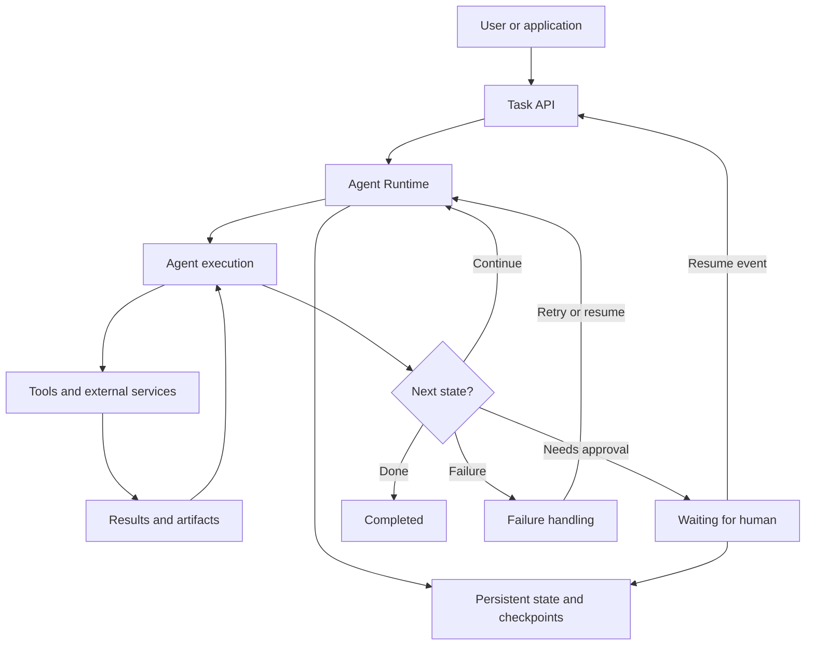
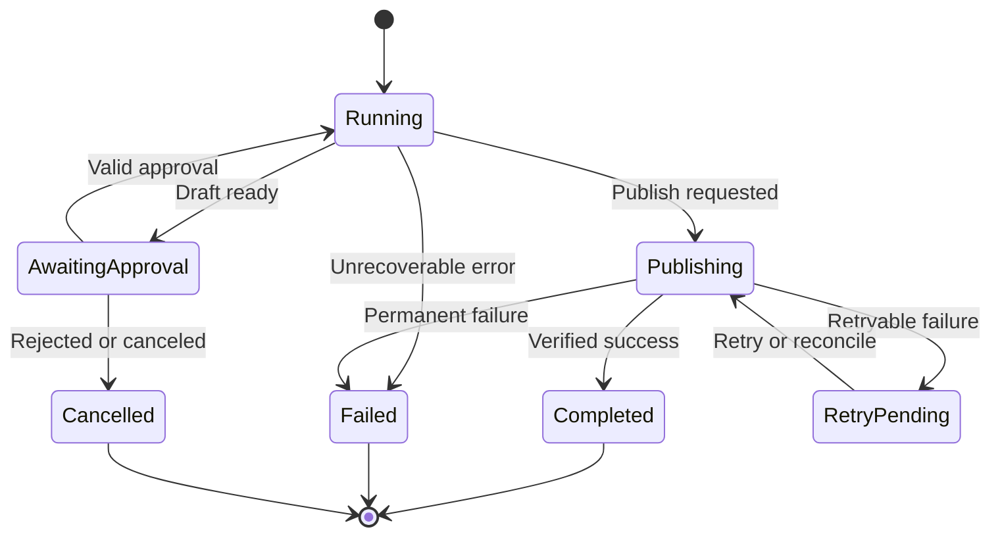

An AI Agent may need dozens of steps to complete a task. If its service fails near the end, must everything start over? If an action succeeds but the Agent never receives confirmation, what prevents it from doing the same thing twice?

## 1. When an Agent stops halfway through

Imagine a retail manager asking an AI Assistant:

> "Analyze August business performance, prepare a report, and send it to the management team after I approve it."

The system must retrieve figures, analyze changes, find supporting documents, create a draft, wait for approval, then publish and notify. The first four steps finish. The manager closes the browser and returns the next day. Meanwhile, the Agent service is redeployed.

If progress existed only in process memory, the Agent may lose the draft, the completed steps, and the pending decision. Starting again wastes work and becomes dangerous once a step has real-world effects.

Consider a harder case: the manager approves, the publish API succeeds, but the worker crashes before recording the result. On restart, the Agent sees an unfinished publishing step and calls the API again. The team receives two copies.

**Long-running execution** therefore poses two problems: preserve progress across sessions and processes, then recover without duplicate or invalid actions. A model that reasons well is not enough. The runtime must manage state and side effects.

## 2. "Long-running" does not simply mean slow

A 30-minute calculation in a background worker may need only a queue, timeout, and retry policy. An Agent that works for two minutes but waits until tomorrow for approval already needs continuity across sessions.

Tasks may span context windows, wait for a person or asynchronous tool, survive worker restarts, retry failed steps, accept cancellation, or involve several Agents. Their common requirement is **continuity across execution phases**, not duration alone.

The [Context Engineering lesson](../context-engineering/) and [Agent Memory article](../building-agent-memory-in-production/) cover what an Agent sees and reuses. Here is a separate concern: **memory helps an Agent reuse information; execution state tells the application how far the task has progressed and which step may run next.**

"The user prefers line charts" may be a long-term preference. "Version 2 of the August report awaits this manager's approval" is execution state for one task.

## 3. What must be saved to resume?

| Component | Role |
| :-- | :-- |
| Execution state | Progress status and current step |
| Task data | Inputs, verified facts, and intermediate decisions |
| Artifacts | Drafts, files, and large results |
| Action records | Operations requested or already performed |

A pending approval state might be:

```json
{
  "execution_id": "RUN_001",
  "task_type": "monthly_report",
  "status": "awaiting_approval",
  "current_step": "review_report",
  "report_version": 2,
  "artifact_id": "REPORT_001_V2",
  "data_snapshot": "retail_snapshot_v1",
  "pending_action": {
    "type": "publish_report",
    "requires_approval": true
  }
}
```

This is an illustrative schema. It tells the system that a report already exists and the analysis need not be repeated. A large report should live in object storage or a database, while state carries an `artifact_id` and version. SQL results and documents can likewise remain in versioned artifacts rather than inflating each checkpoint with every conversation and raw tool output.

## 4. A durable Agent runtime

The LLM may choose the next step, but the application or runtime must preserve progress and control important actions:



*Figure 1. An illustrative architecture with persistent state, a waiting point, and recovery.*

The runtime need not be a separate service. A small application might use a state module and background workers; a complex system may use a checkpointing framework or durable execution engine. The goal is the same: **a task has an identity and state independent of the process executing it**.

Saving state is necessary, but we still need to decide *when* to save and *how* to continue.

## 5. Checkpointing: do not start over

For **Retrieve data -> Analyze -> Generate report -> Request approval**, saving only at the end means a late failure repeats earlier work. A checkpoint records progress at a useful boundary: completed steps, evidence, artifact references, the next step, and conditions that must hold.

[LangGraph checkpointers](https://docs.langchain.com/oss/python/langgraph/persistence) persist graph state by thread for resuming after interruptions or failures. But **a checkpoint does not imply resuming at the exact source-code line where execution stopped**. According to [LangGraph's interrupt documentation](https://docs.langchain.com/oss/python/langgraph/interrupts), resuming a node that called `interrupt()` restarts that node from the beginning. Code before the interrupt runs again.

Do not send an email immediately before pausing in the same node and assume it can run only once. A clearer sequence is **Generate draft -> Persist draft -> Request approval -> Publish approved version**. Each step has a defined input, output, and completion condition.

Checkpointing also differs from long-term memory. "Report V2 is waiting for approval" belongs to an execution; "prefers line charts" may be useful across tasks.

## 6. Human-in-the-loop: paused is not finished

After creating a draft, move the task to `awaiting_approval`, persist state, and release the worker. There is no need to keep an LLM or worker active overnight. When the manager approves, the application sends a resume event:

```json
{
  "execution_id": "RUN_001",
  "decision": "approve",
  "report_version": 2,
  "approved_by": "USER_001"
}
```

LangGraph provides `interrupt()` and `Command(resume=...)`; a persistent checkpointer and `thread_id` identify the execution to resume. The event is not merely a message to the LLM. The application must verify the approver's authority, the task's waiting status, whether the decision was already processed, and whether the report version still matches.

**Approval must bind to a specific action or artifact.** Approval for V2 cannot automatically apply to a different V3. An approval record may include `artifact_id`, version, or content hash.

## 7. Retry and idempotency: the dangerous part of recovery

Return to the case where publishing succeeded but the worker crashed before storing the result. From the runtime's perspective, the outcome is **unknown**, not necessarily failed. A blind retry may publish twice.

One defense is a **stable idempotency key** for the business action:

```python
def publish_report(run_id, report_version, artifact_id):
    action_key = f"{run_id}:publish:v{report_version}"

    return report_service.publish(
        artifact_id=artifact_id,
        idempotency_key=action_key,
    )
```

This is pseudocode. If the receiving service **actually implements idempotency**, repeated calls with the same key can return the original result rather than publishing again. A fresh UUID on every retry defeats this mechanism. Passing an argument named `idempotency_key` alone guarantees nothing unless the service honors it.

For an external API without idempotency, *reconciliation* may be needed: check the real business state before deciding to retry. An action table helps, but writing that table and calling an external API in separate transactions does not eliminate every crash window. [Temporal documents Activities as at-least-once](https://docs.temporal.io/develop/python/best-practices/error-handling): a worker can complete a side effect and crash before reporting success, causing a retry.

| Failure | Example | Response |
| :-- | :-- | :-- |
| Transient | Brief connection loss | Retry with backoff |
| Rate limit | API returns 429 | Follow provider limits |
| Invalid input | Missing argument | Stop and fix input |
| Permission | Publishing not allowed | Do not blindly retry |
| Unknown outcome | Timeout after sending | Reconcile or safely retry with idempotency |
| Business rejection | Report rejected | Change state or request revision |

Retries need limits on attempts, elapsed time, and eligible errors. **Durable execution makes continuing possible; idempotency prevents continuation from multiplying an action's effects.**

## 8. Give the task an explicit lifecycle

Once an application supports pause, resume, retry, and cancellation, it needs a state machine rather than asking the LLM to infer progress from chat history:



*Figure 2. An illustrative report lifecycle; the actual states and transitions depend on the business process.*

A `Completed` task cannot be approved again; `AwaitingApproval` cannot publish before valid approval; `Cancelled` must not resume on worker restart. The frontend can also show "Analyzing", "Awaiting approval", or "Publishing" rather than an indefinite spinner.

The Agent may propose a step, but **the application must enforce mandatory business transitions**. A casual "okay" in chat is not automatically a valid approval event.

## 9. Long tasks also exhaust context

Checkpoints and idempotency protect execution, but the model does not inherently carry its full working context across context windows. If a fresh session receives only "continue", it may repeat finished work or declare victory too early.

In [Effective Harnesses for Long-Running Agents](https://www.anthropic.com/engineering/effective-harnesses-for-long-running-agents), Anthropic experimented with feature lists, progress notes, Git history, and setup information to help fresh sessions understand the work. A business-report Agent can similarly retain its goal, completed steps, verified facts, source references, open questions, and proposed next action.

A Context Builder can use these artifacts to reconstruct the relevant working view. Do not rely only on a free-form summary: it may omit an exception or turn a hypothesis into a conclusion. Important facts should be structured or linked to their original source.

Two layers work together: **durable execution state** tells the runtime where the work stands; **task context and progress artifacts** help the model understand enough to continue. One without the other can still produce a wrong decision or duplicate effect.

## 10. Job queue, LangGraph, or Temporal?

| Option | Often useful when | Watch for |
| :-- | :-- | :-- |
| Job queue + database | Few predictable steps and simple retries | You own state and waiting logic |
| LangGraph | Agent state, checkpoints, branches, human approval | Nodes may rerun; use durable storage and safe side effects |
| Temporal | Long orchestration across services, failures, timers, retries | External Activities still need idempotency |

A background job may be enough if the only issue is an HTTP timeout. [LangGraph](https://docs.langchain.com/oss/python/langgraph/persistence) helps organize reasoning and tools in a stateful graph; an in-memory checkpointer cannot recover after the whole process disappears. [Temporal](https://docs.temporal.io/evaluate/understanding-temporal) persists Workflow and Activity history so a new worker can reconstruct progress, but it does not improve the LLM's reasoning by itself.

These layers can be combined, but define who owns execution state and retries. If both layers independently retry one side effect, duplicate execution becomes more likely. Before choosing a framework, ask: **Which failure does the current architecture fail to handle?**

## 11. Test recovery, not just the happy path

A normal successful run does not establish that recovery works. Inject failures at sensitive boundaries:

| Scenario | Expected behavior |
| :-- | :-- |
| Worker restarts after analysis | Preserve verified results |
| Service restarts while awaiting approval | Approval request still exists |
| User approves twice | Process one valid decision |
| Publish API times out after success | Do not publish twice |
| Report changes after approval | Do not reuse old approval |
| User cancels | Prevent later prohibited actions |
| Retryable API failure | Retry within limits |
| Invalid tool input | Do not retry forever |
| Restart after context compaction | Preserve progress and mandatory constraints |

For example, kill the worker after the external API completes but before state is updated. On restart, does the system duplicate the action? Or pause at approval, restart the service, submit a resume event, and check that the correct execution and artifact continue.

Beyond task success, monitor **recovery success rate**, **duplicate side-effect rate**, **resume latency**, **stuck execution count**, **approval integrity**, and **cancellation compliance**. These are application-defined engineering metrics, not a universal benchmark. Time spent in each state matters too: a task may not fail but remain stuck in `running` for hours.

## 12. Production principles

1. Persist important state outside process memory.
2. Do not mistake checkpoints for exactly-once execution; protect external effects with idempotency or reconciliation.
3. Do not keep a worker alive just to wait for a person; persist a waiting state and accept a resume event.
4. Validate approvals, cancellation, and completion in the application.
5. Store large artifacts separately and reference them by ID and version.
6. Retry by failure type, not automatically for every side effect.
7. Control concurrent workers with versioning, leases, or another appropriate synchronization mechanism.
8. Test recovery through controlled failures, not only a `retry` arrow in a diagram.

Cancellation also cannot undo every completed action. A finished transaction may need a *compensating action* or a separate process rather than an assumed rollback.

## 13. Conclusion

When an Agent works across requests or changes real data, it must continue reliably. Checkpoints record progress; persistent state separates the task from the process; human-in-the-loop creates safe waiting points; retries handle temporary failures; idempotency prevents duplicate effects. Progress artifacts help the model recover context across windows.

Not every Agent needs a sophisticated durable execution engine. But once approval, multiple services, or non-repeatable actions enter the picture, recovery must be part of the architecture from the start.

**A reliable long-running Agent is not one that never fails. It is a system that knows what has happened and can continue without corrupting the work already done.**

## References and further reading

1. [Anthropic - Effective Harnesses for Long-Running Agents](https://www.anthropic.com/engineering/effective-harnesses-for-long-running-agents) - progress across context windows.
2. [Anthropic - Harness Design for Long-Running Application Development](https://www.anthropic.com/engineering/harness-design-long-running-apps) - long-task harness design.
3. [LangGraph - Persistence](https://docs.langchain.com/oss/python/langgraph/persistence) - checkpoints and thread state.
4. [LangGraph - Interrupts](https://docs.langchain.com/oss/python/langgraph/interrupts) and [Functional API](https://docs.langchain.com/oss/python/langgraph/functional-api) - pause and resume behavior.
5. [Temporal - Understanding Temporal](https://docs.temporal.io/evaluate/understanding-temporal) - Workflows, Activities, and Event History.
6. [Temporal - Error Handling and Idempotent Activities](https://docs.temporal.io/develop/python/best-practices/error-handling) - retries and duplicate-effect prevention.
7. [Temporal - AI Cookbook](https://docs.temporal.io/ai/cookbook) - durable Agents and human-in-the-loop examples.
