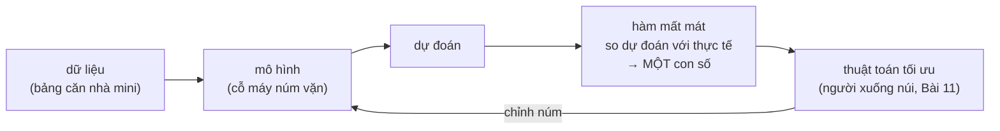

> **Mục tiêu bài học:** Sau bài này, bạn sẽ hiểu hàm mất mát (loss function) là gì và vì sao thiếu nó thì máy không thể học; biết tự tính MSE, MAE cho bài toán hồi quy và hiểu trực giác cross-entropy cho bài toán phân loại; hình dung được việc huấn luyện mô hình chính là "tìm điểm thấp nhất trên một địa hình".

## 1. Máy làm sao biết mình đang tiến bộ?

Người học đàn có tai để nghe mình đánh sai nốt nào. Học sinh luyện đề (An và Bình ở Bài 04) có đáp án để so. Còn cỗ máy nhiều núm vặn của Bài 01 thì sao? Nó không có tai, không có đáp án in sẵn - nó cần **một con số duy nhất** trả lời câu hỏi: *"với bộ núm vặn hiện tại, tôi đang sai bao nhiêu?"*

Con số đó là **hàm mất mát (loss function)**, đôi khi gọi là **hàm mục tiêu (objective function)**. Bài 01 đã xếp nó vào bốn thành phần của một hệ thống machine learning và hẹn "hàm cụ thể cho phân loại sẽ bàn ở Bài 10" - giờ là lúc trả món nợ đó. Đây là vị trí của loss trong vòng lặp huấn luyện:



Hai tính chất bạn cần nhớ:

1. **Càng thấp càng tốt.** Điều bất ngờ: đây thuần túy là **quy ước**. Nếu bạn có một thước đo "càng cao càng tốt" (ví dụ độ chính xác), chỉ cần đổi dấu là thành "càng thấp càng tốt". Nhưng đổi dấu mới chỉ xoay *chiều* của thước đo, chưa biến nó thành một loss dùng để train được - mục 3 sẽ cho thấy vì sao độ chính xác đổi dấu vẫn là một hàm mà thuật toán tối ưu không đi theo nổi. Vì chọn chiều "thấp = tốt" nên người ta gọi nó là *mất mát* - mất mát ít nhất có thể.
2. **Loss thường không âm**, và dự đoán hoàn hảo thì loss bằng 0.

Câu hỏi tiếp theo: con số đó tính **như thế nào**? Câu trả lời phụ thuộc bài toán - hồi quy hay phân loại (ôn lại Bài 05 nếu cần).

## 2. Loss cho hồi quy: MSE và MAE

Mô hình dự đoán giá nhà của bạn (kiểu thợ ống nước ở Bài 01: giá = hệ số × diện tích + một khoản cố định) đoán căn A giá 2,5 tỷ, thực tế 2,0 tỷ - sai 0,5 tỷ. Nhưng bảng có 4 căn, mỗi căn sai một kiểu: gom lại thành **một con số** bằng cách nào?

Với bài toán hồi quy (dự đoán một con số), loss thông dụng là **bình phương sai số trung bình - MSE (Mean Squared Error)**:

$$\text{MSE} = \frac{1}{n}\sum_{i=1}^{n}(\hat{y}^{(i)} - y^{(i)})^2$$

Đọc bằng lời: với từng mẫu, lấy **dự đoán trừ thực tế**, **bình phương** kết quả, rồi **lấy trung bình** trên cả tập dữ liệu. Làm một lần bằng tay với 4 căn nhà (giá tính bằng **tỷ đồng**):

| Nhà | Giá thực $y$ | Mô hình đoán $\hat{y}$ | Sai số $\hat{y}-y$ | Bình phương |
|---|---|---|---|---|
| A | 2,0 | 2,5 | +0,5 | 0,25 |
| B | 3,0 | 2,8 | −0,2 | 0,04 |
| C | 1,5 | 1,6 | +0,1 | 0,01 |
| D | 4,0 | 3,0 | −1,0 | 1,00 |

$$\text{MSE} = \frac{0{,}25 + 0{,}04 + 0{,}01 + 1{,}00}{4} = \frac{1{,}30}{4} = 0{,}325$$

### Vì sao lại bình phương?

1. **Xóa dấu âm.** Đoán thừa 0,5 tỷ hay đoán thiếu 0,5 tỷ đều là sai như nhau. Nếu cộng thẳng sai số, +0,5 và −0,5 sẽ triệt tiêu nhau và một mô hình sai be bét vẫn có "tổng sai số" bằng 0.
2. **Phạt nặng lỗi lớn.** Sai 0,1 → đóng góp 0,01; sai gấp 10 lần (1,0) → đóng góp 1,00, tức **gấp 100 lần**. Nhìn lại bảng: một mình nhà D chiếm 1,00/1,30 ≈ **77%** tổng loss. Mô hình sẽ bị "thúc" chủ yếu vào việc sửa những lỗi to.

Tính chất thứ hai là **con dao hai lưỡi**: phạt nặng lỗi lớn giúp mô hình tránh những sai lệch nghiêm trọng, nhưng cũng khiến nó **quá nhạy với dữ liệu bất thường (outlier)**. Một căn biệt thự giá "trên trời" lọt vào dữ liệu có thể kéo lệch cả mô hình, vì bình phương sai số của riêng nó lấn át tất cả.

### MAE - người anh em điềm tĩnh hơn

**MAE (Mean Absolute Error - trung bình trị tuyệt đối sai số)** thay bình phương bằng trị tuyệt đối:

$$\text{MAE} = \frac{1}{n}\sum_{i=1}^{n}|\hat{y}^{(i)} - y^{(i)}|$$

Cùng 4 căn nhà trên: MAE = (0,5 + 0,2 + 0,1 + 1,0)/4 = **0,45**. Lúc này nhà D chỉ chiếm 1,0/1,8 ≈ 56% tổng loss thay vì 77% - sai gấp 10 lần thì bị phạt gấp 10 lần, không phải gấp 100. Vì vậy MAE **ít nhạy với outlier hơn**. Đổi lại, MSE trơn tru hơn về mặt toán (đạo hàm đẹp - bạn đã gặp đạo hàm ở Bài 09), nên MSE vẫn là lựa chọn khởi đầu thông dụng cho hồi quy.

> 🔧 **Thử ngay:** Ba căn nhà, mô hình đoán 1,5 / 2,0 / 2,4 tỷ, giá thực 1,2 / 2,0 / 3,0 tỷ. Sai số: +0,3 / 0 / −0,6. Bình phương: 0,09 / 0 / 0,36 → **MSE = 0,45/3 = 0,15**. Trị tuyệt đối: 0,3 / 0 / 0,6 → **MAE = 0,9/3 = 0,30**. Căn thứ ba chiếm 0,36/0,45 = 80% MSE nhưng chỉ 0,6/0,9 ≈ 67% MAE.

<details>
<summary>Chi tiết nhỏ: hệ số ½ bạn có thể gặp trong sách</summary>

Nhiều tài liệu (trong đó có sách *Dive into Deep Learning*) viết squared error là $\frac{1}{2}(\hat{y}-y)^2$. Hệ số $\frac{1}{2}$ không thay đổi bản chất gì - nhân loss với hằng số dương thì điểm thấp nhất vẫn nằm nguyên chỗ cũ. Nó chỉ có tác dụng lúc lấy đạo hàm: số 2 từ bình phương rơi xuống sẽ triệt tiêu với ½, cho công thức gọn hơn.

</details>

<details>
<summary>Vì sao MAE "điềm tĩnh" - góc nhìn trung bình và trung vị</summary>

Giả sử bạn bị bắt đoán **một con số duy nhất** cho mọi căn nhà. Con số làm MSE nhỏ nhất là **trung bình (mean)** của các giá thực; con số làm MAE nhỏ nhất là **trung vị (median)**. Thêm một căn biệt thự 50 tỷ vào bảng: trung bình bị kéo vọt lên, còn trung vị gần như không nhúc nhích. Đó là cùng một hiện tượng "MAE ít nhạy với outlier", nhìn từ thống kê (Bài 08).

</details>

> ⚠️ **Lưu ý nhỏ:** MSE là lựa chọn khởi đầu thông dụng, không phải bắt buộc. Dữ liệu có nhiều outlier mà bạn chưa lọc được (Bài 12) là tình huống điển hình để cân nhắc MAE hoặc các loss "lai" giữa hai loại.

## 3. Loss cho phân loại: vì sao không train trên "tỷ lệ đoán sai"?

Với phân loại (email spam hay không, ảnh là chữ số nào), thước đo tự nhiên nhất là **tỷ lệ đoán sai (error rate)**: đoán sai 12 email trong 100 → error rate 12%. Vậy sao không bảo máy "hãy chỉnh núm để error rate giảm"?

Hãy thử. Mô hình phân loại thường trả về xác suất (Bài 01). Giả sử nó gán cho một email xác suất spam 0,48 và ta dùng ngưỡng 0,5 để kết luận. Bạn vặn nhẹ một núm, xác suất nhích thành 0,49 - kết luận **vẫn y nguyên**, error rate đứng im. Vặn thêm chút nữa, 0,50 → 0,51 - kết luận **nhảy phắt** sang loại khác. Error rate là một **bậc thang**: gần như phẳng lì ở khắp nơi, thỉnh thoảng nhảy vọt.

```
  loss                                   loss
   ▲                                      ▲
   │ ────────┐                            │╲
   │         │     error rate:            │ ╲              cross-entropy:
   │         └────────┐  phẳng lì,        │  ╲___         chỗ nào cũng có
   │                  │  rồi nhảy phắt    │      ╲___     độ dốc để lần theo
   │                  └─────────          │          ╲____
   └──────────────────────► núm vặn       └──────────────────────► núm vặn
```

Thuật toán tối ưu (Bài 11) cần biết *"vặn núm theo hướng nào thì đỡ sai hơn **một chút**"* - trên mặt phẳng lì thì không có "một chút" nào để lần theo cả. Nói theo ngôn ngữ Bài 09: error rate **không cho ta gradient hữu ích**.

Giải pháp trong ML: giữ error rate làm **thước đo đánh giá**, còn khi train thì tối ưu một hàm khác - trơn tru, dễ tối ưu, và giảm hàm đó *kéo theo* điều ta thật sự muốn. Hàm "đóng thế" như vậy gọi là **surrogate loss (loss thay thế)** - một tình huống rất thường gặp trong ML: mục tiêu thật sự thì khó tối ưu trực tiếp, nên ta tối ưu một *surrogate objective* đứng thế.

### Cross-entropy: phạt nặng kẻ "tự tin mà sai"

Surrogate loss phổ biến cho phân loại là **cross-entropy (entropy chéo)**. Trực giác của nó gói trong một dòng:

> **Loss = $-\log$(xác suất mà mô hình gán cho đáp án đúng)** - với $\log$ là log tự nhiên.

Ví dụ, với ảnh một con mèo, mô hình phải chia xác suất cho các lớp (mèo/chó/thỏ...). Ta chỉ nhìn vào xác suất nó gán cho **nhãn đúng** ("mèo") và tra bảng:

| Mô hình gán cho nhãn đúng | Loss $=-\log(p)$ | Diễn giải |
|---|---|---|
| 0,9 | ≈ 0,105 | Tự tin và đúng → phạt rất nhẹ |
| 0,7 | ≈ 0,357 | Khá đúng → phạt nhẹ |
| 0,5 | ≈ 0,693 | Ba phải → phạt vừa |
| 0,1 | ≈ 2,303 | Gần như chắc chắn... sai → phạt nặng |
| 0,01 | ≈ 4,605 | Tự tin sai bét → phạt rất nặng |

So sánh hai dòng then chốt: gán 0,9 cho đáp án đúng bị phạt **0,105**; gán 0,1 bị phạt **2,303** - nặng gấp hơn 20 lần. Và độ phạt tăng ngày càng dốc: từ 0,1 xuống 0,01 (đều là "sai"), loss vọt từ 2,3 lên 4,6. Đẩy tới giới hạn: gán xác suất 0 cho đáp án đúng thì $-\log(0) = \infty$ - loss vô hạn. Cross-entropy vì thế dạy mô hình hai điều cùng lúc: *đoán đúng*, và *đừng bao giờ tự tin tuyệt đối khi có thể sai*.

> 🔧 **Thử ngay:** Bảng trên cho $-\log(0{,}5) \approx 0{,}693$. Tính $-\log(0{,}25)$ bằng máy tính: kết quả **≈ 1,386** - đúng gấp đôi. Quy luật ẩn sau: mỗi lần xác suất gán cho đáp án đúng **giảm một nửa**, loss **tăng thêm đúng 0,693** (vì $-\log(p/2) = -\log p + \log 2$). Kiểm tra tiếp với 0,125 → ≈ 2,079.

Quan trọng là cross-entropy **trơn**: xác suất nhích từ 0,48 lên 0,49 thì loss giảm ngay một chút - luôn có "độ dốc" để thuật toán tối ưu lần theo, đúng thứ mà error rate không có.

<details>
<summary>Vì sao tên là "cross-entropy"? (đọc thêm, không bắt buộc)</summary>

Tên gọi đến từ lý thuyết thông tin của Claude Shannon. Đại lượng $-\log p$ được gọi là **độ ngạc nhiên (surprisal)**: sự kiện bạn cho là ít khả năng xảy ra ($p$ nhỏ) mà lại xảy ra thì bạn ngạc nhiên nhiều. Cross-entropy chính là *độ ngạc nhiên trung bình* của mô hình khi đối chiếu dự đoán của nó với thực tế - mô hình dự đoán càng khớp thực tế, độ ngạc nhiên càng thấp. Sách *Dive into Deep Learning* (chương Linear Classification, mục Information Theory Basics) có phần "cẩm nang sinh tồn" ngắn gọn về chủ đề này.

</details>

> ⚠️ **Lưu ý nhỏ:** Nói cho chính xác, error rate không phải là "không thể tối ưu" - nó chỉ **không thuận tiện cho các phương pháp dựa trên gradient** (Bài 11): gradient của nó bằng 0 ở hầu hết mọi nơi và không xác định tại các chỗ nhảy. Sách *Dive into Deep Learning* xếp error rate vào nhóm mục tiêu "khó tối ưu trực tiếp do không khả vi", và surrogate objective là cách xử lý thông dụng cho nhóm này.

## 4. Bức tranh lớn: loss là một "địa hình", huấn luyện là tìm điểm thấp

Lấy mô hình 2 núm $(a, b)$ kiểu thợ ống nước ở Bài 01 và bảng 4 căn nhà ở mục 2. Đặt núm ở một chỗ, tính MSE được một con số; xoay núm sang chỗ khác, tính lại, được con số khác. Bạn vừa làm một **cú xoay góc nhìn** - có lẽ là ý đáng giá nhất bài:

> Khi huấn luyện, ta coi **dữ liệu là cố định** và xem loss là **hàm của tham số** (các núm vặn).

Mỗi cách đặt núm cho ra một giá trị loss. Với 2 tham số, hãy tưởng tượng một **tấm bản đồ địa hình**: vị trí trên bản đồ là cặp $(a, b)$, độ cao tại đó là loss. Huấn luyện = đi tìm **điểm thấp nhất của thung lũng**:

```
 loss
  │ \                                   /
  │  \        địa hình loss            /
  │   \                          /\   /
  │    \        ●  ← đang ở đây /  \_/
  │     \      /               /
  │      \____/\        ______/
  │             \      /
  │              \____/   ← điểm thấp nhất (tham số tốt)
  └──────────────────────────────────────► giá trị tham số
```

Vài điều nên biết về "địa hình" này:

- Với hồi quy tuyến tính + MSE, địa hình là một **lòng chảo** (hàm lồi - convex): không có hõm phụ đánh lừa, có một điểm thấp nhất, thậm chí giải thẳng ra được bằng công thức chứ không phải dò dần.
- Với mạng nơ-ron sâu, địa hình nằm trong không gian **hàng triệu chiều** (mỗi tham số một chiều - ta không vẽ nổi, nhưng trực giác thung lũng vẫn dùng được) và **gồ ghề**: nhiều thung lũng lớn nhỏ, nhiều "yên ngựa". Điều bất ngờ: trong thực tế ta không cần điểm thấp nhất *tuyệt đối*, chỉ cần một điểm *đủ thấp* để dự đoán tốt. Sách *Dive into Deep Learning* nhận xét rằng việc tìm được tham số khớp toàn bộ dữ liệu train hiếm khi là vấn đề trong thực hành - cực tiểu cục bộ hay nghiệm xấp xỉ vẫn rất hữu ích; bài toán khó hơn nhiều nằm ở khái quát hóa (Bài 14).
- Nếu tò mò địa hình loss "trông" thế nào, bài báo *Visualizing the Loss Landscape of Neural Nets* (Li và cộng sự, 2018) chiếu nó xuống 3 chiều thành những bức ảnh núi non rất đáng xem - link ở mục Đọc thêm.
- Còn **đi xuống thung lũng bằng cách nào** - khi ta chỉ "thấy" được độ dốc tại chỗ đang đứng, như người xuống núi trong sương mù ở Bài 01 - thì đó là trọn vẹn nội dung Bài 11.

> ⚠️ **Lưu ý nhỏ:** "Một điểm thấp nhất duy nhất" của hồi quy tuyến tính + MSE đúng trong điều kiện thông thường. Trường hợp đặc biệt: nếu các feature phụ thuộc tuyến tính lẫn nhau, nhiều bộ tham số khác nhau có thể cùng đạt mức loss thấp nhất - đáy lòng chảo khi đó là một "rãnh" phẳng thay vì một điểm.

## 5. Loss (để train) vs Metric (để đánh giá) - đừng nhầm hai vai

Sếp hỏi: *"Mô hình tốt chưa?"* Bạn đáp: *"Cross-entropy còn 0,3."* Sếp không hiểu gì. Bạn đổi cách nói: *"Đoán đúng 94% email."* Sếp gật đầu. Từ mục 3 bạn đã thấy lý do: hệ thống ML thường dùng **hai thước đo song song** cho cùng một mô hình, mỗi thước đo một vai.

| | **Loss** | **Metric** |
|---|---|---|
| Dùng để | **Huấn luyện** - cho thuật toán tối ưu lần theo | **Đánh giá** - cho con người ra quyết định |
| Yêu cầu | Tối ưu được - với phương pháp gradient thì cần có gradient dùng được ở hầu hết mọi điểm | Dễ hiểu, phản ánh mục tiêu thực tế |
| Ví dụ (phân loại) | Cross-entropy | Accuracy, precision, recall |
| Ví dụ (hồi quy) | MSE | MAE tính bằng "tỷ đồng", sai số phần trăm |

Hai con số này thường đồng hành (cross-entropy giảm thì accuracy thường tăng) nhưng **không phải là một**: cross-entropy = 0,3 chẳng nói gì với sếp của bạn, còn "đoán đúng 94%" thì có. Khi theo dõi biểu đồ huấn luyện, bạn sẽ thường thấy cả hai đường được vẽ song song - giờ bạn đã biết vì sao cần cả hai. Toàn bộ câu chuyện metric - chọn metric nào, accuracy lừa ta ra sao khi dữ liệu lệch - là chủ đề của Bài 15.

> ⚠️ **Lưu ý nhỏ:** Ranh giới loss/metric nói về **vai trò**, không phải về bản chất của hàm. Cùng một hàm đôi khi đóng được cả hai vai - MAE chẳng hạn vừa có thể làm loss để train, vừa làm metric báo cáo "trung bình lệch bao nhiêu tỷ đồng". Điều kiện thật sự để một hàm làm loss là *tối ưu được* - với các phương pháp dựa trên gradient, nghĩa là hàm phải cho ra tín hiệu độ dốc đủ hữu ích để thuật toán lần theo. MAE có một điểm gãy tại sai số 0 nên không khả vi ở đó, nhưng mọi nơi khác nó vẫn có độ dốc rõ ràng, nên vẫn train được bình thường.

## Tóm tắt bài học

- **Loss function** trả lời *"mô hình đang sai bao nhiêu"* bằng **một con số**; quy ước **càng thấp càng tốt** (thuần túy là quy ước - thước đo "cao = tốt" đổi dấu là xong; nhưng đổi dấu mới xoay chiều tốt/xấu, chưa biến nó thành thứ train được). Không có loss thì thuật toán tối ưu không biết thế nào là "tiến bộ".
- **Hồi quy → MSE**: trung bình của bình phương sai số. Bình phương để **xóa dấu âm** và **phạt lỗi lớn nặng vượt trội** (sai gấp 10 → phạt gấp 100) - nhưng vì thế **nhạy với outlier**. **MAE** phạt tuyến tính nên điềm tĩnh với outlier hơn (MSE "nghe theo" trung bình, MAE "nghe theo" trung vị).
- **Phân loại**: error rate là **bậc thang**, không cho gradient hữu ích, không train trực tiếp bằng gradient được → dùng **surrogate loss** trơn tru thay thế.
- **Cross-entropy** = $-\log$(xác suất gán cho nhãn đúng): tự tin và đúng → phạt gần 0; **tự tin mà sai → phạt cực nặng** ($-\log(0{,}9) \approx 0{,}105$ so với $-\log(0{,}1) \approx 2{,}303$); xác suất giảm một nửa thì loss tăng thêm 0,693.
- Khi huấn luyện, **loss là hàm của tham số** (dữ liệu cố định): hình dung như **địa hình**, mỗi vị trí là một bộ tham số, độ cao là loss; huấn luyện = tìm điểm đủ thấp trong thung lũng.
- **Loss** là đại lượng mà quá trình huấn luyện tối ưu, **metric** là đại lượng để đánh giá và so sánh mô hình - hai *vai trò* khác nhau (cùng một hàm như MAE có thể đóng cả hai vai), thường được theo dõi song song.

## Câu hỏi tự kiểm tra

1. Vì sao không thể huấn luyện mô hình mà không có hàm mất mát? Quy ước "càng thấp càng tốt" có phải bắt buộc về mặt toán học không?
2. **(Tính tay)** Một mô hình dự đoán giá 3 căn nhà: đoán 2,2 / 3,5 / 1,0 tỷ trong khi giá thực là 2,0 / 3,0 / 1,2 tỷ. Hãy tính MSE và MAE. Căn nào đóng góp nhiều nhất vào MSE?
3. Giải thích bằng lời (không cần công thức) vì sao "tỷ lệ đoán sai" khó dùng làm loss để huấn luyện, và surrogate loss giải quyết chuyện đó thế nào.
4. **(Tính tay)** Với cùng một ảnh mèo, mô hình X gán xác suất 0,8 cho nhãn "mèo", mô hình Y gán 0,2. Biết $\log(0{,}8) \approx -0{,}223$ và $\log(0{,}2) \approx -1{,}609$, tính cross-entropy loss của từng mô hình trên ảnh này. Mô hình Y bị phạt nặng gấp khoảng mấy lần?
5. Dữ liệu giá nhà của bạn có lẫn vài căn biệt thự giá cao bất thường mà bạn chưa thể lọc ra. Giữa MSE và MAE, loss nào ít bị ảnh hưởng bởi các căn này hơn? Vì sao?
6. Đồng nghiệp nói: *"Accuracy của mô hình là 93%, vậy loss của nó là 7%".* Câu này nhầm ở đâu?

## Đọc thêm

**Nguồn nền tảng của bài:**

| Nguồn | Đọc phần nào |
|---|---|
| **Sách *Dive into Deep Learning* (d2l.ai)** | Chương 1 - mục *Objective Functions* (quy ước lower-is-better, surrogate objective); Chương 3.1 - *Linear Regression*, mục Loss Function (squared error, cảnh báo về outlier); Chương 4.1 - *Softmax Regression*, mục Loss Function (cross-entropy và gốc gác lý thuyết thông tin); Chương 5.5 - *Generalization in Deep Learning* (phần mở đầu: vì sao khớp dữ liệu train hiếm khi là vấn đề) |
| **Sách *Mathematics for Machine Learning*** | Chương 7 - phần mở đầu *Continuous Optimization*: vì sao huấn luyện ML quy về bài toán tìm cực tiểu của một hàm |
| **Sách *An Introduction to Statistical Learning*** | Chương 2 - sai số bình phương trung bình dưới góc nhìn thống kê |

**Nguồn online bổ sung (miễn phí):**

- [Visualizing the Loss Landscape of Neural Nets](https://arxiv.org/abs/1712.09913) - bài báo của Li và cộng sự (2018) với những hình chiếu 3D nổi tiếng của địa hình loss; trang [losslandscape.com](https://losslandscape.com/) biến chúng thành các thước phim đồ họa đẹp mắt.
- [Machine Learning cơ bản - bài Linear Regression](https://machinelearningcoban.com/2016/12/28/linearregression/) - trình bày hàm mất mát cho hồi quy bằng tiếng Việt, có code minh họa.
- [Root-mean-square error (RMSE) or mean absolute error (MAE): when to use them or not - Hodson (2022)](https://gmd.copernicus.org/articles/15/5481/2022/) - bài báo mở, giải thích mối liên hệ MSE-trung bình, MAE-trung vị và khi nào nên dùng thước đo nào.

> **Bài tiếp theo:** [Gradient descent, SGD và Adam](../gradient-descent-sgd-adam-vi/) - đã có "địa hình loss" và mục tiêu tìm điểm thấp - giờ học cách *đi xuống*: thuật toán hạ dốc từng bước, và các biến thể SGD, momentum, Adam đang vận hành hầu hết các hệ thống deep learning.
