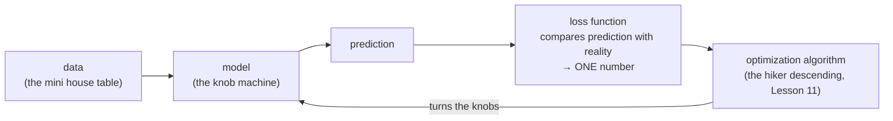

> **Learning objectives:** After this lesson, you will understand what a loss function is and why a machine cannot learn without one; you will be able to compute MSE and MAE by hand for a regression problem and grasp the intuition behind cross-entropy for classification; and you will picture training a model as "finding the lowest point on a landscape".

## 1. How does a machine know it is making progress?

Someone learning the piano has ears to hear which note they played wrong. Students doing practice exams (An and Binh in Lesson 04) have an answer key to compare against. But what about the many-knobbed machine of Lesson 01? It has no ears and no printed answer key - it needs **a single number** that answers the question: *"with the current setting of the knobs, how wrong am I?"*

That number is the **loss function**, sometimes called the **objective function**. Lesson 01 listed it as one of the four components of a machine learning system and promised that "the specific function for classification will be discussed in Lesson 10" - now it is time to pay that debt. Here is where the loss sits in the training loop:



Two properties you need to remember:

1. **Lower is better.** The surprising part: this is purely a **convention**. Have a measure where "higher is better" (accuracy, for example)? Just flip the sign and it becomes "lower is better". But flipping the sign only reverses the *direction* of the measure; it does not yet turn it into a loss you can train with - Section 3 will show why accuracy with its sign flipped is still a function the optimization algorithm cannot follow. Because the "low = good" direction was chosen, people call it a *loss* - lose as little as possible.
2. **Loss is usually non-negative**, and a perfect prediction has a loss of 0.

The next question: **how** is that number computed? The answer depends on the problem - regression or classification (revisit Lesson 05 if needed).

## 2. Loss for regression: MSE and MAE

Your house-price model (in the style of the plumber in Lesson 01: price = coefficient × area + constant) predicts that house A costs 2.5 billion, while the actual price is 2.0 billion - off by 0.5 billion. But the table has 4 houses, each wrong in its own way: how do you combine them into **one number**?

For regression problems (predicting a number), the common loss is the **Mean Squared Error (MSE)**:

$$\text{MSE} = \frac{1}{n}\sum_{i=1}^{n}(\hat{y}^{(i)} - y^{(i)})^2$$

In words: for each example, take **prediction minus actual**, **square** the result, then **average** over the whole dataset. Let's do it once by hand with 4 houses (prices in **billion VND**):

| House | Actual price $y$ | Model prediction $\hat{y}$ | Error $\hat{y}-y$ | Squared |
|---|---|---|---|---|
| A | 2.0 | 2.5 | +0.5 | 0.25 |
| B | 3.0 | 2.8 | −0.2 | 0.04 |
| C | 1.5 | 1.6 | +0.1 | 0.01 |
| D | 4.0 | 3.0 | −1.0 | 1.00 |

$$\text{MSE} = \frac{0.25 + 0.04 + 0.01 + 1.00}{4} = \frac{1.30}{4} = 0.325$$

### Why square?

1. **It removes the negative sign.** Overestimating by 0.5 billion or underestimating by 0.5 billion is equally wrong. If you simply added the errors, +0.5 and −0.5 would cancel each other out, and a badly wrong model could still have a "total error" of 0.
2. **It punishes large errors heavily.** An error of 0.1 → contributes 0.01; an error 10 times larger (1.0) → contributes 1.00, that is, **100 times more**. Look at the table again: house D alone accounts for 1.00/1.30 ≈ **77%** of the total loss. The model will be "pushed" mainly toward fixing the big mistakes.

The second property is a **double-edged sword**: punishing large errors heavily helps the model avoid gross mistakes, but it also makes the model **overly sensitive to unusual data (outliers)**. A single villa with a "sky-high" price slipping into the data can drag the whole model off course, because its squared error alone dwarfs everything else.

### MAE - the calmer sibling

**MAE (Mean Absolute Error)** replaces the square with the absolute value:

$$\text{MAE} = \frac{1}{n}\sum_{i=1}^{n}|\hat{y}^{(i)} - y^{(i)}|$$

Same 4 houses as above: MAE = (0.5 + 0.2 + 0.1 + 1.0)/4 = **0.45**. Now house D accounts for only 1.0/1.8 ≈ 56% of the total loss instead of 77% - an error 10 times larger is punished 10 times more, not 100 times. That is why MAE is **less sensitive to outliers**. In exchange, MSE is mathematically smoother (it has a nice derivative - you met derivatives in Lesson 09), so MSE remains the common starting choice for regression.

> 🔧 **Try it now:** Three houses; the model predicts 1.5 / 2.0 / 2.4 billion, actual prices 1.2 / 2.0 / 3.0 billion. Errors: +0.3 / 0 / −0.6. Squared: 0.09 / 0 / 0.36 → **MSE = 0.45/3 = 0.15**. Absolute values: 0.3 / 0 / 0.6 → **MAE = 0.9/3 = 0.30**. The third house accounts for 0.36/0.45 = 80% of the MSE but only 0.6/0.9 ≈ 67% of the MAE.

<details>
<summary>A small detail: the ½ factor you may meet in books</summary>

Many texts (including the book *Dive into Deep Learning*) write the squared error as $\frac{1}{2}(\hat{y}-y)^2$. The factor $\frac{1}{2}$ changes nothing essential - multiplying the loss by a positive constant leaves the lowest point exactly where it was. It is only there so that when you take the derivative, the 2 that drops down from the square cancels the ½, giving a tidier formula.

</details>

<details>
<summary>Why MAE is "calm" - the mean-and-median view</summary>

Suppose you are forced to guess **one single number** for every house. The number that minimizes MSE is the **mean** of the actual prices; the number that minimizes MAE is the **median**. Add a 50-billion villa to the table: the mean shoots up, while the median barely moves. That is the same phenomenon of "MAE is less sensitive to outliers", seen from the statistics side (Lesson 08).

</details>

> ⚠️ **A small note:** MSE is the common starting choice, not a requirement. Data with many outliers that you have not yet been able to filter out (Lesson 12) is the typical situation in which to consider MAE or "hybrid" losses that sit between the two.

## 3. Loss for classification: why not train on the "error rate"?

For classification (is this email spam or not, which digit is in this image), the most natural measure is the **error rate**: 12 emails wrong out of 100 → error rate 12%. So why not tell the machine "turn the knobs so that the error rate goes down"?

Let's try. A classification model usually returns a probability (Lesson 01). Suppose it assigns an email a spam probability of 0.48 and we use a threshold of 0.5 to decide. You nudge one knob slightly and the probability creeps to 0.49 - the decision **stays exactly the same**, the error rate does not move. Nudge a little more, 0.50 → 0.51 - the decision **jumps abruptly** to the other class. The error rate is a **staircase**: almost perfectly flat everywhere, with an occasional sudden jump.

```
  loss                                   loss
   ▲                                      ▲
   │ ────────┐                            │╲
   │         │     error rate:            │ ╲              cross-entropy:
   │         └────────┐  dead flat,       │  ╲___         there is a slope
   │                  │  then a jump      │      ╲___     to follow everywhere
   │                  └─────────          │          ╲____
   └──────────────────────► knob          └──────────────────────► knob
```

The optimization algorithm (Lesson 11) needs to know *"which way should I turn the knob to be **a little** less wrong"* - and on a dead-flat surface there is no "a little" to follow. In the language of Lesson 09: the error rate **gives us no useful gradient**.

The solution in ML: keep the error rate as the **evaluation measure**, but when training, optimize a different function - smooth, easy to optimize, and such that decreasing it *pulls along* what we actually want. Such a "stand-in" function is called a **surrogate loss** - a very common situation in ML: the true goal is hard to optimize directly, so we optimize a *surrogate objective* in its place.

### Cross-entropy: punishing the "confidently wrong"

The popular surrogate loss for classification is **cross-entropy**. Its intuition fits in one line:

> **Loss = $-\log$(the probability the model assigns to the correct answer)** - where $\log$ is the natural logarithm.

For example, given an image of a cat, the model must distribute probability across the classes (cat/dog/rabbit...). We look only at the probability it assigns to the **correct label** ("cat") and consult the table:

| Model's probability for the correct label | Loss $=-\log(p)$ | Interpretation |
|---|---|---|
| 0.9 | ≈ 0.105 | Confident and right → very light penalty |
| 0.7 | ≈ 0.357 | Fairly right → light penalty |
| 0.5 | ≈ 0.693 | On the fence → moderate penalty |
| 0.1 | ≈ 2.303 | Almost certain... and wrong → heavy penalty |
| 0.01 | ≈ 4.605 | Confidently, badly wrong → very heavy penalty |

Compare the two key rows: assigning 0.9 to the correct answer is penalized **0.105**; assigning 0.1 is penalized **2.303** - more than 20 times heavier. And the penalty grows ever steeper: from 0.1 down to 0.01 (both "wrong"), the loss leaps from 2.3 to 4.6. Push it to the limit: assign probability 0 to the correct answer and $-\log(0) = \infty$ - infinite loss. Cross-entropy therefore teaches the model two things at once: *be right*, and *never be absolutely confident when you might be wrong*.

> 🔧 **Try it now:** The table gives $-\log(0.5) \approx 0.693$. Compute $-\log(0.25)$ with a calculator: the result is **≈ 1.386** - exactly double. The hidden rule: every time the probability assigned to the correct answer **halves**, the loss **increases by exactly 0.693** (because $-\log(p/2) = -\log p + \log 2$). Check further with 0.125 → ≈ 2.079.

Crucially, cross-entropy is **smooth**: when the probability creeps from 0.48 to 0.49, the loss immediately decreases a little - there is always a "slope" for the optimization algorithm to follow, exactly what the error rate lacks.

<details>
<summary>Why is it called "cross-entropy"? (further reading, optional)</summary>

The name comes from Claude Shannon's information theory. The quantity $-\log p$ is called the **surprisal**: when an event you considered unlikely ($p$ small) actually happens, you are very surprised. Cross-entropy is exactly the model's *average surprise* when its predictions are compared against reality - the better the model's predictions match reality, the lower the surprise. The book *Dive into Deep Learning* (chapter Linear Classification, section Information Theory Basics) has a short "survival guide" on this topic.

</details>

> ⚠️ **A small note:** To be precise, the error rate is not "impossible to optimize" - it is just **inconvenient for gradient-based methods** (Lesson 11): its gradient is 0 almost everywhere and undefined at the jumps. The book *Dive into Deep Learning* files the error rate under objectives that are "hard to optimize directly because they are not differentiable", and a surrogate objective is the standard way of handling this group.

## 4. The big picture: loss is a "landscape", training is finding a low point

Take the 2-knob model $(a, b)$ in the style of the plumber in Lesson 01 and the 4-house table from Section 2. Set the knobs at one position, compute the MSE, and you get a number; turn the knobs to another position, compute again, and you get a different number. You have just made a **shift of perspective** - perhaps the most valuable idea in this lesson:

> During training, we treat the **data as fixed** and view the loss as **a function of the parameters** (the knobs).

Each setting of the knobs yields one loss value. With 2 parameters, imagine a **topographic map**: the position on the map is the pair $(a, b)$, and the elevation there is the loss. Training = searching for **the lowest point of the valley**:

```
 loss
  │ \                                   /
  │  \        the loss landscape       /
  │   \                          /\   /
  │    \        ●  ← you are here /  \_/
  │     \      /               /
  │      \____/\        ______/
  │             \      /
  │              \____/   ← lowest point (good parameters)
  └──────────────────────────────────────► parameter value
```

A few things worth knowing about this "landscape":

- For linear regression + MSE, the landscape is a **bowl** (a convex function): no deceptive side dips, a single lowest point, and it can even be solved directly with a formula rather than searched for step by step.
- For deep neural networks, the landscape lives in a space of **millions of dimensions** (one per parameter - we cannot draw it, but the valley intuition still works) and is **rugged**: many valleys large and small, many "saddles". The surprising part: in practice we do not need the *absolute* lowest point, only a point *low enough* to predict well. The book *Dive into Deep Learning* remarks that finding parameters that fit the entire training set is rarely the problem in practice - local minima or approximate solutions are still very useful; the much harder problem lies in generalization (Lesson 14).
- If you are curious what a loss landscape "looks" like, the paper *Visualizing the Loss Landscape of Neural Nets* (Li et al., 2018) projects it down to 3 dimensions into mountain-range pictures well worth a look - link in the Further reading section.
- As for **how to walk down the valley** - when we can only "see" the slope at the spot where we are standing, like the hiker descending in the fog in Lesson 01 - that is the entire content of Lesson 11.

> ⚠️ **A small note:** The "single lowest point" of linear regression + MSE holds under ordinary conditions. Special case: if the features are linearly dependent on one another, several different parameter settings can all reach the same lowest loss - the bottom of the bowl is then a flat "trough" instead of a point.

## 5. Loss (for training) vs Metric (for evaluation) - don't confuse the two roles

Your boss asks: *"Is the model good yet?"* You answer: *"Cross-entropy is down to 0.3."* Your boss has no idea what that means. You rephrase: *"It gets 94% of emails right."* Your boss nods. From Section 3 you already know the reason: ML systems usually use **two parallel measures** for the same model, each with its own role.

| | **Loss** | **Metric** |
|---|---|---|
| Used for | **Training** - for the optimization algorithm to follow | **Evaluation** - for humans to make decisions |
| Requirements | Optimizable - for gradient methods, it needs a usable gradient at almost every point | Easy to understand, reflects the real-world goal |
| Examples (classification) | Cross-entropy | Accuracy, precision, recall |
| Examples (regression) | MSE | MAE in "billion VND", percentage error |

These two numbers usually move together (when cross-entropy decreases, accuracy usually increases) but they **are not the same thing**: cross-entropy = 0.3 tells your boss nothing, while "94% correct" does. When you watch training charts, you will often see both curves drawn side by side - now you know why both are needed. The whole story of metrics - which metric to choose, how accuracy fools us when the data is imbalanced - is the topic of Lesson 15.

> ⚠️ **A small note:** The loss/metric boundary is about **roles**, not about the nature of the function. The same function can sometimes play both roles - MAE, for instance, can serve as a loss for training and also as a metric reporting "how many billion VND off on average". The real condition for a function to serve as a loss is that it is *optimizable* - for gradient-based methods, this means the function must give a slope signal useful enough for the algorithm to follow. MAE has a kink at an error of 0, so it is not differentiable there, but everywhere else it still has a clear slope, so it trains perfectly well.

## Lesson summary

- A **loss function** answers *"how wrong is the model"* with **one number**; the convention is **lower is better** (purely a convention - a "higher = better" measure just needs a sign flip; but flipping the sign only reverses good/bad, it does not yet make the measure trainable). Without a loss, the optimization algorithm cannot know what "progress" means.
- **Regression → MSE**: the average of the squared errors. Squaring **removes the negative sign** and **punishes large errors disproportionately** (10 times the error → 100 times the penalty) - but for that very reason it is **sensitive to outliers**. **MAE** penalizes linearly, so it stays calmer with outliers (MSE "listens to" the mean, MAE "listens to" the median).
- **Classification**: the error rate is a **staircase**, gives no useful gradient, and cannot be trained on directly with gradients → use a smooth **surrogate loss** instead.
- **Cross-entropy** = $-\log$(probability assigned to the correct label): confident and right → penalty near 0; **confident and wrong → extremely heavy penalty** ($-\log(0.9) \approx 0.105$ versus $-\log(0.1) \approx 2.303$); halve the probability and the loss increases by 0.693.
- During training, **loss is a function of the parameters** (data fixed): picture it as a **landscape**, each position a parameter setting, the elevation the loss; training = finding a point low enough in the valley.
- **Loss** is the quantity the training process optimizes, **metric** is the quantity used to evaluate and compare models - two different *roles* (the same function, such as MAE, can play both), usually tracked side by side.

## Self-check questions

1. Why can't you train a model without a loss function? Is the "lower is better" convention mathematically mandatory?
2. **(By hand)** A model predicts the prices of 3 houses: 2.2 / 3.5 / 1.0 billion, while the actual prices are 2.0 / 3.0 / 1.2 billion. Compute the MSE and the MAE. Which house contributes the most to the MSE?
3. Explain in words (no formulas needed) why the "error rate" is hard to use as a training loss, and how a surrogate loss solves that problem.
4. **(By hand)** For the same cat image, model X assigns probability 0.8 to the label "cat", model Y assigns 0.2. Given $\log(0.8) \approx -0.223$ and $\log(0.2) \approx -1.609$, compute the cross-entropy loss of each model on this image. Roughly how many times heavier is model Y penalized?
5. Your house-price data contains a few villas with unusually high prices that you cannot yet filter out. Between MSE and MAE, which loss is less affected by these houses? Why?
6. A colleague says: *"The model's accuracy is 93%, so its loss is 7%."* Where is this statement mistaken?

## Further reading

**Primary sources for this lesson:**

| Source | Which part to read |
|---|---|
| **The book *Dive into Deep Learning* (d2l.ai)** | Chapter 1 - section *Objective Functions* (the lower-is-better convention, surrogate objectives); Chapter 3.1 - *Linear Regression*, section Loss Function (squared error, the warning about outliers); Chapter 4.1 - *Softmax Regression*, section Loss Function (cross-entropy and its information-theory origins); Chapter 5.5 - *Generalization in Deep Learning* (the opening: why fitting the training data is rarely the problem) |
| **The book *Mathematics for Machine Learning*** | Chapter 7 - the opening of *Continuous Optimization*: why training in ML reduces to finding the minimum of a function |
| **The book *An Introduction to Statistical Learning*** | Chapter 2 - mean squared error from a statistical point of view |

**Additional free online sources:**

- [Visualizing the Loss Landscape of Neural Nets](https://arxiv.org/abs/1712.09913) - the paper by Li et al. (2018) with the famous 3D projections of loss landscapes; the site [losslandscape.com](https://losslandscape.com/) turns them into beautiful graphical films.
- [Machine Learning cơ bản - Linear Regression](https://machinelearningcoban.com/2016/12/28/linearregression/) - presents the loss function for regression in Vietnamese, with illustrative code.
- [Root-mean-square error (RMSE) or mean absolute error (MAE): when to use them or not - Hodson (2022)](https://gmd.copernicus.org/articles/15/5481/2022/) - an open-access paper explaining the MSE-mean and MAE-median connections and when to use which measure.

> **Next lesson:** [Gradient Descent, SGD & Adam](../gradient-descent-sgd-adam/) - you now have the "loss landscape" and the goal of finding a low point - next, learn how to *walk down*: the step-by-step descent algorithm, and the SGD, momentum and Adam variants that power most of deep learning.
