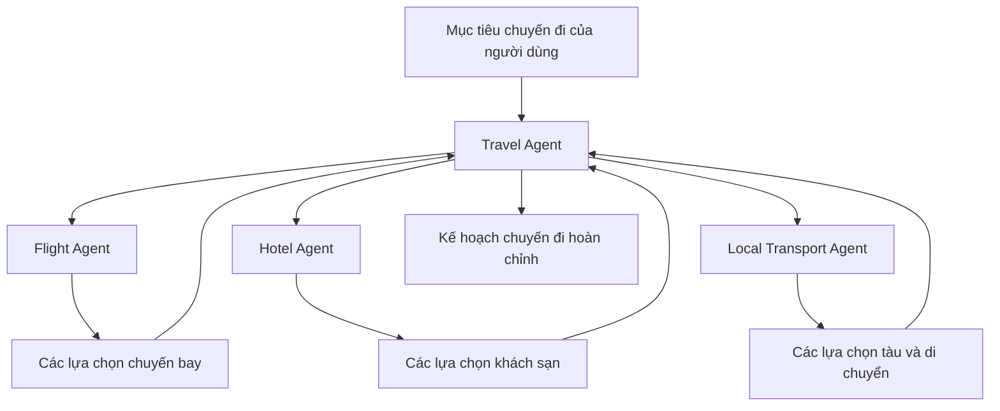
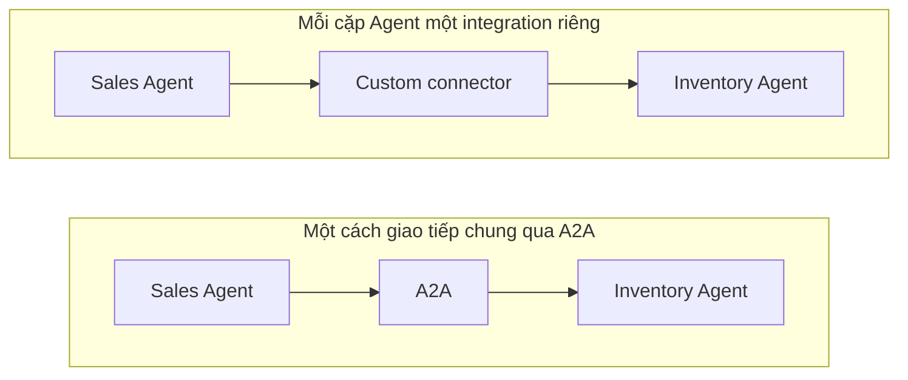
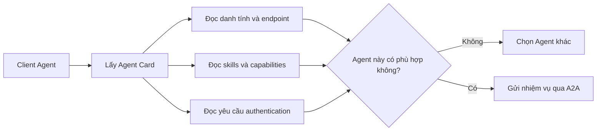
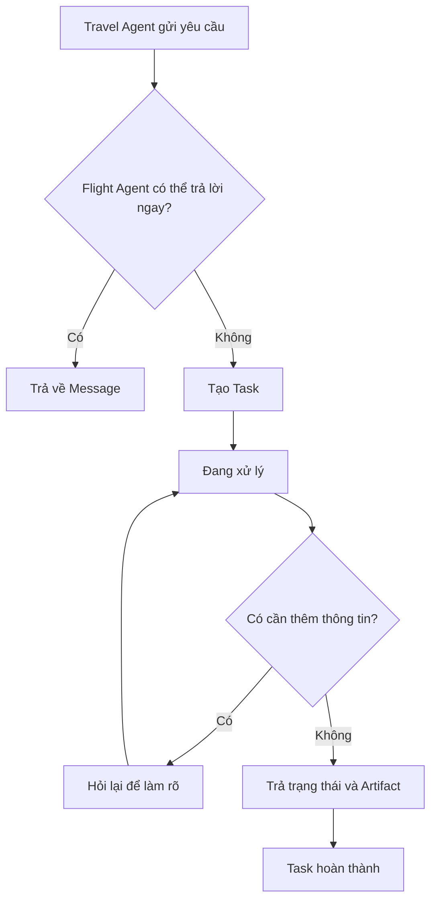
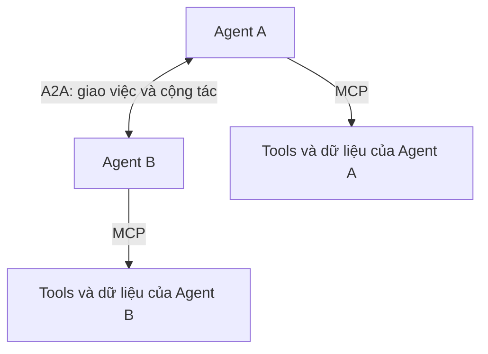
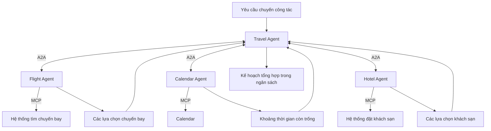
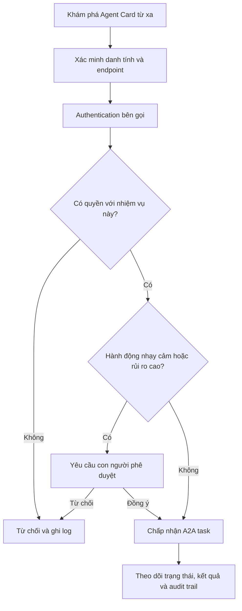
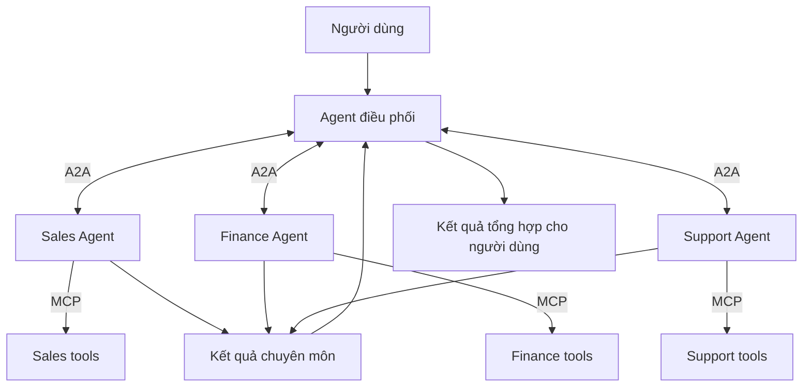

Trong [bài trước về MCP](../what-is-mcp-ai-usb-c-vi/), chúng ta đã dùng một câu rất đơn giản:

> **MCP giúp AI application kết nối với công cụ và dữ liệu bên ngoài.**

Một Agent có thể dùng MCP để đọc tài liệu, tra cứu database, kiểm tra GitHub, tìm thông tin khách hàng hoặc tạo ticket.

Nhưng khi hệ thống AI ngày càng lớn, một vấn đề khác bắt đầu xuất hiện.

Điều gì xảy ra nếu Agent không chỉ cần một tool, mà cần sự giúp đỡ của **một Agent độc lập khác**?

Một Travel Agent có thể nhờ một Agent tìm chuyến bay, một Agent khác so sánh khách sạn và một Agent khác kiểm tra lịch của người dùng. Mối quan hệ lúc này không còn chỉ là:

```text
Agent -> Tool
```

Nó còn trở thành:

```text
Agent -> Agent
```

Đó là bài toán mà **Agent2Agent Protocol**, hay **A2A**, muốn giải quyết.

## 1. Một Agent không nhất thiết phải tự làm tất cả

Giả sử bạn yêu cầu:

> Lên kế hoạch giúp tôi đi Nhật 5 ngày. Ngân sách khoảng 25 triệu, ưu tiên Tokyo và Kyoto.

Bạn có thể xây dựng một Travel Agent lớn tự xử lý chuyến bay, khách sạn, lịch tàu, địa điểm, ngân sách và lịch trình.

Một thiết kế khác là chia công việc cho các Agent chuyên biệt:



Travel Agent không cần biết mọi quy định hàng không. Nó cần biết chuyên gia nào có thể xử lý phần việc đó và cách giao nhiệm vụ.

Cách này giống một tổ chức. Quản lý dự án không tự làm kế toán, thiết kế, lập trình và pháp lý. Người quản lý phối hợp những người có năng lực khác nhau.

Đây là một trong những tư duy phía sau hệ thống multi-agent.

## 2. Nhưng các Agent độc lập giao tiếp bằng cách nào?

Hãy tưởng tượng một công ty có bốn Agent:

- Sales Agent;
- Finance Agent;
- Support Agent;
- Inventory Agent.

Sales Agent muốn hỏi Inventory Agent:

> Kho có đủ hàng để đáp ứng đơn 500 sản phẩm không?

Hai Agent có thể được xây bằng framework khác nhau, chạy trên cloud khác nhau, sử dụng model khác nhau hoặc thậm chí thuộc hai công ty khác nhau.

Nếu mỗi cặp Agent đều cần một integration riêng, giao tiếp giữa Agent sẽ gặp lại đúng bài toán kết nối mà tool từng gặp trước MCP.



Google công bố A2A ngày 9/4/2025 nhằm giúp các Agent tương tác xuyên qua ranh giới platform, vendor và framework. Dự án được chuyển sang Linux Foundation vào tháng 6/2025 để phát triển dưới cơ chế quản trị mở và trung lập với nhà cung cấp.

## 3. A2A thực chất là gì?

A2A là viết tắt của **Agent2Agent Protocol**.

Nói đơn giản:

> **A2A là một open standard giúp các AI Agent độc lập khám phá khả năng của nhau, trao đổi message, giao nhiệm vụ và chia sẻ kết quả.**

Các Agent không cần sử dụng cùng ngôn ngữ lập trình, model hoặc agent framework. Chúng cần triển khai cùng một interaction model.

Có một ranh giới phạm vi rất quan trọng:

> **Không phải mọi hệ thống multi-agent đều cần A2A.**

Nếu nhiều sub-agent cùng nằm trong một application và được một framework duy nhất kiểm soát, cơ chế orchestration có sẵn của framework có thể đơn giản hơn. A2A đặc biệt hữu ích khi các Agent là những service độc lập hoặc nằm ở các team, platform, vendor hay tổ chức khác nhau.

A2A là protocol giao tiếp. Nó không phải framework để xây Agent, không thay thế orchestration nội bộ và cũng không phải ứng dụng chat dành cho con người.

## 4. Làm sao một Agent biết Agent khác làm được gì?

Hãy tưởng tượng bạn đến một hội nghị và mỗi người có một tấm danh thiếp:

```text
Flight Agent

Kỹ năng:
- Tìm chuyến bay
- So sánh lịch bay
- Kiểm tra điều kiện hành lý

Chấp nhận:
- Text
- Structured data
```

Từ tấm danh thiếp đó, Agent khác có thể quyết định Flight Agent có phù hợp với nhiệm vụ hay không.

Trong A2A, khái niệm tương đương là **Agent Card**. Đây là một JSON metadata document có thể mô tả danh tính, service endpoint, skills, supported interfaces, capabilities và yêu cầu authentication của Agent.



Agent Card có thể được tìm qua well-known URL, registry hoặc catalog, hay được cấu hình trực tiếp. Public card cũng có thể trỏ tới extended card chỉ công bố thêm khả năng sau khi client đã authentication.

Mental model đơn giản vẫn là một tấm danh thiếp: **bạn là ai, bạn làm được gì và tôi có thể làm việc với bạn bằng cách nào?**

## 5. A2A nói về công việc, không phải hai Agent chào nhau

"Agent giao tiếp với Agent" không chủ yếu có nghĩa là:

```text
Agent A: Xin chào!
Agent B: Xin chào!
```

Nó nói về việc phối hợp một phần công việc.

Travel Agent có thể gửi cho Flight Agent nhiệm vụ:

> Tìm chuyến bay thẳng từ Hà Nội tới Tokyo ngày 10/10, về ngày 15/10.

Flight Agent có thể trả lời ngay bằng một message hoặc tạo một **Task** có state nếu công việc cần tiếp tục trong thời gian dài. Task có thể gửi cập nhật trạng thái và cuối cùng tạo ra một hoặc nhiều **Artifact**, chẳng hạn danh sách chuyến bay có cấu trúc.



A2A hỗ trợ nhiều cách nhận kết quả:

- request và response thông thường;
- polling để lấy cập nhật task;
- streaming các cập nhật theo thời gian thực;
- push notification qua webhook.

Vì vậy, A2A phù hợp với những công việc kéo dài và nhiều lượt, nơi remote Agent có thể hỏi lại, cập nhật tiến độ rồi tiếp tục xử lý bất đồng bộ.

## 6. MCP và A2A giải quyết hai vấn đề khác nhau

Đây là khác biệt đáng nhớ nhất:



**MCP kết nối theo chiều dọc xuống tools và context.**

**A2A kết nối theo chiều ngang sang một Agent độc lập.**

Tài liệu chính thức của A2A gọi đây là hai lớp vertical và horizontal. MCP làm một Agent có chiều sâu hơn bằng cách kết nối nó với tools và resources. A2A mở rộng hệ thống theo chiều ngang bằng cách kết nối Agent đó với những Agent độc lập khác.

| Câu hỏi | MCP | A2A |
| --- | --- | --- |
| Kết nối gì? | Agent hoặc AI application với tools và context | Agent độc lập với Agent độc lập |
| Ví dụ thường gặp | Tra cứu database | Sales Agent giao việc cho Finance Agent |
| Phía bên kia là gì? | Tool, API, file, database, workflow | Một agentic system |
| Kiểu tương tác | Thường là một capability call có phạm vi rõ | Message, task, cập nhật và artifact |
| Mục tiêu chính | Cung cấp khả năng cho Agent | Giúp Agent cộng tác xuyên qua các ranh giới |

MCP và A2A không phải đối thủ. Chúng là hai protocol bổ trợ và có thể xuất hiện trong cùng một kiến trúc.

## 7. Ví dụ hoàn chỉnh: tổ chức một chuyến công tác

Giả sử bạn yêu cầu:

> Sắp xếp giúp tôi chuyến công tác Singapore tuần tới. Không trùng lịch họp và tổng chi phí dưới 20 triệu.

Travel Agent điều phối có thể giao phần việc chuyên môn qua A2A. Sau đó, mỗi Agent chuyên biệt dùng MCP để tiếp cận hệ thống của riêng mình.



Trong hệ thống này:

- **A2A** giúp các Agent khám phá nhau, giao việc, hỏi thêm thông tin và trả kết quả.
- **MCP** giúp mỗi Agent sử dụng tools và dữ liệu cần thiết để hoàn thành phần việc riêng.

Hai protocol gặp nhau ở hai lớp khác nhau của cùng một workflow.

## 8. Vì sao không biến Agent khác thành một Tool?

Với một nhiệm vụ đơn giản, bạn hoàn toàn có thể làm vậy.

Nếu yêu cầu chỉ là "trả về tỷ giá hôm nay", một tool có input và output rõ ràng có thể là thiết kế gọn hơn.

Khác biệt trở nên hữu ích khi phần việc được giao có thêm tính tự chủ và state:

| Tool | Agent |
| --- | --- |
| Thực hiện một chức năng cụ thể, định nghĩa trước | Nhận một mục tiêu rộng hơn |
| Thường có input và output rõ | Có thể hỏi thêm thông tin |
| Thường hoàn thành một operation có phạm vi hẹp | Có thể lập kế hoạch và thực hiện nhiều bước |
| Thường được xem là stateless | Có thể giữ task state qua nhiều lượt |
| Bên gọi kiểm soát workflow | Remote Agent kiểm soát workflow nội bộ |

Máy tính nhận `17 x 24` và trả `408`. Một chuyên gia du lịch nhận yêu cầu "tìm phương án di chuyển tốt nhất" và có thể so sánh lựa chọn, phát hiện xung đột, hỏi thêm dữ liệu, điều chỉnh kế hoạch rồi mới trả kết quả.

Bọc mọi Agent thành một tool đơn giản có thể làm mất những kiểu tương tác phong phú này. Ngược lại, gọi mọi function là Agent sẽ tạo thêm độ phức tạp không cần thiết. Hình dạng của nhiệm vụ nên quyết định interface.

## 9. Agent có thể cộng tác mà không để lộ phần bên trong

Giả sử bạn thuê một công ty logistics. Bạn cần biết họ có giao được kiện hàng hay không và kết quả cuối cùng là gì. Bạn không nhất thiết cần quyền truy cập database, thuật toán tối ưu tuyến đường, workflow của nhân viên hay ghi chú lập kế hoạch nội bộ.

A2A theo đuổi cùng ý tưởng **opaque execution**.

Các Agent có thể cộng tác dựa trên khả năng đã công bố và thông tin được trao đổi mà không cần chia sẻ toàn bộ internal state, memory, reasoning hoặc tools. Điều này quan trọng khi các Agent thuộc những team hoặc công ty khác nhau và implementation có dữ liệu riêng hay tài sản trí tuệ.

Remote Agent công bố một contract:

- có thể làm gì;
- liên hệ bằng cách nào;
- hỗ trợ content và protocol binding nào;
- yêu cầu authentication gì;
- trả về task hoặc message nào.

Implementation bên trong vẫn có thể được giữ kín.

## 10. Giao tiếp được không có nghĩa tự động tin tưởng nhau

Protocol chung giúp việc giao tiếp trở nên khả thi. Nó không khiến mọi bên tham gia trở nên đáng tin cậy.

Hãy xem một Finance Agent nhận yêu cầu:

> Chuyển 100 triệu đồng vào tài khoản này.

Trước khi hành động, hệ thống vẫn phải trả lời:

- Người dùng nào đứng sau yêu cầu?
- Agent nào đã gửi yêu cầu?
- Agent đó có quyền yêu cầu chuyển tiền không?
- Dữ liệu nào được phép chia sẻ?
- Hành động này có cần con người phê duyệt không?

Một interaction an toàn cần các lớp kiểm soát xung quanh protocol:



Agent Card có thể công bố yêu cầu authentication và A2A đi theo các security practice phổ biến của web. Nhưng business authorization, tenant isolation, data policy, approval và auditing vẫn thuộc trách nhiệm của hệ thống xung quanh.

A2A v1.0 stable được phát hành ngày 12/3/2026. Phiên bản này đưa ra nền tảng production-ready với protocol version negotiation, nhiều protocol binding và một semantic model chung. Mức độ trưởng thành đó hỗ trợ interoperability nhưng không loại bỏ nhu cầu thiết kế security cẩn thận.

## 11. Từ một AI đến một tổ chức AI

Kiến trúc đã phát triển qua nhiều lớp:



Nó bắt đầu giống một tổ chức:

1. Một bên nhận mục tiêu.
2. Công việc được giao cho các chuyên gia.
3. Mỗi chuyên gia dùng bộ công cụ riêng.
4. Kết quả được trả về và tổng hợp.

A2A được Google ra mắt vào tháng 4/2025 và chuyển sang Linux Foundation trong tháng 6 cùng năm. Phiên bản 1.0 trở thành stable vào tháng 3/2026. Đến tháng 4/2026, Linux Foundation công bố A2A đã nhận được sự hỗ trợ của hơn 150 tổ chức; tháng 8/2026, A2A được nhận vào Agentic AI Foundation ở Growth Stage.

Những cột mốc đó không đảm bảo tương lai sẽ có hàng nghìn Agent tự do nói chuyện với nhau. Chúng cho thấy interoperability giữa các hệ thống Agent độc lập đã trở thành một bài toán kỹ thuật thật sự.

MCP trả lời một phần:

> **Agent sử dụng tools và context như thế nào?**

A2A trả lời phần tiếp theo:

> **Agent làm việc với một Agent độc lập khác như thế nào?**

Khi những hệ thống này cộng tác qua các nhiệm vụ dài hơn, một câu hỏi khác sẽ nhanh chóng xuất hiện:

> **Làm thế nào để AI nhớ được những gì đã xảy ra trước đó thay vì mỗi lần đều bắt đầu từ con số 0?**

Đó là chủ đề tiếp theo: **AI Memory - AI rất thông minh, nhưng tại sao lại hay quên?**

## Nguồn tham khảo

- [Google Developers - Công bố Agent2Agent Protocol](https://developers.googleblog.com/en/a2a-a-new-era-of-agent-interoperability/)
- [A2A Protocol - A2A là gì?](https://a2a-protocol.org/latest/topics/what-is-a2a/)
- [A2A Protocol - Các khái niệm cốt lõi](https://a2a-protocol.org/latest/topics/key-concepts/)
- [A2A Protocol - A2A và MCP](https://a2a-protocol.org/latest/topics/a2a-and-mcp/)
- [A2A Protocol - Phát hành v1.0](https://a2a-protocol.org/latest/blog/2026/03/12/a2a-protocol-ships-v10-production-ready-standard-for-agent-to-agent-communication/)
- [Linux Foundation - Khởi động dự án A2A](https://www.linuxfoundation.org/press/linux-foundation-launches-the-agent2agent-protocol-project-to-enable-secure-intelligent-communication-between-ai-agents)
- [Linux Foundation - Mức độ ứng dụng A2A sau một năm](https://www.linuxfoundation.org/press/a2a-protocol-surpasses-150-organizations-lands-in-major-cloud-platforms-and-sees-enterprise-production-use-in-first-year)
- [A2A Protocol - Gia nhập Agentic AI Foundation](https://a2a-protocol.org/latest/blog/2026/08/27/a-new-chapter-for-a2a-joining-the-agentic-ai-foundation/)
