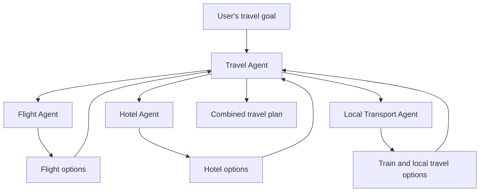
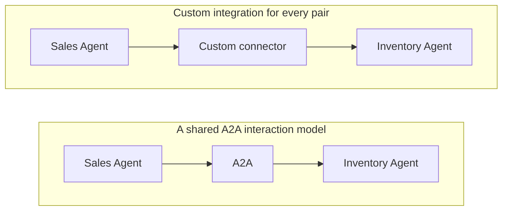
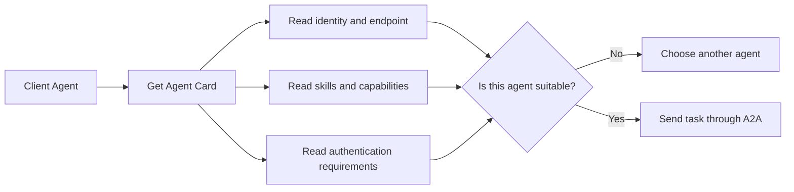
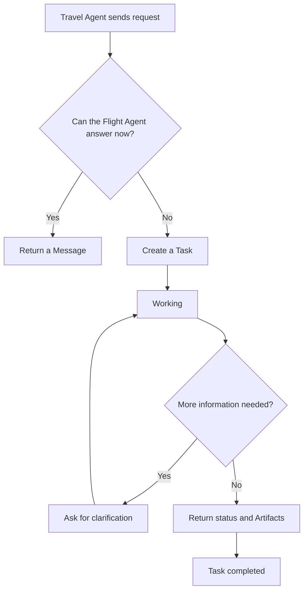
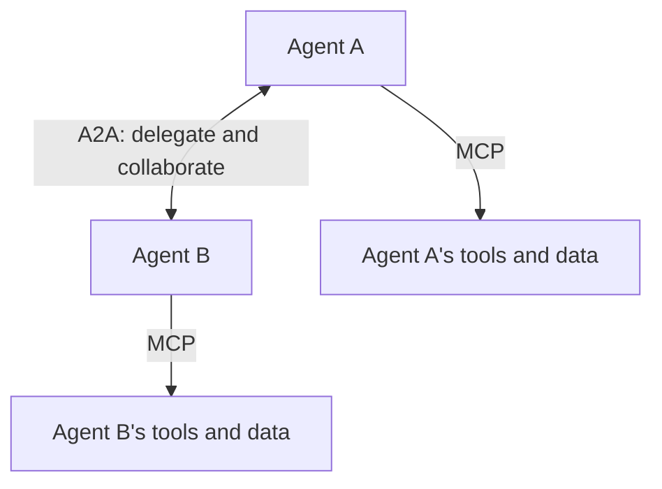
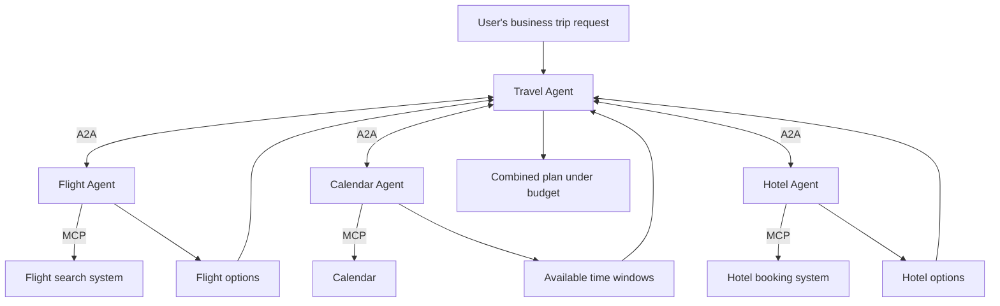
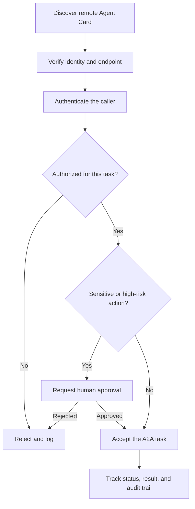
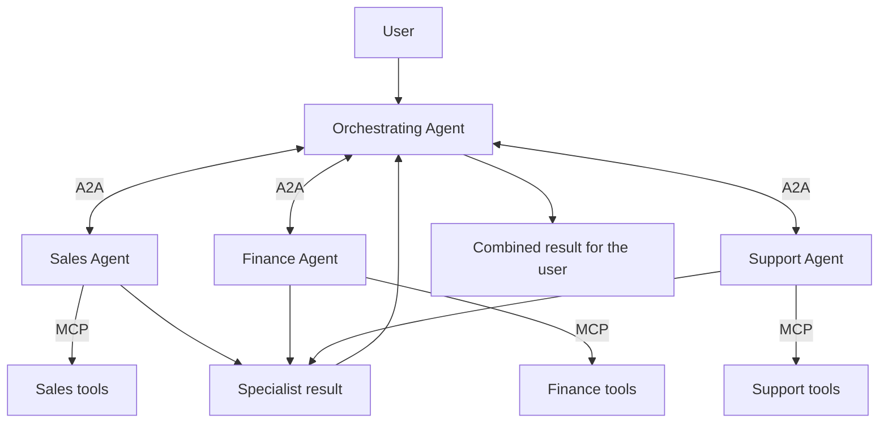

In the [previous article about MCP](../what-is-mcp-ai-usb-c/), we used one simple sentence:

> **MCP helps an AI application connect to external tools and data.**

An agent can use MCP to read documents, query a database, inspect GitHub, look up a customer, or create a ticket.

But as an AI system grows, a different problem appears.

What if the agent does not merely need a tool? What if it needs help from **another independent agent**?

A travel agent may ask one agent to find flights, another to compare hotels, and another to check the traveler's calendar. The relationship is no longer only:

```text
Agent -> Tool
```

It is also:

```text
Agent -> Agent
```

That is the problem the **Agent2Agent Protocol**, or **A2A**, is designed to address.

## 1. One agent does not have to do everything

Suppose you ask:

> Plan a five-day trip to Japan with a budget of about 25 million VND. Prioritize Tokyo and Kyoto.

You could build one large travel agent that handles flights, hotels, train schedules, attractions, budgets, and itinerary planning by itself.

Another design divides the work among specialists:



The Travel Agent does not need to know every airline rule. It needs to know which specialist can handle that part of the job and how to delegate the task.

This resembles an organization. A project manager does not personally perform accounting, design, engineering, and legal review. The manager coordinates people with different capabilities.

That is one of the ideas behind multi-agent systems.

## 2. But how do independent agents communicate?

Imagine a company has four agents:

- Sales Agent;
- Finance Agent;
- Support Agent;
- Inventory Agent.

The Sales Agent wants to ask the Inventory Agent:

> Is there enough stock to fulfill an order for 500 units?

The two agents may use different frameworks, run on different clouds, use different models, or even belong to different companies.

If every pair needs its own custom integration, agent communication develops the same connection problem that tool integrations had before MCP.



Google announced A2A on April 9, 2025 to help agents interoperate across platforms, vendors, and frameworks. The project moved to the Linux Foundation in June 2025 so it could develop under open, vendor-neutral governance.

## 3. What A2A actually is

A2A stands for **Agent2Agent Protocol**.

In plain language:

> **A2A is an open standard that helps independent AI agents discover one another's capabilities, exchange messages, delegate tasks, and share results.**

The agents do not need to use the same programming language, model, or agent framework. They need to implement a common interaction model.

This is an important scope boundary:

> **Not every multi-agent system needs A2A.**

If several sub-agents live inside one application and one framework controls all of them, the framework's native orchestration may be simpler. A2A becomes especially useful when agents are separate services or cross team, platform, vendor, or organizational boundaries.

A2A is a communication protocol. It is not an agent-building framework, a replacement for internal orchestration, or a chat application for humans.

## 4. How does one agent know what another agent can do?

Imagine arriving at a conference where everyone carries a business card:

```text
Flight Agent

Skills:
- Find flights
- Compare schedules
- Check baggage conditions

Accepts:
- Text
- Structured data
```

From that card, another agent can decide whether the Flight Agent is suitable for a task.

In A2A, the equivalent is an **Agent Card**. It is a JSON metadata document that can describe an agent's identity, service endpoint, skills, supported interfaces, capabilities, and authentication requirements.



Agent Cards can be found through a well-known URL, a registry or catalog, or direct configuration. A public card can also point to an extended card that reveals additional capabilities only after authentication.

The simple mental model is still a business card: **who are you, what can you do, and how may I work with you?**

## 5. A2A is about work, not agents saying hello

"Agent-to-agent communication" does not mainly mean this:

```text
Agent A: Hello!
Agent B: Hello!
```

It means coordinating a unit of work.

The Travel Agent might send the Flight Agent this task:

> Find a direct flight from Hanoi to Tokyo on October 10, returning October 15.

The Flight Agent can respond immediately with a message or return a stateful **Task** for work that continues over time. A task can produce status updates and eventually one or more **Artifacts**, such as a structured list of flight options.



A2A supports several ways to receive results:

- a normal request and response;
- polling for task updates;
- streaming incremental updates;
- push notifications through a webhook.

That makes it suitable for longer, multi-turn jobs where the remote agent may ask questions, update progress, and continue working asynchronously.

## 6. MCP and A2A solve different problems

This is the distinction worth remembering:



**MCP connects downward to tools and context.**

**A2A connects sideways to an independent agent.**

The official A2A documentation describes these as vertical and horizontal layers. MCP deepens an agent by connecting it to tools and resources. A2A expands the system horizontally by connecting that agent to other independent agents.

| Question | MCP | A2A |
| --- | --- | --- |
| What does it connect? | Agent or AI application to tools and context | Independent agent to independent agent |
| Typical example | Query a database | Sales Agent delegates work to Finance Agent |
| What is on the other side? | Tool, API, file, database, workflow | An agentic system |
| Interaction shape | Usually a bounded capability call | Messages, tasks, updates, and artifacts |
| Main goal | Give an agent capabilities | Let agents collaborate across boundaries |

MCP and A2A are not competitors. They are complementary protocols and can be used in the same architecture.

## 7. A complete example: planning a business trip

Suppose you ask:

> Arrange a business trip to Singapore next week. Avoid conflicts with my meetings and keep the total cost below 20 million VND.

A coordinating Travel Agent can delegate specialist work through A2A. Each specialist can then use MCP to reach its own systems.



In this system:

- **A2A** lets the agents discover one another, delegate work, ask follow-up questions, and return results.
- **MCP** lets each agent use the tools and data needed to complete its own part.

The protocols meet at different layers of the same workflow.

## 8. Why not expose another agent as a tool?

For a simple task, you can.

If the only requirement is "return today's exchange rate," a tool with a clear input and output may be the cleaner design.

The distinction becomes useful as the delegated work gains autonomy and state:

| Tool | Agent |
| --- | --- |
| Performs a specific, predefined function | Accepts a broader goal |
| Usually has clear input and output | May ask follow-up questions |
| Often completes one bounded operation | May plan and execute several steps |
| Commonly treated as stateless | Can maintain task state across turns |
| The caller controls the workflow | The remote agent controls its internal workflow |

A calculator receives `17 x 24` and returns `408`. A travel specialist receives "find the best transport plan" and may compare options, notice a conflict, request more information, revise the plan, and then deliver a result.

Wrapping every agent as a simple tool can hide these richer interaction patterns. On the other hand, calling every function an agent adds unnecessary complexity. The task shape should determine the interface.

## 9. Agents can collaborate without exposing their internals

Suppose you hire a logistics company. You need to know whether it can deliver a package and what the result will be. You do not necessarily need access to its internal database, routing algorithm, employee workflow, or private planning notes.

A2A follows the same idea of **opaque execution**.

Agents can collaborate based on declared capabilities and exchanged information without sharing their full internal state, memory, reasoning, or tools. This matters when agents belong to different teams or companies and their implementations contain private data or intellectual property.

The remote agent exposes a contract:

- what it can do;
- how to contact it;
- what content and protocol bindings it supports;
- what authentication is required;
- what task or message it returns.

Its internal implementation can remain private.

## 10. Communication does not automatically create trust

A common protocol makes communication possible. It does not make every participant trustworthy.

Consider a Finance Agent receiving this request:

> Transfer 100 million VND to this account.

Before acting, the system still needs to answer:

- Which user is behind the request?
- Which agent sent it?
- Is that agent allowed to request a transfer?
- What data may be shared?
- Does this action require human approval?

A secure interaction needs controls around the protocol:



Agent Cards can declare authentication requirements, and A2A aligns with standard web security practices. But business authorization, tenant isolation, data policy, approval, and auditing still belong to the surrounding system.

The stable A2A v1.0 specification was released on March 12, 2026. It added a production-ready foundation with protocol version negotiation, multiple protocol bindings, and a common semantic model. That maturity helps interoperability, but it does not remove the need for careful security design.

## 11. From one AI to an AI organization

The architecture has evolved in stages:



It begins to resemble an organization:

1. One participant receives the goal.
2. Work is delegated to specialists.
3. Each specialist uses its own tools.
4. Results are returned and combined.

A2A was launched by Google in April 2025 and moved to the Linux Foundation that June. Version 1.0 became stable in March 2026. By April 2026, the Linux Foundation reported support from more than 150 organizations, and in August 2026 A2A was accepted as a Growth Stage project of the Agentic AI Foundation.

Those milestones do not guarantee that the future will contain thousands of autonomous agents freely talking to one another. They do show that interoperability between independent agent systems has become a real engineering problem.

MCP answers one part:

> **How does an agent use tools and context?**

A2A answers the next:

> **How does an agent work with another independent agent?**

As these systems collaborate across longer tasks, another question soon appears:

> **How can an AI remember what happened before instead of starting from zero every time?**

That leads to the next topic: **AI Memory - AI can be intelligent, so why does it keep forgetting?**

## References

- [Google Developers - Announcing the Agent2Agent Protocol](https://developers.googleblog.com/en/a2a-a-new-era-of-agent-interoperability/)
- [A2A Protocol - What is A2A?](https://a2a-protocol.org/latest/topics/what-is-a2a/)
- [A2A Protocol - Core concepts](https://a2a-protocol.org/latest/topics/key-concepts/)
- [A2A Protocol - A2A and MCP](https://a2a-protocol.org/latest/topics/a2a-and-mcp/)
- [A2A Protocol - v1.0 release](https://a2a-protocol.org/latest/blog/2026/03/12/a2a-protocol-ships-v10-production-ready-standard-for-agent-to-agent-communication/)
- [Linux Foundation - Launching the A2A project](https://www.linuxfoundation.org/press/linux-foundation-launches-the-agent2agent-protocol-project-to-enable-secure-intelligent-communication-between-ai-agents)
- [Linux Foundation - A2A adoption at one year](https://www.linuxfoundation.org/press/a2a-protocol-surpasses-150-organizations-lands-in-major-cloud-platforms-and-sees-enterprise-production-use-in-first-year)
- [A2A Protocol - Joining the Agentic AI Foundation](https://a2a-protocol.org/latest/blog/2026/08/27/a-new-chapter-for-a2a-joining-the-agentic-ai-foundation/)
