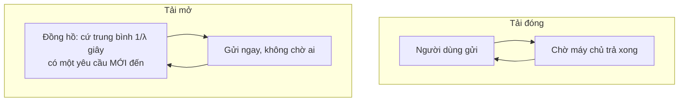

> **Mục tiêu bài học:** Sau bài này, bạn sẽ biết vì sao con số trung bình che mất thứ người dùng thật sự cảm thấy, phân biệt được **tải đóng** với **tải mở** - và vì sao cách đo phổ biến nhất lại báo độ trễ tốt hơn thực tế nhiều lần - dùng được định luật Little để kiểm chính phép đo của mình, và nhận ra lúc một hệ phục vụ đã **mất ổn định**.

Bài 05 và bài 06 đo thông lượng và độ trễ bằng cách đưa cả một khối yêu cầu vào cùng lúc. Người dùng thật không đến như thế. Họ đến rải rác, lúc thưa lúc dày, không ai hẹn ai.

Bài này đo máy chủ ở bài 08 - Qwen2.5-7B-Instruct-AWQ, một RTX 3060 - bằng hai cách giả lập người dùng, và cho thấy hai cách ấy kể hai câu chuyện khác nhau về cùng một máy.

## 1. Trung bình nói dối

Bài 01 đã có công thức: $\text{E2E} \approx \text{TTFT} + (N-1)\times\text{TPOT}$, trong đó TTFT đã gồm thời gian chờ hàng đợi. Nhưng một hệ phục vụ không có "một" E2E; nó có **một phân bố** E2E, vì mỗi yêu cầu gặp một hàng đợi khác nhau.

Người dùng không cảm nhận trung bình. Họ nhớ **lần tệ nhất**. Nên thước đo chuẩn là **phân vị**:

| Phân vị | Nghĩa |
|---|---|
| **p50** (trung vị) | Một nửa số yêu cầu nhanh hơn mức này |
| **p95** | 1 trên 20 yêu cầu chậm hơn mức này |
| **p99** | 1 trên 100 yêu cầu chậm hơn mức này |

Một người dùng gửi 20 câu hỏi mỗi ngày thì xác suất gặp ít nhất một lần chậm hơn mức p95 là $1 - 0{,}95^{20} \approx$ **64%** - tức phần lớn các ngày. Còn mức p99 xảy ra bao nhiêu lần phụ thuộc vào **số yêu cầu mỗi giây**, không vào số người dùng: ở 100 yêu cầu mỗi giây, 1% chậm nhất là khoảng **60 yêu cầu mỗi phút**. Trung bình không xuất hiện trong trải nghiệm của ai cả.

## 2. Hai cách giả lập người dùng

**Tải đóng** (*closed-loop*): có $C$ người dùng giả. Mỗi người gửi một yêu cầu, **chờ nhận xong**, rồi gửi yêu cầu tiếp theo ngay. Đây là cách dễ viết nhất, và là cách phần lớn công cụ đo làm mặc định.

**Tải mở** (*open-loop*): yêu cầu **đến theo một nhịp cố định** $\lambda$ yêu cầu mỗi giây - ở đây theo phân bố Poisson, tức ngẫu nhiên nhưng trung bình đúng $\lambda$ - **bất kể** máy chủ đang bận hay rảnh. Đây là cách người dùng thật đến.

Khác biệt nằm ở một chỗ duy nhất: **khi máy chủ chậm lại, tải đóng tự gửi ít đi.** Mỗi người dùng giả phải chờ lâu hơn mới được gửi yêu cầu kế tiếp, nên áp lực lên máy chủ tự giảm theo. Tải mở thì không - người dùng mới vẫn đến đúng nhịp, và nếu máy chủ không kịp thì họ **xếp hàng**.

Nói cách khác: tải đóng là một thí nghiệm mà **đối tượng được đo điều khiển được lượng tải nó phải chịu**. Vì lượng yêu cầu gửi đi phụ thuộc vào chính tốc độ trả lời, nó **không tạo được một hàng đợi lớn dần mãi** như khi yêu cầu đến từ bên ngoài. Hàng đợi bên trong máy chủ vẫn có - nếu $C$ lớn hơn số chỗ bộ máy chạy cùng lúc thì phần dôi ra nằm chờ - nhưng bị chặn trên bởi $C$.

## 3. Đo: tải đóng và tải mở

Mỗi yêu cầu có prompt ngắn và sinh đúng 128 token. Client lấy mẫu **số yêu cầu đang dở** mỗi 0,1 giây trong suốt phép đo.

**Tải đóng,** mỗi người dùng giả gửi 6 yêu cầu:

| $C$ người dùng | Đạt (req/s) | Thông lượng (tok/s) | TTFT p50 / p99 (s) | E2E p50 / p95 (s) |
|---|---|---|---|---|
| 1 | 0,52 | 66,6 | 0,035 / 0,037 | 1,93 / 1,94 |
| 4 | 1,96 | 251,4 | 0,062 / 0,083 | 2,04 / 2,06 |
| 16 | 6,67 | 853,7 | 0,124 / 0,255 | 2,37 / 2,50 |
| 32 | 9,17 | 1.174,1 | 0,166 / 0,348 | 3,48 / 3,59 |
| 64 | **10,10** | 1.292,6 | 0,227 / 0,945 | 6,31 / 6,76 |

**Tải mở,** yêu cầu đến trong 60 giây:

| $\lambda$ đặt ra | Đạt (req/s) | TTFT p50 / p99 (s) | E2E p50 / p95 / p99 (s) | Đang dở: nửa đầu → nửa sau | Xả hàng sau khi ngừng đến |
|---|---|---|---|---|---|
| 0,5 | 0,40 | 0,040 / 0,056 | 1,95 / 1,99 / 2,00 | 0,99 → 0,57 | 0,0 s |
| 1 | 0,94 | 0,046 / 0,104 | 1,98 / 2,05 / 2,10 | 1,78 → 1,96 | 0,3 s |
| 2 | 2,15 | 0,054 / 0,355 | 2,09 / 2,22 / 2,33 | 4,49 → 4,61 | 1,2 s |
| 4 | 3,64 | 0,060 / 0,124 | 2,23 / 2,38 / 2,49 | 7,32 → 8,93 | 1,8 s |
| 8 | 7,91 | 0,108 / 0,178 | 4,38 / 5,67 / 5,79 | **30,2 → 41,0** | 2,8 s |
| 12 | 8,89 | **0,442 / 4,052** | **21,26 / 27,03 / 27,37** | **94,2 → 234,7** | **15,6 s** |

## 4. Hai câu chuyện về cùng một máy

**Tải đóng kể một câu chuyện êm ả.** Tăng từ 1 lên 64 người dùng, thông lượng lên tới khoảng **10 yêu cầu mỗi giây** rồi dừng. E2E tăng từ tốn, từ 1,9 lên 6,3 giây. TTFT p99 tệ nhất chưa tới một giây. Đọc bảng này, bạn sẽ nói: *"máy chủ chịu được khoảng 9 yêu cầu mỗi giây với p95 dưới 4 giây."*

**Tải mở kể câu chuyện thật.** Ở $\lambda = 12$, thông lượng đạt được là **8,89** yêu cầu mỗi giây - gần như bằng con số 9,17 của tải đóng với 32 người dùng. Nhưng E2E p95 là **27,03 giây**, không phải 3,59. TTFT p99 là **4,05 giây**, không phải 0,35.

**Cùng một máy, cùng cỡ thông lượng, đuôi độ trễ chênh gần tám lần.**

Vì ở tải đóng, khi máy chủ chậm lại thì người dùng giả cũng chậm lại theo - chờ lâu hơn nên gửi thưa hơn - và hàng đợi không bao giờ vượt quá $C$. Ở tải mở, người dùng mới cứ đến; máy chủ chỉ phục vụ được khoảng 9-10 yêu cầu mỗi giây, nên với 12 yêu cầu đến mỗi giây, mỗi giây dôi ra 2-3 yêu cầu **nằm chờ**. Chúng dồn lại, và người đến sau phải chờ tất cả những người đến trước.

Hệ quả thực dụng: **nếu bạn lấy độ trễ đo bằng tải đóng để suy ra tốc độ đến mà người dùng thật được phục vụ dưới cùng mức độ trễ ấy, bạn sẽ quá lạc quan.** Tải đóng vẫn hữu ích để tìm thông lượng bão hòa; cái nó che là độ trễ khi yêu cầu đến theo nhịp riêng. Con số "chịu được 9 req/s với p95 3,6 giây" là thật - nhưng chỉ đúng khi người dùng lịch sự tới mức chờ nhau. Người dùng thật không lịch sự như vậy.

## 5. Định luật Little: kiểm chính phép đo của mình

Có một quan hệ đơn giản giữa ba đại lượng của bất kỳ hệ xếp hàng nào đang ở **trạng thái ổn định**:

$$L = \lambda W$$

$L$ là số yêu cầu trung bình đang ở trong hệ, $\lambda$ là tốc độ yêu cầu đi qua hệ, $W$ là thời gian trung bình mỗi yêu cầu ở trong hệ. Nó không phụ thuộc phân bố đến, cách lập lịch, hay bất cứ chi tiết nào bên trong.

Giá trị thực dụng lớn nhất của nó là **kiểm phép đo**. Client đo $L$ bằng cách đếm số yêu cầu đang dở mỗi 0,1 giây, còn $\lambda W$ tính từ số yêu cầu xong và E2E trung bình - hai cách đo độc lập:

| Phép đo | $L$ đếm được | $\lambda \times W$ | Chênh |
|---|---|---|---|
| Tải đóng, $C = 1$ | 0,99 | 1,00 | 1% |
| Tải đóng, $C = 64$ | 63,38 | 63,40 | 0,03% |
| Tải mở, $\lambda = 2$ | 4,55 | 4,50 | 1% |
| Tải mở, $\lambda = 4$ | 8,13 | 8,14 | 0,1% |

Khớp tới khoảng 1% ở mọi mức ổn định. Nếu hai con số này lệch nhau nhiều ở một hệ ổn định, **phép đo của bạn có lỗi** - mất yêu cầu, đếm sai, đồng hồ lệch - trước khi bàn gì về máy chủ.

Chú ý tải đóng: $L$ luôn gần đúng bằng $C$. Tất nhiên - đó là cách tải đóng được định nghĩa. Định luật Little vẫn đúng ở đây, như hai dòng đầu bảng cho thấy; nhưng vì $L$ đã bị **ấn định** bởi thiết kế tải, việc nó khớp $\lambda W$ là một phép kiểm **kém độc lập** hơn - nó chủ yếu kiểm rằng client đếm đúng thời gian, không kiểm được gì nhiều về máy chủ.

## 6. Nhận ra lúc hệ mất ổn định

Định luật Little có một điều kiện: **hệ ổn định**, tức số yêu cầu vào và ra cân bằng, hàng đợi không lớn lên mãi. Khi tốc độ đến vượt quá sức phục vụ, điều kiện ấy gãy.

Nhìn cột "đang dở: nửa đầu → nửa sau" ở bảng tải mở:

- $\lambda = 1, 2, 4$: số yêu cầu đang dở ở nửa sau chỉ cao hơn nửa đầu 3-22%.
- $\lambda = 12$: **94 → 235**. Số yêu cầu đang dở tăng **gấp hai lần rưỡi** trong 30 giây. Và khi ngừng cho yêu cầu mới đến, máy chủ mất thêm **15,6 giây** chỉ để xả hàng tồn.

Đọc cột này phải trừ đi một thiên lệch có sẵn: **mọi phép đo đều bắt đầu từ một hệ trống**, nên vài giây đầu có ít yêu cầu đang dở hơn bình thường, và nửa đầu luôn bị kéo xuống. Cộng thêm việc số yêu cầu đến trong 30 giây là ngẫu nhiên - ở $\lambda = 4$, khoảng 120 yêu cầu, dao động cỡ ±9% - thì chênh 15-20% giữa hai nửa là chuyện một hệ ổn định vẫn cho ra. Nên dòng $\lambda = 4$ tăng 22% **không** phải dấu hiệu trôi. Dòng $\lambda = 12$ tăng **2,5 lần** kèm 15,6 giây xả hàng thì là.

Ở $\lambda = 12$, $L$ đếm được là 164,6 còn $\lambda W$ là 171,0 - hai con số vẫn na ná nhau, rất dễ đọc thành "định luật Little đúng, hệ ổn". Nhưng đó là **trung bình của một hàng đợi đang lớn dần**. Chạy phép đo 60 giây thì $W$ ra khoảng 20 giây; chạy 10 phút thì $W$ sẽ lớn hơn nhiều, vì người đến sau luôn gặp hàng dài hơn người đến trước. Ở hệ mất ổn định, **độ trễ đo được phụ thuộc vào việc bạn đo bao lâu** - tức nó không phải một đặc trưng của hệ, mà của phép đo.

Dòng $\lambda = 8$ đáng nhìn kỹ hơn. Số yêu cầu đang dở đi từ **30,2 lên 41,0** giữa hai nửa - hàng đợi cũng đang lớn, dù chậm. E2E p50 đã gấp đôi so với $\lambda = 4$. Sáu mươi giây là **không đủ** để nói nó sẽ dừng lại ở một mức nào đó hay tiếp tục lớn; điều bảng nói được là $\lambda = 8$ nằm **gần biên**, và muốn biết chắc thì phải chạy lâu hơn. Đây là vùng mà một hệ thật không nên vận hành thường xuyên: một đợt tăng nhỏ là đủ đẩy nó qua mép.

> 🔧 **Thử ngay:** đồng nghiệp báo cáo "máy chủ chịu được 10 req/s, đo bằng 64 người dùng đồng thời, p95 6,8 giây" và đề xuất mở cho 10 req/s lưu lượng thật. Bạn phản biện thế nào?
> Con số ấy đo bằng tải đóng, nên nó cho biết **sức chứa tối đa** - khoảng 10 req/s - chứ không cho biết độ trễ khi người dùng thật đến ở nhịp ấy. Người dùng thật đến theo tải mở. Bảng ở mục 3 cho thấy ở 8 req/s hàng đợi đã bắt đầu lớn dần, và ở 12 req/s p95 là 27 giây. Nên đề xuất đúng là: đo lại bằng tải mở ở vài mức $\lambda$, tìm mức cao nhất mà số yêu cầu đang dở **không tăng dần** và p95 còn nằm trong giới hạn chấp nhận, rồi vận hành thấp hơn mức ấy một khoảng dự phòng. Với máy này, câu trả lời gần 4 req/s hơn là 10.

## 7. Quy tắc đo tải

Rút lại thành những điều làm được ngay:

- **Báo phân vị, không báo trung bình.** p50 cho cảm giác thông thường, p95 và p99 cho lần tệ nhất mà người dùng sẽ nhớ.
- **Dùng tải mở khi hỏi về độ trễ.** Tải đóng hợp để tìm sức chứa tối đa; nó không hợp để hỏi người dùng sẽ chờ bao lâu.
- **Đếm số yêu cầu đang dở theo thời gian, sau khi bỏ giai đoạn khởi động.** Nếu nó tăng dần và tăng rõ vượt quá dao động ngẫu nhiên, hệ đang mất ổn định - và mọi con số độ trễ bạn vừa đo chỉ đúng cho đúng độ dài phép đo ấy. Chạy lâu hơn là cách chắc nhất để phân biệt trôi thật với nhiễu.
- **Dùng $L = \lambda W$ để kiểm phép đo**, chỉ ở những mức mà hệ ổn định.
- **Vận hành cách xa biên.** Chỗ độ trễ nổ không từ từ; nó gãy. Ở máy này, giữa 4 và 12 req/s là khác biệt giữa p95 2,4 giây và 27 giây.

## Tóm tắt bài học

- Người dùng nhớ lần tệ nhất, không nhớ trung bình. Báo **p50, p95, p99**.
- **Tải đóng** (C người dùng, gửi tiếp khi xong) tự giảm áp lực khi máy chủ chậm lại, nên **không tạo được hàng đợi lớn dần mãi** - hàng đợi bị chặn bởi $C$. Nó hợp để tìm **thông lượng bão hòa**; cái nó che là độ trễ khi yêu cầu đến theo nhịp độc lập với máy chủ. **Tải mở** (yêu cầu đến theo nhịp cố định) mới giống người dùng thật.
- Cùng máy chủ 7B AWQ trên RTX 3060, ở cỡ **9 req/s**: tải đóng báo E2E p95 **3,59 s**, tải mở cho **27,03 s**. TTFT p99: **0,35 s** so với **4,05 s**. Đuôi độ trễ chênh gần **tám lần**.
- Dùng **độ trễ** đo bằng tải đóng để suy ra tốc độ đến phục vụ được dưới cùng mức độ trễ sẽ **quá lạc quan**; tải đóng vẫn hợp để tìm thông lượng bão hòa.
- **Định luật Little** $L = \lambda W$ dùng để kiểm phép đo: ở mọi mức ổn định, $L$ đếm được khớp $\lambda W$ trong khoảng **1%**.
- Ở tải đóng, $L \approx C$ bị ấn định bởi thiết kế tải: định luật Little vẫn đúng, nhưng thành một phép kiểm kém độc lập hơn ở tải mở.
- Hệ **mất ổn định** khi số yêu cầu đang dở tăng dần **vượt xa dao động ngẫu nhiên và thiên lệch khởi động**: ở $\lambda = 12$, từ **94 lên 235** trong 30 giây, và mất **15,6 s** để xả hàng sau khi ngừng đến. Chênh 15-20% giữa hai nửa cửa sổ 30 giây thì một hệ ổn định vẫn cho ra. Khi đó độ trễ đo được phụ thuộc vào việc đo bao lâu, và $L = \lambda W$ không còn đọc theo trạng thái dừng được.
- $\lambda = 8$ đã có dấu hiệu hàng đợi lớn dần (30 → 41) - gần biên; 60 giây không đủ để kết luận. Vận hành cách xa biên, vì độ trễ không tăng từ từ mà **gãy**.

## Câu hỏi tự kiểm tra

1. Một hệ có E2E trung bình 2 giây và p99 là 20 giây. Người dùng gửi 50 câu hỏi mỗi ngày sẽ gặp mức nào thường xuyên hơn? Giải thích.
2. Vì sao tải đóng không thể làm hàng đợi **lớn dần mãi**, dù máy chủ có chậm tới đâu? Hàng đợi bên trong máy chủ ở tải đóng bị chặn bởi gì?
3. Ở cỡ 9 req/s, tải đóng và tải mở cho E2E p95 chênh gần 8 lần. Giải thích bằng cơ chế của từng cách giả lập.
4. Dùng định luật Little: một hệ ổn định xử lý 5 req/s với thời gian trung bình 3 giây mỗi yêu cầu. Trung bình có bao nhiêu yêu cầu đang ở trong hệ? Nếu bạn đếm được 40 thì nên nghi ngờ điều gì?
5. Vì sao định luật Little vẫn đúng ở tải đóng - bảng ở mục 5 cho 63,38 so với 63,40 - nhưng việc $L \approx C$ bị ấn định lại làm nó thành một phép kiểm **kém độc lập** hơn so với ở tải mở?
6. Ở $\lambda = 12$, $L$ đếm được và $\lambda W$ chỉ lệch 4%. Vì sao vẫn không được đọc đó là "hệ ổn"?
7. Nêu hai dấu hiệu trong dữ liệu cho thấy một hệ phục vụ đang mất ổn định. Vì sao số yêu cầu đang dở ở nửa sau cao hơn nửa đầu 20% **chưa** đủ để kết luận?
8. Thiết kế một phép đo để tìm mức tải cao nhất mà máy chủ của bạn vận hành ổn định với p95 dưới 3 giây. Nêu rõ dùng loại tải nào, chạy bao lâu, đo gì, và dừng ở tiêu chí nào.

## Đọc thêm

**Nguồn nền tảng của bài:**

| Nguồn | Đọc phần nào |
|---|---|
| **Bài 01 của chương này** | Năm đại lượng, và vì sao TTFT đã gồm thời gian chờ hàng đợi |
| **Bài 05 và bài 06 của chương này** | Gộp lô - cơ chế làm thông lượng tăng khi có nhiều yêu cầu cùng lúc |
| **Bài 08 của chương này** | Máy chủ được đo trong bài này |
| **Chương Machine Learning · Bài 12** | Chọn điểm vận hành theo chi phí của từng loại sai |

**Đi sâu hơn:**

- [Little - A Proof for the Queuing Formula L = λW (Operations Research, 1961)](https://pubsonline.informs.org/doi/10.1287/opre.9.3.383) - chứng minh gốc, và điều kiện ổn định mà mục 6 nhắc tới.
- [Schroeder, Wierman & Harchol-Balter - Open Versus Closed: A Cautionary Tale (NSDI 2006)](https://www.usenix.org/conference/nsdi-06/open-versus-closed-cautionary-tale) - bài báo đo đúng hiện tượng ở mục 4 trên nhiều loại hệ thống.
- [Dean & Barroso - The Tail at Scale (CACM 2013)](https://research.google/pubs/the-tail-at-scale/) - vì sao phân vị cao chi phối trải nghiệm ở hệ lớn.

**Mã nguồn của bài:** [`code/b07_tai.py`](../../code/ai-systems/b07_tai.py) - bộ tạo tải đóng và tải mở, đếm yêu cầu đang dở, tính phân vị và kiểm $L = \lambda W$.

> **Bài tiếp theo:** [Máy chủ suy luận và truyền theo luồng](../inference-servers-and-streaming-vi/) - bài này đo máy chủ từ bên ngoài. Bài sau mở máy chủ ấy ra - nó thêm những gì quanh mô hình, vì sao mất 90 giây mới sẵn sàng - và đo một thứ trực giác hay nói sai: truyền theo luồng có làm TTFT giảm không.
