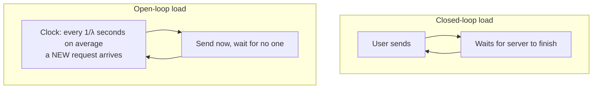

> **Learning objectives:** After this lesson, you will know why an average hides what users actually feel, be able to distinguish **closed-loop load** from **open-loop load** - and why the most common way of measuring reports latency many times better than reality - use Little's law to check your own measurement, and recognize when a serving system has become **unstable**.

Lessons 05 and 06 measured throughput and latency by submitting a whole block of requests at once. Real users do not arrive like that. They arrive scattered, sometimes sparse and sometimes dense, with no coordination between them.

This lesson measures the server from lesson 08 - Qwen2.5-7B-Instruct-AWQ, one RTX 3060 - with two ways of simulating users, and shows that the two tell two different stories about the same machine.

## 1. Averages lie

Lesson 01 already gave the formula: $\text{E2E} \approx \text{TTFT} + (N-1)\times\text{TPOT}$, where TTFT already includes queue waiting time. But a serving system does not have "one" E2E; it has **a distribution** of E2E, because each request meets a different queue.

Users do not feel the average. They remember **the worst time**. So the standard metric is the **percentile**:

| Percentile | Meaning |
|---|---|
| **p50** (median) | Half of the requests are faster than this |
| **p95** | 1 in 20 requests is slower than this |
| **p99** | 1 in 100 requests is slower than this |

A user who sends 20 questions a day has a probability of hitting at least one response slower than p95 of $1 - 0.95^{20} \approx$ **64%** - that is, on most days. How often the p99 level occurs depends on **the number of requests per second**, not on the number of users: at 100 requests per second, the slowest 1% is about **60 requests per minute**. The average appears in nobody's experience.

## 2. Two ways to simulate users

**Closed-loop load**: there are $C$ simulated users. Each sends a request, **waits until it is fully received**, then immediately sends the next one. This is the easiest to write, and it is what most benchmarking tools do by default.

**Open-loop load**: requests **arrive at a fixed rate** of $\lambda$ requests per second - here following a Poisson distribution, meaning random but averaging exactly $\lambda$ - **regardless** of whether the server is busy or idle. This is how real users arrive.

The difference lies in a single place: **when the server slows down, closed-loop load sends less on its own.** Each simulated user has to wait longer before sending the next request, so the pressure on the server drops by itself. Open-loop load does not - new users still arrive on schedule, and if the server cannot keep up, they **queue**.

In other words: closed-loop load is an experiment in which **the subject being measured controls how much load it receives**. Because the number of requests sent depends on the response speed itself, it **cannot create a queue that grows forever** the way requests arriving from outside can. There is still a queue inside the server - if $C$ is larger than the number of slots the engine runs at once, the excess waits - but it is bounded above by $C$.

## 3. Measuring: closed-loop and open-loop load

Each request has a short prompt and generates exactly 128 tokens. The client samples **the number of in-flight requests** every 0.1 seconds throughout the measurement.

**Closed-loop load,** each simulated user sends 6 requests:

| $C$ users | Achieved (req/s) | Throughput (tok/s) | TTFT p50 / p99 (s) | E2E p50 / p95 (s) |
|---|---|---|---|---|
| 1 | 0.52 | 66.6 | 0.035 / 0.037 | 1.93 / 1.94 |
| 4 | 1.96 | 251.4 | 0.062 / 0.083 | 2.04 / 2.06 |
| 16 | 6.67 | 853.7 | 0.124 / 0.255 | 2.37 / 2.50 |
| 32 | 9.17 | 1,174.1 | 0.166 / 0.348 | 3.48 / 3.59 |
| 64 | **10.10** | 1,292.6 | 0.227 / 0.945 | 6.31 / 6.76 |

**Open-loop load,** requests arrive for 60 seconds:

| Target $\lambda$ | Achieved (req/s) | TTFT p50 / p99 (s) | E2E p50 / p95 / p99 (s) | In flight: first half → second half | Drain after arrivals stop |
|---|---|---|---|---|---|
| 0.5 | 0.40 | 0.040 / 0.056 | 1.95 / 1.99 / 2.00 | 0.99 → 0.57 | 0.0 s |
| 1 | 0.94 | 0.046 / 0.104 | 1.98 / 2.05 / 2.10 | 1.78 → 1.96 | 0.3 s |
| 2 | 2.15 | 0.054 / 0.355 | 2.09 / 2.22 / 2.33 | 4.49 → 4.61 | 1.2 s |
| 4 | 3.64 | 0.060 / 0.124 | 2.23 / 2.38 / 2.49 | 7.32 → 8.93 | 1.8 s |
| 8 | 7.91 | 0.108 / 0.178 | 4.38 / 5.67 / 5.79 | **30.2 → 41.0** | 2.8 s |
| 12 | 8.89 | **0.442 / 4.052** | **21.26 / 27.03 / 27.37** | **94.2 → 234.7** | **15.6 s** |

## 4. Two stories about the same machine

**Closed-loop load tells a calm story.** Going from 1 to 64 users, throughput climbs to about **10 requests per second** and levels off. E2E rises gently, from 1.9 to 6.3 seconds. The worst TTFT p99 is under one second. Reading this table, you would say: *"the server handles about 9 requests per second with p95 under 4 seconds."*

**Open-loop load tells the real story.** At $\lambda = 12$, achieved throughput is **8.89** requests per second - almost equal to the 9.17 of closed-loop load with 32 users. But E2E p95 is **27.03 seconds**, not 3.59. TTFT p99 is **4.05 seconds**, not 0.35.

**Same machine, same throughput range, tail latency differing by nearly eight times.**

Because under closed-loop load, when the server slows down the simulated users slow down too - waiting longer, so sending less often - and the queue never exceeds $C$. Under open-loop load, new users keep arriving; the server can only serve about 9-10 requests per second, so with 12 requests arriving each second, 2-3 extra requests per second **sit waiting**. They pile up, and those who arrive later have to wait for everyone who arrived before them.

The practical consequence: **if you take latency measured with closed-loop load and use it to infer the arrival rate at which real users are served with the same latency, your estimate will be too optimistic.** Closed-loop load is still useful for finding saturation throughput; what it hides is latency when requests arrive at their own pace. The figure "handles 9 req/s with p95 of 3.6 seconds" is real - but only holds when users are polite enough to wait for each other. Real users are not that polite.

## 5. Little's law: checking your own measurement

There is a simple relationship between three quantities of any queuing system in a **steady state**:

$$L = \lambda W$$

$L$ is the average number of requests in the system, $\lambda$ is the rate at which requests pass through the system, and $W$ is the average time each request spends in the system. It does not depend on the arrival distribution, the scheduling policy, or any internal detail.

Its greatest practical value is **checking the measurement**. The client measures $L$ by counting in-flight requests every 0.1 seconds, while $\lambda W$ is computed from the number of completed requests and the mean E2E - two independent measurements:

| Measurement | Counted $L$ | $\lambda \times W$ | Difference |
|---|---|---|---|
| Closed-loop load, $C = 1$ | 0.99 | 1.00 | 1% |
| Closed-loop load, $C = 64$ | 63.38 | 63.40 | 0.03% |
| Open-loop load, $\lambda = 2$ | 4.55 | 4.50 | 1% |
| Open-loop load, $\lambda = 4$ | 8.13 | 8.14 | 0.1% |

They agree to within about 1% at every stable level. If these two numbers differ a lot on a stable system, **your measurement has a bug** - lost requests, miscounting, clock skew - before anything can be said about the server.

Note closed-loop load: $L$ is always almost exactly $C$. Of course - that is how closed-loop load is defined. Little's law still holds here, as the first two rows of the table show; but because $L$ is already **fixed** by the load design, its agreement with $\lambda W$ is a **less independent** check - it mainly verifies that the client measures time correctly, and says little about the server.

## 6. Recognizing when the system becomes unstable

Little's law has one condition: **the system is stable**, meaning arrivals and departures balance and the queue does not grow forever. When the arrival rate exceeds the service capacity, that condition breaks.

Look at the "in flight: first half → second half" column in the open-loop table:

- $\lambda = 1, 2, 4$: the number of in-flight requests in the second half is only 3-22% higher than in the first half.
- $\lambda = 12$: **94 → 235**. The number of in-flight requests grows **two and a half times** in 30 seconds. And when new arrivals stop, the server needs another **15.6 seconds** just to drain the backlog.

Reading this column requires subtracting a built-in bias: **every measurement starts from an empty system**, so the first few seconds have fewer in-flight requests than usual, and the first half is always pulled down. Add to that the fact that the number of arrivals in 30 seconds is random - at $\lambda = 4$, about 120 requests, fluctuating by around ±9% - and a 15-20% difference between the two halves is something a stable system still produces. So the 22% rise in the $\lambda = 4$ row is **not** a sign of drift. The **2.5 times** rise in the $\lambda = 12$ row, together with 15.6 seconds of draining, is.

At $\lambda = 12$, the counted $L$ is 164.6 and $\lambda W$ is 171.0 - the two numbers are still close, and it is very easy to read that as "Little's law holds, the system is fine". But that is **the average of a queue that is growing**. Run the measurement for 60 seconds and $W$ comes out around 20 seconds; run it for 10 minutes and $W$ will be much larger, because those who arrive later always meet a longer queue than those who came before. In an unstable system, **the measured latency depends on how long you measure** - meaning it is not a property of the system, but of the measurement.

The $\lambda = 8$ row deserves a closer look. The number of in-flight requests goes from **30.2 to 41.0** between the two halves - the queue is also growing, if slowly. E2E p50 has already doubled compared with $\lambda = 4$. Sixty seconds is **not enough** to say whether it will settle at some level or keep growing; what the table can say is that $\lambda = 8$ lies **near the edge**, and to know for sure you have to run longer. This is a region where a real system should not operate routinely: a small surge is enough to push it over the edge.

> 🔧 **Try it now:** a colleague reports "the server handles 10 req/s, measured with 64 concurrent users, p95 6.8 seconds" and proposes opening it to 10 req/s of real traffic. How do you push back?
> That figure was measured with closed-loop load, so it tells you the **maximum capacity** - about 10 req/s - but not the latency when real users arrive at that rate. Real users arrive as open-loop load. The table in section 3 shows that at 8 req/s the queue has already started to grow, and at 12 req/s p95 is 27 seconds. So the right proposal is: measure again with open-loop load at several $\lambda$ levels, find the highest level at which the number of in-flight requests **does not keep growing** and p95 stays within the acceptable limit, then operate below that level with a safety margin. For this machine, the answer is closer to 4 req/s than to 10.

## 7. Rules for measuring load

Boiled down to things you can do right away:

- **Report percentiles, not averages.** p50 gives the typical feel, p95 and p99 give the worst times users will remember.
- **Use open-loop load when asking about latency.** Closed-loop load is suited to finding maximum capacity; it is not suited to asking how long users will wait.
- **Count in-flight requests over time, after discarding the warm-up period.** If the count keeps growing, clearly beyond random fluctuation, the system is becoming unstable - and every latency number you just measured holds only for that exact measurement length. Running longer is the surest way to tell real drift from noise.
- **Use $L = \lambda W$ to check the measurement**, only at levels where the system is stable.
- **Operate far from the edge.** Where latency explodes, it does not rise gradually; it breaks. On this machine, the gap between 4 and 12 req/s is the difference between a p95 of 2.4 seconds and 27 seconds.

## Lesson summary

- Users remember the worst time, not the average. Report **p50, p95, p99**.
- **Closed-loop load** (C users, sending again once done) reduces pressure by itself when the server slows down, so it **cannot create a queue that grows forever** - the queue is bounded by $C$. It is suited to finding **saturation throughput**; what it hides is latency when requests arrive at a pace independent of the server. **Open-loop load** (requests arrive at a fixed rate) is what resembles real users.
- Same 7B AWQ server on an RTX 3060, at around **9 req/s**: closed-loop load reports E2E p95 of **3.59 s**, open-loop load gives **27.03 s**. TTFT p99: **0.35 s** versus **4.05 s**. Tail latency differs by nearly **eight times**.
- Using **latency** measured with closed-loop load to infer the arrival rate that can be served at the same latency gives a **too optimistic** picture; closed-loop load is still suited to finding saturation throughput.
- **Little's law** $L = \lambda W$ is used to check the measurement: at every stable level, the counted $L$ agrees with $\lambda W$ within about **1%**.
- Under closed-loop load, $L \approx C$ is fixed by the load design: Little's law still holds, but becomes a less independent check than under open-loop load.
- A system is **unstable** when the number of in-flight requests keeps growing **far beyond random fluctuation and warm-up bias**: at $\lambda = 12$, from **94 to 235** in 30 seconds, and it takes **15.6 s** to drain after arrivals stop. A 15-20% difference between the two halves of a 30-second window is something a stable system still produces. In that state the measured latency depends on how long you measure, and $L = \lambda W$ can no longer be read as a steady state.
- $\lambda = 8$ already shows signs of a growing queue (30 → 41) - near the edge; 60 seconds is not enough to conclude. Operate far from the edge, because latency does not rise gradually but **breaks**.

## Self-check questions

1. A system has a mean E2E of 2 seconds and a p99 of 20 seconds. Which level will a user sending 50 questions a day run into more often? Explain.
2. Why can closed-loop load never make the queue **grow forever**, no matter how slow the server gets? What bounds the queue inside the server under closed-loop load?
3. At around 9 req/s, closed-loop and open-loop load give E2E p95 values nearly 8 times apart. Explain using the mechanism of each simulation method.
4. Using Little's law: a stable system handles 5 req/s with an average of 3 seconds per request. On average, how many requests are in the system? If you counted 40, what should you suspect?
5. Why does Little's law still hold under closed-loop load - the table in section 5 gives 63.38 versus 63.40 - yet the fact that $L \approx C$ is fixed makes it a **less independent** check than under open-loop load?
6. At $\lambda = 12$, the counted $L$ and $\lambda W$ differ by only 4%. Why must that still not be read as "the system is fine"?
7. Name two signs in the data showing that a serving system is becoming unstable. Why is a 20% higher in-flight count in the second half than in the first **not yet** enough to conclude?
8. Design a measurement to find the highest load level at which your server operates stably with p95 under 3 seconds. Specify which type of load to use, how long to run, what to measure, and which criterion to stop at.

## Further reading

**Foundational sources for this lesson:**

| Source | What to read |
|---|---|
| **Lesson 01 of this chapter** | The five quantities, and why TTFT already includes queue waiting time |
| **Lessons 05 and 06 of this chapter** | Batching - the mechanism that raises throughput when there are many requests at once |
| **Lesson 08 of this chapter** | The server measured in this lesson |
| **Machine Learning chapter · Lesson 12** | Choosing an operating point by the cost of each kind of error |

**Going further:**

- [Little - A Proof for the Queuing Formula L = λW (Operations Research, 1961)](https://pubsonline.informs.org/doi/10.1287/opre.9.3.383) - the original proof, and the stability condition mentioned in section 6.
- [Schroeder, Wierman & Harchol-Balter - Open Versus Closed: A Cautionary Tale (NSDI 2006)](https://www.usenix.org/conference/nsdi-06/open-versus-closed-cautionary-tale) - the paper that measures exactly the phenomenon in section 4 across many kinds of systems.
- [Dean & Barroso - The Tail at Scale (CACM 2013)](https://research.google/pubs/the-tail-at-scale/) - why high percentiles dominate the experience in large systems.

**Source code for this lesson:** [`code/b07_tai.py`](../../code/ai-systems/b07_tai.py) - closed-loop and open-loop load generators, counting in-flight requests, computing percentiles and checking $L = \lambda W$.

> **Next lesson:** [Inference Servers and Streaming](../inference-servers-and-streaming/) - this lesson measured the server from the outside. The next lesson opens that server up - what it adds around the model, why it takes 90 seconds to become ready - and measures something intuition often gets wrong: whether streaming lowers TTFT.
