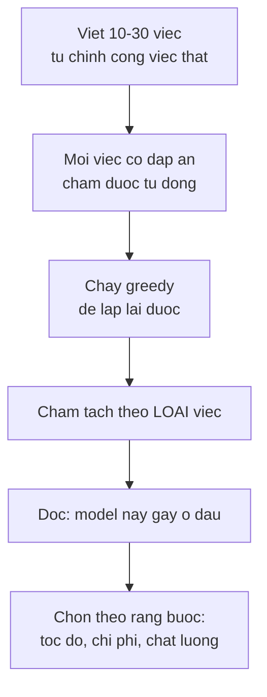

> **Mục tiêu bài học:** Sau bài này, bạn sẽ có một bức tranh cụ thể về chỗ một mô hình nhỏ gãy, biết vì sao **không thể** suy từ một hai mô hình ra quy luật về quy mô, và hiểu vì sao số tham số là biến dễ nhìn nhất nhưng không phải biến duy nhất quyết định năng lực.

## 1. Câu hỏi dễ hỏi sai

Năm bài đầu đều dùng Qwen2.5-0.5B và nó làm được kha khá: trả lời tiếng Việt trôi chảy, tuân theo prompt, sinh văn bản đúng chủ đề. Câu hỏi tự nhiên tiếp theo là *"vậy mô hình lớn hơn khác gì?"*

Câu hỏi ấy nghe hợp lý nhưng rất dễ trả lời sai, vì cách kiểm chứng hiển nhiên nhất - chạy một mô hình nhỏ, ghi lại chỗ nó sai, rồi bảo "những chỗ này sẽ biến mất khi mô hình lớn lên" - **không phải một phép suy luận hợp lệ**. Nó giả định kết luận.

Nên bài này tách rõ hai phần, và bạn nên đọc chúng như hai loại thông tin khác nhau:

- **Đo trên máy này** - hai mô hình cụ thể, một bộ việc nhỏ, số liệu thật
- **Cái không suy ra được** - và vì sao

Đây đúng là quy ước ba loại con số mà chương Computer Vision · Bài 01 dựng ra, áp vào một chỗ nó đặc biệt dễ bị vi phạm.

## 2. Một bộ việc nhỏ, hai mô hình

Mười việc, chia năm loại, mỗi việc có **đáp án chấm được tự động**. Dùng greedy để kết quả lặp lại được, đúng như bài 05 khuyến nghị.

| Loại | Ví dụ việc |
|---|---|
| Trích xuất | *"Hợp đồng ký ngày 09/09/2026 tại Hà Nội"* → trích ngày |
| Kiến thức | *"Thủ đô của Nhật Bản là gì?"* |
| Số học | *"Một cái áo giá 250.000, giảm 20%. Giá còn lại?"* |
| Làm theo lệnh | *"Trả lời bằng đúng một chữ CÓ hoặc KHÔNG"* |
| Ngữ cảnh dài | Danh sách 40 dòng mã-giá, hỏi giá của một mã ở giữa |

Kết quả:

| | Qwen2.5-**0,5B** | Qwen2.5-**1,5B** |
|---|---|---|
| Tham số | 494.032.768 | 1.543.714.304 |
| Thời gian chạy cả bộ | 21 s | 38 s |
| **Tổng điểm** | **7/10** | **8/10** |
| Trích xuất | **2/2** | 1/2 |
| Kiến thức | 1/2 | 1/2 |
| Số học | 2/3 | **3/3** |
| Làm theo lệnh | 2/2 | 2/2 |
| Ngữ cảnh dài | **0/1** | **1/1** |

## 3. Đọc bảng này cho đúng

Tổng điểm đi từ 7 lên 8. Nếu dừng ở đó thì kết luận sẽ là "lớn hơn thì tốt hơn một chút" - và đó là cách đọc nghèo nàn nhất có thể.

**Cải thiện không đều, và có chỗ đi lùi.** Mô hình lớn hơn khá hơn rõ ở **số học** (2/3 → 3/3) và **ngữ cảnh dài** (0/1 → 1/1). Nhưng nó **kém hơn ở trích xuất**: hỏi trích ngày từ *"Hợp đồng ký ngày 09/09/2026"*, bản 0,5B trả lời `09/09/2026` còn bản 1,5B trả lời `09`. Cùng một câu hỏi, mô hình lớn hơn cho câu trả lời tệ hơn.

Đó không phải nghịch lý, nhưng phải phát biểu cho đúng. Thước đo ở đây là **đúng/sai**, nên với những việc mà mô hình nhỏ **đã được 1 điểm**, bảng không còn chỗ để hiện ra bất kỳ cải thiện nào - mô hình lớn vẫn có thể bền hơn khi đổi cách hỏi, giữ định dạng tốt hơn, hoặc đúng trên những việc tương tự khác, mà bảng này không thấy. Còn chỗ mô hình lớn **tụt điểm** thì có thể do hành vi khác đi, cũng có thể chỉ là biến thiên của một bộ mười việc; bài này không đủ dữ liệu để nói nguyên nhân.

**Ngữ cảnh dài là chỗ chênh lệch có ý nghĩa nhất.** Việc ấy đưa một danh sách 40 dòng rồi hỏi giá trị ở dòng giữa. Bản 0,5B trượt, bản 1,5B trúng. Kết quả này **phù hợp với giả thuyết** rằng mô hình lớn hơn xử lý ngữ cảnh dạng này tốt hơn. Nhưng đúng một việc thì chưa nói được gì về quy luật quy mô - nó chỉ gợi ý một hướng đáng kiểm bằng một bộ việc lớn hơn hẳn.

**Cả hai cùng sai một câu kiến thức.** Hỏi *"Nước nào có diện tích lớn nhất thế giới?"*: bản 0,5B trả lời vòng vo không ra đáp án, bản 1,5B trả lời dứt khoát **"Mỹ"** - sai, đáp án là Nga. Đáng chú ý là mô hình lớn hơn sai **tự tin hơn**. Bài 09 sẽ đào sâu đúng hiện tượng này.

## 4. Những gì bảng trên không nói được

Đây là phần quan trọng nhất của bài.

**Mười việc là quá ít.** Chênh lệch một điểm giữa 7/10 và 8/10 hoàn toàn có thể đảo chiều nếu đổi mười việc khác. Bộ này dùng để **nhìn thấy các kiểu thất bại**, không phải để xếp hạng.

**Hai điểm không vẽ được đường cong.** Từ 0,5B và 1,5B, ta không biết đường đi tiếp thế nào: tuyến tính, bão hòa, hay có bước nhảy. Muốn nói về quy luật quy mô thì cần nhiều mức, nhiều bộ đánh giá, và cùng công thức huấn luyện.

**Số tham số không phải biến duy nhất.** Đây là điểm dễ quên nhất. Hai mô hình khác nhau về năng lực có thể khác nhau ở:

- **Lượng dữ liệu huấn luyện** và chất lượng của nó
- **Tổng lượng tính toán** bỏ ra để huấn luyện
- **Kiến trúc** và các chi tiết ở bài 04
- **Gói post-training** - thứ bài 07 đo, và nó đổi hành vi rất mạnh
- **Cách chia token** - bài 02 đã cho thấy nó ảnh hưởng tới cả cửa sổ ngữ cảnh thực tế

Chương Computer Vision · Bài 10 gặp đúng bài học này ở dạng sắc nét: cùng một ResNet-50, cùng số tham số, chỉ đổi gói trọng số mà chất lượng đặc trưng chuyển giao dịch **17,8 điểm** - mà bài ấy cũng nói rõ là không quy được nguyên nhân cho riêng yếu tố nào. Số tham số thì không đổi một chút nào.

Nên phát biểu đúng từ bảng mục 2 là:

> Trong hai mô hình cụ thể này, trên mười việc cụ thể này, mô hình lớn hơn khá hơn ở số học và ngữ cảnh dài, kém hơn ở một việc trích xuất, và cả hai cùng sai một câu kiến thức. **Số tham số không tự nó quyết định năng lực.**

> ⚠️ **Lưu ý nhỏ:** cái mà cộng đồng thực sự biết về quy mô đến từ những nghiên cứu đo **hàng chục mô hình ở nhiều mức, cùng công thức huấn luyện, trên hàng chục bộ đánh giá** - không phải từ những bảng như mục 2. Hai kết quả hay được nhắc, và chúng trả lời hai câu hỏi khác nhau: **Kaplan và cộng sự (2020)** chỉ ra loss giảm theo quan hệ lũy thừa với số tham số, lượng dữ liệu và lượng tính toán; **Hoffmann và cộng sự (2022, Chinchilla)** hỏi câu khác - *với một ngân sách tính toán cho trước thì nên chia bao nhiêu cho tham số và bao nhiêu cho số token* - và kết luận các mô hình thời đó được huấn luyện trên quá ít token so với kích thước của chúng. Cả hai đều nói về **loss**, mà loss thấp hơn không tự động dịch thành khá hơn ở một nhiệm vụ cụ thể. Các nghiên cứu ấy có trong phần Đọc thêm. Bảng mục 2 tồn tại để bạn **thấy hình dạng của các kiểu thất bại**, và để bạn tự chạy được phép đo tương tự trên bài toán của mình.

## 5. Dùng bộ việc nhỏ vào việc gì thì hợp

Bảng mục 2 không xếp hạng được mô hình. Nhưng một bộ mười việc tự viết lại rất có ích cho một việc khác: **chọn mô hình cho bài toán của bạn**.

Hai chi tiết làm nên giá trị của cách này:

**Tách điểm theo loại việc.** Tổng điểm 7/10 gần như vô dụng; bảng theo loại mới nói được "mô hình này trích xuất tốt nhưng ngữ cảnh dài thì hỏng". Đây là cùng bài học của chương Machine Learning · Bài 12 khi tách chỉ số theo nhóm, và chương Computer Vision · Bài 12 khi tách accuracy theo lớp.

**Việc phải lấy từ công việc thật.** Mười việc trong bài này là ví dụ minh họa. Nếu bạn xây hệ đọc hóa đơn thì bộ việc của bạn phải là hóa đơn thật, với đáp án thật.

Và chi phí thì rất rẻ: cả bộ chạy hết **21 giây** với mô hình 0,5B, **38 giây** với 1,5B. So với việc chọn nhầm mô hình rồi phát hiện sau ba tháng thì đây là phép đo đáng làm trước tiên.

> 🔧 **Thử ngay:** đồng nghiệp đề xuất đổi từ mô hình 7B sang 70B vì "lớn hơn thì thông minh hơn". Bạn phản biện thế nào?
> Hỏi ba câu trước khi đồng ý. **Một:** bộ việc của chúng ta gãy ở đâu - nếu mô hình 7B đang trượt ở *làm theo định dạng* chứ không phải ở *suy luận*, thì mô hình lớn hơn có thể không chữa được gì, mà một prompt tốt hơn ở bài 08 thì có. **Hai:** hai mô hình ấy có cùng gói post-training không - bảng ở bài 07 cho thấy chuyện ấy đổi hành vi mạnh tới mức nào, và một mô hình 7B được tinh chỉnh tốt hoàn toàn có thể hơn một mô hình 70B thô. **Ba:** chi phí và độ trễ tăng bao nhiêu, và bài toán có chịu được không. Cách quyết định đúng là chạy chính bộ việc của mình trên cả hai rồi tách điểm theo loại - mất vài chục phút, và nó thay thế toàn bộ cuộc tranh luận.

## Tóm tắt bài học

- Quan sát một mô hình nhỏ gãy ở đâu **không chứng minh** những chỗ ấy sẽ biến mất khi mô hình lớn lên - đó là giả định kết luận.
- Trên bộ mười việc: Qwen2.5-0,5B được **7/10**, Qwen2.5-1,5B được **8/10**.
- Cải thiện **không đều**: mô hình lớn khá hơn ở **số học** (2/3 → 3/3) và **ngữ cảnh dài** (0/1 → 1/1), nhưng **kém hơn ở trích xuất** - trả lời `09` thay vì `09/09/2026`.
- Cả hai cùng sai câu *"nước nào diện tích lớn nhất"*, và mô hình lớn hơn sai **dứt khoát hơn**: nó trả lời "Mỹ".
- Mười việc quá ít để xếp hạng; hai điểm không vẽ được đường cong; và **số tham số không phải biến duy nhất** - dữ liệu, lượng tính toán, kiến trúc, post-training và tokenizer đều ảnh hưởng.
- Chương Computer Vision · Bài 10 gặp đúng hiện tượng ấy ở dạng sắc nét: cùng ResNet-50, cùng số tham số, chỉ đổi gói trọng số mà chất lượng đặc trưng chuyển giao dịch **17,8 điểm**.
- Bộ việc nhỏ tự viết **không xếp hạng mô hình được**, nhưng rất hợp để **chọn mô hình cho bài toán của bạn** - miễn là tách điểm theo loại việc và lấy việc từ công việc thật.
- Cả bộ chạy hết 21-38 giây; đây là phép đo nên làm trước khi tranh luận chọn mô hình.

## Câu hỏi tự kiểm tra

1. Vì sao "chạy mô hình 0,5B, ghi lại chỗ nó sai, kết luận mô hình lớn sẽ sửa được" là một phép suy luận không hợp lệ?
2. Mô hình 1,5B kém hơn ở trích xuất nhưng khá hơn ở ngữ cảnh dài. Nêu hai cách giải thích khác nhau cho hiện tượng ấy.
3. Vì sao tổng điểm 7/10 gần như vô dụng còn bảng tách theo loại thì có ích? Liên hệ với chương Machine Learning · Bài 12.
4. Kể ba biến ngoài số tham số có thể làm hai mô hình khác nhau về năng lực.
5. Cả hai mô hình cùng sai câu diện tích, nhưng mô hình lớn sai dứt khoát hơn. Vì sao điều đó đáng lo hơn là đáng mừng?
6. Muốn nói được điều gì đó về **quy luật** quy mô thì cần thiết kế thí nghiệm thế nào? Nêu ba điều kiện.
7. Bạn xây hệ đọc hồ sơ bảo hiểm. Mô tả cách dựng bộ việc đánh giá của riêng bạn, và cách chấm.
8. Khi nào một mô hình nhỏ đã tinh chỉnh tốt có thể hơn một mô hình lớn hơn nhiều?

## Đọc thêm

**Nguồn nền tảng của bài:**

| Nguồn | Đọc phần nào |
|---|---|
| **Chương Computer Vision · Bài 01** | Quy ước ba loại con số: đo trên máy này, số công bố, ví dụ minh họa |
| **Chương Computer Vision · Bài 10** | Cùng kiến trúc, cùng tham số, đổi gói trọng số mà kết quả dịch 17,8 điểm |
| **Chương Machine Learning · Bài 12** | Tách chỉ số theo nhóm thay vì nhìn con số tổng |
| **Bài 07 của chương này** | Post-training - biến ảnh hưởng mạnh mà không đụng gì tới số tham số |

**Nguồn online bổ sung (miễn phí):**

- [Kaplan và cộng sự - Scaling Laws for Neural Language Models (2020)](https://arxiv.org/abs/2001.08361) - đo trên nhiều mức quy mô, chỉ ra loss giảm trơn theo lũy thừa.
- [Hoffmann và cộng sự - Training Compute-Optimal Large Language Models (Chinchilla, 2022)](https://arxiv.org/abs/2203.15556) - cho thấy **lượng token huấn luyện quan trọng không kém số tham số**, sửa lại nhiều kết luận trước đó.
- [Wei và cộng sự - Emergent Abilities of Large Language Models (TMLR 2022)](https://arxiv.org/abs/2206.07682) - bàn về những năng lực xuất hiện đột ngột theo quy mô.
- [Schaeffer, Miranda, Koyejo - Are Emergent Abilities a Mirage? (NeurIPS 2023)](https://arxiv.org/abs/2304.15004) - bài phản biện: nhiều "bước nhảy" là hệ quả của cách chọn thước đo. Đọc cùng bài trên.
- [Qwen2.5 - model card](https://huggingface.co/Qwen/Qwen2.5-0.5B-Instruct) - họ mô hình dùng trong bài, có từ 0,5B tới 72B với cùng công thức.

> **Bài tiếp theo:** [Từ mô hình gốc tới trợ lý](../from-base-model-to-assistant-vi/) - bài này đo hai mô hình khác nhau về **quy mô**. Bài sau đo hai mô hình **giống hệt nhau về quy mô và kiến trúc**, chỉ khác ở những gì xảy ra sau khi huấn luyện xong - và khác biệt hành vi lớn tới mức gây bất ngờ.
