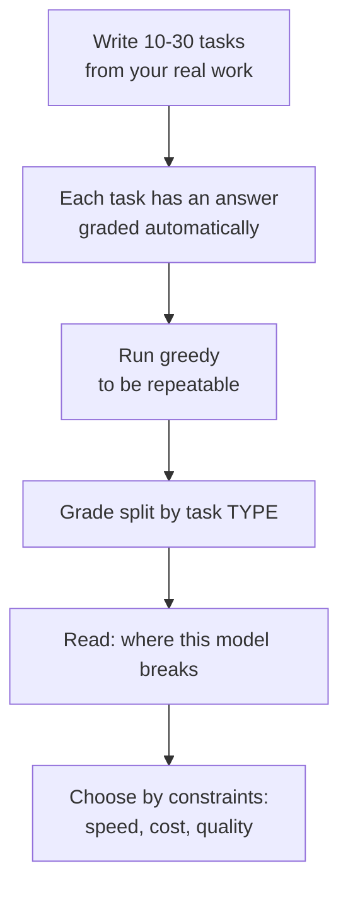

> **Learning objectives:** After this lesson, you will have a concrete picture of where a small model breaks, know why you **cannot** infer scaling laws from one or two models, and understand why parameter count is the most visible variable but not the only one that decides capability.

## 1. A question that is easy to ask wrongly

The first five lessons all used Qwen2.5-0.5B, and it did reasonably well: it answered fluently in Vietnamese, followed the prompt, and generated on-topic text. The natural next question is *"so what is different about a bigger model?"*

That question sounds reasonable but is very easy to answer wrongly, because the most obvious way to check it - run a small model, note where it fails, then say "these failures will disappear as the model gets bigger" - **is not a valid inference**. It assumes the conclusion.

So this lesson separates two parts clearly, and you should read them as two different kinds of information:

- **Measured on this machine** - two specific models, a small set of tasks, real numbers
- **What cannot be inferred** - and why

This is exactly the three-kinds-of-numbers convention set up in Computer Vision · Lesson 01, applied to a place where it is especially easy to break.

## 2. A small set of tasks, two models

Ten tasks, split into five types, each with an **automatically gradable answer**. Greedy decoding is used so the results are repeatable, exactly as Lesson 05 recommends.

| Type | Example task |
|---|---|
| Extraction | *"Hợp đồng ký ngày 09/09/2026 tại Hà Nội"* ("Contract signed on 09/09/2026 in Hà Nội") → extract the date |
| Knowledge | *"Thủ đô của Nhật Bản là gì?"* ("What is the capital of Japan?") |
| Arithmetic | *"Một cái áo giá 250.000, giảm 20%. Giá còn lại?"* ("A shirt costs 250,000, 20% off. What is the price now?") |
| Instruction following | *"Trả lời bằng đúng một chữ CÓ hoặc KHÔNG"* ("Answer with exactly one word, YES or NO") |
| Long context | A 40-line list of code-price pairs, asking for the price of a code in the middle |

Results:

| | Qwen2.5-**0.5B** | Qwen2.5-**1.5B** |
|---|---|---|
| Parameters | 494,032,768 | 1,543,714,304 |
| Time to run the whole set | 21 s | 38 s |
| **Total score** | **7/10** | **8/10** |
| Extraction | **2/2** | 1/2 |
| Knowledge | 1/2 | 1/2 |
| Arithmetic | 2/3 | **3/3** |
| Instruction following | 2/2 | 2/2 |
| Long context | **0/1** | **1/1** |

## 3. Reading this table correctly

The total score goes from 7 to 8. If you stop there, the conclusion would be "bigger is a bit better" - and that is the poorest possible reading.

**The improvement is uneven, and in one place it goes backward.** The larger model is clearly better at **arithmetic** (2/3 → 3/3) and **long context** (0/1 → 1/1). But it is **worse at extraction**: asked to extract the date from *"Hợp đồng ký ngày 09/09/2026"* ("Contract signed on 09/09/2026"), the 0.5B version answers `09/09/2026` while the 1.5B version answers `09`. Same question, and the bigger model gives a worse answer.

That is not a paradox, but it has to be stated correctly. The measure here is **right/wrong**, so for tasks where the small model **already scored 1 point**, the table has no room to show any improvement - the larger model may still be more robust to rephrasing, keep the format better, or be right on other similar tasks, none of which this table can see. As for where the larger model **lost points**, that could be due to different behavior, or it could just be the variance of a ten-task set; this lesson does not have enough data to say what the cause is.

**Long context is the most meaningful difference.** That task gives a 40-line list and asks for the value on a line in the middle. The 0.5B version misses, the 1.5B version gets it. This result is **consistent with the hypothesis** that a larger model handles this kind of context better. But a single task says nothing about scaling laws - it only suggests a direction worth checking with a much larger set of tasks.

**Both got the same knowledge question wrong.** Asked *"Nước nào có diện tích lớn nhất thế giới?"* ("Which country has the largest area in the world?"): the 0.5B version rambles without reaching an answer, the 1.5B version answers firmly **"Mỹ"** (the United States) - wrong, the answer is Russia. Notably, the larger model is wrong **more confidently**. Lesson 09 goes deep into exactly this phenomenon.

## 4. What the table above cannot tell you

This is the most important part of the lesson.

**Ten tasks are far too few.** A one-point difference between 7/10 and 8/10 could easily reverse with ten different tasks. This set is for **seeing the kinds of failure**, not for ranking.

**Two points cannot draw a curve.** From 0.5B and 1.5B, we do not know how the line continues: linear, saturating, or with a jump. To say anything about scaling laws you need many sizes, many benchmarks, and the same training recipe.

**Parameter count is not the only variable.** This is the point most easily forgotten. Two models that differ in capability can differ in:

- **The amount of training data** and its quality
- **The total compute** spent on training
- **Architecture** and the details from Lesson 04
- **The post-training package** - what Lesson 07 measures, and it changes behavior very strongly
- **Tokenization** - Lesson 02 showed it affects even the effective context window

Computer Vision · Lesson 10 ran into exactly this lesson in a sharp form: the same ResNet-50, the same parameter count, only the weight package changed, and transfer feature quality shifted by **17.8 points** - while that lesson also makes clear that the cause cannot be attributed to any single factor. The parameter count did not change at all.

So the correct statement from the table in section 2 is:

> For these two specific models, on these ten specific tasks, the larger model is better at arithmetic and long context, worse at one extraction task, and both got the same knowledge question wrong. **Parameter count does not by itself decide capability.**

> ⚠️ **A small note:** what the community actually knows about scale comes from studies that measure **dozens of models at many sizes, with the same training recipe, on dozens of benchmarks** - not from tables like the one in section 2. Two results are often cited, and they answer two different questions: **Kaplan et al. (2020)** showed that loss decreases as a power law in parameter count, data size and compute; **Hoffmann et al. (2022, Chinchilla)** asked a different question - *for a given compute budget, how much should go to parameters and how much to tokens* - and concluded that the models of the time were trained on too few tokens for their size. Both are about **loss**, and lower loss does not automatically translate into being better at a specific task. Those studies are listed in Further reading. The table in section 2 exists so you can **see the shape of the kinds of failure**, and so you can run a similar measurement on your own problem.

## 5. What a small task set is actually good for

The table in section 2 cannot rank models. But a self-written set of ten tasks is very useful for something else: **choosing a model for your problem**.

Two details give this approach its value:

**Split the score by task type.** A total score of 7/10 is nearly useless; only the per-type table can say "this model extracts well but fails on long context". This is the same lesson as Machine Learning · Lesson 12 splitting metrics by group, and Computer Vision · Lesson 12 splitting accuracy by class.

**The tasks must come from real work.** The ten tasks in this lesson are illustrative examples. If you are building an invoice-reading system, your task set must be real invoices, with real answers.

And the cost is very low: the whole set takes **21 seconds** with the 0.5B model and **38 seconds** with 1.5B. Compared with choosing the wrong model and finding out three months later, this is the measurement worth doing first.

> 🔧 **Try it now:** a colleague proposes switching from a 7B model to a 70B model because "bigger is smarter". How do you push back?
> Ask three questions before agreeing. **One:** where does our task set break - if the 7B model is failing at *following the format* rather than at *reasoning*, a bigger model may fix nothing, while a better prompt from Lesson 08 might. **Two:** do the two models have the same post-training package - the table in Lesson 07 shows how strongly that changes behavior, and a well-tuned 7B model can easily beat a raw 70B model. **Three:** how much do cost and latency increase, and can the problem tolerate it. The right way to decide is to run your own task set on both and split the score by type - it takes a few tens of minutes, and it replaces the whole debate.

## Lesson summary

- Observing where a small model breaks **does not prove** those failures will disappear as the model grows - that assumes the conclusion.
- On the ten-task set: Qwen2.5-0.5B scores **7/10**, Qwen2.5-1.5B scores **8/10**.
- The improvement is **uneven**: the larger model is better at **arithmetic** (2/3 → 3/3) and **long context** (0/1 → 1/1), but **worse at extraction** - answering `09` instead of `09/09/2026`.
- Both got the question *"nước nào diện tích lớn nhất"* ("which country has the largest area") wrong, and the larger model was wrong **more firmly**: it answered "Mỹ" (the United States).
- Ten tasks are too few to rank; two points cannot draw a curve; and **parameter count is not the only variable** - data, compute, architecture, post-training and the tokenizer all have an effect.
- Computer Vision · Lesson 10 ran into the same phenomenon in a sharp form: the same ResNet-50, the same parameter count, only the weight package changed, and transfer feature quality shifted by **17.8 points**.
- A small self-written task set **cannot rank models**, but it is very well suited to **choosing a model for your problem** - as long as you split the score by task type and take the tasks from real work.
- The whole set runs in 21-38 seconds; this is the measurement to do before debating which model to choose.

## Self-check questions

1. Why is "run the 0.5B model, note where it fails, conclude a larger model will fix it" an invalid inference?
2. The 1.5B model is worse at extraction but better at long context. Give two different explanations for this.
3. Why is a total score of 7/10 nearly useless while the per-type table is useful? Relate this to Machine Learning · Lesson 12.
4. Name three variables other than parameter count that can make two models differ in capability.
5. Both models got the area question wrong, but the larger model was wrong more firmly. Why is that more worrying than reassuring?
6. To say something about scaling **laws**, how would you need to design the experiment? Give three conditions.
7. You are building a system that reads insurance files. Describe how you would build your own evaluation task set, and how you would grade it.
8. When can a small, well-tuned model beat a much larger model?

## Further reading

**Foundational sources for this lesson:**

| Source | Which part to read |
|---|---|
| **Computer Vision · Lesson 01** | The three-kinds-of-numbers convention: measured on this machine, published figures, illustrative examples |
| **Computer Vision · Lesson 10** | Same architecture, same parameters, a different weight package shifts results by 17.8 points |
| **Machine Learning · Lesson 12** | Splitting metrics by group instead of looking at the overall number |
| **Lesson 07 of this chapter** | Post-training - a variable with strong influence that does not touch parameter count at all |

**Additional online sources (free):**

- [Kaplan et al. - Scaling Laws for Neural Language Models (2020)](https://arxiv.org/abs/2001.08361) - measured across many scales, showing loss decreases smoothly as a power law.
- [Hoffmann et al. - Training Compute-Optimal Large Language Models (Chinchilla, 2022)](https://arxiv.org/abs/2203.15556) - shows that **the number of training tokens matters as much as parameter count**, revising many earlier conclusions.
- [Wei et al. - Emergent Abilities of Large Language Models (TMLR 2022)](https://arxiv.org/abs/2206.07682) - discusses abilities that appear abruptly with scale.
- [Schaeffer, Miranda, Koyejo - Are Emergent Abilities a Mirage? (NeurIPS 2023)](https://arxiv.org/abs/2304.15004) - the rebuttal: many "jumps" are a consequence of the choice of metric. Read it together with the paper above.
- [Qwen2.5 - model card](https://huggingface.co/Qwen/Qwen2.5-0.5B-Instruct) - the model family used in this lesson, from 0.5B to 72B with the same recipe.

> **Next lesson:** [From Base Model to Assistant](../from-base-model-to-assistant/) - this lesson measured two models that differ in **scale**. The next lesson measures two models that are **identical in scale and architecture**, differing only in what happened after training finished - and the difference in behavior is surprisingly large.
