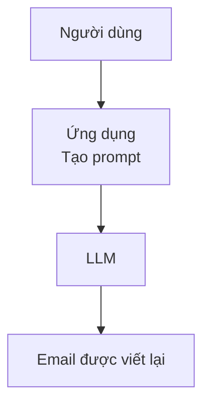
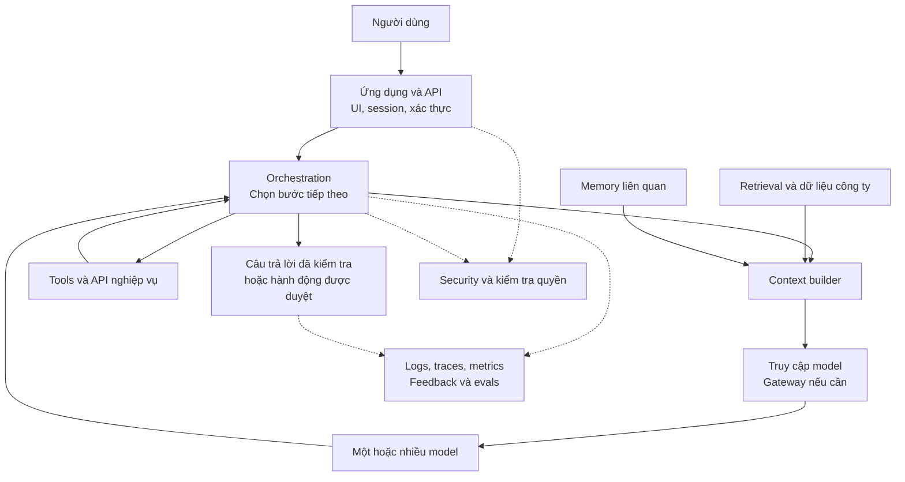
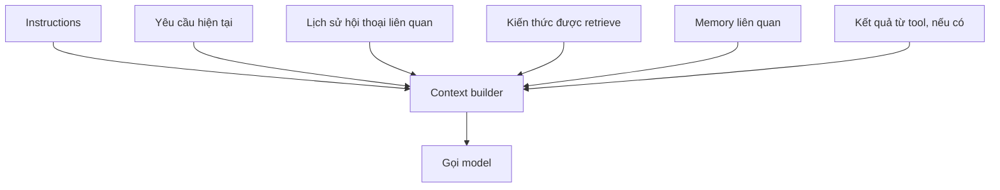
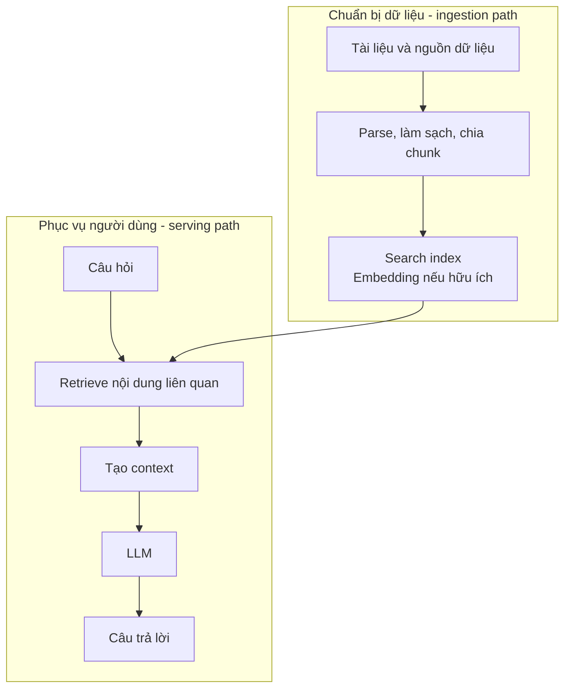
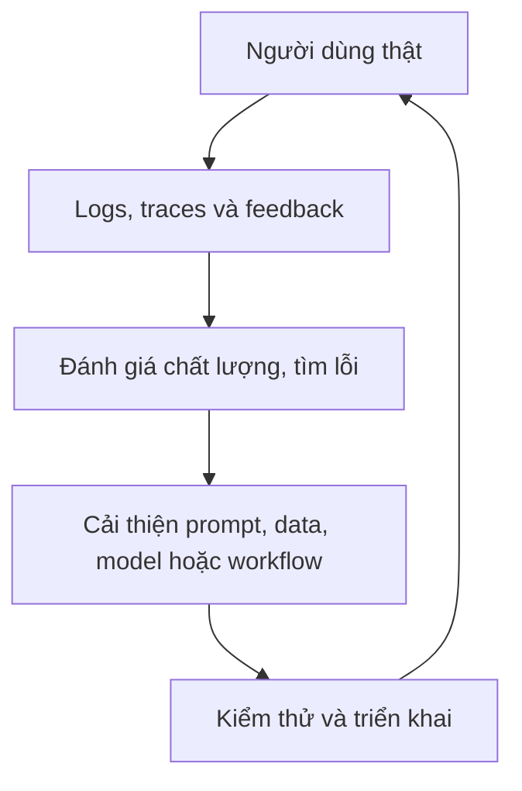

Ở [bài trước](../ai-demo-vs-production-vi/), chúng ta đã thấy model mạnh không tự động tạo ra một AI product tốt. Một ứng dụng production còn phải xử lý dữ liệu, context, latency, cost, security, tools và monitoring.

Nhưng nếu model chỉ là một phần của sản phẩm, phần còn lại thực sự gồm những gì?

Architecture diagram đôi khi trông như một mê cung: gateway, router, RAG, vector database, memory, Agent, guardrails, evals. Phần lớn những thành phần đó xuất hiện vì ai đó đã gặp một giới hạn cụ thể. Cách dễ hiểu nhất không phải học thuộc một sơ đồ thật lớn, mà bắt đầu từ hệ thống nhỏ nhất rồi hỏi:

> **Hệ thống này đang thiếu khả năng gì?**

## 1. Hệ thống GenAI nhỏ nhất vẫn có thể hữu ích

Hãy tưởng tượng một ứng dụng viết lại email. Nó có thể chỉ cần bốn bước:

Người dùng gửi văn bản, ứng dụng tạo request, model sinh câu trả lời và ứng dụng hiển thị kết quả. Với nhiều use case, như vậy là đủ. Không cần vector database, Agent, Kafka hay framework multi-agent.

[Anthropic khuyến nghị](https://www.anthropic.com/engineering/building-effective-agents) bắt đầu bằng những pattern đơn giản, có thể kết hợp với nhau, rồi chỉ tăng độ phức tạp khi nó giúp đạt kết quả tốt hơn. Architecture tốt không phải architecture có nhiều box nhất. Nó là architecture có đủ box để đáp ứng yêu cầu.

Giờ hãy đổi bài toán. Ta muốn một trợ lý nội bộ có thể trả lời "Chính sách nghỉ phép hiện tại là gì?", tra cứu đơn hàng 123, tóm tắt doanh thu tháng này và tạo ticket khi cần.

Một model đơn lẻ không biết nhân viên nào đang hỏi, dữ liệu công ty mới nhất nằm ở đâu, phải gọi order API nào hay nhân viên đó có quyền tạo ticket không. Hệ thống bắt đầu lớn lên xung quanh model.

## 2. Bản đồ các thành phần

Một architecture *có thể* trông như sau:

Các mũi tên minh họa những tương tác có thể xảy ra, **không phải chuỗi bắt buộc cho mọi request**. Ứng dụng viết lại email có thể chỉ dùng application và model. Trợ lý nội bộ có thể cần nhiều phần hơn trên bản đồ này.

Cũng cần phân biệt hai thứ hay bị vẽ chung: **application API** nhận request của người dùng, còn **AI gateway** nếu có thì tập trung việc truy cập các model provider. Chúng làm những việc khác nhau.

## 3. Application layer: nơi AI gặp người dùng

Lớp trên cùng vẫn là phần mềm bình thường: web app, mobile app, extension trong IDE, giao diện hỗ trợ khách hàng, API hoặc background job. Nó xử lý login, session, upload, giới hạn request, streaming và cách hiển thị kết quả.

Model không nên "đoán" tài khoản nào đang đăng nhập. Authentication là việc của ứng dụng. Authorization là việc của ứng dụng và những dịch vụ nắm giữ dữ liệu hoặc hành động.

> **GenAI application vẫn là một software application.** Nó thêm vào một thành phần có hành vi xác suất, chứ không xóa đi trách nhiệm engineering vốn có.

## 4. Model layer: "bộ não" có thể là một hoặc nhiều model

Ở trung tâm thường là một hoặc nhiều foundation model. Ứng dụng đơn giản có thể đưa mọi request vào một model. Ứng dụng lớn hơn có thể dùng model nhỏ để phân loại, model mạnh để reasoning, embedding model cho tìm kiếm và một classifier khác để moderation.

Đây là trade-off đã bàn trong bài [Một siêu AI hay một đội AI chuyên biệt?](../one-super-ai-or-team-of-specialists-vi/): capability, latency và cost không giống nhau giữa các task. Nhưng router là tùy chọn. Nếu một model đã đáp ứng chất lượng và chi phí cho một workload, thêm semantic router cùng bảy nhánh fallback có thể chỉ khiến hệ thống khó vận hành hơn.

Hãy xây một quality baseline trước, rồi thử đường xử lý rẻ hoặc nhanh hơn trên eval của chính mình. Đừng mặc định model lớn nhất hay sơ đồ nhiều box nhất là tốt nhất.

## 5. Context layer: model cần nhìn thấy gì *trong lần này*?

LLM không tự động biết mọi điều ứng dụng biết. Trước mỗi model call, ứng dụng quyết định thông tin nào cần có trong context:

Những đầu vào này không giống nhau. Instructions hướng dẫn cách model hành xử; retrieval mang thông tin từ bên ngoài vào; memory giữ lại điều hữu ích từ tương tác trước; kết quả tool cho biết hệ thống khác đã tìm thấy hoặc thực hiện điều gì. Tool cũng có thể *thay đổi* hệ thống bên ngoài, chứ không chỉ cung cấp context.

Câu hỏi thiết kế không phải "Nhét được bao nhiêu thứ vào context window?" mà là "Request này cần gì, và người dùng có quyền xem những gì?"

## 6. Retrieval và RAG: kiến thức nằm ngoài model

Giả sử nhân viên hỏi quy định làm việc từ xa mới nhất. Model có thể chưa từng thấy tài liệu đó, hoặc quy định đã thay đổi sau khi model được train. Retrieval-Augmented Generation (RAG) tìm thông tin từ nguồn bên ngoài, chọn nội dung liên quan rồi đưa vào context trước khi model trả lời.

**Vector database không phải định nghĩa của RAG.** Retrieval có thể dùng keyword search, SQL, document store, API, vector search hoặc kết hợp nhiều cách. Điều quan trọng là ứng dụng lấy đúng thông tin, còn mới và người dùng có quyền xem.

Một hệ thống RAG thực tế thường có **hai đường đi**, không phải một:

[Kiến trúc RAG tham khảo của Google Cloud](https://docs.cloud.google.com/architecture/rag-genai-gemini-enterprise-vertexai?hl=en) cũng tách data ingestion và serving. Đường chuẩn bị dữ liệu tạo kho kiến thức; đường online trả lời câu hỏi của người dùng. Khi một sơ đồ architecture trông quá rối, hãy thử hỏi từng component nằm trên đường nào.

## 7. Memory: điều gì cần tồn tại lâu hơn một request?

Retrieval hỏi: "Bây giờ tôi cần kiến thức bên ngoài nào?" Memory hỏi: "Từ các tương tác trước, điều gì đáng giữ lại?"

Nếu người dùng nói "Tôi thích báo cáo ngắn, tập trung vào điểm bất thường", một request sau này có thể hưởng lợi từ preference đó. Nhưng memory không đơn giản là "lưu mọi message vào vector database". Hệ thống phải quyết định điều gì đáng nhớ, khi nào hết hạn, điều gì không được lưu và memory thuộc về ai.

Có ứng dụng chỉ cần conversation state ngắn hạn. Agent phức tạp hơn có thể cần memory lâu dài, được giới hạn theo quyền. [AWS mô tả](https://docs.aws.amazon.com/prescriptive-guidance/latest/gen-ai-lifecycle-operational-excellence/preprod-architecting.html) memory như một service có thể tách riêng trong hệ thống lớn, không phải yêu cầu cho mọi chatbot.

## 8. Tools: từ "biết" sang "làm"

Khi người dùng hỏi "Đơn hàng 123 đang ở đâu?", model nên kiểm tra hệ thống đơn hàng thật thay vì bịa trạng thái từ training data. Một tool chỉ đọc có thể trả về "Đang giao"; ứng dụng chuyển thông tin đó cho model để diễn đạt thành câu trả lời.

"Tạo ticket cho đơn này" thì khác. Tool đó thay đổi một hệ thống bên ngoài. Tool có thể lấy dữ liệu, thực hiện hành động hoặc, trong một số cách điều phối, giao việc cho Agent khác. [Hướng dẫn của OpenAI về Agent](https://openai.com/business/guides-and-resources/a-practical-guide-to-building-ai-agents/) phân biệt những vai trò đó.

Tool càng có khả năng thay đổi nhiều thứ, hệ thống xung quanh càng phải kiểm tra kỹ: Ai đang yêu cầu? Hành động có được phép không? Tham số có hợp lệ không? Có cần phê duyệt không? Ghi audit thế nào? Gọi được một function không có nghĩa là được phép gọi nó trong mọi trường hợp.

## 9. Orchestration: ai chọn bước tiếp theo?

Ứng dụng gọi model một lần gần như không cần điều phối phức tạp. Nhưng yêu cầu "Phân tích doanh thu tháng này, tìm điểm bất thường, kiểm chứng nguyên nhân rồi đề xuất hành động" có thể đòi hỏi lấy dữ liệu, tính toán, retrieval, reasoning, kiểm tra evidence và viết báo cáo.

Có thể hình dung hai đầu của một dải lựa chọn:

| Cách làm | Ai chọn bước tiếp theo? | Phù hợp khi |
| --- | --- | --- |
| Workflow định trước | Application code | Các bước đã rõ và lặp lại được |
| Agent loop | Model, trong giới hạn ứng dụng đặt ra | Bước tiếp theo phụ thuộc điều vừa tìm thấy |

Ở giữa còn routing, workflow tuần tự hoặc song song, state machine, evaluator-optimizer và handoff. **Orchestration không đồng nghĩa multi-agent.** Một đoạn application code bình thường cũng có thể làm orchestrator.

[Anthropic phân biệt](https://www.anthropic.com/engineering/building-effective-agents) workflow có đường đi định trước với Agent tự chọn bước tiếp theo. [OpenAI khuyên](https://openai.com/business/guides-and-resources/a-practical-guide-to-building-ai-agents/) khai thác tốt single-agent trước khi thêm độ phức tạp của multi-agent. Tự chủ hơn có thể hữu ích, nhưng cũng làm tăng latency, cost và công sức đánh giá hành vi.

## 10. Gateway: khi nhiều ứng dụng cần một cổng model chung

Nếu chỉ có một app và một provider, gọi model trực tiếp có thể hoàn toàn ổn. Nhưng khi nhiều team đều tự triển khai credential, routing, retry, rate limit, cost tracking và policy, một AI gateway dùng chung có thể trở nên hữu ích.

Gateway có thể tập trung truy cập model, quota, observability và provider routing. [AWS mô tả](https://docs.aws.amazon.com/prescriptive-guidance/latest/gen-ai-lifecycle-operational-excellence/preprod-architecting.html) nó như một lớp truy cập model có thể tái sử dụng; [Microsoft lưu ý](https://learn.microsoft.com/azure/architecture/ai-ml/guide/azure-openai-gateway-multi-backend) ngay cả nhiều model deployment cũng *không tự động* đòi hỏi gateway. Chỉ dùng khi việc quản lý tập trung giải quyết vấn đề vận hành thật.

## 11. Security và guardrails chạy xuyên nhiều lớp

Một sơ đồ chỉ vẽ "LLM → Guardrail → Answer" dễ tạo cảm giác đã xử lý xong bảo mật. Thực tế không phải vậy. Kiểm tra quyền bắt đầu từ application; retrieval phải tôn trọng quyền đọc tài liệu; service cung cấp tool phải kiểm tra quyền hành động. Input và output có thể cần validation; hành động nhạy cảm có thể cần con người phê duyệt.

Guardrails có thể giúp kiểm tra input nguy hiểm, dữ liệu nhạy cảm, định dạng output hoặc cách dùng tool rủi ro. Nhưng chúng không thay thế authentication, authorization và bảo mật phần mềm thông thường. [Hướng dẫn về Agent của OpenAI](https://openai.com/business/guides-and-resources/a-practical-guide-to-building-ai-agents/) cũng khuyến nghị kết hợp các lớp này.

"Đọc số dư tài khoản" và "Chuyển tiền" không nên dùng cùng một policy chỉ vì cả hai đều là tool call.

## 12. Observability và evals trả lời hai câu hỏi khác nhau

Giả sử người dùng báo "AI trả lời sai". Retriever lấy tài liệu cũ? Router chọn model không phù hợp? Tool trả dữ liệu sai? Prompt vừa cập nhật làm chất lượng giảm?

Logs, metrics và traces giúp trả lời **chuyện gì đã xảy ra**. Những tín hiệu hữu ích gồm model và prompt version, latency, token usage, kết quả retrieval, tool call, lỗi và cost. Dữ liệu đầu vào hoặc đầu ra nhạy cảm cần được bảo vệ theo chính sách quyền riêng tư và quyền truy cập. [AWS khuyến nghị](https://docs.aws.amazon.com/prescriptive-guidance/latest/gen-ai-lifecycle-operational-excellence/preprod-hardening.html) end-to-end tracing cho request đi qua nhiều model call, tool và database.

Evals hỏi một câu khác: **Điều vừa xảy ra có đủ tốt không?** Request có thể trả HTTP 200 trong ba giây mà câu trả lời vẫn sai. Eval cho RAG có thể kiểm tra retrieval và độ bám nguồn. Eval cho Agent có thể kiểm tra tool được chọn, tham số, hành động thừa và mức độ hoàn thành task. [Hướng dẫn evaluation của OpenAI](https://developers.openai.com/api/docs/guides/evaluation-best-practices) nhấn mạnh các case đại diện và việc đánh giá lại khi hệ thống thay đổi.

Hai khả năng này tạo thành một vòng cải thiện:

Runtime path phục vụ người dùng. Vòng thứ hai giúp team biết sản phẩm đang tốt lên hay tệ đi.

## Bắt đầu từ giới hạn, không bắt đầu từ sơ đồ

Không phải GenAI product nào cũng cần đủ các layer trên. Ứng dụng viết lại email có thể chỉ cần một model call. Trợ lý hỏi đáp chính sách có thể cần retrieval. Agent nghiệp vụ có thể cần tools và approval. Platform phục vụ nhiều team có thể hưởng lợi từ gateway.

[Berkeley AI Research gọi](https://bair.berkeley.edu/blog/2024/02/18/compound-ai-systems/) những hệ thống phối hợp model, retriever, tool và các thành phần phần mềm là *compound AI systems*. "Compound" không có nghĩa "càng nhiều component càng tốt". Nó có nghĩa khả năng cuối cùng đến từ sự phối hợp của cả hệ thống.

| Nếu hệ thống chưa thể... | Hãy cân nhắc... |
| --- | --- |
| Truy cập kiến thức mới hoặc dữ liệu riêng | Retrieval |
| Giữ context hữu ích qua nhiều session | Memory |
| Đọc hoặc thay đổi hệ thống bên ngoài | Tools kèm kiểm soát quyền |
| Hoàn thành task nhiều bước ổn định | Orchestration |
| Xử lý nhiều workload hiệu quả | Model routing |
| Quản lý truy cập model cho nhiều app | AI gateway |
| Giải thích và đo lường lỗi | Observability và evals |

Mỗi box nên có lý do tồn tại. Nếu bạn không chỉ ra được nó giải quyết giới hạn nào trong sản phẩm của mình, có thể bạn chưa cần nó.

Bản đồ này sẽ hữu ích nhất khi ta đi theo một request thật: từ lúc người dùng nhấn Enter cho đến khi token đầu tiên xuất hiện trên màn hình.

## Nguồn tham khảo

- [Anthropic - Building effective agents](https://www.anthropic.com/engineering/building-effective-agents)
- [OpenAI - A practical guide to building agents](https://openai.com/business/guides-and-resources/a-practical-guide-to-building-ai-agents/)
- [OpenAI Developers - Evaluation best practices](https://developers.openai.com/api/docs/guides/evaluation-best-practices)
- [AWS - Architecting generative AI applications for production](https://docs.aws.amazon.com/prescriptive-guidance/latest/gen-ai-lifecycle-operational-excellence/preprod-architecting.html)
- [AWS - Hardening the generative AI application](https://docs.aws.amazon.com/prescriptive-guidance/latest/gen-ai-lifecycle-operational-excellence/preprod-hardening.html)
- [Google Cloud - RAG infrastructure: ingestion and serving](https://docs.cloud.google.com/architecture/rag-genai-gemini-enterprise-vertexai?hl=en)
- [Microsoft Learn - Gateway in front of multiple model deployments](https://learn.microsoft.com/azure/architecture/ai-ml/guide/azure-openai-gateway-multi-backend)
- [Berkeley AI Research - The shift from models to compound AI systems](https://bair.berkeley.edu/blog/2024/02/18/compound-ai-systems/)

