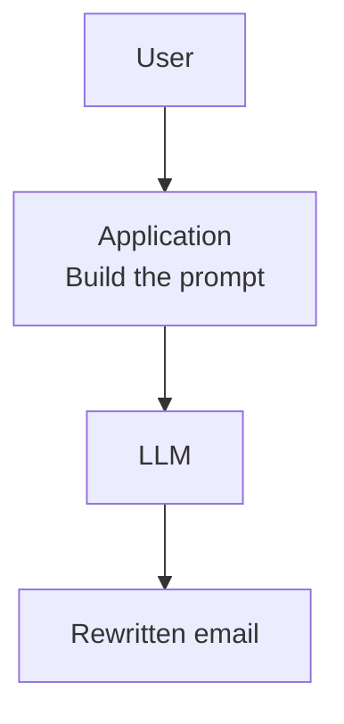
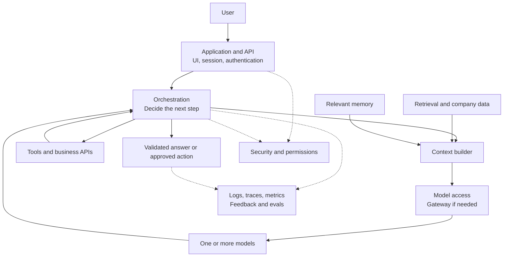
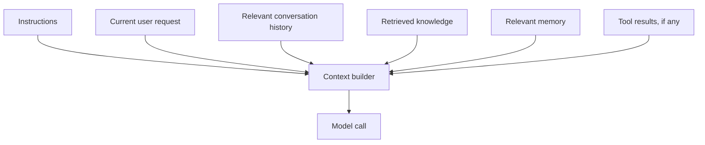
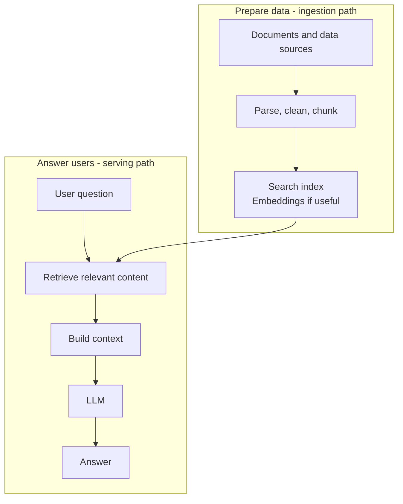
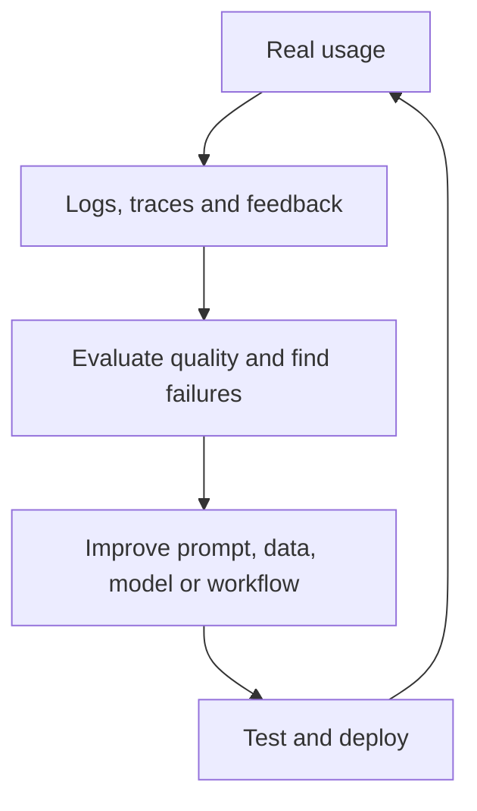

In the [previous article](../ai-demo-vs-production/), we saw that a strong model does not automatically make a good AI product. A production application also has to handle data, context, latency, cost, security, tools, and monitoring.

But if the model is only one part of the product, what does the rest actually look like?

Architecture diagrams can feel like a maze of gateways, routers, RAG, vector databases, memory, Agents, guardrails, and evals. Most of those components exist because someone encountered a specific limitation. The easiest way to understand them is not to memorize a giant diagram, but to start with the smallest system and ask:

> **What can this system not do yet?**

## 1. The smallest useful GenAI system

Imagine an app that rewrites an email. It may need only four steps:

The user sends text, the application builds a request, the model generates an answer, and the app displays it. For many use cases, this is enough. No vector database, Agent, Kafka cluster, or multi-agent framework is required.

[Anthropic recommends](https://www.anthropic.com/engineering/building-effective-agents) starting with simple, composable patterns and adding complexity only when it improves outcomes. A good architecture is not the one with the most boxes. It is the one with enough boxes to meet its requirements.

Now change the problem. Instead of rewriting email, we want a company assistant that can answer "What is our current leave policy?", check order 123, summarize this month's revenue, and create a support ticket when needed.

A model alone does not know which employee is asking, where current company data lives, which order API to call, or whether the employee may create that ticket. The system starts to grow around it.

## 2. A map of the parts

One possible architecture looks like this:

The arrows illustrate possible interactions, not a compulsory sequence for every request. An email rewriter might use only the application and model. A company assistant might need more of this map.

It also helps to distinguish two things often drawn as one box: the **application API** receives user requests, while an optional **AI gateway** centralizes access to model providers. They have different jobs.

## 3. Application layer: where AI meets the user

The top layer is ordinary software: a web or mobile app, IDE extension, support interface, API, or background job. It handles login, sessions, uploads, request limits, streaming, and how results appear on screen.

The model should not "guess" which account is signed in. Authentication belongs to the application. Authorization belongs to the application and the services holding the data or actions.

> **A GenAI application is still a software application.** It adds a probabilistic component; it does not erase existing software-engineering responsibilities.

## 4. Model layer: the brain may be one model or several

At the center is usually one or more foundation models. A simple application can send every request to one model. A larger application may use a small model for a routine classification, a stronger model for difficult reasoning, an embedding model for search, and a separate classifier for moderation.

This is the trade-off discussed in [One Super AI or a Team of Specialists?](../one-super-ai-or-team-of-specialists/): capability, latency, and cost are not identical across tasks. But routing is optional. If one model meets your quality and cost targets for one workload, adding a semantic router and seven fallback paths may only make the product harder to operate.

Start with a quality baseline, then test cheaper or faster paths against your own evals. Do not assume the biggest model or the busiest diagram is best.

## 5. Context layer: what should the model see *this time*?

An LLM does not automatically know everything the application knows. Before a model call, the application decides which information belongs in its context:

These inputs are not interchangeable. Instructions tell the model how to behave; retrieval supplies external information; memory can carry something forward from earlier interactions; tool results report what an external system found or did. A tool can also *change* that system, not merely supply context.

The design question is not "How much can we stuff into the context window?" It is "What does this request need, and what is the user allowed to see?"

## 6. Retrieval and RAG: knowledge outside the model

Suppose someone asks for the newest remote-work policy. The model may never have seen it, or the policy may have changed since training. Retrieval-Augmented Generation (RAG) searches an external source, selects relevant material, and adds it to the context before generation.

A vector database is **not** the definition of RAG. Retrieval might use keyword search, SQL, a document store, an API, vectors, or several of these together. The important question is whether the application retrieved the right, current, authorized information.

A real RAG system usually has **two paths**, not one:

[Google Cloud's RAG reference architecture](https://docs.cloud.google.com/architecture/rag-genai-gemini-enterprise-vertexai?hl=en) explicitly separates data ingestion from serving. The offline path prepares knowledge; the online path answers a user's request. When an architecture diagram feels crowded, ask which path each component belongs to.

## 7. Memory: what should last beyond one request?

Retrieval asks, "What external knowledge do I need now?" Memory asks, "What from earlier interactions is worth keeping?"

If a user says, "I prefer short reports focused on anomalies," a later request might benefit from remembering that preference. But memory is not simply "store every message in a vector database." The system must decide what is worth retaining, what should expire, what must not be stored, and which user owns it.

Short-lived conversation state may be enough. A more involved Agent may need persistent, permission-scoped memory. [AWS describes](https://docs.aws.amazon.com/prescriptive-guidance/latest/gen-ai-lifecycle-operational-excellence/preprod-architecting.html) memory as a possible separate service in complex systems, not a requirement for every chatbot.

## 8. Tools: moving from "know" to "do"

If a user asks, "Where is order 123?", a model should check the real order system rather than inventing a status from its training data. A read-only tool can return "Shipping"; the application can then provide that fact to the model.

"Create a support ticket for this order" is different. That tool changes an external system. A tool might fetch data, take an action, or, in some orchestrations, delegate work to another Agent. [OpenAI's guide to agents](https://openai.com/business/guides-and-resources/a-practical-guide-to-building-ai-agents/) distinguishes these roles.

The more a tool can change, the more the surrounding system must check: Who is the user? Is this action allowed? Are the arguments valid? Does it require approval? How will it be audited? Being able to call a function is not the same as having permission to call it.

## 9. Orchestration: who decides the next step?

A one-call app needs little orchestration. "Analyze this month's sales, find anomalies, verify likely causes, and suggest actions" may require data loading, calculations, retrieval, model reasoning, evidence checks, and a report.

There are two useful ends of a spectrum:

| Approach | Who chooses the next step? | Best fit |
| --- | --- | --- |
| Defined workflow | Application code | Steps are known and repeatable |
| Agent loop | Model, within limits set by the application | Next step depends on what it discovers |

Between them are routing, sequential and parallel workflows, state machines, evaluator-optimizer loops, and handoffs. Orchestration does **not** mean multi-agent. Ordinary application code can be the orchestrator.

[Anthropic distinguishes](https://www.anthropic.com/engineering/building-effective-agents) predefined workflows from Agents that dynamically choose their next step. [OpenAI advises](https://openai.com/business/guides-and-resources/a-practical-guide-to-building-ai-agents/) getting the most from a single Agent before adding multi-agent complexity. More autonomy can be useful, but it also increases latency, cost, and the work needed to evaluate behavior.

## 10. Gateway: when many apps need common model access

With one application and one provider, direct access can be fine. When several teams each implement credentials, routing, retries, rate limits, cost tracking, and policy separately, a shared AI gateway may become useful.

A gateway can centralize model access, quotas, observability, and provider routing. [AWS describes](https://docs.aws.amazon.com/prescriptive-guidance/latest/gen-ai-lifecycle-operational-excellence/preprod-architecting.html) this as a reusable model-access layer; [Microsoft notes](https://learn.microsoft.com/azure/architecture/ai-ml/guide/azure-openai-gateway-multi-backend) that even multiple model deployments do not *automatically* require a gateway. Use one when central control solves a real operating problem.

## 11. Security and guardrails run across layers

A diagram that shows only "LLM → Guardrail → Answer" can make security look finished. It is not. Access checks belong at the application boundary, retrieval must respect document permissions, and tool services must enforce action permissions. Inputs and outputs may need validation, and high-risk actions may need human approval.

Guardrails can help with unsafe inputs, sensitive data, output formats, or risky tool use. They do not replace authentication, authorization, or standard software security. [OpenAI's agent guidance](https://openai.com/business/guides-and-resources/a-practical-guide-to-building-ai-agents/) explicitly recommends combining them.

Reading an account balance and transferring money should not share the same policy just because both are "tool calls."

## 12. Observability and evals answer different questions

Suppose a user says, "The AI got it wrong." Was the retrieved document stale? Did the router pick an unsuitable model? Did a tool return bad data? Did a new prompt change behavior?

Logs, metrics, and traces help answer **what happened**. Useful signals include model and prompt versions, latency, token usage, retrieval results, tool calls, errors, and cost. Sensitive inputs and outputs need appropriate privacy and access controls. [AWS recommends](https://docs.aws.amazon.com/prescriptive-guidance/latest/gen-ai-lifecycle-operational-excellence/preprod-hardening.html) end-to-end tracing for requests that cross model calls, tools, and databases.

Evals ask a different question: **Was what happened good enough?** A request may return HTTP 200 in three seconds and still give the wrong answer. A RAG eval might check retrieval relevance and grounding. An Agent eval might check tool choice, arguments, unnecessary actions, and task completion. [OpenAI's evaluation guidance](https://developers.openai.com/api/docs/guides/evaluation-best-practices) recommends representative cases and repeated testing as the system changes.

These two capabilities form an improvement loop:

The runtime path serves users. This second loop helps the team discover whether the product is getting better or worse.

## Start with the limitation, not the diagram

Not every GenAI product needs all of these layers. An email rewriter might only need a model call. A policy assistant may need retrieval. An operations Agent may need tools and approval. A platform shared by many teams may benefit from a gateway.

[Berkeley AI Research calls](https://bair.berkeley.edu/blog/2024/02/18/compound-ai-systems/) systems of interacting models, retrievers, tools, and software components *compound AI systems*. "Compound" does not mean "as many components as possible." It means the final capability comes from their coordination.

| If the current system cannot... | Consider... |
| --- | --- |
| Access current or private knowledge | Retrieval |
| Carry useful context across sessions | Memory |
| Read from or act in another system | Tools with permissions |
| Complete a multi-step task reliably | Orchestration |
| Serve different workloads efficiently | Model routing |
| Govern access across many apps | An AI gateway |
| Explain or measure failures | Observability and evals |

Every box should have a reason to exist. If you cannot name the limitation it solves in your own product, you may not need it yet.

The map becomes most useful when we follow one real request through it: from the moment a user presses Enter to the moment the first token appears on screen.

## References

- [Anthropic - Building effective agents](https://www.anthropic.com/engineering/building-effective-agents)
- [OpenAI - A practical guide to building agents](https://openai.com/business/guides-and-resources/a-practical-guide-to-building-ai-agents/)
- [OpenAI Developers - Evaluation best practices](https://developers.openai.com/api/docs/guides/evaluation-best-practices)
- [AWS - Architecting generative AI applications for production](https://docs.aws.amazon.com/prescriptive-guidance/latest/gen-ai-lifecycle-operational-excellence/preprod-architecting.html)
- [AWS - Hardening the generative AI application](https://docs.aws.amazon.com/prescriptive-guidance/latest/gen-ai-lifecycle-operational-excellence/preprod-hardening.html)
- [Google Cloud - RAG infrastructure: ingestion and serving](https://docs.cloud.google.com/architecture/rag-genai-gemini-enterprise-vertexai?hl=en)
- [Microsoft Learn - Gateway in front of multiple model deployments](https://learn.microsoft.com/azure/architecture/ai-ml/guide/azure-openai-gateway-multi-backend)
- [Berkeley AI Research - The shift from models to compound AI systems](https://bair.berkeley.edu/blog/2024/02/18/compound-ai-systems/)

