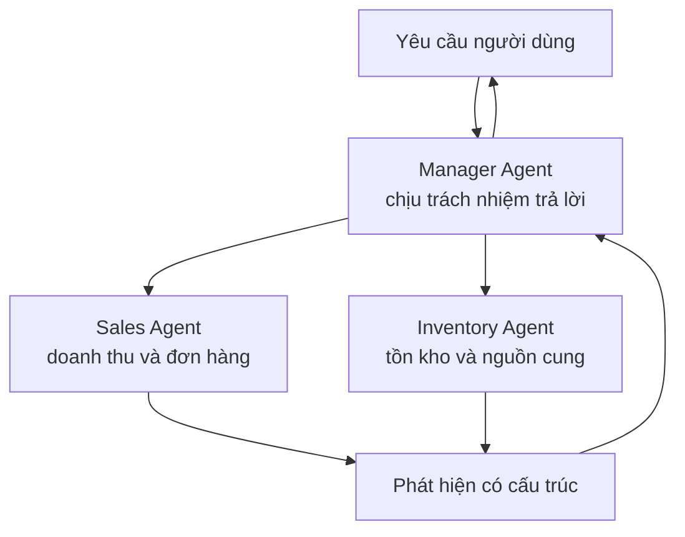
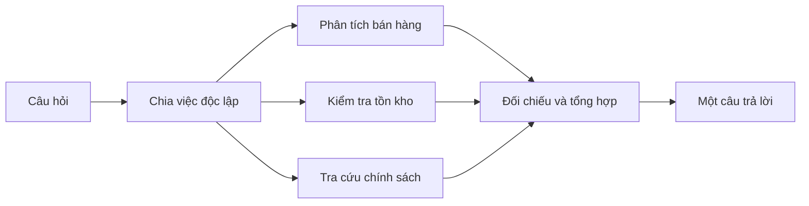
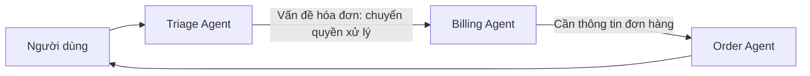
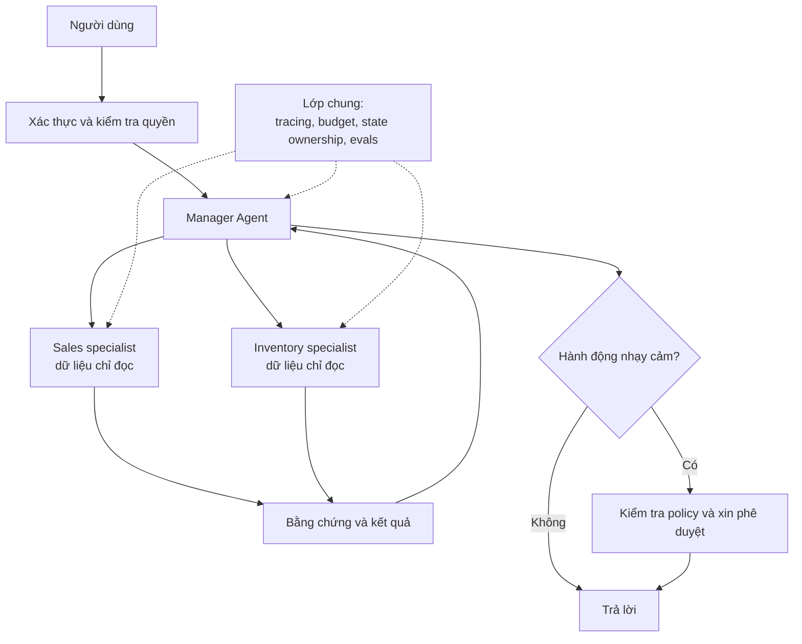

Ở [bài trước](../agent-architecture-next-step-vi/), chúng ta đã xây một Agent có thể quan sát kết quả, chọn bước tiếp theo, dùng tool rồi lặp lại. Nó có thể tìm tài liệu, truy vấn database, gọi API và dừng để xin phê duyệt.

Vậy tại sao không tiếp tục thêm tool và instruction để một Agent làm mọi việc?

Đôi khi đó *đúng là* lựa chọn tốt nhất. Nhưng hãy tưởng tượng cùng một Agent phải phân tích bán hàng, làm kế toán, hỗ trợ khách hàng, review bảo mật và deploy production. Vấn đề có thể không nằm ở chỗ model thiếu thông minh. Phạm vi công việc đã quá rộng, còn ranh giới trách nhiệm thì quá mờ.

Multi-agent architecture là một cách làm rõ những ranh giới đó. Nó không phải lối tắt để biến model thành thông minh hơn.

## 1. Gọi LLM nhiều lần chưa chắc đã là multi-agent

Một pipeline luôn tóm tắt, dịch rồi format tài liệu có thể gọi LLM ba lần mà vẫn chỉ là một workflow cố định. Trong hệ thống multi-agent, nhiều Agent có trách nhiệm riêng và có thể thực hiện các bước trong phạm vi của mình để cùng hoàn thành một mục tiêu lớn hơn.

Mỗi Agent *có thể* có instruction, tool, knowledge, context làm việc, quyền truy cập hoặc model riêng. Đây là những khả năng, không phải checklist bắt buộc cho mọi hệ thống. Điều quan trọng là có ranh giới trách nhiệm thực sự và cách phối hợp kết quả.

| Thiết kế | Ai quyết định công việc? | Ví dụ |
| --- | --- | --- |
| Pipeline LLM cố định | Application code | Tóm tắt, dịch, rồi format |
| Một Agent | Agent trong giới hạn của runtime | Chọn tool được phép dùng tiếp theo |
| Nhiều Agent | Coordinator hoặc cơ chế handoff cùng các specialist | Giao phân tích doanh số và kiểm tra tồn kho cho hai Agent |

## 2. Một Agent lớn bắt đầu gặp vấn đề ở đâu?

Thêm tool rất tiện, nhưng cũng có thể làm quyết định khó hơn. Một Agent xử lý cả bán hàng, tồn kho và tài chính sẽ gặp nhiều tool và instruction dễ chồng lấn. Context phình ra vì phải mang theo những chi tiết không liên quan. Nếu cấp luôn quyền của mọi bộ phận, một lần gọi nhầm tool cũng có thể gây hậu quả lớn hơn.

Tách việc có ích khi nó tạo ra ranh giới rõ ràng:

- Sales Agent đọc dữ liệu bán hàng và giải thích xu hướng.
- Inventory Agent kiểm tra tồn kho và nguồn cung.
- Coordinator ghép kết quả rồi trả lời người dùng.

Hãy nghĩ tới một công ty có các nhóm chuyên môn, không phải một nhóm model ngồi tranh luận. Giá trị đến từ phạm vi, người chịu trách nhiệm và cách phối hợp. Chia nhóm không khéo có thể còn kém hơn để một người đủ năng lực làm việc.

## 3. Manager và specialist: một đầu mối chịu trách nhiệm trả lời

Giả sử người dùng hỏi:

> "Vì sao doanh thu tháng trước giảm, và sản phẩm nào có nguy cơ hết hàng?"

Manager Agent có thể giao hai việc riêng cho Sales và Inventory, nhận kết quả, kiểm tra chỗ mâu thuẫn rồi viết một câu trả lời thống nhất.

Đây là kiểu **agent-as-tool**: Manager vẫn giữ quyền điều phối cuộc hội thoại và gọi specialist làm một việc có giới hạn. [Tài liệu orchestration của OpenAI](https://developers.openai.com/api/docs/guides/agents/orchestration) phân biệt cách này với handoff, nơi quyền xử lý cuộc hội thoại được chuyển cho specialist.

Manager không chỉ "gọi Agent khác". Nó cần xác định mỗi worker phải trả lời câu hỏi gì, được dùng dữ liệu nào, cần trả bằng chứng gì, khi nào dừng, và xử lý khoảng trống hay mâu thuẫn ra sao. Một bản giao việc rõ ràng có thể là:

| Thành phần | Ví dụ |
| --- | --- |
| Mục tiêu | Giải thích doanh thu thay đổi giữa tháng 8 và tháng 9 |
| Phạm vi | Chỉ phân tích dữ liệu bán hàng; không tự suy đoán nguyên nhân từ tồn kho |
| Đầu ra | Xu hướng, yếu tố khả dĩ, số liệu hỗ trợ, điều chưa chắc chắn |
| Giới hạn | Tool chỉ đọc; dừng khi hết ngân sách đã cấp |

Nếu giao việc mơ hồ, hai specialist có thể làm trùng, bỏ sót hoặc đều nghĩ người kia đã xử lý. [Bài chia sẻ của Anthropic về hệ thống multi-agent research](https://www.anthropic.com/engineering/multi-agent-research-system) cũng mô tả tầm quan trọng của nhiệm vụ subagent rõ ràng và sự phối hợp cẩn thận.

## 4. Chạy song song chỉ có lợi khi công việc độc lập

Kiểm tra doanh thu và tồn kho thường có thể chạy cùng lúc. Coordinator sau đó thu kết quả và tổng hợp: **chia nhánh rồi gom lại**.

Nếu ba việc độc lập đều mất mười giây, xử lý song song có thể giảm thời gian chờ. Nhưng tổng thời gian không nhất thiết còn đúng mười giây: khởi tạo, worker chậm, retry và bước tổng hợp đều có chi phí.

Đừng song song hóa các bước phụ thuộc nhau. Không thể tính tiền hoàn trước khi tìm đúng đơn hàng và áp dụng chính sách liên quan. Hai Agent cùng sửa một file cũng dễ xung đột. Song song hữu ích nhất cho những việc *đọc hoặc khảo sát độc lập*; ghi vào tài nguyên chung cần phân quyền sở hữu hoặc cơ chế phối hợp.

Anthropic cho biết hệ thống research của họ đặc biệt có lợi với những câu hỏi rộng, có thể khám phá theo nhiều hướng độc lập. Đó là quan sát trên workload nghiên cứu của họ, không phải bằng chứng rằng thêm Agent sẽ cải thiện mọi task.

## 5. Handoff khác với nhờ specialist hỗ trợ

Một Triage Agent của bộ phận hỗ trợ phát hiện người dùng đang hỏi về hóa đơn. Thay vì hỏi Billing Agent rồi tự trả lời hộ, nó có thể **handoff** cuộc hội thoại. Lúc này Billing Agent trở thành bên xử lý chính.

Khi handoff, Agent mới cần đủ context để tiếp tục: mục tiêu của người dùng, các sự kiện liên quan, hành động đã thực hiện và câu hỏi còn bỏ ngỏ. Nó không nhất thiết cần toàn bộ cuộc hội thoại cũ.

Một nhóm Agent cùng chat hoặc tranh luận cũng là một pattern, nhưng multi-agent không bắt buộc phải như vậy. Với nhiều sản phẩm, Manager cùng các specialist có phạm vi rõ hoặc một handoff đơn giản dễ vận hành hơn.

## 6. Context và state cần "hợp đồng" rõ ràng

Một worker có thể đọc hàng chục trang tài liệu, nhưng trả toàn bộ chúng về Manager chỉ làm context quá tải lần nữa. Một kết quả ngắn gọn nên có:

| Trường | Để làm gì? |
| --- | --- |
| Kết luận | Specialist đã tìm thấy gì |
| Bằng chứng | Dữ liệu, link tài liệu hoặc kết quả tool hỗ trợ kết luận |
| Điểm chưa chắc | Còn thiếu hoặc mâu thuẫn điều gì |
| Bước tiếp theo | Có cần kiểm tra thêm hoặc xin quyết định của con người không |

Khi một nhận định quan trọng, coordinator vẫn cần khả năng kiểm tra bằng chứng gốc. Bản tóm tắt giúp chuyển giao công việc, không phải lý do để giấu nguồn.

Shared state còn khó hơn. Nếu hai Agent cùng sửa một đơn hàng, ai sở hữu giá trị cuối cùng? Nếu một Agent retry sau timeout và hoàn tiền hai lần thì sao? Hệ thống production cần quy tắc về quyền sở hữu, xử lý đồng thời, tính idempotent và audit log. Đây là bài toán hệ thống phân tán thông thường, không thể chỉ sửa bằng một prompt hay hơn.

## 7. Ranh giới specialist cũng có thể là ranh giới bảo mật

Research Agent có thể chỉ cần web search. Finance Agent có thể cần báo cáo tài chính ở chế độ chỉ đọc. Refund Agent có thể được phép thực hiện hoàn tiền, nhưng chỉ dưới hạn mức và sau khi xác minh quyền của người dùng.

**Giao việc không đồng nghĩa cấp quyền.** Manager nói "hãy làm việc này" không tự cấp thêm quyền cho worker hay tool. Hãy kiểm tra quyền ở nơi truy cập dữ liệu và gọi tool, yêu cầu phê duyệt cho hành động nhạy cảm, và chỉ cấp quyền tối thiểu cần thiết cho từng Agent.

Khi các Agent thuộc nhiều tổ chức hoặc framework khác nhau, giao thức như [A2A](https://developers.googleblog.com/a2a-a-new-era-of-agent-interoperability/) có thể giúp chúng giao tiếp. Nhưng hai Agent nội bộ gọi nhau qua application code không nhất thiết cần A2A. A2A giải quyết giao tiếp Agent với Agent; [MCP](../what-is-mcp-ai-usb-c-vi/) giải quyết cách AI application kết nối với tool và dữ liệu bên ngoài. Cả hai không thay thế cơ chế phân quyền của ứng dụng.

## 8. Nhiều Agent cũng tạo thêm cách để hệ thống thất bại

Một hệ thống multi-agent có thể chuyển yêu cầu sai specialist, truyền thiếu context, tạo việc trùng nhau, lặp handoff không dứt, hoặc đưa ra kết luận mâu thuẫn. Thêm lượt gọi có thể tăng token và chi phí. Chạy song song có thể giảm thời gian chờ nhưng tăng tổng lượng tính toán.

Một ví dụ ngân sách đơn giản: một Agent dùng 20.000 token không tương đương về chi phí với một Manager cộng năm worker, mỗi bên đều dùng 20.000 token. Chi phí thật phụ thuộc model, tái sử dụng context, tool call và lượng việc thực chạy, nhưng điểm chính vẫn rõ: giao việc có overhead.

Vì vậy cần giới hạn số worker, timeout, token budget, quy tắc retry và điều kiện dừng. Chỉ thêm specialist khi nó cải thiện đáng kể kết quả, tách biệt quyền/policy hoặc làm hệ thống dễ hiểu hơn. [Hướng dẫn orchestration của OpenAI](https://developers.openai.com/api/docs/guides/agents/orchestration) cũng nhấn mạnh rằng lợi ích chuyên môn hóa phải xứng với độ phức tạp thêm vào.

## 9. Đánh giá cả đội, không chỉ từng Agent

Sales Agent có thể tính đúng mức giảm doanh thu, Inventory Agent có thể báo đúng lượng hàng thấp, nhưng Manager lại kết luận sai rằng thiếu hàng *gây ra* doanh thu giảm. Từng Agent đúng không đảm bảo câu trả lời cuối đúng.

Hãy đánh giá cả kết quả lẫn quá trình:

- Yêu cầu thực sự của người dùng đã được giải quyết chưa?
- Có gọi đúng specialist và tránh những lượt gọi thừa không?
- Những nhận định quan trọng có bằng chứng không?
- Quyền truy cập, phê duyệt và ngân sách có được tuân thủ không?
- Hệ thống có phục hồi được khi tool hoặc worker lỗi không?

Ghi lại trace của model call, tool call, guardrail và handoff để biết lỗi xuất hiện ở ranh giới nào. [Hướng dẫn Agent evals của OpenAI](https://developers.openai.com/api/docs/guides/agent-evals) mô tả cách đánh giá dựa trên trace. Nhiều con đường khác nhau có thể dẫn tới cùng một kết quả tốt, nên eval không cần ép đúng một chuỗi bước trừ khi bản thân chuỗi đó là yêu cầu bắt buộc.

## 10. Khi nào multi-agent thực sự đáng dùng?

Hãy bắt đầu bằng một Agent hoặc workflow cố định nếu task hẹp, tuần tự và dễ kiểm soát. Cân nhắc nhiều Agent khi công việc có các domain thực sự tách biệt, quyền truy cập khác nhau, nhiều nhánh độc lập có lợi khi chạy song song, hoặc context chuyên môn quá lớn để nhét chung vào một Agent.

Một hệ thống production có thể trông như sau:

Kiến trúc không được định nghĩa bởi số Agent trên sơ đồ. Nó được định nghĩa bởi **ai sở hữu từng quyết định, context nào đi qua mỗi ranh giới, hành động nào được phép và cách đánh giá toàn bộ hệ thống**.

> Chỉ thêm một Agent khi nó tạo ra ranh giới có ích, không phải chỉ vì framework cho phép tạo thêm Agent rất dễ.

