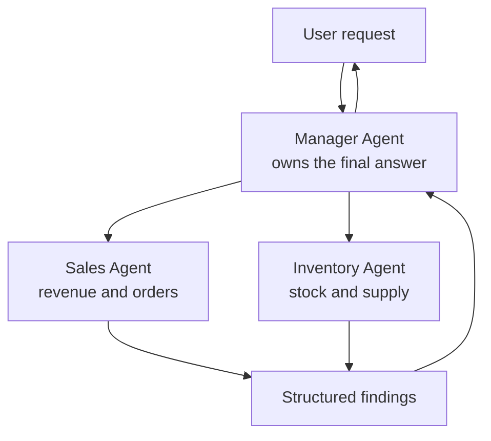
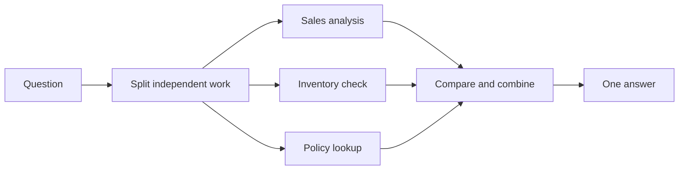
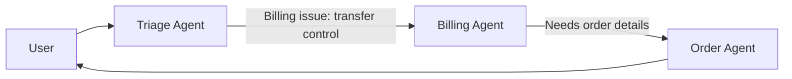
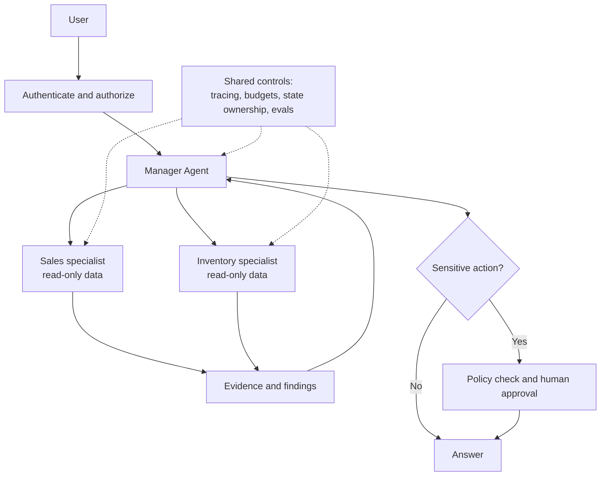

In the [previous article](../agent-architecture-next-step/), we built an Agent that can observe a result, choose its next step, use a tool, and repeat. It can search documents, query a database, call an API, and pause for approval.

So why not keep adding tools and instructions until that one Agent handles everything?

Sometimes that *is* the right answer. But imagine asking the same Agent to handle sales analysis, accounting, customer support, security review, and production deployment. The problem may not be that the model is too weak. The job has become too broad, and the boundaries are hard to see.

Multi-agent architecture is one way to make those boundaries explicit. It is not a shortcut to a smarter model.

## 1. Calling an LLM several times is not automatically multi-agent

A pipeline that always summarizes, translates, and formats a document can use three LLM calls and still be one fixed workflow. In a multi-agent system, distinct Agents have assigned responsibilities and can pursue their own bounded steps toward a shared goal.

Each Agent may have its own instructions, tools, knowledge, working context, access policy, or model. These are *possible* differences, not a checklist that every implementation must satisfy. What matters is a meaningful separation of responsibility and a way to coordinate the results.

| Design | Who decides the work? | Example |
| --- | --- | --- |
| Fixed LLM pipeline | Application code | Summarize, translate, then format |
| One Agent | One Agent within runtime limits | Choose which approved tool to use next |
| Multiple Agents | A coordinator or handoff mechanism plus specialist Agents | Delegate sales analysis and inventory checks to separate workers |

## 2. Where one large Agent starts to struggle

Adding tools can be convenient, but it can also make decisions harder. A sales, inventory, and finance Agent may face overlapping tools and instructions. Its context grows as it carries unrelated details from task to task. Giving it every team's permissions also increases the impact of a mistaken tool call.

Splitting the work can help when it creates clear boundaries:

- A Sales Agent reads sales data and explains trends.
- An Inventory Agent checks stock and supply constraints.
- A coordinator combines their findings and answers the user.

Think of a company with specialist teams, not a collection of models arguing in a room. The value comes from ownership, scope, and coordination. A badly divided team can perform worse than one capable person.

## 3. Manager and specialists: one clear owner of the answer

Suppose a user asks:

> "Why did revenue fall last month, and which products are at risk of running out?"

A Manager Agent can assign separate tasks to Sales and Inventory specialists, receive their findings, check whether anything conflicts, and write one response.

This is an **agent-as-tool** pattern: the Manager remains responsible for the conversation and calls specialists for bounded work. [OpenAI's orchestration guide](https://developers.openai.com/api/docs/guides/agents/orchestration) distinguishes this from a handoff, where control of the conversation passes to a specialist.

The Manager's job is more than issuing calls. It must define what each worker should answer, which data it may use, what evidence to return, when to stop, and how to resolve gaps or contradictions. A useful delegation contract might be:

| Field | Example |
| --- | --- |
| Objective | Explain the revenue change between August and September |
| Scope | Sales data only; do not infer inventory causes |
| Output | Trend, likely drivers, supporting figures, uncertainties |
| Limits | Read-only tools; stop after the approved budget |

Without such a contract, two specialists may duplicate work, leave a gap, or each assume the other has handled it. [Anthropic's account of its multi-agent research system](https://www.anthropic.com/engineering/multi-agent-research-system) describes how clear subagent tasks and careful coordination mattered in practice.

## 4. Parallel work helps only when work is independent

Sales and Inventory checks can often run at the same time. A coordinator then gathers the results and synthesizes them: **fan-out, then fan-in**.

If three independent checks each take ten seconds, parallel execution can reduce waiting time. It will not necessarily finish in ten seconds: startup, slow workers, retries, and synthesis all add time.

Do not parallelize work with real dependencies. You cannot check a refund amount before finding the order and applying the relevant policy. Two Agents editing the same file can also conflict. Parallelism is useful for independent *reads or investigations*; shared writes need ownership or coordination.

Anthropic reports that its research system benefited particularly from broad questions that could be explored in independent directions. That is an observation about its research workload, not proof that more Agents improve every task.

## 5. Handoff is different from asking a specialist for help

A customer-support triage Agent may discover that the user has a billing problem. Instead of consulting a Billing Agent and speaking on its behalf, it can **hand off** the conversation. The Billing Agent then becomes the active owner.

In a handoff, the new Agent needs enough context to continue: the user's goal, relevant facts, prior actions, and unresolved questions. It should not need every token from the previous Agent's conversation.

A group chat or debate among Agents is another possible pattern, but it is not what "multi-agent" necessarily means. For many products, a Manager with bounded specialists or a simple handoff is easier to operate.

## 6. Context and state need explicit contracts

A worker may read dozens of pages, but returning all of them to the Manager merely recreates context overload. A compact result can instead contain:

| Field | Why it matters |
| --- | --- |
| Finding | What the specialist concluded |
| Evidence | Data, document links, or tool results that support it |
| Uncertainty | What remains unknown or disputed |
| Next action | Whether another check or human decision is needed |

The coordinator should still be able to inspect underlying evidence when a claim is important. A summary is a routing aid, not a license to hide sources.

Shared state is harder. If two Agents can modify the same order, who owns the final value? What happens if one retries after a timeout and issues a refund twice? Production systems need rules for ownership, concurrency, idempotency, and audit trails. These are ordinary distributed-system problems, not problems that a better prompt can solve.

## 7. A specialist boundary can also be a security boundary

A Research Agent might only need web search. A Finance Agent might need read-only financial reports. A Refund Agent may need permission to execute a refund, but only below a limit and only after checking the user's authorization.

**Delegation is not authorization.** The Manager saying "do this" does not grant a worker or tool new rights. Enforce access at the tool and data boundary, require approval for sensitive actions, and give each Agent the minimum permissions it needs.

When Agents belong to different organizations or frameworks, an interoperability protocol such as [A2A](https://developers.googleblog.com/a2a-a-new-era-of-agent-interoperability/) may help them communicate. It is not required for two internal Agents calling each other through application code. A2A addresses Agent-to-Agent communication; [MCP](../what-is-mcp-ai-usb-c/) addresses how AI applications connect to external tools and data. Neither replaces application-level authorization.

## 8. More Agents also mean more ways to fail

A multi-agent system can route a request to the wrong specialist, pass along incomplete context, spawn duplicate work, loop through handoffs, or produce conflicting conclusions. More calls can increase token usage and cost. Parallel work may reduce elapsed time while increasing total compute.

An illustrative budget makes the trade-off visible: one Agent using 20,000 tokens is not equivalent in cost to a Manager plus five workers each using 20,000 tokens. Real usage depends on models, context reuse, tool calls, and how much work actually runs, but the direction is clear: delegation has overhead.

Set practical limits: maximum workers, timeouts, token budgets, retry rules, and a stopping condition. Add a new specialist only when it measurably improves the task, policy separation, or the clarity of the system. [OpenAI's orchestration guidance](https://developers.openai.com/api/docs/guides/agents/orchestration) makes the same architectural point: specialization should earn its complexity.

## 9. Evaluate the team, not just the specialists

A Sales Agent can correctly calculate a revenue decline and an Inventory Agent can correctly report low stock, yet the Manager may falsely claim that low stock *caused* the decline. Agent-level correctness does not guarantee a good system-level answer.

Measure both the outcome and the process:

- Was the user's actual request completed?
- Were the right specialists called, and were unnecessary calls avoided?
- Were important claims supported by evidence?
- Were permissions, approval rules, and budgets respected?
- Could the system recover from a failed tool or worker?

Capture traces of model calls, tool use, guardrails, and handoffs so failures can be attributed to the right boundary. [OpenAI's Agent evals guide](https://developers.openai.com/api/docs/guides/agent-evals) describes this trace-based approach. Multiple valid routes may reach the same good answer, so an evaluation should not demand one exact sequence unless that sequence is itself required.

## 10. When is multi-agent worth it?

Start with one Agent or a fixed workflow when the task is narrow, sequential, and easy to govern. Consider multiple Agents when the work has genuinely separate domains, different permissions, independent branches that benefit from parallelism, or specialist contexts that would otherwise crowd each other out.

A production design might look like this:

The architecture is not defined by how many Agents appear in the diagram. It is defined by **who owns each decision, what context crosses a boundary, which actions are allowed, and how the whole system is evaluated**.

> Use another Agent when it creates a useful boundary, not just because the framework makes spawning one easy.

## References

- [How we built our multi-agent research system - Anthropic](https://www.anthropic.com/engineering/multi-agent-research-system)
- [Orchestrate agent workflows - OpenAI Developers](https://developers.openai.com/api/docs/guides/agents/orchestration)
- [Evaluate agent workflows - OpenAI Developers](https://developers.openai.com/api/docs/guides/agent-evals)
- [A2A: A new era of agent interoperability - Google Developers Blog](https://developers.googleblog.com/a2a-a-new-era-of-agent-interoperability/)
