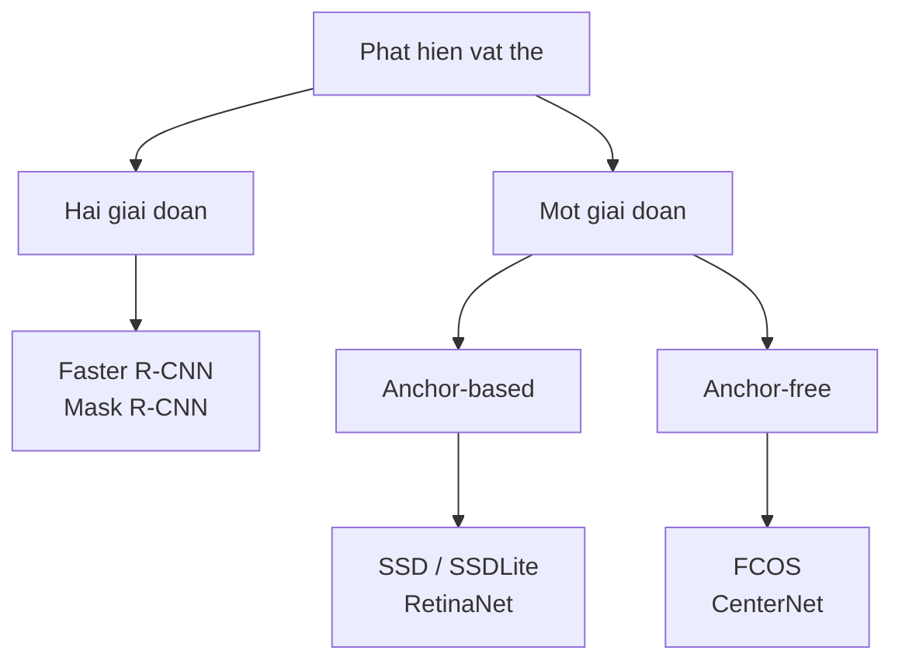

> **Mục tiêu bài học:** Sau bài này, bạn sẽ đặt được bất kỳ mô hình phát hiện vật thể nào vào đúng nhánh của cây phân loại hai giai đoạn / một giai đoạn và anchor-based / anchor-free, và đọc được bảng đánh đổi giữa độ chính xác, tốc độ và kích thước - bằng số liệu đo thật trên cùng một tập ảnh, kể cả những chỗ số liệu đi ngược lời đồn.

## 1. Hai câu hỏi thiết kế

Bài 07 dựng thước đo. Bài này dùng thước đo ấy để so bốn mô hình thật, nhưng trước hết cần biết chúng khác nhau ở đâu.

Mọi mô hình phát hiện vật thể đều phải trả lời cùng một câu hỏi khó: **ảnh có vô số vị trí và vô số kích thước khung có thể, làm sao xét hết?** Hai lựa chọn thiết kế lớn sinh ra từ đó.

**Câu hỏi thứ nhất: lọc trước rồi mới xét kỹ, hay xét thẳng tất cả?**

- **Hai giai đoạn** - giai đoạn một đề xuất vài nghìn vùng *có thể* chứa vật; giai đoạn hai xét kỹ từng vùng, tinh chỉnh khung và gán nhãn. Faster R-CNN là đại diện.
- **Một giai đoạn** - bỏ hẳn bước đề xuất, dự đoán thẳng nhãn và khung tại mọi vị trí trên bản đồ đặc trưng. RetinaNet, FCOS, SSD là đại diện.

**Câu hỏi thứ hai: có dùng khung mẫu dựng sẵn không?**

- **Anchor-based** - rải sẵn ở mỗi vị trí vài khung mẫu với tỉ lệ và kích thước định trước, rồi mô hình học cách *chỉnh* chúng. Cách này thêm một loạt siêu tham số phải chọn tay: bao nhiêu tỉ lệ, kích thước nào, ngưỡng gán nhãn bao nhiêu.
- **Anchor-free** - bỏ hẳn khung mẫu. Mỗi vị trí trên bản đồ đặc trưng tự dự đoán khoảng cách từ nó tới bốn cạnh của khung. FCOS làm vậy.

Ghép hai câu hỏi lại thành cây phân loại cho **các mô hình phát hiện dựa trên mạng tích chập** - tức bốn mô hình của bài này và phần lớn những cái tên bạn gặp trước năm 2020:

Gặp một cái tên lạ thì câu hỏi đầu tiên là nó nằm ở nhánh nào - phần lớn YOLO hiện đại là một giai đoạn và anchor-free.

Nhưng cây này **không phủ hết**, và chỗ nó hụt đáng biết. **DETR** và các mô hình cùng họ đặt bài toán theo kiểu khác hẳn: chúng dự đoán thẳng một *tập* hộp cố định rồi ghép cặp với nhãn thật bằng một phép ghép cặp tối ưu, nên không có bước đề xuất vùng, không có khung mẫu, và **không cần cả NMS**. Hỏi "DETR là anchor-based hay anchor-free" là hỏi sai câu - nó không nằm trên trục ấy. Coi cây này là bản đồ cho họ tích chập, không phải phân loại đầy đủ của mọi mô hình phát hiện.

## 2. Bốn mô hình, cùng một tập ảnh

Đo trên **500 ảnh lấy ngẫu nhiên cố định từ COCO val2017, seed 42** - đúng cách chọn mà bài 07 đã nêu lý do. Đây là **đo trên máy này**, không phải COCO mAP chính thức vốn tính trên đủ 5.000 ảnh.

| Mô hình | Họ | Tham số | AP@[.50:.95] | AP50 | AP75 | Giây/ảnh |
|---|---|---|---|---|---|---|
| Faster R-CNN | hai giai đoạn | 41.755.286 | 0,4051 | 0,6215 | 0,4441 | 2,02 |
| RetinaNet | một giai đoạn, anchor-based | 34.014.999 | 0,3961 | 0,5953 | 0,4238 | 1,76 |
| **FCOS** | một giai đoạn, **anchor-free** | 32.269.600 | **0,4365** | **0,6336** | **0,4638** | 1,57 |
| SSDLite320 | một giai đoạn, anchor-based | **3.440.060** | 0,2371 | 0,3717 | 0,2591 | **0,06** |

Bảng này có ba chuyện, và chuyện đầu tiên đi ngược cách kể phổ biến.

**FCOS thắng cả ba chỉ số AP, mà lại nhỏ hơn và nhanh hơn Faster R-CNN.** Cách kể quen thuộc là "hai giai đoạn chính xác hơn, một giai đoạn nhanh hơn" - nghe hợp lý vì hai giai đoạn xét kỹ hơn. Ở bảng này thì ngược: một mô hình một giai đoạn, anchor-free, ít hơn 9,5 triệu tham số, chạy nhanh hơn 22%, và hơn 3,1 điểm AP.

Nhưng **đừng suy ra rằng "hai giai đoạn chính xác hơn" đã lỗi thời.** Bốn dòng ở bảng trên là bốn *bộ trọng số cụ thể*, và torchvision còn có bộ khác. Đây là số công bố trên đủ 5.000 ảnh COCO val2017:

| Bộ trọng số | Box mAP **công bố** |
|---|---|
| **Faster R-CNN ResNet50-FPN v2** (hai giai đoạn) | **46,7** |
| RetinaNet ResNet50-FPN v2 | 41,5 |
| FCOS ResNet50-FPN | 39,2 |
| Faster R-CNN ResNet50-FPN v1 (dùng ở bảng trên) | 37,0 |
| SSDLite320 MobileNetV3-Large | 21,3 |

Cùng kiến trúc Faster R-CNN, chỉ đổi công thức huấn luyện, con số đi từ 37,0 lên **46,7** - vượt xa FCOS. Nên kết luận đúng từ thí nghiệm này hẹp hơn nhiều, và cũng hữu ích hơn:

> Trong bốn bộ trọng số cụ thể ở đây, FCOS vừa nhanh hơn vừa chính xác hơn Faster R-CNN v1. Vì vậy **"hai giai đoạn thì luôn chính xác hơn" không phải định luật** - số giai đoạn không tự quyết định độ chính xác. Công thức huấn luyện, xương sống, phần đầu dự đoán và phiên bản trọng số hoàn toàn có thể đảo thứ hạng.

Đây là lần thứ hai trong chương gặp đúng hiện tượng ấy: bài 10 sẽ cho thấy chỉ đổi bộ trọng số của cùng một ResNet-50 đã dịch kết quả 17,8 điểm.

**SSDLite là một loại đánh đổi khác hẳn, không phải "kém hơn".** Nó ít hơn **12 lần** tham số và nhanh hơn **26 lần** so với FCOS. Đổi lại AP còn khoảng một nửa. Đưa lên điện thoại thì đây là mô hình duy nhất trong bảng chạy được theo thời gian thực.

**Khoảng cách giữa AP50 và AP75 cho biết chất lượng khoanh khung.** FCOS rơi từ 0,6336 xuống 0,4638 khi siết ngưỡng IoU từ 0,5 lên 0,75 - mất 17 điểm. SSDLite rơi từ 0,3717 xuống 0,2591. Cả bốn mô hình đều mất nhiều khi siết ngưỡng, tức **tìm ra vật dễ hơn khoanh chính xác vật**, đúng như hộp *Thử ngay* ở bài 07 đã mô tả.

## 3. Chỗ SSDLite thực sự thua

Con số AP tổng thể che một chuyện quan trọng. Tách theo kích thước vật thể:

| Mô hình | AP vật nhỏ | AP vật lớn |
|---|---|---|
| Faster R-CNN | 0,2562 | 0,5525 |
| RetinaNet | 0,2275 | 0,5693 |
| FCOS | **0,2664** | **0,5855** |
| SSDLite320 | **0,0176** | 0,5076 |

Với **vật lớn**, SSDLite đạt 0,5076 - chỉ kém FCOS 7,8 điểm, hoàn toàn dùng được. Với **vật nhỏ**, nó đạt **0,0176**, tức kém FCOS **mười lăm lần**. Nó gần như mù với vật nhỏ.

Ứng viên nguyên nhân mạnh nhất nằm ngay trong tên: **SSDLite*320*** nhận ảnh vào ở độ phân giải 320×320, trong khi ba mô hình kia dùng ảnh gốc cỡ 800 pixel cạnh ngắn. Một con chim chiếm 30×30 pixel trong ảnh gốc co lại còn khoảng 12×12 sau khi thu nhỏ - sau vài tầng pooling thì không còn gì để nhận ra.

Nhưng bốn mô hình còn khác nhau cả xương sống, phần đầu dự đoán lẫn công thức huấn luyện, nên thí nghiệm này **chưa cô lập được ảnh hưởng riêng của độ phân giải**. Muốn cô lập thì phải chạy cùng một mô hình ở nhiều độ phân giải đầu vào khác nhau - đúng tinh thần ablation của chương Deep Learning · Bài 12.

Đây là kiểu phát hiện đổi được thành quyết định ngay:

- Đếm xe trên đường, camera đặt gần → SSDLite là lựa chọn tốt và rẻ
- Đếm người trong ảnh chụp từ drone → SSDLite vô dụng, mọi vật đều nhỏ
- Nếu buộc phải dùng mô hình nhẹ cho vật nhỏ → cắt ảnh thành ô rồi chạy trên từng ô, đổi thời gian lấy độ phân giải

> ⚠️ **Lưu ý nhỏ:** đừng đọc bảng ở mục 2 thành bảng xếp hạng chung. Bốn mô hình này chạy ở độ phân giải đầu vào khác nhau, được huấn luyện bằng công thức khác nhau và ở những thời điểm khác nhau - nên bảng đo *bốn hệ thống hoàn chỉnh*, không tách riêng được ảnh hưởng của kiến trúc. Nói "anchor-free tốt hơn anchor-based" từ bảng này là kết luận vượt quá dữ liệu: muốn kết luận thế phải giữ mọi thứ khác cố định và chỉ đổi cách gán nhãn, đúng tinh thần thí nghiệm ablation ở chương Deep Learning · Bài 12.

## 4. Số lượng khung trả về: đọc mặc định trước khi kết luận

Có một cột trong dữ liệu thô mà bảng chính không có, và nó rất dễ bị đọc sai. Tổng số khung mỗi mô hình trả về trên đúng 500 ảnh ấy:

| Mô hình | Số khung trả về | Trung bình mỗi ảnh |
|---|---|---|
| Faster R-CNN | 17.905 | 36 |
| FCOS | 28.648 | 57 |
| RetinaNet | 66.101 | 132 |
| SSDLite320 | **149.682** | **299** |

Chênh nhau **tám lần** giữa đầu và cuối bảng, cho cùng những tấm ảnh chứa cùng những vật thể.

Cách đọc hấp dẫn là quy nó cho kiến trúc: hai giai đoạn lọc sớm nên trả về ít, một giai đoạn dự đoán khắp nơi nên trả về nhiều. Nghe rất hợp lý - nhưng kiểm lại tham số mặc định của từng mô hình trong torchvision thì phần lớn khoảng cách ấy đến từ chỗ khác:

| Mô hình | Ngưỡng điểm mặc định | Số hộp tối đa mỗi ảnh |
|---|---|---|
| Faster R-CNN | 0,05 | 100 |
| FCOS | **0,20** | 100 |
| RetinaNet | 0,05 | **300** |
| SSDLite320 | **0,001** | **300** |

SSDLite trả về trung bình 299 hộp mỗi ảnh vì mặc định của nó là **giữ lại mọi thứ trên 0,001 và cho tới 300 hộp** - nó đang chạm trần chính tham số ấy. Faster R-CNN trả 36 hộp vì trần của nó là 100 và ngưỡng cao gấp 50 lần. Đây là **lựa chọn của người đóng gói thư viện**, không phải dấu vết của kiến trúc.

Muốn dùng số hộp để nói về kiến trúc thì phải đặt bốn mô hình về cùng ngưỡng và cùng trần trước đã - thí nghiệm này chưa làm, nên bảng trên chỉ đọc được một điều: **mặc định của các thư viện rất khác nhau, và bạn phải xem chúng trước khi triển khai.**

Hệ quả thực dụng vẫn còn nguyên: nếu lấy thẳng đầu ra SSDLite mà không lọc, bạn nhận 299 khung cho một tấm ảnh thường chỉ có vài vật, nên phải chọn ngưỡng theo chi phí như chương Machine Learning · Bài 12.

> ⚠️ **Lưu ý nhỏ:** nhưng đừng đặt ngưỡng ấy **trước khi tính AP**. Phép tính AP cần cả danh sách dự đoán đã xếp hạng theo điểm, kể cả những dự đoán điểm rất thấp, vì chúng tạo ra phần đuôi recall cao của đường precision-recall. Lọc bớt trước khi đưa vào bộ chấm **có thể làm AP giảm** - giảm bao nhiêu thì tùy bạn có cắt mất dự đoán đúng nào ở vùng recall cao hay không; cắt những dự đoán rác ở cuối danh sách thì đôi khi AP gần như không đổi. Rủi ro là bạn không biết trước mình đang ở trường hợp nào, và sẽ tưởng mô hình kém đi trong khi thứ thay đổi chỉ là cách báo cáo. Ngưỡng triển khai và ngưỡng đánh giá là hai chuyện tách biệt.

> 🔧 **Thử ngay:** bạn cần chạy phát hiện vật thể trên luồng camera 15 khung hình mỗi giây, trên máy tính nhúng không có GPU. Bảng ở mục 2 gợi ý gì, và bạn phải hỏi thêm gì trước khi chọn?
> Chỉ SSDLite320 có cơ hội: 0,06 giây mỗi ảnh cho khoảng 16 khung hình mỗi giây, còn ba mô hình kia mất 1,5-2 giây, tức chậm hơn yêu cầu hơn hai mươi lần. Nhưng trước khi chốt phải hỏi **vật cần phát hiện lớn cỡ nào trong khung hình**: nếu là người đi ngang camera an ninh cách 3 mét thì AP vật lớn 0,5076 là dùng được; nếu là ốc vít trên băng chuyền hay người ở cuối hành lang dài thì AP vật nhỏ 0,0176 nói thẳng rằng cách này không dùng được, và phải đổi hướng - camera độ phân giải cao hơn rồi cắt ô, hoặc đặt camera gần hơn, hoặc chấp nhận phần cứng mạnh hơn. Con số phần cứng và con số kích thước vật thể phải quyết cùng nhau, không tách rời.

## 5. Đọc một mô hình phát hiện vật thể mới

Gộp cả hai bài detection thành một danh sách câu hỏi, dùng được khi bạn gặp một mô hình chưa biết:

1. **Nó nằm ở nhánh nào** của cây ở mục 1? Điều đó cho biết đại khái nó lọc sớm hay lọc muộn.
2. **Nó nhận ảnh vào ở độ phân giải nào?** Con số này ảnh hưởng rất mạnh tới khả năng nhìn vật nhỏ - nhưng như mục 3 đã lưu ý, phải đọc nó cùng với xương sống, phần đầu dự đoán và công thức huấn luyện, vì bốn thứ ấy đi chung không tách rời được.
3. **AP50 và AP75 chênh nhau bao nhiêu?** Chênh nhiều nghĩa là tìm ra vật tốt nhưng khoanh chưa chặt.
4. **AP theo kích thước vật thể ra sao?** Con số tổng thể che mất chỗ mô hình mù.
5. **Nó trả về bao nhiêu khung mỗi ảnh?** Quyết định bạn phải lọc mạnh cỡ nào.
6. **Số công bố đo trên tập nào?** Gần như luôn là toàn bộ COCO val2017; đừng so thẳng với con số bạn đo trên tập con.

## Tóm tắt bài học

- Hai câu hỏi thiết kế chia các mô hình phát hiện **dựa trên mạng tích chập** thành các nhánh: **hai giai đoạn hay một giai đoạn**, và **anchor-based hay anchor-free**. Cây này không phủ hết: DETR và họ dự đoán theo tập không nằm trên hai trục ấy, và không cần cả NMS.
- Trên 500 ảnh COCO val2017 (seed 42), **FCOS thắng cả ba chỉ số AP** (0,4365 / 0,6336 / 0,4638) trong khi nhỏ hơn và nhanh hơn Faster R-CNN **v1**. Nhưng số công bố cho thấy Faster R-CNN **v2** đạt 46,7 box mAP so với 39,2 của FCOS - nên kết luận đúng là *số giai đoạn không tự quyết định độ chính xác*, chứ không phải "hai giai đoạn đã lỗi thời".
- **SSDLite320 không phải "kém hơn" mà là đánh đổi khác**: ít hơn 12 lần tham số, nhanh hơn 26 lần, AP còn khoảng một nửa.
- Con số tổng thể che chỗ quan trọng nhất: SSDLite đạt **0,5076** với vật lớn nhưng chỉ **0,0176** với vật nhỏ - kém FCOS mười lăm lần. Độ phân giải đầu vào 320×320 là ứng viên nguyên nhân mạnh nhất, nhưng thí nghiệm chưa cô lập được nó.
- Cả bốn mô hình đều tụt mạnh từ AP50 xuống AP75: **tìm ra vật dễ hơn khoanh chính xác vật**.
- Số khung trả về chênh **tám lần** giữa Faster R-CNN (36/ảnh) và SSDLite (299/ảnh) - nhưng phần lớn là do **ngưỡng điểm mặc định** (0,05 so với 0,001) và **trần số hộp** (100 so với 300) trong torchvision, không phải dấu vết kiến trúc.
- Đừng đặt ngưỡng điểm triển khai trước khi tính AP: bộ chấm cần cả danh sách đã xếp hạng, và lọc trước có thể làm AP giảm một cách giả tạo.
- Bảng này đo **bốn hệ thống hoàn chỉnh** khác nhau ở nhiều thứ, nên không tách riêng được ảnh hưởng của kiến trúc; muốn kết luận về anchor-free thì phải làm ablation.

## Câu hỏi tự kiểm tra

1. Đặt YOLO và Mask R-CNN vào cây phân loại ở mục 1. Vì sao DETR không đặt vào được?
2. FCOS nhỏ hơn, nhanh hơn và chính xác hơn Faster R-CNN v1, nhưng Faster R-CNN v2 lại đạt 46,7 so với 39,2 của FCOS. Rút ra kết luận gì về vai trò của số giai đoạn?
3. SSDLite đạt AP 0,5076 với vật lớn nhưng 0,0176 với vật nhỏ. Nêu ứng viên nguyên nhân mạnh nhất, và thiết kế thí nghiệm để kiểm chứng riêng nó.
4. SSDLite trả về 299 hộp mỗi ảnh còn Faster R-CNN trả 36. Nêu nguyên nhân chính, và thiết kế phép đo để biết phần nào thực sự do kiến trúc.
5. Bạn lọc bỏ mọi dự đoán dưới 0,5 rồi mới tính AP và thấy AP tụt. Giải thích.
6. Một mô hình có AP50 = 0,62 và AP75 = 0,44. Nêu hai ứng dụng mà khoảng cách ấy không thành vấn đề, và hai ứng dụng mà nó là vấn đề lớn.
7. Vì sao không được so con số 0,4365 của bài này với con số AP mà torchvision công bố cho FCOS?
8. Bạn phải phát hiện lỗi hàn nhỏ trên bo mạch, camera cố định, không giới hạn thời gian xử lý. Chọn mô hình nào trong bảng và vì sao? Bạn còn thay đổi gì ngoài việc chọn mô hình?

## Đọc thêm

**Nguồn nền tảng của bài:**

| Nguồn | Đọc phần nào |
|---|---|
| **Bài 07 của chương này** | IoU, NMS, AP/mAP - mọi con số ở bài này đọc bằng thước đo dựng ở đó |
| **Bài 02 của chương này** | Trường tiếp nhận và stride - nền để hiểu vì sao độ phân giải đầu vào quyết định khả năng nhìn vật nhỏ |
| **Chương Machine Learning · Bài 12** | Chọn ngưỡng theo chi phí - chuyện phải làm với đầu ra của mọi mô hình ở bài này |
| **Dive into Deep Learning (d2l.ai)** | Chương 14.7 *Single Shot Multibox Detection* - cài đặt đầy đủ một mô hình một giai đoạn |

**Nguồn online bổ sung (miễn phí):**

- [Ren và cộng sự - Faster R-CNN (NeurIPS 2015)](https://arxiv.org/abs/1506.01497) - mạng đề xuất vùng, tức bước lọc sớm giải thích cột số khung ở mục 4.
- [Lin và cộng sự - Focal Loss for Dense Object Detection (RetinaNet, ICCV 2017)](https://arxiv.org/abs/1708.02002) - vì sao mô hình một giai đoạn từng kém hơn, và hàm mất mát đã sửa chuyện đó.
- [Tian và cộng sự - FCOS: Fully Convolutional One-Stage Object Detection (ICCV 2019)](https://arxiv.org/abs/1904.01355) - mô hình thắng ở mục 2; mục 1 giải thích những siêu tham số mà việc bỏ anchor loại bỏ được.
- [Howard và cộng sự - Searching for MobileNetV3 (ICCV 2019)](https://arxiv.org/abs/1905.02244) - xương sống của SSDLite, và các kỹ thuật làm mô hình nhẹ.
- [Object detection models - tài liệu torchvision](https://pytorch.org/vision/stable/models.html#object-detection) - số công bố của cả bốn mô hình trên đủ COCO val2017, để đối chiếu với con số đo trên tập con ở mục 2.

> **Bài tiếp theo:** [Phân đoạn ảnh: từ lớp tới từng thực thể](../image-segmentation-classes-to-instances-vi/) - hộp giới hạn vẫn là một hình chữ nhật thô - con chó nằm cong thì hộp của nó chứa đầy nền. Bài sau đi xuống mức pixel, và phân biệt hai câu hỏi hay bị nhầm: *pixel nào thuộc lớp chó* khác hẳn *đâu là chó thứ nhất và đâu là chó thứ hai*.
