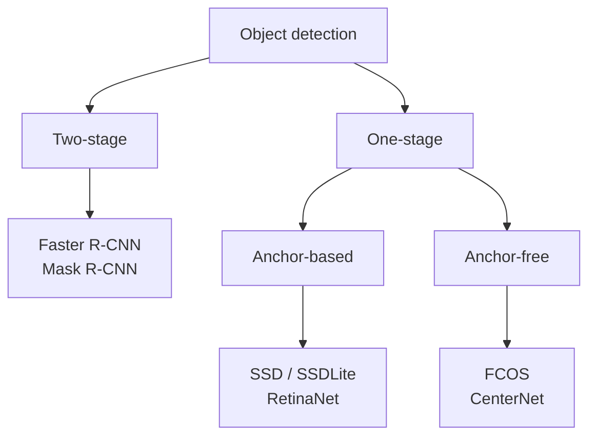

> **Learning objectives:** After this lesson, you will be able to place any object detection model on the right branch of the two-stage / one-stage and anchor-based / anchor-free taxonomy tree, and read the trade-off table between accuracy, speed and size - with numbers actually measured on the same set of images, including the places where the numbers run against popular belief.

## 1. Two design questions

Lesson 07 built the metrics. This lesson uses those metrics to compare four real models, but first we need to know where they differ.

Every object detection model has to answer the same hard question: **an image has countless possible positions and box sizes, so how do you examine them all?** Two major design choices arise from that.

**The first question: filter first and then examine closely, or examine everything directly?**

- **Two-stage** - stage one proposes a few thousand regions that *might* contain an object; stage two examines each region closely, refines the box and assigns a label. Faster R-CNN is the representative.
- **One-stage** - drops the proposal step entirely and predicts labels and boxes directly at every position on the feature map. RetinaNet, FCOS and SSD are the representatives.

**The second question: are predefined template boxes used?**

- **Anchor-based** - places a few template boxes with predefined aspect ratios and sizes at each position, and the model learns how to *adjust* them. This adds a batch of hyperparameters to choose by hand: how many aspect ratios, which sizes, what labeling threshold.
- **Anchor-free** - drops template boxes entirely. Each position on the feature map predicts its own distances to the four edges of the box. FCOS does this.

Combining the two questions gives a taxonomy tree for **detection models based on convolutional networks** - that is, the four models in this lesson and most of the names you meet from before 2020:

When you meet an unfamiliar name, the first question is which branch it sits on - most modern YOLOs are one-stage and anchor-free.

But this tree **does not cover everything**, and where it falls short is worth knowing. **DETR** and related models frame the problem quite differently: they directly predict a fixed *set* of boxes and then match them to the ground truth with an optimal matching, so there is no region proposal step, no template boxes, and **no need for NMS either**. Asking "is DETR anchor-based or anchor-free" is asking the wrong question - it does not sit on that axis. Treat this tree as a map of the convolutional family, not a complete taxonomy of every detection model.

## 2. Four models, the same set of images

Measured on **500 images sampled with a fixed random seed of 42 from COCO val2017** - exactly the selection method whose rationale lesson 07 gave. This is **measured on this machine**, not the official COCO mAP, which is computed on all 5,000 images.

| Model | Family | Parameters | AP@[.50:.95] | AP50 | AP75 | Seconds/image |
|---|---|---|---|---|---|---|
| Faster R-CNN | two-stage | 41,755,286 | 0.4051 | 0.6215 | 0.4441 | 2.02 |
| RetinaNet | one-stage, anchor-based | 34,014,999 | 0.3961 | 0.5953 | 0.4238 | 1.76 |
| **FCOS** | one-stage, **anchor-free** | 32,269,600 | **0.4365** | **0.6336** | **0.4638** | 1.57 |
| SSDLite320 | one-stage, anchor-based | **3,440,060** | 0.2371 | 0.3717 | 0.2591 | **0.06** |

This table tells three stories, and the first runs against the popular account.

**FCOS wins all three AP metrics, while being smaller and faster than Faster R-CNN.** The familiar account is "two-stage is more accurate, one-stage is faster" - it sounds reasonable because two-stage examines more carefully. In this table it is the opposite: a one-stage, anchor-free model with 9.5 million fewer parameters runs 22% faster and scores 3.1 AP points higher.

But **do not infer that "two-stage is more accurate" is outdated.** The four rows in the table above are four *specific weight sets*, and torchvision has others. These are the published numbers on all 5,000 COCO val2017 images:

| Weight set | **Published** box mAP |
|---|---|
| **Faster R-CNN ResNet50-FPN v2** (two-stage) | **46.7** |
| RetinaNet ResNet50-FPN v2 | 41.5 |
| FCOS ResNet50-FPN | 39.2 |
| Faster R-CNN ResNet50-FPN v1 (used in the table above) | 37.0 |
| SSDLite320 MobileNetV3-Large | 21.3 |

The same Faster R-CNN architecture, changing only the training recipe, goes from 37.0 to **46.7** - far ahead of FCOS. So the correct conclusion from this experiment is much narrower, and also more useful:

> Among the four specific weight sets here, FCOS is both faster and more accurate than Faster R-CNN v1. So **"two-stage is always more accurate" is not a law** - the number of stages does not by itself determine accuracy. The training recipe, the backbone, the prediction head and the weight version can all reverse the ranking.

This is the second time in the chapter we meet exactly that phenomenon: lesson 10 will show that just changing the weight set of the same ResNet-50 shifts the result by 17.8 points.

**SSDLite is a quite different kind of trade-off, not "worse".** It has **12 times** fewer parameters and is **26 times** faster than FCOS. In return, its AP is about half. On a phone, this is the only model in the table that runs in real time.

**The gap between AP50 and AP75 tells you the quality of the boxes.** FCOS falls from 0.6336 to 0.4638 when the IoU threshold is tightened from 0.5 to 0.75 - losing 17 points. SSDLite falls from 0.3717 to 0.2591. All four models lose a lot when the threshold is tightened, meaning **finding an object is easier than boxing it precisely**, exactly as the *Try it now* box in lesson 07 described.

## 3. Where SSDLite really loses

The overall AP number hides something important. Broken down by object size:

| Model | AP small objects | AP large objects |
|---|---|---|
| Faster R-CNN | 0.2562 | 0.5525 |
| RetinaNet | 0.2275 | 0.5693 |
| FCOS | **0.2664** | **0.5855** |
| SSDLite320 | **0.0176** | 0.5076 |

For **large objects**, SSDLite reaches 0.5076 - only 7.8 points behind FCOS, entirely usable. For **small objects**, it reaches **0.0176**, which is **fifteen times** worse than FCOS. It is almost blind to small objects.

The strongest candidate cause is right in the name: **SSDLite*320*** takes input images at a resolution of 320×320, while the other three models use the original images at around 800 pixels on the short side. A bird taking up 30×30 pixels in the original image shrinks to about 12×12 after downscaling - after a few pooling layers there is nothing left to recognize.

But the four models also differ in backbone, prediction head and training recipe, so this experiment **has not isolated the effect of resolution on its own**. To isolate it, you would have to run the same model at several different input resolutions - exactly in the spirit of the ablation in Deep Learning · Lesson 12.

This is the kind of finding that turns into a decision immediately:

- Counting cars on a road, camera placed close → SSDLite is a good, cheap choice
- Counting people in drone images → SSDLite is useless, every object is small
- If you must use a lightweight model for small objects → cut the image into tiles and run on each tile, trading time for resolution

> ⚠️ **A small note:** do not read the table in section 2 as an overall leaderboard. These four models run at different input resolutions, were trained with different recipes and at different times - so the table measures *four complete systems*, and cannot separate out the effect of the architecture. Saying "anchor-free is better than anchor-based" from this table is a conclusion that goes beyond the data: to conclude that, you would have to hold everything else fixed and change only the label assignment, in the spirit of the ablation experiment in Deep Learning · Lesson 12.

## 4. The number of boxes returned: read the defaults before concluding

There is one column in the raw data that the main table does not have, and it is very easy to misread. The total number of boxes each model returns on those same 500 images:

| Model | Boxes returned | Average per image |
|---|---|---|
| Faster R-CNN | 17,905 | 36 |
| FCOS | 28,648 | 57 |
| RetinaNet | 66,101 | 132 |
| SSDLite320 | **149,682** | **299** |

A difference of **eight times** between the top and bottom of the table, for the same images containing the same objects.

The tempting reading is to attribute it to the architecture: two-stage filters early so it returns few, one-stage predicts everywhere so it returns many. It sounds very reasonable - but checking each model's default parameters in torchvision shows that most of that gap comes from somewhere else:

| Model | Default score threshold | Maximum boxes per image |
|---|---|---|
| Faster R-CNN | 0.05 | 100 |
| FCOS | **0.20** | 100 |
| RetinaNet | 0.05 | **300** |
| SSDLite320 | **0.001** | **300** |

SSDLite returns an average of 299 boxes per image because its default is to **keep everything above 0.001 and up to 300 boxes** - it is hitting the ceiling of that very parameter. Faster R-CNN returns 36 boxes because its ceiling is 100 and its threshold is 50 times higher. This is **a choice by whoever packaged the library**, not a signature of the architecture.

To use the number of boxes to say something about architecture, you would first have to put all four models on the same threshold and the same ceiling - this experiment has not done that, so the table above supports only one reading: **library defaults vary a lot, and you have to check them before deploying.**

The practical consequence still stands: if you take SSDLite's output directly without filtering, you get 299 boxes for an image that usually has only a few objects, so you have to choose a threshold by cost as in Machine Learning · Lesson 12.

> ⚠️ **A small note:** but do not apply that threshold **before computing AP**. The AP computation needs the full list of predictions ranked by score, including very low-scoring predictions, because they form the high-recall tail of the precision-recall curve. Filtering before feeding the evaluator **can lower AP** - by how much depends on whether you cut off any correct predictions in the high-recall region; cutting junk predictions at the end of the list sometimes leaves AP almost unchanged. The risk is that you do not know in advance which case you are in, and you will think the model got worse when the only thing that changed is the reporting. The deployment threshold and the evaluation threshold are two separate matters.

> 🔧 **Try it now:** you need to run object detection on a camera stream at 15 frames per second, on an embedded computer without a GPU. What does the table in section 2 suggest, and what else must you ask before choosing?
> Only SSDLite320 has a chance: 0.06 seconds per image gives about 16 frames per second, while the other three models take 1.5-2 seconds, more than twenty times slower than required. But before deciding you have to ask **how large the objects to detect are in the frame**: if they are people walking past a security camera 3 meters away, a large-object AP of 0.5076 is usable; if they are screws on a conveyor belt or people at the end of a long corridor, a small-object AP of 0.0176 says plainly that this approach will not work, and you have to change direction - a higher-resolution camera plus tiling, placing the camera closer, or accepting more powerful hardware. The hardware numbers and the object-size numbers have to be decided together, not separately.

## 5. Reading a new object detection model

Combining both detection lessons into a list of questions to use when you meet an unfamiliar model:

1. **Which branch of the tree in section 1 does it sit on?** That tells you roughly whether it filters early or late.
2. **What input resolution does it take?** This number strongly affects its ability to see small objects - but as section 3 noted, it has to be read together with the backbone, prediction head and training recipe, because those four things go together and cannot be separated.
3. **How far apart are AP50 and AP75?** A large gap means it finds objects well but does not box them tightly.
4. **What does AP by object size look like?** The overall number hides where the model is blind.
5. **How many boxes does it return per image?** That determines how aggressively you have to filter.
6. **Which set were the published numbers measured on?** Almost always the whole of COCO val2017; do not compare them directly with numbers you measured on a subset.

## Lesson summary

- Two design questions split detection models **based on convolutional networks** into branches: **two-stage or one-stage**, and **anchor-based or anchor-free**. This tree does not cover everything: DETR and the set-prediction family do not sit on those two axes, and do not need NMS either.
- On 500 COCO val2017 images (seed 42), **FCOS wins all three AP metrics** (0.4365 / 0.6336 / 0.4638) while being smaller and faster than Faster R-CNN **v1**. But the published numbers show Faster R-CNN **v2** reaching 46.7 box mAP versus FCOS's 39.2 - so the correct conclusion is *the number of stages does not by itself determine accuracy*, not "two-stage is outdated".
- **SSDLite320 is not "worse" but a different trade-off**: 12 times fewer parameters, 26 times faster, AP about half.
- The overall number hides the most important part: SSDLite reaches **0.5076** on large objects but only **0.0176** on small ones - fifteen times worse than FCOS. The 320×320 input resolution is the strongest candidate cause, but the experiment has not isolated it.
- All four models drop sharply from AP50 to AP75: **finding an object is easier than boxing it precisely**.
- The number of boxes returned differs **eight times** between Faster R-CNN (36/image) and SSDLite (299/image) - but most of that comes from the **default score threshold** (0.05 versus 0.001) and the **box ceiling** (100 versus 300) in torchvision, not a signature of the architecture.
- Do not apply the deployment score threshold before computing AP: the evaluator needs the full ranked list, and filtering first can artificially lower AP.
- This table measures **four complete systems** that differ in many ways, so it cannot separate out the effect of the architecture; to conclude anything about anchor-free, you need an ablation.

## Self-check questions

1. Place YOLO and Mask R-CNN on the taxonomy tree in section 1. Why can DETR not be placed on it?
2. FCOS is smaller, faster and more accurate than Faster R-CNN v1, yet Faster R-CNN v2 reaches 46.7 versus FCOS's 39.2. What conclusion do you draw about the role of the number of stages?
3. SSDLite reaches an AP of 0.5076 on large objects but 0.0176 on small ones. Name the strongest candidate cause, and design an experiment to test it on its own.
4. SSDLite returns 299 boxes per image while Faster R-CNN returns 36. Name the main cause, and design a measurement to find out which part is really due to the architecture.
5. You filter out every prediction below 0.5 before computing AP and see AP drop. Explain.
6. A model has AP50 = 0.62 and AP75 = 0.44. Name two applications where that gap is not a problem, and two where it is a big problem.
7. Why must you not compare this lesson's 0.4365 with the AP number torchvision publishes for FCOS?
8. You have to detect small solder defects on circuit boards, with a fixed camera and no limit on processing time. Which model in the table do you choose and why? What else do you change besides choosing the model?

## Further reading

**Core sources for this lesson:**

| Source | What to read |
|---|---|
| **Lesson 07 of this chapter** | IoU, NMS, AP/mAP - every number in this lesson is read with the metrics built there |
| **Lesson 02 of this chapter** | Receptive field and stride - the background for understanding why input resolution determines the ability to see small objects |
| **Machine Learning · Lesson 12** | Choosing a threshold by cost - something you have to do with the output of every model in this lesson |
| **Dive into Deep Learning (d2l.ai)** | Chapter 14.7 *Single Shot Multibox Detection* - a full implementation of a one-stage model |

**Additional online sources (free):**

- [Ren et al. - Faster R-CNN (NeurIPS 2015)](https://arxiv.org/abs/1506.01497) - the region proposal network, the early filtering step behind the box-count column in section 4.
- [Lin et al. - Focal Loss for Dense Object Detection (RetinaNet, ICCV 2017)](https://arxiv.org/abs/1708.02002) - why one-stage models used to be less accurate, and the loss function that fixed it.
- [Tian et al. - FCOS: Fully Convolutional One-Stage Object Detection (ICCV 2019)](https://arxiv.org/abs/1904.01355) - the winning model in section 2; its section 1 explains the hyperparameters that dropping anchors eliminates.
- [Howard et al. - Searching for MobileNetV3 (ICCV 2019)](https://arxiv.org/abs/1905.02244) - the backbone of SSDLite, and techniques for making models lightweight.
- [Object detection models - torchvision documentation](https://pytorch.org/vision/stable/models.html#object-detection) - the published numbers for all four models on the full COCO val2017, to compare with the subset numbers in section 2.

> **Next lesson:** [Image Segmentation: From Classes to Individual Instances](../image-segmentation-classes-to-instances/) - a bounding box is still a crude rectangle - a dog lying curled up has a box full of background. The next lesson goes down to the pixel level, and separates two questions that are often confused: *which pixels belong to the dog class* is quite different from *which is the first dog and which is the second*.
