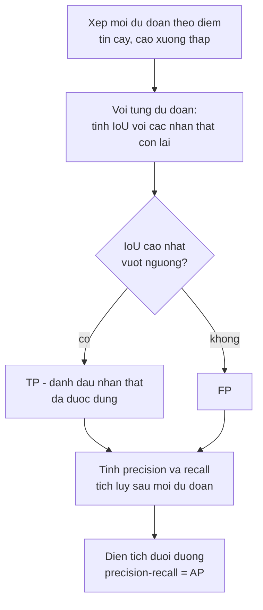

> **Mục tiêu bài học:** Sau bài này, bạn sẽ tính được IoU bằng tay và biết vì sao ngưỡng IoU là một lựa chọn chứ không phải hằng số, chạy được thuật toán NMS trong đầu và thấy chỗ nó xử sự trái trực giác, và dựng được đường precision-recall để ra con số AP - nền tảng mà bài 08 dùng để so bốn kiến trúc.

## 1. Bài toán đổi, thước đo phải đổi theo

Sáu bài đầu chương làm **phân loại**: đưa vào một ảnh, trả về một nhãn. Đúng hay sai là chuyện rõ ràng, và accuracy đếm được.

Phát hiện vật thể hỏi câu khác: *trong ảnh có những gì, và mỗi thứ nằm ở đâu.* Đầu ra không còn là một nhãn mà là một **danh sách dài ngắn tùy ảnh**, mỗi mục gồm ba phần:

```
{ hộp giới hạn (x1, y1, x2, y2),  nhãn lớp,  điểm tin cậy }
```

Ba thứ này làm mọi thước đo của bài toán phân loại trở nên vô dụng, vì bây giờ có ít nhất bốn kiểu sai khác hẳn nhau:

- Khoanh đúng vật nhưng lệch khung
- Khoanh đúng khung nhưng gọi sai tên
- Bỏ sót hẳn một vật
- Khoanh ra một vật không tồn tại

Bài này dựng thước đo cho từng kiểu. Bài 08 mới đem thước đo ấy đi so các kiến trúc.

## 2. IoU: khoanh gần đúng là gần bao nhiêu

Không thể đòi mô hình khoanh trúng từng pixel. Cần một con số cho biết hai khung *chồng nhau bao nhiêu* - đó là **IoU** (intersection over union, giao trên hợp):

$$\text{IoU} = \frac{\text{diện tích phần giao}}{\text{diện tích phần hợp}}$$

Lấy một khung chuẩn $A = (100, 100, 200, 200)$ - cạnh 100, diện tích 10.000 - rồi thử năm khung $B$ khác nhau. Tính tay, rồi đối chiếu với `torchvision.ops.box_iou`:

| Tình huống | Khung $B$ | Giao | Hợp | IoU (tay) | IoU (thư viện) |
|---|---|---|---|---|---|
| Trùng khớp | (100, 100, 200, 200) | 10.000 | 10.000 | **1,0** | 1,0 |
| Lệch nửa khung | (150, 100, 250, 200) | 5.000 | 15.000 | **0,3333** | 0,3333 |
| Nằm lọt bên trong | (125, 125, 175, 175) | 2.500 | 10.000 | **0,25** | 0,25 |
| Chạm góc | (190, 190, 290, 290) | 100 | 19.900 | **0,005** | 0,005 |
| Rời hẳn | (300, 300, 400, 400) | 0 | 20.000 | **0,0** | 0,0 |

```python
xa, ya = max(A[0], B[0]), max(A[1], B[1])      # góc trên-trái của phần giao
xb, yb = min(A[2], B[2]), min(A[3], B[3])      # góc dưới-phải
intersection_area = max(0, xb - xa) * max(0, yb - ya)       # max(0, ...) lo trường hợp rời nhau
union_area  = area_a + area_b - intersection_area
iou  = intersection_area / union_area
```

Hai dòng giữa bảng đáng chú ý. **Lệch nửa khung cho IoU 0,3333** - nghe như "sai một nửa" nhưng con số chỉ còn một phần ba, vì phần hợp phình ra trong khi phần giao co lại: IoU phạt nặng hơn cảm nhận trực giác. Và **khung nhỏ nằm gọn bên trong khung đúng cũng chỉ được 0,25**, dù nó không hề khoanh sai chỗ nào - nó chỉ khoanh thiếu. IoU không phân biệt "khoanh lệch" với "khoanh thiếu"; cả hai đều bị trừ điểm.

**Ngưỡng IoU là một lựa chọn.** Quy ước phổ biến nhất coi IoU ≥ 0,5 là "khoanh trúng", nhưng con số 0,5 không có gì thiêng liêng. Đếm chai trên băng chuyền thì 0,5 quá đủ; robot gắp vật thì 0,5 là thảm họa. Đây đúng là chuyện chọn ngưỡng theo chi phí mà chương Machine Learning · Bài 12 đã làm với xác suất, nay xuất hiện dưới dạng hình học.

## 3. NMS: dọn những khung trùng nhau

Các mô hình phát hiện dựa trên mạng tích chập - cả bốn mô hình của bài 08 - đều sinh ra **rất nhiều khung cho cùng một vật** - chúng dự đoán ở mọi vị trí, nên quanh một con chó sẽ có cả chục khung lệch nhau vài pixel. **Non-maximum suppression** (NMS, "chặn cái không lớn nhất") dọn chỗ ấy, và thuật toán chỉ có ba bước. (Có những họ mô hình mới hơn không cần bước này - bài 08 sẽ nói tới khi bàn về giới hạn của cây phân loại.)

```
1. Sắp mọi khung theo điểm tin cậy, cao xuống thấp
2. Lấy khung điểm cao nhất còn lại, giữ nó
3. Xóa mọi khung có IoU với nó vượt ngưỡng. Quay lại bước 2.
```

Thử trên năm khung. Cột cuối là IoU của từng khung với khung 0:

| # | Khung | Điểm | IoU với khung 0 |
|---|---|---|---|
| 0 | (100, 100, 200, 200) | **0,92** | 1,000 |
| 1 | (108, 108, 208, 208) | 0,85 | 0,734 |
| 2 | (140, 100, 240, 200) | 0,78 | 0,429 |
| 3 | (170, 100, 270, 200) | 0,66 | 0,176 |
| 4 | (400, 400, 500, 500) | 0,81 | 0,000 |

Chạy `torchvision.ops.nms` ở ba ngưỡng:

| Ngưỡng IoU | Khung được giữ | Điểm tương ứng |
|---|---|---|
| 0,7 | 0, 4, 2, 3 | 0,92 · 0,81 · 0,78 · 0,66 |
| 0,5 | 0, 4, 2 | 0,92 · 0,81 · 0,78 |
| **0,3** | **0, 4, 3** | 0,92 · 0,81 · **0,66** |

Dòng cuối là chỗ đáng dừng lại rất lâu. Ngưỡng **chặt hơn** (0,3) lại giữ khung điểm **0,66** và vứt khung điểm **0,78**. Nghe vô lý, nhưng lần theo thuật toán thì hợp lý hoàn toàn:

- Khung 0 (0,92) được giữ. Nó xóa khung 1 (IoU 0,734 > 0,3) **và cả khung 2** (IoU 0,429 > 0,3).
- Khung 4 (0,81) không chồng ai, được giữ.
- Khung 3 (0,66) có IoU với khung 0 chỉ 0,176 < 0,3, nên sống sót.

Ở ngưỡng 0,5 thì khung 2 thoát khỏi khung 0 (0,429 < 0,5), được giữ, rồi **chính nó** xóa khung 3 (IoU giữa hai khung này là 0,538).

Bài học: **NMS là thuật toán tham lam, và kết quả phụ thuộc thứ tự xử lý.** Nó không tìm tập khung tốt nhất; nó chỉ đi từ trên xuống và xóa hàng xóm. Đổi ngưỡng không đơn giản là "giữ nhiều hơn hay ít hơn" - nó đổi cả *khung nào* được giữ.

> ⚠️ **Lưu ý nhỏ:** ngưỡng NMS và ngưỡng IoU ở mục 2 là **hai thứ hoàn toàn khác nhau**, dù cùng tên và cùng nằm trong khoảng 0-1. Ngưỡng NMS quyết định lúc *sinh dự đoán*: bao nhiêu chồng lấn thì coi là trùng. Ngưỡng IoU ở mục 2 quyết định lúc *chấm điểm*: bao nhiêu chồng lấn với nhãn thật thì coi là đúng. Đọc code người khác mà lẫn hai cái này thì mọi con số sau đó đều sai.

## 4. Precision, recall và AP

Giờ mới tới phần chấm điểm. Với một lớp và một ngưỡng IoU đã chọn, thủ tục là:



Chi tiết dễ bỏ sót nằm ở ô "đánh dấu nhãn thật đã được dùng": **mỗi nhãn thật chỉ khớp được một lần**. Khung thứ hai khoanh trúng cùng con chó ấy là FP, không phải TP - nếu không, mô hình chỉ cần phun thật nhiều khung quanh mỗi vật là recall lên 100%.

Lấy một ví dụ nhỏ tính được bằng tay: **5 nhãn thật**, 8 dự đoán đã xếp theo điểm, trong đó dự đoán số 1, 2, 4, 7 là đúng:

| # | TP? | TP tích lũy | Precision | Recall | Precision nội suy |
|---|---|---|---|---|---|
| 1 | ✓ | 1 | 1,0000 | 0,2 | 1,0000 |
| 2 | ✓ | 2 | 1,0000 | 0,4 | 1,0000 |
| 3 | ✗ | 2 | 0,6667 | 0,4 | 0,7500 |
| 4 | ✓ | 3 | 0,7500 | 0,6 | 0,7500 |
| 5 | ✗ | 3 | 0,6000 | 0,6 | 0,6000 |
| 6 | ✗ | 3 | 0,5000 | 0,6 | 0,5714 |
| 7 | ✓ | 4 | 0,5714 | 0,8 | 0,5714 |
| 8 | ✗ | 4 | 0,5000 | 0,8 | 0,5000 |

Precision là "trong những cái đã báo, bao nhiêu phần đúng"; recall là "trong những cái có thật, bắt được bao nhiêu phần" - đúng hai định nghĩa của chương Machine Learning · Bài 03, chỉ khác chỗ "đúng" bây giờ do IoU quyết định.

Cột cuối cần giải thích. Đường precision-recall thật thì răng cưa: cứ gặp một FP là precision tụt, gặp TP lại nhích lên. **Precision nội suy** làm phẳng răng cưa bằng cách, tại mỗi mức recall, lấy precision *lớn nhất ở bất kỳ mức recall nào từ đó trở đi*. Nhìn dòng 3: precision thật 0,6667 được nâng thành 0,7500, vì đi tiếp tới dòng 4 sẽ đạt 0,7500.

**AP** là diện tích dưới đường đã nội suy ấy. Với ví dụ trên:

$$\text{AP} = 0{,}2 \times 1{,}0 + 0{,}2 \times 1{,}0 + 0{,}2 \times 0{,}75 + 0{,}2 \times 0{,}5714 = \mathbf{0{,}6643}$$

Bốn số hạng ứng với bốn lần recall nhích lên (0 → 0,2 → 0,4 → 0,6 → 0,8), mỗi lần nhân với precision nội suy tại đó. Recall dừng ở 0,8 vì mô hình bỏ sót một trong năm nhãn thật, và phần recall từ 0,8 đến 1,0 đóng góp đúng bằng 0.

**mAP** chỉ là AP lấy trung bình qua các lớp - chữ *m* là *mean*. Và trong quy ước COCO, nó còn lấy trung bình qua **10 ngưỡng IoU** từ 0,50 đến 0,95, bước 0,05; ký hiệu là AP@[.50:.95]. Vì thế bài 08 sẽ báo ba con số chứ không một: AP@[.50:.95], AP50 và AP75.

> ⚠️ **Lưu ý nhỏ:** phép tích phân ở ví dụ trên là bản đơn giản để hiểu bản chất. `pycocotools` - thứ bài 08 dùng để chấm - lấy precision tại **101 mức recall** cố định từ 0,00 đến 1,00 rồi trung bình, thay vì cộng theo từng bậc nhảy như ta vừa làm. Hai cách cho kết quả gần nhau nhưng không trùng khít. Nên dùng con số 0,6643 để hiểu *AP là gì*, đừng dùng nó để đối chiếu từng chữ số với đầu ra của thư viện.

> 🔧 **Thử ngay:** một mô hình có AP50 = 0,72 nhưng AP75 = 0,31. Nó đang giỏi gì và dở gì?
> Nó **tìm và định vị vật thể ổn khi tiêu chuẩn chồng lấn lỏng, nhưng khoanh khung không chặt**. Chú ý cách đọc: AP là diện tích dưới đường precision-recall, **không phải tỉ lệ vật thể tìm được** - muốn biết "bắt được bao nhiêu phần" thì phải nhìn recall chứ không nhìn AP. Điều AP50 = 0,72 nói là mô hình giữ được precision và recall khá tốt *đồng thời* khi chỉ đòi chồng lấn 50%. Khi siết lên 75% thì phần lớn số ca ấy rớt, nghĩa là các khung tuy trúng vật nhưng lệch hoặc rộng/hẹp hơn khung thật. Với robot cần biết chính xác biên vật thể để gắp thì mô hình này không dùng được. Còn với bài toán chỉ cần đếm số người trong ảnh thì **khoảng cách AP50-AP75 nhiều khả năng không quan trọng** - nhưng đừng chốt bằng AP: hãy đo thẳng thứ bạn cần, tức sai số đếm, cùng precision và recall ở đúng ngưỡng bạn sẽ triển khai.

## 5. Vì sao phải nói rõ "đo trên tập nào"

Bài 01 đã dựng quy ước ba loại con số. Phát hiện vật thể là chỗ quy ước ấy quan trọng nhất, vì một lý do kỹ thuật: **AP không phải trung bình của các giá trị đo trên từng ảnh.** Nó được tính từ *toàn bộ* danh sách dự đoán trên *toàn bộ* tập, xếp chung theo điểm tin cậy. Cùng một mô hình, chạy trên 500 ảnh và trên 5.000 ảnh, cho ra hai con số khác nhau - và không có phép trung bình nào nối chúng lại.

Hệ quả trực tiếp: **"mAP trên một ảnh" không dùng làm thước đo được.** Về mặt tính toán thì vẫn tính ra được một con số - nhưng với một ảnh, đường precision-recall chỉ có vài điểm và diện tích dưới nó là chuyện ngẫu nhiên của đúng tấm ảnh ấy, nên nó không nói được gì về khả năng khái quát. Bài 08 vì thế tách đôi: một ảnh để *nhìn* mô hình sai kiểu gì, và một tập con cố định để *đo* AP.

Và khi đo trên tập con, phải nói rõ tập con nào. Bài 08 dùng **500 ảnh lấy ngẫu nhiên cố định từ COCO val2017 với seed 42**, chứ không phải 500 ảnh đầu - thứ tự tệp trong một bộ dữ liệu có thể mang cấu trúc nào đó, và lấy phần đầu là chuốc lấy rủi ro không cần thiết:

```python
import numpy as np
rng = np.random.default_rng(42)
subset_ids = rng.choice(len(all_ids), size=500, replace=False)
```

Con số ấy **không phải** COCO mAP chính thức, vốn tính trên đủ 5.000 ảnh. Nó dùng để so bốn mô hình *với nhau* trong cùng điều kiện, và bài 08 sẽ luôn gọi nó bằng đúng tên.

## Tóm tắt bài học

- Phát hiện vật thể trả về một danh sách dài ngắn tùy ảnh gồm hộp, nhãn và điểm tin cậy, nên có bốn kiểu sai khác nhau và không dùng lại được thước đo của phân loại.
- **IoU** = giao chia hợp. Nó phạt nặng hơn trực giác: lệch nửa khung chỉ còn 0,3333, khung nhỏ nằm gọn bên trong khung đúng chỉ được 0,25.
- Ngưỡng IoU coi thế nào là "trúng" là một **lựa chọn theo bài toán**, không phải hằng số 0,5.
- **NMS** là thuật toán tham lam: giữ khung điểm cao nhất rồi xóa hàng xóm. Đổi ngưỡng đổi cả khung nào được giữ - ở ví dụ mục 3, ngưỡng 0,3 giữ khung 0,66 và vứt khung 0,78.
- Ngưỡng NMS (lúc sinh dự đoán) và ngưỡng IoU (lúc chấm điểm) là hai thứ khác nhau dù cùng tên.
- **AP** là diện tích dưới đường precision-recall đã nội suy, với quy tắc mỗi nhãn thật chỉ khớp được một lần. Ví dụ 5 nhãn thật / 8 dự đoán cho AP = 0,6643.
- **mAP** lấy trung bình qua các lớp; quy ước COCO còn lấy trung bình qua 10 ngưỡng IoU từ 0,50 đến 0,95.
- AP tính trên toàn tập chứ không phải trung bình theo ảnh, nên **"mAP trên một ảnh" không dùng làm thước đo được** - và mọi con số AP phải kèm tên tập đã đo.
- **AP không phải recall.** Muốn nói "bắt được bao nhiêu phần vật thể" thì phải báo recall.

## Câu hỏi tự kiểm tra

1. Hai khung cùng kích thước 100×100, lệch nhau 50 pixel theo chiều ngang. IoU bằng bao nhiêu? Tính tay.
2. Một khung dự đoán nằm gọn bên trong khung thật và có diện tích bằng một phần tư. IoU là bao nhiêu, và vì sao con số ấy thấp hơn cảm nhận "khoanh đúng chỗ"?
3. Vì sao ngưỡng NMS chặt hơn lại có thể giữ một khung có điểm tin cậy thấp hơn? Lần theo ví dụ ở mục 3.
4. Phân biệt ngưỡng NMS với ngưỡng IoU dùng để chấm điểm. Chuyện gì xảy ra nếu lẫn hai cái?
5. Vì sao mỗi nhãn thật chỉ được khớp một lần? Mô hình sẽ khai thác thế nào nếu bỏ quy tắc ấy?
6. Mô hình A có AP50 = 0,80 và AP75 = 0,40; mô hình B có AP50 = 0,65 và AP75 = 0,58. Bạn chọn cái nào cho bài toán đếm số xe trên đường, và cái nào cho robot gắp linh kiện?
7. Vì sao không thể lấy AP đo trên từng ảnh rồi trung bình lại để ra AP của cả tập?

## Đọc thêm

**Nguồn nền tảng của bài:**

| Nguồn | Đọc phần nào |
|---|---|
| **Chương Machine Learning · Bài 03** | Precision, recall và đánh đổi giữa chúng - bài này dùng lại nguyên định nghĩa, chỉ đổi cách quyết định thế nào là "đúng" |
| **Chương Machine Learning · Bài 12** | Chọn ngưỡng theo chi phí - cùng một tư duy với việc chọn ngưỡng IoU |
| **Dive into Deep Learning (d2l.ai)** | Chương 14.3 *Object Detection and Bounding Boxes*, 14.4 *Anchor Boxes* (mục về IoU và NMS) |

**Nguồn online bổ sung (miễn phí):**

- [COCO detection evaluation](https://cocodataset.org/#detection-eval) - định nghĩa chính thức của AP@[.50:.95], AP50, AP75 và các mức theo kích thước vật thể.
- [`torchvision.ops` - tài liệu](https://pytorch.org/vision/stable/ops.html) - `box_iou`, `nms`, `batched_nms` và khác biệt giữa chúng.
- [pycocotools](https://github.com/ppwwyyxx/cocoapi) - cài đặt tham chiếu của phép tính mAP, thứ bài 08 dùng để chấm.
- [Everingham và cộng sự - The PASCAL VOC Challenge (IJCV 2010)](https://homepages.inf.ed.ac.uk/ckiw/postscript/ijcv_voc09.pdf) - mục 4.2 giải thích precision nội suy và vì sao cần nó.
- [Padilla và cộng sự - A Survey on Performance Metrics for Object-Detection Algorithms (2020)](https://ieeexplore.ieee.org/document/9145130) - so sánh các biến thể mAP giữa các bộ dữ liệu, hữu ích khi đọc số của người khác.

> **Bài tiếp theo:** [Phát hiện vật thể II: các họ kiến trúc](../object-detection-architecture-families-vi/) - có thước đo rồi thì mới đo được. Bài sau chạy bốn mô hình thật - Faster R-CNN, RetinaNet, FCOS và SSDLite - trên cùng 500 ảnh, để trả lời hai giai đoạn khác một giai đoạn ở chỗ nào, anchor-free khác anchor-based ra sao, và cái giá của mỗi lựa chọn là bao nhiêu.
