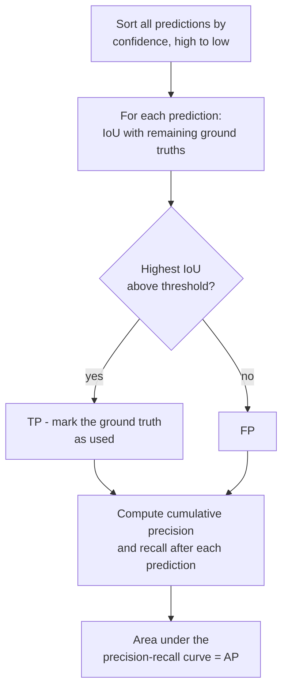

> **Learning objectives:** After this lesson, you will be able to compute IoU by hand and know why the IoU threshold is a choice rather than a constant, run the NMS algorithm in your head and see where it behaves counter-intuitively, and build the precision-recall curve to get the AP number - the foundation lesson 08 uses to compare four architectures.

## 1. The problem changes, so the metric must change too

The first six lessons of the chapter do **classification**: put in an image, get back one label. Right or wrong is clear-cut, and accuracy can be counted.

Object detection asks a different question: *what is in the image, and where is each thing.* The output is no longer one label but a **list whose length varies from image to image**, each entry made of three parts:

```
{ bounding box (x1, y1, x2, y2),  class label,  confidence score }
```

These three things make every classification metric useless, because there are now at least four quite different kinds of error:

- Boxing the right object but with the box misaligned
- Boxing the right region but giving it the wrong name
- Missing an object entirely
- Boxing an object that does not exist

This lesson builds a metric for each kind. Only lesson 08 takes those metrics to compare architectures.

## 2. IoU: how close is "roughly right"

You cannot demand that a model boxes every pixel exactly. You need a number that says how much two boxes *overlap* - that is **IoU** (intersection over union):

$$\text{IoU} = \frac{\text{area of the intersection}}{\text{area of the union}}$$

Take a reference box $A = (100, 100, 200, 200)$ - side 100, area 10,000 - and try five different boxes $B$. Compute by hand, then check against `torchvision.ops.box_iou`:

| Situation | Box $B$ | Intersection | Union | IoU (by hand) | IoU (library) |
|---|---|---|---|---|---|
| Exact match | (100, 100, 200, 200) | 10,000 | 10,000 | **1.0** | 1.0 |
| Shifted by half a box | (150, 100, 250, 200) | 5,000 | 15,000 | **0.3333** | 0.3333 |
| Fully inside | (125, 125, 175, 175) | 2,500 | 10,000 | **0.25** | 0.25 |
| Touching corners | (190, 190, 290, 290) | 100 | 19,900 | **0.005** | 0.005 |
| Completely apart | (300, 300, 400, 400) | 0 | 20,000 | **0.0** | 0.0 |

```python
xa, ya = max(A[0], B[0]), max(A[1], B[1])      # top-left corner of the intersection
xb, yb = min(A[2], B[2]), min(A[3], B[3])      # bottom-right corner
intersection_area = max(0, xb - xa) * max(0, yb - ya)       # max(0, ...) handles the disjoint case
union_area  = area_a + area_b - intersection_area
iou  = intersection_area / union_area
```

The two middle rows of the table deserve attention. **Shifting by half a box gives an IoU of 0.3333** - it sounds like "half wrong" but the number is only one third, because the union grows while the intersection shrinks: IoU penalizes more heavily than intuition suggests. And **a small box sitting entirely inside the correct box also gets only 0.25**, even though it does not box anything in the wrong place - it just boxes too little. IoU does not distinguish "boxing off-target" from "boxing too little"; both lose points.

**The IoU threshold is a choice.** The most common convention treats IoU ≥ 0.5 as "a hit", but there is nothing sacred about 0.5. For counting bottles on a conveyor belt, 0.5 is more than enough; for a robot picking up objects, 0.5 is a disaster. This is exactly the cost-based threshold choice that Machine Learning · Lesson 12 made with probabilities, now appearing in geometric form.

## 3. NMS: cleaning up overlapping boxes

Detection models based on convolutional networks - all four models in lesson 08 - produce **many boxes for the same object** - they predict at every position, so around one dog there will be a dozen boxes shifted by a few pixels. **Non-maximum suppression** (NMS, "suppress whatever is not the maximum") cleans that up, and the algorithm has only three steps. (Some newer model families do not need this step - lesson 08 will come back to it when discussing the limits of the taxonomy tree.)

```
1. Sort all boxes by confidence score, high to low
2. Take the highest-scoring box that remains, keep it
3. Delete every box whose IoU with it exceeds the threshold. Go back to step 2.
```

Try it on five boxes. The last column is the IoU of each box with box 0:

| # | Box | Score | IoU with box 0 |
|---|---|---|---|
| 0 | (100, 100, 200, 200) | **0.92** | 1.000 |
| 1 | (108, 108, 208, 208) | 0.85 | 0.734 |
| 2 | (140, 100, 240, 200) | 0.78 | 0.429 |
| 3 | (170, 100, 270, 200) | 0.66 | 0.176 |
| 4 | (400, 400, 500, 500) | 0.81 | 0.000 |

Running `torchvision.ops.nms` at three thresholds:

| IoU threshold | Boxes kept | Corresponding scores |
|---|---|---|
| 0.7 | 0, 4, 2, 3 | 0.92 · 0.81 · 0.78 · 0.66 |
| 0.5 | 0, 4, 2 | 0.92 · 0.81 · 0.78 |
| **0.3** | **0, 4, 3** | 0.92 · 0.81 · **0.66** |

The last row is where it is worth pausing for a long time. The **stricter** threshold (0.3) keeps the box scoring **0.66** and throws away the box scoring **0.78**. It sounds absurd, but tracing the algorithm shows it is entirely logical:

- Box 0 (0.92) is kept. It deletes box 1 (IoU 0.734 > 0.3) **and box 2 as well** (IoU 0.429 > 0.3).
- Box 4 (0.81) overlaps nothing, so it is kept.
- Box 3 (0.66) has an IoU of only 0.176 < 0.3 with box 0, so it survives.

At threshold 0.5, box 2 escapes box 0 (0.429 < 0.5) and is kept, and then **box 2 itself** deletes box 3 (the IoU between these two boxes is 0.538).

The lesson: **NMS is a greedy algorithm, and its result depends on the processing order.** It does not look for the best set of boxes; it just goes from the top down deleting neighbors. Changing the threshold is not simply "keep more or fewer" - it also changes *which boxes* are kept.

> ⚠️ **A small note:** the NMS threshold and the IoU threshold in section 2 are **two completely different things**, even though they share a name and both lie in the 0-1 range. The NMS threshold decides at *prediction time*: how much overlap counts as a duplicate. The IoU threshold in section 2 decides at *scoring time*: how much overlap with the ground truth counts as correct. Mix these two up when reading someone else's code and every number after that is wrong.

## 4. Precision, recall and AP

Now for the scoring. For one class and one chosen IoU threshold, the procedure is:



The easily missed detail is in the box "mark the ground truth as used": **each ground truth can be matched only once**. A second box that hits the same dog is an FP, not a TP - otherwise a model could just spray lots of boxes around every object and push recall to 100%.

Take a small example that can be computed by hand: **5 ground truths**, 8 predictions sorted by score, of which predictions 1, 2, 4 and 7 are correct:

| # | TP? | Cumulative TP | Precision | Recall | Interpolated precision |
|---|---|---|---|---|---|
| 1 | ✓ | 1 | 1.0000 | 0.2 | 1.0000 |
| 2 | ✓ | 2 | 1.0000 | 0.4 | 1.0000 |
| 3 | ✗ | 2 | 0.6667 | 0.4 | 0.7500 |
| 4 | ✓ | 3 | 0.7500 | 0.6 | 0.7500 |
| 5 | ✗ | 3 | 0.6000 | 0.6 | 0.6000 |
| 6 | ✗ | 3 | 0.5000 | 0.6 | 0.5714 |
| 7 | ✓ | 4 | 0.5714 | 0.8 | 0.5714 |
| 8 | ✗ | 4 | 0.5000 | 0.8 | 0.5000 |

Precision is "of the things reported, what fraction is correct"; recall is "of the things that really exist, what fraction was caught" - exactly the two definitions from Machine Learning · Lesson 03, the only difference being that "correct" is now decided by IoU.

The last column needs explaining. The real precision-recall curve is jagged: every FP makes precision drop, every TP nudges it back up. **Interpolated precision** smooths out the jaggedness by taking, at each recall level, the *highest precision at any recall level from there onward*. Look at row 3: the real precision of 0.6667 is raised to 0.7500, because continuing to row 4 reaches 0.7500.

**AP** is the area under that interpolated curve. For the example above:

$$\text{AP} = 0.2 \times 1.0 + 0.2 \times 1.0 + 0.2 \times 0.75 + 0.2 \times 0.5714 = \mathbf{0.6643}$$

The four terms correspond to the four times recall steps up (0 → 0.2 → 0.4 → 0.6 → 0.8), each multiplied by the interpolated precision at that point. Recall stops at 0.8 because the model missed one of the five ground truths, and the recall range from 0.8 to 1.0 contributes exactly 0.

**mAP** is just AP averaged over classes - the *m* stands for *mean*. And in the COCO convention, it is also averaged over **10 IoU thresholds** from 0.50 to 0.95 in steps of 0.05; written AP@[.50:.95]. That is why lesson 08 will report three numbers rather than one: AP@[.50:.95], AP50 and AP75.

> ⚠️ **A small note:** the integration in the example above is a simplified version for understanding the essence. `pycocotools` - which lesson 08 uses for scoring - takes precision at **101 fixed recall levels** from 0.00 to 1.00 and averages them, instead of summing step by step as we just did. The two methods give close but not identical results. So use the number 0.6643 to understand *what AP is*, and do not use it to check digit by digit against the library's output.

> 🔧 **Try it now:** a model has AP50 = 0.72 but AP75 = 0.31. What is it good at and what is it bad at?
> It **finds and localizes objects reasonably well when the overlap criterion is loose, but does not draw tight boxes**. Note how to read it: AP is the area under the precision-recall curve, **not the fraction of objects found** - to know "what fraction was caught" you have to look at recall, not AP. What AP50 = 0.72 says is that the model maintains fairly good precision and recall *at the same time* when only 50% overlap is required. When tightened to 75%, most of those cases drop out, meaning the boxes hit the object but are shifted or wider/narrower than the true box. For a robot that needs to know the exact boundary of an object to grasp it, this model is unusable. For a problem that only needs to count the people in an image, **the AP50-AP75 gap most likely does not matter** - but do not decide by AP: measure directly what you need, namely the counting error, together with precision and recall at exactly the threshold you will deploy.

## 5. Why you must state "measured on which set"

Lesson 01 set up the convention of three kinds of numbers. Object detection is where that convention matters most, for a technical reason: **AP is not an average of values measured on individual images.** It is computed from the *entire* list of predictions over the *entire* set, sorted together by confidence score. The same model, run on 500 images and on 5,000 images, gives two different numbers - and no averaging connects them.

The direct consequence: **"mAP on a single image" cannot be used as a metric.** Computationally a number can still be produced - but with one image, the precision-recall curve has only a few points and the area under it is an accident of that particular image, so it says nothing about generalization. Lesson 08 therefore splits in two: one image to *look at* how the model goes wrong, and a fixed subset to *measure* AP.

And when measuring on a subset, you must state which subset. Lesson 08 uses **500 images sampled with a fixed random seed of 42 from COCO val2017**, not the first 500 images - the file order in a dataset may carry some structure, and taking the first part invites unnecessary risk:

```python
import numpy as np
rng = np.random.default_rng(42)
subset_ids = rng.choice(len(all_ids), size=500, replace=False)
```

That number is **not** the official COCO mAP, which is computed on all 5,000 images. It is used to compare four models *with each other* under the same conditions, and lesson 08 will always call it by its proper name.

## Lesson summary

- Object detection returns a list of variable length per image made of boxes, labels and confidence scores, so there are four different kinds of error and classification metrics cannot be reused.
- **IoU** = intersection divided by union. It penalizes more heavily than intuition: shifting by half a box leaves only 0.3333, a small box sitting entirely inside the correct box gets only 0.25.
- The IoU threshold for what counts as "a hit" is a **choice that depends on the problem**, not a constant 0.5.
- **NMS** is a greedy algorithm: keep the highest-scoring box and delete its neighbors. Changing the threshold also changes which boxes are kept - in the section 3 example, threshold 0.3 keeps the 0.66 box and throws away the 0.78 box.
- The NMS threshold (at prediction time) and the IoU threshold (at scoring time) are two different things despite sharing a name.
- **AP** is the area under the interpolated precision-recall curve, with the rule that each ground truth can be matched only once. The example with 5 ground truths / 8 predictions gives AP = 0.6643.
- **mAP** averages over classes; the COCO convention also averages over 10 IoU thresholds from 0.50 to 0.95.
- AP is computed over the whole set rather than averaged per image, so **"mAP on a single image" cannot be used as a metric** - and every AP number must come with the name of the set it was measured on.
- **AP is not recall.** To say "what fraction of objects was caught", you have to report recall.

## Self-check questions

1. Two boxes of the same size 100×100 are shifted 50 pixels apart horizontally. What is the IoU? Compute it by hand.
2. A predicted box lies entirely inside the true box and has one quarter of its area. What is the IoU, and why is that number lower than the feeling of "boxing the right place"?
3. Why can a stricter NMS threshold keep a box with a lower confidence score? Trace through the example in section 3.
4. Distinguish the NMS threshold from the IoU threshold used for scoring. What happens if you mix them up?
5. Why can each ground truth be matched only once? How would a model exploit it if that rule were dropped?
6. Model A has AP50 = 0.80 and AP75 = 0.40; model B has AP50 = 0.65 and AP75 = 0.58. Which would you choose for counting cars on a road, and which for a robot picking up components?
7. Why can you not take AP measured on each image and average them to get the AP of the whole set?

## Further reading

**Core sources for this lesson:**

| Source | What to read |
|---|---|
| **Machine Learning · Lesson 03** | Precision, recall and the trade-off between them - this lesson reuses the exact definitions, changing only how "correct" is decided |
| **Machine Learning · Lesson 12** | Choosing a threshold by cost - the same thinking as choosing the IoU threshold |
| **Dive into Deep Learning (d2l.ai)** | Chapter 14.3 *Object Detection and Bounding Boxes*, 14.4 *Anchor Boxes* (the parts on IoU and NMS) |

**Additional online sources (free):**

- [COCO detection evaluation](https://cocodataset.org/#detection-eval) - the official definition of AP@[.50:.95], AP50, AP75 and the object-size breakdowns.
- [`torchvision.ops` - documentation](https://pytorch.org/vision/stable/ops.html) - `box_iou`, `nms`, `batched_nms` and the differences between them.
- [pycocotools](https://github.com/ppwwyyxx/cocoapi) - the reference implementation of the mAP computation, which lesson 08 uses for scoring.
- [Everingham et al. - The PASCAL VOC Challenge (IJCV 2010)](https://homepages.inf.ed.ac.uk/ckiw/postscript/ijcv_voc09.pdf) - section 4.2 explains interpolated precision and why it is needed.
- [Padilla et al. - A Survey on Performance Metrics for Object-Detection Algorithms (2020)](https://ieeexplore.ieee.org/document/9145130) - compares mAP variants across datasets, useful when reading other people's numbers.

> **Next lesson:** [Object Detection II: Architecture Families](../object-detection-architecture-families/) - once you have a metric, you can measure. The next lesson runs four real models - Faster R-CNN, RetinaNet, FCOS and SSDLite - on the same 500 images, to answer where two-stage differs from one-stage, how anchor-free differs from anchor-based, and what each choice costs.
