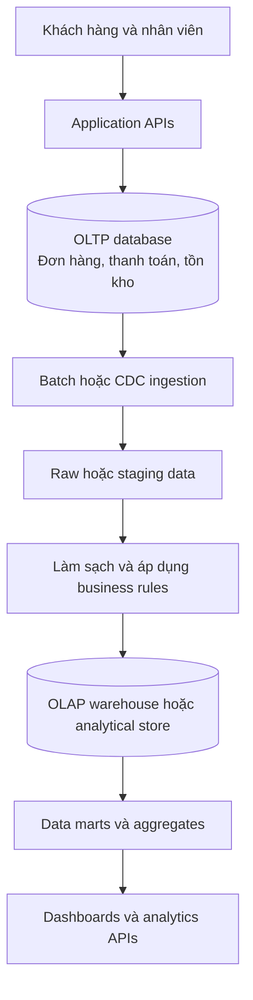
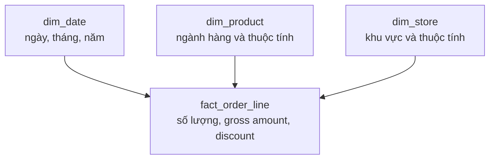

*Một database xử lý hàng nghìn đơn hàng vẫn ổn. Nhưng khi thêm dashboard doanh thu, những API trước đây rất nhanh lại bắt đầu chậm đi. Vấn đề chỉ nằm ở câu SQL, hay chúng ta đang yêu cầu một database phục vụ hai loại công việc khác nhau?*

## 1. Khi hệ thống bán hàng có thêm dashboard

Giả sử một nền tảng thương mại điện tử dùng PostgreSQL để lưu `orders`, `order_items`, `products`, `stores` và `payments`. Việc tạo đơn hàng thay đổi một số ít rows trong Transaction. Tra cứu đơn theo ID hoặc cửa hàng cũng nhanh. Sau đó, người quản lý muốn xem doanh thu 12 tháng, nhóm sản phẩm bán chạy và tốc độ tăng trưởng của các cửa hàng.

Dashboard đầu tiên truy vấn ngay trên PostgreSQL đang phục vụ giao dịch:

```sql
SELECT
    DATE_TRUNC('month', o.paid_at) AS month,
    SUM(oi.quantity * oi.unit_price) AS gross_amount
FROM orders o
JOIN order_items oi ON oi.order_id = o.id
WHERE o.status = 'paid'
  AND o.paid_at >= TIMESTAMPTZ '2025-01-01 00:00:00+00'
GROUP BY 1
ORDER BY 1;
```

Truy vấn này chỉ minh họa tổng giá trị các dòng hàng đã thanh toán. Nó chưa xử lý giảm giá, hoàn tiền, phí vận chuyển hay định nghĩa doanh thu theo kế toán. Với ít dữ liệu, kết quả có thể đến rất nhanh. Nhưng khi số dòng hàng lên tới hàng chục triệu, mỗi lần refresh có thể tiêu tốn đáng kể CPU, I/O, bộ nhớ và connections. Nhiều người cùng mở dashboard thì cả API tạo đơn, tra cứu tồn kho không liên quan cũng có thể chậm đi.

Index, SQL tốt hơn và thêm tài nguyên server đều có thể giúp. Nhưng câu hỏi lớn hơn là: **workload giao dịch và workload phân tích lịch sử diện rộng có nên cạnh tranh trên cùng tài nguyên thực thi và cùng data model hay không?**

## 2. OLTP và OLAP mô tả hai loại workload

**OLTP (Online Transaction Processing)** tập trung vào thao tác vận hành thường xuyên: tạo đơn, trừ tồn kho, sửa địa chỉ, kiểm tra thanh toán. Mỗi request thường động đến tương đối ít rows; độ trễ thấp, concurrency và tính đúng đắn rất quan trọng.

**OLAP (Online Analytical Processing)** tập trung khám phá và tổng hợp nhiều records: doanh thu theo tháng, lợi nhuận theo ngành hàng, hành vi mua theo khu vực hay hiệu quả khuyến mãi. Một Query có thể quét dữ liệu rộng rồi nhóm theo nhiều chiều.

| Đặc điểm | Workload OLTP thường gặp | Workload OLAP thường gặp |
| :--- | :--- | :--- |
| Mục tiêu | Vận hành hằng ngày | Phân tích lịch sử, hỗ trợ quyết định |
| Thao tác | Lookup, insert, update, delete | Join, scan, group, aggregate |
| Rows mỗi Query | Thường ít | Có thể rất nhiều |
| Ưu tiên | Latency thấp, concurrency, consistency | Khả năng scan và tổng hợp hiệu quả |
| Data model | Các bảng quan hệ normalized | Dimensional hoặc denormalized model |
| Storage layout | Thường row-oriented | Thường column-oriented |

Đó là những xu hướng, không phải hai nhãn cứng. PostgreSQL vẫn chạy được Analytics; các hệ thống phân tích cũng khác nhau về khả năng cập nhật dữ liệu gần realtime. Điểm cần phân biệt là **workload đang yêu cầu hệ thống làm gì**.

## 3. Vì sao Analytics có thể làm chậm API giao dịch?

Như [bài Database Indexing](../database-indexing-why-an-index-may-not-speed-up-a-query-vi/) đã giải thích, Index có thể giúp truy vấn chọn lọc chạy hiệu quả:

```sql
SELECT * FROM orders WHERE id = 123456;
```

Nhưng báo cáo tổng hợp doanh số hai năm vẫn phải xử lý các records đóng góp vào kết quả. Index không thể biến toàn bộ phép tính ấy thành một lookup duy nhất. Những phép JOIN, sort và aggregate lớn có thể cạnh tranh CPU, disk I/O, buffer cache, memory và connections với Transactions tạo đơn.

Đây **không nhất thiết là lỗi locking**. MVCC của PostgreSQL cho phép thao tác đọc thông thường và nhiều thao tác ghi cùng diễn ra mà không áp dụng kiểu khóa đọc/ghi đơn giản lên mọi hoạt động. Dashboard vẫn có thể làm API chậm vì tài nguyên server là hữu hạn. Khi báo cáo chậm, hãy kiểm tra plan và workload trước. Nếu SQL chưa tốt hoặc thiếu Index phù hợp, sửa những vấn đề đó. Nếu bản chất báo cáo phải tổng hợp rất nhiều dữ liệu, hãy cân nhắc pre-aggregation, caching, replica hoặc hệ thống phân tích riêng.

Điểm mấu chốt không phải có biểu đồ đầu tiên là dựng ngay warehouse. Ta cần nhận ra khi bottleneck đã chuyển từ **một câu Query** sang **cách tổ chức các workload**.

## 4. Row-oriented và column-oriented storage

Các bảng thông thường của PostgreSQL lưu những giá trị thuộc cùng một row ở gần nhau. Điều này thuận tiện khi request vận hành cần nhiều trường của một đơn hàng cụ thể. Nhưng phép tổng hợp trên diện rộng có thể chỉ cần `paid_at` và `amount`, trong khi các trang dữ liệu của bảng vẫn chứa nhiều thuộc tính khác.

Hệ thống phân tích column-oriented tổ chức dữ liệu theo cột. Khi Query chỉ dùng vài cột trên rất nhiều rows, engine có thể ưu tiên đọc các cột ấy, kết hợp compression và xử lý theo vector để giảm công việc. Cách này thường phù hợp với các phép scan phân tích lớn. Nhưng lưu theo cột không tự động tốt hơn cho những lần cập nhật nhỏ, thường xuyên trên từng row.

**OLTP thường cần thao tác hiệu quả với từng bản ghi. OLAP thường cần xử lý hiệu quả một số cột trên rất nhiều bản ghi.** Hãy so sánh công nghệ trên toàn bộ workload - đọc, ghi, concurrency, freshness và chi phí - chứ không chỉ trên một câu Query benchmark.

## 5. Tách workload phân tích khỏi workload giao dịch

Khi hệ thống lớn lên, PostgreSQL có thể tiếp tục làm nguồn vận hành, còn một lớp riêng phục vụ phân tích:



Báo cáo nặng không còn phải chạy trực tiếp trên bảng giao dịch production. Lớp phân tích cũng có thể xây data model xoay quanh câu hỏi nghiệp vụ, thay vì hoàn toàn theo thao tác CRUD. Đổi lại, hệ thống phải xử lý độ trễ đồng bộ, pipeline lỗi, dữ liệu đến muộn và đối soát kết quả.

## 6. Từ transaction tables đến analytical models

Schema vận hành có thể tách `orders`, `order_items`, `products` và `refunds` thành các bảng riêng. Cấu trúc này hữu ích cho giao dịch, nhưng phải JOIN lại nhiều lần khi làm báo cáo. **Star Schema** tổ chức dữ liệu phân tích quanh fact table và các dimensions:



Fact table lưu measurements; dimensions cho biết cách nhóm và lọc. Quyết định đầu tiên là **grain**: một row fact đại diện cho điều gì? Nếu grain là một dòng sản phẩm trong đơn, đơn có ba dòng sẽ tạo ba fact rows. Khi ấy `COUNT(*)` đếm dòng hàng, không đếm đơn. Muốn đếm đơn có thể dùng `COUNT(DISTINCT order_id)` hoặc một fact table ở grain khác.

**Data Mart** là nhóm mô hình dữ liệu phục vụ một mảng phân tích cụ thể như sales hay inventory. Nó không nhất thiết là database vật lý riêng. Mục tiêu là cung cấp dữ liệu được định nghĩa rõ cho những câu hỏi người dùng thực sự đặt ra.

## 7. Data Warehouse không tự định nghĩa "doanh thu"

Giả sử một đơn hàng có giá niêm yết 1.000.000 đồng, giảm giá 100.000 đồng và sau đó hoàn tiền 200.000 đồng. Tùy câu hỏi, báo cáo có thể cho gross sales 1.000.000, doanh số sau giảm giá 900.000 hoặc giá trị ròng 700.000. Những con số này không tự mâu thuẫn; chúng đo những thứ khác nhau.

Trước khi công bố KPI, cần xác định:

| Quyết định | Câu hỏi cần trả lời |
| :--- | :--- |
| Metric | Gross sales, net sales hay doanh thu theo chính sách kế toán? |
| Grain | Theo đơn hay từng dòng sản phẩm? |
| Thời điểm | Tạo đơn, thanh toán hay ghi nhận doanh thu? |
| Trạng thái | Những trạng thái đơn nào được tính? |
| Điều chỉnh | Giảm giá, hoàn tiền, phí vận chuyển xử lý ra sao? |
| Tiền tệ và múi giờ | Tỷ giá và ngày kinh doanh được xác định thế nào? |

Một lớp định nghĩa metrics được quản lý chung, đôi khi gọi là semantic layer, giúp tránh mỗi dashboard tự viết một công thức. Lịch sử cũng quan trọng: đơn tháng 8 hoàn tiền trong tháng 9 thì báo cáo tháng 8 phải dùng trạng thái mới nhất, hay phải tái hiện số đã chốt cuối tháng 8? Đây là hai câu hỏi khác nhau. Báo cáo lịch sử cần tái lập chính xác có thể cần events, snapshots hoặc dữ liệu lưu nhiều phiên bản. Chỉ chuyển rows vào warehouse không tự bảo toàn ý nghĩa của chúng qua thời gian.

## 8. Dữ liệu di chuyển như thế nào: batch, CDC và incremental processing

Lớp phân tích cần ingestion pipeline. **ETL** biến đổi dữ liệu trước khi nạp vào đích; **ELT** nạp trước rồi biến đổi trong hệ thống phân tích. Pipeline thực tế thường kết hợp cả hai.

Với **batch ingestion**, job lấy dữ liệu mới hoặc vừa thay đổi theo lịch. Cách này có thể dễ vận hành, nhưng lọc chỉ theo `created_at` sẽ bỏ sót đơn cũ vừa được cập nhật hoặc hoàn tiền. Pipeline cần biết dữ liệu nào đổi và những phép tổng hợp lịch sử nào phải tính lại.

Với **Change Data Capture (CDC)**, công cụ như Debezium có thể đưa các thay đổi từ PostgreSQL logical replication vào luồng dữ liệu. CDC giúp nhận thay đổi nguồn thường xuyên, nhưng không tự tạo analytical model đúng. Pipeline vẫn phải xử lý trùng lặp, thứ tự thay đổi, transformations và business rules. Việc status chuyển từ `pending` sang `paid` là một sự kiện database; có được ghi nhận là doanh thu hay không là quyết định nghiệp vụ khác.

**Incremental processing** cập nhật các mô hình bị ảnh hưởng thay vì dựng lại toàn bộ. Nó không đơn giản là "lấy rows mới hơn lần chạy trước": một điều chỉnh hôm nay có thể đổi số liệu tháng trước. Những công cụ như dbt hỗ trợ incremental models, nhưng tính đúng vẫn phụ thuộc grain, cách phát hiện thay đổi, khóa định danh và chiến lược cập nhật.

## 9. Data Freshness và đối soát

Nếu khách thanh toán lúc 10:05 nhưng batch gần nhất mới xử lý dữ liệu đến 10:00, dashboard lúc 10:06 có thể chưa tính đơn ấy. Điều đó chấp nhận được **nếu giới hạn độ mới được nói rõ**. "Doanh thu hôm nay - dữ liệu đã xử lý đến 10:00" rõ hơn một con số không ghi chú nhưng trông như realtime.

Độ trễ có thể nằm ở nhiều bước: ghi vào nguồn, ingestion, transformation, data mart hay dashboard cache. Hãy theo dõi thời điểm phát sinh dữ liệu, thời điểm ingest, hoàn thành biến đổi và công bố. Với báo cáo lịch sử hoặc tài chính, mốc *as-of* cho biết con số phản ánh dữ liệu đã xác nhận đến đâu.

Dữ liệu còn có thể lệch vì events trùng, thiếu records, cập nhật muộn hoặc lỗi transformation. Cần đối soát order IDs và order lines, kiểm tra liên kết dimensions, so tổng theo **cùng định nghĩa metric và cùng kỳ dữ liệu**, đồng thời giám sát độ mới pipeline. Chỉ so `COUNT(*)` sẽ dễ sai nếu một bên lưu trạng thái đơn hiện tại còn bên kia lưu lịch sử events.

**Data quality không chỉ chứng minh rows tồn tại, mà còn chứng minh ý nghĩa của chúng được giữ nguyên sau pipeline.**

## 10. Có cần Data Warehouse ngay không?

Không. Có thể đi từng bước:

1. **Query trực tiếp trên PostgreSQL** khi dữ liệu và số người xem dashboard còn ở mức chịu được. Đo bằng `EXPLAIN (ANALYZE, BUFFERS)` và `pg_stat_statements`, rồi cải thiện SQL, Index và giới hạn truy vấn.
2. **Pre-aggregate những báo cáo lặp lại.** Với câu hỏi ổn định, Materialized View có thể lưu kết quả:

   ```sql
   CREATE MATERIALIZED VIEW daily_gross_sales AS
   SELECT
       (o.paid_at AT TIME ZONE 'Asia/Ho_Chi_Minh')::date AS business_date,
       o.store_id,
       SUM(oi.quantity * oi.unit_price) AS gross_amount
   FROM orders o
   JOIN order_items oi ON oi.order_id = o.id
   WHERE o.status = 'paid'
   GROUP BY 1, 2;
   ```

   Đây là gross sales minh họa, không phải định nghĩa doanh thu kế toán đầy đủ. Materialized View của PostgreSQL cần được refresh rõ ràng; `REFRESH` thông thường thay toàn bộ nội dung. `REFRESH ... CONCURRENTLY` có thể cho phép tiếp tục đọc, nhưng cần unique index phù hợp trên view đã có dữ liệu, và không phải incremental refresh tự động.
3. **Dùng Read Replica** nếu tách tài nguyên đọc khỏi primary có ích. Replica vẫn có gần như cùng schema và storage model, có thể chậm hơn primary, và Query dài trên standby có thể xung đột với WAL replay. Replica không tự biến thành warehouse.
4. **Dùng OLAP storage hoặc Warehouse chuyên biệt** khi quy mô, concurrency, số nguồn dữ liệu và yêu cầu lịch sử xứng đáng với chi phí vận hành. ClickHouse, BigQuery, Snowflake và các lựa chọn khác có đánh đổi khác nhau về ingestion, Query và chi phí; hãy chọn theo workload đã đo.

## 11. Khi nào nên tách OLTP và OLAP?

Chỉ nhìn số lượng rows là chưa đủ. Hãy quan sát bằng chứng:

| Tín hiệu | Điều cần kiểm tra |
| :--- | :--- |
| Dashboard làm API chậm | Analytics có tranh tài nguyên với Transactions không? |
| Query ngày càng chậm | SQL và Index tuning đã gần tới giới hạn chưa? |
| Các team tính cùng KPI khác nhau | Có cần metric hoặc Data Mart được quản lý chung không? |
| Nhiều nguồn và nhu cầu lịch sử | OLTP có giữ đủ history cho các câu hỏi không? |
| Freshness trở thành yêu cầu rõ ràng | Batch đã đủ hay cần CDC/near-real-time? |
| Chi phí scaling tăng | Scale OLTP còn rẻ hơn tách Analytics không? |

Hãy bắt đầu bằng một báo cáo tốn kém nhưng có định nghĩa rõ, chẳng hạn doanh thu 12 tháng. Chuyển nó sang Sales Mart rồi đo tải primary database, latency dashboard, tính đúng của số liệu và chi phí pipeline. Chỉ mở rộng khi thử nghiệm đó tạo giá trị.

## 12. Đánh giá Analytics bằng nhiều thứ hơn tốc độ Query

Dashboard nhanh hơn nhưng sai, thiếu hoặc quá cũ vẫn chưa đạt mục tiêu. Hãy đánh giá **performance** (latency, throughput), **freshness**, **correctness** theo định nghĩa KPI, **completeness**, **reliability** khi retry/backfill và **tổng chi phí**.

Để so sánh trước và sau một cách công bằng, hãy dùng cùng tập câu hỏi, cùng snapshot và cùng định nghĩa metrics: doanh thu tháng theo cửa hàng, sản phẩm dẫn đầu, so sánh khu vực, xu hướng lợi nhuận theo tuần. Xác minh kết quả trước, sau đó mới so tốc độ. Nếu công thức hoặc dữ liệu đầu vào khác nhau, benchmark không cho biết kiến trúc có thực sự tốt hơn hay không.

## 13. Kiến trúc phải đi theo câu hỏi cần trả lời

OLTP giữ Transactions vận hành đúng và phản hồi nhanh. OLAP phục vụ những phép quét rộng, tổng hợp và quyết định dựa trên lịch sử. PostgreSQL có thể làm cả hai trong nhiều sản phẩm, nhưng đến một quy mô nào đó, tài nguyên chung và schema giao dịch sẽ thành giới hạn.

Bước tiếp theo có thể là SQL tốt hơn, Materialized View, Replica hoặc một lớp phân tích riêng. Dù chọn cách nào, tốc độ chưa đủ: cần định nghĩa metric và grain, giữ được lịch sử, công bố freshness rõ ràng và đối soát kết quả.

**Data Architecture tốt không phải kiến trúc có nhiều công nghệ nhất. Đó là kiến trúc tổ chức dữ liệu phù hợp với cách hệ thống tạo ra, thay đổi và sử dụng dữ liệu.**

## References và tài liệu đọc thêm

- [ClickHouse: OLTP vs OLAP](https://clickhouse.com/resources/engineering/oltp-vs-olap)
- [ClickHouse: What Is a Columnar Database?](https://clickhouse.com/resources/engineering/what-is-columnar-database)
- [Microsoft Learn: Star Schema](https://learn.microsoft.com/en-us/power-bi/guidance/star-schema)
- [Microsoft Learn: Dimensional Modeling in Fabric](https://learn.microsoft.com/en-us/fabric/data-warehouse/dimensional-modeling-overview)
- [PostgreSQL: Materialized Views](https://www.postgresql.org/docs/current/rules-materializedviews.html)
- [PostgreSQL: REFRESH MATERIALIZED VIEW](https://www.postgresql.org/docs/current/sql-refreshmaterializedview.html)
- [PostgreSQL: Hot Standby](https://www.postgresql.org/docs/current/hot-standby.html)
- [Debezium: Architecture](https://debezium.io/documentation/reference/stable/architecture.html)
- [dbt: Configure Incremental Models](https://docs.getdbt.com/docs/build/incremental-models)
- [dbt: Incremental Models vs Snapshots](https://docs.getdbt.com/best-practices/how-we-handle-cdc/2-choosing-incremental-or-snapshots)
- [Google Cloud: Partitioned Tables](https://cloud.google.com/bigquery/docs/partitioned-tables)
- [Google Cloud: Clustered Tables](https://cloud.google.com/bigquery/docs/clustered-tables)
