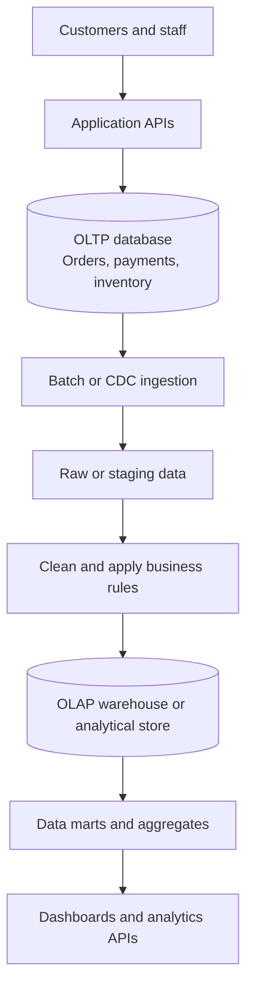
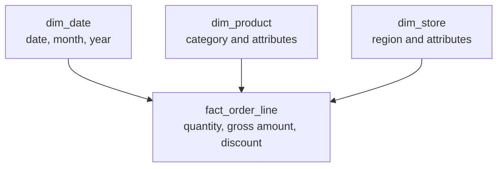

*A database handles thousands of orders without trouble. Then the team adds a revenue dashboard, and previously fast APIs start slowing down. Is this only a SQL problem, or are we asking one database to serve two different workloads?*

## 1. The day an order system gained a dashboard

Imagine an e-commerce platform using PostgreSQL for `orders`, `order_items`, `products`, `stores`, and `payments`. Creating an order changes a few rows in a transaction. Looking up an order by ID or store is quick. Then managers ask for twelve-month revenue trends, top product categories, and store growth.

The first dashboard queries the same PostgreSQL database:

```sql
SELECT
    DATE_TRUNC('month', o.paid_at) AS month,
    SUM(oi.quantity * oi.unit_price) AS gross_amount
FROM orders o
JOIN order_items oi ON oi.order_id = o.id
WHERE o.status = 'paid'
  AND o.paid_at >= TIMESTAMPTZ '2025-01-01 00:00:00+00'
GROUP BY 1
ORDER BY 1;
```

This is only an illustration of the gross value of paid order lines. It does not account for discounts, refunds, shipping, or an accounting definition of revenue. It may run quickly on a small dataset. As order lines grow into tens of millions, each refresh can consume substantial CPU, I/O, memory, and connections. With many dashboard users, even unrelated order and inventory APIs may slow down.

Indexes, better SQL, and more hardware may help. But the larger question is: **should transaction processing and broad historical analysis compete for the same execution resources and data model?**

## 2. OLTP and OLAP describe workloads

**OLTP (Online Transaction Processing)** centers on frequent operational actions: create an order, reduce stock, update an address, check a payment. Requests often touch relatively few rows; low latency, concurrency, and correctness matter.

**OLAP (Online Analytical Processing)** centers on exploring and aggregating many records: revenue by month, margin by category, purchasing by region, or campaign performance. Queries often scan large ranges and group by several dimensions.

| Characteristic | Typical OLTP workload | Typical OLAP workload |
| :--- | :--- | :--- |
| Goal | Run day-to-day operations | Analyze history and support decisions |
| Common operations | Lookup, insert, update, delete | Join, scan, group, aggregate |
| Rows per query | Often few | Potentially many |
| Priority | Low latency, concurrency, consistency | Analytical throughput and aggregation |
| Common model | Normalized relational tables | Dimensional or denormalized models |
| Common storage layout | Row-oriented | Column-oriented |

These are tendencies, not rigid labels. PostgreSQL can serve analytical queries, and analytical systems vary in their support for near-real-time data and updates. The useful distinction is **what the workload asks the system to do**.

## 3. How analytics affects transaction APIs

As the [indexing article](../database-indexing-why-an-index-may-not-speed-up-a-query/) explains, an index can make a selective lookup efficient:

```sql
SELECT * FROM orders WHERE id = 123456;
```

But a report aggregating two years of sales must process the records that contribute to its answer. An index cannot turn that entire computation into a single-row lookup. Large joins, sorts, and aggregations can compete with order transactions for CPU, disk I/O, buffer cache, memory, and connections.

This is **not necessarily a locking problem**. PostgreSQL's MVCC allows ordinary reads and writes to coexist without a simple reader-writer lock blocking every operation. A dashboard can still hurt API latency by consuming finite server resources. When it is slow, first inspect its plan and workload. If the query is poorly written or lacks a useful index, fix that. If it inherently summarizes a large amount of data, consider pre-aggregation, caching, a replica, or a separate analytical system.

The point is not to introduce a warehouse at the first chart. It is to recognize when the bottleneck has moved from **one query** to **how workloads are organized**.

## 4. Row-oriented and column-oriented storage

PostgreSQL's ordinary tables store values from a row together. This is useful when an operational request needs most fields of a particular order. A broad aggregation may need only `paid_at` and `amount`, yet row pages also contain other attributes.

Column-oriented analytical engines organize values by column. When a query needs only a few columns across many rows, the engine can read those columns and use compression and vectorized processing to reduce work. This often fits large analytical scans. But a columnar layout is not automatically better for small, frequent row updates and transactions.

**OLTP often needs efficient operations on individual records. OLAP often needs efficient processing of a few fields across many records.** Compare systems on the whole workload, including reads, writes, concurrency, freshness, and cost, rather than on one benchmark query.

## 5. Separating analytical from transactional work

As the system grows, PostgreSQL can remain the operational source while a separate layer serves analysis:



Heavy reporting no longer has to execute directly against the production transaction tables. The analytical layer can have a model shaped around business questions rather than CRUD operations. This separation also creates new responsibilities: data may lag behind the source, and pipelines must handle failures, late updates, and reconciliation.

## 6. From transaction tables to analytical models

An operational schema might keep `orders`, `order_items`, `products`, and `refunds` separate. That structure is useful for transactions, but repeated joins across them can be cumbersome for reporting. A **star schema** groups analytical data around a fact table and dimensions:



The fact table records measurements; dimensions describe how to group and filter them. The first design decision is **grain**: what exactly does one fact row represent? If the grain is one order line, an order with three lines produces three fact rows. `COUNT(*)` then counts lines, not orders. Counting orders may require `COUNT(DISTINCT order_id)` or a different fact table.

A **data mart** is a set of models organized for a particular analytical domain, such as sales or inventory. It need not be a separate physical database. The goal is to offer well-defined data for questions people actually ask.

## 7. A warehouse does not define "revenue" for us

Suppose an order has a listed value of 1,000,000 VND, a 100,000 VND discount, and a later 200,000 VND refund. Depending on the question, a report might show gross sales of 1,000,000, post-discount sales of 900,000, or a net amount of 700,000. These numbers are not automatically contradictory; they measure different things.

Before publishing a KPI, define:

| Decision | Question |
| :--- | :--- |
| Metric | Gross sales, net sales, or accounting revenue? |
| Grain | Per order or per order line? |
| Time | Order creation, payment, or revenue-recognition time? |
| Status | Which order states count? |
| Adjustments | How do discounts, refunds, and shipping apply? |
| Currency and timezone | Which conversion and business-day rules apply? |

A governed metric or semantic layer helps prevent every dashboard from inventing its own formula. History matters too: if an August order is refunded in September, should an August report use the latest known state or reproduce the value that was closed at the end of August? Those are different questions. Reproducible historical reports may require events, snapshots, or versioned records. Moving rows into a warehouse does not by itself preserve their meaning over time.

## 8. How data moves: batch, CDC, and incremental processing

An analytical layer needs an ingestion pipeline. **ETL** transforms data before loading it into the destination; **ELT** loads it first and transforms it in the analytical system. Real pipelines often mix both approaches.

With **batch ingestion**, a job extracts new or changed data on a schedule. This can be operationally simple, but selecting only `created_at` will miss old orders updated or refunded later. The pipeline must know what changed and which historical aggregates to revisit.

With **change data capture (CDC)**, a tool such as Debezium can stream changes from PostgreSQL logical replication. CDC helps deliver source changes frequently, but does not automatically create correct analytical models. It still needs deduplication, ordering decisions, transformations, and business rules. A status change from `pending` to `paid` is a database event; whether it constitutes recognized revenue is a separate decision.

**Incremental processing** updates affected models rather than rebuilding everything. It is not simply "read rows newer than last run": a correction made today can change last month's figures. Tools such as dbt support incremental models, but correctness still depends on grain, change detection, keys, and update strategy.

## 9. Freshness and reconciliation

If a payment occurs at 10:05 but the last successful batch covers data only through 10:00, a dashboard at 10:06 may not include it. That can be acceptable **if the freshness contract is clear**. "Today's sales - processed through 10:00" is more honest than an unlabeled number that appears live.

Latency can come from several stages: source write, ingestion, transformation, data mart, or dashboard cache. Track source event time, ingest time, transformation completion, and publish time. For historical or financial reports, record the *as-of* point that defines what data the number represents.

Data can also diverge through duplicates, missing records, late updates, or transformation bugs. Reconcile order IDs and order lines, validate dimension links, compare totals under the **same metric definition and time window**, and monitor pipeline freshness. A simple `COUNT(*)` comparison is misleading when one side stores current order state and the other stores an event history.

**Data quality means preserving meaning, not merely proving that rows exist.**

## 10. Do we need a warehouse immediately?

No. There is a useful progression:

1. **Query PostgreSQL directly** while data volume and dashboard concurrency remain manageable. Measure with `EXPLAIN (ANALYZE, BUFFERS)` and `pg_stat_statements`; improve SQL, indexes, and guardrails.
2. **Pre-aggregate repeated reports.** For stable questions, a materialized view can store a result:

   ```sql
   CREATE MATERIALIZED VIEW daily_gross_sales AS
   SELECT
       (o.paid_at AT TIME ZONE 'Asia/Ho_Chi_Minh')::date AS business_date,
       o.store_id,
       SUM(oi.quantity * oi.unit_price) AS gross_amount
   FROM orders o
   JOIN order_items oi ON oi.order_id = o.id
   WHERE o.status = 'paid'
   GROUP BY 1, 2;
   ```

   This is an illustrative gross-sales metric, not a complete accounting definition. PostgreSQL materialized views need an explicit refresh; ordinary `REFRESH` replaces their contents. `REFRESH ... CONCURRENTLY` can let reads continue but requires a suitable unique index on a populated view, and it is not automatic incremental refresh.
3. **Use a read replica** when isolating read resource usage from the primary helps. A replica still has essentially the same schema and storage model, can lag behind the primary, and long standby queries may conflict with WAL replay. It is not a warehouse by itself.
4. **Adopt dedicated OLAP storage or a warehouse** when analytical volume, concurrency, data-source integration, and history justify its operational cost. ClickHouse, BigQuery, Snowflake, and others have different ingestion, query, and pricing tradeoffs; choose for the measured workload.

## 11. When is it time to separate OLTP and OLAP?

Row count alone is a poor trigger. Look for evidence:

| Signal | What to investigate |
| :--- | :--- |
| Dashboard traffic slows APIs | Is analytics competing with transactions for resources? |
| Query latency keeps rising | Are SQL and index improvements reaching their limits? |
| Teams compute the same KPI differently | Is a governed metric or data mart needed? |
| Sources and history requirements grow | Does OLTP store enough history for the questions? |
| Freshness becomes contractual | Is batch enough, or is CDC/near-real-time ingestion needed? |
| Scaling cost grows | Is scaling OLTP still cheaper than separating analysis? |

Start with one expensive, well-defined report, such as twelve-month revenue. Move it into a sales mart, then measure primary-database load, dashboard latency, data correctness, and pipeline cost. Expand only when that experiment produces value.

## 12. Evaluate analytics on more than query speed

A faster dashboard can still be wrong, incomplete, or too stale. Evaluate **performance** (latency and throughput), **freshness**, **correctness** against agreed KPI definitions, **completeness**, **reliability** under retries and backfills, and **total cost**.

For a fair before/after comparison, run the same questions against the same snapshot and metric definitions: monthly sales by store, top products, regional comparisons, and weekly margin trends. Validate answers first, then compare speed. If the formulas or input data differ, the benchmark does not tell us whether the architecture improved.

## 13. The architecture follows the questions

OLTP keeps operational transactions correct and responsive. OLAP supports broad scans, aggregations, and historical decisions. PostgreSQL can serve both for many products, but at some scale the shared resources and transactional schema become a constraint.

The next step might be better SQL, a materialized view, a replica, or a dedicated analytical layer. Whatever the choice, speed alone is insufficient: define metrics and grain, preserve history, state freshness honestly, and reconcile results.

**A good data architecture is not the one with the most technologies. It is the one that organizes data around how the system creates, changes, and uses it.**

## References and further reading

- [ClickHouse: OLTP vs OLAP](https://clickhouse.com/resources/engineering/oltp-vs-olap)
- [ClickHouse: What Is a Columnar Database?](https://clickhouse.com/resources/engineering/what-is-columnar-database)
- [Microsoft Learn: Star Schema](https://learn.microsoft.com/en-us/power-bi/guidance/star-schema)
- [Microsoft Learn: Dimensional Modeling in Fabric](https://learn.microsoft.com/en-us/fabric/data-warehouse/dimensional-modeling-overview)
- [PostgreSQL: Materialized Views](https://www.postgresql.org/docs/current/rules-materializedviews.html)
- [PostgreSQL: REFRESH MATERIALIZED VIEW](https://www.postgresql.org/docs/current/sql-refreshmaterializedview.html)
- [PostgreSQL: Hot Standby](https://www.postgresql.org/docs/current/hot-standby.html)
- [Debezium: Architecture](https://debezium.io/documentation/reference/stable/architecture.html)
- [dbt: Configure Incremental Models](https://docs.getdbt.com/docs/build/incremental-models)
- [dbt: Incremental Models vs Snapshots](https://docs.getdbt.com/best-practices/how-we-handle-cdc/2-choosing-incremental-or-snapshots)
- [Google Cloud: Partitioned Tables](https://cloud.google.com/bigquery/docs/partitioned-tables)
- [Google Cloud: Clustered Tables](https://cloud.google.com/bigquery/docs/clustered-tables)
