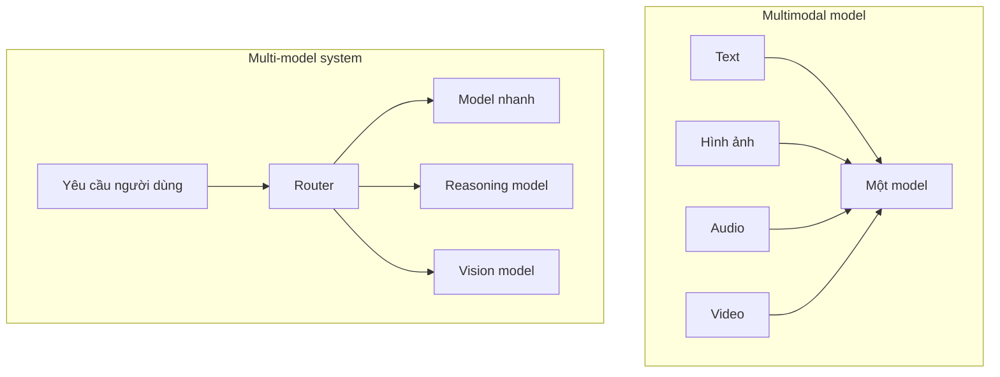
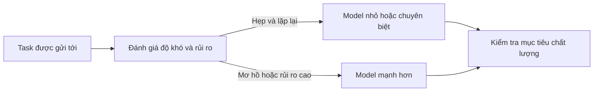
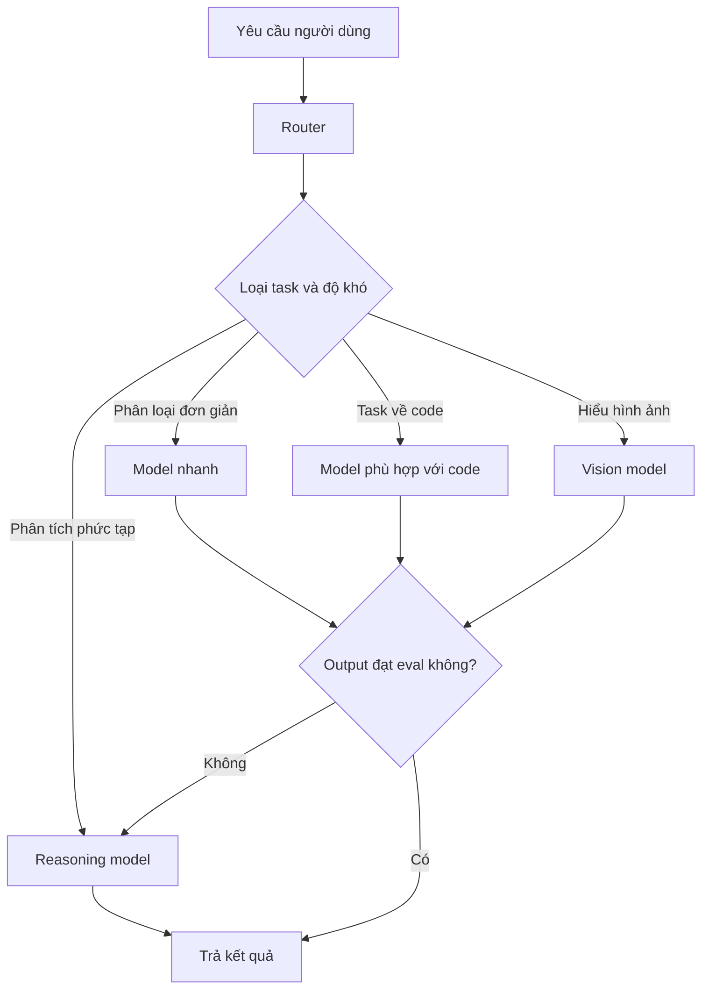
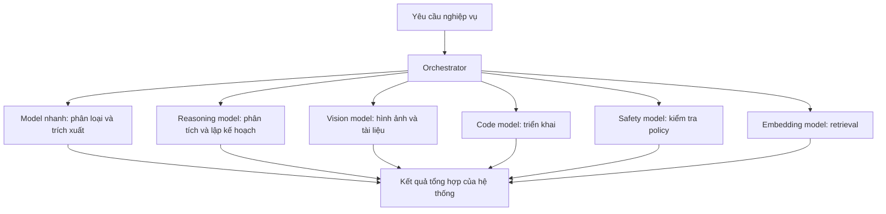
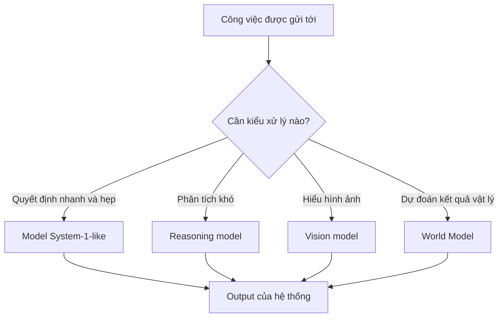
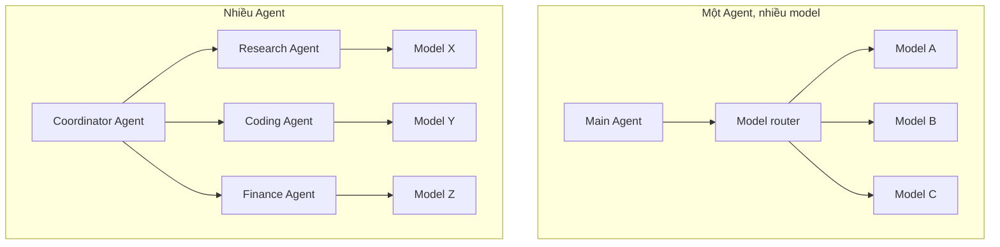
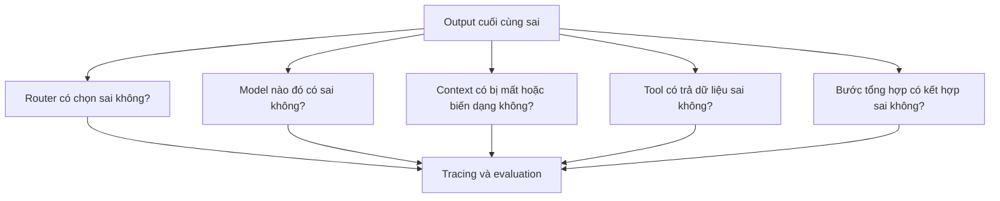
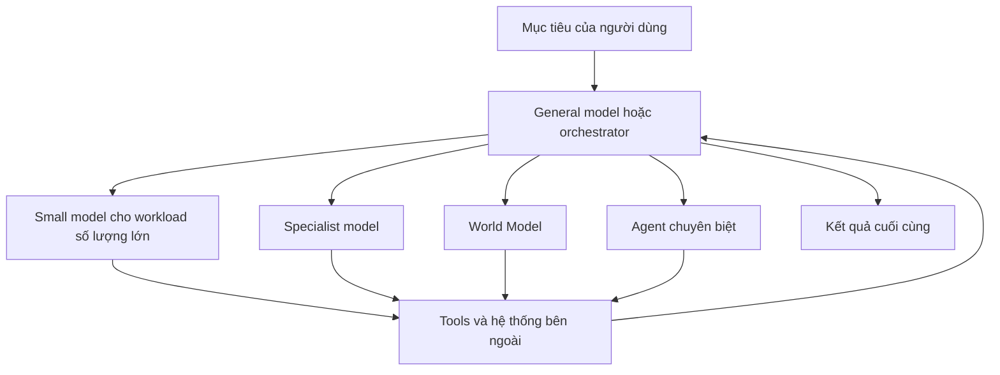

Khi nói về AI, chúng ta rất dễ bị cuốn vào một câu hỏi:

> **Model nào thông minh nhất?**

Model A reasoning tốt hơn. Model B viết code tốt hơn. Model C nhanh hơn. Model D rẻ hơn.

Và trực giác tự nhiên là:

> Nếu một ngày có một model đủ mạnh để làm tất cả mọi thứ thì sao?

Một **siêu model** có thể đọc tài liệu, viết code, hiểu hình ảnh, phân tích dữ liệu, lập kế hoạch và điều khiển Agent.

Đây hoàn toàn có thể là một hướng phát triển. Các model tổng quát vẫn đang làm được ngày càng nhiều loại công việc.

Nhưng khi nhìn vào những hệ thống AI được triển khai trong thực tế, một hướng khác cũng ngày càng rõ:

> **Không phải công việc nào cũng cần cùng một model.**

Tương lai có thể không phải lựa chọn giữa một trí tuệ tổng quát và nhiều chuyên gia. Nó có thể là một hệ thống biết khi nào nên dùng mỗi loại.

## 1. Multi-model không giống multimodal

Hai thuật ngữ này nghe khá giống nhau nhưng mô tả hai ý tưởng khác nhau.

**Multimodal** nghĩa là một model có thể làm việc với nhiều loại input hoặc output, chẳng hạn:

- text;
- hình ảnh;
- audio;
- video.

**Multi-model**, theo cách dùng trong bài này, nghĩa là một hệ thống sử dụng nhiều model và giao từng request hoặc subtask cho model phù hợp.

Một multimodal model vẫn có thể là model duy nhất trong sản phẩm. Một multi-model system cũng có thể sử dụng nhiều model chỉ xử lý text. Hai đặc tính này độc lập với nhau.

## 2. Nó cũng khác Mixture-of-Experts

Một thuật ngữ khác cũng dễ gây nhầm là **Mixture-of-Experts**, hay MoE.

Một MoE model chứa nhiều thành phần expert đã được học bên trong cùng một model. Router nội bộ chỉ kích hoạt một số expert cho từng token hoặc input.

Điều đó khác với việc AI application lựa chọn giữa nhiều model được deploy riêng biệt.

| Khái niệm | Routing diễn ra ở đâu? | Thành phần được lựa chọn |
| --- | --- | --- |
| Mixture-of-Experts | Bên trong một model | Các neural network expert nội bộ |
| Multi-model routing | Trong application hoặc platform | Các model endpoint hoặc deployment riêng |
| Multi-agent orchestration | Giữa các vòng lặp thực hiện task | Các Agent có role, tools và state riêng |

Cả ba có thể cùng tồn tại trong một hệ thống, nhưng chúng giải quyết những bài toán điều phối khác nhau.

## 3. Có cần gọi bộ não mạnh nhất cho mọi việc không?

Hãy tưởng tượng một công ty có CEO rất giỏi. CEO có thể đọc email, nhập dữ liệu vào bảng tính, kiểm tra hóa đơn, trả lời khách hàng và quyết định chiến lược.

Công ty vẫn không gửi mọi việc lên CEO.

Không phải vì CEO không làm được, mà vì đó là cách sử dụng thời gian và chi phí rất tệ.

Hệ thống AI cũng gặp cùng một bài toán.

Một frontier model có thể dễ dàng phân loại email là Sales hay Support. Nhưng nếu hệ thống phải phân loại mười triệu email, cost, latency và throughput bắt đầu trở nên quan trọng. Một model nhỏ hơn hoặc thậm chí một classifier truyền thống có thể đã đủ tốt.

Trong khi đó, một yêu cầu khác có thể cần nhiều năng lực hơn:

> Hãy phân tích hợp đồng này, xác định những rủi ro quan trọng và đề xuất chiến lược đàm phán.

Hướng dẫn xây dựng Agent của OpenAI khuyến nghị bắt đầu bằng model mạnh để thiết lập baseline về chất lượng, sau đó thay bằng model nhỏ hơn ở những vị trí mà eval cho thấy model nhỏ vẫn đạt mục tiêu.

Câu hỏi hữu ích không phải lúc nào cũng là "Model nào mạnh nhất?"

Nó thường là:

> **Model nào đủ tốt cho công việc này với chi phí và tốc độ hợp lý?**

## 4. Đây là ý tưởng phía sau model routing

Model router đứng trước nhiều lựa chọn model. Nó xem yêu cầu rồi quyết định nên gửi yêu cầu đó tới đâu.

Routing có thể dựa trên:

- business rule rõ ràng;
- loại dữ liệu cần xử lý;
- task classifier;
- độ khó hoặc rủi ro ước lượng;
- giới hạn latency và cost;
- tình trạng sẵn sàng của model;
- kết quả thử ban đầu rồi mới escalation.

Nhánh cuối rất quan trọng. Router không nhất thiết phải chọn hoàn hảo chỉ trong một lần. Hệ thống có thể bắt đầu bằng đường xử lý rẻ hơn rồi chuyển sang model mạnh khi confidence thấp hoặc validation không đạt.

Anthropic mô tả routing là pattern phù hợp khi input có những nhóm rõ ràng và có thể được phân loại đủ chính xác. Một ví dụ là đưa câu hỏi đơn giản hoặc phổ biến tới model nhỏ, tiết kiệm hơn, còn câu hỏi khó hoặc bất thường tới model mạnh hơn.

## 5. Một hệ thống AI có thể trông giống một đội ngũ chuyên gia

Hãy xem một AI assistant dành cho doanh nghiệp. Thay vì yêu cầu một model xử lý mọi loại công việc, hệ thống có thể tập hợp nhiều chuyên gia:

Không phải model nào cũng tham gia mọi request. Orchestrator chỉ kích hoạt những thành phần mà task cần.

Tại thời điểm bài viết được xuất bản, OpenAI mô tả GPT-5.4 nano là lựa chọn nhanh và có chi phí thấp hơn cho những task số lượng lớn như classification, extraction, ranking và các subtask hỗ trợ. Hướng dẫn của họ đặt những biến thể lớn hơn cho reasoning rộng hoặc khó hơn, còn biến thể nhỏ hơn cho workload ưu tiên throughput, latency và cost.

Google Cloud cũng cung cấp model routing trong API Gateway, cho phép rule đưa những request tương thích tới các model backend đã cấu hình thay vì buộc mọi operation sử dụng một target được hard-code.

Các sản phẩm cụ thể sẽ thay đổi theo thời gian. Ý tưởng kiến trúc bền vững hơn là: **tách task khỏi giả định rằng một endpoint duy nhất phải xử lý mọi thứ.**

## 6. Điều này khá giống System 1 và System 2 ở cấp độ hệ thống

Trong [bài System 1 vs System 2](../system-1-vs-system-2-in-ai-vi/), chúng ta đã đặt câu hỏi liệu AI có cần suy nghĩ sâu trước mọi quyết định hay không.

Multi-model architecture đưa trực giác đó lên cấp độ hệ thống:

Điều này không đòi hỏi mỗi chuyên gia phải là một foundation model hoàn toàn khác. Hệ thống có thể dùng nhiều model family, nhiều kích thước trong cùng một family, phiên bản được fine-tune hoặc cùng một model với reasoning setting khác nhau.

Điểm quan trọng là ghép đúng kiểu xử lý với công việc.

## 7. Multi-model không đồng nghĩa multi-agent

Một multi-model system vẫn có thể chỉ có một Agent. Agent đó lựa chọn model khác nhau cho từng bước.

Một multi-agent system có nhiều vòng lặp thực hiện task độc lập hoặc bán độc lập, thường có role, instruction, tools hoặc state riêng. Tất cả Agent trong đó vẫn có thể sử dụng cùng một model.

Hai pattern có thể được kết hợp. Coordinator có thể giao việc cho nhiều Agent, trong khi mỗi Agent dùng một model khác nhau hoặc có router riêng.

Hệ thống lúc này bắt đầu khá giống một tổ chức: nhiều chuyên gia, tools, phạm vi và cấp điều phối.

## 8. Càng nhiều model, hệ thống càng có nhiều cách để thất bại

Multi-model architecture không phải một cải tiến miễn phí.

Nó tạo ra những câu hỏi mới:

### Router có chọn đúng không?

Nếu một task khó bị gửi sang model quá yếu, chất lượng có thể giảm mà hệ thống chưa nhận ra ngay.

### Context có được truyền đúng không?

Model tiếp theo cần nhận đúng instruction, bằng chứng, constraint và kết quả trung gian. Truyền quá ít sẽ gây thiếu thông tin; truyền tất cả sẽ tạo noise và tăng cost.

### Output có tương thích không?

Các model khác nhau có thể dùng format, giả định, thuật ngữ hoặc cách xử lý safety khác nhau.

### Lỗi bắt đầu từ đâu?

Vì vậy, team cần eval riêng cho từng route, trace, metric về cost và latency, fallback, version control và contract rõ ràng giữa các thành phần.

Khuyến nghị rộng hơn của Anthropic rất hữu ích ở đây: bắt đầu bằng kiến trúc đơn giản nhất có thể hoạt động, sau đó chỉ thêm routing hoặc thành phần tự chủ khi eval cho thấy giá trị tăng thêm lớn hơn độ phức tạp mới.

## 9. Vậy tương lai là một siêu AI hay một đội quân AI chuyên biệt?

Câu hỏi này có thể không cần một phía chiến thắng.

Các frontier model vẫn ngày càng tổng quát. Một model có thể reasoning, code, hiểu hình ảnh, dùng tool và lập kế hoạch.

Nhưng ở cấp độ hệ thống, chúng ta vẫn có động lực rất lớn để tối ưu chất lượng, cost, latency, throughput, safety và availability. Những mục tiêu đó thường dẫn tới routing và specialization.

Hai xu hướng hoàn toàn có thể cùng tồn tại:

Model tổng quát có thể điều phối công việc mơ hồ và đưa ra đánh giá cuối. Model nhỏ hoặc chuyên biệt xử lý những phần phù hợp với thế mạnh của chúng.

Đơn vị quan trọng nhất có thể không còn là model đứng đầu benchmark. Nó có thể là toàn bộ hệ thống biết trả lời:

- Thành phần nào nên xử lý task này?
- Khi nào model nhỏ là đủ?
- Khi nào cần reasoning sâu?
- Khi nào cần vision, memory hoặc [World Model](../what-are-world-models-vi/)?
- Khi nào nên giao việc cho Agent khác?
- Làm sao xác minh tất cả thành phần phối hợp đáng tin cậy?

Tương lai có thể không phải một siêu AI đối đầu với một đội quân AI.

Nó có thể là:

> **Một hệ thống biết khi nào cần một bộ não tổng quát thật mạnh và khi nào nên gọi đúng chuyên gia cho đúng công việc.**

## Nguồn tham khảo

- [Anthropic - Building effective agents](https://www.anthropic.com/engineering/building-effective-agents)
- [OpenAI - A practical guide to building AI agents](https://openai.com/business/guides-and-resources/a-practical-guide-to-building-ai-agents/)
- [OpenAI - Model guidance](https://developers.openai.com/api/docs/guides/latest-model)
- [OpenAI - GPT-5.4 nano](https://developers.openai.com/api/docs/models/gpt-5.4-nano)
- [Google Cloud - Configure model routing](https://docs.cloud.google.com/api-gateway/docs/model-routing-configure)
- [Switch Transformers research paper](https://arxiv.org/abs/2101.03961)
