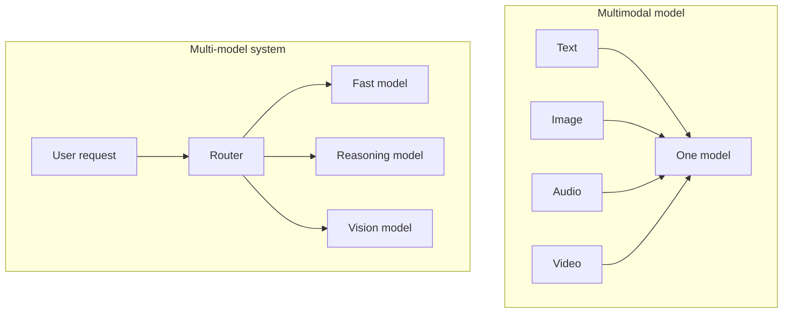
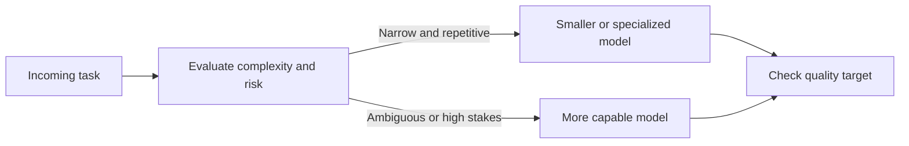
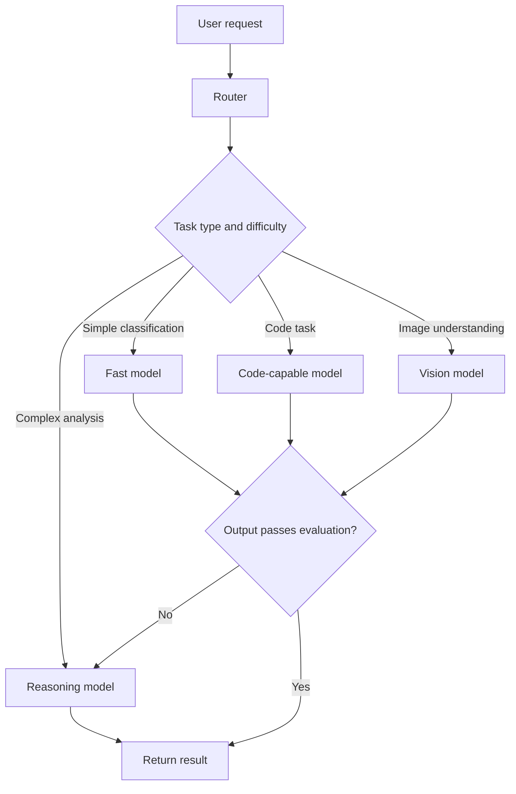
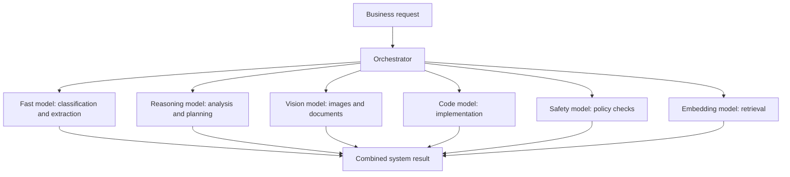
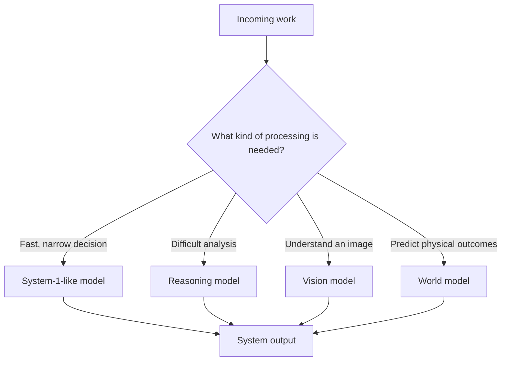
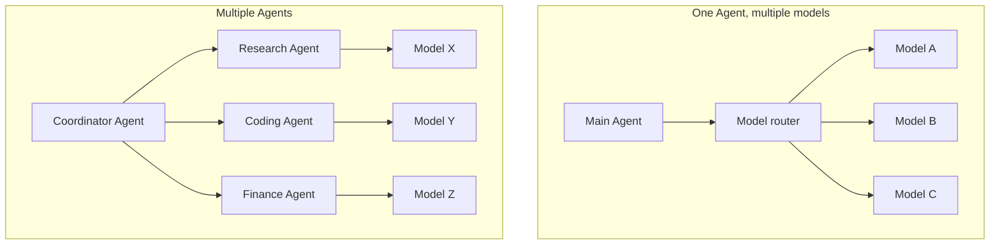
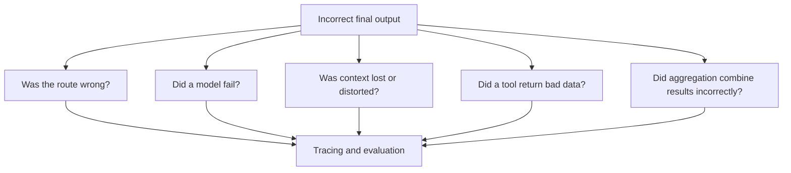
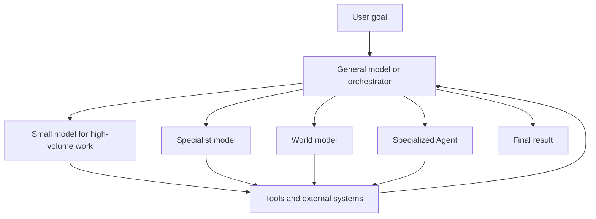

When people talk about AI, one question quickly takes over:

> **Which model is the smartest?**

Model A reasons better. Model B writes better code. Model C is faster. Model D is cheaper.

The natural next thought is:

> What if one model eventually becomes powerful enough to do everything?

A **super model** that reads documents, writes code, understands images, analyzes data, plans, and controls Agents.

That is a plausible direction. General models continue to become capable across more kinds of work.

But production AI systems reveal another direction just as clearly:

> **Not every task needs the same model.**

The future may not be a choice between one general intelligence and many specialists. It may be a system that knows when to use each.

## 1. Multi-model is not the same as multimodal

These terms sound similar but describe different ideas.

**Multimodal** means a model can work with several kinds of input or output, such as:

- text;
- images;
- audio;
- video.

**Multi-model**, as used in this article, means one system uses multiple models and assigns each request or subtask to a suitable model.

A multimodal model can still be the only model in a product. A multi-model system can use several text-only models. The two properties are independent.

## 2. It is also different from Mixture-of-Experts

There is another term that can cause confusion: **Mixture-of-Experts**, or MoE.

An MoE model contains multiple learned expert components inside one model. An internal router activates only some of those experts for a token or input.

That is not the same as an application choosing between separate deployed models.

| Concept | Where routing happens | What is being selected |
| --- | --- | --- |
| Mixture-of-Experts | Inside one model | Internal neural network experts |
| Multi-model routing | Inside the application or platform | Separate model endpoints or deployments |
| Multi-agent orchestration | Between autonomous task loops | Agents with roles, tools, and state |

All three can exist in the same system, but they solve different coordination problems.

## 3. Does every task need the strongest brain?

Imagine a company with a highly capable CEO. The CEO may be able to read email, enter spreadsheet data, inspect invoices, answer customers, and make strategy decisions.

The company still does not send every task to the CEO.

Not because the CEO is incapable, but because it would be a poor use of time and money.

AI systems face the same tradeoff.

A frontier model may easily classify an email as Sales or Support. But if the system must classify ten million emails, cost, latency, and throughput become important. A smaller model or even a traditional classifier may be good enough.

A different request may deserve more capability:

> Review this contract, identify material risks, and propose a negotiation strategy.

OpenAI's guide to building Agents recommends beginning with the most capable model to establish a quality baseline, then replacing it with smaller models where evaluations show they still meet the target.

The useful question is not always "Which model is strongest?"

It is often:

> **Which model is good enough for this task at an acceptable cost and speed?**

## 4. This is the idea behind model routing

A model router sits in front of several model choices. It examines a request and decides where to send it.

Routing can be based on:

- explicit business rules;
- the requested modality;
- a task classifier;
- estimated difficulty or risk;
- latency and cost budgets;
- model availability;
- an initial attempt followed by escalation.

The last branch matters. A router does not need to make a perfect decision in one shot. A system can start with a cheaper path and escalate when confidence is low or a validation check fails.

Anthropic describes routing as useful when inputs fall into distinct categories that can be classified reliably. One example is sending easy or common requests to smaller, cost-efficient models and difficult or unusual requests to more capable ones.

## 5. An AI system can look like a team of specialists

Consider an enterprise assistant. Instead of asking one model to handle every kind of work, the system can assemble specialists:

Not every model participates in every request. The orchestrator activates only what the task needs.

At the time of writing, OpenAI describes GPT-5.4 nano as a fast, lower-cost option for high-volume tasks such as classification, extraction, ranking, and supporting subtasks. Its guidance positions larger variants for broader or more difficult reasoning and smaller variants for workloads where throughput, latency, and cost matter more.

Google Cloud also exposes model routing in API Gateway, allowing rules to direct compatible requests to configured model backends rather than forcing every operation to use one hard-coded target.

These products will change over time. The architectural idea is more durable: **separate the task from the assumption that one endpoint must handle it.**

## 6. This resembles System 1 and System 2 at the system level

In the earlier [System 1 vs System 2 article](../system-1-vs-system-2-in-ai/), we asked whether AI should think deeply before every decision.

A multi-model architecture applies the same intuition at the system level:

This does not require every specialist to be a completely different foundation model. The system might use different model families, different sizes in one family, fine-tuned variants, or the same model with different reasoning settings.

What matters is matching the processing profile to the job.

## 7. Multi-model does not mean multi-agent

A multi-model system can still have only one Agent. That Agent may choose different models for different steps.

A multi-agent system has multiple autonomous or semi-autonomous task loops, usually with separate roles, instructions, tools, or state. Those Agents could all use the same model.

The two patterns can be combined. A coordinator may delegate work to several Agents, while each Agent uses a different model or its own router.

That begins to resemble an organization: multiple specialists, tools, scopes, and levels of coordination.

## 8. More models create more ways to fail

Multi-model architecture is not a free improvement.

It introduces new questions:

### Did the router choose correctly?

If a difficult task is sent to a model that is too weak, quality can fall before anyone notices.

### Was context transferred correctly?

The next model needs the right instructions, evidence, constraints, and intermediate result. Passing too little creates confusion; passing everything creates noise and cost.

### Are outputs compatible?

Different models may use different formats, assumptions, terminology, or safety behavior.

### Where did the error begin?

Teams therefore need per-route evaluations, trace data, cost and latency metrics, fallbacks, version control, and clear contracts between components.

Anthropic's broader recommendation is useful here: begin with the simplest architecture that works, then add routing or autonomous components only when evaluations show that the added value exceeds the added complexity.

## 9. So is the future one super AI or an army of specialists?

The question may not need one winner.

Frontier models continue to become more general. One model may reason, code, understand images, use tools, and plan.

At the system level, however, there remains strong pressure to optimize quality, cost, latency, throughput, safety, and availability. Those goals often favor routing and specialization.

The two trends can coexist:

A general model can coordinate ambiguous work and make final judgments. Smaller or specialized models can handle the parts that match their strengths.

The most important unit may no longer be the model at the top of a benchmark. It may be the complete system that can answer:

- Which component should handle this task?
- When is a smaller model enough?
- When is deeper reasoning necessary?
- When is vision, memory, or a [world model](../what-are-world-models/) needed?
- When should another Agent take over?
- How do we verify that all these parts work together reliably?

The future may not be a super AI competing against an army of AIs.

It may be:

> **A system that knows when it needs a powerful general brain and when it should call the right specialist for the job.**

## References

- [Anthropic - Building effective agents](https://www.anthropic.com/engineering/building-effective-agents)
- [OpenAI - A practical guide to building AI agents](https://openai.com/business/guides-and-resources/a-practical-guide-to-building-ai-agents/)
- [OpenAI - Model guidance](https://developers.openai.com/api/docs/guides/latest-model)
- [OpenAI - GPT-5.4 nano](https://developers.openai.com/api/docs/models/gpt-5.4-nano)
- [Google Cloud - Configure model routing](https://docs.cloud.google.com/api-gateway/docs/model-routing-configure)
- [Switch Transformers research paper](https://arxiv.org/abs/2101.03961)
