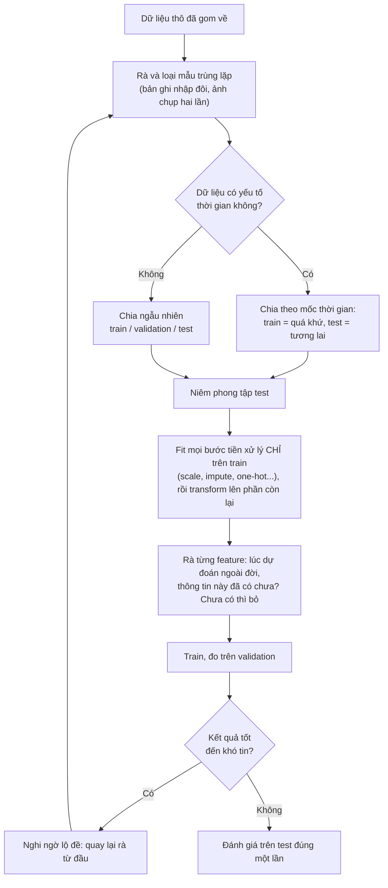

> **Mục tiêu bài học:** Sau bài này, bạn sẽ hiểu vì sao mục tiêu thật của machine learning là làm tốt trên dữ liệu *chưa từng thấy*, biết cách nhận diện overfitting/underfitting qua cặp train loss - validation loss, nắm trực giác bias-variance, và tránh được data leakage - lỗi khiến mô hình "điểm cao giả tạo".

## 1. Học tủ, học hời hợt, và mục tiêu thật của việc học

Nhớ An và Bình ở Bài 04: An luyện đi luyện lại cả 10 đề đến thuộc lòng, chấm trên chính 10 đề đó được 10/10; Bình cất riêng 2 đề để thi thử, được 7/10. Ta đã kết luận điểm của Bình đáng tin hơn. Nhưng còn một câu hỏi bỏ ngỏ: **An thực sự giỏi, hay chỉ thuộc?** Bài này trả lời câu hỏi đó đến nơi đến chốn, vì nó chính là câu chuyện trung tâm của machine learning.

Hãy tưởng tượng ba kiểu người cùng ôn một bộ 100 đề luyện thi:

- **Người học hời hợt:** chỉ lướt qua loa, chưa nắm được cả công thức cơ bản. Làm *đề cũ* cũng sai nhiều, đề mới càng sai.
- **Người học hiểu:** rút ra quy luật giải từng dạng bài. Làm đề cũ tốt, gặp đề mới cũng làm tốt *gần như vậy*.
- **Người học tủ:** thuộc lòng 100 đề, kể cả... lỗi in sai trong đề. Làm đề cũ điểm tuyệt đối, nhưng gặp đề mới thì lúng túng vì "câu này chưa có trong tủ".

Machine learning cũng y như vậy. Khớp được dữ liệu huấn luyện chỉ là *mục tiêu trung gian*; điều ta thực sự muốn là mô hình phát hiện ra **quy luật chung (general patterns)** để dự đoán đúng trên **những mẫu mới** rút ra từ cùng "thế giới" đó. Khả năng này gọi là **tổng quát hóa (generalization)**.

Từ đây có một khái niệm quan trọng: **khoảng cách tổng quát hóa (generalization gap)** - chênh lệch giữa độ tốt trên dữ liệu train và độ tốt trên dữ liệu mà mô hình chưa từng thấy. Khoảng cách này càng lớn, mô hình càng "học tủ" nặng.

- Người học hời hợt là **underfitting** (thiếu khớp): mô hình quá đơn giản hoặc học chưa tới, chưa nắm được cả quy luật trong dữ liệu train.
- Người học tủ là **overfitting** (quá khớp): mô hình khớp dữ liệu train quá mức, học thuộc cả **nhiễu (noise)** - những dao động ngẫu nhiên không phải quy luật thật. Sách *An Introduction to Statistical Learning* mô tả rất chính xác: overfitting xảy ra khi mô hình "làm việc quá chăm chỉ" để tìm quy luật trong dữ liệu train, đến mức vớ phải những "quy luật" chỉ là **trùng hợp ngẫu nhiên**, không tồn tại trong dữ liệu mới.

Một góc nhìn bất ngờ mà sách *Dive into Deep Learning* mượn từ triết học khoa học: theo Karl Popper, một lý thuyết *giải thích được mọi quan sát* thì không phải lý thuyết khoa học - vì nó chẳng loại trừ khả năng nào cả. Mô hình cũng vậy: nếu nó đủ dẻo để khớp *bất kỳ* cách gán nhãn nào, kể cả nhãn ngẫu nhiên, thì việc nó khớp tập train chẳng chứng minh nó đã tìm ra quy luật gì.

## 2. Chẩn đoán bằng cặp (train loss, validation loss)

Bạn không thể nhìn vào "đầu" mô hình để biết nó học hiểu hay học tủ. Nhưng bạn có **hai con số** mà bạn đã biết cách tạo ra từ Bài 04 và Bài 10: **loss trên tập train** và **loss trên tập validation** (dữ liệu mô hình không được học). Cặp số này chính là *điểm làm đề cũ* và *điểm thi thử trên đề cất riêng* của Bình:

| Tình huống | Train loss | Validation loss | Chẩn đoán | Ví dụ số |
|---|---|---|---|---|
| 1 | **Cao** | Cao (xấp xỉ train) | **Underfitting** - chưa học được quy luật | train 0,48 - val 0,50 |
| 2 | Thấp | Thấp, **sát** train loss | **Vừa vặn** - tổng quát hóa tốt | train 0,08 - val 0,10 |
| 3 | **Rất thấp** | **Cao hơn hẳn** train | **Overfitting** - học vẹt nhiễu | train 0,01 - val 0,42 |

Có hai điều cần lưu ý khi đọc bảng này. "Cao" hay "thấp" là tương đối theo từng bài toán - quan trọng là **so hai số với nhau** và so với mức bạn kỳ vọng. Và underfitting với overfitting không phải "chọn một trong hai": mô hình có thể đi từ underfitting → vừa vặn → overfitting khi ta tăng dần độ phức tạp hoặc train lâu hơn - đó là nội dung mục tiếp theo.

> 🔧 **Thử ngay:** chẩn đoán ba mô hình sau và tính generalization gap của mỗi mô hình:
> (a) train 0,52 - val 0,55 · (b) train 0,03 - val 0,61 · (c) train 0,09 - val 0,11.
>
> **Đáp án:** (a) gap 0,03 nhưng *cả hai đều cao* → underfitting; (b) gap 0,58 → overfitting nặng; (c) gap 0,02, cả hai thấp → vừa vặn. Chỉ nhìn gap là chưa đủ - (a) có gap nhỏ mà vẫn tệ.

> ⚠️ **Lưu ý nhỏ:** Khi đo bằng cùng một thước và trong cùng điều kiện, validation loss *thường* cao hơn train loss một chút - điều đó bình thường, vì mô hình được tối ưu trực tiếp trên tập train. Có ngoại lệ: các kỹ thuật chỉ bật lúc train như dropout hay data augmentation có thể khiến train loss đo được *cao hơn* validation loss. Vấn đề chỉ nảy sinh khi khoảng cách **lớn** (tình huống 3). Và ngay cả khoảng cách lớn cũng không hẳn là thảm họa: sách *Dive into Deep Learning* nhận xét rằng trong deep learning, những mô hình dự đoán tốt vẫn thường làm tốt hơn hẳn trên train so với dữ liệu mới - thứ ta muốn cuối cùng là validation loss thấp, còn gap chỉ đáng lo khi nó cản trở mục tiêu ấy.

## 3. Đường cong chữ U: càng train, chưa chắc càng tốt

Bạn cho mô hình train lâu hơn hẳn, nghĩ rằng học lâu thì giỏi hơn. Train loss đúng là giảm đều. Nhưng validation loss, sau khi chạm đáy, lại lặng lẽ nhích lên. Chuyện gì đang xảy ra?

Sách *An Introduction to Statistical Learning* (chương 2) chỉ ra một hiện tượng nền tảng, lặp lại trên rất nhiều bài toán và phương pháp, khi ta tăng dần **capacity** (độ phức tạp mô hình - Bài 13) hoặc **số vòng train (epochs)**:

- **Train error giảm gần như liên tục** - mô hình càng linh hoạt/train càng lâu thì càng khớp dữ liệu train.
- **Validation/test error giảm rồi tăng trở lại** - vẽ ra hình **chữ U**.

```
 Lỗi (loss)
  │
  │ x                                          v
  │  x                                      v
  │   x                                  v
  │    x                              v
  │     x  v                       v
  │       v  x                  v
  │          v  x x         v v      ← v: VALIDATION error
  │             v    x  v v             (giảm rồi TĂNG lại - chữ U)
  │                v  x x x
  │                       x x x x x  ← x: TRAIN error (thường giảm đều)
  └─────────────┬──────────────────────►
   đơn giản     │        phức tạp / train lâu
                ▲
         điểm "vừa vặn"
   (validation error thấp nhất - nơi đáng dừng lại)
```

Đọc hình từ trái sang phải:

- **Nửa trái:** cả hai đường cùng đi xuống - mô hình đang học được quy luật thật. Đây là vùng underfitting: cứ tăng thêm độ phức tạp hoặc train lâu hơn thì vẫn còn lời.
- **Điểm đáy chữ U:** validation error thấp nhất - mô hình "vừa vặn".
- **Nửa phải:** train error vẫn giảm nhưng validation error quay đầu **tăng** - phần "tiến bộ" trên tập train giờ chỉ là học thuộc nhiễu. Càng đi tiếp càng overfit.

Một điểm tinh tế đáng nhớ từ sách *An Introduction to Statistical Learning*: overfitting không có nghĩa đơn thuần là "validation error cao", mà là tình huống **một mô hình đơn giản hơn lẽ ra đã cho validation error thấp hơn** - tức là bạn đã đi quá đáy chữ U.

> ⚠️ **Lưu ý nhỏ:** Hai trục - *độ phức tạp mô hình* và *thời gian train* - cho hai bức tranh tương tự nhau nhưng không phải là một. Và như khối "đào sâu" bên dưới cho thấy, chữ U là khung tư duy phổ biến chứ không phải định luật tuyệt đối.

<details>
<summary><b>Đào sâu:</b> mạng nơ-ron hiện đại làm bức tranh này rắc rối hơn</summary>

Với các mạng nơ-ron lớn, sách *Dive into Deep Learning* (phần *Generalization in Deep Learning*) cho biết bức tranh chữ U cổ điển bị "làm khó" theo những cách phản trực giác: mạng đủ lớn có thể khớp **hoàn hảo** toàn bộ tập train - thậm chí khớp được cả nhãn gán *ngẫu nhiên* (kết quả nổi tiếng của Zhang và cộng sự, công bố tại hội nghị ICLR 2017) - vậy mà nhiều mạng như thế vẫn tổng quát hóa tốt. Có trường hợp tăng thêm độ phức tạp lại *giảm* lỗi trên dữ liệu mới, tạo ra đường cong "hai lần đi xuống" (double descent). Vì sao lại thế vẫn là câu hỏi nghiên cứu mở. Ở mức nhập môn, bạn cứ nắm chắc bức tranh chữ U - nó vẫn là khung tư duy chuẩn cho phần lớn mô hình bạn sẽ gặp đầu tiên - và biết rằng thế giới deep learning có những ngoại lệ thú vị.

</details>

## 4. Bias và variance: hai kiểu "bắn trượt"

Vì sao lại có hình chữ U? Trực giác nằm ở hai nguồn lỗi kéo co với nhau, mà sách *An Introduction to Statistical Learning* gọi là **đánh đổi bias-variance (bias-variance trade-off)**. Ta sẽ hiểu nó qua hình ảnh **bắn bia** - không cần công thức.

Tưởng tượng mỗi lần bạn thu thập một bộ dữ liệu train mới và huấn luyện lại, mô hình thu được là **một phát đạn** nhắm vào tâm bia (quy luật thật):

- **Bias (thiên lệch)** = lỗi **hệ thống**: các phát đạn *chụm* nhưng **lệch hẳn khỏi tâm**. Nó xuất hiện khi mô hình quá cứng nhắc so với thực tế - ví dụ ép một đường thẳng mô tả quan hệ vốn cong: dù cho thêm bao nhiêu dữ liệu, đường thẳng vẫn lệch một cách có hệ thống.
- **Variance (phương sai)** = độ **nhạy cảm với từng bộ dữ liệu**: đổi bộ dữ liệu train một chút, mô hình học ra đã **khác hẳn** - các phát đạn *tản mát* quanh bia. Mô hình rất linh hoạt bám sát từng điểm dữ liệu (kể cả nhiễu) sẽ như vậy: chỉ cần vài điểm nhiễu khác đi là cả đường cong đổi dạng.

```
                    BIAS thấp                 BIAS cao
                 ┌──────────────┐          ┌──────────────┐
   VARIANCE      │       .      │          │           .. │
   thấp          │      .◎.     │          │    ◎      .. │
                 │       .      │          │              │
                 └──────────────┘          └──────────────┘
                  chụm quanh tâm            chụm nhưng lệch tâm
                  (lý tưởng)                (mô hình quá cứng nhắc)

                 ┌──────────────┐          ┌──────────────┐
   VARIANCE      │  .        .  │          │ .          . │
   cao           │      ◎       │          │     ◎     .  │
                 │ .       .    │          │  .           │
                 └──────────────┘          └──────────────┘
                  tản mát quanh tâm         vừa lệch vừa tản mát
                  (mô hình quá nhạy)        (tệ cả hai đường)

                 ◎ = tâm bia (quy luật thật)   . = mô hình học được
                     từ mỗi bộ dữ liệu train khác nhau
```

Ghép vào bức tranh trước:

- Mô hình **quá đơn giản** → bias cao, variance thấp → **underfitting** (nửa trái chữ U).
- Mô hình **quá phức tạp** → bias thấp, variance cao → **overfitting** (nửa phải chữ U).
- Khi tăng độ linh hoạt, ban đầu bias giảm nhanh hơn variance tăng (validation error đi xuống); qua một ngưỡng, variance tăng vọt, lấn át phần bias giảm được (validation error đi lên). Đáy chữ U là điểm cân bằng.

Sách *An Introduction to Statistical Learning* cho hai ví dụ cực đoan dễ nhớ: một đường cong **đi xuyên qua mọi điểm** dữ liệu train có bias gần bằng 0 nhưng variance rất cao; một **đường nằm ngang** (đoán cùng một giá trị cho mọi đầu vào) có variance gần bằng 0 nhưng bias rất cao. Nghề làm ML là tìm điểm đứng giữa hai cực đó.

Và một chi tiết dễ quên từ cùng cuốn sách: nếu quy luật thật *đúng là* đường thẳng, hồi quy tuyến tính có bias bằng 0 - khi đó mô hình dẻo hơn rất khó thắng nó, vì phần linh hoạt thêm vào chỉ đổi lấy variance cao hơn.

## 5. Hộp đồ nghề chống overfitting (mức làm quen)

Chẩn đoán xong, kết luận: overfitting. Làm gì tiếp? Bạn chưa cần thành thạo các kỹ thuật dưới đây ngay - mục tiêu ở đây là biết chúng **tồn tại** và **tư tưởng** của từng cách:

| Cách | Ý tưởng một câu | Ghi chú |
|---|---|---|
| **Thêm dữ liệu** | Nhiều đề hơn thì khó học tủ hơn - nhiễu của từng mẫu bị "pha loãng", quy luật chung nổi lên | Thường là cách đáng thử trước, nếu kiếm thêm dữ liệu khả thi |
| **Chọn mô hình đơn giản hơn** | Giảm capacity: ít tham số hơn, mô hình bớt "bộ nhớ" để học vẹt | Chính là điều chỉnh các hyperparameter ở Bài 13 |
| **Regularization (điều chuẩn)** | Thêm vào hàm loss một khoản **phạt trọng số lớn**, ép mô hình ưu tiên lời giải "mềm mại", ít cực đoan | Dạng phạt tổng bình phương trọng số gọi là weight decay / L2; chi tiết sẽ học sau |
| **Early stopping (dừng sớm)** | Theo dõi validation loss sau mỗi epoch; khi nó ngừng giảm một thời gian thì **dừng train** - đứng lại ở gần đáy chữ U | Sách *Dive into Deep Learning* gọi tiêu chí "chờ thêm vài epoch cho chắc" là *patience*; món quà kèm theo: tiết kiệm thời gian máy |
| **Dropout** | Kỹ thuật riêng của mạng nơ-ron: lúc train, tạm "tắt" ngẫu nhiên một phần nơ-ron | Chỉ cần nhớ tên ở giai đoạn này |

Điểm chung của cả hộp đồ nghề: **làm mô hình khó bám vào nhiễu hơn**. Bốn cách dưới làm điều đó bằng cách kìm bớt mô hình, nên phải trả giá bằng một chút độ khớp trên tập train - bias nhích lên để variance xuống. Riêng cách đầu tiên thì không phải trả giá đó: thêm dữ liệu cho mô hình *thêm bằng chứng* về quy luật chung chứ không kìm nó lại, và đó là lý do nó đứng đầu bảng.

Vì sao early stopping lại hiệu quả? Sách *Dive into Deep Learning* dẫn một phát hiện thú vị (Rolnick và cộng sự, 2017): khi dữ liệu có nhãn sai lẫn vào, mạng nơ-ron có xu hướng **học các mẫu nhãn sạch trước**, rồi mới dần dần "thuộc" các mẫu nhãn nhiễu. Dừng đúng lúc là dừng ngay sau khi mạng đã học xong phần sạch. Hệ quả thực hành, cũng từ sách này: với dữ liệu nhãn sạch và các lớp tách bạch (mèo với chó), early stopping không cải thiện tổng quát hóa được mấy; với nhãn nhiễu hoặc vốn dĩ bất định (dự đoán tử vong của bệnh nhân), nó trở nên thiết yếu - và với mô hình lớn train nhiều ngày trên nhiều GPU, dừng sớm đúng lúc tiết kiệm được nhiều ngày chạy máy.

## 6. Data leakage: khi cuộc thi bị "lộ đề"

Mô hình chẩn đoán ung thư của bạn đúng 99,9% ngay lần thử đầu tiên, trên một bài toán vốn khó. Ăn mừng - hay nghi ngờ?

Overfitting là mô hình *tự* học tủ. Còn có một lỗi nguy hiểm hơn, do chính **người làm ML vô tình gây ra**: **rò rỉ dữ liệu (data leakage)** - thông tin lẽ ra mô hình *không được phép biết* lúc train (thông tin "tương lai", thông tin thuộc về tập test, hoặc chính đáp án nấp trong một cột dữ liệu) lại lọt vào quá trình huấn luyện.

Quay lại hình ảnh thi cử: nếu overfitting là học tủ, thì data leakage là **lộ đề** - thí sinh được xem trước đề thi (Bài 12 đã chạm vào một biến thể của nó). Điểm thi cao ngất, nhưng con số đó **không nói lên năng lực thật**. Với mô hình ML cũng vậy: mọi con số đánh giá trở nên đẹp *giả tạo*, và bạn chỉ phát hiện ra sự thật khi mô hình **thất bại lúc triển khai** - nơi không còn gì để "rò rỉ" nữa.

### Bốn kiểu rò rỉ hay gặp

**① Tiền xử lý trên toàn bộ dữ liệu trước khi chia train/test.** Ở Bài 12, bạn đã học scale (chuẩn hóa) và impute (điền giá trị thiếu). Nếu bạn tính trung bình/độ lệch chuẩn trên **toàn bộ** dữ liệu rồi mới chia train/test, các con số thống kê đó đã "nhìn trộm" tập test - thông tin của test ngấm vào dữ liệu train. → **Phòng:** chia trước, fit các bước tiền xử lý chỉ trên tập train, rồi áp lên test.

**② Dữ liệu thời gian mà trộn ngẫu nhiên.** Dự đoán giá cổ phiếu, doanh số, thời tiết... mà chia train/test bằng cách xáo trộn ngẫu nhiên, thì tập train sẽ chứa những mẫu *xảy ra sau* các mẫu trong tập test - mô hình được dùng "giá của tương lai" để đoán quá khứ. Lúc thử nghiệm, mô hình trông như thần đồng; đến khi chạy thật (nơi tương lai chưa xảy ra) thì sụp đổ. → **Phòng:** chia theo mốc thời gian - train trên quá khứ, test trên tương lai.

**③ Feature chứa sẵn đáp án.** Ví dụ kinh điển: xây mô hình chẩn đoán ung thư, mà trong bảng dữ liệu có cột *"đã điều trị ung thư hay chưa"* - cột này chỉ được điền **sau khi** bệnh nhân đã được chẩn đoán, tức là nó chính là đáp án đội lốt feature. Mô hình đạt độ chính xác gần tuyệt đối trong thử nghiệm, nhưng vô dụng với bệnh nhân mới (chưa ai điều trị gì cả). → **Phòng:** với từng feature, tự hỏi *"tại thời điểm dự đoán ngoài đời thật, mình đã có thông tin này chưa?"* - chưa có thì bỏ.

Rò rỉ kiểu ③ có khi rất kín đáo. Một case có thật được ghi lại trong bài báo *"Leakage in Data Mining"* của Kaufman, Rosset và Perlich (hội nghị ACM KDD 2011): tại cuộc thi KDD Cup 2008 về phát hiện ung thư vú từ ảnh chụp X-quang tuyến vú, trường **mã số bệnh nhân (Patient ID)** - thứ tưởng chừng vô nghĩa - hóa ra lại có sức dự đoán rất mạnh. Dữ liệu được gộp từ nhiều nguồn bệnh viện, và có nguồn gần như chỉ gồm bệnh nhân ung thư; chỉ cần nhìn dải mã số là đoán được nhãn, chẳng cần nhìn ảnh.

**④ Trùng lặp mẫu giữa train và test.** Cùng một mẫu (hoặc gần giống hệt - ảnh chụp hai lần, bản ghi nhập trùng) xuất hiện ở cả hai tập. Lúc "thi", mô hình gặp lại câu nó đã thuộc lòng - điểm test bị thổi phồng. → **Phòng:** rà và loại trùng lặp *trước khi* chia.

> 🔧 **Thử ngay:** tìm lỗi lộ đề trong 3 dòng code sau (phong cách scikit-learn như Bài 12):
> ```python
> scaler = StandardScaler().fit(X)                                              # (1)
> X_train, X_test, y_train, y_test = train_test_split(scaler.transform(X), y)   # (2)
> model.fit(X_train, y_train); print(model.score(X_test, y_test))              # (3)
> ```
> **Đáp án:** dòng (1) - scaler học trung bình/độ lệch chuẩn trên *toàn bộ* `X`, trong đó có cả các dòng sắp thành test: rò rỉ kiểu ①. Sửa: chia ở dòng (2) trước, rồi `scaler.fit(X_train)` và transform cả hai tập. Nếu `X` là dữ liệu theo thời gian, dòng (2) còn mắc thêm lỗi ② (trộn ngẫu nhiên).

### Nhận biết và phòng tránh

Một dấu hiệu nên làm bạn *nghi ngờ thay vì ăn mừng*: kết quả **tốt đến khó tin** - như con số 99,9% ở đầu mục. Trong các cuộc thi trên nền tảng Kaggle, leakage là chuyện xảy ra nhiều lần đến mức nền tảng này có hẳn bài học riêng về nó (xem mục Đọc thêm). Quy trình an toàn tối thiểu, gom cả bốn cách phòng ở trên:



Nói ngắn gọn: overfitting cho bạn mô hình yếu; leakage cho bạn mô hình yếu **mà bạn tưởng là mạnh** - vì thế nó nguy hiểm hơn.

## Tóm tắt bài học

- Mục tiêu thật của ML là **tổng quát hóa**: làm tốt trên dữ liệu **chưa từng thấy**; khớp tập train chỉ là mục tiêu trung gian.
- **Underfitting** = quá đơn giản, chưa học được quy luật (train loss và validation loss đều cao); **overfitting** = học vẹt cả nhiễu (train loss rất thấp, validation loss cao hơn hẳn); chẩn đoán bằng cặp *(train loss, validation loss)*.
- Tăng capacity hoặc train lâu hơn: train error giảm gần như liên tục, validation error đi theo **hình chữ U** - đáy chữ U là điểm dừng "vừa vặn".
- Trực giác **bias-variance**: bias = lệch hệ thống do mô hình quá cứng nhắc (đạn chụm nhưng lệch tâm); variance = quá nhạy với từng bộ dữ liệu train (đạn tản mát). Đơn giản quá → bias cao; phức tạp quá → variance cao.
- Chống overfitting: **thêm dữ liệu**, **mô hình đơn giản hơn**, **regularization** (phạt trọng số lớn), **early stopping** (dừng khi validation loss ngừng giảm), và **dropout** (với mạng nơ-ron).
- **Data leakage** = thông tin "tương lai" hoặc của tập test lọt vào lúc train: tiền xử lý trước khi chia, trộn ngẫu nhiên dữ liệu thời gian, feature chứa đáp án, mẫu trùng lặp - hậu quả là điểm thử nghiệm đẹp giả tạo, triển khai thất bại.
- Kết quả **tốt đến khó tin** là tín hiệu để đi tìm leakage, không phải để ăn mừng.

## Câu hỏi tự kiểm tra

1. Giải thích bằng lời của bạn: vì sao train loss thấp *chưa đủ* để kết luận mô hình tốt? "Generalization gap" là gì?
2. Chẩn đoán ba mô hình sau (underfitting / vừa vặn / overfitting) và nói lý do:
   - a) train loss 0,45 - validation loss 0,47
   - b) train loss 0,02 - validation loss 0,55
   - c) train loss 0,06 - validation loss 0,08
3. Vẽ lại (phác thảo tay là đủ) hai đường train error và validation error khi tăng dần số vòng train. Early stopping sẽ dừng ở đâu trên hình đó, và vì sao dừng ở đó?
4. Dùng hình ảnh bắn bia, giải thích bias và variance khác nhau thế nào. Khi thay mô hình đường thẳng bằng đa thức bậc 15, bias và variance mỗi cái thay đổi ra sao?
5. Tìm lỗi data leakage trong quy trình sau: *"Tôi lấy 5 năm dữ liệu giá cổ phiếu, chuẩn hóa toàn bộ về trung bình 0, rồi trộn ngẫu nhiên và chia 80/20 thành train/test."* (Gợi ý: có **hai** lỗi.)
6. Trong bài toán dự đoán khách hàng rời bỏ dịch vụ (churn), cột nào sau đây có nguy cơ là "feature chứa đáp án": (a) số cuộc gọi lên tổng đài tháng trước, (b) ngày khách bấm nút hủy gói cước, (c) số năm đã dùng dịch vụ? Vì sao?

## Đọc thêm

**Nguồn nền tảng của bài:**

| Nguồn | Đọc phần nào |
|---|---|
| **An Introduction to Statistical Learning (ISLP)** | Chương 2, mục 2.2 - *Assessing Model Accuracy*: train MSE vs test MSE, đường chữ U, bias-variance trade-off |
| **Dive into Deep Learning (d2l.ai)** | Chương 3 (Linear Regression) - mục *Generalization*: chuyện hai sinh viên ôn thi, liên hệ với tiêu chí Popper, underfitting vs overfitting, model selection |
| **Dive into Deep Learning (d2l.ai)** | Chương *Multilayer Perceptrons* - mục *Generalization in Deep Learning*: generalization gap, early stopping, weight decay, dropout |

**Nguồn online bổ sung (miễn phí):**

- [Data Leakage - Kaggle Learn](https://www.kaggle.com/code/dansbecker/data-leakage) - bài học ngắn kèm code về các kiểu leakage, rút từ kinh nghiệm các cuộc thi trên Kaggle.
- [Leakage in Data Mining: Formulation, Detection, and Avoidance (Kaufman, Rosset, Perlich - ACM KDD 2011)](https://dl.acm.org/doi/10.1145/2020408.2020496) - bài báo nguồn của case KDD Cup 2008 (Patient ID) kể trong bài.
- [Overfitting - Machine Learning cơ bản](https://machinelearningcoban.com/2017/03/04/overfitting/) - bài viết tiếng Việt của Vũ Hữu Tiệp về overfitting, có hình minh họa và code.

> **Bài tiếp theo:** [Đánh giá mô hình Machine Learning](../evaluating-machine-learning-models-vi/) - đã biết phải đo trên dữ liệu chưa từng thấy - nhưng đo bằng *thước nào*? Accuracy, precision, recall, F1, RMSE... và vì sao "chính xác 99%" đôi khi vô dụng.
