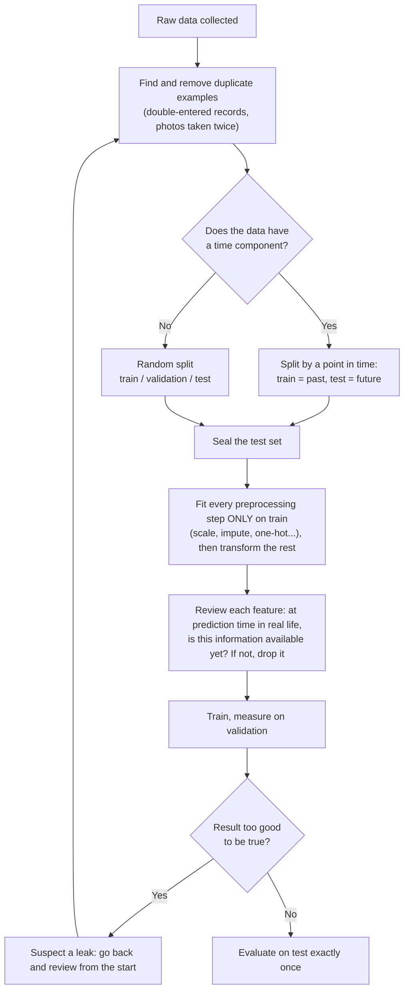

> **Learning objectives:** After this lesson, you will understand why the real goal of machine learning is to do well on data it has *never seen*, know how to recognize overfitting/underfitting from the pair train loss - validation loss, grasp the bias-variance intuition, and be able to avoid data leakage - the mistake that gives a model "fake high scores".

## 1. Cramming, skimming, and the real goal of learning

Remember An and Binh from Lesson 04: An practiced all 10 exams over and over until they knew them by heart, and scored 10/10 when graded on those same 10 exams; Binh set 2 exams aside for a mock test and scored 7/10. We concluded that Binh's score was more trustworthy. But one question was left open: **is An actually good, or have they merely memorized?** This lesson answers that question properly, because it is the central story of machine learning.

Imagine three kinds of people all studying the same set of 100 practice exams:

- **The skimmer:** only flips through casually and has not even grasped the basic formulas. Gets a lot wrong on *old* exams, and even more wrong on new ones.
- **The one who understands:** works out the rule for solving each type of problem. Does well on old exams, and does *almost as well* on new ones.
- **The crammer:** memorizes all 100 exams, including... the typos in them. Gets a perfect score on old exams, but is stuck on a new one because "this question was not in what I memorized".

Machine learning is exactly the same. Fitting the training data is only an *intermediate goal*; what we really want is for the model to discover **general patterns** so that it predicts correctly on **new examples** drawn from the same "world". This ability is called **generalization**.

From here comes an important concept: the **generalization gap** - the difference between how well the model does on the training data and how well it does on data it has never seen. The larger this gap, the more severely the model is "cramming".

- The skimmer is **underfitting**: the model is too simple or has not learned enough, and has not even captured the pattern in the training data.
- The crammer is **overfitting**: the model fits the training data too closely, memorizing even the **noise** - random fluctuations that are not part of the true pattern. *An Introduction to Statistical Learning* describes it very precisely: overfitting happens when the model "works too hard" to find patterns in the training data, to the point of picking up "patterns" that are just **random coincidences** and do not exist in new data.

A surprising angle that *Dive into Deep Learning* borrows from the philosophy of science: according to Karl Popper, a theory that *explains every observation* is not a scientific theory - because it rules nothing out. The same goes for a model: if it is flexible enough to fit *any* labeling whatsoever, including random labels, then the fact that it fits the training set proves nothing about it having found a pattern.

## 2. Diagnosis with the pair (train loss, validation loss)

You cannot look inside a model's "head" to know whether it has understood or merely crammed. But you have **two numbers** you already know how to produce from Lesson 04 and Lesson 10: **the loss on the train set** and **the loss on the validation set** (data the model was not allowed to learn from). This pair of numbers is exactly Binh's *score on old exams* and *score on the mock test using the exams set aside*:

| Situation | Train loss | Validation loss | Diagnosis | Numeric example |
|---|---|---|---|---|
| 1 | **High** | High (about the same as train) | **Underfitting** - has not learned the pattern | train 0.48 - val 0.50 |
| 2 | Low | Low, **close to** train loss | **Just right** - generalizes well | train 0.08 - val 0.10 |
| 3 | **Very low** | **Much higher** than train | **Overfitting** - memorized the noise | train 0.01 - val 0.42 |

Two things to keep in mind when reading this table. "High" or "low" is relative to each problem - what matters is **comparing the two numbers with each other** and with the level you expect. And underfitting versus overfitting is not "pick one of the two": a model can go from underfitting → just right → overfitting as we gradually increase complexity or train for longer - that is the subject of the next section.

> 🔧 **Try it now:** diagnose the following three models and compute each model's generalization gap:
> (a) train 0.52 - val 0.55 · (b) train 0.03 - val 0.61 · (c) train 0.09 - val 0.11.
>
> **Answer:** (a) gap 0.03 but *both are high* → underfitting; (b) gap 0.58 → severe overfitting; (c) gap 0.02, both low → just right. Looking at the gap alone is not enough - (a) has a small gap and is still bad.

> ⚠️ **A small note:** Measured with the same yardstick under the same conditions, validation loss is *usually* a little higher than train loss - that is normal, because the model is optimized directly on the train set. There are exceptions: techniques that are only switched on during training, such as dropout or data augmentation, can make the measured train loss *higher* than validation loss. The problem only arises when the gap is **large** (situation 3). And even a large gap is not necessarily a disaster: *Dive into Deep Learning* observes that in deep learning, models that predict well still routinely do much better on train than on new data - what we ultimately want is a low validation loss, and the gap is only a worry when it stands in the way of that goal.

## 3. The U-shaped curve: training longer is not necessarily better

You let the model train much longer, thinking that more studying makes it smarter. Train loss does indeed fall steadily. But validation loss, after hitting bottom, quietly creeps back up. What is going on?

*An Introduction to Statistical Learning* (chapter 2) points out a fundamental phenomenon, repeated across a great many problems and methods, as we gradually increase **capacity** (model complexity - Lesson 13) or **the number of training epochs**:

- **Train error falls almost continuously** - the more flexible the model / the longer it trains, the better it fits the training data.
- **Validation/test error falls and then rises again** - tracing out a **U shape**.

```
 Error (loss)
  │
  │ x                                          v
  │  x                                      v
  │   x                                  v
  │    x                              v
  │     x  v                       v
  │       v  x                  v
  │          v  x x         v v      ← v: VALIDATION error
  │             v    x  v v             (falls then RISES again - the U)
  │                v  x x x
  │                       x x x x x  ← x: TRAIN error (usually falls steadily)
  └─────────────┬──────────────────────►
   simple       │        complex / trained longer
                ▲
        the "just right" point
   (lowest validation error - where you should stop)
```

Reading the figure from left to right:

- **Left half:** both curves go down together - the model is learning the true pattern. This is the underfitting region: adding more complexity or training longer still pays off.
- **Bottom of the U:** the lowest validation error - the model is "just right".
- **Right half:** train error still falls but validation error turns back **up** - the "progress" on the train set is now just memorizing noise. The further you go, the more you overfit.

A subtle point worth remembering from *An Introduction to Statistical Learning*: overfitting does not simply mean "high validation error"; it is the situation in which **a simpler model would have yielded a lower validation error** - in other words, you have gone past the bottom of the U.

> ⚠️ **A small note:** The two axes - *model complexity* and *training time* - give two similar pictures, but they are not one and the same. And as the "going deeper" block below shows, the U is a common framework for thinking, not an absolute law.

<details>
<summary><b>Going deeper:</b> modern neural networks make this picture messier</summary>

For large neural networks, *Dive into Deep Learning* (the section *Generalization in Deep Learning*) reports that the classic U-shaped picture gets "challenged" in counterintuitive ways: a big enough network can fit the entire training set **perfectly** - it can even fit *randomly* assigned labels (the famous result of Zhang et al., published at the ICLR 2017 conference) - and yet many such networks still generalize well. In some cases, adding even more complexity *reduces* the error on new data, producing a "double descent" curve. Why this happens remains an open research question. At the introductory level, hold on firmly to the U-shaped picture - it is still the standard framework for most of the models you will meet first - and know that the deep learning world has some fascinating exceptions.

</details>

## 4. Bias and variance: two ways of "missing the target"

Why is there a U shape at all? The intuition lies in two sources of error pulling against each other, which *An Introduction to Statistical Learning* calls the **bias-variance trade-off**. We will understand it through the image of **shooting at a target** - no formulas needed.

Imagine that each time you collect a new training dataset and retrain, the resulting model is **one shot** aimed at the bullseye (the true pattern):

- **Bias** = **systematic** error: the shots are *clustered* but **far off center**. It appears when the model is too rigid compared with reality - for example, forcing a straight line to describe a relationship that is actually curved: no matter how much data you add, the line stays systematically off.
- **Variance** = **sensitivity to each particular dataset**: change the training data a little and the learned model is **completely different** - the shots *scatter* around the target. A very flexible model that hugs every data point (noise included) behaves this way: a few different noisy points are enough to change the shape of the whole curve.

```
                    Low BIAS                  High BIAS
                 ┌──────────────┐          ┌──────────────┐
   Low           │       .      │          │           .. │
   VARIANCE      │      .◎.     │          │    ◎      .. │
                 │       .      │          │              │
                 └──────────────┘          └──────────────┘
                  clustered on center       clustered but off center
                  (ideal)                   (model too rigid)

                 ┌──────────────┐          ┌──────────────┐
   High          │  .        .  │          │ .          . │
   VARIANCE      │      ◎       │          │     ◎     .  │
                 │ .       .    │          │  .           │
                 └──────────────┘          └──────────────┘
                  scattered around center   both off center and scattered
                  (model too sensitive)     (bad on both counts)

                 ◎ = bullseye (true pattern)   . = model learned
                     from each different training dataset
```

Fitting this into the earlier picture:

- A model that is **too simple** → high bias, low variance → **underfitting** (left half of the U).
- A model that is **too complex** → low bias, high variance → **overfitting** (right half of the U).
- As flexibility increases, at first bias falls faster than variance rises (validation error goes down); past a threshold, variance shoots up and outweighs the reduction in bias (validation error goes up). The bottom of the U is the balance point.

*An Introduction to Statistical Learning* gives two easy-to-remember extreme examples: a curve that **passes through every** training point has bias close to 0 but very high variance; a **horizontal line** (predicting the same value for every input) has variance close to 0 but very high bias. The craft of ML is finding the spot between those two extremes.

And an easily forgotten detail from the same book: if the true pattern *really is* a straight line, linear regression has zero bias - in that case a more flexible model is very hard-pressed to beat it, because every bit of added flexibility only buys more variance.

## 5. The anti-overfitting toolbox (introductory level)

Diagnosis done; verdict: overfitting. What next? You do not need to master the techniques below right away - the goal here is to know they **exist** and the **idea** behind each one:

| Method | The idea in one sentence | Notes |
|---|---|---|
| **Add more data** | More exams makes cramming harder - each example's noise gets "diluted" and the general pattern emerges | Usually the first thing worth trying, if getting more data is feasible |
| **Choose a simpler model** | Reduce capacity: fewer parameters, less "memory" for the model to memorize with | This is exactly adjusting the hyperparameters from Lesson 13 |
| **Regularization** | Add to the loss function a **penalty on large weights**, pushing the model to prefer "smooth", less extreme solutions | The penalty on the sum of squared weights is called weight decay / L2; details come later |
| **Early stopping** | Watch validation loss after each epoch; when it stops falling for a while, **stop training** - halting near the bottom of the U | *Dive into Deep Learning* calls the "wait a few more epochs to be sure" criterion *patience*; a bonus gift: it saves machine time |
| **Dropout** | A technique specific to neural networks: during training, randomly "switch off" a fraction of the neurons temporarily | Just remember the name at this stage |

What the whole toolbox has in common: **making it harder for the model to latch onto noise**. The last four methods do this by holding the model back, so they cost a little fit on the train set - bias creeps up so that variance comes down. The first method alone does not pay that price: more data gives the model *more evidence* about the general pattern rather than holding it back, and that is why it tops the table.

Why does early stopping work? *Dive into Deep Learning* cites an interesting finding (Rolnick et al., 2017): when mislabeled examples are mixed into the data, neural networks tend to **learn the cleanly labeled examples first**, and only gradually "memorize" the noisily labeled ones afterwards. Stopping at the right time means stopping right after the network has finished learning the clean part. The practical consequence, also from this book: with cleanly labeled data and well-separated classes (cats versus dogs), early stopping does not improve generalization much; with noisy or inherently uncertain labels (predicting patient mortality), it becomes essential - and for large models trained for days on many GPUs, stopping early at the right time saves days of machine time.

## 6. Data leakage: when the exam has been "leaked"

Your cancer diagnosis model is 99.9% correct on the very first try, on a problem that is known to be hard. Celebrate - or get suspicious?

Overfitting is the model cramming *on its own*. There is an even more dangerous mistake, caused **unintentionally by the ML practitioner**: **data leakage** - information the model is *not supposed to know* at training time (information from the "future", information belonging to the test set, or the answer itself hiding in a data column) seeping into the training process.

Back to the exam image: if overfitting is cramming, then data leakage is a **leaked exam paper** - the candidate got to see the questions in advance (Lesson 12 touched on one variant of it). The exam score is sky-high, but that number **says nothing about real ability**. The same goes for an ML model: every evaluation number becomes *deceptively* beautiful, and you only discover the truth when the model **fails in deployment** - where there is nothing left to "leak".

### Four common kinds of leakage

**① Preprocessing on the whole dataset before splitting train/test.** In Lesson 12 you learned to scale (standardize) and impute (fill in missing values). If you compute the mean/standard deviation on the **entire** dataset and only then split train/test, those statistics have already "peeked" at the test set - test information soaks into the training data. → **Prevention:** split first, fit the preprocessing steps only on the train set, then apply them to test.

**② Time-ordered data shuffled randomly.** Predicting stock prices, sales, weather... while splitting train/test by random shuffling means the train set will contain examples that *happened after* the examples in the test set - the model gets to use "future prices" to predict the past. In the experiment it looks like a prodigy; in production (where the future has not happened yet) it collapses. → **Prevention:** split by a point in time - train on the past, test on the future.

**③ A feature that already contains the answer.** The classic example: building a cancer diagnosis model, when the data table has a column *"has received cancer treatment or not"* - this column is only filled in **after** the patient has been diagnosed, meaning it is the answer disguised as a feature. The model reaches near-perfect accuracy in the experiment, but is useless for new patients (nobody has been treated for anything yet). → **Prevention:** for each feature, ask yourself *"at the moment of prediction in real life, would I already have this information?"* - if not, drop it.

Type ③ leakage can be very well hidden. A real case is documented in the paper *"Leakage in Data Mining"* by Kaufman, Rosset, and Perlich (ACM KDD 2011 conference): in the KDD Cup 2008 competition on detecting breast cancer from mammography images, the **Patient ID** field - something that seemed meaningless - turned out to be a very strong predictor. The data had been pooled from several hospital sources, and one source consisted almost entirely of cancer patients; just looking at the ID range was enough to guess the label, with no need to look at the image.

**④ Duplicate examples across train and test.** The same example (or a near-identical one - a photo taken twice, a record entered twice) appears in both sets. At "exam time", the model meets a question it has already memorized - the test score gets inflated. → **Prevention:** find and remove duplicates *before* splitting.

> 🔧 **Try it now:** find the leaked-exam bug in the 3 lines of code below (scikit-learn style, as in Lesson 12):
> ```python
> scaler = StandardScaler().fit(X)                                              # (1)
> X_train, X_test, y_train, y_test = train_test_split(scaler.transform(X), y)   # (2)
> model.fit(X_train, y_train); print(model.score(X_test, y_test))              # (3)
> ```
> **Answer:** line (1) - the scaler learns the mean/standard deviation on the *entire* `X`, which includes the rows about to become test: type ① leakage. Fix: split first on line (2), then `scaler.fit(X_train)` and transform both sets. If `X` is time-ordered data, line (2) additionally commits mistake ② (random shuffling).

### Recognizing and preventing it

One sign that should make you *suspicious rather than celebratory*: a result that is **too good to be true** - like the 99.9% at the start of this section. In competitions on the Kaggle platform, leakage has happened so many times that the platform has a dedicated lesson on it (see Further reading). The minimum safe procedure, gathering all four preventions above:



In short: overfitting gives you a weak model; leakage gives you a weak model **that you believe is strong** - which is why it is more dangerous.

## Lesson summary

- The real goal of ML is **generalization**: doing well on data **never seen before**; fitting the train set is only an intermediate goal.
- **Underfitting** = too simple, has not learned the pattern (train loss and validation loss both high); **overfitting** = memorized the noise too (train loss very low, validation loss much higher); diagnose with the pair *(train loss, validation loss)*.
- Increasing capacity or training longer: train error falls almost continuously, validation error follows a **U shape** - the bottom of the U is the "just right" stopping point.
- The **bias-variance** intuition: bias = systematic offset because the model is too rigid (shots clustered but off center); variance = too sensitive to each particular training set (shots scattered). Too simple → high bias; too complex → high variance.
- Fighting overfitting: **more data**, **a simpler model**, **regularization** (penalizing large weights), **early stopping** (stop when validation loss stops falling), and **dropout** (for neural networks).
- **Data leakage** = information from the "future" or from the test set seeping in at training time: preprocessing before splitting, random shuffling of time-ordered data, features containing the answer, duplicate examples - the consequence is deceptively good experimental scores and failure in deployment.
- A result that is **too good to be true** is a signal to go looking for leakage, not to celebrate.

## Self-check questions

1. Explain in your own words: why is a low train loss *not enough* to conclude that a model is good? What is the "generalization gap"?
2. Diagnose the following three models (underfitting / just right / overfitting) and give your reasons:
   - a) train loss 0.45 - validation loss 0.47
   - b) train loss 0.02 - validation loss 0.55
   - c) train loss 0.06 - validation loss 0.08
3. Redraw (a hand sketch is enough) the two curves of train error and validation error as the number of training epochs increases. Where on that figure would early stopping stop, and why there?
4. Using the target-shooting image, explain how bias and variance differ. When you replace a straight-line model with a degree-15 polynomial, how does each of bias and variance change?
5. Find the data leakage mistakes in the following procedure: *"I take 5 years of stock price data, standardize all of it to mean 0, then shuffle randomly and split 80/20 into train/test."* (Hint: there are **two** mistakes.)
6. In a customer churn prediction problem, which of the following columns risks being a "feature that contains the answer": (a) the number of calls to the call center last month, (b) the date the customer clicked the button to cancel their plan, (c) the number of years they have used the service? Why?

## Further reading

**Primary sources for this lesson:**

| Source | Which part to read |
|---|---|
| **An Introduction to Statistical Learning (ISLP)** | Chapter 2, Section 2.2 - *Assessing Model Accuracy*: train MSE vs test MSE, the U-shaped curve, the bias-variance trade-off |
| **Dive into Deep Learning (d2l.ai)** | Chapter 3 (Linear Regression) - section *Generalization*: the story of the two students studying for exams, the link to Popper's criterion, underfitting vs overfitting, model selection |
| **Dive into Deep Learning (d2l.ai)** | Chapter *Multilayer Perceptrons* - section *Generalization in Deep Learning*: generalization gap, early stopping, weight decay, dropout |

**Additional free online sources:**

- [Data Leakage - Kaggle Learn](https://www.kaggle.com/code/dansbecker/data-leakage) - a short lesson with code on the kinds of leakage, drawn from experience in Kaggle competitions.
- [Leakage in Data Mining: Formulation, Detection, and Avoidance (Kaufman, Rosset, Perlich - ACM KDD 2011)](https://dl.acm.org/doi/10.1145/2020408.2020496) - the source paper for the KDD Cup 2008 (Patient ID) case told in this lesson.
- [Overfitting - Machine Learning cơ bản](https://machinelearningcoban.com/2017/03/04/overfitting/) - a Vietnamese-language article by Vũ Hữu Tiệp on overfitting, with illustrations and code.

> **Next lesson:** [Evaluating Machine Learning Models](../evaluating-machine-learning-models/) - you now know you must measure on data never seen before - but measure with *which yardstick*? Accuracy, precision, recall, F1, RMSE... and why "99% accurate" is sometimes useless.
