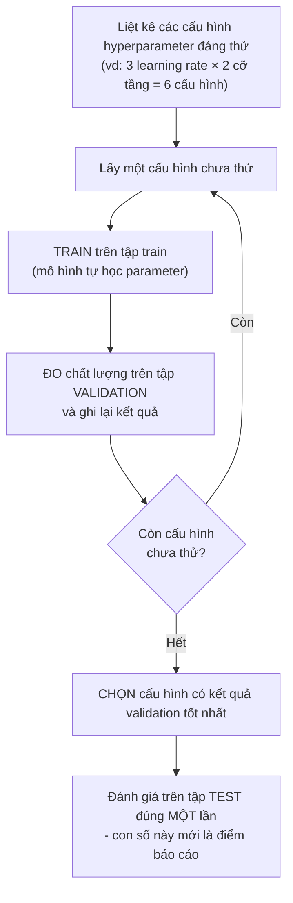

> **Mục tiêu bài học:** Sau bài này, bạn sẽ phân biệt rạch ròi **parameter** (thứ mô hình tự học) với **hyperparameter** (thứ bạn chọn trước khi train), hiểu **capacity** - "độ dẻo" - của mô hình là gì, và biết quy trình chọn hyperparameter một cách có kỷ luật bằng validation set.

## 1. Hai loại "núm vặn" trên cùng một cỗ máy

Bạn vừa train xong mô hình đầu tiên và mở file đã lưu ra xem: toàn là số - hệ số, trọng số. Nhưng tìm mãi không thấy **learning rate** đâu, dù bạn đã phải tự gõ nó vào trước khi bấm train. Mô hình học được hệ số, sao không học luôn learning rate cho tiện?

Ở Bài 01, ta ví mô hình ML như **cỗ máy nhiều núm vặn**; qua Bài 10 và Bài 11, bạn đã biết ai vặn: *thuật toán tối ưu, dựa trên dữ liệu*. Câu hỏi trên hé lộ điều Bài 01 chưa nói - trên cỗ máy ấy có **hai loại núm khác hẳn nhau**.

> Hình dung bạn chỉnh một cây guitar. Có thứ bạn chỉnh *trong lúc chơi và nghe*: vặn khóa từng dây, nghe còn phô thì vặn tiếp, chỉnh dần đến khi tiếng đàn thật chuẩn. Và có thứ bạn phải *quyết trước khi bắt đầu*: chọn **cỡ dây**, chọn cách lên tông cho cả bài. Muốn đổi cỡ dây giữa chừng? Tháo hết dây ra, lắp lại, chỉnh lại từ đầu.

Chỉnh dây theo tai chính là **parameter**: được điều chỉnh dần trong lúc "huấn luyện", theo tín hiệu sai lệch. Chọn cỡ dây chính là **hyperparameter**: bạn quyết từ đầu, và đổi nó nghĩa là train lại từ đầu. Learning rate là một "cỡ dây" như thế - vì vậy nó không nằm trong file mô hình.

Lẫn lộn hai loại núm này là nguồn gốc của rất nhiều nhầm lẫn ở người mới, nên ta sẽ tách bạch chúng thật kỹ.

## 2. Parameter - thứ mô hình tự học từ dữ liệu

Nhớ người thợ ống nước ở Bài 01: nhìn vài hóa đơn, bạn nhẩm ra công thợ **100 nghìn/giờ** cộng **50 nghìn** phí đến nhà. Mô hình là `tiền = a × giờ + b`, và hai con số $a = 100$, $b = 50$ không do ai gán bằng tay - chúng được *rút ra từ hóa đơn*. Đưa hóa đơn của một người thợ khác vào, $a$ và $b$ học được sẽ khác.

Đó chính là **parameter (tham số)**: các con số **nằm bên trong mô hình** và được **thuật toán huấn luyện tự điều chỉnh** để giảm loss.

Vài parameter quen mặt:

- Hệ số góc và hệ số chặn của **hồi quy tuyến tính** ($a$, $b$ ở trên).
- Các hệ số của một **đa thức** khi fit dữ liệu - đa thức bậc $d$ có $d + 1$ hệ số.
- **Trọng số (weights)** và **bias** của mạng nơ-ron - từ vài chục con số đến hàng tỷ, như Bài 01 đã nhắc.

Một cách nhận diện thực dụng, cũng là lời giải cho câu hỏi mở đầu: khi bạn **lưu mô hình ra file** sau khi train, thứ được ghi vào file chủ yếu chính là các parameter - bên cạnh ít thông tin kỹ thuật để dựng lại đúng cỗ máy. "Tải mô hình đã huấn luyện" nghĩa là tải lại đúng bộ vị trí núm vặn mà quá trình học đã tìm ra.

## 3. Hyperparameter - thứ bạn chọn trước khi bấm nút train

Suốt các bài trước, bạn đã gặp không ít hyperparameter mà có thể chưa gọi tên:

- **Learning rate** (Bài 11): bước chân dài hay ngắn của người xuống núi trong sương mù. Gradient descent *dùng* nó chứ không *học* nó.
- **$k$ trong k-NN** (Bài 07): nhìn 1 hàng xóm hay 15 hàng xóm để bỏ phiếu?
- **Số tầng, số nơ-ron mỗi tầng** của mạng nơ-ron: hình dáng của chính cỗ máy.
- **Bậc của đa thức** khi fit dữ liệu: dùng đường thẳng, parabol hay đa thức bậc 9?
- **Mức regularization** - "mức phạt" đánh vào độ phức tạp của mô hình để kìm overfitting (Bài 14 sẽ nói kỹ).
- **Batch size, số epoch** (Bài 11): mỗi bước nhìn bao nhiêu mẫu, lặp qua dữ liệu bao nhiêu vòng.

Điểm chung của cả danh sách: **hyperparameter (siêu tham số)** là các cấu hình của mô hình và của quá trình huấn luyện mà **thuật toán tối ưu không học trực tiếp** như parameter. Chúng do người làm ML (hoặc một quy trình dò tìm bên ngoài) lựa chọn, thường là trước khi train.

Đặt hai loại núm cạnh nhau:

| Tiêu chí | **Parameter (tham số)** | **Hyperparameter (siêu tham số)** |
|---|---|---|
| Ai quyết định giá trị? | Mô hình **tự học** từ dữ liệu | **Người làm ML** chọn |
| Quyết định khi nào? | *Trong* quá trình huấn luyện | Thường là *trước* khi huấn luyện (có thể thay đổi theo lịch đặt sẵn) |
| Được điều chỉnh bằng gì? | Thuật toán tối ưu (gradient descent...) dựa trên loss | Thử nghiệm nhiều cấu hình, so kết quả trên validation set |
| Nằm ở đâu sau khi train? | Trong file mô hình đã lưu | Trong code/cấu hình thí nghiệm của bạn |
| Ví dụ | $a, b$ của đường thẳng; hệ số đa thức; trọng số & bias mạng nơ-ron | Learning rate; $k$ của k-NN; số tầng, số nơ-ron; bậc đa thức; mức regularization; batch size; số epoch |
| Số lượng điển hình | Vài con số → hàng tỷ | Thường chỉ vài → vài chục |

Mẹo ghi nhớ: con số *được thuật toán tối ưu tự điều chỉnh dựa trên loss* → parameter. Con số *do bạn (hoặc một vòng dò tìm bên ngoài) quyết định* → hyperparameter.

> 🔧 **Thử ngay:** xếp 6 mục sau vào đúng cột - *bậc của đa thức; bias của một nơ-ron; mức phạt regularization; hệ số góc $a = 100$ nghìn/giờ của người thợ ống nước; batch size; hệ số của $x^2$ trong parabol sau khi fit.*
>
> **Đáp án:** parameter = bias của nơ-ron, hệ số góc $a$, hệ số của $x^2$; hyperparameter = bậc đa thức, mức regularization, batch size. Để ý cặp cuối: *bậc* của đa thức là hyperparameter (bạn chọn), còn *hệ số* của nó là parameter (mô hình học) - cùng một đa thức, hai loại núm.

> ⚠️ **Lưu ý nhỏ:** Một vài hyperparameter, như learning rate, có thể được *lên lịch* thay đổi dần trong lúc train (learning rate schedule, Bài 11) - nhưng cái lịch ấy cũng do bạn đặt ra, không phải mô hình tự học. Sách *Dive into Deep Learning* còn lưu ý: bộ hyperparameter tốt cho bài toán này thường **không bê nguyên** sang kiến trúc hay bộ dữ liệu khác được - đổi bài toán là phải dò lại.

Một điều đáng để ý: nhiều hyperparameter - bậc đa thức, số tầng, $k$ - thực chất cùng điều khiển **một thứ**: độ "dẻo" của mô hình. Đó là khái niệm tiếp theo.

## 4. Capacity: mô hình "cứng" và mô hình "dẻo"

Bạn có dữ liệu của 8 học viên: feature là *giờ ôn thi*, label là *điểm thi*. Quy luật thật có dạng cong - ôn nhiều điểm tăng, rồi bão hòa dần - cộng thêm chút nhiễu đời thường (hôm thi đau bụng, đề trúng tủ...). Bạn fit thử ba mô hình:

```
① QUÁ CỨNG - đa thức bậc 1 (đường thẳng)
Điểm │              ●    ●        ╱
     │         ●        ╱   ●
     │      ●      ╱
     │    ●   ╱                ← đường thẳng không "cong" nổi:
     │   ╱ ●                     sai lệch có hệ thống ở hai đầu
     └───────────────────────── Giờ ôn

② VỪA PHẢI - đa thức bậc 2
Điểm │              ●────●───
     │         ● ╭──╯       ← bám xu hướng chung,
     │      ● ╭─╯             chấp nhận lệch nhỏ do nhiễu
     │    ●╭─╯
     │   ─╯●
     └───────────────────────── Giờ ôn

③ QUÁ DẺO - đa thức bậc 9
Điểm │             ╭●╮  ╭●─
     │         ●╮ ╭╯ ╰──╯   ← luồn qua ĐÚNG từng điểm,
     │      ●╮ ╰●╯            kể cả điểm nhiễu: sai số train = 0
     │    ●╮╰╯                nhưng dự đoán uốn éo vô lý
     │   ─╯●
     └───────────────────────── Giờ ôn
```

- **① Quá cứng (underfit - học chưa tới):** mô hình không đủ dẻo để biểu diễn quy luật thật. Sai nhiều cả trên train lẫn dữ liệu mới. Cho thêm bao nhiêu dữ liệu cũng không cứu được - trần capacity đã chặn ở đó.
- **② Vừa phải:** bám được xu hướng, bỏ qua nhiễu. Đây là vùng ta muốn.
- **③ Quá dẻo (overfit - học vẹt):** đa thức bậc 9 có 10 hệ số - với 8 điểm dữ liệu, nó thừa sức luồn qua *đúng từng điểm*, đạt sai số train bằng 0. Nghe hoàn hảo? Sách *An Introduction to Statistical Learning* có ví dụ tương tự với đường spline "fit hoàn hảo tập train": đường fit uốn éo dữ dội hơn hẳn quy luật thật, và **dự đoán trên dữ liệu mới tệ đi rõ rệt** - vì mô hình đã học thuộc cả những dao động chỉ do ngẫu nhiên mà có.

Thứ thay đổi qua ba mô hình vừa rồi gọi là **capacity (sức chứa)** - sách *An Introduction to Statistical Learning* dùng chữ **flexibility (độ linh hoạt)**: mô hình có thể biểu diễn được *họ hình dạng* phong phú đến đâu. Đường thẳng chỉ vẽ được... đường thẳng: capacity thấp. Đa thức bậc 9 uốn lượn được đủ kiểu: capacity cao. Capacity chịu ảnh hưởng bởi loại mô hình, kiến trúc, các ràng buộc/regularization và các hyperparameter liên quan; parameter là các núm bên trong "khung" capacity đã chọn.

> 🔧 **Thử ngay:** chạy 4 dòng sau (giờ ôn 1→8, điểm thi tương ứng); mỗi dòng in ra *bậc - sai số train lớn nhất - điểm dự đoán nếu ôn 9 giờ*:
> ```python
> import numpy as np
> x = np.arange(1, 9); y = np.array([4.0, 5.5, 6.5, 7.2, 7.6, 8.1, 8.0, 8.4])  # 8 học viên: giờ ôn → điểm
> for d in (1, 2, 7):
>     p = np.polyfit(x, y, d); print(d, np.abs(np.polyval(p, x) - y).max().round(3), np.polyval(p, 9).round(1))
> ```
> **Đáp số:** `1 0.892 9.5` - `2 0.252 7.9` - `7 0.0 26.0`. Đa thức bậc 7 (8 hệ số - vừa đủ cho 8 điểm) khớp *đúng* cả 8 điểm, sai số train bằng 0, rồi đoán rằng ôn 9 giờ sẽ được... **26 điểm** trên thang 10. Parabol có sai số train cao hơn nhưng đoán 7,9 điểm - hợp lý hơn hẳn.

Ghép lại thành bức tranh tổng quát (theo chương 2 sách *An Introduction to Statistical Learning*): khi tăng dần capacity, **sai số trên train chỉ có giảm**, nhưng **sai số trên dữ liệu mới đi theo hình chữ U** - giảm đến một điểm rồi quay đầu tăng:

```
 Sai số
   ▲
   │ ╲                                ╱
   │  ╲    sai số trên DỮ LIỆU MỚI   ╱
   │   ╲_____                  _____╱
   │         ╲______    ______╱
   │                ╲__╱ ← đáy chữ U: capacity "vừa vặn"
   │  ──__
   │      ‾‾──___          sai số trên TRAIN
   │             ‾‾───______  (thường giảm khi capacity tăng)
   └───────────────────────────────────▶ Capacity (độ linh hoạt)
       ① quá cứng      ② vừa      ③ quá dẻo
```

Một điều dễ gây bất ngờ với k-NN: **$k$ nhỏ nghĩa là capacity cao**. Với $k = 1$, mô hình "ghi nhớ" gần như từng điểm train và ranh giới phân loại ngoằn ngoèo theo từng điểm nhiễu - nếu trong dữ liệu không có hai điểm nào trùng đặc trưng mà lại mang nhãn khác nhau thì sai số train xuống đúng 0; $k$ rất lớn thì ngược lại, quá cứng. Trong ví dụ mô phỏng của sách *An Introduction to Statistical Learning*, $k = 1$ sai 16,95% trên dữ liệu mới, $k = 100$ sai 19,25%, còn $k = 10$ chỉ sai 13,63% - sát ngưỡng sai số thấp nhất mà không mô hình nào xuống thấp hơn được trên bộ dữ liệu đó (13,04%). Cả hai cực đều thua rõ rệt mức $k$ trung gian.

**Capacity cao + dữ liệu ít → dễ overfit.** Bạn đã gặp An và Bình ở Bài 04; sách *Dive into Deep Learning* cũng kể một câu chuyện tương tự về hai sinh viên: một bạn *học thuộc lòng* đáp án đề các năm trước, một bạn *rút ra quy luật* giải bài. Gặp lại đề cũ, bạn học thuộc thắng tuyệt đối (100% so với khoảng 90%); gặp đề mới toanh, bạn rút quy luật vẫn giữ được mức 90% ấy, còn bạn học thuộc đứng hình. Mô hình capacity cao với ít dữ liệu chính là "bạn học thuộc lòng": đủ chỗ chứa để ghi nhớ nguyên tập train thay vì buộc phải rút ra quy luật chung. Vì sao hiện tượng này xảy ra, đo nó thế nào và kìm nó bằng gì (regularization, early stopping...) - đó là trọn vẹn nội dung **Bài 14**; ở đây bạn chỉ cần mang theo đúng một câu: *sai số train thấp chưa nói lên điều gì về dữ liệu mới*.

<details>
<summary><b>Đào sâu: đếm parameter chưa đủ để đo capacity</b></summary>

Trực giác "nhiều parameter hơn = capacity cao hơn" thường đúng nhưng không tuyệt đối. Sách *Dive into Deep Learning* lưu ý rằng ngoài *số lượng* parameter, *miền giá trị mà parameter được phép nhận* cũng là một thước đo độ phức tạp - đây chính là cửa ngõ dẫn tới weight decay/regularization (Bài 14). Sách còn nêu một ví dụ ngược đời: các phương pháp kernel làm việc trong không gian có *vô hạn* parameter, nhưng độ phức tạp của chúng lại được kìm bằng cách khác. Ngoài ra, các mạng nơ-ron hiện đại vốn thừa parameter tới mức fit hoàn hảo tập train mà *vẫn* tổng quát hóa tốt; với chúng, bức tranh chữ U cổ điển trở nên phức tạp hơn (giới nghiên cứu gọi một biến thể là "double descent"). Giải thích trọn vẹn vì sao chúng tổng quát hóa tốt vẫn là câu hỏi mở của ngành. Với người mới bắt đầu, bức tranh chữ U cổ điển vẫn là kim chỉ nam thực dụng và đúng trong đa số tình huống bạn gặp.

</details>

## 5. Đánh đổi: linh hoạt hơn thường khó diễn giải hơn

Ngân hàng từ chối khoản vay của bạn. Bạn hỏi: "vì sao?". Nếu quyết định đó đến từ một mạng nơ-ron hàng triệu trọng số, nhân viên ngân hàng gần như không có câu trả lời - dù mô hình ấy có thể đoán rủi ro chuẩn hơn.

Nếu capacity cao nhiều rủi ro như mục 4 đã cho thấy, sao không dùng luôn mô hình đơn giản cho lành? Vì mô hình quá cứng lại underfit với bài toán phức tạp. Nhưng tình huống trên cho thấy còn một lý do nữa để cân nhắc mô hình đơn giản, và nó không liên quan đến độ chính xác: **khả năng diễn giải (interpretability)**.

Theo sách *An Introduction to Statistical Learning*: nhìn chung, khi độ linh hoạt của một phương pháp tăng lên, khả năng diễn giải của nó giảm xuống. Cuốn sách vẽ hẳn một "bản đồ" các phương pháp trên hai trục:

```
 Dễ diễn giải ▲
              │ ● Hồi quy tuyến tính
              │
              │        ● Cây quyết định
              │
              │                ● Random forest, boosting
              │
 Khó diễn giải│                        ● Mạng nơ-ron sâu
              └────────────────────────────────▶
              Kém linh hoạt            Rất linh hoạt
```

Hồi quy tuyến tính "cứng" nhưng đọc được như văn xuôi: *"mỗi giờ ôn thêm, điểm tăng trung bình 0,8"*. Một mạng nơ-ron hàng triệu trọng số có thể dự đoán chuẩn hơn, nhưng chỉ vào từng trọng số mà hỏi "con số này nghĩa là gì?" thì gần như vô vọng.

Khi nào khả năng diễn giải đáng giá hơn vài phần trăm độ chính xác? Khi *lý do* quan trọng không kém *kết quả*: ngân hàng từ chối khoản vay cần giải thích được vì sao; bác sĩ cần hiểu mô hình dựa vào đâu trước khi tin theo; nhà khoa học muốn *hiểu quan hệ giữa các biến* chứ không chỉ muốn dự đoán. Ngược lại, với bài toán chỉ cần đoán trúng (gợi ý phim, xếp hạng quảng cáo), người ta sẵn sàng đổi diễn giải lấy độ chính xác.

Và một cảnh báo tinh tế từ chính cuốn sách *An Introduction to Statistical Learning*: ngay cả khi bạn *chỉ* quan tâm độ chính xác, mô hình linh hoạt hơn **không chắc** dự đoán tốt hơn - vì chính nguy cơ overfitting ở mục 4. Nghe ngược đời, nhưng đó là một trong những bài học đắt giá của ngành.

## 6. Chọn hyperparameter: thử - đo trên validation - chọn

Parameter đã có gradient descent lo. Còn hyperparameter thì sao - learning rate bao nhiêu, mấy tầng, $k$ bằng mấy? Không có "gradient" nào cho những câu hỏi này: muốn biết một cấu hình tốt hay không, bạn phải train thử.

Câu trả lời thẳng thắn: phần lớn là **thử nghiệm có kỷ luật**. Quy trình chuẩn dựa trên bộ ba train/validation/test của Bài 04:



Vì sao đo trên validation mà không phải test? Vì khi bạn thử 50 cấu hình rồi *chọn theo* kết quả trên một tập dữ liệu, tập đó đã tham gia vào quá trình ra quyết định - nó không còn "mới tinh" nữa. Test set phải được niêm phong đến phút chót để giữ vai trò "đề thi thật" (Bài 04, và sẽ trở lại trong Bài 14). Sách *Dive into Deep Learning* đặt câu hỏi đáng nhớ: *nếu overfit tập train, vẫn còn tập test giữ cho bạn trung thực; nhưng nếu overfit cả tập test, làm sao bạn biết?*

Một cách đơn giản mà có hệ thống để tổ chức việc "thử nhiều cấu hình" là **grid search (tìm kiếm trên lưới)**: liệt kê vài giá trị đáng thử cho mỗi hyperparameter, rồi train đủ mọi tổ hợp. Ví dụ với 2 hyperparameter:

| Lỗi trên validation | 32 nơ-ron | 64 nơ-ron |
|---|---|---|
| **learning rate = 0,1** | 0,42 | 0,45 |
| **learning rate = 0,01** | 0,31 | **0,27** ← chọn ô này |
| **learning rate = 0,001** | 0,38 | 0,33 |

Ba giá trị learning rate cách nhau 10 lần, đúng như Bài 11 gợi ý: giá trị tốt của learning rate có thể chênh nhau nhiều bậc độ lớn, nên quét theo thang nhân (0,1 → 0,01 → 0,001) hợp lý hơn thang cộng.

Sáu ô = sáu lần train. Điểm yếu lộ ra ngay: số lần train **nhân lên theo từng hyperparameter thêm vào** - 4 hyperparameter, mỗi cái 5 giá trị là $5^4 = 625$ lần train. Để thấy con số này "đắt" cỡ nào: sách *Dive into Deep Learning* dẫn ví dụ train một mạng ResNet trên bộ ảnh CIFAR-10 mất hơn 2 giờ trên một máy đám mây cỡ nhỏ (EC2 g4dn.xlarge) - chỉ thử tuần tự 10 cấu hình đã ngốn gần một ngày. Vì vậy grid search hợp khi bạn có ít hyperparameter và mỗi lần train rẻ; ở mức khái niệm, bạn chỉ cần nhớ tinh thần: *thử có hệ thống, so trên validation, chọn có bằng chứng* - thay vì chỉnh tay theo cảm tính rồi quên mất mình đã thử gì.

> 🔧 **Thử ngay:** bạn muốn thử 3 giá trị learning rate và 4 giá trị số tầng. Grid search cần train bao nhiêu lần? Thêm 5 giá trị batch size nữa thì sao?
>
> **Đáp số:** $3 \times 4 = 12$ lần; thêm batch size: $12 \times 5 = 60$ lần. Một hyperparameter thêm vào nhân số lần train lên 5, không cộng thêm 5.

<details>
<summary><b>Đào sâu: random search và những người bạn</b></summary>

- **Random search (tìm kiếm ngẫu nhiên):** thay vì quét đủ lưới, lấy ngẫu nhiên các tổ hợp trong miền giá trị. Nghe "ẩu" nhưng thường hiệu quả không kém với cùng ngân sách tính toán, nhất là khi chỉ một vài hyperparameter thực sự quan trọng - vì random search thử được nhiều giá trị *khác nhau* của từng hyperparameter hơn là lưới đều.
- **Các phương pháp thông minh hơn** (Bayesian optimization, thư viện như Optuna) dùng kết quả các lần thử trước để *đoán* vùng đáng thử tiếp theo. Sách *Dive into Deep Learning* có hẳn một chương về hyperparameter optimization nếu bạn muốn đi xa.
- Trong scikit-learn, `GridSearchCV` và `RandomizedSearchCV` gói sẵn quy trình này, kết hợp với k-fold cross-validation (cách "luân phiên vai validation" bạn đã học ở Bài 04).

</details>

## 7. Kinh nghiệm thực hành: bắt đầu từ mốc đơn giản

Mạng nơ-ron 5 tầng của bạn đạt 86% trên validation. Tốt hay tệ? Không trả lời được - cho đến khi bạn biết logistic regression đơn giản đạt 85% trên cùng dữ liệu. Toàn bộ độ phức tạp thêm kia mua được đúng 1 điểm phần trăm.

Người mới thường lao ngay vào mô hình to vì "capacity cao hẳn phải tốt". Kinh nghiệm chung của nghề đi ngược lại: **bắt đầu bằng một mô hình đơn giản làm mốc (baseline)** - hồi quy tuyến tính, logistic regression, hay k-NN với $k$ mặc định - rồi mới tăng dần độ phức tạp. Lý do:

- Baseline cho bạn **con số để so**: 86% so với 85% thì độ phức tạp thêm chưa chắc đáng giá - và nếu mô hình to *thua* baseline, đó là tín hiệu phải dừng lại gỡ lỗi: nguyên nhân có thể ở dữ liệu/pipeline (Bài 12), ở cách huấn luyện và hyperparameter, hoặc đơn giản là mô hình chưa hợp với bài toán.
- Mô hình đơn giản **ít hyperparameter**, chạy nhanh, dễ gỡ lỗi - bạn biết sớm dữ liệu của mình "có tín hiệu" hay không.
- Tăng capacity *từng nấc* giúp bạn thấy được đường cong chữ U của mục 4 trên chính bài toán của mình, thay vì nhảy thẳng đến vùng quá dẻo mà không hay.

Một con số đáng nhớ từ sách *Dive into Deep Learning*: với nhiều bài toán, deep learning chỉ vượt được mô hình tuyến tính khi có **hàng nghìn mẫu train trở lên** - thiếu dữ liệu thì mô hình đơn giản rất khó bị đánh bại. Có một lối thoát cho chuyện này mà chương Deep Learning sẽ đo cụ thể: nếu mượn lại một mô hình đã học sẵn từ hàng triệu mẫu thay vì train từ con số không, ngưỡng dữ liệu cần thiết tụt xuống rất nhiều.

Mỗi nấc phức tạp thêm phải *chứng minh* được giá trị bằng kết quả validation - như Bình ở Bài 04 chỉ tin điểm trên hai đề cất riêng, không tin điểm làm đề đã luyện.

## Tóm tắt bài học

- **Parameter** là các con số mô hình **tự học** từ dữ liệu trong lúc train (hệ số $a, b$, trọng số mạng nơ-ron); chúng là thứ được ghi vào file khi lưu mô hình.
- **Hyperparameter** là các cấu hình của mô hình và của quá trình huấn luyện mà **thuật toán tối ưu không học trực tiếp** - do người làm ML (hoặc quy trình dò tìm bên ngoài) chọn: learning rate, $k$ của k-NN, số tầng/số nơ-ron, bậc đa thức, mức regularization, batch size, số epoch.
- **Capacity (độ linh hoạt)** chịu ảnh hưởng bởi loại mô hình, kiến trúc, regularization và các hyperparameter liên quan: quá cứng → underfit (sai cả trên train); quá dẻo → uốn theo nhiễu, sai số train đẹp nhưng dữ liệu mới tệ.
- Khi tăng capacity, **sai số train nhìn chung đi xuống**, còn **sai số trên dữ liệu mới thường đi theo hình chữ U** - mục tiêu là tìm vùng đáy chữ U. Đây là bức tranh cổ điển, đúng cho phần lớn mô hình trong bài; Bài 14 cho thấy các mạng rất lớn có thể phá vỡ nó.
- **Capacity cao + dữ liệu ít → dễ overfit** (mô hình "học thuộc lòng" thay vì rút quy luật) - cơ chế chi tiết và cách phòng chống nằm ở Bài 14.
- Theo sách *An Introduction to Statistical Learning*, mô hình **linh hoạt hơn thường khó diễn giải hơn** - và cũng không chắc dự đoán tốt hơn; chọn mô hình là chọn điểm đánh đổi phù hợp với bài toán.
- Chọn hyperparameter bằng cách **thử nhiều cấu hình và so trên validation set** (grid search là cách có hệ thống đơn giản); khởi đầu từ **baseline đơn giản** rồi tăng dần độ phức tạp.

## Câu hỏi tự kiểm tra

1. Với mô hình `giá nhà = a × diện tích + b × số phòng + c`, đâu là parameter? Nếu bạn quyết định "thêm cả bình phương diện tích vào làm feature", quyết định đó thuộc loại nào? Vì sao?
2. Xếp các mục sau vào cột parameter hoặc hyperparameter: learning rate; trọng số tầng thứ 3 của mạng nơ-ron; số epoch; $k$ trong k-NN; hệ số chặn của hồi quy tuyến tính; số nơ-ron mỗi tầng.
3. Vẽ lại (phác thảo) đường sai số train và sai số trên dữ liệu mới theo capacity. Vì sao sai số train thường giảm khi capacity tăng còn sai số trên dữ liệu mới lại quay đầu tăng?
4. Trong k-NN, tăng $k$ làm mô hình "cứng" hơn hay "dẻo" hơn? Giải thích vì sao $k = 1$ thường đạt sai số train bằng 0 (và trường hợp nào thì không) - và vì sao điều đó không đáng mừng.
5. Một bệnh viện cần mô hình dự đoán nguy cơ biến chứng *kèm lý do* để bác sĩ thẩm định; một nền tảng video cần mô hình gợi ý clip tiếp theo. Với mỗi bài toán, bạn nghiêng về phía nào trên trục linh hoạt-diễn giải? Vì sao?
6. Bạn có 3 giá trị learning rate và 4 giá trị số tầng muốn thử. Grid search cần train bao nhiêu lần? Kết quả nên được so trên tập nào, và vì sao tuyệt đối không chọn cấu hình dựa trên tập test?

## Đọc thêm

**Nguồn nền tảng của bài:**

| Nguồn | Đọc phần nào |
|---|---|
| **An Introduction to Statistical Learning (ISLP)** | Chương 2 - mục 2.1.3 (đánh đổi linh hoạt-diễn giải, Figure 2.7) và mục 2.2 (training MSE vs test MSE, đường chữ U, ví dụ chọn $K$ trong k-NN) |
| **Dive into Deep Learning (d2l.ai)** | Chương 3 (Linear Regression) - mục *Generalization*: training error vs generalization error, model complexity, chuyện "học thuộc lòng vs rút quy luật" |
| **Dive into Deep Learning (d2l.ai)** | Chương *Hyperparameter Optimization* - mục *What Is Hyperparameter Optimization?*: không gian cấu hình, random search, vì sao dò hyperparameter tốn kém |

**Nguồn online bổ sung (miễn phí):**

- [Tuning the hyper-parameters of an estimator - scikit-learn User Guide](https://scikit-learn.org/stable/modules/grid_search.html) - tài liệu chính chủ về `GridSearchCV`, `RandomizedSearchCV`.
- [Hyperparameter Optimization With Random Search and Grid Search - MachineLearningMastery](https://machinelearningmastery.com/hyperparameter-optimization-with-random-search-and-grid-search/) - hướng dẫn thực hành từng bước bằng Python.
- [Google Machine Learning Crash Course](https://developers.google.com/machine-learning/crash-course) - tài liệu nền tảng miễn phí của Google, có các mục ngắn về parameter, hyperparameter và generalization kèm bài tập tương tác.

> **Bài tiếp theo:** [Overfitting, tổng quát hóa và rò rỉ dữ liệu](../overfitting-generalization-data-leakage-vi/) - đi sâu vào "căn bệnh" mà bài này mới chạm nhẹ - vì sao mô hình học vẹt, đo generalization gap thế nào, và những kiểu rò rỉ dữ liệu khiến kết quả đẹp một cách dối trá.
