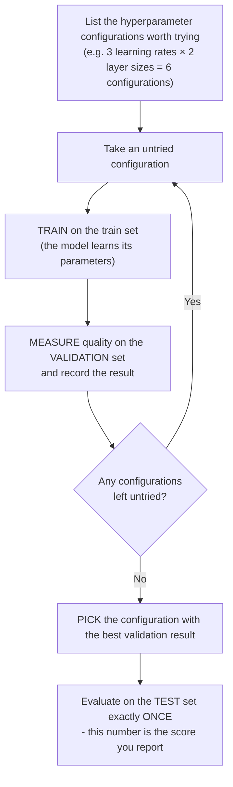

> **Learning objectives:** After this lesson, you will draw a sharp line between a **parameter** (something the model learns by itself) and a **hyperparameter** (something you choose before training), understand what a model's **capacity** - its "flexibility" - is, and know how to choose hyperparameters in a disciplined way using a validation set.

## 1. Two kinds of "knobs" on the same machine

You have just finished training your first model and you open the saved file to have a look: nothing but numbers - coefficients, weights. But no matter how hard you look, you cannot find the **learning rate** anywhere, even though you had to type it in yourself before pressing "train". The model learned the coefficients, so why didn't it learn the learning rate too, for convenience?

In Lesson 01 we compared an ML model to a **machine with many knobs**; through Lesson 10 and Lesson 11 you learned who turns them: *the optimization algorithm, based on the data*. The question above reveals something Lesson 01 did not say - that machine has **two completely different kinds of knobs**.

> Picture yourself tuning a guitar. There are things you adjust *while playing and listening*: you turn the tuning peg of each string, and if your ear still hears it off, you keep turning until the pitch gradually comes right. And there are things you must *decide before you start*: choosing the **string gauge**, choosing the tuning for the whole piece. Want to change the string gauge halfway through? Take all the strings off, put new ones on, and tune again from scratch.

Tuning strings by ear is exactly what a **parameter** is: adjusted gradually during "training", following the error signal. Choosing the string gauge is exactly what a **hyperparameter** is: you decide it at the start, and changing it means training all over again. The learning rate is one such "string gauge" - which is why it is not in the model file.

Mixing up these two kinds of knobs is the source of a great deal of confusion among beginners, so we will separate them very carefully.

## 2. Parameters - what the model learns by itself from data

Remember the plumber from Lesson 01: looking at a few invoices, you worked out that labor costs **100,000 VND/hour** plus a **50,000 VND** call-out fee. The model is `cost = a × hours + b`, and the two numbers $a = 100$, $b = 50$ were not assigned by hand by anyone - they were *extracted from the invoices*. Feed in another plumber's invoices and the learned $a$ and $b$ will be different.

That is precisely what a **parameter** is: the numbers that **live inside the model** and are **adjusted automatically by the training algorithm** to reduce the loss.

Some familiar parameters:

- The slope and intercept of a **linear regression** ($a$, $b$ above).
- The coefficients of a **polynomial** fitted to data - a polynomial of degree $d$ has $d + 1$ coefficients.
- The **weights** and **biases** of a neural network - from a few dozen numbers to billions, as Lesson 01 mentioned.

A practical way to recognize them, which is also the answer to the opening question: when you **save the model to a file** after training, what gets written to the file is mainly the parameters - alongside a little technical information for rebuilding exactly the same machine. "Loading a trained model" means loading back exactly the set of knob positions that the learning process found.

## 3. Hyperparameters - what you choose before pressing "train"

Throughout the previous lessons you have met quite a few hyperparameters without perhaps naming them:

- **Learning rate** (Lesson 11): the long or short stride of the person walking down the mountain in the fog. Gradient descent *uses* it; it does not *learn* it.
- **$k$ in k-NN** (Lesson 07): look at 1 neighbor or 15 neighbors to vote?
- **Number of layers, number of neurons per layer** in a neural network: the shape of the machine itself.
- **Degree of the polynomial** when fitting data: use a straight line, a parabola, or a degree-9 polynomial?
- **Amount of regularization** - the "penalty" applied to the model's complexity to hold back overfitting (Lesson 14 will go into detail).
- **Batch size, number of epochs** (Lesson 11): how many examples each step looks at, how many passes over the data.

What the whole list has in common: **hyperparameters** are the settings of the model and of the training process that **the optimization algorithm does not learn directly** the way it learns parameters. They are chosen by the ML practitioner (or by an external search procedure), usually before training.

Putting the two kinds of knobs side by side:

| Criterion | **Parameter** | **Hyperparameter** |
|---|---|---|
| Who decides the value? | The model **learns it** from data | The **ML practitioner** chooses it |
| Decided when? | *During* training | Usually *before* training (may change on a preset schedule) |
| Adjusted by what? | The optimization algorithm (gradient descent...) based on the loss | Trying many configurations and comparing results on the validation set |
| Where does it live after training? | In the saved model file | In your code / experiment configuration |
| Examples | $a, b$ of the line; polynomial coefficients; neural network weights & biases | Learning rate; $k$ of k-NN; number of layers, number of neurons; polynomial degree; amount of regularization; batch size; number of epochs |
| Typical count | A few numbers → billions | Usually just a few → a few dozen |

A memory trick: a number *adjusted automatically by the optimization algorithm based on the loss* → parameter. A number *decided by you (or by an external search loop)* → hyperparameter.

> 🔧 **Try it now:** sort the following 6 items into the right column - *the degree of a polynomial; the bias of a neuron; the regularization penalty; the plumber's slope $a = 100$ thousand VND/hour; the batch size; the coefficient of $x^2$ in a parabola after fitting.*
>
> **Answer:** parameter = the neuron's bias, the slope $a$, the coefficient of $x^2$; hyperparameter = polynomial degree, regularization amount, batch size. Notice the last pair: the *degree* of the polynomial is a hyperparameter (you choose it), while its *coefficients* are parameters (the model learns them) - one polynomial, two kinds of knobs.

> ⚠️ **A small note:** A few hyperparameters, such as the learning rate, can be *scheduled* to change gradually during training (learning rate schedule, Lesson 11) - but that schedule is also something you set, not something the model learns. The book *Dive into Deep Learning* adds a further note: a good set of hyperparameters for one problem usually **cannot be carried over as-is** to another architecture or dataset - change the problem and you have to search again.

One thing worth noticing: polynomial degree, number of layers, $k$ - many hyperparameters actually control **the same thing**: how "flexible" the model is. That is the next concept.

## 4. Capacity: "stiff" models and "flexible" models

You have data on 8 students: the feature is *hours of exam revision*, the label is *exam score*. The true rule is curved - more revision raises the score, then it gradually saturates - plus a bit of everyday noise (a stomachache on exam day, the questions happening to match what was revised...). You try fitting three models:

```
① TOO STIFF - degree-1 polynomial (straight line)
Score│              ●    ●        ╱
     │         ●        ╱   ●
     │      ●      ╱
     │    ●   ╱                ← the line cannot "bend":
     │   ╱ ●                     systematic error at both ends
     └───────────────────────── Hours revised

② JUST RIGHT - degree-2 polynomial
Score│              ●────●───
     │         ● ╭──╯       ← follows the overall trend,
     │      ● ╭─╯             accepts small deviations due to noise
     │    ●╭─╯
     │   ─╯●
     └───────────────────────── Hours revised

③ TOO FLEXIBLE - degree-9 polynomial
Score│             ╭●╮  ╭●─
     │         ●╮ ╭╯ ╰──╯   ← threads EXACTLY through every point,
     │      ●╮ ╰●╯            noisy ones included: train error = 0
     │    ●╮╰╯                but the predictions wiggle absurdly
     │   ─╯●
     └───────────────────────── Hours revised
```

- **① Too stiff (underfit - has not learned enough):** the model is not flexible enough to represent the true rule. It errs a lot both on train and on new data. No amount of extra data can rescue it - the capacity ceiling blocks it there.
- **② Just right:** it follows the trend and ignores the noise. This is the region we want.
- **③ Too flexible (overfit - rote memorization):** a degree-9 polynomial has 10 coefficients - with 8 data points, it has more than enough room to thread through *every single point* and reach a train error of zero. Sounds perfect? The book *An Introduction to Statistical Learning* has a similar example with a spline that "fits the training set perfectly": the fitted curve wiggles far more violently than the true rule, and **predictions on new data get noticeably worse** - because the model has memorized fluctuations that exist only by chance.

The thing that changed across the three models is called **capacity** - the book *An Introduction to Statistical Learning* uses the word **flexibility**: how rich a *family of shapes* the model can represent. A straight line can only draw... straight lines: low capacity. A degree-9 polynomial can bend in all sorts of ways: high capacity. Capacity is influenced by the type of model, the architecture, the constraints/regularization, and the related hyperparameters; parameters are the knobs inside the capacity "frame" that has been chosen.

> 🔧 **Try it now:** run the 4 lines below (hours revised 1→8, with the corresponding exam scores); each line prints *degree - largest train error - predicted score for 9 hours of revision*:
> ```python
> import numpy as np
> x = np.arange(1, 9); y = np.array([4.0, 5.5, 6.5, 7.2, 7.6, 8.1, 8.0, 8.4])  # 8 students: hours revised → score
> for d in (1, 2, 7):
>     p = np.polyfit(x, y, d); print(d, np.abs(np.polyval(p, x) - y).max().round(3), np.polyval(p, 9).round(1))
> ```
> **Answer:** `1 0.892 9.5` - `2 0.252 7.9` - `7 0.0 26.0`. The degree-7 polynomial (8 coefficients - exactly enough for 8 points) fits all 8 points *exactly*, with a train error of zero, and then predicts that 9 hours of revision will earn... **26 points** on a 10-point scale. The parabola has a higher train error but predicts 7.9 points - far more sensible.

Putting it together into the general picture (following chapter 2 of *An Introduction to Statistical Learning*): as capacity increases, **the error on train can only go down**, but **the error on new data follows a U shape** - it falls to a certain point and then turns back up:

```
 Error
   ▲
   │ ╲                                ╱
   │  ╲    error on NEW DATA         ╱
   │   ╲_____                  _____╱
   │         ╲______    ______╱
   │                ╲__╱ ← bottom of the U: "just right" capacity
   │  ──__
   │      ‾‾──___          error on TRAIN
   │             ‾‾───______  (usually falls as capacity rises)
   └───────────────────────────────────▶ Capacity (flexibility)
       ① too stiff    ② just right   ③ too flexible
```

One thing about k-NN that easily surprises people: **small $k$ means high capacity**. With $k = 1$, the model "memorizes" almost every training point and the classification boundary zigzags around every noisy point - if no two points in the data share the same features but carry different labels, the train error drops to exactly zero; a very large $k$ is the opposite, too stiff. In the simulated example in *An Introduction to Statistical Learning*, $k = 1$ errs 16.95% on new data, $k = 100$ errs 19.25%, while $k = 10$ errs only 13.63% - close to the lowest error level that no model can go below on that dataset (13.04%). Both extremes lose clearly to the intermediate $k$.

**High capacity + little data → prone to overfitting.** You met An and Binh in Lesson 04; *Dive into Deep Learning* tells its own version with two students: one *memorizes* the answers to past years' exams, the other *works out the rules* for solving the problems. Facing an old exam again, the memorizer wins outright (100% versus about 90%); facing a brand-new exam, the rule-finder still holds that 90%, while the memorizer freezes. A high-capacity model with little data is exactly "the student who memorizes": it has enough room to store the whole training set instead of being forced to extract a general rule. Why this phenomenon happens, how to measure it, and how to hold it back (regularization, early stopping...) - that is the entire content of **Lesson 14**; here you only need to take away one sentence: *a low train error says nothing yet about new data*.

<details>
<summary><b>Going deeper: counting parameters is not enough to measure capacity</b></summary>

The intuition "more parameters = higher capacity" is usually right but not absolute. *Dive into Deep Learning* notes that besides the *number* of parameters, *the range of values the parameters are allowed to take* is also a measure of complexity - this is exactly the doorway to weight decay/regularization (Lesson 14). The book also gives a paradoxical example: kernel methods work in a space with *infinitely many* parameters, yet their complexity is held in check by other means. Moreover, modern neural networks have so many surplus parameters that they fit the training set perfectly and *still* generalize well; for them, the classic U-shaped picture becomes more complicated (researchers call one variant "double descent"). Fully explaining why they generalize so well remains an open question in the field. For a beginner, the classic U-shaped picture is still a practical guide and correct in most situations you will meet.

</details>

## 5. The trade-off: more flexible usually means harder to interpret

The bank turns down your loan. You ask: "why?". If that decision came from a neural network with millions of weights, the bank employee has almost no answer - even though that model may predict risk more accurately.

If high capacity is as risky as Section 4 says, why not just use a simple model and be safe? Because a model that is too stiff underfits on a complex problem. But the situation above shows there is one more reason to consider a simple model, and it has nothing to do with accuracy: **interpretability**.

According to *An Introduction to Statistical Learning*: in general, as the flexibility of a method increases, its interpretability decreases. The book actually draws a "map" of methods on two axes:

```
 Easy to interpret ▲
                   │ ● Linear regression
                   │
                   │        ● Decision trees
                   │
                   │                ● Random forests, boosting
                   │
 Hard to interpret │                        ● Deep neural networks
                   └────────────────────────────────▶
                   Less flexible            Very flexible
```

Linear regression is "stiff" but reads like prose: *"for each extra hour of revision, the score rises by 0.8 on average"*. A neural network with millions of weights may predict more accurately, but pointing at an individual weight and asking "what does this number mean?" is nearly hopeless.

When is interpretability worth more than a few percentage points of accuracy? When the *reason* matters as much as the *result*: a bank rejecting a loan needs to be able to explain why; a doctor needs to understand what the model is relying on before trusting it; a scientist wants to *understand the relationship between variables*, not merely to predict. Conversely, for problems that only need to get the answer right (movie recommendations, ad ranking), people are happy to trade interpretability for accuracy.

And a subtle warning from *An Introduction to Statistical Learning* itself: even when you care *only* about accuracy, a more flexible model is **not guaranteed** to predict better - precisely because of the overfitting risk in Section 4. It sounds paradoxical, but it is one of the field's hard-won lessons.

## 6. Choosing hyperparameters: try - measure on validation - pick

Parameters are taken care of by gradient descent. What about hyperparameters - what learning rate, how many layers, what $k$? There is no "gradient" for these questions: to know whether a configuration is good, you have to train and see.

The honest answer: it is mostly **disciplined experimentation**. The standard procedure builds on the train/validation/test trio from Lesson 04:



Why measure on validation rather than test? Because once you have tried 50 configurations and *chosen based on* the results on some dataset, that dataset has taken part in the decision-making - it is no longer "brand new". The test set must stay sealed until the very end to keep its role as "the real exam" (Lesson 04, and it will come back in Lesson 14). *Dive into Deep Learning* asks a memorable question: *if you overfit the training set, there is still the test set to keep you honest; but if you overfit the test set too, how would you know?*

A simple yet systematic way to organize "trying many configurations" is **grid search**: list a few values worth trying for each hyperparameter, then train every combination. For example, with 2 hyperparameters:

| Validation error | 32 neurons | 64 neurons |
|---|---|---|
| **learning rate = 0.1** | 0.42 | 0.45 |
| **learning rate = 0.01** | 0.31 | **0.27** ← pick this cell |
| **learning rate = 0.001** | 0.38 | 0.33 |

The three learning rate values are a factor of 10 apart, just as Lesson 11 suggested: good learning rate values can differ by several orders of magnitude, so sweeping on a multiplicative scale (0.1 → 0.01 → 0.001) makes more sense than an additive one.

Six cells = six training runs. The weakness shows immediately: the number of runs **multiplies with every hyperparameter you add** - 4 hyperparameters with 5 values each is $5^4 = 625$ training runs. To see how "expensive" that is: *Dive into Deep Learning* cites the example of training a ResNet on the CIFAR-10 image dataset, which takes over 2 hours on a small cloud machine (EC2 g4dn.xlarge) - merely trying 10 configurations one after another already eats about a day. So grid search suits few hyperparameters and cheap training runs; at the conceptual level, you just need to remember the spirit: *try systematically, compare on validation, choose with evidence* - instead of tweaking by hand on gut feeling and then forgetting what you tried.

> 🔧 **Try it now:** you want to try 3 learning rate values and 4 values for the number of layers. How many training runs does grid search need? What if you add 5 batch size values?
>
> **Answer:** $3 \times 4 = 12$ runs; adding batch size: $12 \times 5 = 60$ runs. One extra hyperparameter multiplies the number of runs by 5; it does not add 5.

<details>
<summary><b>Going deeper: random search and friends</b></summary>

- **Random search:** instead of sweeping the full grid, sample combinations at random from the value ranges. It sounds "sloppy" but is often just as effective on the same compute budget, especially when only a few hyperparameters really matter - because random search tries more *distinct* values of each hyperparameter than a regular grid does.
- **Smarter methods** (Bayesian optimization, libraries such as Optuna) use the results of previous trials to *guess* which region is worth trying next. *Dive into Deep Learning* has an entire chapter on hyperparameter optimization if you want to go further.
- In scikit-learn, `GridSearchCV` and `RandomizedSearchCV` package this procedure up, combined with k-fold cross-validation (the "rotating the validation role" technique you learned in Lesson 04).

</details>

## 7. Practical experience: start from a simple baseline

Your 5-layer neural network reaches 86% on validation. Good or bad? Impossible to say - until you learn that a plain logistic regression reaches 85% on the same data. All that extra complexity bought exactly 1 percentage point.

Beginners often rush straight to a big model because "high capacity must surely be better". The profession's collective experience says the opposite: **start with a simple model as a baseline** - linear regression, logistic regression, or k-NN with the default $k$ - and only then increase complexity step by step. The reasons:

- A baseline gives you **a number to compare against**: 86% versus 85% means the added complexity may not be worth it - and if the big model *loses* to the baseline, that is a signal to stop and debug: the cause may lie in the data/pipeline (Lesson 12), in the training procedure and hyperparameters, or simply in the model not suiting the problem.
- A simple model has **few hyperparameters**, runs fast, and is easy to debug - you find out early whether your data "has signal" or not.
- Increasing capacity *one notch at a time* lets you see the U-shaped curve of Section 4 on your own problem, instead of jumping straight into the too-flexible region without noticing.

A number worth remembering from *Dive into Deep Learning*: for many problems, deep learning only beats a linear model once there are **thousands of training examples or more** - with scarce data, a simple model is very hard to beat. There is a way out of this, which the Deep Learning chapter will measure concretely: if you borrow a model that has already learned from millions of examples instead of training from scratch, the amount of data needed drops dramatically.

Every extra notch of complexity has to *prove* its worth through validation results - just as Binh in Lesson 04 only trusted scores on the two exams set aside, not scores on the exams already practiced.

## Lesson summary

- **Parameters** are the numbers the model **learns by itself** from data during training (coefficients $a, b$, neural network weights); they are what gets written to the file when you save a model.
- **Hyperparameters** are settings **the optimization algorithm does not learn directly** - chosen by the ML practitioner (or an external search procedure): learning rate, $k$ of k-NN, number of layers/neurons, polynomial degree, amount of regularization, batch size, number of epochs.
- **Capacity (flexibility)** is influenced by the type of model, the architecture, regularization, and the related hyperparameters: too stiff → underfit (errs even on train); too flexible → bends to the noise, pretty train error but poor on new data.
- As capacity increases, **train error generally goes down**, while **error on new data usually follows a U shape** - the goal is to find the bottom of the U. This is the classic picture, true for most of the models in this lesson; Lesson 14 shows that very large networks can break it.
- **High capacity + little data → prone to overfitting** (the model "memorizes" instead of extracting the rule) - the detailed mechanism and the defenses are in Lesson 14.
- According to *An Introduction to Statistical Learning*, a **more flexible model is usually harder to interpret** - and not guaranteed to predict better either; choosing a model means choosing the trade-off point that suits the problem.
- Choose hyperparameters by **trying many configurations and comparing on the validation set** (grid search is the simple systematic way); start from a **simple baseline** and increase complexity gradually.

## Self-check questions

1. In the model `house price = a × area + b × number of rooms + c`, which are the parameters? If you decide to "also add the square of the area as a feature", what kind of decision is that? Why?
2. Sort the following into the parameter or hyperparameter column: learning rate; the weights of the 3rd layer of a neural network; number of epochs; $k$ in k-NN; the intercept of a linear regression; number of neurons per layer.
3. Redraw (sketch) the train error curve and the new-data error curve against capacity. Why does train error usually fall as capacity increases while error on new data turns back up?
4. In k-NN, does increasing $k$ make the model "stiffer" or "more flexible"? Explain why $k = 1$ usually achieves a train error of zero (and in which case it does not) - and why that is nothing to celebrate.
5. A hospital needs a model that predicts the risk of complications *together with the reasons* so doctors can review it; a video platform needs a model that recommends the next clip. For each problem, which way do you lean on the flexibility-interpretability axis? Why?
6. You have 3 learning rate values and 4 values for the number of layers you want to try. How many training runs does grid search need? On which set should the results be compared, and why must you absolutely not choose a configuration based on the test set?

## Further reading

**Primary sources for this lesson:**

| Source | Which part to read |
|---|---|
| **An Introduction to Statistical Learning (ISLP)** | Chapter 2 - Section 2.1.3 (the flexibility-interpretability trade-off, Figure 2.7) and Section 2.2 (training MSE vs test MSE, the U-shaped curve, the example of choosing $K$ in k-NN) |
| **Dive into Deep Learning (d2l.ai)** | Chapter 3 (Linear Regression) - section *Generalization*: training error vs generalization error, model complexity, the "memorizing vs working out the rules" story |
| **Dive into Deep Learning (d2l.ai)** | Chapter *Hyperparameter Optimization* - section *What Is Hyperparameter Optimization?*: the configuration space, random search, why hyperparameter search is expensive |

**Additional free online sources:**

- [Tuning the hyper-parameters of an estimator - scikit-learn User Guide](https://scikit-learn.org/stable/modules/grid_search.html) - the official documentation for `GridSearchCV` and `RandomizedSearchCV`.
- [Hyperparameter Optimization With Random Search and Grid Search - MachineLearningMastery](https://machinelearningmastery.com/hyperparameter-optimization-with-random-search-and-grid-search/) - a step-by-step hands-on guide in Python.
- [Google Machine Learning Crash Course](https://developers.google.com/machine-learning/crash-course) - Google's free foundational course, with short sections on parameters, hyperparameters, and generalization plus interactive exercises.

> **Next lesson:** [Overfitting, Generalization & Data Leakage](../overfitting-generalization-data-leakage/) - a deep dive into the "disease" this lesson only touched on lightly - why models memorize, how to measure the generalization gap, and the kinds of data leakage that make results look deceptively good.
