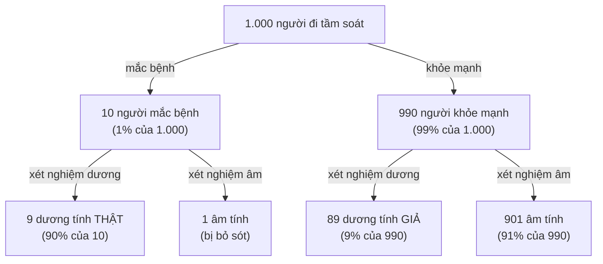
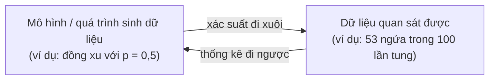

> **Mục tiêu bài học:** Sau bài này, bạn sẽ hiểu vì sao machine learning cần đến xác suất, nắm được các khái niệm nền tảng - biến ngẫu nhiên, phân phối, kỳ vọng, phương sai - và tự tay tính được kết quả của định lý Bayes bằng bảng tần suất, không cần công thức phức tạp.

## 1. Vì sao machine learning phải "nói ngôn ngữ" xác suất?

Ở Bài 01, mô hình nhìn cây nấm và nói *"20% khả năng là nấm độc"* - và bạn đã học rằng quyết định = xác suất × hậu quả. Ở Bài 05, mô hình phân loại trả về "90% đây là mèo" chứ không phải câu trả lời tuyệt đối. Vì sao máy không nói thẳng "có" hoặc "không"?

Vì **thế giới thực đầy bất định**:

- **Dữ liệu có nhiễu (noise):** căn nhà 80 m² trong bảng 6 căn nhà mini của Bài 02 rao 5,1 tỷ - nhưng một căn 80 m² khác có thể chốt giá khác hẳn: người bán vội, người mua khéo mặc cả. Cảm biến đo nhiệt độ hai lần liên tiếp cho hai số hơi lệch nhau.
- **Thông tin không đầy đủ:** nhìn ảnh chụp mờ, đến người cũng chỉ dám nói "chắc là mèo". Mô hình cũng vậy.
- **Bản thân hiện tượng khó dự đoán từng lần:** ta không bao giờ biết đủ chính xác điều kiện ban đầu (lực tung, độ xoáy, mặt bàn...) để đoán từng lần tung đồng xu - mô tả nó bằng xác suất là cách hợp lý nhất.

Machine learning xoay quanh sự bất định đó: ta muốn dự đoán điều chưa biết từ điều đã biết, và nhiều khi muốn **định lượng cả mức độ không chắc chắn** của chính dự đoán. Từ hồ sơ bệnh nhân, ước tính *khả năng* họ gặp vấn đề tim mạch trong năm tới - con số 5% và con số 60% dẫn đến hai quyết định điều trị rất khác nhau.

**Xác suất (probability)** là ngành toán chuyên "lý luận trong điều kiện bất định", và là ngôn ngữ chung của gần như mọi thứ ta học tiếp trong loạt bài này: hàm mất mát của bài toán phân loại (Bài 10) được xây từ xác suất; việc đánh giá mô hình (Bài 15) là bài toán thống kê.

## 2. Xác suất là gì? Chuyện đồng xu và xúc xắc

Bạn tung một đồng xu 100 lần, đếm được 53 lần ngửa. Vậy xác suất ra ngửa của đồng xu này là 0,53? Hãy giữ câu hỏi đó trong đầu.

Với một đồng xu cân đối, hai kết cục **ngửa** / **sấp** có khả năng như nhau - ta nói xác suất ra ngửa là $1/2$. Gieo một con xúc xắc cân đối: mỗi mặt có xác suất $1/6$. Quy ước chung:

- Xác suất là con số **từ 0 đến 1** gán cho một **sự kiện (event)**.
- **0** = không thể xảy ra (đồng xu hai mặt đều sấp mà ra ngửa).
- **1** = chắc chắn xảy ra.
- Hai dòng trên đúng với các kết cục **đếm được** như tung xu, đổ xúc xắc. Với đại lượng liên tục (mục 4.2) thì xác suất tại đúng một giá trị luôn bằng 0 mà kết cục ấy vẫn xảy ra được - nên ở đó ta hỏi xác suất trên một *khoảng*.
- Cộng xác suất của **tất cả** các kết cục có thể → bằng **1** (chắc chắn *một cái gì đó* phải xảy ra).

Giờ trả lời câu hỏi mở đầu: tỷ lệ $53/100$ **không phải xác suất**. Nó là một **thống kê (statistic)** - con số tính từ dữ liệu quan sát được. Xác suất $1/2$ là tính chất "ẩn" của bản thân đồng xu; thống kê $53/100$ là **ước lượng** của ta về tính chất đó. Càng tung nhiều, ước lượng càng bám sát giá trị thật (mục 7 sẽ quay lại điểm này).

<details>
<summary>Hai trường phái diễn giải xác suất (đọc thêm)</summary>

Trường phái **tần suất (frequentist)** xem xác suất là tỷ lệ xuất hiện khi lặp lại thí nghiệm rất nhiều lần. Trường phái **Bayes (Bayesian)** xem xác suất là *mức độ tin* vào một mệnh đề, kể cả mệnh đề không lặp lại được ("xác suất đội A vô địch mùa này"). Cả hai cách nhìn đều hữu ích trong ML; ở mức nhập môn bạn chưa cần chọn phe.

</details>

## 3. Biến ngẫu nhiên: gắn con số cho sự ngẫu nhiên

Máy tính không hiểu "ngửa" hay "sấp" - nó chỉ làm việc với con số. Ta cần một cây cầu nối giữa "kết cục ngẫu nhiên" và "con số": **biến ngẫu nhiên (random variable)** - một đại lượng nhận giá trị số, mỗi giá trị kèm một xác suất.

Tung 2 đồng xu và gọi $X$ = số mặt ngửa. Bốn kết cục (ngửa-ngửa, ngửa-sấp, sấp-ngửa, sấp-sấp) đều có xác suất $1/4$, nên:

| Giá trị của $X$ | Kết cục tương ứng | Xác suất |
|---|---|---|
| 0 | sấp-sấp | 1/4 |
| 1 | ngửa-sấp *hoặc* sấp-ngửa | 2/4 |
| 2 | ngửa-ngửa | 1/4 |

Bảng "giá trị ↔ xác suất" này gọi là **phân phối (distribution)** của $X$. Sách *Mathematics for Machine Learning* có một ghi chú vui: cái tên "biến ngẫu nhiên" dễ gây hiểu lầm, vì nó *không ngẫu nhiên* mà cũng chẳng phải *biến* - bản chất nó là một **hàm** gắn con số cho từng kết cục. Bạn cứ giữ hình ảnh "bảng tra" như trên là đủ dùng.

Có hai loại biến ngẫu nhiên:

- **Rời rạc (discrete):** đếm được từng giá trị - số mặt ngửa, nhãn "mèo/chó", chữ số 0-9.
- **Liên tục (continuous):** nhận giá trị trên cả một dải số - chiều cao, cân nặng, nhiệt độ. Với loại này, hỏi "xác suất một người cao *đúng* 1,801392... mét" là vô nghĩa (gần như bằng 0); câu hỏi hợp lý là "xác suất một người cao **trong khoảng** 1,79-1,81 mét", và ta làm việc với **mật độ xác suất (probability density)** thay vì xác suất từng điểm.

## 4. Hai phân phối nền tảng: Bernoulli và Gaussian

Có rất nhiều phân phối, nhưng hai gương mặt sau sẽ theo bạn suốt loạt bài này.

### 4.1. Bernoulli - phân phối "hai kết cục"

Bộ lọc thư rác nói: *"email này 92% là spam"*. Về mặt toán, con số 0,92 đó là gì?

Nó là tham số của một **phân phối Bernoulli** - phân phối mô tả biến chỉ có **2 giá trị** (thường ghi 1/0: ngửa/sấp, spam/không spam, mắc bệnh/khỏe mạnh). Bernoulli chỉ cần đúng **một tham số** $p$ = xác suất ra 1; xác suất ra 0 đương nhiên là $1-p$.

```
Bernoulli với p = 0.7 (đồng xu thiên lệch):

  P
 0.7 |         ███
     |         ███
 0.3 |  ███    ███
     |  ███    ███
     +---┴------┴----
         0      1
```

Khi mô hình phân loại nhị phân nói "92% là spam", nó đang đưa ra một phân phối Bernoulli với $p = 0{,}92$ cho email đó. **Học phân loại = chỉnh núm vặn sao cho con số $p$ mà mô hình gán cho từng đầu vào là hợp lý.**

> ⚠️ **Lưu ý nhỏ:** con số 0,92 là một *ước lượng* của mô hình. Nó có phản ánh đúng mức độ tin cậy thật hay không là một vấn đề riêng gọi là **calibration (hiệu chỉnh xác suất)** - không ít mô hình cho ra xác suất "tự tin quá đà".

### 4.2. Gaussian - phân phối chuẩn hình chuông

Đo chiều cao của 1.000 người trưởng thành rồi vẽ biểu đồ: phần lớn dồn quanh một mức trung bình, càng xa mức đó càng thưa, hai bên gần như đối xứng. Dạng **hình chuông** ấy là **phân phối Gaussian** (còn gọi là **phân phối chuẩn - normal distribution**) - phân phối liên tục bạn sẽ gặp nhiều nhất trong loạt bài này.

```
 Mật độ
   ▲              *  *
   |            *      *
   |          *          *
   |        *              *
   |     *                    *
   | * *                          * *
   +──────────────┼──────────────────►
                  μ
        (μ = trung bình, đỉnh chuông)
```

Hình chuông có đúng hai núm vặn: **trung bình** $\mu$ (đỉnh chuông nằm đâu) và **độ lệch chuẩn** $\sigma$ (chuông béo hay gầy - mục 5 nói kỹ). Một tính chất hay dùng: khoảng 68% giá trị nằm trong phạm vi $\mu \pm 1\sigma$, khoảng 95% nằm trong $\mu \pm 2\sigma$.

Vì sao nó xuất hiện khắp nơi?

- **Nhiều đại lượng tự nhiên có dạng gần giống hình chuông:** chiều cao người trưởng thành trong một quần thể, sai số phép đo lặp lại nhiều lần.
- **Nhiễu đo đạc thường được mô hình hóa bằng Gaussian:** khi Bài 10 xây hàm mất mát cho bài toán hồi quy, giả định "nhiễu hình chuông" chính là lý do đằng sau việc dùng bình phương sai số.
- **Định lý giới hạn trung tâm** giải thích hiện tượng này: cộng nhiều nguồn ngẫu nhiên nhỏ và độc lập lại, tổng có xu hướng tiến về hình chuông - dù từng nguồn chẳng có dạng hình chuông chút nào.

## 5. Kỳ vọng và phương sai: trung bình dài hạn và độ phân tán

Bạn được chọn một trong hai trò chơi và chơi đi chơi lại nhiều ván. Trò **A**: chắc chắn nhận 10 nghìn mỗi ván. Trò **B**: tung xu - 50% nhận 0 đồng, 50% nhận 20 nghìn. Trò nào đáng chơi hơn? Để trả lời, cần hai con số: về lâu dài mỗi ván được bao nhiêu, và mỗi ván "phiêu" cỡ nào.

### 5.1. Kỳ vọng - nếu chơi rất nhiều ván, trung bình được bao nhiêu?

**Kỳ vọng (expectation)**, ký hiệu $E[X]$, là **trung bình có trọng số** của các giá trị, trọng số là xác suất: giá trị nào hay xảy ra thì đóng góp nhiều hơn. Cách nhớ: *"chơi rất nhiều ván, trung bình mỗi ván được bao nhiêu?"*

Ví dụ với xúc xắc cân đối:

$$E[X] = \tfrac{1}{6}(1 + 2 + 3 + 4 + 5 + 6) = 3{,}5$$

Chú ý điều thú vị: **không ván nào ra đúng 3,5** - kỳ vọng là trung bình *dài hạn*, không phải "giá trị hay gặp".

Áp vào hai trò chơi:

| Trò | Luật chơi | Kỳ vọng |
|---|---|---|
| **A** | Chắc chắn nhận 10 nghìn | 10 nghìn |
| **B** | 50% nhận 0 đồng, 50% nhận 20 nghìn | 0,5·0 + 0,5·20 = 10 nghìn |

Kỳ vọng y hệt nhau, nhưng cảm giác chơi khác hẳn: trò A "chắc cú", trò B "được ăn cả ngã về không". Chỉ nhìn kỳ vọng thì chưa đủ.

### 5.2. Phương sai và độ lệch chuẩn - cùng trung bình, khác độ "phiêu"

Đại lượng đo sự khác biệt đó là **phương sai (variance)** - trung bình của **bình phương độ lệch** so với kỳ vọng:

- Trò A: luôn đúng 10 → độ lệch luôn 0 → phương sai **0**.
- Trò B: $0{,}5 \cdot (0-10)^2 + 0{,}5 \cdot (20-10)^2 = 50 + 50 = 100$.

Vì phương sai mang đơn vị "bình phương" (nghìn đồng²) khó hình dung, ta thường lấy căn bậc hai để được **độ lệch chuẩn (standard deviation)** $\sigma$ - cùng đơn vị với đại lượng gốc. Trò B có $\sigma = \sqrt{100} = 10$ nghìn: mỗi ván "phiêu" trung bình cỡ 10 nghìn quanh mức kỳ vọng.

> 🔧 **Thử ngay:** thêm trò **C**: 25% nhận 40 nghìn, 75% nhận 0. Kỳ vọng = 0,25 · 40 = **10 nghìn** - vẫn bằng A và B. Phương sai = 0,25 · (40 − 10)² + 0,75 · (0 − 10)² = 225 + 75 = **300**, nên $\sigma = \sqrt{300} \approx$ **17,3 nghìn** - phiêu hơn B rõ rệt. Ba trò cùng kỳ vọng, ba mức rủi ro khác nhau.

Bạn đã gặp cặp đôi này rồi đấy: $\mu$ và $\sigma$ chính là hai núm vặn của hình chuông Gaussian ở mục 4. Chúng cũng là công cụ chuẩn hóa dữ liệu mà Bài 12 sẽ dùng.

## 6. Xác suất có điều kiện và định lý Bayes: bài học từ xét nghiệm bệnh hiếm

Bạn đi tầm soát một bệnh hiếm và nhận kết quả **dương tính** từ một xét nghiệm "đúng 90%". Bạn nên lo đến mức nào? Phần đông bác sĩ được hỏi trong khảo sát ở mục 6.2 trả lời "khoảng 90%". Đọc hết mục này, bạn sẽ thấy con số thật nhỏ hơn thế... gần mười lần.

### 6.1. Xác suất có điều kiện

**Xác suất có điều kiện (conditional probability)** $P(A \mid B)$ đọc là "xác suất của A **biết rằng** B đã xảy ra". Thông tin mới làm ta cập nhật niềm tin: xác suất một người bất kỳ mắc cúm khác với xác suất mắc cúm *biết rằng* người đó đang sốt và ho.

Điểm mà rất nhiều người (kể cả bác sĩ) nhầm: $P(A \mid B)$ **không** bằng $P(B \mid A)$. "Xác suất dương tính *nếu có bệnh*" và "xác suất có bệnh *nếu dương tính*" là hai câu hỏi khác nhau. **Định lý Bayes (Bayes' theorem)** chính là công cụ đảo chiều giữa hai câu hỏi đó. Thay vì học công thức, hãy tính tay một ví dụ.

### 6.2. Tính tay bằng bảng 1.000 người

Đây là ví dụ kinh điển mà nhà tâm lý học Gerd Gigerenzer dùng khi khảo sát xem các bác sĩ đọc kết quả tầm soát ung thư vú ra sao (trình bày lại trong cuốn *Calculated Risks* của ông). Giả sử:

- Bệnh hiếm: **1%** dân số tầm soát mắc bệnh.
- Xét nghiệm khá tốt: phát hiện đúng **90%** người có bệnh (độ nhạy 90%).
- Nhưng cũng báo nhầm: **9%** người khỏe mạnh vẫn dương tính (dương tính giả).

Câu hỏi: bạn nhận kết quả **dương tính**. Xác suất bạn thực sự mắc bệnh là bao nhiêu? Trước khi đọc tiếp, thử đoán một con số.

Cách dễ nhất là quy hết về **tần suất tự nhiên (natural frequencies)**: tưởng tượng 1.000 người đi tầm soát, rồi chia dần họ thành các nhóm.



Tổng số người dương tính: $9 + 89 = 98$. Trong đó chỉ **9** người thực sự có bệnh:

$$P(\text{bệnh} \mid \text{dương tính}) = \frac{9}{98} \approx 9\%$$

Dù xét nghiệm "đúng 90%", một kết quả dương tính chỉ tương ứng khoảng **9%** khả năng mắc bệnh! Lý do: bệnh quá hiếm, nên nhóm 990 người khỏe - dù mỗi người chỉ có 9% khả năng bị báo nhầm - vẫn "sản xuất" ra 89 ca dương tính giả, áp đảo 9 ca dương tính thật.

Con số từ khảo sát của Gigerenzer: khi bài toán này được đưa (dưới dạng xác suất phần trăm) cho 160 bác sĩ phụ khoa trong một buổi bồi dưỡng chuyên môn năm 2007, chỉ 21% trả lời đúng, phần đông chọn 81% hoặc 90%. Sau khi được hướng dẫn quy về tần suất tự nhiên như cách trên, 87% trả lời đúng.

Sách *Dive into Deep Learning* có ví dụ tương tự với xét nghiệm HIV: tỷ lệ nền 0,15%, xét nghiệm không bao giờ bỏ sót người bệnh và chỉ báo nhầm 1% người khỏe - vậy mà một kết quả dương tính chỉ tương ứng khoảng 13% khả năng nhiễm.

> 🔧 **Thử ngay:** giữ bệnh 1% và độ nhạy 90%, nhưng dùng xét nghiệm tốt hơn: chỉ báo nhầm **1%** người khỏe. Lấy 10.000 người cho tròn số:
> - 100 người bệnh → 90 dương tính thật.
> - 9.900 người khỏe → 99 dương tính giả.
> - $P(\text{bệnh} \mid \text{dương tính}) = 90/(90 + 99) \approx$ **48%**.
>
> Giảm báo nhầm từ 9% xuống 1% kéo con số từ 9% lên 48%. Ngược lại, giữ 9% báo nhầm và nâng độ nhạy lên 99% thì kết quả chỉ nhích lên 9,9/(9,9 + 89,1) = 10%. Với bệnh hiếm, dương tính giả mới là thứ quyết định. (Muốn luyện thêm: câu hỏi 4 cuối bài đổi tỷ lệ mắc thành 2%.)

Bài học đọng lại:

- **Tỷ lệ nền (prior - niềm tin trước khi có bằng chứng)** quan trọng không kém độ chính xác của bằng chứng. Bayes = cách trộn hai thứ đó lại thành **niềm tin sau (posterior)**.
- Đây cũng là logic của **lọc email spam** thời kỳ đầu (bộ lọc "Naive Bayes"): thấy từ "TRÚNG THƯỞNG", ta cập nhật xác suất email là spam - nhưng vẫn phải cân với tỷ lệ nền spam/không spam.
- Muốn chắc hơn? Làm thêm xét nghiệm *độc lập* thứ hai - mỗi bằng chứng mới lại cập nhật niềm tin thêm một nấc. Các mô hình họ Bayes (như chính Naive Bayes) làm đúng điều này khi gom nhiều đặc trưng.

> ⚠️ **Lưu ý nhỏ:** các mô hình phân loại khác không nhất thiết vận hành theo cơ chế Bayes; nhưng tinh thần "cân bằng chứng mới với niềm tin cũ" là trực giác đáng mang theo khắp nơi.

<details>
<summary>Công thức Bayes (mở ra nếu bạn muốn xem dạng tổng quát)</summary>

$$P(A \mid B) = \frac{P(B \mid A) \cdot P(A)}{P(B)}$$

Đối chiếu với ví dụ: $A$ = "mắc bệnh", $B$ = "dương tính". $P(B \mid A) = 0{,}9$ (độ nhạy), $P(A) = 0{,}01$ (tỷ lệ nền), $P(B) = 0{,}098$ (tổng tỷ lệ dương tính, cả thật lẫn giả). Kết quả: $0{,}9 \times 0{,}01 / 0{,}098 \approx 0{,}092$ - khớp với bảng 1.000 người.
</details>

## 7. Luật số lớn: vì sao nhiều dữ liệu giúp ước lượng tốt hơn

Quay lại đồng xu ở mục 2. Tung 10 lần, có thể bạn được 7 ngửa - tỷ lệ 0,7, lệch xa 0,5. Tung 10.000 lần, tỷ lệ gần như chắc chắn nằm sát 0,5. Hiện tượng "tần suất quan sát hội tụ về xác suất thật khi số lần lặp tăng lên" được toán học hóa thành **luật số lớn (law of large numbers)**.

> 🔧 **Thử ngay:** mô phỏng bằng NumPy (0 = sấp, 1 = ngửa):
> ```python
> import numpy as np
> rng = np.random.default_rng(0)
> for n in [10, 100, 10_000]:
>     print(n, rng.integers(0, 2, size=n).mean())
> ```
> Với seed 0 bạn sẽ thấy **0,4 → 0,56 → 0,5033**: càng tung nhiều, càng bám sát 0,5. Đổi seed, ba con số đổi theo nhưng xu hướng thì không.

Đây chính là nền móng cho niềm tin "nhiều dữ liệu → ước lượng chính xác hơn". Nhưng có một cái giá: với nhiều ước lượng thống kê cổ điển, sai số chuẩn thường giảm theo cỡ $1/\sqrt{n}$ - từ 10 lên 1.000 quan sát (gấp 100 lần), độ bất định giảm khoảng 10 lần; muốn chính xác gấp đôi, cần dữ liệu gấp bốn. Sách *Dive into Deep Learning* tính tiếp: 1.000 quan sát *kế tiếp* chỉ giảm bất định thêm khoảng 1,41 lần. Lợi ích giảm dần khi tăng số quan sát.

Cũng cần tỉnh táo: nhiều dữ liệu giảm được **bất định do thiếu hiểu biết** (epistemic - ví dụ: chưa biết đồng xu có cân đối không), nhưng không xóa được **bất định nội tại** (aleatoric - dù biết chắc xu cân đối, vẫn không ai đoán được lần tung *kế tiếp*).

> ⚠️ **Lưu ý nhỏ:** tốc độ $1/\sqrt{n}$ là tính chất của các ước lượng thống kê kiểu này, không phải quy luật chung cho chất lượng của mọi mô hình ML.

## 8. Thống kê mô tả và thống kê suy diễn

Khảo sát 1.000 cử tri để nói về lá phiếu của hàng chục triệu người - nghe có vẻ liều, nhưng đó là việc ngành thống kê vẫn làm hằng ngày. Một cặp thuật ngữ bạn sẽ gặp thường xuyên:

**Thống kê mô tả (descriptive statistics)** tóm tắt *dữ liệu đang có trong tay*: điểm trung bình lớp là 7,2; độ lệch chuẩn 1,1; điểm cao nhất 9,5. **Thống kê suy diễn (inferential statistics)** đi xa hơn: từ một **mẫu (sample)** rút ra kết luận về cả **quần thể (population)** hoặc về quá trình sinh ra dữ liệu - chính là chuyện 1.000 cử tri và hàng chục triệu người.

Sách *Mathematics for Machine Learning* đối chiếu gọn: **xác suất** đi xuôi - có mô hình, suy ra dữ liệu sẽ trông thế nào; **thống kê** đi ngược - có dữ liệu, đoán ngược quá trình nào đã sinh ra nó.



Machine learning đứng rất gần vế thứ hai: từ dữ liệu huấn luyện (một mẫu), xây mô hình mô tả tốt quá trình sinh dữ liệu, để rồi dự đoán được trên dữ liệu *chưa từng thấy* - đúng tinh thần "khái quát hóa" của Bài 04, nơi điểm của Bình trên 2 đề cất riêng mới là điểm đáng tin.

## Tóm tắt bài học

- ML cần xác suất vì thế giới có **nhiễu và bất định**; mô hình phân loại trả về **xác suất** (0 → 1) thay vì khẳng định tuyệt đối, và quyết định = xác suất × hậu quả.
- **Xác suất** là tính chất của quá trình sinh dữ liệu; **thống kê** (như tần suất 53/100) là con số tính từ dữ liệu, dùng để *ước lượng* xác suất.
- **Biến ngẫu nhiên** gắn con số cho kết cục ngẫu nhiên; bảng "giá trị ↔ xác suất" của nó là **phân phối**.
- **Bernoulli**: 2 kết cục, 1 tham số $p$ - khung của bài toán phân loại nhị phân. **Gaussian**: hình chuông với 2 tham số $\mu, \sigma$ - mô hình quen thuộc cho chiều cao, nhiễu đo đạc.
- **Kỳ vọng** = trung bình dài hạn có trọng số xác suất; **phương sai/độ lệch chuẩn** đo độ phân tán quanh kỳ vọng - hai trò chơi cùng kỳ vọng vẫn có thể khác hẳn độ rủi ro.
- **Định lý Bayes** đảo chiều điều kiện: $P(\text{bệnh} \mid \text{dương tính}) \neq P(\text{dương tính} \mid \text{bệnh})$; với bệnh hiếm (1%), xét nghiệm đúng 90% vẫn chỉ cho ~9% khả năng mắc bệnh khi dương tính. Tính bằng bảng 1.000 ca cho dễ.
- **Luật số lớn**: tần suất hội tụ về xác suất khi lặp nhiều lần; với nhiều ước lượng thống kê, sai số giảm cỡ $1/\sqrt{n}$ - dữ liệu gấp 4 mới chính xác gấp đôi.

## Câu hỏi tự kiểm tra

1. Vì sao tỷ lệ 53 ngửa / 100 lần tung **không phải** là xác suất ra ngửa của đồng xu? Nó là gì, và quan hệ giữa hai con số này ra sao khi số lần tung tăng lên?
2. **Tính tay:** một trò chơi cho bạn 20% cơ hội thắng 10 nghìn và 80% khả năng mất 2 nghìn. Tính kỳ vọng tiền nhận được mỗi ván. Có nên chơi lâu dài không?
3. Hai lớp học cùng điểm trung bình 7,0. Lớp A có độ lệch chuẩn 0,5; lớp B có độ lệch chuẩn 2,5. Mô tả bằng lời sự khác nhau giữa phổ điểm hai lớp.
4. **Tính tay bằng bảng 1.000 người:** một bệnh có tỷ lệ mắc 2%, xét nghiệm phát hiện đúng 90% người bệnh và báo nhầm dương tính cho 10% người khỏe. Nhận kết quả dương tính thì xác suất thực sự mắc bệnh là bao nhiêu? (Gợi ý: đếm số dương tính thật và dương tính giả trong 1.000 người.)
5. Phát biểu sau sai ở đâu: *"Xét nghiệm có độ nhạy 90%, nên nếu tôi dương tính thì 90% là tôi mắc bệnh"*?
6. Mô hình phân loại email trả về "spam với xác suất 0,92". Con số 0,92 này giống tham số của phân phối nào đã học? Vì sao nói học phân loại nhị phân là học cách gán tham số đó cho từng đầu vào?

## Đọc thêm

**Nguồn nền tảng của bài:**

| Nguồn | Đọc phần nào |
|---|---|
| **Sách *Dive into Deep Learning* (d2l.ai)** | Chương 2.6 - *Probability and Statistics*: tung xu, luật số lớn, biến ngẫu nhiên, ví dụ xét nghiệm HIV với Bayes, kỳ vọng & phương sai |
| **Sách *Mathematics for Machine Learning*** | Chương 6 (phần đầu) - *Probability and Distributions*: không gian xác suất, biến ngẫu nhiên là một "hàm", phân phối rời rạc vs liên tục, sum rule / product rule / Bayes |
| **Sách *Calculated Risks* (Gerd Gigerenzer)** | Cách trình bày "tần suất tự nhiên" và khảo sát bác sĩ đọc kết quả tầm soát - nguồn của ví dụ 1.000 người ở mục 6 |

**Nguồn online bổ sung (miễn phí):**

- [Seeing Theory - Brown University](https://seeing-theory.brown.edu/) - trang trực quan hóa tương tác về xác suất & thống kê (dự án tại Đại học Brown): tự tay tung xu, kéo tham số của phân phối Gaussian và xem hình chuông đổi dạng.
- [Bayes theorem, the geometry of changing beliefs - 3Blue1Brown](https://www.youtube.com/watch?v=HZGCoVF3YvM) - video giải thích định lý Bayes bằng hình học, rất hợp để xem sau mục 6.
- [Helping Doctors and Patients Make Sense of Health Statistics - Gigerenzer và cộng sự (2007)](https://www.stat.berkeley.edu/~aldous/157/Papers/health_stats.pdf) - bài báo nguồn của khảo sát 160 bác sĩ phụ khoa nhắc ở mục 6; đọc để thấy tần suất tự nhiên thay đổi cách hiểu ra sao.
- [Machine Learning cơ bản](https://machinelearningcoban.com/) - blog tiếng Việt của Vũ Hữu Tiệp, có các bài về xác suất cho ML.

> **Bài tiếp theo:** [Đạo hàm, gradient và chain rule](../derivatives-gradients-the-chain-rule-vi/) - xác suất cho ta thước đo "đoán sai bao nhiêu" - còn đạo hàm và gradient sẽ trả lời câu hỏi *chỉnh núm vặn theo hướng nào* để bớt sai.
