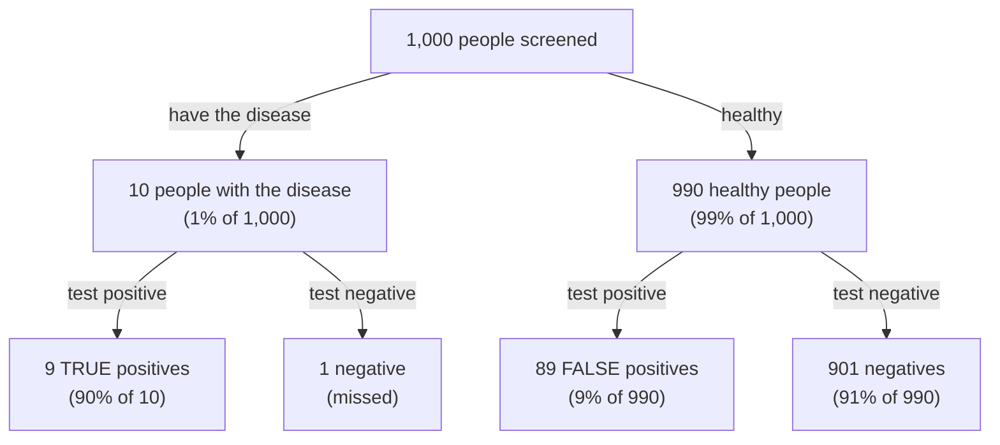
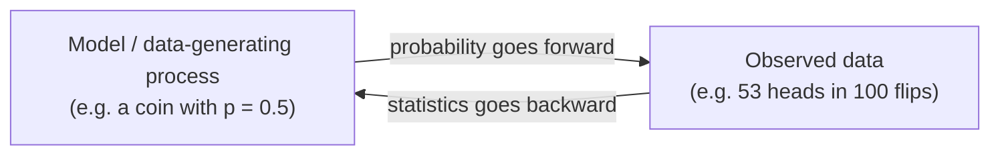

> **Learning objectives:** After this lesson, you will understand why machine learning needs probability, grasp the foundational concepts - random variables, distributions, expectation, variance - and be able to compute Bayes' theorem yourself with a frequency table, no complicated formula required.

## 1. Why must machine learning "speak the language" of probability?

In Lesson 01, the model looked at a mushroom and said *"20% chance it is poisonous"* - and you learned that decision = probability × consequence. In Lesson 05, the classification model returned "90% this is a cat" rather than an absolute answer. Why doesn't the machine just say "yes" or "no"?

Because **the real world is full of uncertainty**:

- **Data has noise:** the 80 m² house in the mini table of 6 houses from Lesson 02 was listed at 5.1 billion - but another 80 m² house might close at a very different price: a seller in a hurry, a buyer who haggles well. A sensor measuring temperature twice in a row gives two slightly different numbers.
- **Information is incomplete:** looking at a blurry photo, even a person would only venture "probably a cat". So does the model.
- **The phenomenon itself is hard to predict each time:** we never know the initial conditions precisely enough (the force of the toss, the spin, the table surface...) to predict each individual coin flip - describing it with probability is the most sensible approach.

Machine learning revolves around that uncertainty: we want to predict the unknown from the known, and often we want to **quantify the uncertainty** of the prediction itself. From a patient's record, estimate the *likelihood* that they will have a cardiovascular problem in the coming year - the number 5% and the number 60% lead to two very different treatment decisions.

**Probability** is the branch of mathematics that specializes in "reasoning under uncertainty", and it is the common language of nearly everything we study next in this series: the loss function for classification (Lesson 10) is built from probability; evaluating a model (Lesson 15) is a statistics problem.

## 2. What is probability? A story of coins and dice

You flip a coin 100 times and count 53 heads. So the probability of heads for this coin is 0.53? Keep that question in mind.

For a fair coin, the two outcomes **heads** / **tails** are equally likely - we say the probability of heads is $1/2$. Roll a fair die: each face has probability $1/6$. The general conventions:

- A probability is a number **from 0 to 1** assigned to an **event**.
- **0** = impossible (a two-tailed coin landing heads).
- **1** = certain to happen.
- The two lines above hold for **countable** outcomes such as coin flips and dice rolls. For a continuous quantity (Section 4.2), the probability of exactly one value is always 0, yet that outcome can still occur - so there we ask about the probability over an *interval*.
- Add up the probabilities of **all** possible outcomes → you get **1** (surely *something* must happen).

Now to answer the opening question: the ratio $53/100$ **is not a probability**. It is a **statistic** - a number computed from observed data. The probability $1/2$ is a "hidden" property of the coin itself; the statistic $53/100$ is our **estimate** of that property. The more you flip, the closer the estimate tracks the true value (Section 7 will return to this point).

<details>
<summary>Two schools of interpreting probability (further reading)</summary>

The **frequentist** school views probability as the proportion of occurrences when an experiment is repeated a great many times. The **Bayesian** school views probability as a *degree of belief* in a proposition, including propositions that cannot be repeated ("the probability that team A wins the championship this season"). Both viewpoints are useful in ML; at the introductory level you don't need to pick a side yet.

</details>

## 3. Random variables: attaching numbers to randomness

A computer does not understand "heads" or "tails" - it only works with numbers. We need a bridge between "random outcome" and "number": a **random variable** - a quantity that takes numeric values, each value coming with a probability.

Flip 2 coins and let $X$ = the number of heads. The four outcomes (heads-heads, heads-tails, tails-heads, tails-tails) each have probability $1/4$, so:

| Value of $X$ | Corresponding outcome | Probability |
|---|---|---|
| 0 | tails-tails | 1/4 |
| 1 | heads-tails *or* tails-heads | 2/4 |
| 2 | heads-heads | 1/4 |

This "value ↔ probability" table is called the **distribution** of $X$. *Mathematics for Machine Learning* has a fun remark: the name "random variable" is misleading, because it is *not random* and it is *not a variable* either - in essence it is a **function** that attaches a number to each outcome. Just keep the "lookup table" picture above and you are set.

There are two kinds of random variables:

- **Discrete:** each value can be counted - the number of heads, the label "cat/dog", the digits 0-9.
- **Continuous:** takes values over a whole range of numbers - height, weight, temperature. For this kind, asking "the probability of being *exactly* 1.801392... meters tall" is meaningless (essentially 0); the sensible question is "the probability of being **between** 1.79 and 1.81 meters tall", and we work with **probability density** rather than the probability of individual points.

## 4. Two foundational distributions: Bernoulli and Gaussian

There are many distributions, but the two faces below will follow you throughout this series.

### 4.1. Bernoulli - the "two-outcome" distribution

A spam filter says: *"this email is 92% spam"*. Mathematically, what is that number 0.92?

It is the parameter of a **Bernoulli distribution** - the distribution describing a variable with only **2 values** (usually written 1/0: heads/tails, spam/not spam, sick/healthy). Bernoulli needs exactly **one parameter** $p$ = the probability of getting 1; the probability of getting 0 is of course $1-p$.

```
Bernoulli with p = 0.7 (a biased coin):

  P
 0.7 |         ███
     |         ███
 0.3 |  ███    ███
     |  ███    ███
     +---┴------┴----
         0      1
```

When a binary classification model says "92% spam", it is producing a Bernoulli distribution with $p = 0.92$ for that email. **Learning to classify = adjusting the knobs so that the $p$ assigned to each input is sensible.**

> ⚠️ **A small note:** the number 0.92 is an *estimate* by the model. Whether it reflects the true level of confidence is a separate issue called **calibration** - quite a few models produce "overconfident" probabilities.

### 4.2. Gaussian - the bell-shaped normal distribution

Measure the heights of 1,000 adults and plot a histogram: most pile up around an average level, the farther from that level the sparser, and the two sides are nearly symmetric. That **bell shape** is the **Gaussian distribution** (also called the **normal distribution**) - the continuous distribution you will meet most often in this series.

```
 Density
   ▲              *  *
   |            *      *
   |          *          *
   |        *              *
   |     *                    *
   | * *                          * *
   +──────────────┼──────────────────►
                  μ
        (μ = mean, the peak of the bell)
```

The bell has exactly two knobs: the **mean** $\mu$ (where the peak of the bell sits) and the **standard deviation** $\sigma$ (whether the bell is fat or thin - Section 5 goes into detail). A commonly used property: about 68% of values fall within $\mu \pm 1\sigma$, about 95% fall within $\mu \pm 2\sigma$.

Why does it show up everywhere?

- **Many natural quantities are approximately bell-shaped:** adult height within a population, the error of a measurement repeated many times.
- **Measurement noise is usually modeled as Gaussian:** when Lesson 10 builds the loss function for regression, the "bell-shaped noise" assumption is exactly the reason behind using squared error.
- **The central limit theorem** explains the phenomenon: add up many small independent random sources, and the sum tends toward a bell shape - even if none of the individual sources is bell-shaped at all.

## 5. Expectation and variance: long-run average and spread

You get to choose one of two games and play it over and over for many rounds. Game **A**: you receive 10,000 VND for sure every round. Game **B**: flip a coin - 50% you receive 0, 50% you receive 20,000 VND. Which game is worth playing? To answer, you need two numbers: over the long run, how much do you get per round, and how "wild" is each round?

### 5.1. Expectation - if you play many rounds, how much do you get on average?

**Expectation**, written $E[X]$, is the **weighted average** of the values, with probabilities as weights: values that occur often contribute more. The way to remember it: *"play a great many rounds, how much do you get per round on average?"*

Example with a fair die:

$$E[X] = \tfrac{1}{6}(1 + 2 + 3 + 4 + 5 + 6) = 3.5$$

Notice something interesting: **no roll ever gives exactly 3.5** - expectation is a *long-run* average, not "the value you see most often".

Applied to the two games:

| Game | Rules | Expectation |
|---|---|---|
| **A** | Receive 10,000 VND for sure | 10,000 VND |
| **B** | 50% receive 0, 50% receive 20,000 VND | 0.5·0 + 0.5·20 = 10 thousand |

The expectations are identical, but the games feel completely different: game A is "a sure thing", game B is "all or nothing". Expectation does not tell the whole story.

### 5.2. Variance and standard deviation - same average, different "wildness"

The quantity that measures that difference is **variance** - the average of the **squared deviation** from the expectation:

- Game A: always exactly 10 → deviation always 0 → variance **0**.
- Game B: $0.5 \cdot (0-10)^2 + 0.5 \cdot (20-10)^2 = 50 + 50 = 100$.

Because variance carries "squared" units (thousand VND²), which are hard to picture, we usually take the square root to get the **standard deviation** $\sigma$ - in the same units as the original quantity. Game B has $\sigma = \sqrt{100} = 10$ thousand: each round "swings" by about 10,000 VND on average around the expected level.

> 🔧 **Try it now:** add game **C**: 25% receive 40,000 VND, 75% receive 0. Expectation = 0.25 · 40 = **10 thousand** - still equal to A and B. Variance = 0.25 · (40 − 10)² + 0.75 · (0 − 10)² = 225 + 75 = **300**, so $\sigma = \sqrt{300} \approx$ **17.3 thousand** - noticeably wilder than B. Three games with the same expectation, three different levels of risk.

You have already met this pair: $\mu$ and $\sigma$ are exactly the two knobs of the Gaussian bell in Section 4. They are also the data-standardization tools that Lesson 12 will use.

## 6. Conditional probability and Bayes' theorem: lessons from a rare-disease test

You go for a screening for a rare disease and receive a **positive** result from a test that is "90% accurate". How worried should you be? Most of the doctors surveyed in Section 6.2 answered "about 90%". By the end of this section, you will see the true number is smaller than that... by nearly ten times.

### 6.1. Conditional probability

**Conditional probability** $P(A \mid B)$ reads "the probability of A **given that** B has happened". New information makes us update our beliefs: the probability that a random person has the flu differs from the probability of having the flu *given that* the person has a fever and a cough.

The point that a great many people (doctors included) get wrong: $P(A \mid B)$ is **not** equal to $P(B \mid A)$. "The probability of testing positive *if you have the disease*" and "the probability of having the disease *if you test positive*" are two different questions. **Bayes' theorem** is precisely the tool for flipping between those two questions. Instead of memorizing the formula, let's work an example by hand.

### 6.2. Computing by hand with a table of 1,000 people

This is the classic example that psychologist Gerd Gigerenzer used when surveying doctors' ability to read breast cancer screening results (presented again in his book *Calculated Risks*). Suppose:

- A rare disease: **1%** of the screened population has it.
- A fairly good test: it correctly detects **90%** of people who have the disease (90% sensitivity).
- But it also misfires: **9%** of healthy people still test positive (false positives).

The question: you receive a **positive** result. What is the probability that you actually have the disease? Before reading on, try guessing a number.

The easiest approach is to convert everything into **natural frequencies**: imagine 1,000 people going for screening, then split them progressively into groups.



Total number of people testing positive: $9 + 89 = 98$. Of those, only **9** actually have the disease:

$$P(\text{disease} \mid \text{positive}) = \frac{9}{98} \approx 9\%$$

Even though the test is "90% accurate", a positive result corresponds to only about **9%** probability of having the disease! The reason: the disease is so rare that the group of 990 healthy people - even though each has only a 9% chance of a false alarm - still "produces" 89 false positives, overwhelming the 9 true positives.

The numbers from Gigerenzer's survey: when this problem was given (in percentage-probability form) to 160 gynecologists at a continuing education session in 2007, only 21% answered correctly, with most choosing 81% or 90%. After being taught to convert to natural frequencies as above, 87% answered correctly.

*Dive into Deep Learning* has a similar example with an HIV test: a base rate of 0.15%, a test that never misses an infected person and misfires on only 1% of healthy people - and yet a positive result corresponds to only about a 13% probability of infection.

> 🔧 **Try it now:** keep the disease at 1% and sensitivity at 90%, but use a better test: it misfires on only **1%** of healthy people. Take 10,000 people for round numbers:
> - 100 people with the disease → 90 true positives.
> - 9,900 healthy people → 99 false positives.
> - $P(\text{disease} \mid \text{positive}) = 90/(90 + 99) \approx$ **48%**.
>
> Reducing false alarms from 9% to 1% lifts the number from 9% to 48%. Conversely, keeping 9% false alarms and raising sensitivity to 99% only nudges the result up to 9.9/(9.9 + 89.1) = 10%. For a rare disease, false positives are what decide the outcome. (Want more practice: question 4 at the end changes the prevalence to 2%.)

The lessons that remain:

- **The base rate (prior - belief before seeing the evidence)** matters no less than the accuracy of the evidence. Bayes = the way to blend those two things into a **posterior belief**.
- This is also the logic of early **spam filtering** (the "Naive Bayes" filter): seeing the word "WINNER", we update the probability that the email is spam - but we still have to weigh it against the base rate of spam/not spam.
- Want more certainty? Run a second, *independent* test - each new piece of evidence updates the belief one more notch. Models in the Bayes family (like Naive Bayes itself) do exactly this when combining many features.

> ⚠️ **A small note:** other classification models do not necessarily operate by the Bayesian mechanism; but the spirit of "weighing new evidence against old belief" is an intuition worth carrying everywhere.

<details>
<summary>Bayes' formula (open if you want to see the general form)</summary>

$$P(A \mid B) = \frac{P(B \mid A) \cdot P(A)}{P(B)}$$

Matching it to the example: $A$ = "has the disease", $B$ = "tests positive". $P(B \mid A) = 0.9$ (sensitivity), $P(A) = 0.01$ (base rate), $P(B) = 0.098$ (total positive rate, both true and false). Result: $0.9 \times 0.01 / 0.098 \approx 0.092$ - matching the table of 1,000 people.
</details>

## 7. The law of large numbers: why more data gives better estimates

Back to the coin from Section 2. Flip it 10 times, and you might get 7 heads - a ratio of 0.7, far from 0.5. Flip it 10,000 times, and the ratio is almost certain to sit right next to 0.5. The phenomenon "the observed frequency converges to the true probability as the number of repetitions grows" is formalized as the **law of large numbers**.

> 🔧 **Try it now:** simulate with NumPy (0 = tails, 1 = heads):
> ```python
> import numpy as np
> rng = np.random.default_rng(0)
> for n in [10, 100, 10_000]:
>     print(n, rng.integers(0, 2, size=n).mean())
> ```
> With seed 0 you will see **0.4 → 0.56 → 0.5033**: the more flips, the closer to 0.5. Change the seed and the three numbers change, but the trend does not.

This is the foundation for the belief "more data → more accurate estimates". But there is a price: for many classical statistical estimates, the standard error typically shrinks on the order of $1/\sqrt{n}$ - going from 10 to 1,000 observations (100 times as many) reduces uncertainty by about 10 times; to be twice as accurate, you need four times the data. *Dive into Deep Learning* carries the calculation further: the *next* 1,000 observations reduce uncertainty by only about 1.41 times more. The benefit diminishes as the number of observations grows.

It also pays to stay clear-headed: more data reduces **uncertainty due to lack of knowledge** (epistemic - for example: not yet knowing whether the coin is fair), but cannot erase **inherent uncertainty** (aleatoric - even knowing for certain that the coin is fair, nobody can predict the *next* flip).

> ⚠️ **A small note:** the $1/\sqrt{n}$ rate is a property of statistical estimates of this kind, not a general law for the quality of every ML model.

## 8. Descriptive and inferential statistics

Survey 1,000 voters to say something about the ballots of tens of millions of people - it sounds reckless, but that is what statistics does every day. A pair of terms you will meet often:

**Descriptive statistics** summarizes *the data you have in hand*: the class average is 7.2; the standard deviation is 1.1; the highest score is 9.5. **Inferential statistics** goes further: from a **sample**, it draws conclusions about the whole **population** or about the process that generated the data - exactly the story of 1,000 voters and tens of millions of people.

*Mathematics for Machine Learning* contrasts them neatly: **probability** goes forward - given a model, deduce what the data will look like; **statistics** goes backward - given data, infer which process generated it.



Machine learning stands very close to the second direction: from training data (a sample), build a model that describes the data-generating process well, so as to predict on data *never seen before* - exactly the spirit of "generalization" from Lesson 04, where Binh's scores on the 2 held-out exams were the ones worth trusting.

## Lesson summary

- ML needs probability because the world has **noise and uncertainty**; a classification model returns a **probability** (0 → 1) instead of an absolute assertion, and decision = probability × consequence.
- **Probability** is a property of the data-generating process; a **statistic** (like the frequency 53/100) is a number computed from data, used to *estimate* a probability.
- A **random variable** attaches a number to a random outcome; its "value ↔ probability" table is a **distribution**.
- **Bernoulli**: 2 outcomes, 1 parameter $p$ - the frame of binary classification. **Gaussian**: a bell with 2 parameters $\mu, \sigma$ - the familiar model for height and measurement noise.
- **Expectation** = the long-run average weighted by probability; **variance/standard deviation** measure spread around the expectation - two games with the same expectation can still differ completely in risk.
- **Bayes' theorem** flips the condition: $P(\text{disease} \mid \text{positive}) \neq P(\text{positive} \mid \text{disease})$; for a rare disease (1%), a 90%-accurate test still gives only ~9% probability of disease on a positive result. Compute it with a table of 1,000 cases to keep it easy.
- **Law of large numbers**: frequency converges to probability with many repetitions; for many statistical estimates, the error shrinks on the order of $1/\sqrt{n}$ - 4 times the data for twice the accuracy.

## Self-check questions

1. Why is the ratio of 53 heads / 100 flips **not** the probability of heads for the coin? What is it, and how do the two numbers relate as the number of flips increases?
2. **Compute by hand:** a game gives you a 20% chance of winning 10,000 VND and an 80% chance of losing 2,000 VND. Compute the expected money received per round. Is it worth playing in the long run?
3. Two classes have the same average score of 7.0. Class A has a standard deviation of 0.5; class B has a standard deviation of 2.5. Describe in words the difference between the score distributions of the two classes.
4. **Compute by hand with a table of 1,000 people:** a disease has a prevalence of 2%, the test correctly detects 90% of people with the disease and gives a false positive to 10% of healthy people. If you receive a positive result, what is the probability you actually have the disease? (Hint: count the true positives and false positives among 1,000 people.)
5. Where does the following statement go wrong: *"The test has 90% sensitivity, so if I test positive, there is a 90% chance I have the disease"*?
6. An email classification model returns "spam with probability 0.92". Which distribution's parameter does this 0.92 resemble, from what you have learned? Why do we say learning binary classification is learning how to assign that parameter to each input?

## Further reading

**Primary sources for this lesson:**

| Source | Which part to read |
|---|---|
| ***Dive into Deep Learning* (d2l.ai)** | Chapter 2.6 - *Probability and Statistics*: coin flipping, the law of large numbers, random variables, the HIV test example with Bayes, expectation & variance |
| ***Mathematics for Machine Learning*** | Chapter 6 (first part) - *Probability and Distributions*: probability space, a random variable as a "function", discrete vs. continuous distributions, sum rule / product rule / Bayes |
| ***Calculated Risks* (Gerd Gigerenzer)** | The "natural frequencies" presentation and the survey of doctors reading screening results - the source of the 1,000-people example in Section 6 |

**Additional free online sources:**

- [Seeing Theory - Brown University](https://seeing-theory.brown.edu/) - an interactive visualization site for probability & statistics (a project at Brown University): flip coins yourself, drag the parameters of a Gaussian distribution and watch the bell change shape.
- [Bayes theorem, the geometry of changing beliefs - 3Blue1Brown](https://www.youtube.com/watch?v=HZGCoVF3YvM) - a video explaining Bayes' theorem geometrically, a great fit to watch after Section 6.
- [Helping Doctors and Patients Make Sense of Health Statistics - Gigerenzer et al. (2007)](https://www.stat.berkeley.edu/~aldous/157/Papers/health_stats.pdf) - the source paper for the survey of 160 gynecologists mentioned in Section 6; read it to see how natural frequencies change understanding.
- [Machine Learning cơ bản](https://machinelearningcoban.com/) - a Vietnamese-language blog by Vũ Hữu Tiệp, with articles on probability for ML.

> **Next lesson:** [Derivatives, Gradients & the Chain Rule](../derivatives-gradients-the-chain-rule/) - probability gives us a measure of "how wrong the guess is" - while derivatives and gradients will answer the question of *which direction to turn the knobs* to be less wrong.
