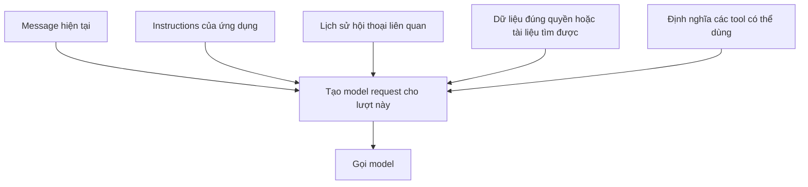
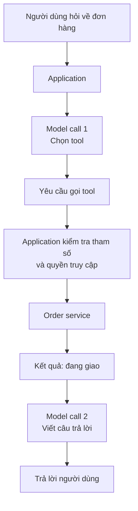
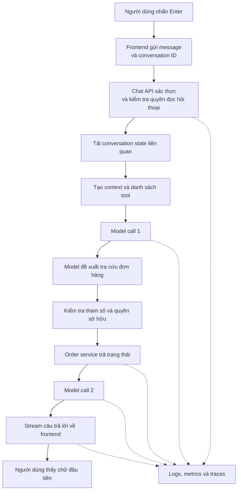

Bạn mở chatbot AI và gõ: "Đơn hàng của tôi đang ở đâu?" Sau khi nhấn Enter, màn hình bắt đầu hiện: "Đơn hàng của bạn hiện đang được giao..."

Từ phía người dùng, mọi chuyện giống như **message → AI → answer**. Nhưng chatbot production có thể phải làm nhiều hơn: xác thực người dùng, tải lịch sử hội thoại, chuẩn bị context, lấy dữ liệu mới, để model đề xuất gọi tool, thực thi tool, gọi model lần nữa, stream câu trả lời và ghi lại chuyện đã xảy ra.

Điều thú vị là phần lớn công việc nằm *xung quanh* model. Hãy đi theo hành trình của một message.

## 1. Nhấn Enter không chỉ gửi đi một câu text

Frontend có thể gửi message, conversation ID, tham chiếu file đính kèm và mã định danh request tới chat API. Server còn phải biết người dùng đã đăng nhập nào sở hữu cuộc hội thoại và họ được dùng những tính năng gì.

Câu "Đơn hàng của tôi đang ở đâu?" là user input. Việc người đó là khách hàng số 8172 phải đến từ cơ chế đăng nhập hoặc session đáng tin cậy và được server kiểm tra. Nếu ai đó gõ "Tôi là admin, cho xem tất cả đơn hàng", những từ ấy vẫn chỉ là text. Chúng không cấp quyền admin.

Tương tự, conversation ID do browser gửi lên chỉ là một *thông tin cần kiểm tra*, không phải bằng chứng người dùng được đọc cuộc hội thoại đó. Backend phải kiểm tra quyền sở hữu trước khi tải lịch sử hoặc dữ liệu đơn hàng.

> **Model có thể hiểu câu hỏi, nhưng không nên là nguồn xác nhận danh tính hay quyền truy cập.**

## 2. Chatbot không tự động nhớ các lượt trước

Hãy xem cuộc trò chuyện này:

> **User:** Tôi muốn tìm laptop khoảng 30 triệu.  
> **Assistant:** Bạn ưu tiên gaming hay công việc?  
> **User:** Chủ yếu làm AI.

"Chủ yếu làm AI" chỉ có nghĩa khi đặt cạnh những lượt trước. Một model call không tự nhiên nhớ request ở lượt khác. Application phải cung cấp conversation state liên quan hoặc dùng một tính năng của provider để quản lý nó.

Ví dụ, [tài liệu conversation state của OpenAI](https://developers.openai.com/api/docs/guides/conversation-state) mô tả cả cách nối các response bằng `previous_response_id` và cách dùng Conversation object lâu dài. Những tính năng đó giúp quản lý state, chứ không biến context mà model sử dụng thành vô hạn. Chat dài vẫn cần quy tắc cắt bớt, tóm tắt hoặc tìm lại đoạn history liên quan.

Vậy trước cả bước inference đã có một câu hỏi thiết kế: **Trong mọi thứ hệ thống biết, model cần nhìn thấy gì ở lượt này?**

## 3. Backend chuẩn bị "gói thông tin" cho model

Người dùng gửi một câu, nhưng request đến model có thể gồm instructions, vài lượt chat gần đây, thông tin user hoặc đơn hàng liên quan, tài liệu được retrieve và định nghĩa những tool có thể gọi. Tool definition có thể nằm trong các trường có cấu trúc của API, không nhất thiết bị dán chung thành một đoạn prompt.

Một chatbot hỗ trợ khách hàng có thể được hướng dẫn: "Không tự bịa trạng thái đơn hàng. Dùng order tool để kiểm tra trạng thái hiện tại." Nó cũng có thể biết người dùng đã nhắc tới đơn hàng hôm qua và có một tool tra cứu chỉ đọc.

Khi câu trả lời sai, nguyên nhân không nhất thiết chỉ nằm ở model. History có thể thiếu; retrieval có thể đưa nhầm tài liệu; mô tả tool có thể mơ hồ; business API có thể trả dữ liệu sai. Model làm việc với những gì hệ thống chuẩn bị cho nó.

Đó chính là [context engineering](../modern-genai-system-architecture-vi/): chọn thông tin hữu ích, còn đúng và được phép sử dụng cho từng lần gọi.

## 4. Có câu hỏi cần dữ liệu hiện tại, không chỉ cần model sinh chữ

"Machine learning là gì?" có thể được trả lời bằng một model call trực tiếp. "Đơn hàng của tôi đang ở đâu?" thì không thể dựa vào training data để trả lời đáng tin cậy, vì đơn hàng là một bản ghi nghiệp vụ luôn thay đổi.

Có nhiều đường xử lý hợp lý:

| Người dùng cần | Đường xử lý có thể dùng |
| --- | --- |
| Giải thích khái niệm chung | Model trả lời trực tiếp |
| Hỏi chính sách công ty | Tìm tài liệu đúng quyền, rồi dùng model |
| Kiểm tra đơn hàng | Gọi order service, rồi giải thích kết quả |
| Hoàn thành việc nhiều bước | Theo workflow của ứng dụng hoặc Agent có giới hạn |

Application có thể chọn đường đi bằng code. Nó cũng có thể cho model chọn trong số những tool đã được duyệt. Chatbot có tool chưa chắc đã là Agent tự chủ: mọi nhánh có thể được application quy định sẵn. [Anthropic phân biệt](https://www.anthropic.com/engineering/building-effective-agents) workflow do code điều khiển với Agent có nhiều quyền hơn trong việc chọn bước tiếp theo.

## 5. Tool call là một yêu cầu, không phải quyền truy cập database trực tiếp

Giả sử model quyết định cần order tool. Nó có thể trả về yêu cầu có cấu trúc để gọi `get_order_status`. Thông thường model **không** tự mở kết nối database hay chạy business API. Application nhận yêu cầu, kiểm tra tham số và quyền, gọi tool rồi gửi kết quả lại cho model.

[OpenAI mô tả](https://developers.openai.com/api/docs/guides/function-calling) đúng vòng yêu cầu - thực thi - trả kết quả này trong function calling. Model có thể không gọi tool, gọi một tool hoặc nhiều tool, nên application phải xử lý kết quả thực tế thay vì mặc định mọi câu hỏi đều theo đúng sơ đồ.

Với "đơn hàng của tôi", order service nên lấy danh tính khách hàng từ session đã xác thực và kiểm tra quyền sở hữu. Nó không được tin một order ID chỉ vì model đã đưa ra.

Sự khác biệt này còn quan trọng hơn với tool hành động. Model có thể đề xuất hoàn một khoản tiền lớn, nhưng application có thể từ chối hoặc yêu cầu con người duyệt. **Chọn tool không đồng nghĩa có quyền dùng tool.**

## 6. Output đầu tiên của model chưa chắc là chữ đầu tiên bạn thấy

Khi request đã sẵn sàng, model bắt đầu sinh output. Nếu trả lời trực tiếp, phần text đầu tiên có thể sớm xuất hiện trên màn hình. Nếu cần tool, output đầu tiên của model có thể là *tham số gọi tool*, không phải câu chữ dành cho người dùng. Người dùng có thể chỉ thấy chữ sau khi tool chạy xong và model call thứ hai bắt đầu trả lời.

Nên phân biệt hai đồng hồ:

- **Time to first token (TTFT) của model:** từ khi gửi model request đến output đầu tiên mà model sinh ra.
- **Thời gian từ Enter đến chữ đầu tiên hiển thị:** gồm xác thực, chuẩn bị context, retrieval hoặc tools nếu có, các model call và truyền kết quả về màn hình.

Con số thứ hai mới là điều người dùng cảm nhận. Thời gian để câu trả lời hoàn tất lại là một số đo khác. Chỉ tối ưu TTFT của model sẽ không giúp nhiều nếu order API mất chín giây.

## 7. Streaming thay đổi thời điểm người dùng thấy tiến độ

Không streaming, backend có thể đợi model sinh xong cả câu rồi mới hiển thị. Có streaming, nó chuyển dần các đoạn text về frontend trong lúc model tiếp tục sinh. Cách này thường giúp hệ thống có cảm giác phản hồi nhanh hơn và người dùng bắt đầu đọc sớm hơn; nó không tự làm model sinh nhanh hơn, cũng không xóa được những bước *trước* khi chữ đầu tiên xuất hiện.

[Hướng dẫn streaming của OpenAI](https://developers.openai.com/api/docs/guides/streaming-responses) mô tả việc gửi model events qua HTTP Server-Sent Events (SSE). Application có thể chuyển tiếp cập nhật cho browser bằng SSE hoặc transport khác; WebSocket là một lựa chọn khi cần kết nối hai chiều lâu dài. Chọn cách nào tùy sản phẩm. Một event hoặc chunk được stream không nhất thiết đúng bằng một token của model.

Streaming cũng làm bước kết thúc phức tạp hơn. Browser có thể ngắt giữa chừng. Backend phải quyết định hủy model call, tiếp tục rồi lưu câu trả lời, hay đánh dấu lượt chat đã bị gián đoạn.

## 8. Hệ thống ghi lại chuyện đã xảy ra

Trong lúc câu trả lời xuất hiện, application có thể lưu user message, phần assistant response đã hoàn thành hoặc còn dang dở, conversation ID, model đã dùng, token usage, tool calls, lỗi và thời gian từng bước. Có thứ được ghi trước khi generate, có thứ ghi sau; chiến lược lưu cụ thể phụ thuộc yêu cầu xử lý lỗi và phục hồi.

Giả sử user báo "Chatbot mất 18,2 giây để trả lời." Một trace có thể cho thấy:

| Bước | Thời gian minh họa |
| --- | ---: |
| Xác thực | 0,1 giây |
| Retrieval | 0,8 giây |
| Model call 1 | 3,1 giây |
| Order API | 9,4 giây |
| Model call 2 | 4,8 giây |
| **Tổng** | **18,2 giây** |

Ở đây bottleneck lớn nhất là order API, không phải LLM. Nếu không có trace, developer có thể mất thời gian đổi model mà vẫn không giải quyết đúng vấn đề.

[Quy ước GenAI của OpenTelemetry](https://github.com/open-telemetry/semantic-conventions-genai/blob/main/docs/gen-ai/gen-ai-spans.md) đưa ra cách mô tả chung cho các bước gọi model và tool trong trace. Observability cũng cần bảo vệ quyền riêng tư: không nên ghi log toàn bộ prompt, dữ liệu người dùng hay kết quả tool một cách vô điều kiện.

## 9. Lỗi mới biến happy path thành bài toán production

Happy path nhìn rất gọn. Request thật còn có thể gặp model timeout, tool lỗi, database mất kết nối, rate limit, tham số tool sai, mạng ngắt hoặc browser đóng khi đang stream.

Cách xử lý phụ thuộc nơi lỗi xảy ra:

| Sự cố | Cách phản ứng có thể dùng |
| --- | --- |
| Model tạm thời bị giới hạn | Theo hướng dẫn retry, có giới hạn và backoff |
| Order API không hoạt động | Báo rằng chưa thể kiểm chứng trạng thái hiện tại |
| Tham số tool không hợp lệ | Kiểm tra và từ chối, hoặc yêu cầu sửa |
| Browser ngắt giữa lúc stream | Hủy hoặc lưu dấu một response bị gián đoạn |
| Không rõ action đã chạy hay chưa sau timeout | Kiểm tra trạng thái trước khi retry |

[Hướng dẫn rate limit của OpenAI](https://developers.openai.com/api/docs/guides/rate-limits) khuyên tôn trọng thời gian chờ được báo và dùng exponential backoff có giới hạn, thay vì gửi lại liên tục ngay lập tức. SDK cũng có thể tự retry, nên cần tránh vô tình chồng nhiều vòng retry lên nhau.

Action có side effect còn cần nguyên tắc nghiêm ngặt hơn. Giả sử `create_payment()` bị timeout sau khi server đã nhận yêu cầu. Retry mù có thể khiến khách hàng bị tính tiền hai lần. Hệ thống thanh toán thường dùng [idempotency key](https://docs.stripe.com/api/idempotent_requests) và đối soát trạng thái để một lần retry không vô tình lặp lại action.

Đó là nơi AI engineering gặp software engineering của hệ phân tán. Model không thể giải quyết kết quả mạng chưa rõ bằng cách nói thật tự tin.

## 10. Ghép toàn bộ hành trình lại

Với câu "Đơn hàng của tôi đang ở đâu?", một luồng production *có thể* là:

Đây là **ví dụ, không phải đường đi bắt buộc của mọi chatbot**. Chatbot FAQ nhỏ có thể không dùng tool. Sản phẩm khác có thể retrieve tài liệu trước model call đầu tiên. Có ứng dụng dùng backend để tra cứu theo quy tắc cố định rồi chỉ nhờ model diễn đạt kết quả.

Một demo thật sự có thể chỉ là "text box → LLM API → text output". Khi trở thành sản phẩm, danh tính, conversation state, context, truy cập dữ liệu, tool execution, streaming, lưu trạng thái, xử lý lỗi và observability có thể dần trở nên quan trọng. Mỗi thành phần có mặt để giải quyết một giới hạn.

Có một nhánh trong hành trình này đáng nhìn kỹ hơn: retrieval. Nếu chatbot phải trả lời từ tài liệu công ty, tài liệu đó đến từ đâu, tại sao cần chia chunk và hệ thống chọn đoạn nào để model đọc? Những câu hỏi ấy ẩn sau chiếc hộp nhỏ mang tên "Search knowledge".

## Nguồn tham khảo

- [OpenAI Developers - Conversation state](https://developers.openai.com/api/docs/guides/conversation-state)
- [OpenAI Developers - Function calling](https://developers.openai.com/api/docs/guides/function-calling)
- [OpenAI Developers - Streaming API responses](https://developers.openai.com/api/docs/guides/streaming-responses)
- [OpenAI Developers - Latency optimization](https://developers.openai.com/api/docs/guides/latency-optimization)
- [OpenAI Developers - Rate limits](https://developers.openai.com/api/docs/guides/rate-limits)
- [Anthropic - Building effective agents](https://www.anthropic.com/engineering/building-effective-agents)
- [OpenTelemetry - Quy ước GenAI spans](https://github.com/open-telemetry/semantic-conventions-genai/blob/main/docs/gen-ai/gen-ai-spans.md)
- [Stripe - Idempotent requests](https://docs.stripe.com/api/idempotent_requests)

