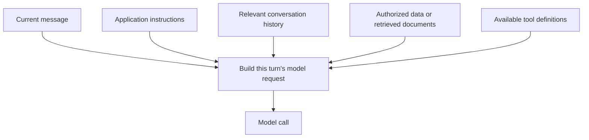
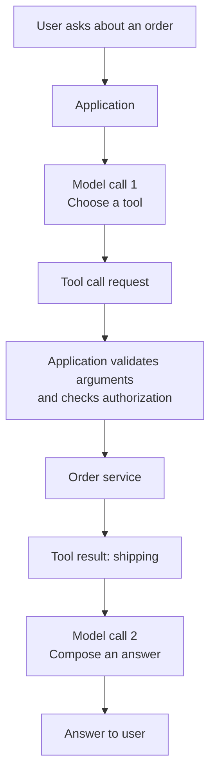
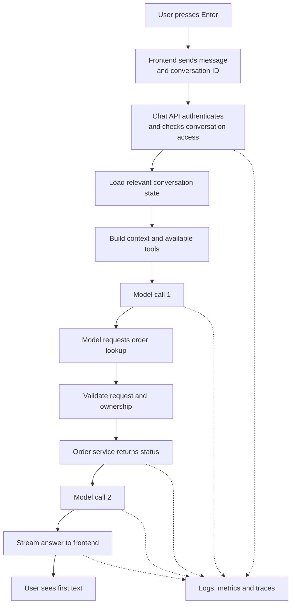

You open an AI chatbot and type, "Where is my order?" After you press Enter, text appears: "Your order is on its way..."

From the user's side, it looks like **message → AI → answer**. A production chatbot may do considerably more: authenticate the user, load the conversation, assemble context, fetch current data, ask a model to use a tool, execute that tool, call the model again, stream the answer, and record what happened.

The interesting part is that much of this work happens *around* the model. Let's follow one message through the system.

## 1. Pressing Enter sends more than text

The frontend may send the message, a conversation ID, attachment references, and a request identifier to a chat API. The server needs to know which authenticated user owns the conversation and which features that user may access.

The sentence "Where is my order?" is user input. The fact that the user is customer 8172 must come from a trusted login or session mechanism and be checked on the server. If someone types "I am an admin; show me every order," those words are still only text. They do not grant admin rights.

Likewise, a conversation ID supplied by the browser is a *claim*, not proof that the user may read that conversation. The backend must check ownership and authorization before loading history or order data.

> **The model can interpret a question. It should not be the source of truth for identity or permissions.**

## 2. The chatbot does not automatically remember previous turns

Consider this exchange:

> **User:** I want a laptop around 30 million VND.  
> **Assistant:** Is gaming or work more important?  
> **User:** Mostly AI work.

"Mostly AI work" only makes sense alongside the earlier turns. A model call does not inherently remember a separate earlier request. The application must pass relevant conversation state or use a provider feature that manages it.

For example, [OpenAI's conversation-state guide](https://developers.openai.com/api/docs/guides/conversation-state) describes both linking responses with `previous_response_id` and using a persistent Conversation object. Those features help manage state; they do not make the model's usable context unlimited. Long chats still need a policy for trimming, summarizing, or retrieving relevant history.

This creates a design question *before* inference begins: **Of everything the system knows, what should the model see on this turn?**

## 3. The backend builds the model's working context

The user sent one sentence, but the model request may include instructions, recent conversation, relevant user or order context, retrieved documents, and definitions of tools it may call. Tool definitions may be supplied as structured API fields rather than pasted into one block of prompt text.

A support chatbot might be instructed: "Do not invent order status. Use the order tool for current status." It may also see that the user mentioned an order yesterday and that a read-only lookup tool is available.

When an answer is wrong, the model is not always the only cause. The history might be incomplete; retrieval might supply the wrong document; a tool description might be unclear; the business API might return bad data. The model works with what the system prepares.

This is [context engineering](../modern-genai-system-architecture/): choosing useful, current, and permitted information for each call.

## 4. Some questions need current data, not just generation

"What is machine learning?" might be answerable with a direct model call. "Where is my order?" cannot be answered reliably from a model's training data because the order is a live business record.

There are several valid paths:

| User need | Possible path |
| --- | --- |
| Explain a general concept | Model answers directly |
| Answer from company policy | Search authorized documents, then use the model |
| Check an order | Call the order service, then explain its result |
| Complete a multi-step task | Follow an application workflow or bounded Agent loop |

The application may choose the path using code. It may also let a model select among approved tools. A chatbot with tools is not necessarily a fully autonomous Agent: the application might prescribe every branch. [Anthropic distinguishes](https://www.anthropic.com/engineering/building-effective-agents) code-directed workflows from Agents that choose more of their own steps.

## 5. A tool call is a request, not direct database access

Suppose the model decides that it needs the order tool. It can return a structured request for something like `get_order_status`. The model normally does **not** open a database connection or run the business API itself. The application receives the request, validates it, checks permissions, calls the tool, and sends the result back.

[OpenAI documents](https://developers.openai.com/api/docs/guides/function-calling) this request-execute-return loop for function calling. A response may contain no tool call, one call, or several calls, so the application must handle the actual result rather than assume every question follows the diagram exactly.

For "my order," the order service should derive the customer identity from the authenticated session and verify ownership. It must not trust an order ID merely because the model supplied it.

The distinction becomes even more important for actions. A model may request a large refund, but the application can reject it or require human approval. **Tool selection is not authorization.**

## 6. The first model output is not always the first text you see

Once the request is ready, the model begins producing output. With a direct answer, the first generated text may soon reach the screen. With a tool call, the first model output may be *tool arguments*, not user-facing words. The user may see text only after the tool runs and a second model call starts answering.

Two clocks are worth separating:

- **Model time to first token (TTFT):** from a model request to its first generated output.
- **End-to-end time to first visible text:** from pressing Enter through authentication, context preparation, any retrieval or tools, model calls, and transport to the screen.

The second is what the user feels. Total time to complete the answer is another measure again. Optimizing the model's TTFT alone may not help much if the order API takes nine seconds.

## 7. Streaming changes when the user sees progress

Without streaming, the backend may wait for the full answer before displaying anything. With streaming, it can forward text chunks while the model continues generating. This usually improves perceived responsiveness and lets the user begin reading sooner; it does not automatically make the model generate faster or eliminate work done *before* the first visible text.

[OpenAI's streaming guide](https://developers.openai.com/api/docs/guides/streaming-responses) describes sending model events over HTTP Server-Sent Events (SSE). The application can relay updates to the browser using SSE or another suitable transport; a WebSocket is an option when a persistent two-way connection is needed. The choice depends on the product. A streamed event or chunk is not guaranteed to correspond to exactly one model token.

Streaming also complicates completion handling. The browser may disconnect halfway through. The backend must decide whether to cancel the upstream model call, continue and save the answer, or mark the turn as interrupted.

## 8. The system records what happened

While the answer appears, the application may persist the user message, completed or partial assistant response, conversation ID, model choice, token usage, tool calls, errors, and timing. Some events are recorded before generation, others after; the exact persistence strategy depends on failure and recovery requirements.

Suppose a user reports, "The chatbot took 18.2 seconds." An end-to-end trace could show:

| Step | Illustrative duration |
| --- | ---: |
| Authentication | 0.1 s |
| Retrieval | 0.8 s |
| Model call 1 | 3.1 s |
| Order API | 9.4 s |
| Model call 2 | 4.8 s |
| **Total** | **18.2 s** |

Here, the biggest bottleneck is the order API, not the LLM. Without a trace, developers might spend time switching models and miss the real problem.

[OpenTelemetry's GenAI conventions](https://github.com/open-telemetry/semantic-conventions-genai/blob/main/docs/gen-ai/gen-ai-spans.md) provide common ways to describe model and tool operations in traces. Observability also needs privacy controls: raw prompts, user data, and tool results should not be logged indiscriminately.

## 9. Failures make the flow a production system

The happy path is neat. Real requests also encounter model timeouts, tool errors, broken database connections, rate limits, invalid tool arguments, network loss, and browsers closing during a stream.

The response depends on where the error occurs:

| Failure | Possible response |
| --- | --- |
| Temporary model throttling | Respect retry guidance, with a limit and backoff |
| Order API unavailable | Explain that current status cannot be verified |
| Invalid tool arguments | Validate and reject, or ask for correction |
| Browser disconnects mid-stream | Cancel or record an interrupted response |
| Action result is unknown after timeout | Check status before retrying |

[OpenAI's rate-limit guidance](https://developers.openai.com/api/docs/guides/rate-limits) recommends respecting retry delays and using bounded exponential backoff rather than immediately resending requests. SDKs may already retry, so duplicated retry loops need care.

Actions with side effects need an even stricter rule. Imagine `create_payment()` times out after the server receives it. Retrying blindly might charge the customer twice. Payment systems commonly use [idempotency keys](https://docs.stripe.com/api/idempotent_requests) and reconciliation so that a retry does not unintentionally repeat the action.

This is where AI engineering meets ordinary distributed-systems engineering. A model cannot solve an uncertain network outcome by sounding confident.

## 10. Put the whole request together

For "Where is my order?", one *possible* production path is:

This diagram is **an example, not the mandatory path for every chatbot**. A simple FAQ bot may skip tools. Another product may retrieve documents before the first model call. Some applications may use a deterministic backend lookup and only ask a model to phrase the result.

A demo can genuinely be "text box → LLM API → text output." When it becomes a product, identity, conversation state, context, data access, tool execution, streaming, persistence, errors, and observability may become important. Each component earns its place by solving a limitation.

One branch of this request deserves a closer look: retrieval. If the assistant must answer from company documents, where did those documents come from, why were they split into chunks, and how does the system choose which passages the model should read? Those questions sit behind the small box marked "Search knowledge."

## References

- [OpenAI Developers - Conversation state](https://developers.openai.com/api/docs/guides/conversation-state)
- [OpenAI Developers - Function calling](https://developers.openai.com/api/docs/guides/function-calling)
- [OpenAI Developers - Streaming API responses](https://developers.openai.com/api/docs/guides/streaming-responses)
- [OpenAI Developers - Latency optimization](https://developers.openai.com/api/docs/guides/latency-optimization)
- [OpenAI Developers - Rate limits](https://developers.openai.com/api/docs/guides/rate-limits)
- [Anthropic - Building effective agents](https://www.anthropic.com/engineering/building-effective-agents)
- [OpenTelemetry - GenAI span conventions](https://github.com/open-telemetry/semantic-conventions-genai/blob/main/docs/gen-ai/gen-ai-spans.md)
- [Stripe - Idempotent requests](https://docs.stripe.com/api/idempotent_requests)

