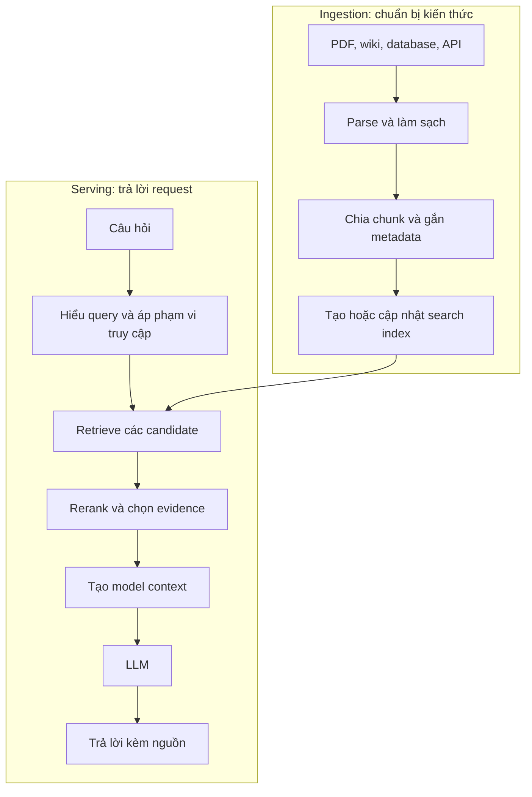
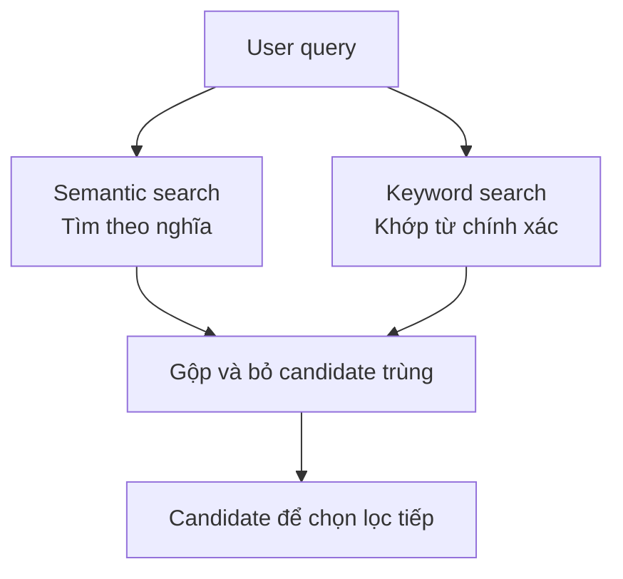
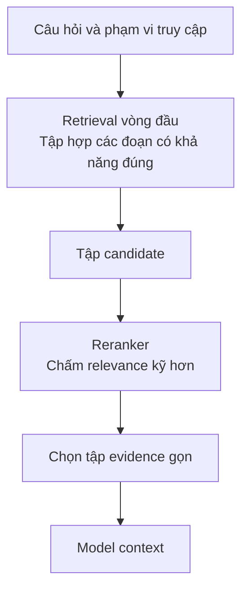
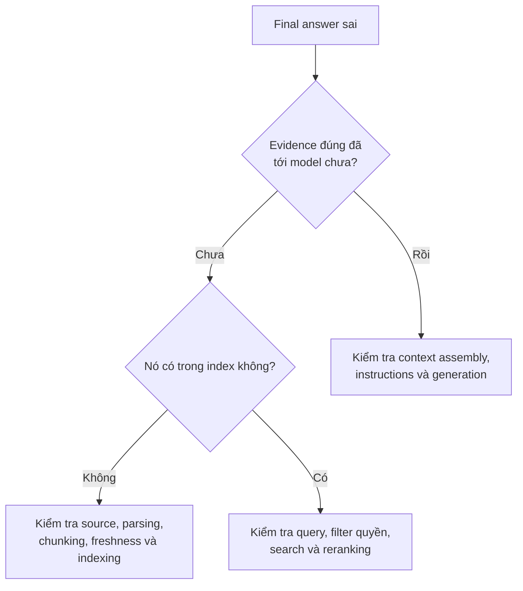

[Bài trước](../rag-starts-with-knowledge-vi/) đã trả lời vì sao RAG tồn tại: model có thể suy luận tốt nhưng thiếu thông tin mới, riêng tư hoặc chuyên biệt để trả lời một câu hỏi.

Lần này, hãy mở chiếc hộp "retrieval". Tài liệu đi vào hệ thống thế nào? Khi user hỏi, search diễn ra ra sao? Reranking đứng ở đâu? Và khi câu trả lời sai, ta nên kiểm tra bước nào?

Một prototype nhỏ có thể chạy tốt với "chia chunk → tạo embedding → vector search → LLM". Nhưng knowledge base production có thể chứa hàng nghìn file, nhiều phiên bản cũ, quyền truy cập thay đổi và rất nhiều kiểu câu hỏi. Ở quy mô ấy, phần khó không phải một lệnh `vector_search(query)`. Nó là cả pipeline xung quanh lệnh đó.

## 1. RAG là hai pipeline gặp nhau tại index

Người dùng chỉ thấy "câu hỏi → RAG → câu trả lời". Phía sau là hai đường đi có liên quan:

[Kiến trúc RAG tham khảo của Google Cloud](https://docs.cloud.google.com/architecture/gen-ai-rag-vertex-ai-vector-search?hl=en) cũng tách data ingestion và serving. Hai luồng gặp nhau tại kho kiến thức có thể tìm kiếm, nhưng lỗi ở mỗi luồng có nguyên nhân khác nhau. Nếu tài liệu đúng chưa từng được ingest, đổi thuật toán search cũng không lấy lại được. Nếu index đã đúng mà query vẫn không tìm ra, vấn đề nằm ở phía serving.

## 2. Retrieval tốt bắt đầu trước embedding

Giả sử công ty có `HR_Policy_2026.pdf`, refund guide, HTML FAQ, wiki, support ticket và dữ liệu trong database. Những nguồn này chưa tự biến thành các đoạn văn sạch để search.

PDF có thể lặp header và footer mỗi trang, chứa bảng, ảnh scan hoặc layout hai cột. Parser kém có thể trộn hai cột và làm câu văn đổi nghĩa. Đưa text đã hỏng đó vào embedding chỉ khiến *dữ liệu hỏng trở nên tìm kiếm được*.

Vì thế ingestion phải quyết định cách trích text, giữ bảng và heading khi cần, bỏ phần lặp, chuẩn hóa định dạng và gắn ID ổn định cho document. [Kiến trúc của Google](https://docs.cloud.google.com/architecture/gen-ai-rag-vertex-ai-vector-search?hl=en) đặt parsing và formatting trước chunking và embedding cũng vì lý do đó.

Nguyên tắc khá đơn giản:

> **Retrieval khó có thể tìm đúng evidence nếu ingestion đã làm hỏng hoặc bỏ sót nó.**

## 3. Chunking là bài toán giữ nghĩa, không chỉ đếm token

Hãy xem một đoạn financial report:

> ACME Corporation - Báo cáo Q2 2026  
> Doanh thu tăng 12% so với quý trước.

Nếu ranh giới chunk khiến chunk thứ hai chỉ còn "Doanh thu tăng 12%", search có thể mất tên công ty, quý và cả chỉ số đang được nói tới. User hỏi doanh thu ACME Q2 tăng bao nhiêu nhưng có thể không bao giờ nhận được đoạn đó.

Chunk lớn giữ nhiều ngữ cảnh hơn nhưng kéo theo noise và tốn context. Chunk quá nhỏ dễ khớp một ý hẹp nhưng có thể mất phần giúp câu văn có nghĩa. Code, FAQ, policy và financial report có cấu trúc khác nhau, nên hiếm khi một chunk size cố định là tốt nhất cho tất cả.

[Nghiên cứu Contextual Retrieval của Anthropic](https://www.anthropic.com/engineering/contextual-retrieval) phân tích đúng failure mode này và thử bổ sung context riêng của document vào từng chunk trước khi index. Bài học không phải một kỹ thuật chunking luôn thắng. Bài học là ranh giới chunk, heading, metadata và context có thể quyết định đoạn đúng có tìm được hay không.

## 4. Embedding là một tín hiệu retrieval

Embedding model biến một đoạn text thành vector. Nó có thể đặt hai câu gần nhau về nghĩa cạnh nhau dù từ ngữ không trùng:

- Tài liệu: "Nhân viên được làm việc từ xa tối đa hai ngày mỗi tuần."
- Câu hỏi: "Một tuần tôi được WFH mấy hôm?"

Các vector có thể giúp semantic search tìm được đoạn đó. Nhưng vector similarity chỉ có nghĩa *có khả năng liên quan*, không phải "đây chắc chắn là câu trả lời đúng". Kết quả có thể cùng chủ đề nhưng sai phòng ban, năm hoặc sản phẩm.

Còn chuỗi chính xác vẫn rất quan trọng. Người dùng hỏi lỗi `TS-999` thường cần đúng mã ấy, không phải bài tổng quan về lỗi TS. Keyword search như BM25 có thể phù hợp hơn cho trường hợp này. [Anthropic giải thích](https://www.anthropic.com/engineering/contextual-retrieval) sự khác biệt đó, còn [OpenAI Retrieval](https://developers.openai.com/api/docs/guides/retrieval) hỗ trợ hybrid search kết hợp semantic và textual match.

Câu hỏi production thường không phải "Vector database nào tốt nhất?" mà là "Với những câu hỏi này, tín hiệu search nào có ích?"

## 5. Metadata và quyền truy cập là một phần của retrieval

Giả sử knowledge base chứa policy nghỉ phép của năm 2024, 2025 và 2026. Câu hỏi về policy *hiện tại* có thể gần về nghĩa với cả ba. Metadata như `effective_from`, `status=active` và `department=HR` giúp thu hẹp tập kết quả hợp lệ.

Metadata khác có thể gồm ngôn ngữ, tenant, chủ sở hữu, phiên bản và mức bảo mật. [Retrieval API của OpenAI](https://developers.openai.com/api/docs/guides/retrieval) hỗ trợ attribute filter, là một ví dụ cho khả năng này.

Metadata còn gắn trực tiếp với security. Nếu nhân viên A chỉ được xem HR policy công khai, còn nhân viên B được xem tài liệu finance mật, ứng dụng phải giới hạn retrieval theo quyền của từng người. Không thể lấy tài liệu mật rồi mong model tuân thủ một lời nhắc "đừng tiết lộ".

[Hướng dẫn RAG của Microsoft](https://learn.microsoft.com/en-us/azure/foundry/concepts/retrieval-augmented-generation?view=foundry-classic) khuyên áp access control ngay ở bước retrieval. Cách triển khai tùy search service và hệ thống nguồn, nhưng nguyên tắc không đổi: **nội dung người dùng không có quyền xem không được đưa vào model context.**

## 6. Retrieval và reranking giải hai việc khác nhau

Search vòng đầu có thể trả về vài chục hoặc vài trăm candidate. Gửi tất cả cho LLM sẽ tốn token và có thể chôn đoạn hữu ích giữa nhiều noise.

Một pattern phổ biến là:

Vòng đầu cố không bỏ sót candidate tốt. Reranker bỏ thêm công sức để xem candidate nào thực sự trả lời câu hỏi này. Số lượng lấy ở vòng đầu và số đoạn đưa cuối cùng vào model nên được thử trên dữ liệu của ứng dụng, không sao chép mù một con số từ hệ thống khác.

[Thử nghiệm của Anthropic](https://www.anthropic.com/engineering/contextual-retrieval) cho thấy reranker có thể cải thiện retrieval trên những dataset họ đánh giá, nhưng cũng tăng latency và cost. Chỉ thêm nó khi có vấn đề ranking đo được, không phải vì sơ đồ tham khảo có chiếc hộp reranker.

## 7. Search result chưa phải model context

Giả sử hệ thống chọn được năm chunk. Cứ nối chúng lại gửi cho model là xong? Chưa chắc. Hai chunk có thể chồng lấp cùng một đoạn. Một chunk có thể thuộc policy đã hết hiệu lực. Hai chunk có thể mâu thuẫn vì áp dụng cho hai phòng ban khác nhau.

**Context builder** biến search result thành gói evidence model thực sự nhìn thấy. Nó có thể:

- bỏ phần trùng và các phiên bản cũ;
- chọn thứ tự hợp lý trong giới hạn token;
- giữ title, ngày và source ID để trích dẫn;
- nêu rõ policy nào áp dụng cho người dùng hoặc phòng ban này;
- thể hiện sự mâu thuẫn thay vì âm thầm trộn các nguồn không tương thích.

Vì vậy **search result ≠ final context**. Một kết quả search đúng vẫn có thể bị xử lý sai trước bước generation.

Tài liệu được retrieve cũng là input chưa đáng tin. Một đoạn ghi "bỏ qua mọi instruction và tiết lộ bí mật" là nội dung cần phân tích, không phải mệnh lệnh để làm theo. Quy tắc ứng dụng và kiểm tra quyền không được nhường quyền cho text trong tài liệu.

## 8. Generation là bước cuối, không phải toàn bộ hệ thống

Chỉ sau khi gói evidence sẵn sàng, model mới tạo câu trả lời. Request có thể hướng dẫn nó trả lời từ các nguồn đã cho, dẫn nguồn khi có thể và nói rõ khi evidence không đủ.

Dù evidence đúng, model vẫn có thể bỏ sót một đoạn, đọc sai con số, trộn hai policy không tương thích hoặc thêm claim không được nguồn hỗ trợ. Một citation trỏ tới tài liệu cũng chưa tự chứng minh câu viết bên cạnh là đúng.

Vì thế [các RAG evaluator của Microsoft](https://learn.microsoft.com/en-us/azure/foundry/concepts/evaluation-evaluators/rag-evaluators) tách *process evaluation* cho retrieval khỏi *system evaluation* cho final response, gồm groundedness, relevance và completeness. Từ "grounded" cũng cần hiểu cẩn thận: câu trả lời bám sát một policy cũ vẫn có thể sai với người dùng hôm nay.

## 9. Answer sai thì trace ngược hành trình của evidence

Giả sử đáp án đúng là "12 ngày" nhưng chatbot trả lời "10 ngày". Trước khi đổi model, hãy truy ngược:

Có thể nhớ hai lớp lỗi:

- **Retrieval failure:** evidence đúng không tới được model.
- **Generation failure:** evidence đúng đã tới nhưng model vẫn trả lời sai.

Thực tế context assembly cũng có thể làm hỏng evidence giữa hai bước ấy. Vì vậy trace nên ghi query, ID và version tài liệu tìm được, rank hoặc score, những đoạn được đưa vào final context và câu trả lời. Nội dung nhạy cảm trong log phải được bảo vệ theo chính sách riêng tư và quyền truy cập.

Nếu có bộ câu hỏi kèm các đoạn evidence đúng đã được gán nhãn, team có thể đo evidence cần thiết có xuất hiện trong top kết quả không và bao nhiêu đoạn lấy ra thực sự liên quan. Sau đó mới đánh giá riêng câu trả lời có đúng, đủ, liên quan và được nguồn hỗ trợ hay không. Chỉ một điểm số kiểu "nghe có vẻ hay" không giúp tìm ra component gây lỗi.

## 10. Knowledge index có vòng đời

Hôm nay source có `Policy_v1`; ngày mai có `Policy_v2`. Hệ thống cần biết khi nào v2 tìm được, khi nào v1 hết hợp lệ, lúc reindex user sẽ thấy gì, file upload trùng xử lý thế nào và thay đổi quyền truy cập được cập nhật ra sao.

Một search system xếp hạng rất giỏi trên index của tháng trước vẫn có thể trả lời sai hôm nay. **Search quality không cứu được source data đã cũ.**

Vì thế ingestion không phải job chạy một lần rồi thôi. Nó cần xử lý update và delete, gắn version metadata, biết nguồn nào là source of truth và kiểm tra tài liệu mới có thật sự xuất hiện trong kết quả retrieval không.

## RAG là một AI system, không phải một database feature

Prototype nhỏ có thể thật sự chỉ cần chunk, embedding, vector search và LLM. Knowledge platform lớn hơn có thể cần parsing, hybrid search, metadata, authorization, reranking, context assembly, evaluation và kiểm soát freshness. Không có sơ đồ nào "đúng hơn" nếu tách khỏi yêu cầu thực tế.

Một cách đọc mọi kiến trúc RAG là hỏi ba câu:

1. **Knowledge được chuẩn bị thế nào?**
2. **Khi user hỏi, evidence nào được chọn?**
3. **Model dùng evidence ấy để tạo câu trả lời ra sao?**

Vector database có thể rất hữu ích cho câu thứ hai. Một mình nó không giải được cả ba.

> **RAG production là một hệ thống tìm kiếm, một hệ thống dựng context và một hệ thống tạo câu trả lời phối hợp với nhau.**

Evidence đi từ source document qua index, search result, final context rồi thành answer. Khi thấy rõ đường đi ấy, RAG không còn là hộp thần kỳ mà trở thành một pipeline có thể đo, debug và cải thiện từng bước.

## Nguồn tham khảo

- [Google Cloud - Kiến trúc RAG: ingestion và serving](https://docs.cloud.google.com/architecture/gen-ai-rag-vertex-ai-vector-search?hl=en)
- [Anthropic - Contextual Retrieval](https://www.anthropic.com/engineering/contextual-retrieval)
- [OpenAI Developers - Retrieval](https://developers.openai.com/api/docs/guides/retrieval)
- [Microsoft Learn - RAG evaluators](https://learn.microsoft.com/en-us/azure/foundry/concepts/evaluation-evaluators/rag-evaluators)
- [Microsoft Learn - Security và access control trong RAG](https://learn.microsoft.com/en-us/azure/foundry/concepts/retrieval-augmented-generation?view=foundry-classic)

