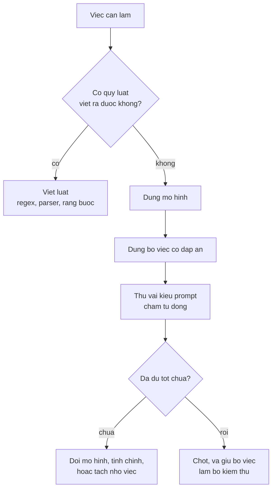

> **Mục tiêu bài học:** Sau bài này, bạn sẽ biết cách đo tác dụng của prompt bằng đáp án chấm được thay vì cảm giác, thấy một kết quả đi ngược hẳn lời khuyên phổ biến, và hiểu chỗ prompt hết tác dụng - nơi phải đổi sang cách khác.

## 1. Đo thay vì cảm nhận

Bài 07 cho thấy post-training dạy mô hình nghe theo yêu cầu. Câu hỏi kế tiếp rất thực tế: **viết yêu cầu thế nào thì khác biệt tới đâu?**

Hầu hết lời khuyên về prompt đều ở dạng "thế này nghe rõ hơn" - không kiểm chứng được. Bài này làm khác: chọn một việc **có đáp án đúng duy nhất**, viết năm kiểu prompt, rồi chấm tự động.

**Việc:** trích số tiền từ một dòng hóa đơn tiếng Việt. Tám dòng, mỗi dòng có đúng một đáp án:

```
"Tổng cộng: 3.850.000 đồng"        → 3.850.000
"Thuế GTGT 10%: 385.000 đồng"      → 385.000
"Chuyển khoản 27.500.000 vào ngày 09/09"  → 27.500.000
...
```

Việc này chọn có chủ đích: nó giống hệt bước hậu xử lý mà chương Computer Vision · Bài 12 đã làm bằng biểu thức chính quy. Nên cuối bài ta sẽ so được hai cách.

Chấm bằng cách kiểm chuỗi đáp án có xuất hiện trong đầu ra không. Dùng **greedy** để lặp lại được, đúng khuyến nghị của bài 05.

## 2. Năm kiểu prompt

| Kiểu | Nội dung |
|---|---|
| **Trần trụi** | `{câu}\nSố tiền:` |
| **Có hướng dẫn** | `Trích ra số tiền trong câu sau. Chỉ trả lời con số, không giải thích.\nCâu: {câu}\nSố tiền:` |
| **Có định dạng** | `Trích số tiền. Trả lời đúng định dạng: <số>\nCâu: {câu}\nSố tiền:` |
| **Một ví dụ mẫu** | thêm một cặp câu-đáp án mẫu trước khi hỏi |
| **Ba ví dụ mẫu** | thêm ba cặp mẫu |

Kết quả trên tám việc:

| Kiểu prompt | Đúng | Tỉ lệ |
|---|---|---|
| Trần trụi | 2/8 | 0,250 |
| **Có hướng dẫn** | **0/8** | **0,000** |
| Có định dạng | **4/8** | **0,500** |
| Một ví dụ mẫu | 3/8 | 0,375 |
| Ba ví dụ mẫu | **4/8** | **0,500** |

Bảng này có ba chuyện đáng nói, và không chuyện nào khớp với lời khuyên thông thường.

## 3. Thêm hướng dẫn lại làm kết quả tệ hơn

Kiểu "có hướng dẫn" được **0/8** - kém hơn cả prompt trần trụi. (Bảng này đo *kết quả*; các đoạn dưới đây đọc đầu ra để tìm lời giải thích hợp lý cho từng kiểu thất bại, chứ chưa cô lập được nguyên nhân bằng thí nghiệm riêng.) Đây là kết quả đi ngược trực tiếp lời khuyên phổ biến nhất về prompt: *"hãy nói rõ bạn muốn gì"*.

Nhìn vào đầu ra thì hiểu tại sao:

| Câu vào | Đáp án | Mô hình trả lời |
|---|---|---|
| Tổng cộng: 3.850.000 đồng | `3.850.000` | `385000` |
| Thuế GTGT 10%: 385.000 đồng | `385.000` | `385` |

Nó **mất dấu phân cách nghìn** và **cắt cụt con số**. Câu lệnh *"chỉ trả lời con số, không giải thích"* đẩy mô hình về phía trả lời thật ngắn - và nó ngắn quá tay, cắt luôn phần thông tin.

Còn prompt **trần trụi** thì thất bại theo kiểu khác hẳn: trong 6 lần sai, phần lớn là mô hình **từ chối**:

```
"Tôi xin lỗi, nhưng tôi không thể thực hiện..."
"Xin lỗi, nhưng tôi không thể tiếp tục ho..."
```

Lời giải thích hợp lý: không có ngữ cảnh, `Số tiền:` không đủ để mô hình xác định đang được yêu cầu gì, và nó rơi vào phản xạ từ chối mà post-training đã dạy. Muốn chắc thì phải thử tách riêng từng yếu tố - bài này chưa làm.

**Hai kiểu prompt, hai kiểu thất bại hoàn toàn khác nhau.** Nếu chỉ nhìn con số 2/8 và 0/8 thì không thấy được điều đó. Đây đúng bài học của chương Computer Vision · Bài 08: con số tổng che mất chỗ mô hình thực sự hỏng.

## 4. Ràng buộc định dạng thắng hướng dẫn bằng lời

Kiểu **có định dạng** đạt 4/8 - cao nhất bảng, ngang với ba ví dụ mẫu nhưng ngắn hơn nhiều. Đầu ra của nó:

```
<3.850.000>
<số>385.000</số>
```

Cả hai đều chứa con số đúng và đủ. Cho mô hình một **khuôn để điền** hiệu quả hơn bảo nó *"chỉ trả lời con số"* - vì khuôn ấy vừa nói rõ muốn gì, vừa không đẩy nó về phía cắt ngắn.

Chú ý đầu ra thứ hai: mô hình tự chế thêm thẻ `<số>...</số>` thay vì dùng đúng `<...>`. Nó **không tuân thủ chính xác định dạng** dù vẫn cho ra đúng số. Với một hệ thật, điều đó nghĩa là bạn vẫn phải viết bộ phân tích chịu được biến thể - đừng giả định mô hình sẽ theo khuôn từng ký tự.

**Ví dụ mẫu không thắng rõ rệt.** Một ví dụ được 3/8, ba ví dụ được 4/8 - bằng với cách chỉ đưa định dạng. Điều này đi ngược kỳ vọng rằng few-shot luôn tốt hơn. Và nhìn đầu ra thì thấy lý do: mô hình hay **bắt chước cả phần ví dụ** thay vì chỉ học định dạng từ chúng:

```
"1. Tổng: 500.000 đồng\n2. Phí 7..."      ← lặp lại chính các ví dụ mẫu
"Số tiền: 500.000 + 385.00"               ← trộn ví dụ mẫu vào đáp án
```

Với mô hình nhỏ, ví dụ mẫu vừa là hướng dẫn vừa là **nhiễu**.

## 5. Chỗ prompt hết tác dụng

Đây là kết luận quan trọng nhất của bài: **không kiểu prompt nào vượt quá 50%.**

Bốn trên tám việc vẫn sai với cấu hình tốt nhất. Với một việc đơn giản đến mức này - trích một con số đã hiện rõ trong câu - thì 50% là rất tệ.

Và chương Computer Vision · Bài 12 đã giải đúng bài toán ấy, với kết quả khác hẳn:

```python
amounts = re.findall(r"\d{1,3}(?:[.,]\d{3})+", line)
```

Một dòng biểu thức chính quy, **trích đúng cả bảy con số tiền** trên hóa đơn ở bài ấy. Không mô hình, không prompt, không bất định.

Bài học không phải "đừng dùng mô hình ngôn ngữ". Bài học là:

**Việc nào có quy luật viết ra được thì viết luật.** Số tiền Việt Nam có dạng rất đặc trưng. Nếu bài toán có một đặc tả viết ra được và đầu vào nằm trong đặc tả ấy, thì một biểu thức chính quy là **tất định** - cùng đầu vào luôn cho cùng kết quả, chạy tức thì, không tốn token nào, và kiểm thử được đến nơi đến chốn.

Nhưng đừng đọc "tất định" thành "luôn đúng". Biểu thức chính quy chỉ đúng trên đúng những dạng nó bao. Cùng một số tiền có thể viết thành `3 850 000`, `3,850,000`, `3.850.000đ`, có thể bị OCR nuốt mất dấu, có thể xen đơn vị vào giữa, có thể là số âm. Mỗi dạng ấy là một dòng phải thêm vào luật - và chính chỗ đó mới là nơi phải cân nhắc giữa luật và mô hình.

**Năm biến thể prompt này dừng ở 4/8.** Nói cho chặt thì bảng mục 2 chỉ chứng minh *năm cách viết đã thử* đều không vượt 50% - nó **không** chứng minh mọi cách viết đều thế, càng không chứng minh mô hình đã chạm trần năng lực. Hoàn toàn có thể còn cách viết khác tốt hơn.

Nhưng nó đủ để đổi câu hỏi. Sau năm biến thể mà kết quả vẫn quanh 50%, thử biến thể thứ sáu ít hứa hẹn hơn hẳn các hướng khác: mô hình lớn hơn (bài 06), tinh chỉnh riêng cho việc này, tách nhỏ việc, hoặc **bỏ hẳn mô hình** cho bước này.

**Phải đo mới biết.** Không ai đoán trước được rằng thêm hướng dẫn sẽ làm kết quả về 0/8. Cách duy nhất để biết là có một bộ việc có đáp án và chạy thử - mất vài phút.



> ⚠️ **Lưu ý nhỏ:** cách chấm ở bài này là **kiểm chuỗi đáp án có xuất hiện trong đầu ra hay không**. Cách ấy dễ cài và khách quan, nhưng có hai điểm mù. Nó **rộng tay** với phần thừa: `<số>385.000</số>` được tính đúng dù không theo đúng khuôn yêu cầu. Và nó **nghiêm khắc** với định dạng khác: nếu mô hình viết `3850000` không dấu chấm thì bị tính sai, dù về mặt giá trị vẫn là con số đúng. Với một hệ thật, bạn phải chọn cách chấm khớp với thứ hệ thống hạ nguồn thực sự cần - và nói rõ cách chấm khi báo cáo con số, vì đổi cách chấm là đổi cả bảng.

> 🔧 **Thử ngay:** trợ lý nội bộ của bạn trả lời sai khoảng 40% câu hỏi. Bạn nên bỏ một tuần viết lại prompt, hay làm gì khác?
> Trước hết dựng **bộ việc có đáp án** - hai ba chục câu lấy từ log thật, kèm câu trả lời đúng. Không có nó thì mọi thay đổi prompt đều là đoán, và bạn sẽ không biết mình đang cải thiện hay chỉ đang xê dịch. Có bộ ấy rồi thì một buổi chiều đủ để thử năm sáu kiểu prompt, và bảng kết quả sẽ nói ngay các biến thể ấy có nhích được điểm hay không. Nếu năm sáu kiểu khác nhau hẳn về cách viết mà điểm vẫn đứng yên, thì **giá trị của việc chỉnh prompt thêm đang giảm nhanh** - chưa chứng minh được là mô hình chạm trần, nhưng đủ để đáng đem thời gian ấy so với các lựa chọn đắt hơn: tách việc thành nhiều bước nhỏ, lấy thêm ngữ cảnh bằng truy hồi như bài 12, đổi mô hình, hoặc tinh chỉnh. Và đừng quên câu hỏi đầu tiên của sơ đồ trên: có phần nào trong 40% ấy thực ra **viết luật được** không?

## Tóm tắt bài học

- Đo tác dụng của prompt phải bằng **bộ việc có đáp án chấm được**, không bằng cảm giác "prompt này nghe rõ hơn".
- Trên tám việc trích số tiền: trần trụi **2/8**, có hướng dẫn **0/8**, có định dạng **4/8**, một ví dụ mẫu **3/8**, ba ví dụ mẫu **4/8**.
- **Thêm hướng dẫn làm kết quả tệ hơn**: câu *"chỉ trả lời con số"* đẩy mô hình cắt cụt - `3.850.000` thành `385000`, `385.000` thành `385`.
- Prompt trần trụi thất bại theo kiểu khác: mô hình **từ chối**, hợp với giả thuyết nó không xác định được đang được yêu cầu gì. Hai kiểu thất bại hoàn toàn khác nhau mà con số tổng che mất.
- **Cho khuôn để điền hiệu quả hơn ra lệnh bằng lời** - nhưng mô hình vẫn không theo khuôn chính xác (`<số>385.000</số>`), nên bộ phân tích phải chịu được biến thể.
- **Ví dụ mẫu không thắng rõ rệt**: với mô hình nhỏ, chúng vừa là hướng dẫn vừa là nhiễu - mô hình hay lặp lại chính các ví dụ.
- **Không kiểu prompt nào trong năm kiểu đã thử vượt 50%.** Điều đó không chứng minh mô hình đã chạm trần - chỉ chứng minh năm cách viết này đều dừng ở đó, và đủ để chuyển sang thử hướng khác.
- Cùng bài toán ấy, một biểu thức chính quy ở chương Computer Vision · Bài 12 trích **đúng cả bảy con số**. Việc nào có đặc tả viết ra được thì viết luật - luật là tất định và kiểm thử được, đổi lại nó chỉ bao đúng những dạng bạn đã lường trước.
- Cách chấm quyết định bảng số, nên phải nói rõ cách chấm khi báo cáo.

## Câu hỏi tự kiểm tra

1. Vì sao phải có bộ việc với đáp án trước khi bắt đầu chỉnh prompt?
2. Kiểu "có hướng dẫn" được 0/8, kém hơn cả trần trụi. Từ chính các đầu ra, nêu một lời giải thích phù hợp. Vì sao chưa được gọi đó là nguyên nhân đã chứng minh, và phải thí nghiệm thế nào mới gọi được?
3. Trần trụi và có hướng dẫn cùng thất bại nhưng theo hai kiểu khác nhau. Nêu hai kiểu, và vì sao con số tổng không cho thấy điều đó.
4. Vì sao cho khuôn định dạng lại hiệu quả hơn ra lệnh bằng lời?
5. Mô hình trả về `<số>385.000</số>` thay vì `<385.000>`. Điều đó buộc bạn thiết kế phần đọc kết quả thế nào?
6. Vì sao ví dụ mẫu không cải thiện rõ rệt với mô hình nhỏ?
7. Năm biến thể prompt đều dừng quanh 50%. Vì sao **không** kết luận được rằng mô hình đã chạm trần năng lực? Nêu ba hướng đáng thử tiếp.
8. Cách chấm ở bài này có hai điểm mù. Nêu cả hai, và cho một ví dụ mỗi loại.

## Đọc thêm

**Nguồn nền tảng của bài:**

| Nguồn | Đọc phần nào |
|---|---|
| **Bài 05 của chương này** | Vì sao dùng greedy cho thí nghiệm cần lặp lại được |
| **Bài 06 của chương này** | Bộ việc nhỏ có đáp án, và cách tách điểm theo loại |
| **Chương Computer Vision · Bài 12** | Biểu thức chính quy trích đúng cả bảy con số tiền - cùng bài toán, cách khác |
| **Chương Computer Vision · Bài 08** | Con số tổng che mất chỗ mô hình thực sự hỏng |

**Nguồn online bổ sung (miễn phí):**

- [Brown và cộng sự - Language Models are Few-Shot Learners (GPT-3, NeurIPS 2020)](https://arxiv.org/abs/2005.14165) - bài đặt nền cho ý tưởng ví dụ mẫu trong prompt.
- [Wei và cộng sự - Chain-of-Thought Prompting (NeurIPS 2022)](https://arxiv.org/abs/2201.11903) - kỹ thuật prompt có tác dụng rõ nhất với việc cần suy luận nhiều bước.
- [Zhao và cộng sự - Calibrate Before Use (ICML 2021)](https://arxiv.org/abs/2102.09690) - đo cho thấy kết quả nhạy cảm với **thứ tự và cách chọn** ví dụ mẫu tới mức nào.
- [Sclar và cộng sự - Quantifying Language Models' Sensitivity to Spurious Features in Prompt Design (ICLR 2024)](https://arxiv.org/abs/2310.11324) - thay đổi nhỏ về định dạng prompt làm kết quả dịch chuyển rất mạnh.
- [Outlines](https://github.com/dottxt-ai/outlines) - ép mô hình sinh ra đúng cấu trúc, cách giải quyết triệt để vấn đề định dạng ở mục 4.

> **Bài tiếp theo:** [Ảo giác và độ tin cậy](../hallucination-and-reliability-vi/) - bài này đo chỗ mô hình *làm sai việc được giao*. Bài sau đo một chuyện đáng lo hơn: những lúc nó **bịa ra thông tin** một cách trôi chảy và mạch lạc - kể cả về những nguồn, những định lý và những con người không hề tồn tại.
