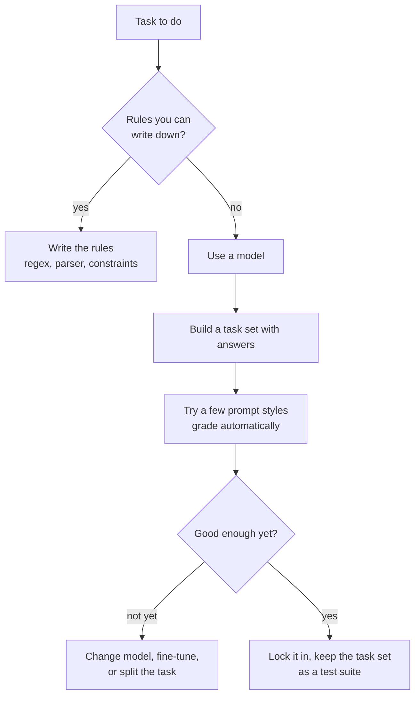

> **Learning objectives:** After this lesson, you will know how to measure what a prompt does using gradable answers instead of gut feeling, see a result that runs directly against popular advice, and understand where prompting stops helping - the point where you have to switch to another approach.

## 1. Measure instead of feel

Lesson 07 showed that post-training teaches a model to follow requests. The next question is very practical: **how much difference does the way you write the request make?**

Most prompting advice takes the form "this sounds clearer" - which cannot be verified. This lesson does something different: pick a task **with a single correct answer**, write five styles of prompt, then grade automatically.

**The task:** extract the amount of money from a line of a Vietnamese invoice. Eight lines, each with exactly one answer (for example "Total: 3,850,000 VND", "VAT 10%: 385,000 VND", "Transfer 27,500,000 on 09/09"):

```
"Tổng cộng: 3.850.000 đồng"        → 3.850.000
"Thuế GTGT 10%: 385.000 đồng"      → 385.000
"Chuyển khoản 27.500.000 vào ngày 09/09"  → 27.500.000
...
```

This task was chosen on purpose: it is exactly the post-processing step that Computer Vision · Lesson 12 did with a regular expression. So at the end of the lesson we can compare the two approaches.

Grading checks whether the answer string appears in the output. **Greedy** decoding is used for repeatability, as Lesson 05 recommends.

## 2. Five prompt styles

| Style | Content |
|---|---|
| **Bare** | `{câu}\nSố tiền:` ("{sentence}\nAmount:") |
| **With instructions** | `Trích ra số tiền trong câu sau. Chỉ trả lời con số, không giải thích.\nCâu: {câu}\nSố tiền:` ("Extract the amount from the following sentence. Answer with the number only, no explanation.") |
| **With format** | `Trích số tiền. Trả lời đúng định dạng: <số>\nCâu: {câu}\nSố tiền:` ("Extract the amount. Answer in exactly this format: <number>") |
| **One example** | add one example sentence-answer pair before asking |
| **Three examples** | add three example pairs |

Results on the eight tasks:

| Prompt style | Correct | Rate |
|---|---|---|
| Bare | 2/8 | 0.250 |
| **With instructions** | **0/8** | **0.000** |
| With format | **4/8** | **0.500** |
| One example | 3/8 | 0.375 |
| Three examples | **4/8** | **0.500** |

This table has three things worth discussing, and none of them matches conventional advice.

## 3. Adding instructions actually makes the result worse

The "with instructions" style scores **0/8** - worse than even the bare prompt. (This table measures *results*; the paragraphs below read the outputs to find a plausible explanation for each kind of failure, but have not isolated the cause with a separate experiment.) This result runs directly against the most popular piece of prompting advice: *"say clearly what you want"*.

Looking at the output shows why:

| Input sentence | Answer | Model's response |
|---|---|---|
| Tổng cộng: 3.850.000 đồng | `3.850.000` | `385000` |
| Thuế GTGT 10%: 385.000 đồng | `385.000` | `385` |

It **drops the thousands separators** and **truncates the number**. The instruction *"answer with the number only, no explanation"* pushes the model toward a very short answer - and it overdoes it, cutting off part of the information.

The **bare** prompt, meanwhile, fails in a completely different way: of its 6 misses, most are the model **refusing** (roughly "I'm sorry, but I cannot carry out..." and "Sorry, but I cannot continue..."):

```
"Tôi xin lỗi, nhưng tôi không thể thực hiện..."
"Xin lỗi, nhưng tôi không thể tiếp tục ho..."
```

A plausible explanation: with no context, `Số tiền:` ("Amount:") is not enough for the model to work out what it is being asked, and it falls back on the refusal reflex that post-training taught it. To be sure, you would have to test each factor separately - this lesson has not done that.

**Two prompt styles, two completely different kinds of failure.** If you only look at the numbers 2/8 and 0/8, you cannot see that. This is exactly the lesson of Computer Vision · Lesson 08: the overall number hides where the model is actually breaking.

## 4. A format constraint beats verbal instructions

The **with format** style reaches 4/8 - the top of the table, tied with three examples but much shorter. Its output:

```
<3.850.000>
<số>385.000</số>
```

Both contain the correct, complete number. Giving the model **a template to fill in** works better than telling it *"answer with the number only"* - because the template both says clearly what is wanted and does not push the model toward cutting its answer short.

Note the second output: the model invented a `<số>...</số>` tag (roughly `<number>...</number>`) instead of using exactly `<...>`. It **does not follow the format precisely** even though it still produces the right number. For a real system, that means you still have to write a parser that tolerates variations - do not assume the model will follow the template character for character.

**Examples do not clearly win.** One example scores 3/8, three examples score 4/8 - the same as just giving the format. This runs against the expectation that few-shot is always better. And the output shows why: the model often **copies the examples themselves** instead of only learning the format from them:

```
"1. Tổng: 500.000 đồng\n2. Phí 7..."      ← repeats the examples themselves
"Số tiền: 500.000 + 385.00"               ← mixes an example into the answer
```

With a small model, examples are both guidance and **noise**.

## 5. Where prompting stops helping

This is the most important conclusion of the lesson: **no prompt style gets above 50%.**

Four of the eight tasks are still wrong with the best configuration. For a task this simple - extracting a number that is plainly visible in the sentence - 50% is very poor.

And Computer Vision · Lesson 12 already solved exactly this problem, with a very different result:

```python
amounts = re.findall(r"\d{1,3}(?:[.,]\d{3})+", line)
```

One line of regular expression **correctly extracts all seven amounts** on the invoice in that lesson. No model, no prompt, no nondeterminism.

The lesson is not "don't use language models". The lesson is:

**If a task follows rules you can write down, write the rules.** Vietnamese money amounts have a very distinctive form. If the problem has a specification you can write down and the input stays within that specification, a regular expression is **deterministic** - the same input always gives the same result, it runs instantly, costs no tokens, and can be tested thoroughly.

But do not read "deterministic" as "always correct". A regular expression is only correct on exactly the forms it covers. The same amount can be written as `3 850 000`, `3,850,000`, `3.850.000đ`, can have its separators swallowed by OCR, can have a unit inserted in the middle, can be negative. Each of those forms is one more line to add to the rules - and that is exactly where you have to weigh rules against a model.

**These five prompt variants stop at 4/8.** Strictly speaking, the table in section 2 only proves that *the five styles tried* all fail to exceed 50% - it does **not** prove that every possible phrasing would, let alone that the model has hit its capability ceiling. There may well be a better way to write it.

But it is enough to change the question. After five variants with results still around 50%, trying a sixth is far less promising than other directions: a bigger model (Lesson 06), fine-tuning specifically for this task, breaking the task into smaller pieces, or **dropping the model entirely** for this step.

**You have to measure to know.** Nobody could have predicted that adding instructions would take the result down to 0/8. The only way to know is to have a task set with answers and run it - which takes a few minutes.



> ⚠️ **A small note:** the grading in this lesson **checks whether the answer string appears in the output**. That is easy to implement and objective, but it has two blind spots. It is **lenient** about extra material: `<số>385.000</số>` counts as correct even though it does not follow the requested template exactly. And it is **strict** about other formats: if the model writes `3850000` without dots, it is marked wrong, even though the value is the right number. For a real system, you must choose a grading method that matches what the downstream system actually needs - and state the grading method when you report the numbers, because changing how you grade changes the whole table.

> 🔧 **Try it now:** your internal assistant answers about 40% of questions wrong. Should you spend a week rewriting the prompt, or do something else?
> First build **a task set with answers** - two or three dozen questions taken from real logs, with correct answers. Without it, every prompt change is a guess, and you will not know whether you are improving things or just moving them around. Once you have that set, one afternoon is enough to try five or six prompt styles, and the results table will tell you right away whether those variants move the score at all. If five or six styles that differ substantially in wording leave the score unchanged, then **the value of further prompt tuning is dropping fast** - that does not prove the model has hit its ceiling, but it is enough to be worth weighing that time against more expensive options: breaking the task into smaller steps, adding context through retrieval as in Lesson 12, changing the model, or fine-tuning. And do not forget the first question in the diagram above: is any part of that 40% actually something you **can write rules for**?

## Lesson summary

- Measuring what a prompt does requires **a task set with gradable answers**, not the feeling that "this prompt sounds clearer".
- On eight amount-extraction tasks: bare **2/8**, with instructions **0/8**, with format **4/8**, one example **3/8**, three examples **4/8**.
- **Adding instructions made the result worse**: the phrase *"answer with the number only"* pushes the model to truncate - `3.850.000` becomes `385000`, `385.000` becomes `385`.
- The bare prompt fails in a different way: the model **refuses**, consistent with the hypothesis that it cannot work out what it is being asked. Two completely different kinds of failure that the overall number hides.
- **Giving a template to fill in works better than verbal commands** - but the model still does not follow the template precisely (`<số>385.000</số>`), so the parser must tolerate variations.
- **Examples do not clearly win**: with a small model they are both guidance and noise - the model often repeats the examples themselves.
- **None of the five prompt styles tried gets above 50%.** That does not prove the model has hit its ceiling - it only proves these five phrasings all stop there, and that is enough to move on to other directions.
- On the same problem, a regular expression in Computer Vision · Lesson 12 extracts **all seven amounts correctly**. If a task has a specification you can write down, write the rules - rules are deterministic and testable, but in exchange they only cover the forms you anticipated.
- The grading method determines the table, so you must state the grading method when reporting.

## Self-check questions

1. Why do you need a task set with answers before you start tuning prompts?
2. The "with instructions" style scored 0/8, worse than bare. From the outputs themselves, give a plausible explanation. Why can it not yet be called a proven cause, and what experiment would you need to call it one?
3. Bare and with instructions both failed, but in two different ways. Name the two ways, and explain why the overall number does not show this.
4. Why does giving a format template work better than verbal commands?
5. The model returns `<số>385.000</số>` instead of `<385.000>`. How does that force you to design the part that reads the result?
6. Why do examples not clearly improve results with a small model?
7. All five prompt variants stop around 50%. Why **can't** you conclude that the model has hit its capability ceiling? Name three directions worth trying next.
8. The grading method in this lesson has two blind spots. Name both, and give an example of each.

## Further reading

**Foundational sources for this lesson:**

| Source | Which part to read |
|---|---|
| **Lesson 05 of this chapter** | Why greedy decoding is used for experiments that must be repeatable |
| **Lesson 06 of this chapter** | Small task sets with answers, and splitting the score by type |
| **Computer Vision · Lesson 12** | A regular expression that correctly extracts all seven amounts - same problem, different approach |
| **Computer Vision · Lesson 08** | The overall number hides where the model is actually breaking |

**Additional online sources (free):**

- [Brown et al. - Language Models are Few-Shot Learners (GPT-3, NeurIPS 2020)](https://arxiv.org/abs/2005.14165) - the paper that laid the foundation for putting examples in the prompt.
- [Wei et al. - Chain-of-Thought Prompting (NeurIPS 2022)](https://arxiv.org/abs/2201.11903) - the prompting technique with the clearest effect on tasks that need multi-step reasoning.
- [Zhao et al. - Calibrate Before Use (ICML 2021)](https://arxiv.org/abs/2102.09690) - measurements showing how sensitive results are to **the order and choice** of examples.
- [Sclar et al. - Quantifying Language Models' Sensitivity to Spurious Features in Prompt Design (ICLR 2024)](https://arxiv.org/abs/2310.11324) - small changes in prompt formatting shift results very strongly.
- [Outlines](https://github.com/dottxt-ai/outlines) - forces the model to generate exactly the required structure, a thorough solution to the format problem in section 4.

> **Next lesson:** [Hallucination and Reliability](../hallucination-and-reliability/) - this lesson measured where the model *gets the assigned task wrong*. The next lesson measures something more worrying: the times it **makes up information** fluently and coherently - including about sources, theorems and people that do not exist at all.
