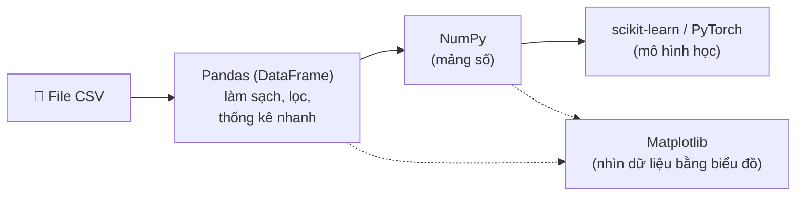

> **Mục tiêu bài học:** Sau bài này, bạn sẽ có một môi trường lập trình sẵn sàng cho AI (khuyến nghị Google Colab - không cần cài gì cả), và làm quen với "bộ đồ nghề" cơ bản: Python, NumPy, Pandas, Matplotlib - qua một bộ dữ liệu giá nhà mini dùng xuyên suốt.

## 1. Vì sao giới AI chuộng Python?

Bạn có giá của vài căn nhà và muốn tính tổng. Bằng Java, bạn viết:

```java
double totalPrice = 0;
for (double price : housePrices) {
    totalPrice += price;
}
```

Bằng Python:

```python
total_price = sum(house_prices)
```

Một dòng thay cho bốn. Ở Bài 01, ta đã thống nhất machine learning là "lập trình bằng dữ liệu" - và ngôn ngữ mà bạn sẽ gặp ở khắp nơi khi *làm* việc đó là **Python**. Ba lý do:

**1. Cú pháp gọn, đọc như mã giả (pseudocode).** Không khai báo kiểu, không chấm phẩy, không ngoặc nhọn - code Python thường ngắn và sát với dòng suy nghĩ hơn. Rào cản "học ngôn ngữ" nhờ vậy thấp xuống, để bạn dành sức cho phần khó thật sự: tư duy về dữ liệu và mô hình.

**2. Hệ sinh thái thư viện đồ sộ.** Một **thư viện (library)** là tập hợp code viết sẵn mà bạn chỉ việc gọi ra dùng - giống mua tủ bếp lắp sẵn thay vì tự đóng từng cánh cửa. Các công đoạn chính của một dự án AI thường đã có thư viện lo sẵn: đọc dữ liệu (Pandas), tính toán trên mảng số (NumPy), vẽ biểu đồ (Matplotlib), huấn luyện mô hình (scikit-learn, PyTorch).

**3. Code Python có thể chậm - nhưng phần tính toán nặng không chạy bằng Python.** Đây là điểm hay gây bất ngờ. Các phép tính số học nặng bên trong NumPy hay PyTorch do code C/C++ đã tối ưu đảm nhiệm (với PyTorch còn chạy được trên GPU). Python đóng vai trò **lớp vỏ điều khiển**: bạn ra lệnh bằng vài dòng ngắn gọn, cỗ máy bên dưới chạy bằng code tốc độ cao - kiểu "ngôn ngữ keo dán" (glue language).

> ⚠️ **Lưu ý nhỏ:** "Keo dán" chỉ nhanh khi bạn dán đúng chỗ. Nếu bạn tự viết vòng lặp Python chạy qua từng phần tử thay vì dùng phép toán của thư viện, phần code đó vẫn chậm như thường - đó là lý do có kỹ thuật "vector hóa" ở mục 4, và ở đó ta sẽ đo thử chênh lệch bằng số.

<details>
<summary><strong>Bên lề: Python không phải con trăn (bấm để mở)</strong></summary>

Theo tài liệu FAQ chính thức của python.org, Guido van Rossum - tác giả ngôn ngữ - khi bắt tay viết Python đang mê đọc kịch bản chương trình hài *Monty Python's Flying Circus* của đài BBC, và muốn một cái tên ngắn, độc đáo, hơi bí ẩn. Tên ngôn ngữ đến từ chương trình hài, không phải từ loài trăn.

</details>

> 💡 **Ghi nhớ nhanh:** Học Python cho AI không có nghĩa là phải thành lập trình viên chuyên nghiệp. Bạn cần đủ Python để *ra lệnh cho các thư viện* - và mức "đủ" đó thấp hơn bạn tưởng.

## 2. Chuẩn bị môi trường: ba con đường

Bạn đã thấy dòng `sum(...)` ở trên - nhưng gõ nó vào đâu để nó chạy? Có ba lựa chọn, xếp theo độ "nhẹ nhàng" giảm dần:

| Lựa chọn | Cần cài gì? | Phù hợp với |
|---|---|---|
| **Google Colab** (khuyến nghị) | Không cần cài gì - chỉ cần trình duyệt + tài khoản Google | Người mới bắt đầu, máy yếu, muốn thử ngay |
| **Python + pip + Jupyter** trên máy | Cài Python từ python.org, dùng lệnh `pip` để cài thư viện | Đã quen máy tính, muốn làm việc offline |
| **Miniconda / Anaconda** | Cài conda - trình quản lý môi trường và thư viện | Làm nhiều dự án song song, cần tách biệt môi trường |

### 2.1. Jupyter Notebook - "vở bài tập" của dân dữ liệu

Cả ba con đường trên đều có thể dùng chung một giao diện làm việc rất được ưa chuộng: **notebook**. Khác với file code truyền thống (viết hết rồi chạy một mạch), notebook chia thành từng **ô (cell)**:

```
┌────────────────────────────────────────────┐
│ [Ô văn bản]  Ghi chú: hôm nay phân tích    │
│              giá nhà quận 7...             │
├────────────────────────────────────────────┤
│ [Ô code]     gia.mean()                    │
│ [Kết quả]    3.3166...                     │
├────────────────────────────────────────────┤
│ [Ô code]     plt.scatter(dien_tich, gia)   │
│ [Kết quả]    (biểu đồ hiện ra ngay đây)    │
└────────────────────────────────────────────┘
```

Bạn chạy từng ô, thấy kết quả ngay lập tức, sửa rồi chạy lại - rất hợp với kiểu làm việc "vừa thăm dò dữ liệu vừa nghĩ" của machine learning. Notebook trộn được cả code, chữ, công thức và biểu đồ trong cùng một tài liệu, nên cũng là định dạng quen thuộc để chia sẻ phân tích. Sách *Dive into Deep Learning* - một trong những nguồn nền tảng của loạt bài này - được viết toàn bộ dưới dạng notebook chạy được.

Chi tiết thú vị: cái tên **Jupyter** ghép từ ba ngôn ngữ mà dự án hướng tới ban đầu - **Ju**lia, **Pyt**hon và **R** - đồng thời gợi nhớ những cuốn sổ tay mà Galileo dùng để ghi lại quan sát về các mặt trăng của sao Mộc (Jupiter), theo chính nhóm phát triển Project Jupyter.

> ⚠️ **Lưu ý nhỏ:** Với Python cài trên máy, bạn vẫn có thể viết file script `.py` hoặc dùng IDE như bình thường - notebook chỉ là lựa chọn đặc biệt tiện cho việc thăm dò dữ liệu, không phải bắt buộc.

### 2.2. Google Colab - bắt đầu trong 30 giây

**Google Colab** (colab.research.google.com) là dịch vụ notebook chạy trên máy chủ của Google. Với người mới, đây là lựa chọn dễ chịu nhất vì:

- **Không cài đặt gì:** mở trình duyệt, đăng nhập tài khoản Google, bấm "New notebook" - xong.
- **Có gói miễn phí**, bao gồm cả quyền dùng **GPU** ở mức giới hạn - thứ mà sau này bạn sẽ cần khi huấn luyện mạng nơ-ron.
- **Thư viện cài sẵn:** NumPy, Pandas, Matplotlib, scikit-learn, PyTorch... đều đã có, gõ `import` là chạy.
- Notebook lưu thẳng vào Google Drive, chia sẻ như chia sẻ Google Docs.

Toàn bộ code trong loạt bài này đều chạy được trên Colab. Lời khuyên chân thành: **đừng để việc cài đặt cản chân bạn** - hãy mở Colab và gõ theo ngay từ bài này.

### 2.3. Cài trên máy (khi bạn đã sẵn sàng)

Khi muốn làm việc offline hoặc quản lý dự án nghiêm túc hơn, bạn sẽ cài môi trường trên máy. Sách *Dive into Deep Learning* khuyến nghị dùng **Miniconda** - phiên bản gọn nhẹ của Anaconda - vì nó cho phép tạo **môi trường ảo (environment)**: mỗi dự án một "hộp" thư viện riêng, không giẫm chân nhau.

<details>
<summary><strong>Đào sâu: các lệnh cài đặt cơ bản với conda (bấm để mở)</strong></summary>

Quy trình mà sách *Dive into Deep Learning* hướng dẫn, tóm gọn lại:

```bash
# 1. Tải và cài Miniconda từ trang chủ conda (chọn bản cho hệ điều hành của bạn)

# 2. Tạo một môi trường riêng cho việc học AI
conda create --name hoc-ai python=3.11 -y

# 3. Kích hoạt môi trường (làm lại mỗi khi mở cửa sổ dòng lệnh mới)
conda activate hoc-ai

# 4. Cài các thư viện cần thiết bằng pip
pip install numpy pandas matplotlib jupyter

# 5. Mở Jupyter Notebook - trình duyệt sẽ tự bật lên
jupyter notebook
```

`pip` là trình cài thư viện đi kèm Python; `conda` vừa cài được thư viện vừa quản lý môi trường. Hai công cụ này dùng chung được với nhau (tạo môi trường bằng conda, cài thư viện bằng pip) - đó cũng là cách sách *Dive into Deep Learning* làm. Khi cần thêm PyTorch, chỉ cần `pip install torch` (chi tiết về GPU sẽ bàn khi ta thật sự cần đến, ở các bài về deep learning).

</details>

## 3. Bộ dữ liệu mini: bảng giá nhà

Giả sử bạn đang tìm mua nhà và gom được thông tin **6 căn đang rao bán**. Đây là bộ dữ liệu ta sẽ dùng xuyên suốt bài này (và gặp lại ở Bài 03) - nhỏ đến mức tính tay được, nên mọi con số máy trả về bạn đều tự kiểm được:

| dien_tich (m²) | so_phong_ngu | cach_trung_tam (km) | gia (tỷ đồng) |
|---:|---:|---:|---:|
| 30 | 1 | 5 | 1.8 |
| 45 | 2 | 3 | 2.6 |
| 60 | 2 | 7 | 3.0 |
| 80 | 3 | 2 | 5.1 |
| 100 | 3 | 10 | 4.5 |
| 55 | 2 | 4 | 2.9 |

Hai câu hỏi tự nhiên nảy ra: *diện tích liên quan thế nào đến giá? Căn nào đang "hời"?* - ta sẽ dùng lần lượt NumPy, Pandas, Matplotlib để trả lời.

> ⚠️ **Lưu ý nhỏ:** Số liệu là ví dụ tự đặt cho dễ hình dung, không phải giá thật của thị trường nào.

## 4. NumPy - mảng số, nền móng của mọi thứ

Câu hỏi đầu tiên: *mỗi m² của từng căn giá bao nhiêu?* Trên giấy, bạn phải làm 6 phép chia. Với **NumPy** (Numerical Python), bạn viết **một** phép chia - nó tự áp dụng cho cả 6 căn.

Cấu trúc trung tâm của NumPy là **`ndarray`** - mảng nhiều chiều (n-dimensional array) chứa các con số:

- Mảng **1 chiều** = một dãy số (ví dụ: giá của 6 căn nhà) - gọi là **vector**.
- Mảng **2 chiều** = một lưới số như bảng tính (6 hàng × 3 cột) - gọi là **ma trận (matrix)**.
- Từ 3 chiều trở lên = **tensor** (ví dụ: một tấm ảnh màu là lưới cao × rộng × 3 kênh màu).

Sức mạnh của NumPy nằm ở **tính toán vector hóa (vectorized)**: thao tác trên *cả mảng cùng lúc*, không cần viết vòng lặp qua từng phần tử.

```python
import numpy as np

# Diện tích (m²) và giá bán (tỷ đồng) của 6 căn nhà
areas_m2 = np.array([30, 45, 60, 80, 100, 55])
prices = np.array([1.8, 2.6, 3.0, 5.1, 4.5, 2.9])

print(areas_m2.shape)   # (6,) - mảng 1 chiều, 6 phần tử

# Tính giá mỗi m² cho CẢ 6 căn trong một dòng - không cần vòng lặp
prices_per_m2 = prices / areas_m2 * 1000   # đổi ra triệu đồng/m²
print(prices_per_m2.round(1))
# [60.  57.8 50.  63.8 45.  52.7]

# Vài con số thống kê nhanh
print(prices.mean())        # giá trung bình ≈ 3.32 tỷ
print(prices.max())         # căn đắt nhất: 5.1 tỷ
print(prices_per_m2.argmin())  # 4 → căn thứ 5 (chỉ số đếm từ 0) rẻ nhất tính theo m²
```

> 🔧 **Thử ngay:** Sửa `5.1` thành `6.1` trong mảng `prices` rồi chạy lại `prices.mean()`. Đáp số: `3.4833...` - tổng tăng đúng 1 tỷ, chia cho 6 căn nên trung bình tăng 1/6 ≈ 0.167. Đổi lại thành `5.1`, rồi thử `prices_per_m2.argmax()`: ra `3`, tức căn thứ 4 (80 m², 63.8 triệu/m²) là căn đắt nhất tính theo m².

Muốn gom cả 3 cột thông tin vào một mảng 2 chiều? Đây chính là hình hài mà dữ liệu sẽ mang khi vào mô hình ML:

```python
# Mỗi hàng = 1 căn nhà; mỗi cột = 1 thuộc tính
X = np.array([[30, 1, 5],
              [45, 2, 3],
              [60, 2, 7],
              [80, 3, 2],
              [100, 3, 10],
              [55, 2, 4]])
print(X.shape)     # (6, 3) - 6 mẫu, mỗi mẫu 3 con số
print(X[0])        # [30 1 5] - căn nhà đầu tiên
print(X[:, 0])     # [30 45 60 80 100 55] - cột diện tích của cả 6 căn
```

Cái `shape` (hình dạng) `(6, 3)` này bạn sẽ gặp đi gặp lại: **hàng = mẫu, cột = đặc trưng** - Bài 03 sẽ gọi tên chính thức cho chúng.

### Vector hóa nhanh đến mức nào?

Sách *Dive into Deep Learning* làm một thí nghiệm nhỏ: cộng hai vector 10.000 phần tử bằng vòng lặp `for` của Python, rồi cộng lại bằng một phép `+` vector hóa. Kết luận của các tác giả: vector hóa thường nhanh hơn **cỡ bậc độ lớn (order-of-magnitude)** - tức hàng chục đến hàng trăm lần. Đây là lý do thật sự khiến "Python chậm" không thành vấn đề trong AI: phần nặng đã được đẩy xuống thư viện.

<details>
<summary><strong>Đào sâu: tự đo trên máy bạn (bấm để mở)</strong></summary>

```python
import numpy as np, time

n = 10_000
a, b = np.ones(n), np.ones(n)

# Cách 1: vòng lặp Python, cộng từng phần tử
c = np.zeros(n)
t = time.time()
for i in range(n):
    c[i] = a[i] + b[i]
print(f"vong lap  : {time.time() - t:.6f} giay")

# Cách 2: một phép + vector hóa
t = time.time()
d = a + b
print(f"vector hoa: {time.time() - t:.6f} giay")
```

Con số cụ thể tùy máy, nhưng cách 2 nhanh hơn cách 1 hàng chục đến hàng trăm lần. Thêm một lợi ích mà sách nhấn mạnh: đẩy phép toán xuống thư viện nghĩa là bạn tự viết ít phép tính hơn, nên cũng ít chỗ để sai hơn.

</details>

Một điều đáng biết sớm: lớp tensor trong các framework deep learning (như `Tensor` của PyTorch) có cách sử dụng rất giống `ndarray` của NumPy, cộng thêm hai khả năng quan trọng: tự động tính đạo hàm (phục vụ huấn luyện - Bài 09 sẽ rõ vì sao) và chạy được trên GPU. Nhiều thao tác và cách tư duy bạn học với NumPy hôm nay sẽ chuyển sang PyTorch khá tự nhiên.

## 5. Pandas - bảng dữ liệu có tên cột

Dữ liệu thật hiếm khi là 6 con số sạch sẽ. Nó thường là một file Excel hay CSV: có **tên cột**, lẫn lộn số với chữ, và đôi khi... thiếu ô. NumPy mạnh về số nhưng không có chỗ cho tên cột - đó là đất diễn của **Pandas** với cấu trúc **`DataFrame`**: bạn cứ hình dung nó như một trang bảng tính Excel sống trong Python (Pandas cũng được xây dựng trên nền NumPy).

```python
import pandas as pd

# Tạo DataFrame từ dữ liệu 6 căn nhà
houses = pd.DataFrame({
    "dien_tich":      [30, 45, 60, 80, 100, 55],       # m²
    "so_phong_ngu":   [1, 2, 2, 3, 3, 2],
    "cach_trung_tam": [5, 3, 7, 2, 10, 4],             # km
    "gia":            [1.8, 2.6, 3.0, 5.1, 4.5, 2.9],  # tỷ đồng
})

print(houses.head())           # xem vài dòng đầu của bảng
print(houses["gia"].mean())    # giá trung bình của cột "gia"

# Lọc theo điều kiện: căn dưới 3 tỷ VÀ cách trung tâm không quá 5 km
affordable_houses = houses[(houses["gia"] < 3.0) & (houses["cach_trung_tam"] <= 5)]
print(affordable_houses)              # ra đúng 3 căn: 30m², 45m², 55m²

# Thống kê theo nhóm: giá trung bình theo số phòng ngủ
print(houses.groupby("so_phong_ngu")["gia"].mean())
```

> 🔧 **Thử ngay:** Đối chiếu kết quả `groupby` với bảng ở mục 3: nhóm 1 phòng ngủ → `1.8`; 2 phòng ngủ → `2.8333` (= (2.6 + 3.0 + 2.9) / 3); 3 phòng ngủ → `4.8` (= (5.1 + 4.5) / 2). Rồi tự viết `houses[houses["so_phong_ngu"] == 3]["gia"].mean()` - phải ra đúng `4.8`.

Trong thực tế, bạn hiếm khi gõ tay dữ liệu như trên - bảng thường nằm trong file **CSV** (dạng văn bản mỗi dòng một bản ghi, các cột cách nhau bằng dấu phẩy), và chỉ cần một dòng `pd.read_csv("ten_file.csv")` để nạp vào.

"Đặc sản" của dữ liệu thật: **giá trị thiếu (missing values)** - những ô trống mà Pandas hiển thị là `NaN` (not a number). Sách *Dive into Deep Learning* dành riêng một mục cho Pandas và gọi vui chúng là "rệp giường" của khoa học dữ liệu: dai dẳng và ở đâu cũng gặp. Cách xử lý (điền giá trị ước lượng, hay xóa hàng/cột) sẽ được bàn kỹ ở **Bài 12** - hiện tại bạn chỉ cần biết chúng tồn tại và Pandas có công cụ để xử lý (ví dụ `fillna`).

<details>
<summary><strong>Bên lề: pandas không phải gấu trúc (bấm để mở)</strong></summary>

Tên thư viện ghép từ *panel data* - thuật ngữ kinh tế lượng chỉ dữ liệu dạng bảng theo dõi cùng một nhóm đối tượng qua nhiều thời điểm - và cũng chơi chữ với *Python data analysis*. Tác giả Wes McKinney bắt đầu viết nó năm 2008 khi cần một công cụ phân tích dữ liệu tài chính linh hoạt ngay trong Python.

</details>

## 6. Matplotlib - cho dữ liệu một khuôn mặt

Nhìn bảng 6 hàng ở mục 3, bạn có thấy ngay căn nào "lạc quẻ" không? Khó. Vẽ lên thì thấy trong một giây. **Matplotlib** là thư viện vẽ biểu đồ lâu đời và thông dụng trong hệ sinh thái Python.

```python
import matplotlib.pyplot as plt

# Biểu đồ phân tán (scatter plot): mỗi căn nhà là một chấm
plt.scatter(houses["dien_tich"], houses["gia"])
plt.xlabel("Dien tich (m2)")
plt.ylabel("Gia (ty dong)")
plt.title("Dien tich vs Gia - 6 can nha mini")
plt.grid(True)
plt.show()   # trong notebook, bieu do hien ra ngay duoi o code
```

Chạy đoạn này, bạn sẽ thấy các chấm đi lên dần khi diện tích tăng - trực giác "nhà to thì đắt" hiện lên thành hình. Nhưng có một chấm "lạc quẻ": căn 100 m² cách trung tâm 10 km giá chỉ 4.5 tỷ, thấp hơn căn 80 m² ở gần trung tâm.

Biểu đồ vừa xác nhận quy luật, vừa lộ ra ngoại lệ - đúng kiểu manh mối mà người làm ML cần: *giá không chỉ phụ thuộc diện tích, còn phụ thuộc vị trí*. Việc **nhìn dữ liệu bằng mắt trước khi mô hình hóa** là thói quen mà các tài liệu nhập môn tử tế thường rèn cho bạn ngay từ đầu, và Matplotlib là công cụ cho thói quen đó.

> ⚠️ **Lưu ý nhỏ:** Nhãn trong biểu đồ viết không dấu là cố ý: font chữ mặc định của Matplotlib đôi khi thiếu ký tự tiếng Việt có dấu. Cách khắc phục triệt để là cài font phù hợp; với người mới, viết không dấu là lối tắt an toàn.

## 7. scikit-learn và PyTorch - hai cái tên hẹn gặp lại

Bộ đồ nghề còn hai món quan trọng mà loạt bài này *cố tình* chưa dạy vội:

| Thư viện | Vai trò | Bạn sẽ gặp ở |
|---|---|---|
| **scikit-learn** | Machine learning "cổ điển": hồi quy tuyến tính (chính là bài toán thợ ống nước ở Bài 01), cây quyết định, phân cụm... - giao diện thống nhất kiểu `model.fit(X, y)` rồi `model.predict(X)` | Từ Bài 04-05 trở đi, khi học huấn luyện và các dạng bài toán |
| **PyTorch** | Deep learning: xây và huấn luyện mạng nơ-ron, tính đạo hàm tự động (để biết vặn "núm" nào), chạy GPU | Các bài về gradient (Bài 09-11) và sau đó |

Điểm cần nhớ duy nhất hôm nay: cả hai đều nhận đầu vào là **mảng số dạng NumPy** (hoặc tensor rất giống NumPy). Mọi thứ bạn vừa học - `shape`, quy ước hàng là mẫu và cột là đặc trưng, cách chuyển DataFrame thành mảng số - chính là ngôn ngữ chung để "nói chuyện" với chúng. (Chuyển bảng Pandas sang mảng NumPy chỉ cần `houses.to_numpy()` - kết quả có `shape` là `(6, 4)`: 6 căn nhà, 4 cột.)

Hành trình của dữ liệu qua bộ đồ nghề:



## Tóm tắt bài học

- **Python** thông dụng trong AI nhờ cú pháp dễ đọc, hệ sinh thái thư viện phong phú, và vai trò "lớp vỏ điều khiển" cho các khối tính toán tốc độ cao viết bằng C/C++.
- Người mới nên bắt đầu với **Google Colab**: notebook chạy trên trình duyệt, có gói miễn phí, thư viện cài sẵn. Khi cần làm việc trên máy riêng, dùng **Miniconda** để tạo môi trường + **pip** để cài thư viện.
- **Jupyter Notebook** chia code thành từng ô, chạy đến đâu thấy kết quả đến đó - rất hợp với công việc thăm dò dữ liệu.
- **NumPy** cung cấp `ndarray` - mảng số nhiều chiều với tính toán vector hóa (nhanh hơn vòng lặp Python hàng chục đến hàng trăm lần); `shape` kiểu `(6, 3)` nghĩa là 6 hàng (mẫu) × 3 cột (thuộc tính). Tensor của PyTorch được thiết kế rất giống `ndarray`.
- **Pandas** cung cấp `DataFrame` - bảng dữ liệu có tên cột: đọc CSV, lọc, thống kê theo nhóm, và đối mặt với giá trị thiếu (`NaN`).
- **Matplotlib** vẽ biểu đồ - thói quen "nhìn dữ liệu bằng mắt" giúp phát hiện cả quy luật lẫn ngoại lệ trước khi mô hình hóa.
- **scikit-learn** (ML cổ điển) và **PyTorch** (deep learning) sẽ xuất hiện ở các bài sau; cả hai đều "ăn" mảng số làm đầu vào.

## Câu hỏi tự kiểm tra

1. Vì sao code Python thường bị coi là chậm, nhưng các mô hình AI viết bằng Python vẫn chạy nhanh? Từ khóa: "lớp vỏ điều khiển".
2. Bạn khuyên một người bạn mới học AI, máy tính yếu, nên chuẩn bị môi trường theo cách nào? Nêu 2 lý do.
3. Một mảng NumPy có `shape` là `(150, 4)`. Mảng này có bao nhiêu mẫu, mỗi mẫu gồm bao nhiêu con số? Viết lệnh lấy ra cột đầu tiên của tất cả các mẫu.
4. Với DataFrame `houses` trong bài, hãy viết (hoặc mô tả) dòng lệnh lọc ra những căn có ít nhất 2 phòng ngủ và diện tích trên 50 m². Đối chiếu bảng: kết quả gồm những căn nào?
5. `NaN` trong Pandas nghĩa là gì, và vì sao dữ liệu thực tế hay chứa nó? (Gợi ý: nghĩ về một form khảo sát mà người điền bỏ trống vài ô.)
6. Kể tên đúng vai trò từng thư viện trong chuỗi: file CSV → làm sạch và lọc → chuyển thành mảng số → vẽ biểu đồ → huấn luyện mô hình.

## Đọc thêm

**Nguồn nền tảng của bài:**

| Nguồn | Đọc phần nào |
|---|---|
| **Dive into Deep Learning (d2l.ai)** | Phần *Installation* (cài Miniconda, môi trường conda, Jupyter); mục 2.1 *Data Manipulation* (tensor/ndarray, shape, reshape, indexing); mục 2.2 *Data Preprocessing* (Pandas, đọc CSV, giá trị thiếu, chuyển DataFrame thành tensor); mục 3.1 *Linear Regression* - phần *Vectorization for Speed* (thí nghiệm đo tốc độ vòng lặp so với vector hóa) |

**Nguồn online bổ sung (miễn phí):**

- [Google Colab](https://colab.research.google.com/) - mở notebook chạy ngay trên trình duyệt, không cần cài đặt; xem thêm trang giới thiệu [colab.google](https://colab.google/).
- [NumPy: the absolute basics for beginners](https://numpy.org/doc/stable/user/absolute_beginners.html) - tài liệu chính thức của NumPy viết riêng cho người mới.
- [10 minutes to pandas](https://pandas.pydata.org/docs/user_guide/10min.html) - tour nhanh chính thức qua các thao tác Pandas hay dùng.
- [Matplotlib Quick start guide](https://matplotlib.org/stable/users/explain/quick_start.html) - hướng dẫn khởi động chính thức của Matplotlib.
- [Trang tải Miniconda](https://docs.conda.io/en/latest/miniconda.html) - khi bạn sẵn sàng cài môi trường trên máy.
- [Python FAQ: Why is it called Python?](https://docs.python.org/3/faq/general.html#why-is-it-called-python) - câu trả lời chính thức về cái tên Python.

> **Bài tiếp theo:** [Từ dữ liệu tới đặc trưng, nhãn và dự đoán](../from-data-to-features-labels-predictions-vi/) - bảng giá nhà mini hôm nay sẽ được "gọi tên" theo ngôn ngữ machine learning - mẫu, đặc trưng, nhãn, X và y - và bạn sẽ hiểu quan hệ nền tảng $Y = f(X) + \varepsilon$ mà các mô hình học có giám sát xoay quanh.
