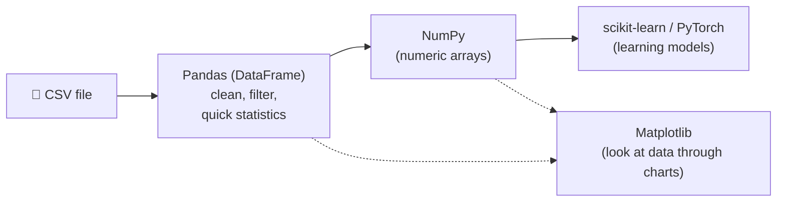

> **Learning objectives:** After this lesson, you will have a programming environment ready for AI (Google Colab is recommended - nothing to install), and you will be familiar with the basic "toolkit": Python, NumPy, Pandas, Matplotlib - through a mini house price dataset used throughout.

## 1. Why does the AI world favor Python?

You have the prices of a few houses and want the total. In Java, you write:

```java
double totalPrice = 0;
for (double price : housePrices) {
    totalPrice += price;
}
```

In Python:

```python
total_price = sum(house_prices)
```

One line instead of four. In Lesson 01, we agreed that machine learning is "programming with data" - and the language you will meet everywhere when *doing* that is **Python**. Three reasons:

**1. Compact syntax that reads like pseudocode.** No type declarations, no semicolons, no curly braces - Python code is usually shorter and closer to your train of thought. The "learning the language" barrier is lower as a result, so you can save your energy for the genuinely hard part: thinking about data and models.

**2. A huge ecosystem of libraries.** A **library** is a collection of pre-written code that you simply call and use - like buying pre-built kitchen cabinets instead of building every door yourself. The main stages of an AI project usually already have a library covering them: reading data (Pandas), computing on numeric arrays (NumPy), drawing charts (Matplotlib), training models (scikit-learn, PyTorch).

**3. Python code can be slow - but the heavy computation doesn't run in Python.** This point often surprises people. The heavy numerical operations inside NumPy or PyTorch are executed by optimized code written in C/C++ (and PyTorch can also run on GPUs). Python plays the role of a **control shell**: you issue commands in a few short lines, and the engine underneath runs high-speed code - the "glue language" pattern.

> ⚠️ **A small note:** "Glue" is only fast when you glue in the right place. If you write your own Python loop over each element instead of using the library's operations, that code will still be just as slow - which is why there is a "vectorization" technique in Section 4, where we will measure the difference with actual numbers.

<details>
<summary><strong>Aside: Python is not the snake (click to open)</strong></summary>

According to the official FAQ on python.org, Guido van Rossum - the creator of the language - was reading the published scripts of the BBC comedy series *Monty Python's Flying Circus* when he started writing Python, and wanted a name that was short, unique, and slightly mysterious. The language's name comes from the comedy show, not from the snake.

</details>

> 💡 **Quick takeaway:** Learning Python for AI does not mean you have to become a professional programmer. You need enough Python to *give orders to the libraries* - and that "enough" is lower than you think.

## 2. Setting up your environment: three paths

You saw the `sum(...)` line above - but where do you type it so it runs? There are three options, ranked from lightest to heaviest:

| Option | What to install? | Suited for |
|---|---|---|
| **Google Colab** (recommended) | Nothing - just a browser + a Google account | Beginners, weak machines, wanting to try right away |
| **Python + pip + Jupyter** on your machine | Install Python from python.org, use the `pip` command to install libraries | Comfortable with computers, want to work offline |
| **Miniconda / Anaconda** | Install conda - an environment and package manager | Running several projects in parallel, need isolated environments |

### 2.1. Jupyter Notebook - the data practitioner's "workbook"

All three paths above can share one very popular working interface: the **notebook**. Unlike a traditional code file (write everything, then run it all at once), a notebook is divided into **cells**:

```
┌────────────────────────────────────────────┐
│ [Text cell]  Note: today, analyzing        │
│              prices in District 7...       │
├────────────────────────────────────────────┤
│ [Code cell]  gia.mean()                    │
│ [Output]     3.3166...                     │
├────────────────────────────────────────────┤
│ [Code cell]  plt.scatter(dien_tich, gia)   │
│ [Output]     (the chart appears right here)│
└────────────────────────────────────────────┘
```

You run each cell, see the result immediately, edit, and run again - a great fit for the "explore the data while you think" style of machine learning work. Notebooks mix code, prose, formulas, and charts in a single document, so they are also a familiar format for sharing analyses. The book *Dive into Deep Learning* - one of the primary sources of this series - is written entirely as runnable notebooks.

A fun detail: the name **Jupyter** combines the three languages the project originally targeted - **Ju**lia, **Pyt**hon, and **R** - and also evokes the notebooks Galileo used to record the moons of Jupiter, according to the Project Jupyter team itself.

> ⚠️ **A small note:** With Python installed on your machine, you can still write `.py` script files or use an IDE as usual - the notebook is just an especially convenient option for exploring data, not a requirement.

### 2.2. Google Colab - up and running in 30 seconds

**Google Colab** (colab.research.google.com) is a notebook service that runs on Google's servers. For beginners, it is the most pleasant option because:

- **Nothing to install:** open a browser, sign in to your Google account, click "New notebook" - done.
- **There is a free tier**, which even includes limited **GPU** access - something you will need later when training neural networks.
- **Libraries pre-installed:** NumPy, Pandas, Matplotlib, scikit-learn, PyTorch... are all there; type `import` and it runs.
- Notebooks save straight to Google Drive and can be shared like Google Docs.

All the code in this series runs on Colab. Honest advice: **don't let installation hold you back** - open Colab and type along starting from this lesson.

### 2.3. Installing on your machine (when you are ready)

When you want to work offline or manage projects more seriously, you will set up an environment on your own machine. *Dive into Deep Learning* recommends **Miniconda** - a lightweight version of Anaconda - because it lets you create **virtual environments**: each project gets its own "box" of libraries, with no stepping on each other's toes.

<details>
<summary><strong>Going deeper: basic setup commands with conda (click to open)</strong></summary>

The procedure that *Dive into Deep Learning* walks through, condensed:

```bash
# 1. Download and install Miniconda from the conda homepage (pick the build for your OS)

# 2. Create a dedicated environment for learning AI
conda create --name hoc-ai python=3.11 -y

# 3. Activate the environment (repeat every time you open a new terminal window)
conda activate hoc-ai

# 4. Install the required libraries with pip
pip install numpy pandas matplotlib jupyter

# 5. Launch Jupyter Notebook - the browser will open automatically
jupyter notebook
```

`pip` is the package installer that ships with Python; `conda` both installs packages and manages environments. The two tools work together (create the environment with conda, install libraries with pip) - which is also how *Dive into Deep Learning* does it. When you need PyTorch, just `pip install torch` (GPU details will be discussed when we really need them, in the deep learning lessons).

</details>

## 3. The mini dataset: a house price table

Suppose you are house-hunting and have gathered information on **6 houses currently for sale**. This is the dataset we will use throughout this lesson (and meet again in Lesson 03) - small enough to compute by hand, so you can verify every number the machine returns:

| dien_tich (m²) | so_phong_ngu | cach_trung_tam (km) | gia (billion VND) |
|---:|---:|---:|---:|
| 30 | 1 | 5 | 1.8 |
| 45 | 2 | 3 | 2.6 |
| 60 | 2 | 7 | 3.0 |
| 80 | 3 | 2 | 5.1 |
| 100 | 3 | 10 | 4.5 |
| 55 | 2 | 4 | 2.9 |

Two natural questions come to mind: *how does floor area relate to price? Which house is a "bargain"?* - we will use NumPy, Pandas, and Matplotlib in turn to answer them.

> ⚠️ **A small note:** The figures are made-up examples for illustration, not real prices from any market.

## 4. NumPy - numeric arrays, the foundation of everything

The first question: *how much does each house cost per m²?* On paper, you have to do 6 divisions. With **NumPy** (Numerical Python), you write **one** division - it automatically applies to all 6 houses.

NumPy's central structure is the **`ndarray`** - an n-dimensional array holding numbers:

- A **1-dimensional** array = a sequence of numbers (for example, the prices of 6 houses) - called a **vector**.
- A **2-dimensional** array = a grid of numbers like a spreadsheet (6 rows × 3 columns) - called a **matrix**.
- 3 dimensions and up = a **tensor** (for example, a color image is a grid of height × width × 3 color channels).

NumPy's power lies in **vectorized computation**: operating on *the whole array at once*, with no need to write a loop over each element.

```python
import numpy as np

# Floor area (m²) and sale price (billion VND) of 6 houses
areas_m2 = np.array([30, 45, 60, 80, 100, 55])
prices = np.array([1.8, 2.6, 3.0, 5.1, 4.5, 2.9])

print(areas_m2.shape)   # (6,) - 1-dimensional array, 6 elements

# Compute price per m² for ALL 6 houses in one line - no loop needed
prices_per_m2 = prices / areas_m2 * 1000   # convert to million VND/m²
print(prices_per_m2.round(1))
# [60.  57.8 50.  63.8 45.  52.7]

# A few quick statistics
print(prices.mean())        # average price ≈ 3.32 billion
print(prices.max())         # most expensive house: 5.1 billion
print(prices_per_m2.argmin())  # 4 → the 5th house (index counts from 0) is the cheapest per m²
```

> 🔧 **Try it now:** Change `5.1` to `6.1` in the `prices` array and rerun `prices.mean()`. Answer: `3.4833...` - the total rises by exactly 1 billion, divided over 6 houses, so the mean rises by 1/6 ≈ 0.167. Change it back to `5.1`, then try `prices_per_m2.argmax()`: it gives `3`, i.e. the 4th house (80 m², 63.8 million/m²) is the most expensive per m².

Want to pack all 3 columns of information into one 2-dimensional array? This is exactly the shape data takes when it goes into an ML model:

```python
# Each row = 1 house; each column = 1 attribute
X = np.array([[30, 1, 5],
              [45, 2, 3],
              [60, 2, 7],
              [80, 3, 2],
              [100, 3, 10],
              [55, 2, 4]])
print(X.shape)     # (6, 3) - 6 samples, 3 numbers each
print(X[0])        # [30 1 5] - the first house
print(X[:, 0])     # [30 45 60 80 100 55] - the floor area column of all 6 houses
```

This `shape` of `(6, 3)` is something you will see again and again: **rows = samples, columns = features** - Lesson 03 will give them their official names.

### How fast is vectorization?

*Dive into Deep Learning* runs a small experiment: add two 10,000-element vectors with a Python `for` loop, then add them again with a single vectorized `+`. The authors' conclusion: vectorization is typically faster by **an order of magnitude** - that is, tens to hundreds of times. This is the real reason "Python is slow" is not a problem in AI: the heavy lifting has been pushed down into the library.

<details>
<summary><strong>Going deeper: measure it yourself on your machine (click to open)</strong></summary>

```python
import numpy as np, time

n = 10_000
a, b = np.ones(n), np.ones(n)

# Method 1: Python loop, adding element by element
c = np.zeros(n)
t = time.time()
for i in range(n):
    c[i] = a[i] + b[i]
print(f"loop      : {time.time() - t:.6f} seconds")

# Method 2: a single vectorized +
t = time.time()
d = a + b
print(f"vectorized: {time.time() - t:.6f} seconds")
```

The exact numbers depend on your machine, but method 2 is tens to hundreds of times faster than method 1. One more benefit the book emphasizes: pushing the arithmetic down into the library means you write fewer operations yourself, so there are fewer places to make mistakes.

</details>

Something worth knowing early: the tensor class in deep learning frameworks (such as PyTorch's `Tensor`) is used in a way very similar to NumPy's `ndarray`, plus two important capabilities: automatic differentiation (for training - Lesson 09 will make clear why) and running on GPUs. Many of the operations and ways of thinking you learn with NumPy today will carry over to PyTorch quite naturally.

## 5. Pandas - data tables with column names

Real data is rarely 6 clean numbers. It is usually an Excel or CSV file: with **column names**, numbers mixed with text, and sometimes... empty cells. NumPy is strong with numbers but has no place for column names - that is the home turf of **Pandas** with its **`DataFrame`** structure: picture it as an Excel spreadsheet living inside Python (Pandas is also built on top of NumPy).

```python
import pandas as pd

# Create a DataFrame from the 6-house data
houses = pd.DataFrame({
    "dien_tich":      [30, 45, 60, 80, 100, 55],       # m²
    "so_phong_ngu":   [1, 2, 2, 3, 3, 2],
    "cach_trung_tam": [5, 3, 7, 2, 10, 4],             # km
    "gia":            [1.8, 2.6, 3.0, 5.1, 4.5, 2.9],  # billion VND
})

print(houses.head())           # view the first few rows of the table
print(houses["gia"].mean())    # average of the "gia" column

# Filter by condition: houses under 3 billion AND no more than 5 km from the center
affordable_houses = houses[(houses["gia"] < 3.0) & (houses["cach_trung_tam"] <= 5)]
print(affordable_houses)              # exactly 3 houses: 30m², 45m², 55m²

# Group statistics: average price by number of bedrooms
print(houses.groupby("so_phong_ngu")["gia"].mean())
```

> 🔧 **Try it now:** Check the `groupby` result against the table in Section 3: the 1-bedroom group → `1.8`; 2 bedrooms → `2.8333` (= (2.6 + 3.0 + 2.9) / 3); 3 bedrooms → `4.8` (= (5.1 + 4.5) / 2). Then write `houses[houses["so_phong_ngu"] == 3]["gia"].mean()` yourself - it must give exactly `4.8`.

In practice, you rarely type data in by hand like this - the table usually lives in a **CSV** file (a text format with one record per line and columns separated by commas), and a single line `pd.read_csv("ten_file.csv")` loads it.

The "specialty" of real data: **missing values** - empty cells that Pandas displays as `NaN` (not a number). *Dive into Deep Learning* devotes a section to Pandas and jokingly calls them the "bed bugs" of data science: persistent and found everywhere. How to handle them (filling in estimated values, or dropping rows/columns) will be discussed in detail in **Lesson 12** - for now you only need to know they exist and that Pandas has tools to deal with them (for example `fillna`).

<details>
<summary><strong>Aside: pandas is not the bear (click to open)</strong></summary>

The library's name combines *panel data* - an econometrics term for tabular data that tracks the same group of subjects over multiple points in time - and is also a play on *Python data analysis*. Its author Wes McKinney started writing it in 2008 when he needed a flexible tool for analyzing financial data right inside Python.

</details>

## 6. Matplotlib - giving data a face

Looking at the 6-row table in Section 3, can you immediately spot which house is the "odd one out"? Hard. Plot it and you see it in a second. **Matplotlib** is the long-standing and widely used charting library in the Python ecosystem.

```python
import matplotlib.pyplot as plt

# Scatter plot: each house is one dot
plt.scatter(houses["dien_tich"], houses["gia"])
plt.xlabel("Area (m2)")
plt.ylabel("Price (billion VND)")
plt.title("Area vs Price - 6 mini houses")
plt.grid(True)
plt.show()   # in a notebook, the chart appears right below the code cell
```

Run this and you will see the dots rising gradually as floor area increases - the intuition "bigger houses cost more" appears as a picture. But one dot is the "odd one out": the 100 m² house 10 km from the center costs only 4.5 billion, less than the 80 m² house near the center.

The chart both confirms the pattern and exposes the exception - exactly the kind of clue an ML practitioner needs: *price depends not only on floor area, but also on location*. **Looking at the data with your own eyes before modeling** is a habit that good introductory materials drill into you from the start, and Matplotlib is the tool for that habit.

> ⚠️ **A small note:** The chart labels are deliberately written in plain, unaccented text: Matplotlib's default font sometimes lacks accented Vietnamese characters. The thorough fix is to install a suitable font; for beginners, writing without diacritics is a safe shortcut.

## 7. scikit-learn and PyTorch - two names we will meet again

The toolkit has two more important items that this series *deliberately* holds off on teaching:

| Library | Role | You will meet it in |
|---|---|---|
| **scikit-learn** | "Classical" machine learning: linear regression (the very plumber problem from Lesson 01), decision trees, clustering... - a uniform interface in the style of `model.fit(X, y)` then `model.predict(X)` | From Lessons 04-05 onward, when learning about training and the types of problems |
| **PyTorch** | Deep learning: building and training neural networks, automatic differentiation (to know which "knob" to turn), running on GPUs | The lessons on gradients (Lessons 09-11) and after |

The only thing to remember today: both take **NumPy-style numeric arrays** (or tensors very similar to NumPy) as input. Everything you just learned - `shape`, rows-as-samples-columns-as-features, how to convert a DataFrame into a numeric array - is the common language for "talking" to them. (Converting a Pandas table into a NumPy array only takes `houses.to_numpy()` - the result has `shape` `(6, 4)`: 6 houses, 4 columns.)

The journey of data through the toolkit:



## Lesson summary

- **Python** is widely used in AI thanks to its readable syntax, rich library ecosystem, and its role as the "control shell" for high-speed computational blocks written in C/C++.
- Beginners should start with **Google Colab**: browser-based notebooks, a free tier, pre-installed libraries. When you need to work on your own machine, use **Miniconda** to create environments + **pip** to install libraries.
- **Jupyter Notebook** splits code into cells, showing results as you go - a great fit for data exploration work.
- **NumPy** provides `ndarray` - multi-dimensional numeric arrays with vectorized computation (tens to hundreds of times faster than Python loops); a `shape` like `(6, 3)` means 6 rows (samples) × 3 columns (attributes). PyTorch's tensors are designed to be very similar to `ndarray`.
- **Pandas** provides `DataFrame` - data tables with column names: reading CSV, filtering, group statistics, and facing missing values (`NaN`).
- **Matplotlib** draws charts - the habit of "looking at the data with your eyes" helps you spot both patterns and exceptions before modeling.
- **scikit-learn** (classical ML) and **PyTorch** (deep learning) will appear in later lessons; both "eat" numeric arrays as input.

## Self-check questions

1. Why is Python code usually considered slow, yet AI models written in Python still run fast? Keyword: "control shell".
2. You are advising a friend who is new to AI and has a weak computer: which way should they set up their environment? Give 2 reasons.
3. A NumPy array has `shape` `(150, 4)`. How many samples does this array have, and how many numbers per sample? Write the command that extracts the first column of all the samples.
4. Using the `houses` DataFrame from this lesson, write (or describe) the line that filters for houses with at least 2 bedrooms and floor area over 50 m². Check against the table: which houses are in the result?
5. What does `NaN` in Pandas mean, and why does real-world data often contain it? (Hint: think of a survey form where the respondent leaves a few fields blank.)
6. Name the correct role of each library in the chain: CSV file → clean and filter → convert to numeric array → draw charts → train a model.

## Further reading

**Primary sources for this lesson:**

| Source | Which part to read |
|---|---|
| **Dive into Deep Learning (d2l.ai)** | The *Installation* section (installing Miniconda, conda environments, Jupyter); Section 2.1 *Data Manipulation* (tensor/ndarray, shape, reshape, indexing); Section 2.2 *Data Preprocessing* (Pandas, reading CSV, missing values, converting DataFrame to tensor); Section 3.1 *Linear Regression* - the *Vectorization for Speed* part (the experiment timing loops vs. vectorization) |

**Additional free online sources:**

- [Google Colab](https://colab.research.google.com/) - open a notebook that runs right in the browser, no installation; see also the introduction page [colab.google](https://colab.google/).
- [NumPy: the absolute basics for beginners](https://numpy.org/doc/stable/user/absolute_beginners.html) - NumPy's official documentation written specifically for newcomers.
- [10 minutes to pandas](https://pandas.pydata.org/docs/user_guide/10min.html) - the official quick tour of commonly used Pandas operations.
- [Matplotlib Quick start guide](https://matplotlib.org/stable/users/explain/quick_start.html) - Matplotlib's official getting-started guide.
- [Miniconda download page](https://docs.conda.io/en/latest/miniconda.html) - for when you are ready to set up an environment on your machine.
- [Python FAQ: Why is it called Python?](https://docs.python.org/3/faq/general.html#why-is-it-called-python) - the official answer about the name Python.

> **Next lesson:** [From Data to Features, Labels & Predictions](../from-data-to-features-labels-predictions/) - today's mini house price table will be "named" in the language of machine learning - samples, features, labels, X and y - and you will understand the fundamental relationship $Y = f(X) + \varepsilon$ that supervised learning models revolve around.
