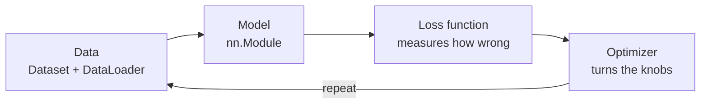

> **Learning objectives:** After this lesson, you will be able to write a neural network training program that runs from start to finish on real data, understand the five lines of code that make up the training loop, and clearly separate the two modes beginners often mix up - learning and prediction.

## 1. Four pieces, and all of them are old lessons

The last four lessons built everything you need; it just has not been assembled yet. A training program has exactly four pieces:



You have met the last three pieces: the **model** is the neuron layers of lessons 02-03, the **loss function** is the cross-entropy of Foundations · Lesson 10, and the **optimization algorithm** is the gradient descent of Foundations · Lesson 11. The remaining piece is how to feed data in, batch by batch.

```python
import torch
from torch import nn
from torch.utils.data import DataLoader
from torchvision import datasets, transforms

train_set = datasets.FashionMNIST("data", train=True,  download=True,
                                  transform=transforms.ToTensor())
val_set   = datasets.FashionMNIST("data", train=False, download=True,
                                  transform=transforms.ToTensor())
train_dl = DataLoader(train_set, batch_size=256, shuffle=True)
val_dl   = DataLoader(val_set,   batch_size=1000)
```

A `Dataset` knows how to fetch sample $i$; a `DataLoader` groups samples into batches and shuffles them every epoch. With 60,000 images and a batch of 256, each epoch has **235 batches**, each batch a tensor of shape `(256, 1, 28, 28)` - 256 images, 1 color channel (grayscale), 28×28 pixels.

> ⚠️ **Why those 10,000 images are called validation.** `train=False` returns the set that FashionMNIST names *test*. But the name of a file does not decide its role - **how you use it** does. From lesson 01 through lesson 11, we keep looking at these 10,000 images to diagnose problems, compare architectures, choose learning rates, and see which techniques pay off. That is exactly the role of a **validation** set, so this series calls it by that name.
>
> The consequence has to be stated right away: a set that has been looked at this many times **can no longer serve as the final reported number** - it has worn out, in exactly the sense Foundations · Lesson 04 describes. That is why lesson 12, the real project, starts again from the original data: it does not touch these 10,000 images but makes its own three-way split, and holds back a part as the test set until the final evaluation step.

`shuffle=True` is set only for the training set, not for validation. The reason is what Machine Learning · Lesson 07 said when discussing the bootstrap: the order of the data affects the path of gradient descent, so shuffling every epoch makes the batches differ between passes. The validation set is only read for scoring, so order does not matter.

```python
model = nn.Sequential(nn.Flatten(),
                      nn.Linear(784, 256), nn.ReLU(),
                      nn.Linear(256, 10))          # 203,530 parameters
lossf = nn.CrossEntropyLoss()
opt   = torch.optim.SGD(model.parameters(), lr=0.1)
```

`nn.Flatten()` unrolls a 28×28 image into a 784-dimensional vector. The last layer is a bare `nn.Linear` with no softmax - exactly the warning from lesson 02, since `CrossEntropyLoss` already contains softmax internally.

## 2. Five lines that make learning happen

This is the heart of every deep learning program, and it is surprisingly short:

```python
for epoch in range(1, 11):
    model.train()
    for xb, yb in train_dl:
        opt.zero_grad()            # 1. clear the previous iteration's gradients
        loss = lossf(model(xb), yb)   # 2. forward pass: predict, then measure the error
        loss.backward()            # 3. backward pass: gradients for every parameter
        opt.step()                 # 4. turn the knobs along the gradient
```

Four lines, repeated 235 times per epoch. Reread them in the language of the earlier lessons:

| Line | What it does | Lesson where you learned it |
|---|---|---|
| `opt.zero_grad()` | Clears the old `.grad`, because PyTorch accumulates gradients | Lesson 04 |
| `model(xb)` | Forward pass, building the computational graph as it computes | Lesson 04 |
| `lossf(..., yb)` | Measures the distance between predictions and labels | Foundations · Lesson 10 |
| `loss.backward()` | Walks the graph backward, computing gradients for all 203,530 parameters | Lesson 04 |
| `opt.step()` | Each parameter takes one step against the gradient | Foundations · Lesson 11 |

Nothing here is new. The only new thing is the **order** - and get that order wrong in one place and everything breaks. Forget `zero_grad()` and the gradients of the batches pile up on each other; put `backward()` after `step()` and you update with the previous batch's gradients.

A real run, 10 epochs, about 3.6 seconds per epoch on CPU:

> ⚠️ **About the timing numbers throughout this chapter.** Every seconds/minutes figure in this series was measured on a machine with 8 CPU cores, 15 GB of RAM, **no GPU**, with PyTorch 2.14 running 4 threads. Your machine will almost certainly give different numbers - a few times faster or slower is normal, and with a GPU the gap is much larger still. What is worth taking away is **the ratio between rows in the same table** (how many times more expensive this model is than that one), because those ratios are fairly stable across machines; the absolute numbers are not. The accuracy numbers are the opposite - they are reproducible, as long as you keep the same seed and library versions.

| Epoch | 1 | 3 | 5 | 7 | 10 |
|---|---|---|---|---|---|
| train loss | 0.8654 | 0.4960 | 0.4416 | 0.4071 | 0.3753 |
| validation accuracy | 0.7877 | 0.8212 | 0.8318 | 0.8222 | **0.8528** |

Training loss falls steadily - the model is learning. Validation accuracy bobs up and down: 0.8318 at epoch 5, dropping to 0.8222 at epoch 7, then up to 0.8528 at epoch 10. That bobbing is normal, and lesson 06 spends a whole lesson reading it.

> 🔧 **Try it now:** in the table above, epoch 7 has a *lower* training loss than epoch 5 but a *worse* validation accuracy. Is that a sign of overfitting?
> You cannot conclude that yet. Overfitting is when training loss keeps falling while quality on unseen data **gets worse as a trend** (Foundations · Lesson 14). Here epoch 10 is the best in the table, so a single dip at epoch 7 is just fluctuation - mini-batch gradient descent is inherently noisy, and each epoch the model stops at a slightly different spot on the loss landscape. To draw a conclusion you have to look at the trend across many epochs, not at one point.

## 3. Two modes: learning and prediction

This is where beginners stumble most, so it gets its own section.

A trained model lives in two different modes:

```
   TRAINING                              INFERENCE
   data → model → loss                   data → model → prediction
                        ↓                              ↑
                    backward                      forward pass only
                        ↓                      no loss, no gradient
                 update parameters                parameters stay fixed
```

It sounds obvious, but there is a detail that is not obvious at all: **some layers behave differently in the two modes**. Dropout (lesson 07) randomly switches off some neurons *during training* but must use all neurons *during prediction*. Batch normalization (lesson 08) uses the statistics of the current batch during training but the accumulated running statistics during prediction.

PyTorch cannot guess which mode you are in. You have to tell it:

```python
model.train()   # switch to training mode
model.eval()    # switch to inference mode
```

The consequence of forgetting can be measured in numbers. Take a network with `nn.Dropout(0.5)`, train it for 3 epochs, then pass **the same image** through it several times:

```
train() mode:    logits of first 3 classes = [-3.030  -3.696  -2.315]
                 logits of first 3 classes = [-3.305  -6.657  -3.564]   ← different!
                 logits of first 3 classes = [-2.634  -3.875  -2.169]

eval() mode:     logits of first 3 classes = [-3.283  -3.785  -2.854]
                 logits of first 3 classes = [-3.283  -3.785  -2.854]   ← always the same
```

In `train()` mode, the same image gives a different result every time, because dropout randomly picks which neurons to switch off. A prediction system that gives different answers to the same input is unusable.

Measured on the whole validation set:

| Mode during evaluation | Accuracy |
|---|---|
| `model.train()` (forgot to switch) | 0.7965 |
| `model.eval()` (correct) | **0.8100** |

A loss of 1.35 points just for one missing line. And this is the worst kind of bug: the program runs smoothly, raises no error, and simply gives results below what the model can really do, without you knowing why.

> ⚠️ **A small note:** `model.eval()` and `torch.no_grad()` are **two different things**, and they are often confused. `model.eval()` changes *the behavior of layers* such as dropout and batch norm. `torch.no_grad()` tells PyTorch *not to build the computational graph*, saving memory (lesson 04). During evaluation you need both, and neither replaces the other: turn on `no_grad()` but forget `eval()` and dropout is still active.

## 4. An evaluation function, written once and used all chapter

Combine both of the above into one function you can reuse in every later lesson:

```python
@torch.no_grad()                       # do not build the graph
def evaluate(model, dl):
    model.eval()                       # switch dropout / batch norm behavior
    correct = total = 0
    total_loss = 0.0
    for xb, yb in dl:
        out = model(xb)
        total_loss += lossf(out, yb).item() * len(yb)
        correct += (out.argmax(1) == yb).sum().item()
        total += len(yb)
    return total_loss / total, correct / total
```

Three details worth noting:

- `out.argmax(1)` takes the index of the class with the highest score. No softmax needed - softmax does not change the ordering, so the class with the largest logit is also the class with the largest probability. Only when you need *probabilities* for reporting or for choosing a threshold (Machine Learning · Lesson 12) do you apply softmax.
- Multiply by `len(yb)` when adding up the loss because the last batch is usually shorter than the others; dividing the sum by the total number of samples gives the correct average.
- `.item()` pulls the Python number out of the tensor. If you accumulate tensors and forget `.item()`, you inadvertently keep the computational graph of every batch in memory - a very effective way to run out of RAM.

## Lesson summary

- A training program has four pieces: data (`Dataset` + `DataLoader`), model (`nn.Module`), loss function, and optimization algorithm. The last three were covered in Foundations and the earlier lessons.
- The training loop is four lines repeated: `zero_grad()` → forward pass and loss → `backward()` → `step()`. The wrong order or a missing line breaks it, usually without any error message.
- FashionMNIST with a batch of 256 gives 235 batches per epoch, about 3.6 seconds per epoch on CPU; after 10 epochs the one-hidden-layer network reaches 0.8528 accuracy.
- Validation accuracy bobbing between epochs is normal with mini-batches; you have to look at the trend over many epochs before concluding anything.
- Training and inference are two different modes, and some layers behave differently in each. Forgetting `model.eval()` makes the same image give a different result every time, and drops accuracy from 0.8100 to 0.7965.
- `model.eval()` changes layer behavior; `torch.no_grad()` saves memory. You need both during evaluation, and neither replaces the other.

## Self-check questions

1. Rewrite the four lines of the training loop from memory, with one sentence explaining each line.
2. What happens if you change the order to `loss.backward()`, then `opt.zero_grad()`, then `opt.step()`?
3. Why set `shuffle=True` for the training set but not for the validation set?
4. Your network has dropout. You forget to call `model.eval()` before evaluating. Name two symptoms you will observe.
5. How do `model.eval()` and `torch.no_grad()` differ? What do you lose if you use one and forget the other?
6. In the `evaluate` function, why multiply by `len(yb)` when accumulating the loss instead of taking a simple average over the batches?

## Further reading

**Core sources for this lesson:**

| Source | What to read |
|---|---|
| **Dive into Deep Learning (d2l.ai)** | Chapter 3.4 - a training loop written from scratch; chapter 4.2 *The Image Classification Dataset* - the very FashionMNIST dataset used in this lesson; chapter 5.2 - a concise MLP implementation with the high-level API |
| **Foundations · Lessons 10, 11** | Loss functions and optimization algorithms - two of the four pieces in section 1 |
| **Machine Learning · Lesson 01** | The workflow of a project: define the problem, split the data, compare against a baseline - still fully valid for deep learning |

**Additional online sources (free):**

- [PyTorch - Quickstart](https://pytorch.org/tutorials/beginner/basics/quickstart_tutorial.html) - the official tutorial, which runs on the same FashionMNIST dataset as this lesson.
- [`torch.utils.data` - documentation](https://pytorch.org/docs/stable/data.html) - `Dataset`, `DataLoader`, `num_workers` and how to write your own Dataset.
- [`Module.train` / `Module.eval` - documentation](https://pytorch.org/docs/stable/generated/torch.nn.Module.html#torch.nn.Module.eval) - the list of layers that actually change behavior between the two modes.
- [PyTorch Recipes - Saving and loading models](https://pytorch.org/tutorials/beginner/saving_loading_models.html) - `state_dict`, and why you must call `eval()` after loading a model.

> **Next lesson:** [Reading Training Curves](../reading-training-curves/) - this lesson trains a model and looks at the final number. The next lesson looks at the whole journey - six runs with six different ailments, and how to diagnose each one from just two curves.
