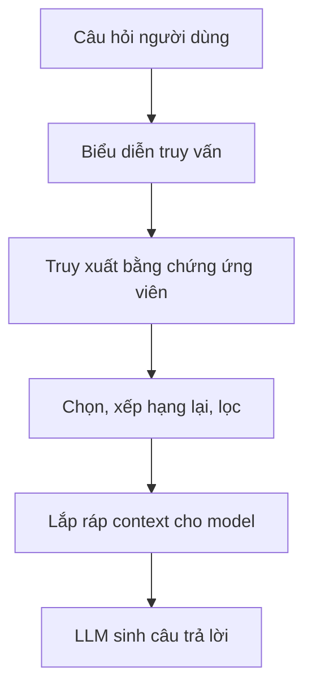

Retrieval-augmented generation (RAG) cho model ngôn ngữ tiếp cận bằng chứng bên ngoài ngay lúc inference.

Ý quan trọng không phải "đưa tài liệu vào vector database". Ý quan trọng là **tạo đúng context bằng chứng cho câu hỏi hiện tại**.

## Vòng lặp RAG tối thiểu

Mỗi mũi tên đều có thể lỗi theo cách riêng.

## Retrieval giải bài toán khác generation

Model sinh giỏi tổng hợp ngôn ngữ từ context sẵn có. Không nên kỳ vọng nó tái hiện đáng tin cậy kiến thức riêng tư, luôn thay đổi hoặc rất đặc thù chỉ từ các tham số đã học.

Retrieval cung cấp thông tin bên ngoài liên quan vào lúc cần.

Sự phân tách này cải thiện độ mới của thông tin, khả năng truy nguồn và mức kiểm soát.

## Chunking quyết định đơn vị truy xuất

Tài liệu thường được chia thành các **chunk** trước khi lập chỉ mục. Cách chia quyết định retriever có thể trả về phần nào như một đơn vị.

Chunk quá nhỏ:

- context có thể mất các mối liên hệ;
- câu trả lời cần thông tin nằm rải ở nhiều chunk.

Chunk quá lớn:

- retrieval kém chính xác hơn;
- lãng phí ngân sách context;
- một câu liên quan kéo theo nhiều đoạn không liên quan.

Nên chia chunk theo cấu trúc tài liệu và loại câu hỏi cần truy xuất, không chỉ theo một con số token tùy ý.

## Dense retrieval không phải lúc nào cũng đủ

Embedding nắm bắt tương đồng ngữ nghĩa tốt, nhưng mã định danh chính xác, thuật ngữ hiếm và mã sản phẩm có thể phù hợp hơn với tìm kiếm theo từ.

Hệ thống thực tế thường kết hợp:

- lọc theo metadata;
- BM25 hoặc tìm kiếm từ khóa;
- dense vector retrieval;
- reranking;
- mở rộng theo quan hệ giữa các thực thể.

Nên chọn các lớp này dựa trên lỗi retrieval quan sát được.

## Chất lượng retrieval khác chất lượng câu trả lời

Hệ thống có thể truy xuất đúng tài liệu nhưng model lại bỏ qua hoặc hiểu sai. Ngược lại, một câu trả lời trôi chảy vẫn có thể thiếu bằng chứng.

Ít nhất cần đánh giá hai lớp:

1. Retrieval có tìm được bằng chứng cần thiết không?
2. Generation có dùng bằng chứng đó đúng cách không?

Gộp cả hai vào một điểm đạt/trượt khiến việc tìm nguyên nhân khó hơn.

## RAG là một phần của context engineering

Prompt cuối thường chứa nhiều thứ hơn các chunk được tìm thấy:

- chỉ dẫn hệ thống;
- yêu cầu của người dùng;
- state của hội thoại;
- tài liệu truy xuất;
- kết quả tool;
- metadata có cấu trúc.

Vì vậy, RAG là một phần của kiến trúc context rộng hơn. Retrieval chỉ có giá trị nếu bằng chứng được chọn đi vào model dưới dạng model có thể sử dụng.

## Những kiểu lỗi thường gặp

RAG thường thất bại do:

- hiểu sai truy vấn;
- thiếu bộ lọc metadata;
- ranh giới chunk không hợp lý;
- top-k quá nhỏ hoặc quá lớn;
- embedding không hợp với ngôn ngữ của lĩnh vực;
- chỉ mục chưa được cập nhật;
- reranking yếu;
- bằng chứng truy xuất mâu thuẫn;
- model trả lời vượt quá những gì bằng chứng hỗ trợ.

Vector database hiếm khi là toàn bộ câu chuyện.

## Cách hình dung bền vững

RAG là một **pipeline bằng chứng**.

Hãy xem retrieval, chọn lọc, lắp ráp context và generation là những bước riêng, có trace và evaluation riêng. Khi đó, việc cải thiện RAG sẽ có hệ thống hơn nhiều.
