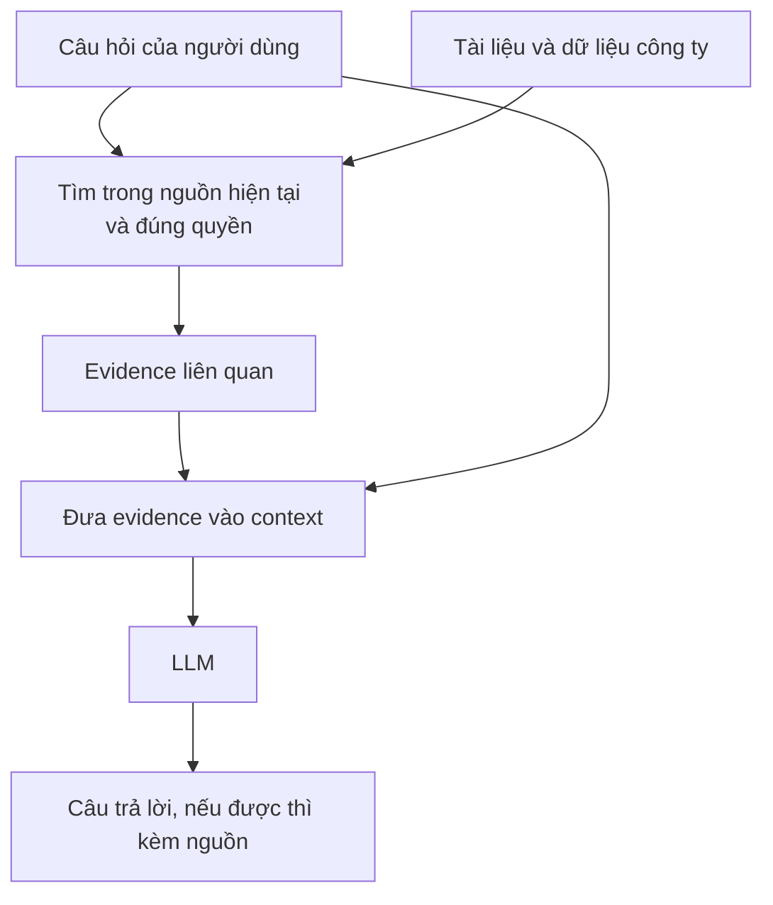
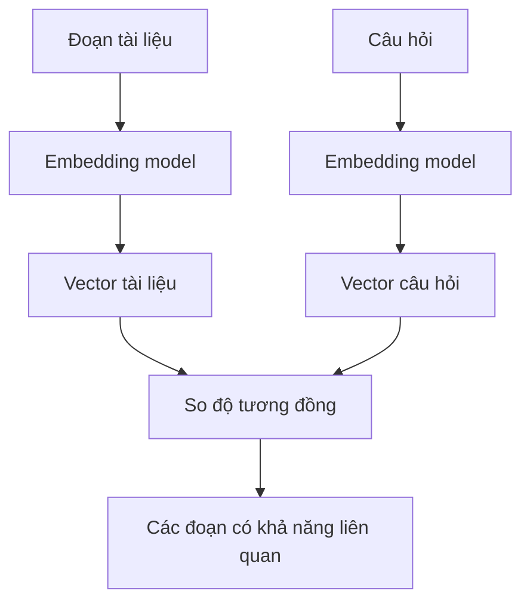
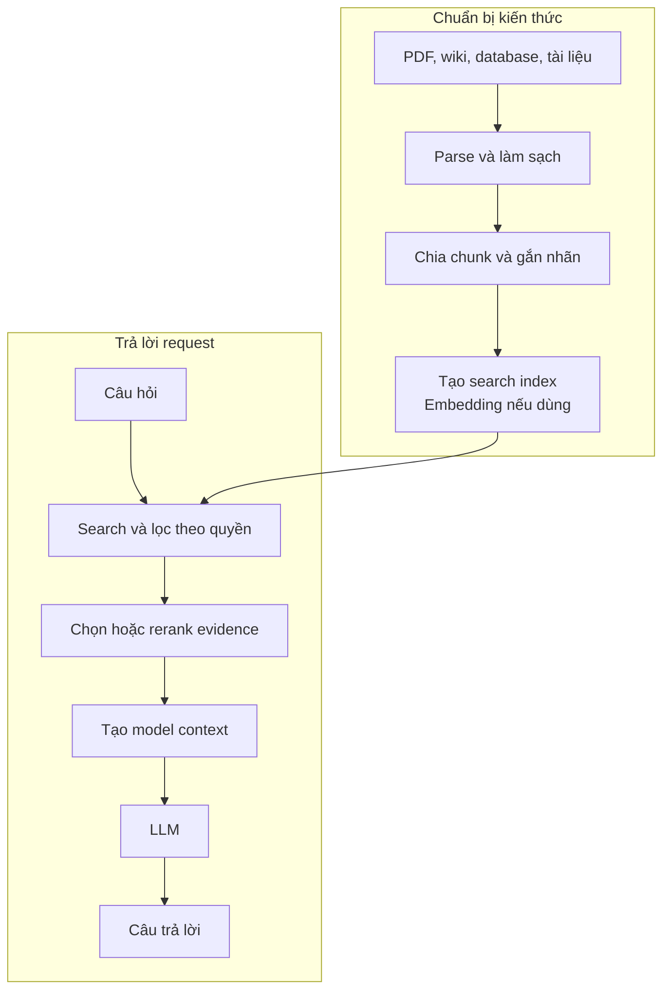

Giả sử bạn tuyển được một chuyên gia đọc rất nhiều, viết tốt và reasoning giỏi. Ngày đầu tiên đi làm, bạn hỏi: "Chính sách làm việc từ xa mới nhất của công ty mình là gì?" Người đó không trả lời được. Không phải vì họ thiếu thông minh, mà vì họ chưa từng đọc policy nội bộ.

Bạn hỏi tiếp doanh thu cửa hàng Hà Nội giảm bao nhiêu tháng trước. Vấn đề còn rõ hơn: dữ liệu nằm trong hệ thống doanh nghiệp, không nằm sẵn trong đầu người chuyên gia.

LLM gặp giới hạn tương tự. **RAG không bắt đầu từ vector database. Nó bắt đầu từ khoảng cách giữa khả năng suy luận về thông tin và việc có đúng thông tin để suy luận.**

Ở [bài trước](../production-ai-chatbot-request-vi/), chúng ta theo chân một request của chatbot và lướt qua chiếc hộp tên "retrieval". Bài này giải thích vì sao chiếc hộp ấy tồn tại.

## 1. Model được train không phải tủ hồ sơ có thể tìm kiếm

Trong quá trình training, model học các pattern, mối quan hệ và nhiều kiến thức hữu ích. Nó có thể giải thích Transformer hoặc giúp viết hàm Python. Nhưng kiến thức của nó không được sắp như những file có thể mở đúng lúc, chẳng hạn `current_policy.pdf` hay `last_month_revenue.csv`.

Kiến thức đã học được mã hóa trong các parameter. Điều đó rất mạnh, nhưng không cho model một thao tác kiểu database để tìm đúng bản ghi hiện tại rồi chỉ rõ câu trả lời lấy từ đâu.

[Paper RAG gốc của Lewis và cộng sự](https://arxiv.org/abs/2005.11401) nêu khó khăn của việc cập nhật kiến thức và cung cấp provenance khi chỉ dựa vào parameter. Họ kết hợp tri thức *parametric* trong model với nguồn tri thức *non-parametric* bên ngoài có thể truy xuất.

Ý tưởng cốt lõi rất đơn giản: **để model dùng những gì nó đã học, đồng thời cho nó cách tra cứu những gì nó chưa có.**

## 2. Thông tin mới và thông tin riêng nằm ngoài model

"CEO hiện tại là ai?" và "Giá sản phẩm này bây giờ bao nhiêu?" là câu hỏi phụ thuộc thời điểm. "Policy nghỉ phép của công ty nói gì?" hay "Đơn hàng 123 đang ở đâu?" còn có thể phụ thuộc dữ liệu riêng mà model chưa từng thấy.

Training không cập nhật parameter mỗi khi một policy thay đổi. Train lại model chỉ để phản ánh tài liệu vừa sửa sáng nay thường không phải cách phù hợp. Retrieval cho ta một đường khác:

Ứng dụng đưa đúng policy hoặc bản ghi cho model *vào lúc người dùng hỏi*. Cách này đặc biệt hữu ích với kiến thức mới, chuyên biệt hoặc riêng tư. Nhưng không có nghĩa mọi dữ liệu riêng đều nên được chép vào search index; quyền truy cập vẫn phải được kiểm soát.

## 3. Sao không nhét toàn bộ tài liệu vào prompt?

Nếu toàn bộ knowledge base chỉ là một handbook ngắn và vừa đủ trong context model có thể sử dụng, bạn có thể không cần retrieval. Gửi tài liệu cùng câu hỏi rồi kiểm tra kết quả. [Anthropic cũng lưu ý](https://www.anthropic.com/engineering/contextual-retrieval) rằng đôi khi có thể đưa trọn một knowledge base đủ nhỏ vào prompt.

Khi kho tài liệu lớn dần từ vài trang lên hàng nghìn document, bài toán thay đổi. Người dùng hỏi một câu về nhân viên thử việc được làm việc từ xa không. Có thể chỉ hai đoạn trong cả kho là liên quan. Gửi hàng nghìn trang không liên quan sẽ tốn thời gian, token và có thể làm model mất tập trung.

Retrieval lọc trước khi generate:

> **Kho tài liệu lớn → tìm evidence có khả năng liên quan → đưa phần context gọn vào model → trả lời.**

Context window lớn hơn không biến tài liệu không liên quan thành hữu ích. Nó cũng không thay thế việc quyết định người dùng được quyền đọc tài liệu nào.

## 4. Ba bước của RAG: tìm, bổ sung, tạo câu trả lời

**Retrieval-Augmented Generation** là một pattern, không phải tên của một loại database:

1. **Retrieve:** tìm thông tin liên quan tới câu hỏi.
2. **Augment:** bổ sung thông tin ấy vào context của model.
3. **Generate:** để model trả lời dựa trên context đã có.

Giả sử câu hỏi là "Nhân viên thử việc được nghỉ phép bao nhiêu ngày?" Thay vì bắt model đoán, ứng dụng có thể tìm mục 4.2 của employee handbook hiện tại rồi gửi đoạn đó cùng câu hỏi. Lúc này model có evidence ngay trước mắt.

Đó là trực giác quan trọng nhất. RAG cho model tiếp cận nguồn liên quan lúc inference. Nó **không** bảo đảm retriever tìm đúng nguồn hay model hiểu đúng nguồn đó.

## 5. RAG và fine-tuning giải những vấn đề khác nhau

"Tại sao không fine-tune model bằng handbook?" là câu hỏi rất hợp lý. Nhưng fine-tuning và RAG thường giải hai giới hạn chính khác nhau:

| Câu hỏi | Điểm xuất phát trực tiếp hơn |
| --- | --- |
| "Policy mới nhất nói gì?" | Retrieve policy hiện tại |
| "Model có luôn tuân thủ format hoặc phong cách công việc không?" | Cải thiện instructions và evals; cân nhắc fine-tuning |
| "Cần cả dữ liệu mới lẫn hành vi làm task ổn định?" | Có thể kết hợp hai cách |

Fine-tuning điều chỉnh behavior hoặc khả năng thực hiện một task. RAG thay đổi thông tin model được nhìn thấy *cho câu trả lời này*. Nếu policy đổi hàng tuần, cập nhật nguồn và index thường linh hoạt hơn việc train một model mới mỗi lần. [AWS so sánh](https://docs.aws.amazon.com/prescriptive-guidance/latest/retrieval-augmented-generation-options/rag-vs-fine-tuning.html) hai cách và lưu ý chúng có thể dùng cùng nhau.

Vấn đề không phải "RAG và fine-tuning, ai thắng?" Câu hỏi đúng hơn là **"Hệ thống thất bại vì thiếu kiến thức, làm task chưa tốt, hay cả hai?"**

## 6. RAG không đồng nghĩa vector database

Vector database là một cách hỗ trợ retrieval. Nó không phải định nghĩa của RAG.

Giả sử tài liệu viết "Nhân viên có thể làm việc ngoài văn phòng tối đa hai ngày mỗi tuần", còn người dùng hỏi "Một tuần tôi được WFH mấy hôm?" Hai câu dùng từ khác nhau nhưng gần nhau về nghĩa. Embedding model có thể biến đoạn tài liệu và câu hỏi thành các vector để semantic search có cơ hội nhận ra sự liên quan ấy.

Nhưng chuỗi chính xác như mã đơn hàng, mã sản phẩm hoặc error ID có thể phù hợp hơn với keyword matching. Retrieval có thể dùng semantic search, keyword search, SQL, metadata filter, API hoặc kết hợp nhiều phương pháp. [Tài liệu Retrieval của OpenAI](https://developers.openai.com/api/docs/guides/retrieval) có hybrid search kết hợp tín hiệu semantic và textual; [Anthropic giải thích](https://www.anthropic.com/engineering/contextual-retrieval) vì sao phương pháp khớp từ như BM25 có thể bổ sung cho embedding.

Có vector database nghĩa là bạn có nơi lưu và tìm vector. Nó chưa chứng minh RAG system sẽ lấy đúng evidence.

## 7. Retrieve sai vẫn có thể tạo câu trả lời sai rất mượt

Luồng lý tưởng là "câu hỏi → nguồn liên quan → model → câu trả lời đúng". Giờ thay nguồn liên quan bằng nguồn sai.

Người dùng hỏi policy nghỉ phép năm 2026. Retriever trả về policy năm 2024. Model có thể viết một câu trả lời trôi chảy, dựa trên *tài liệu sai*. RAG không loại bỏ hallucination hay dữ liệu cũ bằng phép thuật; nó thêm một phần hệ thống mà ta phải đánh giá.

Retrieval có thể lỗi vì tài liệu chưa được index, chunk mất ngữ cảnh, mã chính xác không được tìm thấy, query mơ hồ, filter loại nhầm tài liệu, reranker xếp sai hoặc bản cũ vẫn còn trong kho.

Vì vậy production RAG cần ít nhất hai câu hỏi:

- **Retrieval quality:** Ta có lấy đúng evidence, còn mới và đúng quyền không?
- **Answer quality:** Có evidence đó rồi, model có trả lời đúng và biết nói khi chưa chắc không?

[Hướng dẫn tối ưu accuracy của OpenAI](https://developers.openai.com/api/docs/guides/optimizing-llm-accuracy) cũng tách hai lỗi này: model có thể nhận context sai hoặc nhiễu, hoặc nhận context đúng nhưng sử dụng sai. Muốn debug phải biết lỗi bắt đầu ở phía nào.

## 8. Chunking quyết định search có thể tìm thấy gì

Giả sử đoạn liên quan nằm ở trang 172 của một PDF 300 trang. Nếu search chỉ trả về cả file PDF, model vẫn chưa được giúp nhiều. RAG system thường chia tài liệu thành các *chunk* nhỏ hơn để có thể tìm đúng đoạn gần câu trả lời.

Nhưng kích thước chunk là một trade-off. Chunk quá lớn mang nhiều noise. Chunk quá nhỏ có thể mất heading, tên công ty, ngày tháng hoặc câu phía trước giúp hiểu nó.

[Anthropic đưa ra ví dụ](https://www.anthropic.com/engineering/contextual-retrieval): một chunk nói doanh thu tăng 3% có thể vô dụng nếu thiếu tên công ty và quý được nhắc trong phần tài liệu xung quanh. Giải pháp không đơn giản là "chunk nào cũng làm thật lớn", mà là giữ đủ ngữ cảnh mà vẫn tìm kiếm chính xác.

Ranh giới chunk, metadata, phần chồng lấp và đôi khi cả reranking đều ảnh hưởng tới việc model có nhận được đúng evidence không.

## 9. RAG có đường chuẩn bị dữ liệu và đường trả lời

Trước khi người dùng hỏi, tài liệu đã phải được chuẩn bị để tìm kiếm. Một hệ thống thực tế có hai luồng liên kết với nhau:

Đây là cách tách **ingestion** và **serving** trong [kiến trúc RAG của Google Cloud](https://docs.cloud.google.com/architecture/rag-genai-gemini-enterprise-vertexai?hl=en). Parser hay embedding job thường nằm ở đường chuẩn bị; retriever, reranker và prompt builder nằm ở đường phục vụ request. Lỗi ở bên nào cũng có thể làm câu trả lời cuối cùng sai.

## 10. Khi nào *không* nên dùng RAG?

Nhiều component hơn không tự động tốt hơn:

- Viết lại email không cần kiến thức bên ngoài. Một model call trực tiếp có thể đủ.
- Hỏi trên một tài liệu nhỏ có sẵn có thể đơn giản hơn nếu đưa cả tài liệu vào context.
- Lấy số dư tài khoản hiện tại có thể phù hợp hơn với database query hoặc tool có kiểm tra quyền, thay vì embed các dòng số dư rồi semantic search.
- Sửa lỗi model hay trả sai format JSON là bài toán behavior; retrieval có thể chỉ thêm noise.

[OpenAI mô tả](https://developers.openai.com/api/docs/guides/optimizing-llm-accuracy) một trường hợp thêm RAG lại làm accuracy giảm, vì vấn đề không phải thiếu context. Trước tiên hãy tìm lỗi thực sự, rồi chọn kỹ thuật xử lý đúng lỗi đó.

## Một kỳ thi mở sách, không phải cỗ máy luôn đúng

Không có retrieval, model trả lời dựa trên những gì đã học và context hiện có trong prompt. RAG khiến bài toán giống kỳ thi mở sách hơn: tìm đúng tài liệu, đọc đoạn liên quan rồi suy luận từ đó.

Mở sách không bảo đảm làm đúng. Hệ thống có thể mở nhầm sách, tìm nhầm trang hoặc hiểu sai chính đoạn đúng. Nhưng với công việc phụ thuộc kiến thức mới, kiến thức riêng hoặc kho tài liệu quá lớn, khả năng tra cứu evidence lúc cần thay đổi hoàn toàn những gì ứng dụng làm được.

> **RAG nối khả năng xử lý thông tin của model với thông tin nó cần ngay lúc này.**

Ý tưởng rất đơn giản. Để triển khai tốt, ta phải trả lời những câu hỏi khó hơn: ingest tài liệu thế nào, chia chunk ở đâu, khi nào embedding hữu ích, phối hợp các cách search ra sao và biết lỗi đến từ retrieval hay generation bằng cách nào.

## Nguồn tham khảo

- [Lewis và cộng sự - Retrieval-Augmented Generation for Knowledge-Intensive NLP Tasks](https://arxiv.org/abs/2005.11401)
- [Anthropic - Contextual Retrieval](https://www.anthropic.com/engineering/contextual-retrieval)
- [AWS - So sánh RAG và fine-tuning](https://docs.aws.amazon.com/prescriptive-guidance/latest/retrieval-augmented-generation-options/rag-vs-fine-tuning.html)
- [OpenAI Developers - Retrieval](https://developers.openai.com/api/docs/guides/retrieval)
- [OpenAI Developers - Optimizing LLM accuracy](https://developers.openai.com/api/docs/guides/optimizing-llm-accuracy)
- [Google Cloud - Kiến trúc RAG: ingestion và serving](https://docs.cloud.google.com/architecture/rag-genai-gemini-enterprise-vertexai?hl=en)

