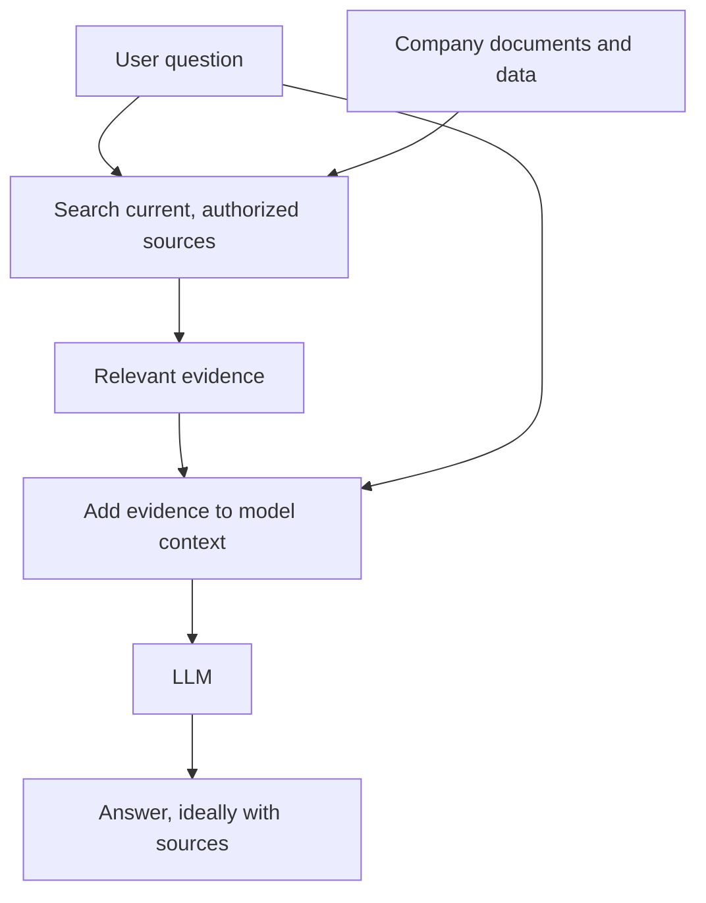
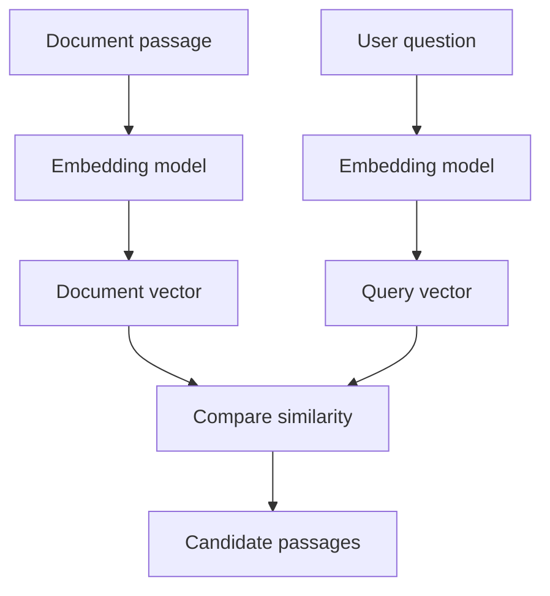
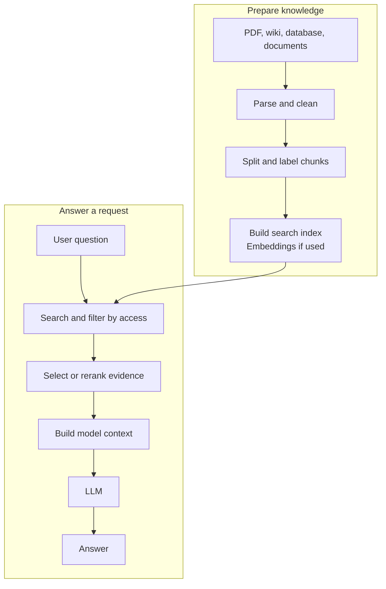

Imagine hiring an expert who has read widely, writes clearly, and reasons well. On their first day, you ask, "What is our latest remote-work policy?" They cannot answer. Not because they lack intelligence, but because they have never read your company's policy.

Ask how much revenue the Hanoi store lost last month, and the problem is even clearer: the relevant data lives in your business systems, not in the expert's head.

A large language model faces a similar limit. **RAG does not begin with a vector database. It begins with the gap between being able to reason about information and having the right information to reason with.**

In the [previous article](../production-ai-chatbot-request/), we followed one chatbot request and briefly passed through a box called "retrieval." Here is what that box is for.

## 1. A trained model is not a searchable filing cabinet

During training, a model learns patterns, relationships, and many useful facts. It can explain transformers or help write a Python function. But its knowledge is not organized as files it can open on demand, such as `current_policy.pdf` or `last_month_revenue.csv`.

The model's learned knowledge is encoded in its parameters. That makes it powerful, but does not give it a database-style operation that reliably finds a current record and shows where the answer came from.

The [original RAG paper by Lewis and colleagues](https://arxiv.org/abs/2005.11401) highlighted the difficulty of updating knowledge and providing provenance when relying on parameters alone. Their approach combined a model's *parametric* knowledge with external, retrievable *non-parametric* knowledge.

The key idea is simple: **let the model use what it has learned, while giving it a way to look up what it does not have.**

## 2. Fresh and private information lives outside the model

"Who is the CEO today?" and "What is this product's price now?" are time-sensitive questions. "What is our leave policy?" and "What happened to order 123?" may also depend on private data the model has never seen.

Training does not update a model's parameters every time a policy changes. Retraining to reflect a document edited this morning would usually be the wrong tool for the job. Retrieval offers another route:

The application gives the model the relevant policy or record *when the question is asked*. This is particularly useful for current, specialized, or private knowledge. It does not mean every private fact should be copied into a search index; permissions still have to be enforced.

## 3. Why not put every document in the prompt?

If your entire knowledge base is one short handbook and it fits comfortably within the model's usable context, you may not need retrieval at all. Put the document and question together and test the result. [Anthropic explicitly notes](https://www.anthropic.com/engineering/contextual-retrieval) that a small enough knowledge base can sometimes be included directly.

The trade-off changes when the collection grows from a handful of pages to thousands of documents. A user asks one question about probationary employees working from home. Perhaps only two paragraphs are relevant. Sending thousands of unrelated pages costs time and tokens, and may distract the model.

Retrieval filters the collection before generation:

> **Large document collection → find likely evidence → give the model a small, relevant context → answer.**

A larger context window does not make irrelevant material useful. Nor does it remove the need to decide which documents a user is allowed to read.

## 4. RAG in three words: retrieve, augment, generate

**Retrieval-Augmented Generation** describes a pattern, not a particular database product:

1. **Retrieve:** search for information relevant to the question.
2. **Augment:** add that information to the model's context.
3. **Generate:** ask the model to answer using the supplied context.

Suppose the question is, "How many leave days do probationary employees get?" Rather than asking the model to guess, the application might retrieve section 4.2 of the current employee handbook and include that passage with the question. The model now has evidence in front of it.

That is the useful intuition. RAG can make relevant sources available at inference time. It does **not** guarantee the retriever found the right source or that the model interpreted it correctly.

## 5. RAG and fine-tuning solve different problems

"Why not fine-tune the model on our handbook?" is a reasonable question. But fine-tuning and RAG usually address different primary limitations:

| Question | More direct starting point |
| --- | --- |
| "What does the latest policy say?" | Retrieve the current policy |
| "Can the model consistently follow our output format or task style?" | Improve instructions and evals; consider fine-tuning |
| "We need both current facts and reliable task behavior." | Consider combining methods |

Fine-tuning adapts model behavior or performance on a task. RAG changes the information visible *for this answer*. If a policy changes weekly, updating the source and its index is usually more flexible than training a new model each time. [AWS compares](https://docs.aws.amazon.com/prescriptive-guidance/latest/retrieval-augmented-generation-options/rag-vs-fine-tuning.html) the two approaches and notes that they can also be combined.

This is not "RAG versus fine-tuning: which wins?" The better question is **"Is the failure caused by missing knowledge, poor task behavior, or both?"**

## 6. RAG is not a synonym for vector database

A vector database is one way to support retrieval. It is not the definition of RAG.

Imagine a document that says "Employees may work off-site up to two days per week," while a user asks, "How many days can I WFH?" The words differ, but the meaning is related. An embedding model can turn passages and queries into vectors so semantic search has a chance to find that connection.

But exact strings such as an order number, product code, or error ID can be better served by keyword matching. Retrieval may use semantic search, keyword search, SQL, metadata filters, APIs, or a hybrid of several methods. [OpenAI's retrieval documentation](https://developers.openai.com/api/docs/guides/retrieval) includes hybrid search that combines semantic and textual signals; [Anthropic discusses](https://www.anthropic.com/engineering/contextual-retrieval) why exact-match methods such as BM25 can complement embeddings.

Having a vector database means you have a way to store and search vectors. It does not mean your RAG system retrieves the right evidence.

## 7. Wrong retrieval can produce a fluent wrong answer

The ideal flow is "question → relevant source → model → correct answer." Now replace the source with the wrong one.

A user asks for the 2026 leave policy. The retriever returns a 2024 policy. The model may write a polished answer grounded in the *wrong* document. RAG has not magically removed hallucinations or stale information; it has introduced another part of the system that must be evaluated.

Retrieval can fail because a document was never indexed, a chunk lost its meaning, an exact code was missed, the query was vague, a filter excluded the right document, a reranker chose poorly, or an obsolete version remained available.

That is why production RAG needs at least two questions:

- **Retrieval quality:** Did we find the right, current, authorized evidence?
- **Answer quality:** Given that evidence, did the model answer correctly and acknowledge uncertainty?

[OpenAI's accuracy guidance](https://developers.openai.com/api/docs/guides/optimizing-llm-accuracy) makes this distinction: the model can receive wrong or noisy context, or it can receive good context and still use it badly. Debugging requires knowing which side failed.

## 8. Chunking changes what search can find

Suppose a relevant paragraph is on page 172 of a 300-page PDF. Returning the entire PDF as one search result may not help much. RAG systems often split documents into smaller *chunks* so search can surface the passage near the answer.

But chunk size is a trade-off. Very large chunks bring extra noise. Very small chunks can lose the heading, company, date, or earlier sentence that explains them.

[Anthropic gives an example](https://www.anthropic.com/engineering/contextual-retrieval): a chunk saying a company's revenue rose 3% may be useless without the company name and quarter from its surrounding document. The solution is not simply "make every chunk bigger." It is to preserve enough context while keeping retrieval precise.

Chunk boundaries, metadata, overlap, and sometimes reranking all affect whether the right evidence reaches the model.

## 9. A RAG system has a preparation path and an answer path

The documents have to become searchable *before* the user asks a question. A practical system has two connected flows:

This is the same ingestion-versus-serving distinction described in [Google Cloud's RAG architecture](https://docs.cloud.google.com/architecture/rag-genai-gemini-enterprise-vertexai?hl=en). A parser or embedding job is generally on the preparation path; a retriever, reranker, and prompt builder are on the request path. Errors on either side can spoil the final answer.

## 10. When should you *not* use RAG?

More components are not automatically better:

- Rewriting an email does not require outside knowledge. A direct model call may be enough.
- Asking about one small, available document may be simpler with the whole document in context.
- Fetching a user's current account balance may be better handled by an authorized database query or tool than by embedding rows in a vector store.
- Fixing unreliable JSON formatting is a behavior problem; retrieval may only add noise.

[OpenAI describes](https://developers.openai.com/api/docs/guides/optimizing-llm-accuracy) a case where adding RAG reduced accuracy because the problem was not missing context. Start by finding the actual failure, then choose a technique to address it.

## An open-book exam, not a magic answer machine

Without retrieval, a model answers using what it learned and what the current prompt already contains. RAG makes the task more like an open-book exam: find the right material, read the relevant passage, and reason from it.

Open-book does not mean automatic success. The system can open the wrong book, find the wrong page, or misread the right passage. But when a task depends on current, private, or very large collections of knowledge, the ability to look up evidence changes what the application can do.

> **RAG connects a model's ability to work with information to the information it needs right now.**

The idea is simple. Building it well leads to the harder questions: how to ingest documents, where to split them, when embeddings help, how to combine search methods, and how to tell whether a failure came from retrieval or generation.

## References

- [Lewis et al. - Retrieval-Augmented Generation for Knowledge-Intensive NLP Tasks](https://arxiv.org/abs/2005.11401)
- [Anthropic - Contextual Retrieval](https://www.anthropic.com/engineering/contextual-retrieval)
- [AWS - Comparing RAG and fine-tuning](https://docs.aws.amazon.com/prescriptive-guidance/latest/retrieval-augmented-generation-options/rag-vs-fine-tuning.html)
- [OpenAI Developers - Retrieval](https://developers.openai.com/api/docs/guides/retrieval)
- [OpenAI Developers - Optimizing LLM accuracy](https://developers.openai.com/api/docs/guides/optimizing-llm-accuracy)
- [Google Cloud - RAG architecture: ingestion and serving](https://docs.cloud.google.com/architecture/rag-genai-gemini-enterprise-vertexai?hl=en)

