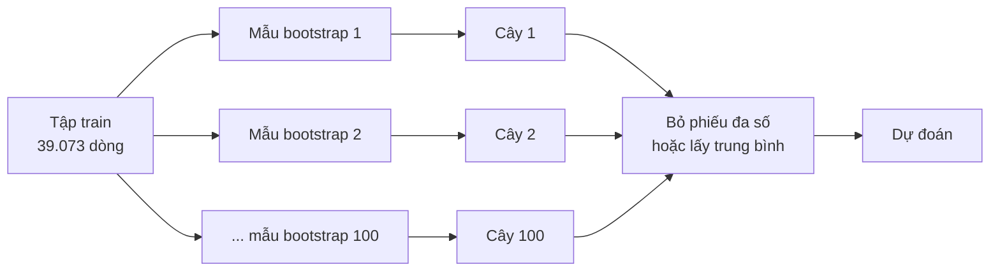

> **Mục tiêu bài học:** Sau bài này, bạn sẽ hiểu vì sao gom hàng trăm cây bất ổn lại được một mô hình ổn định, phân biệt hai cách gom - bagging/random forest (trồng song song rồi bỏ phiếu) và boosting (trồng nối tiếp, cây sau sửa lỗi cây trước) - đọc được out-of-bag và feature importance mà không bị đánh lừa, chạy được `RandomForestClassifier` và `HistGradientBoostingClassifier` trên `adult`, và biết vì sao mô hình cây vẫn hay thắng trên dữ liệu bảng.

## 1. 787 người đoán cân nặng một con bò

Một hội chợ gia súc ở Plymouth (Anh). Một con bò được đưa ra, ai muốn tham gia thì ghi ước đoán cân nặng của nó *sau khi mổ*. Francis Galton mượn lại 787 tấm vé hợp lệ, xếp theo thứ tự và lấy con số đứng giữa: **1.207 pound**. Cân thật: **1.198 pound** - lệch chưa tới 1%. Ông đăng kết quả trên tạp chí *Nature* ngày 7/3/1907 dưới tựa "Vox Populi" (tiếng nói của số đông).

Phần đông người đoán không phải chuyên gia. Từng người sai - người đoán quá, người đoán thiếu - nhưng gộp lại, các sai lệch ngược chiều *triệt tiêu* bớt. Điều kiện ngầm: các ước đoán phải **đủ khác nhau**; 787 người cùng chép một đáp án thì gộp lại chẳng khá hơn một người.

Đó là ý tưởng của **ensemble (mô hình tổ hợp)**: nhiều mô hình, mỗi cái sai một kiểu, gộp lại tốt hơn từng thành viên. Bài 06 kết thúc đúng ở chỗ này: cây quyết định *bất ổn* - đổi 20% dữ liệu train là đổi cả câu hỏi gốc. Theo hình ảnh bắn bia của Foundations · Bài 14, cây sâu là mô hình **bias thấp, variance cao**: đạn quanh tâm nhưng tản mát; trung bình của nhiều phát tản mát thì chụm lại. Câu hỏi còn lại: lấy đâu ra "787 cái cây khác nhau" khi chỉ có một tập train?

> 🔧 **Thử ngay:** ba người đoán độc lập, mỗi người đúng 70%. Xác suất *đa số* (ít nhất 2/3) đúng là bao nhiêu?
> Đúng cả ba: $0{,}7^3 = 0{,}343$; chỉ đúng hai người: $3 \times 0{,}7^2 \times 0{,}3 = 0{,}441$. Cộng lại: **0,784** - cao hơn 0,7 của từng người. Với 11 người: ≈ 0,92; 101 người: ≈ 1,00. Chữ "độc lập" là chỗ mấu chốt - mục 2 và 3 nói về cách tạo ra sự độc lập ấy.

## 2. Bagging: 100 tập train từ một tập train

Không có 100 tập train thì *tạo* ra chúng. **Bootstrap**: từ 39.073 dòng train của `adult`, rút ngẫu nhiên 39.073 dòng **có hoàn lại** - một dòng có thể được rút hai, ba lần, dòng khác không lần nào. Lặp 100 lần được 100 tập train "na ná mà khác nhau". Trên mỗi tập trồng một cây sâu hết cỡ, rồi dự đoán bằng **bỏ phiếu đa số** (phân loại) hoặc **lấy trung bình** (hồi quy). Kỹ thuật này gọi là **bagging** (bootstrap aggregating).



Một con số đáng ngạc nhiên: mỗi mẫu bootstrap chỉ chứa khoảng **63,2%** số dòng gốc; 36,8% còn lại không được rút lần nào. Những dòng bị bỏ sót gọi là **out-of-bag (OOB)** - và chúng là bộ kiểm tra miễn phí: với mỗi dòng, chỉ những cây *chưa từng thấy* dòng đó mới được bỏ phiếu, rồi so với nhãn thật. Trên `adult`, OOB accuracy của bagging là ≈ 85,1%, còn test set thật cho ≈ 85,9% - hai ước lượng gần nhau mà OOB không tốn thêm dữ liệu. Sách *An Introduction to Statistical Learning* nhận xét với số cây đủ lớn, sai số OOB gần như tương đương leave-one-out cross-validation.

> 🔧 **Thử ngay:** vì sao 63,2%? Xác suất một dòng cụ thể *không* được rút trong một lần là $1 - 1/n$; không được rút trong cả $n$ lần là $(1 - 1/n)^n$. Tính xác suất *có mặt* $1 - (1 - 1/n)^n$ với $n = 10$, $1.000$, $39.073$.
> Đáp số: ≈ **0,651; 0,632; 0,632** - tiến về $1 - 1/e \approx 0{,}632$. Mô phỏng bằng `numpy` (`rng.choice(n, n, replace=True)`, seed 42) trên 39.073 dòng: 63,3% dòng xuất hiện.

## 3. Random forest: bắt các cây "khác ý" nhau

Chạy bagging trên `adult` với 100 cây, mỗi cây được xem cả 105 cột sau one-hot. Vấn đề lộ ra ngay: những cột tách "ngọt" hơn cả - tình trạng hôn nhân, lãi vốn (Bài 06) - được chọn ở gốc của gần như *mọi* cây. 100 cây na ná nhau, phiếu bầu na ná nhau. Sách *An Introduction to Statistical Learning* nói thẳng: lấy trung bình nhiều đại lượng *tương quan cao* không giảm variance được bao nhiêu. Đúng cảnh 787 người chép chung một đáp án.

**Random forest (rừng ngẫu nhiên)** - Breiman, 2001 - chữa bằng một thay đổi nhỏ: tại **mỗi nhát cắt**, cây chỉ được xét một nhóm cột chọn ngẫu nhiên, thường $m \approx \sqrt{p}$. Trên `adult`, `max_features="sqrt"` (mặc định của `RandomForestClassifier`) nghĩa là mỗi nhát cắt chỉ nhìn **10 trong 105 cột**. Nghe như tự trói tay, nhưng nhờ vậy các cây buộc phải dùng những cột khác nhau - sách gọi là *decorrelate* - và trung bình của chúng đáng tin hơn. Phần thưởng kèm theo: fit nhanh hơn (1,8 giây so với 8,2 giây của bagging).

Cùng pipeline tiền xử lý của Bài 03 và Bài 06 (điền thiếu, one-hot; chia 80/20, `random_state=42`), trên 9.769 dòng test:

| Mô hình | Accuracy | F1 (lớp >50K) | ROC-AUC | Accuracy train |
|---|---|---|---|---|
| Hồi quy logistic (Bài 03) | ≈ 85,2% | ≈ 0,656 | ≈ 0,904 | 85,2% |
| Cây đơn, không giới hạn (Bài 06) | ≈ 81,5% | ≈ 0,616 | ≈ 0,749 | 99,99% |
| Cây đơn, `max_depth=8` (Bài 06) | ≈ 85,8% | ≈ 0,652 | ≈ 0,904 | 86,2% |
| Bagging, 100 cây | ≈ 85,9% | ≈ 0,681 | ≈ 0,904 | 99,99% |
| Random forest, 100 cây | ≈ 86,0% | ≈ 0,685 | ≈ 0,904 | 99,98% |
| Gradient boosting (mục 4) | ≈ 87,5% | ≈ 0,715 | ≈ 0,929 | 88,3% |

Đọc bảng: 100 cây không giới hạn - loại cây mà một mình chỉ được 81,5% - gộp lại thành 86,0%, hơn cả cây đã tỉa và hơn hồi quy logistic ở F1. Accuracy train vẫn 99,98% nhưng test không sụp: variance đã bị trung bình hóa. Số cây không phải núm nhạy: 10 cây 85,4%, 30 cây 85,7%, 100 cây 86,0%, 300 cây 85,9% - sách nhận xét bagging và random forest **không overfit khi thêm cây**, chỉ tốn thời gian. Cây bớt sâu một chút (`min_samples_leaf=5`) còn nhích lên 86,6%, AUC 0,917.

```python
import pandas as pd
from sklearn.datasets import fetch_openml
from sklearn.model_selection import train_test_split
from sklearn.compose import ColumnTransformer
from sklearn.impute import SimpleImputer
from sklearn.pipeline import make_pipeline
from sklearn.preprocessing import OneHotEncoder
from sklearn.ensemble import RandomForestClassifier, HistGradientBoostingClassifier
from sklearn.metrics import accuracy_score, f1_score, roc_auc_score
from sklearn.inspection import permutation_importance

adult = fetch_openml("adult", version=2, as_frame=True)
X, y = adult.data, (adult.target == ">50K").astype(int)                   # nhãn 1 = thu nhập > 50K (Bài 03)
X_train, X_test, y_train, y_test = train_test_split(X, y, test_size=0.2, random_state=42, stratify=y)
num = X.select_dtypes("number").columns;  cat = X.select_dtypes(exclude="number").columns
pre = ColumnTransformer([("num", SimpleImputer(strategy="median"), num),   # cây không cần scale (Bài 06)
                         ("cat", make_pipeline(SimpleImputer(strategy="most_frequent"),
                                               OneHotEncoder(handle_unknown="ignore", sparse_output=False)), cat)])
rf  = make_pipeline(pre, RandomForestClassifier(n_estimators=100, oob_score=True, random_state=42, n_jobs=-1))
hgb = make_pipeline(pre, HistGradientBoostingClassifier(random_state=42))
for model_name, m in [("random forest", rf), ("gradient boosting", hgb)]:
    m.fit(X_train, y_train); p = m.predict(X_test); probabilities = m.predict_proba(X_test)[:, 1]
    print(model_name, round(accuracy_score(y_test, p), 3), round(f1_score(y_test, p), 3), round(roc_auc_score(y_test, probabilities), 3))
print("OOB:", round(rf[-1].oob_score_, 3))                                  # 0.85
imp = permutation_importance(rf, X_test, y_test, n_repeats=5, random_state=42, n_jobs=-1)   # xáo trộn từng cột gốc
print(pd.Series(imp.importances_mean, index=X_test.columns).sort_values(ascending=False).head(5).round(3))
# capital-gain 0.043, marital-status 0.019, occupation 0.017, age 0.015, hours-per-week 0.012
```

Đổi lại, rừng 100 cây không còn đọc được như một sơ đồ; thứ còn lại là **feature importance (độ quan trọng của feature)** - và hai cách tính cho hai câu trả lời khác nhau. Cách thứ nhất, `feature_importances_`: cộng tổng mức giảm Gini mà mỗi cột mang lại qua mọi nhát cắt của mọi cây. Trên rừng vừa chạy, cột đứng đầu là `fnlwgt` (0,171), rồi `age` (0,152). Nhưng `fnlwgt` là *trọng số điều tra* - số người mà một dòng đại diện, gần như vô nghĩa với thu nhập - và có 28.523 giá trị khác nhau. Cách thứ hai, **permutation importance**: xáo trộn ngẫu nhiên *một* cột trên tập test rồi xem accuracy giảm bao nhiêu. Kết quả: `capital-gain` −4,3 điểm, `marital-status` −1,9, `occupation` −1,7, `age` −1,5, `hours-per-week` −1,2; `fnlwgt` chỉ −0,3, thứ 10 trong 14 cột.

> ⚠️ **Lưu ý nhỏ:** tài liệu scikit-learn cảnh báo `feature_importances_` (dựa trên độ giảm impurity) có hai lỗi: tính trên *tập train* nên phản ánh cả phần học tủ, và **thiên vị cột có nhiều giá trị khác nhau** - một cột số liên tục có hàng vạn ngưỡng để "thử", nên dễ được chọn cắt hơn cột 0/1 dù chẳng hữu ích hơn. `fnlwgt` đứng đầu chính vì thế. Permutation importance (`sklearn.inspection.permutation_importance`) tính trên dữ liệu chưa thấy và không mắc lỗi này; Bài 11 và Bài 12 sẽ dùng lại.

## 4. Boosting: cây sau học từ lỗi của cây trước

Bình ở Foundations · Bài 04 có một thói quen khác An: làm một đề, chấm, rồi *chỉ ôn lại những câu sai*, làm tiếp đề sau. **Boosting** trồng cây theo đúng tinh thần ấy. Không bootstrap, không song song: cây 1 học dữ liệu; tính phần còn sai (**residual**); cây 2 học *phần còn sai đó*; cộng dồn; lại tính residual; cây 3... Mỗi cây nhỏ (vài tầng) và chỉ được cộng vào **một phần** - nhân với **learning rate** $\lambda$ (sách gọi là *shrinkage*, thường 0,01-0,1) - để mô hình "học chậm", giống người xuống núi trong sương mù ở Foundations · Bài 11: bước từng bước ngắn.

```mermaid
flowchart LR
    F0["Dự đoán ban đầu<br/>(trung bình, hoặc tỷ lệ lớp)"] --> R1["Residual = phần còn sai"]
    R1 --> T1["Cây 1 học residual"]
    T1 -- "nhân learning rate" --> F1["Dự đoán mới =<br/>dự đoán cũ + λ × cây 1"]
    F1 --> R2["Residual mới<br/>(đã nhỏ hơn)"]
    R2 --> T2["Cây 2 học residual mới"]
    T2 -- "nhân learning rate" --> F2["Dự đoán mới =<br/>dự đoán cũ + λ × cây 2"]
    F2 --> M["... cây 3, 4, ..., B"]
```



Tính tay cho một căn nhà giá thật 10 (đơn vị tùy ý), dự đoán ban đầu là trung bình 6. Residual 4. Cây 1 học đúng residual đó và đề nghị "+4"; với $\lambda = 0{,}1$ ta chỉ cộng 0,4 → 6,4. Residual còn 3,6 → cây 2 đề nghị +3,6, cộng 0,36 → 6,76. Sau 10 cây: ≈ 8,61; phần còn sai co lại còn $4 \times 0{,}9^{10} \approx 1{,}39$. Chậm - nhưng đó là chủ ý: mỗi cây chỉ sửa một chút, cây sau còn đất để sửa theo cách khác. Sách *An Introduction to Statistical Learning* tóm gọn: các phương pháp *learn slowly* thường tổng quát hóa tốt.

**Gradient boosting** - Friedman, 2001 - là bản tổng quát: với hàm loss bất kỳ (log loss cho phân loại, MSE cho hồi quy), cây mới học **gradient âm của loss** theo dự đoán hiện tại - đúng nghĩa xuống núi, chỉ khác mỗi bước xuống là một cái cây. Ba núm vặn: số cây $B$, learning rate $\lambda$, độ sâu mỗi cây. Và một khác biệt lớn với random forest: **boosting có thể overfit khi quá nhiều cây**. Trên `adult` với $\lambda = 0{,}1$: 10 cây 85,4%, 50 cây 87,4%, 100 cây 87,5%, 300 cây 87,5% (train 90,1%), 1.000 cây tụt xuống 86,9% (train 94,7%). Đổi $\lambda$ với 100 cây: 0,01 chưa học đủ (85,2%), 1,0 bước quá dài (84,8%).

Lớp `HistGradientBoostingClassifier` của scikit-learn - "Hist" vì nó gom mỗi cột số vào tối đa 255 ngăn (histogram) để tìm ngưỡng cắt rất nhanh, cách làm lấy cảm hứng từ LightGBM - mặc định 100 cây, $\lambda = 0{,}1$, và **tự dừng sớm** khi dữ liệu trên 10.000 dòng: nó cắt 10% train làm validation, ngừng khi điểm không cải thiện nữa - đúng cách An & Bình giữ riêng một tập đề để biết lúc nào nên dừng ôn (Foundations · Bài 04), nay máy tự lo. Trên `adult` nó đạt 87,5%, AUC 0,929, fit trong 1 giây: cao nhất bảng ở mục 3, hơn hồi quy logistic 2,2 điểm accuracy và 0,06 F1. Cross-validation 5 phần trên train cho cùng thứ hạng: logistic 85,1%, random forest 85,1%, gradient boosting 87,3%.

> 🔧 **Thử ngay:** cho `HistGradientBoostingClassifier(random_state=42)` ăn thẳng `X_train` *chưa qua* `pre` - không điền thiếu, không one-hot.
> Đáp số: chạy được, accuracy ≈ **0,877**, AUC ≈ 0,929, fit ≈ 0,3 giây, dừng sớm ở 80 cây (`hgb.n_iter_`). Lớp này xử lý `NaN` và cột kiểu `category` của pandas một cách tự nhiên: với ô thiếu, mỗi nhát cắt tự học nên đưa nó sang nhánh nào. Trong bài ta vẫn dùng chung `pre` để so sánh công bằng với các mô hình khác.

Cùng họ **GBDT (gradient-boosted decision trees)** còn có XGBoost (Chen & Guestrin, 2016), LightGBM (Microsoft) và CatBoost (Yandex) - khác nhau ở tốc độ, cách xử lý cột chữ và vài kỹ thuật regularization, cùng một ý tưởng lõi. Để học và cho phần lớn bài toán cỡ vừa, lớp của scikit-learn là đủ.

> ⚠️ **Lưu ý nhỏ:** ví dụ tính tay ở trên là bản *hồi quy* để dễ hình dung. Với phân loại, "residual" là gradient của log loss theo điểm số (log-odds) hiện tại, và dự đoán cuối đi qua sigmoid như Bài 03 - cơ chế cộng dồn từng cây vẫn y nguyên. Learning rate và số cây kéo co nhau: tài liệu scikit-learn ghi rõ $\lambda$ nhỏ hơn cần nhiều cây hơn để giữ cùng sai số train; hãy để early stopping chọn số cây thay vì đoán.

## 5. Vì sao mô hình cây hay thắng trên dữ liệu bảng

Năm 2015, trong 29 lời giải thắng cuộc được đăng trên blog Kaggle, **17** lời giải dùng XGBoost - con số do chính tác giả XGBoost thống kê (Chen & Guestrin, KDD 2016). Bảy năm sau, khi deep learning đã chiếm lĩnh ảnh và văn bản, Grinsztajn, Oyallon và Varoquaux (NeurIPS 2022, Datasets and Benchmarks) hỏi thẳng: *trên dữ liệu bảng thì sao?* Họ dựng 45 bộ dữ liệu bảng cỡ trung (khoảng 10.000 dòng), tinh chỉnh kỹ cả hai phía, và kết luận: các mô hình dựa trên cây (random forest, GBDT) vẫn dẫn đầu trên bộ benchmark đó, chưa tính lợi thế tốc độ.

Ba lý do họ tìm ra khá "đời": mạng nơ-ron thiên về hàm *trơn*, trong khi quan hệ trong dữ liệu bảng hay *gồ ghề* (một ngưỡng thu nhập, một mốc tuổi) - đúng thứ cây làm bằng nhát cắt; mạng nơ-ron bị các **cột vô nghĩa** làm hại nhiều hơn cây; và cây cắt *từng cột một*, nên giữ nguyên ý nghĩa của từng cột thay vì trộn chúng lại.

Ứng dụng thật của "đám đông cây" có từ trước làn sóng deep learning: cảm biến Kinect của Xbox nhận diện 31 bộ phận cơ thể từ ảnh độ sâu bằng một rừng ngẫu nhiên phân loại từng pixel, chạy 200 khung hình/giây (Shotton và cộng sự, CVPR 2011). Ở Việt Nam, một nghiên cứu của Trường Đại học Ngoại thương đăng trên chuyên trang Nghiên cứu Kinh tế - Tài chính của Bộ Tài chính (2026) dùng XGBoost dự báo vỡ nợ cho 1.462 doanh nghiệp nhỏ và vừa từ dữ liệu kế toán, hóa đơn điện tử và sao kê ngân hàng, đạt AUC ≈ 0,86 - feature quan trọng nhất là tỷ lệ dòng tiền vào trên giá trị hóa đơn đã xuất.

Bài 03 đã nói vì sao ngân hàng vẫn hay chọn hồi quy logistic: cơ quan quản lý cần lý do. Rừng cây và boosting đổi khả năng đọc sơ đồ lấy độ chính xác; permutation importance là một phần bù đắp, và Bài 12 sẽ dùng nó để giải thích mô hình cuối. Gói lại hai cách gom cây bằng ngôn ngữ bias-variance của Foundations · Bài 14:

| | Bagging / Random forest | Gradient boosting |
|---|---|---|
| Cây thành viên | Sâu, trồng độc lập, song song | Nông, trồng nối tiếp |
| Nguồn "khác ý" | Bootstrap + chọn cột ngẫu nhiên | Mỗi cây học phần cây trước còn sai |
| Tác dụng chính | Giảm **variance** của cây sâu | Kéo **bias** của cây nông xuống từng bước |
| Thêm cây mãi | Sai số thường ổn định lại, cái tăng là chi phí | Có thể overfit → early stopping |
| Núm chính | `n_estimators`, `max_features`, `min_samples_leaf` | `learning_rate`, `max_iter`, `max_depth` / `max_leaf_nodes` |

## Tóm tắt bài học

- Ensemble = gộp nhiều mô hình sai *theo kiểu khác nhau*; con số đứng giữa của 787 ước đoán trong ví dụ Galton lệch chưa tới 1%. Ba người đúng 70% bỏ phiếu độc lập → 78,4%; điều kiện là "khác ý".
- Bagging tạo 100 tập train bằng bootstrap (mỗi mẫu chứa ≈ 63,2% dòng gốc), trồng cây sâu rồi bỏ phiếu/lấy trung bình; 36,8% dòng out-of-bag cho ước lượng test miễn phí (85,1% so với 85,9% test thật).
- Random forest thêm ngẫu nhiên ở mỗi nhát cắt (`max_features="sqrt"`: 10/105 cột) để các cây bớt tương quan; trên `adult` 100 cây đạt 86,0%, F1 0,685 - cây đơn đã tỉa 85,8%, logistic 85,2%; thêm cây thì sai số thường ổn định lại chứ không xấu đi, cái tăng lên chủ yếu là chi phí tính toán.
- `feature_importances_` thiên vị cột nhiều giá trị (`fnlwgt` đứng đầu dù nó là trọng số lấy mẫu của cuộc điều tra chứ không phải thuộc tính của người được khảo sát); permutation importance trên test đưa `capital-gain`, `marital-status`, `occupation` lên đầu.
- Boosting trồng cây nối tiếp, mỗi cây học phần còn sai (gradient của loss), cộng dồn với learning rate; quá nhiều cây thì overfit (1.000 cây: 86,9% so với 87,5% ở 100 cây) → early stopping.
- `HistGradientBoostingClassifier` đạt 87,5%, F1 0,715, AUC 0,929 trong 1 giây, tự xử lý `NaN` và cột chữ; cùng họ với XGBoost, LightGBM, CatBoost.
- Bagging giảm variance, boosting giảm bias; trên dữ liệu bảng cỡ vừa, mô hình cây vẫn dẫn đầu benchmark 45 bộ dữ liệu của Grinsztajn và cộng sự (2022).

## Câu hỏi tự kiểm tra

1. Vì sao 787 người đoán cân bò gộp thành kết quả tốt, trong khi 100 cây bagging "chép chung một câu hỏi gốc" thì gộp lại chẳng hơn bao nhiêu? Random forest sửa điều đó bằng cách nào?
2. **Tính tay:** với $n = 4$ dòng, xác suất một dòng cụ thể có mặt trong mẫu bootstrap là bao nhiêu? (Đáp số để tự kiểm: $1 - (3/4)^4 \approx 0{,}684$.) Vì sao OOB là ước lượng sai số hợp lệ mà không cần tách validation?
3. Random forest trên `adult` có accuracy train 99,98% nhưng test 86,0% và không giảm khi thêm 300 cây. Boosting với 1.000 cây thì train 94,7%, test tụt xuống 86,9%. Giải thích khác biệt bằng bias-variance.
4. **Tính tay:** boosting với learning rate 0,5, giá thật 10, dự đoán ban đầu 6, mỗi cây học đúng residual. Dự đoán sau 3 cây là bao nhiêu? So với $\lambda = 0{,}1$ ở mục 4, vì sao người ta vẫn thích $\lambda$ nhỏ?
5. Sếp nhìn `feature_importances_` và kết luận "`fnlwgt` là yếu tố quyết định thu nhập". Bạn phản biện thế nào, và đề xuất tính gì thay thế?
6. Bạn có bảng 8.000 dòng, 40 cột lẫn số và chữ, cần mô hình chính xác trong một buổi chiều. Bạn thử những gì theo thứ tự nào, và vì sao vẫn nên chạy hồi quy logistic làm mốc?

## Đọc thêm

**Nguồn nền tảng của bài:**

| Nguồn | Đọc phần nào |
|---|---|
| **An Introduction to Statistical Learning (ISLP)** | Chương 8, mục 8.2.1 - bagging, out-of-bag, variable importance (dữ liệu Heart); 8.2.2 - random forest và $m \approx \sqrt{p}$; 8.2.3 - boosting, Algorithm 8.2, ba tham số $B$, $\lambda$, $d$; 8.2.5 - tóm tắt các cách gom cây; 8.3.3-8.3.4 - lab với `RandomForestRegressor`, `GradientBoostingRegressor` |
| **scikit-learn User Guide** | Mục 1.11 *Ensembles* - random forest (`max_features`, `oob_score`), gradient boosting (`learning_rate`, early stopping), cảnh báo về impurity-based importance; mục 5.2 *Permutation feature importance* |

**Nguồn online bổ sung (miễn phí):**

- [Permutation Importance vs Random Forest Feature Importance (MDI) - scikit-learn](https://scikit-learn.org/stable/auto_examples/inspection/plot_permutation_importance.html) - ví dụ chính chủ: cột số ngẫu nhiên "quan trọng" hơn cột thật khi dùng impurity.
- [HistGradientBoostingClassifier - scikit-learn](https://scikit-learn.org/stable/modules/generated/sklearn.ensemble.HistGradientBoostingClassifier.html) - tham số `learning_rate`, `max_iter`, `early_stopping`, `categorical_features`.
- [Grinsztajn, Oyallon, Varoquaux - Why do tree-based models still outperform deep learning on typical tabular data? (NeurIPS 2022)](https://arxiv.org/abs/2207.08815) - benchmark 45 bộ dữ liệu và ba lý do về inductive bias.
- [Chen & Guestrin - XGBoost: A Scalable Tree Boosting System (KDD 2016)](https://arxiv.org/abs/1603.02754) - bài báo gốc, có thống kê 17/29 lời giải Kaggle 2015.
- [Breiman - Random Forests (Machine Learning, 2001)](https://link.springer.com/article/10.1023/A:1010933404324) - bài báo gốc, giới thiệu out-of-bag và variable importance.
- [Galton - Vox Populi (Nature, 1907)](https://www.nature.com/articles/075450a0) - hai trang, dễ đọc, về 787 phiếu đoán cân bò.
- [Shotton và cộng sự - Real-Time Human Pose Recognition in Parts from Single Depth Images (CVPR 2011)](https://web.cs.ucdavis.edu/~yjlee/teaching/ecs289h-fall2014/kinect.pdf) - rừng ngẫu nhiên bên trong Kinect.
- [Nguyễn Đức Duy, Nguyễn Việt Dũng - Ứng dụng Machine Learning trong dự báo vỡ nợ doanh nghiệp nhỏ và vừa tại Việt Nam (chuyên trang Nghiên cứu Kinh tế - Tài chính, Bộ Tài chính, 2026)](https://nghiencuu.tapchikinhtetaichinh.vn/ung-dung-machine-learning-trong-du-bao-vo-no-doanh-nghiep-nho-va-vua-tai-viet-nam-155417.html) - XGBoost trên 1.462 doanh nghiệp Việt Nam.

> **Bài tiếp theo:** [SVM: tìm lề phân cách rộng nhất](../svm-finding-the-widest-boundary-vi/) - rừng cây thắng bằng số đông; bài sau là một mô hình thắng bằng *hình học* - trong vô số đường tách được hai lớp, chọn đường có lề rộng nhất, và chỉ vài điểm sát lề quyết định nó.
